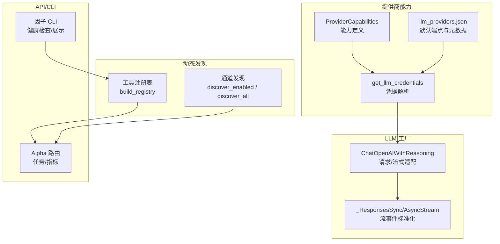
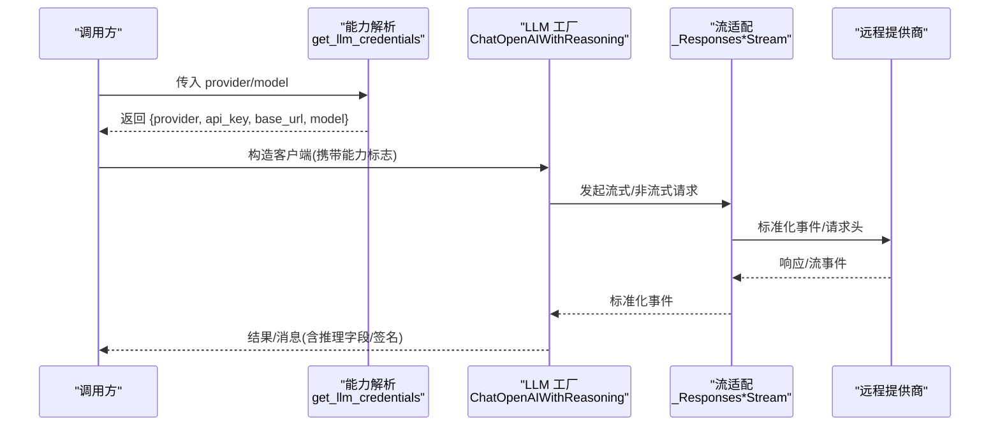
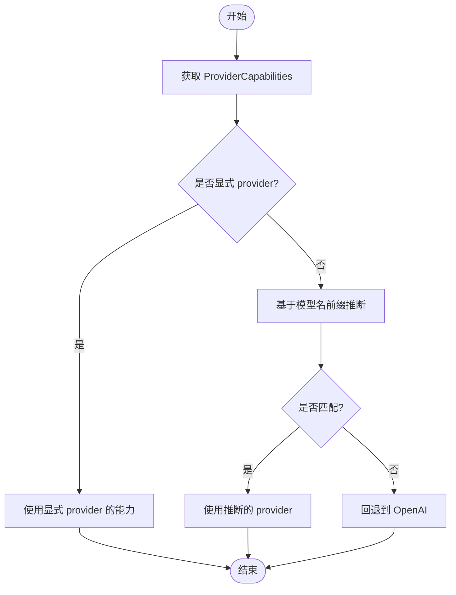
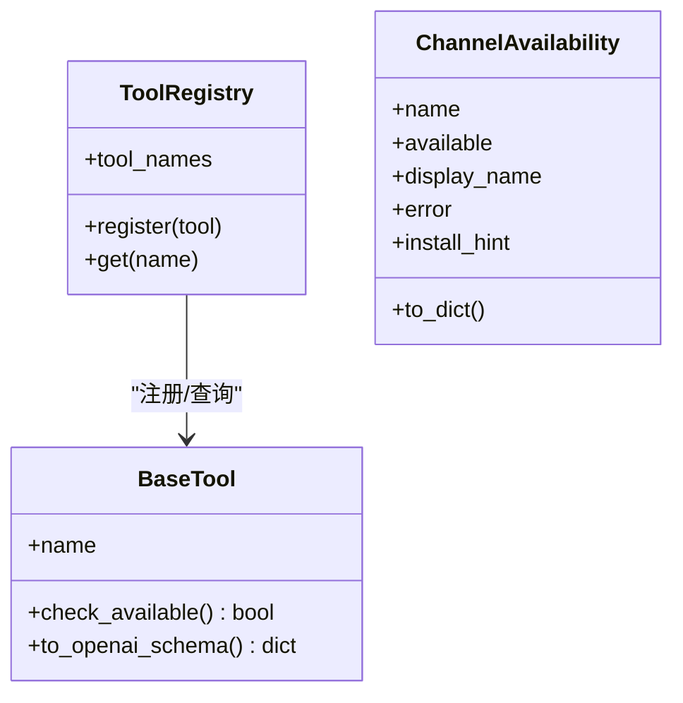
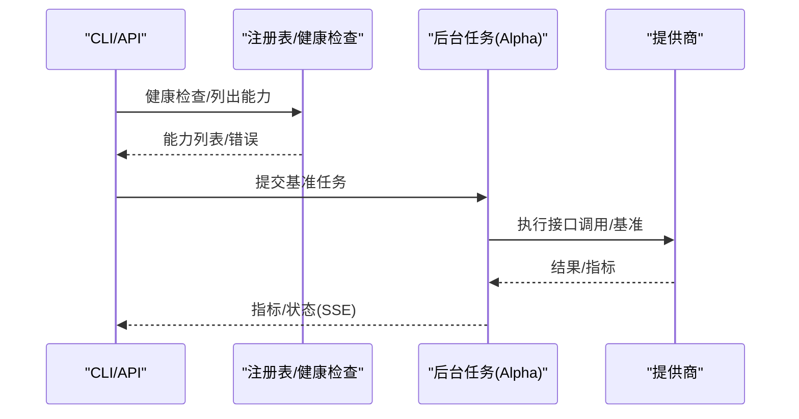
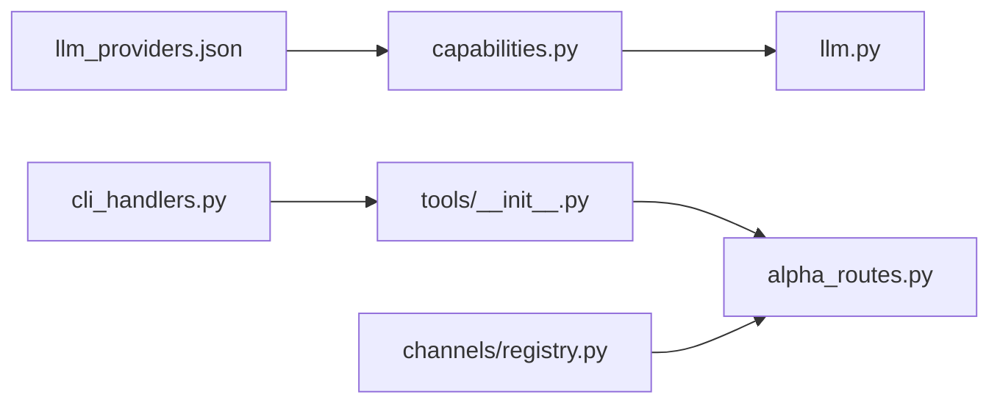

# 能力发现与管理

<cite>
**本文引用的文件**
- [capabilities.py](file://agent/src/providers/capabilities.py)
- [llm_providers.json](file://agent/src/providers/llm_providers.json)
- [llm.py](file://agent/src/providers/llm.py)
- [tools/__init__.py](file://agent/src/tools/__init__.py)
- [channels/registry.py](file://agent/src/channels/registry.py)
- [alpha_routes.py](file://agent/src/api/alpha_routes.py)
- [cli_handlers.py](file://agent/src/factors/cli_handlers.py)
</cite>

## 目录
1. [简介](#简介)
2. [项目结构](#项目结构)
3. [核心组件](#核心组件)
4. [架构总览](#架构总览)
5. [详细组件分析](#详细组件分析)
6. [依赖关系分析](#依赖关系分析)
7. [性能考量](#性能考量)
8. [故障诊断指南](#故障诊断指南)
9. [结论](#结论)
10. [附录](#附录)

## 简介
本技术文档聚焦“提供商能力发现与管理”的完整实现与使用方式，覆盖以下目标：
- 能力接口的抽象设计：能力定义、元数据提取、版本兼容性检查等机制。
- 动态扫描系统：插件发现算法、能力注册表维护、依赖关系解析。
- 能力验证流程：接口测试、性能基准、功能完整性检查。
- 能力扩展点：自定义能力开发、热重载机制、冲突解决策略。
- 能力监控仪表板：使用统计、性能指标、错误追踪。
- 故障诊断工具与调试指南：帮助开发者有效管理与扩展提供商能力。

## 项目结构
围绕能力发现与管理的关键代码分布在以下模块：
- 提供商能力定义与凭据解析：位于 providers 包，提供 ProviderCapabilities、默认基础 URL 目录、凭据解析与模型推断。
- LLM 工厂与请求适配：封装不同提供商的请求构造、流式事件适配、头部隔离与推理字段处理。
- 工具与通道自动发现：通过包扫描与子类收集构建工具注册表；通道适配器通过内置模块与外部 entry_points 发现。
- API 与 CLI：提供后台任务管理、指标输出与能力健康检查命令。

**图表来源**
- [capabilities.py:16-56](file://agent/src/providers/capabilities.py#L16-L56)
- [llm_providers.json:1-236](file://agent/src/providers/llm_providers.json#L1-L236)
- [llm.py:249-607](file://agent/src/providers/llm.py#L249-L607)
- [tools/__init__.py:33-245](file://agent/src/tools/__init__.py#L33-L245)
- [channels/registry.py:87-284](file://agent/src/channels/registry.py#L87-L284)
- [alpha_routes.py:49-63](file://agent/src/api/alpha_routes.py#L49-L63)
- [cli_handlers.py:271-307](file://agent/src/factors/cli_handlers.py#L271-L307)

**章节来源**
- [capabilities.py:16-56](file://agent/src/providers/capabilities.py#L16-L56)
- [llm_providers.json:1-236](file://agent/src/providers/llm_providers.json#L1-L236)
- [llm.py:249-607](file://agent/src/providers/llm.py#L249-L607)
- [tools/__init__.py:33-245](file://agent/src/tools/__init__.py#L33-L245)
- [channels/registry.py:87-284](file://agent/src/channels/registry.py#L87-L284)
- [alpha_routes.py:49-63](file://agent/src/api/alpha_routes.py#L49-L63)
- [cli_handlers.py:271-307](file://agent/src/factors/cli_handlers.py#L271-L307)

## 核心组件
- 能力定义与查询
  - ProviderCapabilities：描述提供商的认证环境变量、基础 URL 变量、是否捕获/发送推理内容、是否支持特定字段（如 reasoning_effort）、默认请求头、原生适配器包名等。
  - get_provider_capabilities：根据 provider/model 返回能力记录；未知时回退到 OpenAI。
  - _infer_from_model：基于模型名前缀推断提供商（如 gemini、deepseek、nvidia/glm/kimi/moonshot）。
- 元数据与默认端点
  - llm_providers.json：集中声明各提供商的标签、默认模型、默认基础 URL、是否需要 API Key、认证类型与登录命令提示。
  - _provider_default_base_urls：从 JSON 加载 name->default_base_url 映射，供未显式设置 base_url 时使用。
- 凭据解析与环境融合
  - get_llm_credentials：按 provider→env→fallback→catalog 的顺序解析 api_key/base_url/model；对 Copilot 特殊处理 token；对 Ollama 规范化 /v1 根路径。
- LLM 工厂与请求适配
  - ChatOpenAIWithReasoning：在 LangChain ChatOpenAI 基础上增强推理字段捕获/注入、Gemini thought_signature 透传、请求头隔离（避免将 OpenAI 专属头发送到其他提供商）。
  - 流式事件适配：_ResponsesSyncStream/_ResponsesAsyncStream 将非结构化映射事件转换为 LangChain 期望的属性访问形态，保证 Responses 流兼容。
- 动态发现与注册
  - 工具注册表：通过 pkgutil 遍历 src/tools 并收集 BaseTool 子类，结合 check_available 过滤不可用工具；支持可选 MCP 远程工具合并。
  - 通道发现：内置通道通过包扫描，外部插件通过 entry_points 发现；inspect_channels 提供可用性与启用状态。
- API/CLI 支撑
  - Alpha 路由：进程内任务存储、SSE 心跳、后台任务生命周期管理，用于能力/因子基准任务的异步执行与结果轮询。
  - 因子 CLI：健康检查、错误列表打印、能力/因子元数据展示。

**章节来源**
- [capabilities.py:16-56](file://agent/src/providers/capabilities.py#L16-L56)
- [capabilities.py:248-300](file://agent/src/providers/capabilities.py#L248-L300)
- [capabilities.py:330-431](file://agent/src/providers/capabilities.py#L330-L431)
- [llm.py:249-607](file://agent/src/providers/llm.py#L249-L607)
- [tools/__init__.py:33-245](file://agent/src/tools/__init__.py#L33-L245)
- [channels/registry.py:87-284](file://agent/src/channels/registry.py#L87-L284)
- [alpha_routes.py:49-63](file://agent/src/api/alpha_routes.py#L49-L63)
- [cli_handlers.py:271-307](file://agent/src/factors/cli_handlers.py#L271-L307)

## 架构总览
下图展示了能力发现与管理在系统中的位置与交互：
- 配置层：llm_providers.json 提供默认端点与元数据；ProviderCapabilities 提供能力开关。
- 解析层：get_llm_credentials 统一解析凭据与环境变量，确保多提供商一致接入。
- 适配层：LLM 工厂对请求体、流式事件、请求头进行适配，屏蔽提供商差异。
- 发现层：工具与通道通过包扫描与 entry_points 动态发现，构建运行时可用的能力集合。
- 运行层：API/CLI 暴露能力健康检查、任务调度与指标输出。

**图表来源**
- [capabilities.py:362-431](file://agent/src/providers/capabilities.py#L362-L431)
- [llm.py:249-607](file://agent/src/providers/llm.py#L249-L607)

## 详细组件分析

### 能力定义与元数据提取
- ProviderCapabilities 字段说明
  - name：规范化的提供商名称。
  - api_key_env/base_url_env：对应环境变量键名。
  - capture_reasoning/send_reasoning_content：控制是否捕获或回发推理内容。
  - gemini_thought_signatures：是否透传 Gemini 工具调用的思维签名。
  - normalize_assistant_content：是否将 assistant content=None 归一化为空字符串。
  - openrouter_reasoning_body/top_level_reasoning_effort：是否允许特定请求字段。
  - default_headers/native_adapter_package：默认请求头与原生适配器包名。
- 元数据来源
  - llm_providers.json：提供 label、default_model、default_base_url、api_key_required、auth_type、login_command 等元信息。
  - _provider_default_base_urls：缓存 JSON 中的默认端点映射，供未配置 base_url 时使用。
- 模型推断
  - _infer_from_model：根据模型名前缀推断提供商（gemini/deepseek/nvidia/glm/kimi/moonshot），仅在默认 openai 且未显式指定时生效。

**图表来源**
- [capabilities.py:248-293](file://agent/src/providers/capabilities.py#L248-L293)

**章节来源**
- [capabilities.py:16-56](file://agent/src/providers/capabilities.py#L16-L56)
- [capabilities.py:248-300](file://agent/src/providers/capabilities.py#L248-L300)
- [llm_providers.json:1-236](file://agent/src/providers/llm_providers.json#L1-L236)

### 动态扫描系统与注册表维护
- 工具自动发现
  - _discover_subclasses：遍历 src/tools 包，导入每个模块，收集 BaseTool 子类并缓存。
  - build_registry：实例化工具类，应用策略（如 shell 工具白名单、check_available 可用性检查、会话注入、Swarm 工具包装），并可选择性追加 MCP 远程工具。
  - build_filtered_registry/build_swarm_registry：基于白名单过滤或为 Swarm 工作器裁剪配置。
- 通道自动发现
  - discover_channel_names：零导入列出内置通道模块名。
  - inspect_channel/discover_enabled/discover_all：加载通道类、检测可选依赖、合并外部插件（entry_points），并报告可用性与启用状态。
  - ChannelAvailability：JSON 可序列化的可用性元数据（name、available、display_name、error、install_hint）。

**图表来源**
- [tools/__init__.py:33-245](file://agent/src/tools/__init__.py#L33-L245)
- [channels/registry.py:89-107](file://agent/src/channels/registry.py#L89-L107)

**章节来源**
- [tools/__init__.py:33-245](file://agent/src/tools/__init__.py#L33-L245)
- [channels/registry.py:87-284](file://agent/src/channels/registry.py#L87-L284)

### 能力验证流程（接口测试、性能基准、功能完整性）
- 接口测试
  - 通过 get_llm_credentials 与 ChatOpenAIWithReasoning 构造请求，利用流式/非流式路径验证提供商连通性与字段兼容性（如 reasoning_content、reasoning_effort、thought_signature）。
- 性能基准
  - alpha_routes 提供后台任务与 SSE 心跳，适合承载因子/能力基准任务；任务 TTL 与轮询间隔可配置，便于评估吞吐与时延。
- 功能完整性
  - cli_handlers._print_load_errors：汇总加载错误；cmd_alpha_show：展示能力/因子元数据（id、zoo、module_path、nickname 等），辅助完整性校验。

**图表来源**
- [alpha_routes.py:49-63](file://agent/src/api/alpha_routes.py#L49-L63)
- [cli_handlers.py:271-307](file://agent/src/factors/cli_handlers.py#L271-L307)

**章节来源**
- [alpha_routes.py:49-63](file://agent/src/api/alpha_routes.py#L49-L63)
- [cli_handlers.py:271-307](file://agent/src/factors/cli_handlers.py#L271-L307)

### 能力扩展点（自定义能力、热重载、冲突解决）
- 自定义能力开发
  - 新增工具：在 src/tools 下创建继承 BaseTool 的类，无需额外注册，build_registry 会自动发现。
  - 新增通道：实现 BaseChannel 子类并通过 entry_points 注册；或通过内置模块命名约定被发现。
- 热重载机制
  - 工具子类收集结果被缓存（_SUBCLASSSES_CACHE），首次调用后缓存；可通过重新导入或重启进程刷新。
  - 通道发现支持外部插件（entry_points），可在不修改主程序的情况下扩展。
- 冲突解决策略
  - 工具：shell 工具默认禁用（除非显式 include_shell_tools），check_available 可排除不可用工具。
  - 通道：内置通道优先于外部插件同名覆盖；未启用或未安装可选依赖的通道会被跳过并给出安装提示。

**章节来源**
- [tools/__init__.py:33-245](file://agent/src/tools/__init__.py#L33-L245)
- [channels/registry.py:223-284](file://agent/src/channels/registry.py#L223-L284)

### 能力监控仪表板（使用统计、性能指标、错误追踪）
- 使用统计
  - 通过工具注册表的 tool_names 与能力健康检查，统计可用能力数量与状态。
- 性能指标
  - Alpha 路由的任务 TTL、轮询间隔、SSE 心跳可用于衡量任务耗时与吞吐；CLI 输出包含年化收益、夏普比率、最大回撤等指标。
- 错误追踪
  - 通道与工具的加载错误通过日志与 CLI 输出；ChannelAvailability.error 提供具体错误信息与安装建议。

**章节来源**
- [alpha_routes.py:49-63](file://agent/src/api/alpha_routes.py#L49-L63)
- [channels/registry.py:130-160](file://agent/src/channels/registry.py#L130-L160)
- [cli_handlers.py:271-307](file://agent/src/factors/cli_handlers.py#L271-L307)

## 依赖关系分析
- 能力定义与解析
  - capabilities.py 依赖 llm_providers.json 提供默认端点；get_llm_credentials 依赖环境解析与 Capabilities。
- LLM 工厂
  - llm.py 依赖 capabilities 提供的能力标志，决定请求体与流式事件处理方式。
- 动态发现
  - tools/__init__.py 依赖 BaseTool/ToolRegistry；channels/registry.py 依赖 BaseChannel 与 entry_points。
- API/CLI
  - alpha_routes.py 提供任务与指标；cli_handlers.py 提供健康检查与元数据展示。

**图表来源**
- [capabilities.py:362-431](file://agent/src/providers/capabilities.py#L362-L431)
- [llm.py:249-607](file://agent/src/providers/llm.py#L249-L607)
- [tools/__init__.py:33-245](file://agent/src/tools/__init__.py#L33-L245)
- [channels/registry.py:87-284](file://agent/src/channels/registry.py#L87-L284)
- [alpha_routes.py:49-63](file://agent/src/api/alpha_routes.py#L49-L63)
- [cli_handlers.py:271-307](file://agent/src/factors/cli_handlers.py#L271-L307)

**章节来源**
- [capabilities.py:362-431](file://agent/src/providers/capabilities.py#L362-L431)
- [llm.py:249-607](file://agent/src/providers/llm.py#L249-L607)
- [tools/__init__.py:33-245](file://agent/src/tools/__init__.py#L33-L245)
- [channels/registry.py:87-284](file://agent/src/channels/registry.py#L87-L284)
- [alpha_routes.py:49-63](file://agent/src/api/alpha_routes.py#L49-L63)
- [cli_handlers.py:271-307](file://agent/src/factors/cli_handlers.py#L271-L307)

## 性能考量
- 缓存优化
  - ProviderCapabilities 查询与默认端点映射使用 lru_cache，减少重复计算。
  - 工具子类收集结果缓存，避免重复导入与扫描。
- 流式处理
  - 流式事件标准化降低第三方 SDK 差异带来的开销；按需代理 Responses 资源，避免不必要的对象复制。
- 网络与代理
  - 可构建忽略代理环境的 httpx 传输，防止意外代理影响；同时保留证书信任链。
- 任务调度
  - Alpha 路由的任务 TTL 与轮询间隔控制内存占用与实时性；SSE 心跳保障连接存活。

[本节为通用性能讨论，不直接分析具体文件]

## 故障诊断指南
- 能力健康检查
  - 使用 CLI 的健康检查命令查看加载错误列表；逐一排查缺失依赖或配置错误。
- 通道可用性
  - inspect_channel 返回 available、error、install_hint；根据提示安装可选依赖或修正配置。
- 工具可用性
  - build_registry 会跳过 check_available=False 的工具；检查环境变量与依赖是否满足。
- 凭据与环境
  - get_llm_credentials 提供详细的 env 源解析；确认 API Key/Base URL 是否正确设置，必要时使用默认端点。
- 流式与头部问题
  - 若出现请求头冲突或字段不被接受，检查 ChatOpenAIWithReasoning 的头部隔离逻辑与能力标志（如 top_level_reasoning_effort）。

**章节来源**
- [cli_handlers.py:271-307](file://agent/src/factors/cli_handlers.py#L271-L307)
- [channels/registry.py:130-160](file://agent/src/channels/registry.py#L130-L160)
- [tools/__init__.py:136-153](file://agent/src/tools/__init__.py#L136-L153)
- [capabilities.py:362-431](file://agent/src/providers/capabilities.py#L362-L431)
- [llm.py:297-324](file://agent/src/providers/llm.py#L297-L324)

## 结论
本系统通过 ProviderCapabilities 与 llm_providers.json 实现了提供商能力的抽象与元数据管理；借助 get_llm_credentials 与 LLM 工厂完成跨提供商的统一接入；通过工具与通道的动态发现机制，构建了可扩展的能力生态；配合 API/CLI 提供了能力验证、监控与诊断能力。整体设计兼顾了灵活性、可维护性与可观测性，便于开发者快速扩展与管理提供商能力。

[本节为总结，不直接分析具体文件]

## 附录
- 最佳实践
  - 为新提供商添加能力：在 capabilities.py 中定义 ProviderCapabilities，并在 llm_providers.json 补充默认端点与元数据。
  - 新增工具：在 src/tools 下实现 BaseTool 子类，确保 check_available 正确反映依赖状态。
  - 新增通道：实现 BaseChannel 子类并通过 entry_points 注册，或在内置模块中提供实现。
- 常见问题
  - 无法连接提供商：检查 API Key 与 Base URL，必要时使用默认端点；确认网络与代理设置。
  - 流式事件异常：确认 Responses 流适配是否生效，检查第三方 SDK 的事件形态。
  - 工具不可用：检查依赖安装与环境变量；查看 build_registry 的日志输出。

[本节为补充信息，不直接分析具体文件]