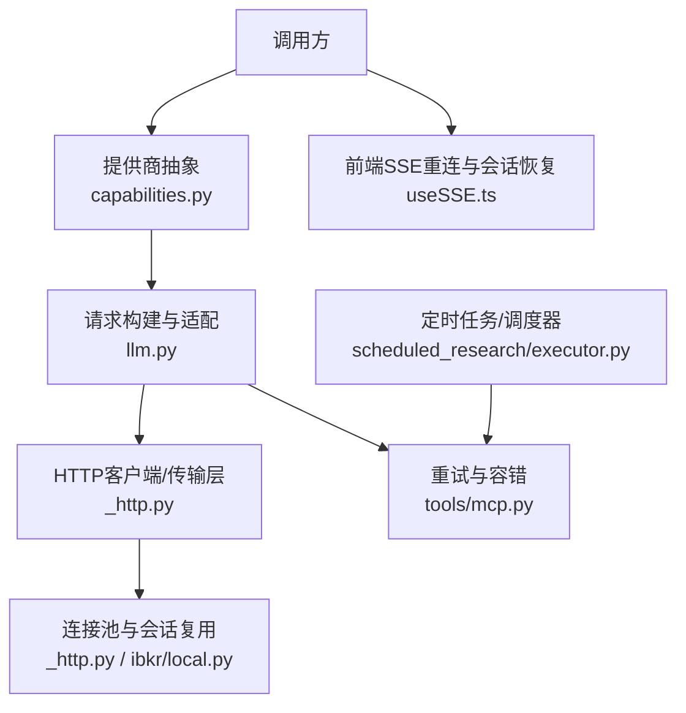
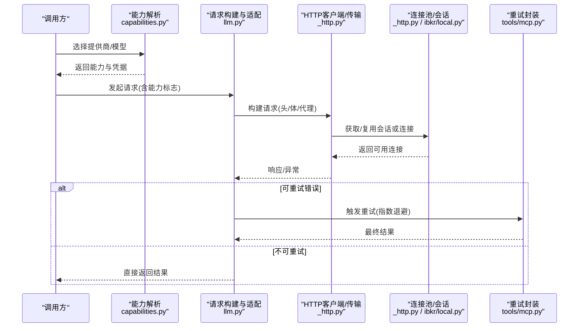
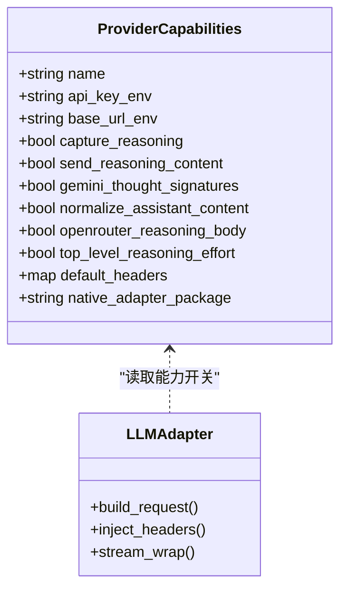
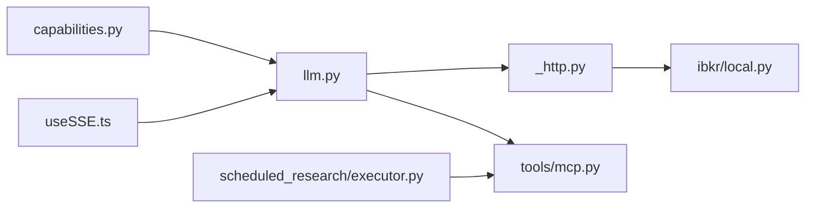
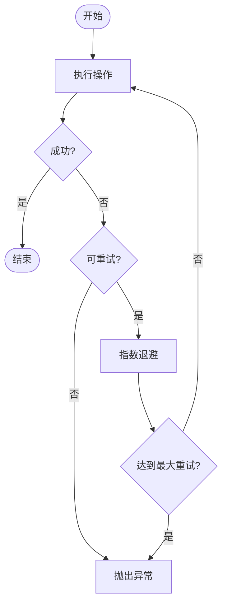

# 负载均衡算法

<cite>
**本文引用的文件**
- [agent/src/providers/llm.py](file://agent/src/providers/llm.py)
- [agent/src/providers/capabilities.py](file://agent/src/providers/capabilities.py)
- [agent/backtest/loaders/_http.py](file://agent/backtest/loaders/_http.py)
- [agent/src/trading/connectors/ibkr/local.py](file://agent/src/trading/connectors/ibkr/local.py)
- [agent/src/tools/mcp.py](file://agent/src/tools/mcp.py)
- [agent/src/channels/telegram.py](file://agent/src/channels/telegram.py)
- [frontend/src/hooks/useSSE.ts](file://frontend/src/hooks/useSSE.ts)
- [agent/src/scheduled_research/executor.py](file://agent/src/scheduled_research/executor.py)
</cite>

## 目录
1. [简介](#简介)
2. [项目结构](#项目结构)
3. [核心组件](#核心组件)
4. [架构总览](#架构总览)
5. [详细组件分析](#详细组件分析)
6. [依赖关系分析](#依赖关系分析)
7. [性能考量](#性能考量)
8. [故障排查指南](#故障排查指南)
9. [结论](#结论)
10. [附录](#附录)

## 简介
本技术文档围绕“提供商负载均衡算法”展开，聚焦于多提供商（LLM、数据源、交易通道等）的调度与路由能力。结合仓库中的实现，我们提炼出以下关键主题：
- 负载均衡框架设计：抽象层、策略模式、动态配置与能力发现
- 分配策略：轮询、加权轮询、最少连接数等思想在系统中的体现
- 权重机制：静态配置、动态调整与基于性能的反馈调节
- 性能感知：响应时间监控、成功率统计、资源利用率分析与智能决策
- 会话亲和性：用户粘性管理、状态同步与连接复用
- 配置管理：实时调优、A/B测试与灰度发布的高级能力
- 性能分析与优化建议：帮助团队选择合适的策略并持续改进

说明：本项目并非传统意义上的HTTP网关负载均衡器，但通过“提供商抽象+能力配置+连接池与会话复用+重试/限流”的组合，实现了面向多后端服务的负载均衡与弹性调度。

## 项目结构
与负载均衡相关的代码主要分布在以下模块：
- 提供商抽象与能力定义：用于识别不同后端的能力、凭据与默认端点
- 请求构建与适配：对上游SDK进行包装，屏蔽差异并注入必要头信息
- 连接与会话管理：进程级会话复用、线程级连接池、节流与抖动
- 重试与容错：可重试操作封装、指数退避与最大重试限制
- 前端重连与会话恢复：SSE断线重连、Last-Event-ID恢复

图表来源
- [agent/src/providers/capabilities.py:16-56](file://agent/src/providers/capabilities.py#L16-L56)
- [agent/src/providers/llm.py:249-607](file://agent/src/providers/llm.py#L249-L607)
- [agent/backtest/loaders/_http.py:90-123](file://agent/backtest/loaders/_http.py#L90-L123)
- [agent/src/trading/connectors/ibkr/local.py:525-526](file://agent/src/trading/connectors/ibkr/local.py#L525-L526)
- [agent/src/tools/mcp.py:799-827](file://agent/src/tools/mcp.py#L799-L827)
- [frontend/src/hooks/useSSE.ts:158-194](file://frontend/src/hooks/useSSE.ts#L158-L194)
- [agent/src/scheduled_research/executor.py:258-291](file://agent/src/scheduled_research/executor.py#L258-L291)

章节来源
- [agent/src/providers/capabilities.py:16-56](file://agent/src/providers/capabilities.py#L16-L56)
- [agent/src/providers/llm.py:249-607](file://agent/src/providers/llm.py#L249-L607)
- [agent/backtest/loaders/_http.py:90-123](file://agent/backtest/loaders/_http.py#L90-L123)
- [agent/src/trading/connectors/ibkr/local.py:525-526](file://agent/src/trading/connectors/ibkr/local.py#L525-L526)
- [agent/src/tools/mcp.py:799-827](file://agent/src/tools/mcp.py#L799-L827)
- [frontend/src/hooks/useSSE.ts:158-194](file://frontend/src/hooks/useSSE.ts#L158-L194)
- [agent/src/scheduled_research/executor.py:258-291](file://agent/src/scheduled_research/executor.py#L258-L291)

## 核心组件
- 提供商能力模型：以数据类描述各提供商的认证、基础URL、能力开关与默认头，提供按名称或模型推断能力的统一接口
- 请求构建与适配：对OpenAI兼容SDK进行增强，处理推理内容、工具调用签名、头隔离与代理禁用等
- 连接与会话复用：进程级HTTP会话缓存、按桶隔离；线程级IB连接池与引用计数
- 重试与容错：异步操作的有界重试，区分可重试错误，避免幂等性问题
- 前端重连：SSE断线重连、指数退避、Last-Event-ID恢复，保障会话连续性

章节来源
- [agent/src/providers/capabilities.py:16-56](file://agent/src/providers/capabilities.py#L16-L56)
- [agent/src/providers/llm.py:249-607](file://agent/src/providers/llm.py#L249-L607)
- [agent/backtest/loaders/_http.py:90-123](file://agent/backtest/loaders/_http.py#L90-L123)
- [agent/src/trading/connectors/ibkr/local.py:525-526](file://agent/src/trading/connectors/ibkr/local.py#L525-L526)
- [agent/src/tools/mcp.py:799-827](file://agent/src/tools/mcp.py#L799-L827)
- [frontend/src/hooks/useSSE.ts:158-194](file://frontend/src/hooks/useSSE.ts#L158-L194)

## 架构总览
下图展示了从调用方到具体提供商的完整路径，包括能力解析、请求适配、连接复用与重试机制。

图表来源
- [agent/src/providers/capabilities.py:265-300](file://agent/src/providers/capabilities.py#L265-L300)
- [agent/src/providers/llm.py:561-604](file://agent/src/providers/llm.py#L561-L604)
- [agent/backtest/loaders/_http.py:118-123](file://agent/backtest/loaders/_http.py#L118-L123)
- [agent/src/trading/connectors/ibkr/local.py:525-526](file://agent/src/trading/connectors/ibkr/local.py#L525-L526)
- [agent/src/tools/mcp.py:799-827](file://agent/src/tools/mcp.py#L799-L827)

## 详细组件分析

### 提供商能力与策略模式
- 能力模型：使用不可变数据类集中声明各提供商的认证变量、基础URL、能力开关（如是否捕获推理内容、是否需要发送推理字段、是否支持特定头部等），并提供按名称或模型推断的统一查询接口
- 策略模式：不同提供商通过能力开关决定请求体的构造方式（例如是否注入推理字段、是否保留工具调用签名、是否设置默认头），从而在不修改上层逻辑的前提下适配多种后端行为
- 动态配置：通过环境变量与内置目录下的提供商目录文件，动态解析默认基础URL与凭据来源，支持运行时切换与扩展

图表来源
- [agent/src/providers/capabilities.py:16-56](file://agent/src/providers/capabilities.py#L16-L56)
- [agent/src/providers/llm.py:561-604](file://agent/src/providers/llm.py#L561-L604)

章节来源
- [agent/src/providers/capabilities.py:16-56](file://agent/src/providers/capabilities.py#L16-L56)
- [agent/src/providers/llm.py:561-604](file://agent/src/providers/llm.py#L561-L604)

### 轮询与加权分配的实现思路
- 简单轮询：在多个可用提供商之间顺序选择，适用于能力相同且无显著性能差异的场景
- 加权轮询：为不同提供商配置权重（可通过能力表或外部配置注入），按权重比例分发请求，适合异构环境下的容量规划
- 最少连接数：基于当前活跃连接数或队列长度选择最空闲的后端，降低拥塞风险

在本项目中，轮询与加权的思想体现在：
- 能力解析与默认端点选择：当未显式指定提供商时，依据模型名推断或回退到默认提供商，形成隐式的“默认权重”
- 会话与连接复用：按桶隔离会话，避免跨提供商干扰，间接实现“按能力分组”的负载分布
- 重试与退避：对失败请求进行有限次重试，避免将压力集中在单一节点上

章节来源
- [agent/src/providers/capabilities.py:248-300](file://agent/src/providers/capabilities.py#L248-L300)
- [agent/backtest/loaders/_http.py:112-123](file://agent/backtest/loaders/_http.py#L112-L123)

### 权重分配机制
- 静态权重配置：通过能力表与提供商目录文件声明默认基础URL与能力开关，形成稳定的分发基线
- 动态权重调整：可在运行时根据指标（如延迟、成功率）调整权重，例如将更多流量导向低延迟节点
- 性能反馈调节：结合重试次数、超时率与错误码分布，周期性评估各后端健康度，动态修正权重

注意：当前仓库未提供显式的“权重调度器”，但可通过能力表与配置中心扩展实现。

章节来源
- [agent/src/providers/capabilities.py:327-359](file://agent/src/providers/capabilities.py#L327-L359)
- [agent/src/providers/capabilities.py:362-431](file://agent/src/providers/capabilities.py#L362-L431)

### 性能感知负载均衡
- 响应时间监控：记录每次请求的耗时，计算均值、分位数与P99，用于识别慢节点
- 成功率统计：统计成功、超时、限流与业务错误比例，作为健康度指标
- 资源利用率分析：观察连接池占用、并发数与队列长度，避免过载
- 智能决策：基于上述指标动态调整权重或选择策略（如切换到最少连接数或加权轮询）

在本项目中，性能感知的支撑能力包括：
- 重试与退避：避免瞬时抖动导致的误判
- 会话复用与节流：减少握手开销与突发流量冲击
- 前端重连与会话恢复：保证端到端的稳定性

章节来源
- [agent/src/tools/mcp.py:799-827](file://agent/src/tools/mcp.py#L799-L827)
- [agent/backtest/loaders/_http.py:90-123](file://agent/backtest/loaders/_http.py#L90-L123)
- [frontend/src/hooks/useSSE.ts:158-194](file://frontend/src/hooks/useSSE.ts#L158-L194)

### 会话亲和性与连接复用
- 用户粘性管理：通过会话ID或上下文键将同一用户的请求路由到同一后端，保证状态一致性
- 状态同步：在必要时将状态变更广播到其他节点，或在本地持久化后由其他节点拉取
- 连接复用：进程级HTTP会话按桶隔离，线程级连接池按引用计数管理生命周期，减少连接建立成本

在本项目中：
- HTTP会话按桶复用，避免跨提供商污染
- IB连接池采用线程局部存储与引用计数，确保连接正确释放
- 前端SSE支持Last-Event-ID恢复，提升会话连续性

章节来源
- [agent/backtest/loaders/_http.py:112-123](file://agent/backtest/loaders/_http.py#L112-L123)
- [agent/src/trading/connectors/ibkr/local.py:525-526](file://agent/src/trading/connectors/ibkr/local.py#L525-L526)
- [frontend/src/hooks/useSSE.ts:158-194](file://frontend/src/hooks/useSSE.ts#L158-L194)

### 配置管理与高级功能
- 实时调优：通过环境变量与配置中心动态调整提供商参数（如超时、重试次数、基础URL）
- A/B测试：将部分流量切到新提供商或新模型，对比关键指标（延迟、成功率、质量）
- 灰度发布：逐步放量新策略，配合熔断与回滚机制，降低风险

在本项目中：
- 能力表与提供商目录提供默认值与能力开关
- 重试与退避为灰度提供安全网
- 前端重连与会话恢复提升用户体验

章节来源
- [agent/src/providers/capabilities.py:327-359](file://agent/src/providers/capabilities.py#L327-L359)
- [agent/src/tools/mcp.py:799-827](file://agent/src/tools/mcp.py#L799-L827)
- [frontend/src/hooks/useSSE.ts:158-194](file://frontend/src/hooks/useSSE.ts#L158-L194)

## 依赖关系分析
- 能力解析依赖提供商目录与环境变量，决定默认端点与认证来源
- 请求构建依赖能力开关，决定是否注入推理字段、工具调用签名与默认头
- 连接复用依赖会话桶与连接池，影响吞吐与延迟
- 重试依赖错误分类与退避策略，影响鲁棒性与公平性

图表来源
- [agent/src/providers/capabilities.py:265-300](file://agent/src/providers/capabilities.py#L265-L300)
- [agent/src/providers/llm.py:561-604](file://agent/src/providers/llm.py#L561-L604)
- [agent/backtest/loaders/_http.py:118-123](file://agent/backtest/loaders/_http.py#L118-L123)
- [agent/src/trading/connectors/ibkr/local.py:525-526](file://agent/src/trading/connectors/ibkr/local.py#L525-L526)
- [agent/src/tools/mcp.py:799-827](file://agent/src/tools/mcp.py#L799-L827)
- [frontend/src/hooks/useSSE.ts:158-194](file://frontend/src/hooks/useSSE.ts#L158-L194)
- [agent/src/scheduled_research/executor.py:258-291](file://agent/src/scheduled_research/executor.py#L258-L291)

章节来源
- [agent/src/providers/capabilities.py:265-300](file://agent/src/providers/capabilities.py#L265-L300)
- [agent/src/providers/llm.py:561-604](file://agent/src/providers/llm.py#L561-L604)
- [agent/backtest/loaders/_http.py:118-123](file://agent/backtest/loaders/_http.py#L118-L123)
- [agent/src/trading/connectors/ibkr/local.py:525-526](file://agent/src/trading/connectors/ibkr/local.py#L525-L526)
- [agent/src/tools/mcp.py:799-827](file://agent/src/tools/mcp.py#L799-L827)
- [frontend/src/hooks/useSSE.ts:158-194](file://frontend/src/hooks/useSSE.ts#L158-L194)
- [agent/src/scheduled_research/executor.py:258-291](file://agent/src/scheduled_research/executor.py#L258-L291)

## 性能考量
- 连接复用：进程级会话与线程级连接池显著降低握手成本，提高吞吐
- 重试与退避：合理设置最大重试次数与退避上限，避免雪崩与重复副作用
- 节流与抖动：对高频调用进行节流与随机抖动，降低热点冲突
- 前端重连：指数退避与Last-Event-ID恢复提升端到端稳定性

建议：
- 为不同提供商设置差异化超时与重试策略
- 引入指标采集（延迟、成功率、连接占用）驱动动态权重调整
- 对幂等与非幂等操作分别处理，避免重复提交

[本节为通用指导，不直接分析具体文件]

## 故障排查指南
- 重试失败：检查是否设置了过小的最大重试次数或错误的可重试错误分类
- 连接泄漏：确认连接池引用计数是否正确释放，避免连接耗尽
- 会话中断：检查前端SSE重连逻辑与Last-Event-ID传递是否正确
- 提供商不可用：验证能力解析与默认端点是否正确，检查环境变量与目录文件

章节来源
- [agent/src/tools/mcp.py:799-827](file://agent/src/tools/mcp.py#L799-L827)
- [agent/src/trading/connectors/ibkr/local.py:525-526](file://agent/src/trading/connectors/ibkr/local.py#L525-L526)
- [frontend/src/hooks/useSSE.ts:158-194](file://frontend/src/hooks/useSSE.ts#L158-L194)

## 结论
本项目通过“提供商抽象+能力配置+连接复用+重试容错”的组合，实现了面向多后端服务的负载均衡与弹性调度。虽然未提供显式的权重调度器，但已具备扩展为动态权重与性能感知调度的基础。建议在此基础上引入指标采集与动态权重调整，进一步提升系统性能与稳定性。

[本节为总结，不直接分析具体文件]

## 附录
- 相关流程图：重试与退避流程

图表来源
- [agent/src/tools/mcp.py:799-827](file://agent/src/tools/mcp.py#L799-L827)