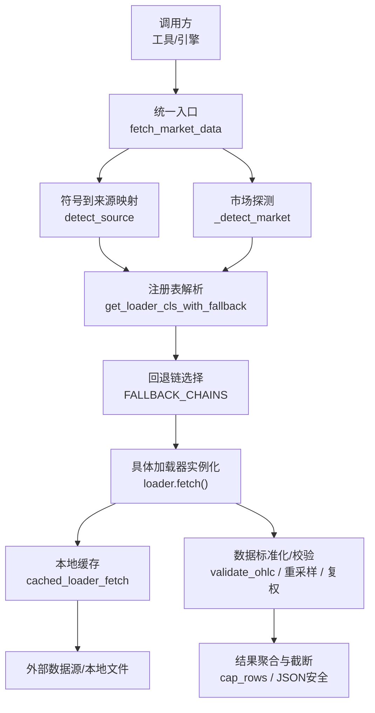
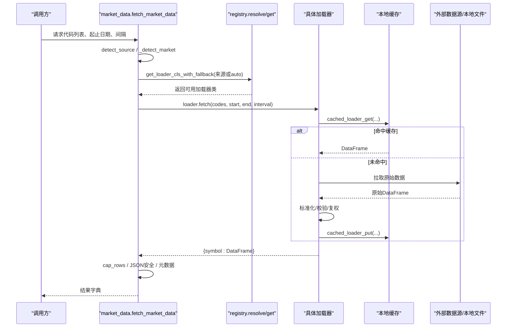
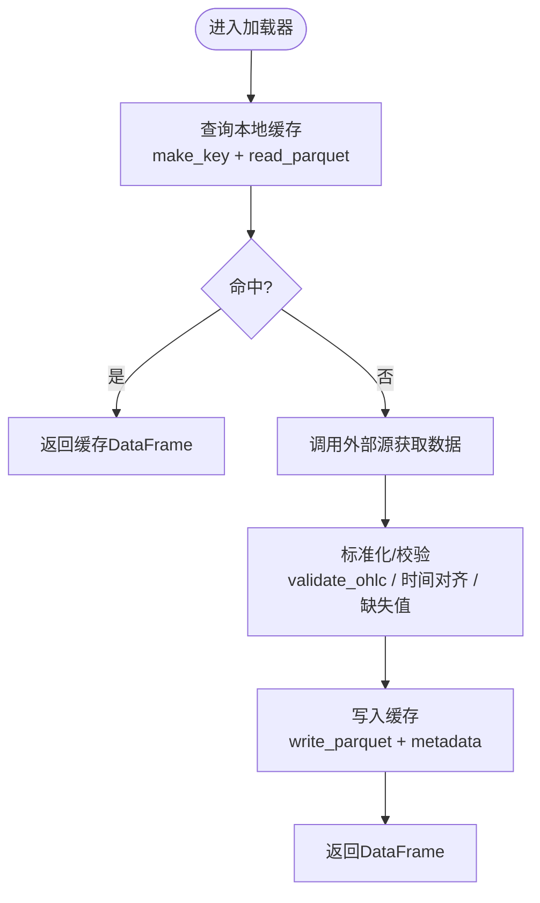
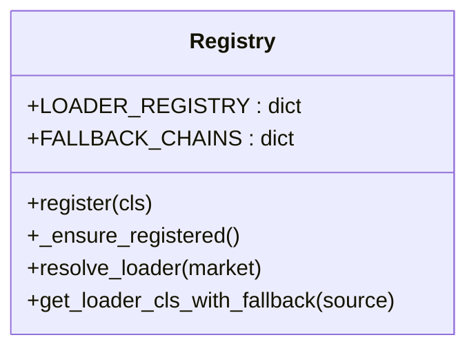
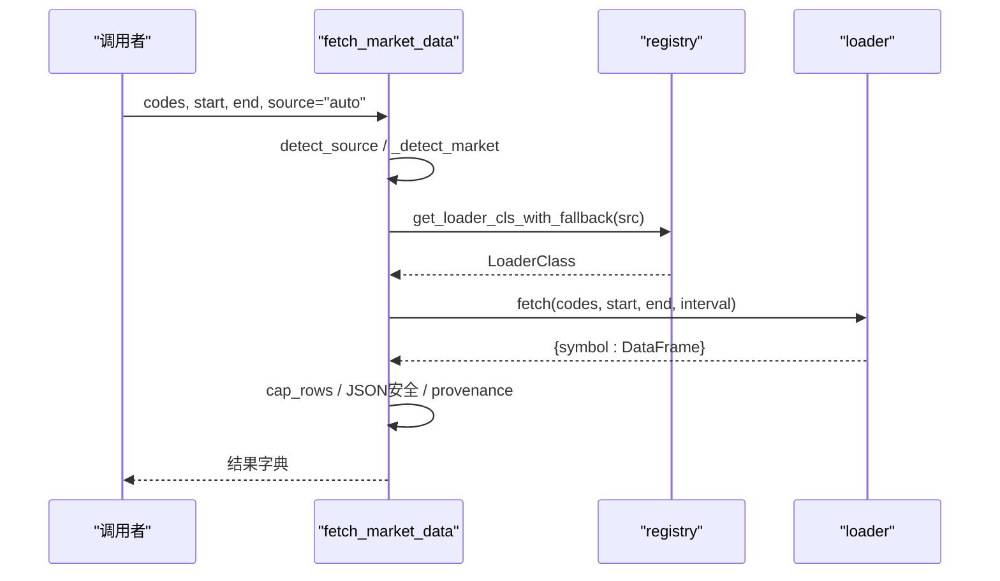
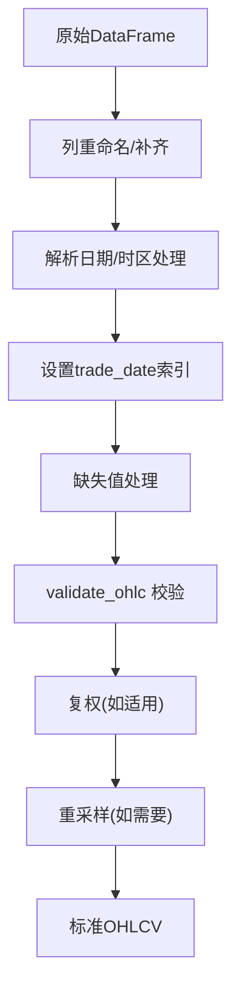
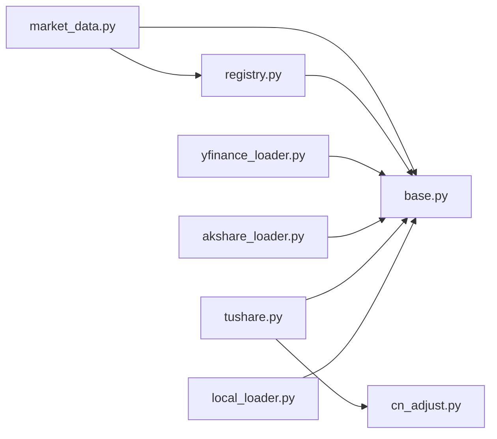

# 数据层架构

<cite>
**本文引用的文件**
- [agent/backtest/loaders/base.py](file://agent/backtest/loaders/base.py)
- [agent/backtest/loaders/registry.py](file://agent/backtest/loaders/registry.py)
- [agent/src/market_data.py](file://agent/src/market_data.py)
- [agent/backtest/loaders/yfinance_loader.py](file://agent/backtest/loaders/yfinance_loader.py)
- [agent/backtest/loaders/tushare.py](file://agent/backtest/loaders/tushare.py)
- [agent/backtest/loaders/local_loader.py](file://agent/backtest/loaders/local_loader.py)
- [agent/backtest/loaders/akshare_loader.py](file://agent/backtest/loaders/akshare_loader.py)
- [agent/backtest/loaders/cn_adjust.py](file://agent/backtest/loaders/cn_adjust.py)
- [agent/backtest/loaders/_symbol_utils.py](file://agent/backtest/loaders/_symbol_utils.py)
</cite>

## 目录
1. [简介](#简介)
2. [项目结构](#项目结构)
3. [核心组件](#核心组件)
4. [架构总览](#架构总览)
5. [详细组件分析](#详细组件分析)
6. [依赖关系分析](#依赖关系分析)
7. [性能考量](#性能考量)
8. [故障排查指南](#故障排查指南)
9. [结论](#结论)
10. [附录：扩展指南与最佳实践](#附录：扩展指南与最佳实践)

## 简介
本技术文档聚焦于数据层的整体设计与实现，覆盖统一接口抽象、动态发现与负载均衡（回退链）、数据标准化（格式转换、时间对齐、缺失值处理）、缓存机制（多级缓存、失效策略、性能优化）、数据质量验证（完整性检查、异常检测、一致性验证）、提供商管理（能力发现、健康检查、故障转移）以及扩展指南（新数据源集成、适配器开发）。目标读者为数据工程师与系统集成开发者。

## 项目结构
数据层以“加载器协议 + 注册表 + 市场路由”为核心，围绕统一的 DataLoaderProtocol 抽象，通过注册表进行动态发现，结合按市场的回退链实现负载均衡与容错；上层通过统一入口 fetch_market_data 完成自动路由与结果聚合。

图表来源
- [agent/src/market_data.py:97-234](file://agent/src/market_data.py#L97-L234)
- [agent/backtest/loaders/registry.py:614-649](file://agent/backtest/loaders/registry.py#L614-L649)
- [agent/backtest/loaders/base.py:623-661](file://agent/backtest/loaders/base.py#L623-L661)

章节来源
- [agent/src/market_data.py:16-57](file://agent/src/market_data.py#L16-L57)
- [agent/backtest/loaders/registry.py:23-60](file://agent/backtest/loaders/registry.py#L23-L60)
- [agent/backtest/loaders/base.py:243-441](file://agent/backtest/loaders/base.py#L243-L441)

## 核心组件
- 统一接口与共享工具：DataLoaderProtocol、日期范围校验、OHLC 不变量校验、重试预算与回退、本地缓存封装等。
- 动态发现与负载均衡：全局注册表、懒加载导入、按市场定义的回退链、显式来源不可静默降级策略。
- 统一入口与路由：符号到来源的启发式匹配、市场探测、按市场回退链组装尝试序列、结果聚合与元数据输出。
- 数据标准化与质量：各加载器将原始数据转换为标准 OHLCV 列、时间索引规范化、缺失值处理、OHLC 不变量校验、A股复权。
- 缓存机制：基于内容寻址的 Parquet 缓存、版本控制、只缓存已结算区间、读写失败非致命、DuckDB 加速读写。
- 提供商管理：is_available 能力检测、构造期异常捕获、按市场回退链故障转移、禁止网络静默降级来源。

章节来源
- [agent/backtest/loaders/base.py:164-256](file://agent/backtest/loaders/base.py#L164-L256)
- [agent/backtest/loaders/base.py:127-236](file://agent/backtest/loaders/base.py#L127-L236)
- [agent/backtest/loaders/base.py:243-441](file://agent/backtest/loaders/base.py#L243-L441)
- [agent/backtest/loaders/registry.py:63-117](file://agent/backtest/loaders/registry.py#L63-L117)
- [agent/backtest/loaders/registry.py:139-196](file://agent/backtest/loaders/registry.py#L139-L196)
- [agent/src/market_data.py:97-234](file://agent/src/market_data.py#L97-L234)

## 架构总览
数据层采用分层解耦设计：
- 接入层：统一入口负责参数校验、分组、路由与结果聚合。
- 调度层：注册表与回退链决定实际使用的加载器，支持按市场优先与显式来源保护。
- 适配层：各加载器实现 DataLoaderProtocol，屏蔽不同数据源的差异。
- 标准化层：统一列名、时间索引、数值类型、缺失值与 OHLC 不变量校验。
- 存储层：可选本地缓存（Parquet + DuckDB），对读路径透明。

图表来源
- [agent/src/market_data.py:97-234](file://agent/src/market_data.py#L97-L234)
- [agent/backtest/loaders/registry.py:614-649](file://agent/backtest/loaders/registry.py#L614-L649)
- [agent/backtest/loaders/base.py:623-661](file://agent/backtest/loaders/base.py#L623-L661)

## 详细组件分析

### 统一接口与共享工具（base.py）
- DataLoaderProtocol：定义 name、markets、requires_auth、is_available、fetch 等契约，确保所有加载器一致。
- 数据质量校验：validate_date_range 校验起止日期合法性；validate_ohlc 强制结构性不变量（high>=low、高低价包围开收价、价格正性可配），提供 drop/warn/raise 策略。
- 重试与预算：check_budget 与 retry_with_budget 提供带截止时间的指数退避重试，仅对声明的瞬态异常重试，避免无限等待。
- 本地缓存：content-addressed 键（含 source/symbol/timeframe/date range/fields/version），仅缓存已结算区间；读写使用 DuckDB 读取/写入 Parquet，元数据记录索引列名、dtype、列轴名；读写失败均非致命，保证主流程健壮。

图表来源
- [agent/backtest/loaders/base.py:506-561](file://agent/backtest/loaders/base.py#L506-L561)
- [agent/backtest/loaders/base.py:565-661](file://agent/backtest/loaders/base.py#L565-L661)
- [agent/backtest/loaders/base.py:477-597](file://agent/backtest/loaders/base.py#L477-L597)

章节来源
- [agent/backtest/loaders/base.py:164-256](file://agent/backtest/loaders/base.py#L164-L256)
- [agent/backtest/loaders/base.py:127-236](file://agent/backtest/loaders/base.py#L127-L236)
- [agent/backtest/loaders/base.py:243-441](file://agent/backtest/loaders/base.py#L243-L441)
- [agent/backtest/loaders/base.py:477-597](file://agent/backtest/loaders/base.py#L477-L597)

### 动态发现与负载均衡（registry.py）
- 全局注册表：LOADER_REGISTRY 保存 name -> LoaderClass；_ensure_registered 懒加载所有已知模块，使 @register 装饰器生效。
- 回退链：FALLBACK_CHAINS 按市场定义优先级顺序，考虑 IP 封禁风险与数据质量，公开无认证源优先，密钥受限源靠后。
- 解析与降级：resolve_loader 遍历回退链，调用 is_available 选择首个可用加载器；get_loader_cls_with_fallback 支持显式来源不可静默降级（local/qveris/tickerall 不退回网络源），否则在同市场内尝试回退。

图表来源
- [agent/backtest/loaders/registry.py:23-60](file://agent/backtest/loaders/registry.py#L23-L60)
- [agent/backtest/loaders/registry.py:63-117](file://agent/backtest/loaders/registry.py#L63-L117)
- [agent/backtest/loaders/registry.py:139-196](file://agent/backtest/loaders/registry.py#L139-L196)
- [agent/backtest/loaders/registry.py:199-256](file://agent/backtest/loaders/registry.py#L199-L256)

章节来源
- [agent/backtest/loaders/registry.py:23-60](file://agent/backtest/loaders/registry.py#L23-L60)
- [agent/backtest/loaders/registry.py:63-117](file://agent/backtest/loaders/registry.py#L63-L117)
- [agent/backtest/loaders/registry.py:139-196](file://agent/backtest/loaders/registry.py#L139-L196)
- [agent/backtest/loaders/registry.py:199-256](file://agent/backtest/loaders/registry.py#L199-L256)

### 统一入口与市场路由（market_data.py）
- 符号到来源映射：detect_source 根据后缀/模式推断首选来源（如 .US→yahoo，.HK/.SZ/.SH→tencent，BTC-USDT→okx 等）。
- 分组与回退链组装：按 (source, market) 分组，构建 attempts 列表（优先请求来源，再拼接其市场回退链，去重并限制最大尝试次数）。
- 执行与聚合：逐个尝试加载器，捕获异常并继续下一个；成功后标准化为 records，应用行裁剪 cap_rows，JSON 安全化，附加 provenance（来源、是否回退、volume_unit 等）。
- 未解析集合：收集无法获取的代码至 _unresolved。

图表来源
- [agent/src/market_data.py:16-57](file://agent/src/market_data.py#L16-L57)
- [agent/src/market_data.py:97-234](file://agent/src/market_data.py#L97-L234)

章节来源
- [agent/src/market_data.py:16-57](file://agent/src/market_data.py#L16-L57)
- [agent/src/market_data.py:97-234](file://agent/src/market_data.py#L97-L234)

### 数据标准化与质量（多加载器 + base + cn_adjust）
- 列标准化：各加载器将原始列映射为标准 open/high/low/close/volume，缺失 volume 补零，数值列 coerce 转换。
- 时间对齐：统一为 trade_date 索引，去除时区或转为 UTC-naive；本地加载器支持 resample 到目标间隔（降采样用 OHLCV 聚合，升采样不支持则告警返回原粒度）。
- 缺失值处理：dropna 后再做 OHLC 不变量校验；局部缺失在聚合阶段处理。
- 复权处理：Tushare A 股/基金使用前复权因子校正价格与成交量，避免除权日造成的收益失真。
- 不变量校验：validate_ohlc 强制 high>=low、高低价包围开收价、价格正性（可配置允许负价场景）。

图表来源
- [agent/backtest/loaders/yfinance_loader.py:194-222](file://agent/backtest/loaders/yfinance_loader.py#L194-L222)
- [agent/backtest/loaders/local_loader.py:88-131](file://agent/backtest/loaders/local_loader.py#L88-L131)
- [agent/backtest/loaders/local_loader.py:141-189](file://agent/backtest/loaders/local_loader.py#L141-L189)
- [agent/backtest/loaders/cn_adjust.py:27-78](file://agent/backtest/loaders/cn_adjust.py#L27-L78)
- [agent/backtest/loaders/base.py:187-256](file://agent/backtest/loaders/base.py#L187-L256)

章节来源
- [agent/backtest/loaders/base.py:187-256](file://agent/backtest/loaders/base.py#L187-L256)
- [agent/backtest/loaders/yfinance_loader.py:194-222](file://agent/backtest/loaders/yfinance_loader.py#L194-L222)
- [agent/backtest/loaders/local_loader.py:88-131](file://agent/backtest/loaders/local_loader.py#L88-L131)
- [agent/backtest/loaders/local_loader.py:141-189](file://agent/backtest/loaders/local_loader.py#L141-L189)
- [agent/backtest/loaders/cn_adjust.py:27-78](file://agent/backtest/loaders/cn_adjust.py#L27-L78)

### 缓存机制（base.py）
- 启用开关与根路径：通过配置决定是否启用及缓存根目录，默认用户家目录下。
- 键生成：包含 version/source/symbol/timeframe/start/end/fields，SHA256 内容寻址，版本升级后旧条目不再命中。
- 有效性判断：仅当 end_date 严格早于今日才缓存，避免缓存正在形成的K线。
- 读写实现：读取使用 DuckDB 直接读取 Parquet，恢复索引列名与 dtype；写入原子替换（tmp+os.replace），失败清理临时文件。
- 便捷封装：cached_loader_fetch 统一“先查缓存，未命中则 fetch 并写回”，读写失败均非致命。

章节来源
- [agent/backtest/loaders/base.py:243-441](file://agent/backtest/loaders/base.py#L243-L441)
- [agent/backtest/loaders/base.py:477-597](file://agent/backtest/loaders/base.py#L477-L597)

### 提供商管理（registry + 各加载器）
- 能力发现：每个加载器实现 is_available（如检查依赖安装、token 存在、网络可达等）。
- 健康检查：构造期异常被捕获视为不可用，避免阻塞回退链。
- 故障转移：按市场回退链依次尝试；对于 local/qveris/tickerall 等显式来源，若不可用则拒绝静默降级到网络源，提示配置问题。
- 元数据输出：provenance 携带 source、requested_source、detected_source、fallback_used、volume_unit，便于追踪数据来源与单位。

章节来源
- [agent/backtest/loaders/registry.py:119-196](file://agent/backtest/loaders/registry.py#L119-L196)
- [agent/backtest/loaders/registry.py:199-256](file://agent/backtest/loaders/registry.py#L199-L256)
- [agent/src/market_data.py:207-232](file://agent/src/market_data.py#L207-L232)
- [agent/backtest/loaders/tushare.py:133-146](file://agent/backtest/loaders/tushare.py#L133-L146)
- [agent/backtest/loaders/akshare_loader.py:299-308](file://agent/backtest/loaders/akshare_loader.py#L299-L308)

## 依赖关系分析
- 模块耦合：
  - market_data.py 依赖 registry 与 base 提供的解析与缓存能力。
  - registry.py 依赖 base 的 NoAvailableSourceError 与加载器模块的 @register。
  - 各加载器依赖 base 的缓存与校验工具，部分加载器依赖 cn_adjust 进行复权。
- 外部依赖：
  - yfinance、akshare、tushare、DuckDB、yaml 等按需导入，降低启动成本。
- 潜在循环：
  - 通过懒导入与注册表解耦，避免循环导入；加载器仅在需要时 import。

图表来源
- [agent/src/market_data.py:97-234](file://agent/src/market_data.py#L97-L234)
- [agent/backtest/loaders/registry.py:63-117](file://agent/backtest/loaders/registry.py#L63-L117)
- [agent/backtest/loaders/base.py:243-441](file://agent/backtest/loaders/base.py#L243-L441)
- [agent/backtest/loaders/tushare.py:14-16](file://agent/backtest/loaders/tushare.py#L14-L16)
- [agent/backtest/loaders/cn_adjust.py:27-78](file://agent/backtest/loaders/cn_adjust.py#L27-L78)

章节来源
- [agent/src/market_data.py:97-234](file://agent/src/market_data.py#L97-L234)
- [agent/backtest/loaders/registry.py:63-117](file://agent/backtest/loaders/registry.py#L63-L117)
- [agent/backtest/loaders/base.py:243-441](file://agent/backtest/loaders/base.py#L243-L441)
- [agent/backtest/loaders/tushare.py:14-16](file://agent/backtest/loaders/tushare.py#L14-L16)
- [agent/backtest/loaders/cn_adjust.py:27-78](file://agent/backtest/loaders/cn_adjust.py#L27-L78)

## 性能考量
- 缓存命中：对历史已结算区间的数据使用 Parquet + DuckDB 快速读取，显著减少网络 IO。
- 批量与分组：按 (source, market) 分组批量请求，减少重复解析与连接开销。
- 行裁剪：cap_rows 对大结果集进行步长采样，控制响应体积。
- 重试与超时：retry_with_budget 限制重试次数与总时长，避免长时间阻塞。
- 重采样：本地加载器对粗粒度数据进行降采样聚合，避免不必要的高频计算。
- 懒加载：外部库按需导入，降低冷启动成本。

[本节为通用性能建议，不直接分析具体文件]

## 故障排查指南
- 无可用数据源：
  - 现象：抛出 NoAvailableSourceError。
  - 排查：确认 token/依赖安装、网络连通；查看回退链中各来源可用性；显式来源（local/qveris/tickerall）不可用时不会静默降级。
- 数据质量异常：
  - 现象：OHLC 不变量违规导致行被丢弃或报错。
  - 排查：检查 validate_ohlc 策略（drop/warn/raise），关注日志中的违规行数；必要时放宽 allow_nonpositive_prices。
- 缓存相关问题：
  - 现象：缓存未命中或读取失败。
  - 排查：确认 VIBE_TRADING_DATA_CACHE 开启、end_date 已结算；检查缓存目录权限与 DuckDB 可读性；缓存写入失败不影响主流程。
- 速率限制：
  - 现象：特定来源（如 Tushare）触发频率限制。
  - 排查：观察限流标记与退避重试；适当降低并发或延长间隔。

章节来源
- [agent/backtest/loaders/base.py:164-256](file://agent/backtest/loaders/base.py#L164-L256)
- [agent/backtest/loaders/base.py:377-450](file://agent/backtest/loaders/base.py#L377-L450)
- [agent/backtest/loaders/base.py:243-441](file://agent/backtest/loaders/base.py#L243-L441)
- [agent/backtest/loaders/tushare.py:18-35](file://agent/backtest/loaders/tushare.py#L18-L35)
- [agent/backtest/loaders/registry.py:199-256](file://agent/backtest/loaders/registry.py#L199-L256)

## 结论
该数据层通过统一接口、动态发现与回退链实现了高可用的多源数据接入；标准化的数据管道保证了跨来源的一致性；本地缓存与重试预算提升了鲁棒性与性能；完善的校验与元数据输出便于监控与排障。整体设计兼顾可扩展性与工程实践，适合复杂交易系统的稳定运行。

[本节为总结性内容，不直接分析具体文件]

## 附录：扩展指南与最佳实践
- 新增数据源集成步骤
  - 实现 DataLoaderProtocol：定义 name/markets/requires_auth/is_available/fetch。
  - 注册：使用 @register 装饰器，确保模块被 _ensure_registered 导入。
  - 标准化：在 fetch 内部完成列重命名、时间索引、缺失值处理与 validate_ohlc。
  - 缓存：使用 cached_loader_fetch 包裹 fetch 逻辑，利用本地缓存提升性能。
  - 回退链：如需加入某市场回退链，更新 FALLBACK_CHAINS。
  - 测试：编写用例覆盖 is_available、fetch 正常/异常路径、缓存命中/未命中、OHLC 校验。
- 适配器开发要点
  - 明确 volume_units（如 lots/shares），并在 provenance 中暴露。
  - 处理速率限制与瞬态异常，使用 retry_with_budget 或自定义退避。
  - 对分钟级数据注意 API 限制与字段映射（如 tushare 分钟数据）。
  - 本地加载器需支持 CSV/Parquet/DuckDB，并正确重采样到目标间隔。
- 性能与稳定性建议
  - 合理设置 max_fallback_attempts，避免过多尝试造成延迟。
  - 使用 cap_rows 控制响应大小，避免过大负载。
  - 谨慎调整 allow_nonpositive_prices，仅在确知市场允许负价时使用。
  - 定期清理过期缓存文件，避免磁盘膨胀。

[本节为通用指导，不直接分析具体文件]