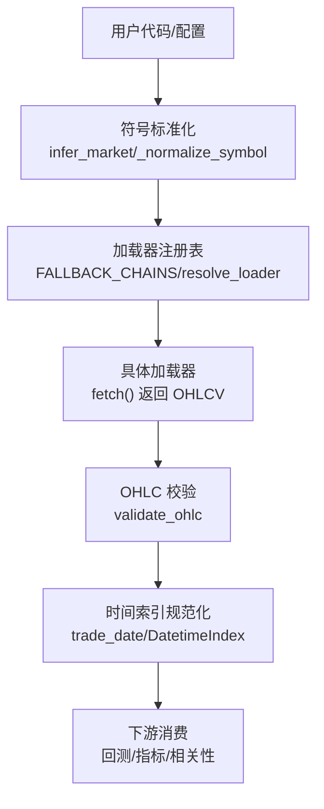
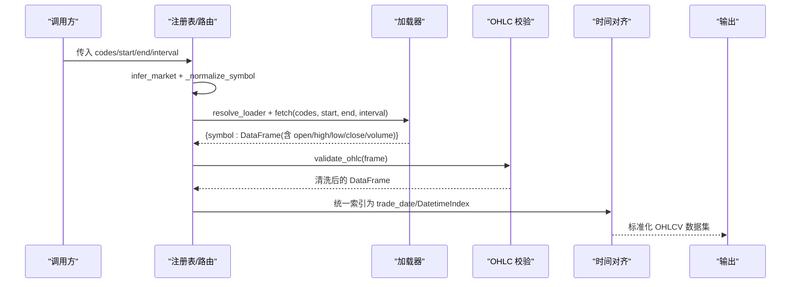
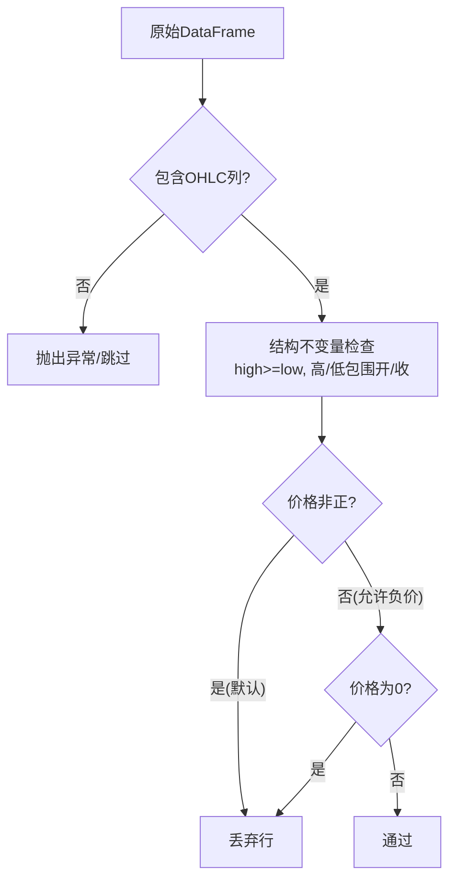
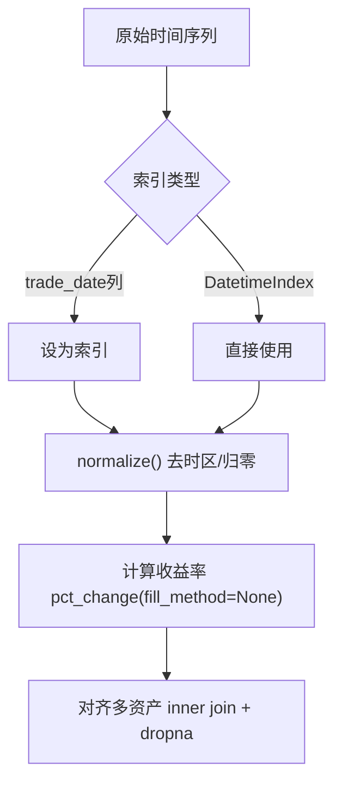
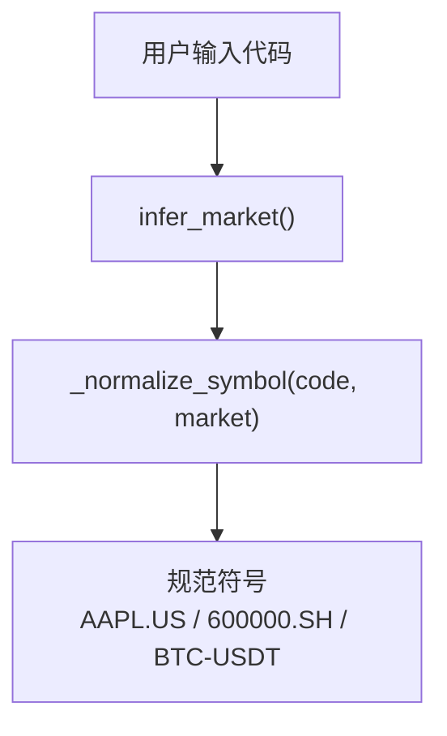
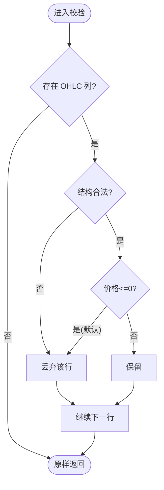
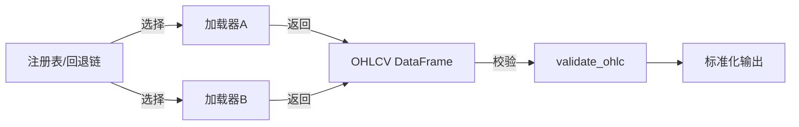

# 数据标准化

<cite>
**本文引用的文件**
- [base.py](file://agent/backtest/loaders/base.py)
- [registry.py](file://agent/backtest/loaders/registry.py)
- [runner.py](file://agent/backtest/runner.py)
- [correlation.py](file://agent/backtest/correlation.py)
- [symbols.py](file://agent/src/trading/connectors/mt5/symbols.py)
- [grounding.py](file://agent/src/agent/grounding.py)
- [tushare.py](file://agent/backtest/loaders/tushare.py)
- [ccxt_loader.py](file://agent/backtest/loaders/ccxt_loader.py)
- [longbridge.py](file://agent/backtest/loaders/longbridge.py)
- [models.py](file://agent/src/scheduled_research/models.py)
- [test_ohlc_validation.py](file://agent/tests/test_ohlc_validation.py)
- [test_market_data_tool.py](file://agent/tests/test_market_data_tool.py)
</cite>

## 目录
1. [简介](#简介)
2. [项目结构](#项目结构)
3. [核心组件](#核心组件)
4. [架构总览](#架构总览)
5. [详细组件分析](#详细组件分析)
6. [依赖关系分析](#依赖关系分析)
7. [性能考虑](#性能考虑)
8. [故障排查指南](#故障排查指南)
9. [结论](#结论)
10. [附录](#附录)

## 简介
本技术文档面向数据工程师与量化分析师，系统化阐述本项目中的数据标准化方案。内容涵盖统一数据格式（OHLCV）、时间戳与时区处理、频率转换与缺失值插补、符号标准化（股票代码映射、交易所前缀、大小写处理）、数据质量检查（完整性、范围、逻辑一致性），以及自定义标准化规则开发指南、性能优化技巧与调试方法。目标是确保来自多源、多市场的数据在进入回测与实盘前具备一致的结构、语义与质量。

## 项目结构
数据标准化贯穿“加载器—校验—对齐—输出”的流水线：
- 加载器层：各市场/供应商实现 DataLoaderProtocol，返回统一的 OHLCV DataFrame；提供重试、预算控制与本地缓存。
- 路由与注册：按市场类型选择加载器链，支持自动回退与显式来源。
- 校验与清洗：在加载边界执行 OHLC 不变量校验，丢弃或拒绝脏数据。
- 符号标准化：将用户输入统一到项目规范符号（如 AAPL.US、600000.SH、BTC-USDT）。
- 时间对齐：统一索引为交易日期，必要时进行归一化与重采样。
- 元数据与溯源：记录数据来源、货币单位、体积单位等，便于下游消费。

**图示来源**
- [registry.py:139-158](file://agent/backtest/loaders/registry.py#L139-L158)
- [correlation.py:19-89](file://agent/backtest/correlation.py#L19-L89)
- [base.py:187-256](file://agent/backtest/loaders/base.py#L187-L256)

**章节来源**
- [registry.py:139-158](file://agent/backtest/loaders/registry.py#L139-L158)
- [correlation.py:19-89](file://agent/backtest/correlation.py#L19-L89)
- [base.py:187-256](file://agent/backtest/loaders/base.py#L187-L256)

## 核心组件
- 数据加载协议与通用工具：定义 DataLoaderProtocol、日期校验、OHLC 不变量校验、重试/预算、本地缓存。
- 加载器注册与回退链：维护市场到加载器的映射与顺序，支持自动选择与降级。
- 符号与市场推断：根据代码后缀与形态推断市场并生成规范符号。
- 时间对齐与频率映射：统一 trade_date 索引，支持分钟级频率映射与重采样。
- 数据质量门禁：在加载边界强制校验 OHLC 结构，防止脏数据进入回测。
- 元数据与溯源：记录 volume_unit、source、currency_conversion 等，便于审计与对齐。

**章节来源**
- [base.py:164-256](file://agent/backtest/loaders/base.py#L164-L256)
- [registry.py:23-158](file://agent/backtest/loaders/registry.py#L23-L158)
- [correlation.py:19-89](file://agent/backtest/correlation.py#L19-L89)
- [tushare.py:434-462](file://agent/backtest/loaders/tushare.py#L434-L462)
- [test_market_data_tool.py:100-131](file://agent/tests/test_market_data_tool.py#L100-L131)

## 架构总览
下图展示从用户请求到标准化输出的端到端流程，包括符号标准化、加载器选择、数据获取、OHLC 校验、时间对齐与结果输出。

**图示来源**
- [correlation.py:19-89](file://agent/backtest/correlation.py#L19-L89)
- [registry.py:614-649](file://agent/backtest/loaders/registry.py#L614-L649)
- [base.py:187-256](file://agent/backtest/loaders/base.py#L187-L256)

## 详细组件分析

### 统一数据格式设计（OHLCV）
- 标准列：open、high、low、close、volume，可选 vwap、amount。
- 索引：以 trade_date 作为列名或 DatetimeIndex；部分加载器直接返回 DatetimeIndex。
- 类型：价格与成交量为数值型；空值由加载器自行 dropna，随后由统一校验过滤结构性错误。
- 元数据：通过 provenance 暴露 source、requested_source、detected_source、fallback_used、currency_conversion、volume_unit 等，便于下游按市场理解 volume 单位。

**图示来源**
- [base.py:187-256](file://agent/backtest/loaders/base.py#L187-L256)

**章节来源**
- [base.py:187-256](file://agent/backtest/loaders/base.py#L187-L256)
- [test_market_data_tool.py:100-131](file://agent/tests/test_market_data_tool.py#L100-L131)

### 时间戳标准化与时间对齐
- 统一索引：优先使用 trade_date 列；若无则使用 DatetimeIndex。
- 时区与归一化：计算相关性与跨市场对齐时，对索引执行 normalize() 至当日零点，避免跨时区导致的错位。
- 频率映射：不同加载器对分钟级频率命名不一致（如 1m/1min），需映射到目标 API 期望的频率字符串。
- 缺失值处理：pct_change 明确禁止隐式填充，避免制造虚假收益；缺失交易日保留为 NaN，后续由策略或指标处理。

**图示来源**
- [correlation.py:110-132](file://agent/backtest/correlation.py#L110-L132)
- [correlation.py:162-176](file://agent/backtest/correlation.py#L162-L176)
- [tushare.py:434-462](file://agent/backtest/loaders/tushare.py#L434-L462)

**章节来源**
- [correlation.py:110-132](file://agent/backtest/correlation.py#L110-L132)
- [correlation.py:162-176](file://agent/backtest/correlation.py#L162-L176)
- [tushare.py:434-462](file://agent/backtest/loaders/tushare.py#L434-L462)

### 货币与单位统一
- 货币单位：通过 provenance.currency_conversion 标识是否发生汇率换算；未发生则为 none。
- 成交量单位：不同市场原生单位不同（如 A 股“手”、港股“股数”），加载器声明 volume_units，消费者读取 per-symbol 的 volume_unit 字段，避免误用。
- 价格单位：统一为报价货币；跨市场比较时需关注汇率影响。

**章节来源**
- [test_market_data_tool.py:100-131](file://agent/tests/test_market_data_tool.py#L100-L131)
- [base.py:851-863](file://agent/backtest/loaders/base.py#L851-L863)

### 符号标准化
- 市场推断：根据后缀与形态识别 crypto、HK、A 股、美股、韩股、加拿大等。
- 规范符号：
  - 美股：AAPL -> AAPL.US
  - A 股：6xxxxx -> .SH；4/8xxxxx -> .BJ；其余 -> .SZ
  - 港股：数字码补齐为 5 位，后缀 .HK
  - 加密货币：保持 BTC-USDT 形式
- 文本符号归一：去除分隔符、统一大写、SS 折叠为 SH、前缀转后缀等。

**图示来源**
- [correlation.py:19-89](file://agent/backtest/correlation.py#L19-L89)
- [grounding.py:493-518](file://agent/src/agent/grounding.py#L493-L518)
- [symbols.py:29-41](file://agent/src/trading/connectors/mt5/symbols.py#L29-L41)

**章节来源**
- [correlation.py:19-89](file://agent/backtest/correlation.py#L19-L89)
- [grounding.py:493-518](file://agent/src/agent/grounding.py#L493-L518)
- [symbols.py:29-41](file://agent/src/trading/connectors/mt5/symbols.py#L29-L41)

### 数据质量检查
- 不变量校验：丢弃 high < low、高/低不包围开/收、非正价格（可配置允许负价但拒绝零价）的行。
- 边界兜底：即使个别加载器未调用校验，统一入口仍会清洗，保证回测安全。
- 测试覆盖：用例验证了无效 K 线被剔除、最终数据仅保留有效行。

**图示来源**
- [base.py:187-256](file://agent/backtest/loaders/base.py#L187-L256)
- [test_ohlc_validation.py:23-38](file://agent/tests/test_ohlc_validation.py#L23-L38)

**章节来源**
- [base.py:187-256](file://agent/backtest/loaders/base.py#L187-L256)
- [test_ohlc_validation.py:23-38](file://agent/tests/test_ohlc_validation.py#L23-L38)

### 自定义标准化规则开发指南
- 新增加载器：实现 DataLoaderProtocol，声明 name/markets/requires_auth，并在模块导入时通过装饰器注册；遵循 fetch() 返回 {symbol: DataFrame} 的约定。
- 频率映射：若供应商使用不同分钟频率命名，需在加载器内部映射为标准 interval。
- 单位声明：如市场有特定 volume 单位，可在类上声明 volume_units，供上游读取。
- 校验接入：建议在加载器内先 dropna，再调用 validate_ohlc 进行结构性清洗；或在统一入口确保所有数据经过校验。
- 缓存与重试：复用 base.py 的重试/预算与本地 parquet 缓存机制，提升稳定性与性能。

**章节来源**
- [base.py:127-236](file://agent/backtest/loaders/base.py#L127-L236)
- [base.py:243-441](file://agent/backtest/loaders/base.py#L243-L441)
- [registry.py:63-117](file://agent/backtest/loaders/registry.py#L63-L117)

### 时间对齐与缺失值插补策略
- 对齐原则：以 trade_date 为基准，跨市场比较时统一归零到当日。
- 插补策略：收益率计算禁用隐式填充，缺失交易日保留 NaN；如需重采样，应在业务层明确插补方法（前向/后向/线性/零填充）并记录。
- 频率转换：分钟级数据在不同供应商间命名不一，需统一映射；日频数据可直接拼接。

**章节来源**
- [correlation.py:162-176](file://agent/backtest/correlation.py#L162-L176)
- [tushare.py:434-462](file://agent/backtest/loaders/tushare.py#L434-L462)

### 时区处理
- 存储与显示：建议统一使用 UTC 或业务时区；对外接口可接受 IANA 时区键，并进行形状校验。
- 解析与转换：在持久化层做时区键合法性校验，运行期再解析；不可解析时作为作业失败上报，避免静默错误。

**章节来源**
- [models.py:142-161](file://agent/src/scheduled_research/models.py#L142-L161)

## 依赖关系分析
- 加载器注册与回退链：按市场维护加载器优先级，支持自动选择与降级；某些来源（local、tickerall）不允许静默网络回退。
- 符号与市场推断：集中处理代码到市场的映射与规范符号生成，避免分散逻辑导致的不一致。
- 校验与清洗：在加载边界集中校验，降低下游风险。
- 缓存与重试：基于内容寻址的本地缓存与带预算的重试，提高鲁棒性。

**图示来源**
- [registry.py:139-196](file://agent/backtest/loaders/registry.py#L139-L196)
- [base.py:187-256](file://agent/backtest/loaders/base.py#L187-L256)

**章节来源**
- [registry.py:139-196](file://agent/backtest/loaders/registry.py#L139-L196)
- [base.py:187-256](file://agent/backtest/loaders/base.py#L187-L256)

## 性能考虑
- 本地缓存：启用后按内容寻址缓存 parquet 文件，命中即返回，减少网络开销；仅对已结算区间缓存，避免钉住未闭合 K 线。
- 重试与预算：对瞬态异常采用指数退避与截止时间控制，避免长时间阻塞。
- 批量与并行：按 symbol 循环拉取时可结合缓存与并发策略（注意供应商限流）。
- 内存与序列化：使用 DuckDB 读写 parquet 并恢复索引 dtype，减少精度损失与类型漂移。

**章节来源**
- [base.py:243-441](file://agent/backtest/loaders/base.py#L243-L441)
- [base.py:477-598](file://agent/backtest/loaders/base.py#L477-L598)

## 故障排查指南
- 无可用数据源：检查市场对应的加载器链是否全部不可用；确认网络与凭据配置。
- 数据为空：核对 interval 是否受支持；部分供应商不支持 ETF/指数/跨境/加密的分钟数据。
- OHLC 校验失败：查看日志中丢弃行数；定位 dirty bar 的原因（high<low、价格非正等）。
- 时区问题：确认 IANA 时区键可解析；不可解析时作业失败而非静默降级。
- 缓存命中异常：检查缓存开关与区间是否已结算；损坏缓存会被忽略并回退到在线源。

**章节来源**
- [registry.py:614-649](file://agent/backtest/loaders/registry.py#L614-L649)
- [tushare.py:434-462](file://agent/backtest/loaders/tushare.py#L434-L462)
- [base.py:187-256](file://agent/backtest/loaders/base.py#L187-L256)
- [models.py:142-161](file://agent/src/scheduled_research/models.py#L142-L161)

## 结论
本项目通过“符号标准化—加载器回退—OHLC 校验—时间对齐—元数据溯源”的流水线，实现了跨市场、跨供应商数据的统一与高质量交付。借助本地缓存与重试机制，系统在稳定性与性能之间取得平衡。对于新增市场或供应商，只需遵循协议与规范，即可无缝融入现有体系。

## 附录
- 常用 interval 与频率映射：参考各加载器内部映射（如 tushare 的分钟频率映射）。
- 市场后缀约定：.US/.SH/.SZ/.BJ/.HK/.TO/.V/.FX 等。
- 体积单位说明：A 股“手”、港股“股数”，请依据 volume_unit 消费。