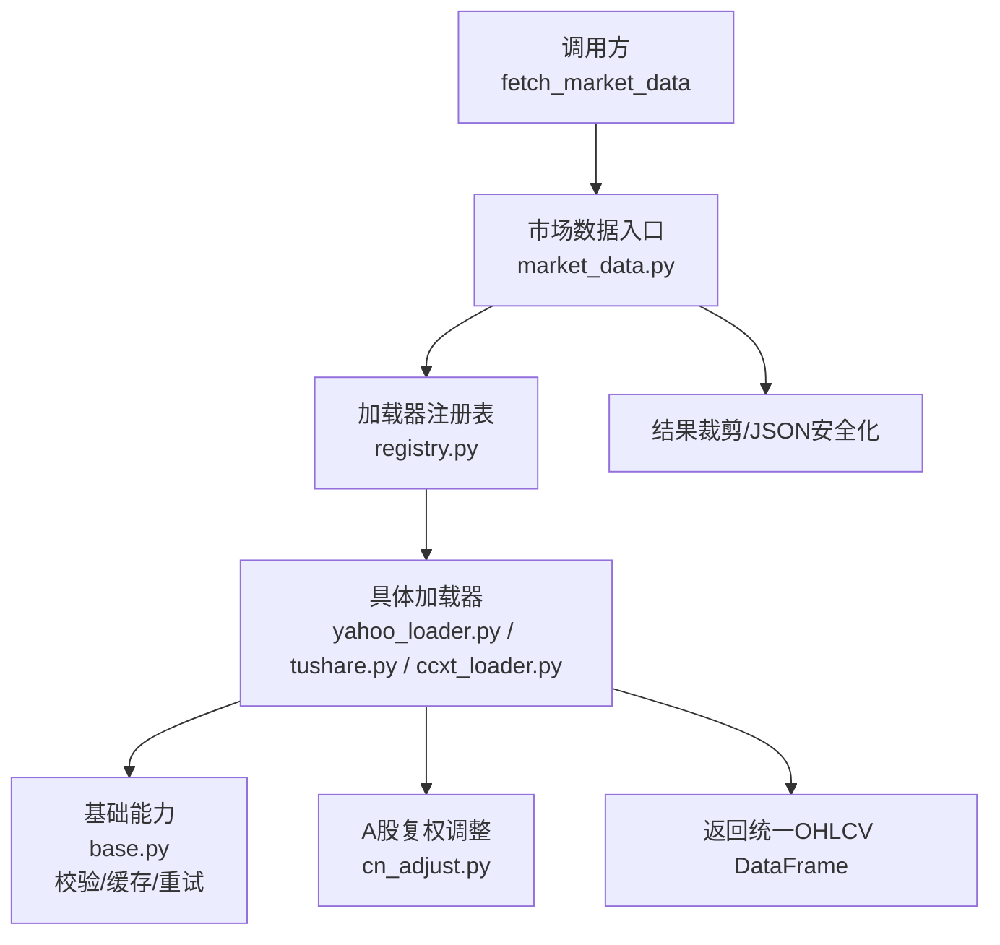
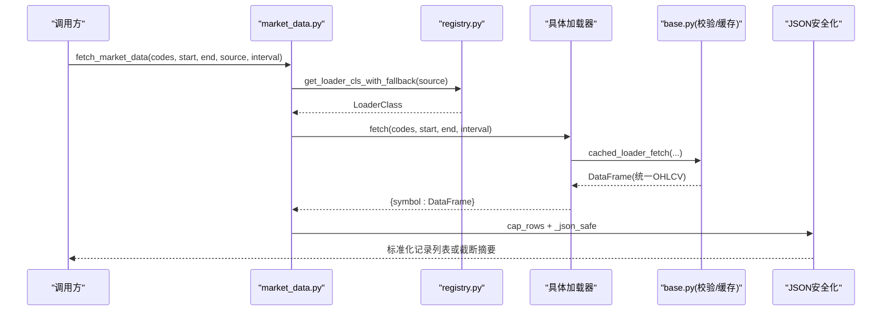
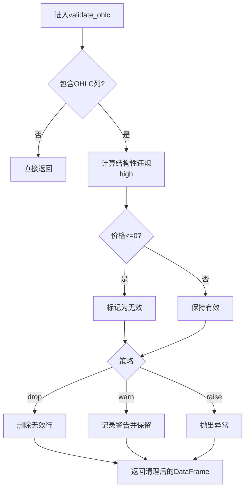
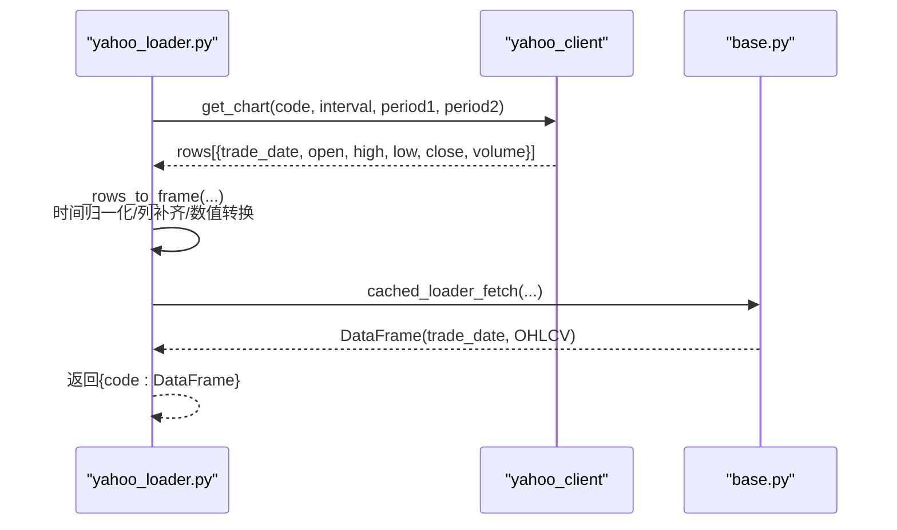
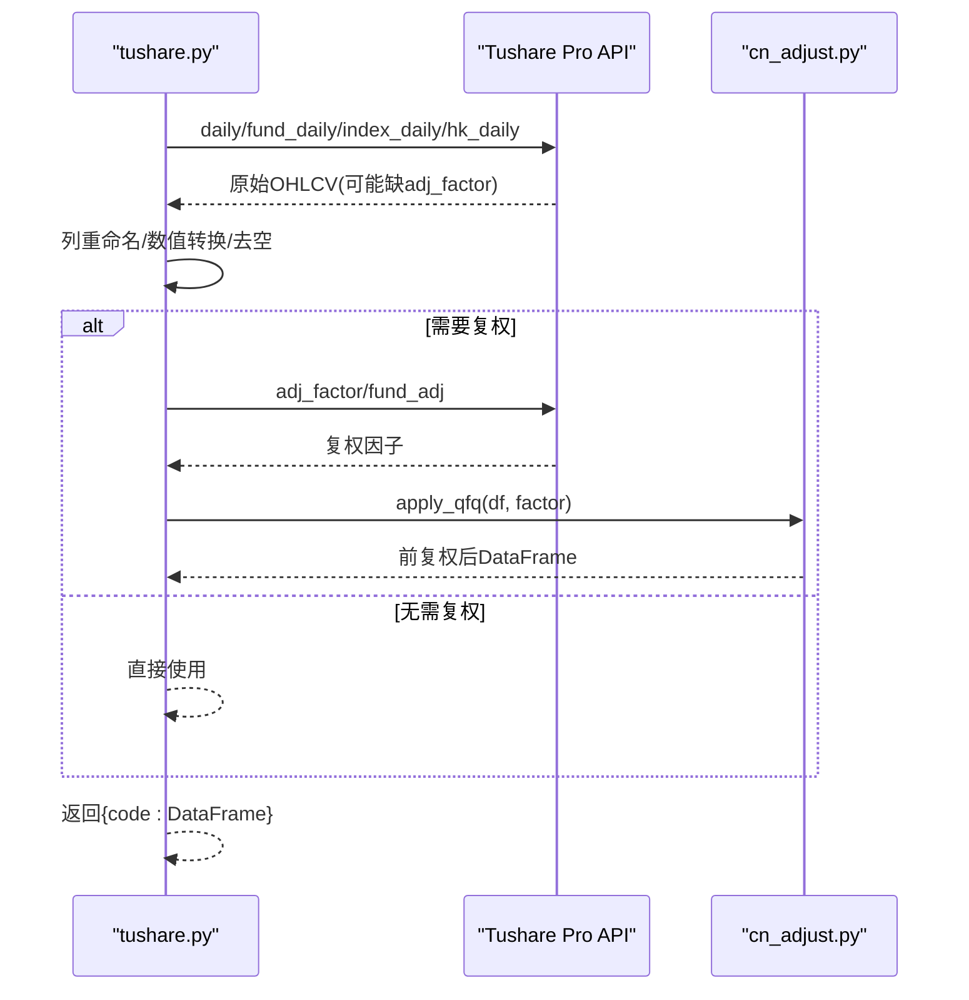
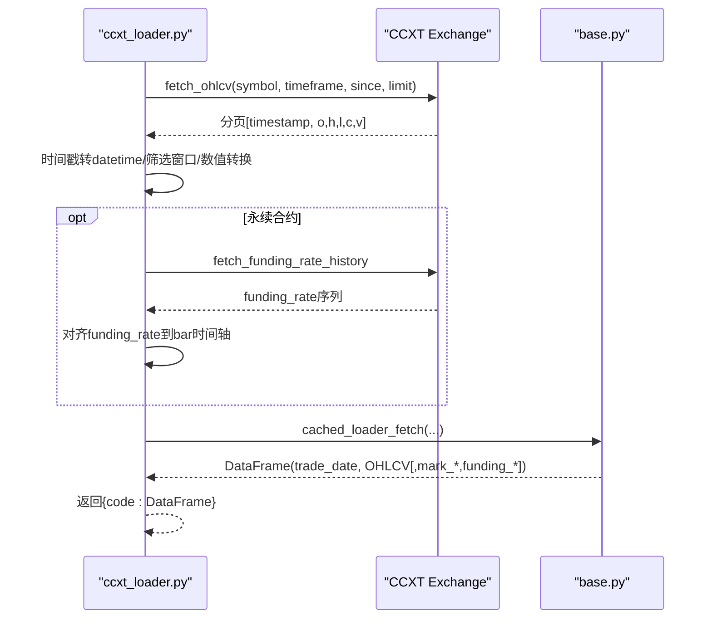
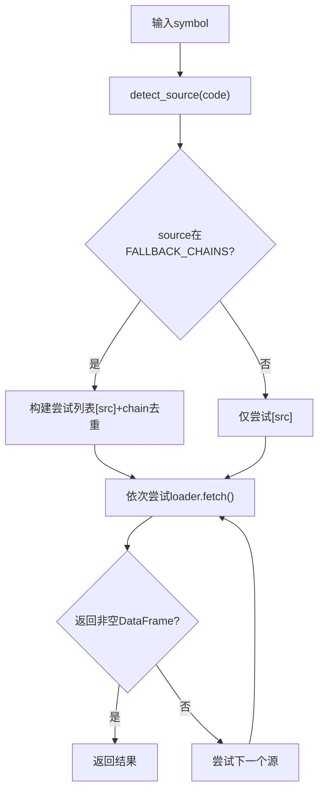
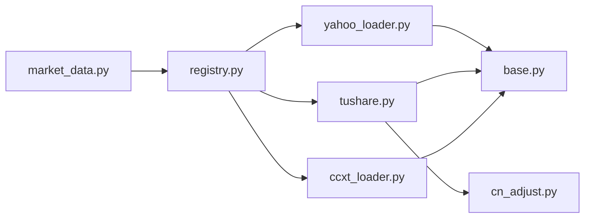

# 数据格式转换

<cite>
**本文引用的文件**
- [agent/src/market_data.py](file://agent/src/market_data.py)
- [agent/backtest/loaders/base.py](file://agent/backtest/loaders/base.py)
- [agent/backtest/loaders/registry.py](file://agent/backtest/loaders/registry.py)
- [agent/backtest/loaders/yahoo_loader.py](file://agent/backtest/loaders/yahoo_loader.py)
- [agent/backtest/loaders/tushare.py](file://agent/backtest/loaders/tushare.py)
- [agent/backtest/loaders/ccxt_loader.py](file://agent/backtest/loaders/ccxt_loader.py)
- [agent/backtest/loaders/cn_adjust.py](file://agent/backtest/loaders/cn_adjust.py)
- [agent/tests/test_ohlc_validation.py](file://agent/tests/test_ohlc_validation.py)
- [agent/tests/test_loader_volume_units.py](file://agent/tests/test_loader_volume_units.py)
</cite>

## 目录
1. [简介](#简介)
2. [项目结构](#项目结构)
3. [核心组件](#核心组件)
4. [架构总览](#架构总览)
5. [详细组件分析](#详细组件分析)
6. [依赖关系分析](#依赖关系分析)
7. [性能考量](#性能考量)
8. [故障排查指南](#故障排查指南)
9. [结论](#结论)
10. [附录](#附录)

## 简介
本技术文档聚焦于统一 OHLCV 数据结构的设计与实现，以及多源数据（Yahoo Finance、Tushare、CCXT 等）到统一格式的映射与转换机制。文档涵盖：
- 统一字段定义：open、high、low、close、volume 的标准化规范
- 数据源差异与映射逻辑：不同来源的列名、时间戳、区间、单位差异如何归一化
- 数据类型转换：字符串到数值、日期时间解析、货币与单位处理
- 精度与异常值策略：浮点精度控制、舍入规则、NaN/Inf 处理
- 自定义适配器开发：接口规范、验证规则与性能优化建议
- 常见问题调试方法与解决方案

## 项目结构
系统采用“加载器注册 + 市场回退链”的分层架构：
- 入口层：统一获取与路由（自动选择数据源、回退链重试、结果裁剪与 JSON 安全输出）
- 加载器层：各数据源的具体实现（Yahoo、Tushare、CCXT 等），各自负责将原始响应转换为统一的 OHLCV DataFrame
- 基础能力层：校验、缓存、重试预算、协议定义等共享工具
- 注册表：维护可用数据源与市场回退顺序

图表来源
- [agent/src/market_data.py:97-234](file://agent/src/market_data.py#L97-L234)
- [agent/backtest/loaders/registry.py:139-158](file://agent/backtest/loaders/registry.py#L139-L158)
- [agent/backtest/loaders/base.py:23-27](file://agent/backtest/loaders/base.py#L23-L27)

章节来源
- [agent/src/market_data.py:16-57](file://agent/src/market_data.py#L16-L57)
- [agent/backtest/loaders/registry.py:19-60](file://agent/backtest/loaders/registry.py#L19-L60)

## 核心组件
- 统一 OHLCV 数据结构
  - 索引：trade_date（DatetimeIndex，时区无关；日线及以上统一归一到午夜）
  - 列：open、high、low、close、volume（均为数值型；缺失价格行被丢弃；volume 默认填充为 0）
  - 有效性：通过 validate_ohlc 进行结构性校验（high>=low、高低价包围开收价、非正价格过滤等）
- 数据源适配与映射
  - Yahoo：将 epoch 秒时间戳转为本地 DatetimeIndex，按区间是否日内决定时间归一化；列补齐并转数值
  - Tushare：区分日频与分钟频路径；vol->volume 重命名；可选前复权调整；指数/ETF/港股/美股/加密货币分流
  - CCXT：统一交易所抽象；分页拉取、预算与重试；时间戳毫秒转 datetime；支持现货与永续合约（含资金费率与标记价）
- 类型与单位
  - 数值：统一使用 pd.to_numeric(errors="coerce") 保证健壮转换
  - 时间：统一为无时区 DatetimeIndex；日线及以上归一到午夜对齐
  - 成交量单位：通过 volume_units 声明（如 A 股 lots=100 股，美股/港股 shares），消费者需读取 _provenance 中的 volume_unit
- 缓存与重试
  - 本地 Parquet 缓存（内容寻址键，带版本与元数据）
  - 预算内重试（超时、网络错误、配额限制）

章节来源
- [agent/backtest/loaders/base.py:168-256](file://agent/backtest/loaders/base.py#L168-L256)
- [agent/backtest/loaders/yahoo_loader.py:139-184](file://agent/backtest/loaders/yahoo_loader.py#L139-L184)
- [agent/backtest/loaders/tushare.py:207-268](file://agent/backtest/loaders/tushare.py#L207-L268)
- [agent/backtest/loaders/ccxt_loader.py:426-501](file://agent/backtest/loaders/ccxt_loader.py#L426-L501)
- [agent/backtest/loaders/cn_adjust.py:27-78](file://agent/backtest/loaders/cn_adjust.py#L27-L78)
- [agent/backtest/loaders/base.py:243-441](file://agent/backtest/loaders/base.py#L243-L441)

## 架构总览
下图展示从请求到返回的统一流程，包括自动源选择、回退链、加载器执行、数据清洗与输出。

图表来源
- [agent/src/market_data.py:97-234](file://agent/src/market_data.py#L97-L234)
- [agent/backtest/loaders/registry.py:199-255](file://agent/backtest/loaders/registry.py#L199-L255)
- [agent/backtest/loaders/base.py:623-661](file://agent/backtest/loaders/base.py#L623-L661)

## 详细组件分析

### 统一 OHLCV 数据结构与校验
- 字段定义
  - open/high/low/close/volume：数值型；缺失价格行丢弃；volume 缺失补 0
  - trade_date：DatetimeIndex；日线及以上归一到午夜，确保跨源对齐
- 校验规则
  - 结构性：high >= low；high/low 必须包围 open/close
  - 非正价格：默认拒绝 <=0 的价格；可配置允许负价格但拒绝零
  - 策略：drop（默认）、warn（保留并告警）、raise（抛出异常）
- 测试覆盖
  - 无效 K 线被剔除；warn/raise 行为正确；无 OHLC 列时原样返回

图表来源
- [agent/backtest/loaders/base.py:187-256](file://agent/backtest/loaders/base.py#L187-L256)
- [agent/tests/test_ohlc_validation.py:23-65](file://agent/tests/test_ohlc_validation.py#L23-L65)

章节来源
- [agent/backtest/loaders/base.py:187-256](file://agent/backtest/loaders/base.py#L187-L256)
- [agent/tests/test_ohlc_validation.py:23-65](file://agent/tests/test_ohlc_validation.py#L23-L65)

### Yahoo Finance 加载器
- 支持范围：美股、港股、印度、韩国、加拿大股票及期货/外汇后缀
- 时间处理：epoch 秒 -> 本地 DatetimeIndex；非日内区间归一到午夜
- 列处理：补齐缺失列；数值转换；volume 缺失补 0；按窗口裁剪
- 成交量单位：美股/港股为 shares（已在 volume_units 中声明）

图表来源
- [agent/backtest/loaders/yahoo_loader.py:139-184](file://agent/backtest/loaders/yahoo_loader.py#L139-L184)
- [agent/backtest/loaders/yahoo_loader.py:195-274](file://agent/backtest/loaders/yahoo_loader.py#L195-L274)
- [agent/backtest/loaders/base.py:623-661](file://agent/backtest/loaders/base.py#L623-L661)

章节来源
- [agent/backtest/loaders/yahoo_loader.py:29-106](file://agent/backtest/loaders/yahoo_loader.py#L29-L106)
- [agent/backtest/loaders/yahoo_loader.py:139-184](file://agent/backtest/loaders/yahoo_loader.py#L139-L184)
- [agent/backtest/loaders/yahoo_loader.py:173-274](file://agent/backtest/loaders/yahoo_loader.py#L173-L274)

### Tushare 加载器
- 日频路径：daily/fund_daily/index_daily/hk_daily；vol->volume；可选前复权调整
- 分钟频路径：stk_mins（1m/5m/15m/30m/1H）；不支持 ETF/指数/港股/美股/加密货币分钟数据
- 配额限制：识别限流关键字并退避重试
- 复权调整：apply_qfq 使用前复权因子校正除权缺口，避免收益率失真

图表来源
- [agent/backtest/loaders/tushare.py:207-268](file://agent/backtest/loaders/tushare.py#L207-L268)
- [agent/backtest/loaders/cn_adjust.py:27-78](file://agent/backtest/loaders/cn_adjust.py#L27-L78)

章节来源
- [agent/backtest/loaders/tushare.py:18-80](file://agent/backtest/loaders/tushare.py#L18-L80)
- [agent/backtest/loaders/tushare.py:207-268](file://agent/backtest/loaders/tushare.py#L207-L268)
- [agent/backtest/loaders/cn_adjust.py:27-78](file://agent/backtest/loaders/cn_adjust.py#L27-L78)

### CCXT 加载器（加密货币）
- 统一交易所抽象：支持现货与永续合约；可配置交易所与代理
- 分页拉取与预算：每页 limit=1000；设置超时与总预算，防止挂起
- 时间处理：毫秒时间戳 -> DatetimeIndex；按 timeframe 容差检查完整性
- 永续合约增强：合并执行价与标记价；资金费率历史对齐；可选维护保证金层级（外部制品校验）

图表来源
- [agent/backtest/loaders/ccxt_loader.py:226-308](file://agent/backtest/loaders/ccxt_loader.py#L226-L308)
- [agent/backtest/loaders/ccxt_loader.py:310-372](file://agent/backtest/loaders/ccxt_loader.py#L310-L372)
- [agent/backtest/loaders/ccxt_loader.py:374-424](file://agent/backtest/loaders/ccxt_loader.py#L374-L424)
- [agent/backtest/loaders/ccxt_loader.py:426-501](file://agent/backtest/loaders/ccxt_loader.py#L426-L501)

章节来源
- [agent/backtest/loaders/ccxt_loader.py:32-57](file://agent/backtest/loaders/ccxt_loader.py#L32-L57)
- [agent/backtest/loaders/ccxt_loader.py:226-308](file://agent/backtest/loaders/ccxt_loader.py#L226-L308)
- [agent/backtest/loaders/ccxt_loader.py:426-501](file://agent/backtest/loaders/ccxt_loader.py#L426-L501)

### 数据源回退链与自动路由
- 自动路由：根据符号模式匹配首选源（如 .US/.HK/.TO/.KS/KQ、/USDT、FX 对等）
- 回退链：按市场类型定义优先级（例如 a_share: tencent->mootdx->eastmoney->...）
- 失败降级：当首选不可用或报错，自动尝试链中下一个源，直至成功或耗尽预算

图表来源
- [agent/src/market_data.py:16-57](file://agent/src/market_data.py#L16-L57)
- [agent/backtest/loaders/registry.py:139-158](file://agent/backtest/loaders/registry.py#L139-L158)
- [agent/src/market_data.py:143-199](file://agent/src/market_data.py#L143-L199)

章节来源
- [agent/src/market_data.py:16-57](file://agent/src/market_data.py#L16-L57)
- [agent/backtest/loaders/registry.py:139-158](file://agent/backtest/loaders/registry.py#L139-L158)
- [agent/src/market_data.py:143-199](file://agent/src/market_data.py#L143-L199)

### 数据类型转换与精度处理
- 数值转换：pd.to_numeric(errors="coerce") 将字符串/异常值转为 NaN，随后按需填充或丢弃
- 时间转换：统一为无时区 DatetimeIndex；日线及以上归一到午夜；分钟/小时保留真实时间
- 单位与货币：
  - 成交量单位由 volume_units 声明（如 A 股 lots=100 股，美股/港股 shares）
  - 消费者应读取 _provenance.volume_unit，避免假设单位
- NaN/Inf 处理：
  - JSON 安全化：非有限浮点数（NaN/Inf）转为 None
  - 结构化校验：validate_ohlc 丢弃违反 OHLC 不变量的行
  - 复权调整：缺失或无效因子时放弃该标的，避免污染收益

章节来源
- [agent/src/market_data.py:229-236](file://agent/src/market_data.py#L229-L236)
- [agent/backtest/loaders/yahoo_loader.py:173-184](file://agent/backtest/loaders/yahoo_loader.py#L173-L184)
- [agent/backtest/loaders/tushare.py:240-249](file://agent/backtest/loaders/tushare.py#L240-L249)
- [agent/backtest/loaders/ccxt_loader.py:476-489](file://agent/backtest/loaders/ccxt_loader.py#L476-L489)
- [agent/backtest/loaders/base.py:187-256](file://agent/backtest/loaders/base.py#L187-L256)
- [agent/backtest/loaders/cn_adjust.py:54-78](file://agent/backtest/loaders/cn_adjust.py#L54-L78)

### 自定义数据格式适配器开发指南
- 接口规范
  - 类属性：name、markets、requires_auth、可选 volume_units
  - 方法：is_available()、fetch(codes, start_date, end_date, interval="1D", fields=None) -> dict[str, DataFrame]
  - 返回 DataFrame 必须包含 trade_date 索引与 OHLCV 列
- 验证规则
  - 在 loader 内部或统一边界调用 validate_ohlc，确保结构性一致
  - 明确声明 volume_units，避免下游误判单位
- 性能优化建议
  - 使用 cached_loader_fetch 包装单次 symbol 拉取，减少重复请求
  - 合理设置超时与预算（参考 CCXT 的 _CCXT_TIMEOUT_MS 与 _CCXT_FETCH_BUDGET_S）
  - 分页拉取时结合 check_budget/retry_with_budget，避免长时间阻塞
- 最佳实践
  - 时间归一化：日线及以上统一到午夜；分钟/小时保留真实时间
  - 数值转换：统一使用 errors="coerce" 并显式填充 volume 缺失
  - 复权处理：A 股/基金优先使用前复权，缺失因子则放弃该标的

章节来源
- [agent/backtest/loaders/base.py:851-887](file://agent/backtest/loaders/base.py#L851-L887)
- [agent/backtest/loaders/base.py:623-661](file://agent/backtest/loaders/base.py#L623-L661)
- [agent/backtest/loaders/ccxt_loader.py:50-57](file://agent/backtest/loaders/ccxt_loader.py#L50-L57)
- [agent/backtest/loaders/yahoo_loader.py:139-184](file://agent/backtest/loaders/yahoo_loader.py#L139-L184)
- [agent/backtest/loaders/tushare.py:207-268](file://agent/backtest/loaders/tushare.py#L207-L268)

## 依赖关系分析
- 模块耦合
  - market_data.py 依赖 registry.py 进行加载器选择与回退
  - 各加载器依赖 base.py 提供校验、缓存、重试等通用能力
  - Tushare 依赖 cn_adjust.py 进行复权调整
- 外部依赖
  - CCXT 用于加密资产统一访问
  - Tushare Pro API 用于 A 股/基金/指数/港股
  - Yahoo 公共图表端点用于美股/港股/其他市场
- 潜在循环依赖
  - 通过延迟导入与懒初始化避免（如 exchange_holder、_ensure_registered）

图表来源
- [agent/src/market_data.py:97-234](file://agent/src/market_data.py#L97-L234)
- [agent/backtest/loaders/registry.py:72-117](file://agent/backtest/loaders/registry.py#L72-L117)
- [agent/backtest/loaders/base.py:23-27](file://agent/backtest/loaders/base.py#L23-L27)
- [agent/backtest/loaders/cn_adjust.py:1-20](file://agent/backtest/loaders/cn_adjust.py#L1-L20)

章节来源
- [agent/backtest/loaders/registry.py:72-117](file://agent/backtest/loaders/registry.py#L72-L117)
- [agent/backtest/loaders/base.py:23-27](file://agent/backtest/loaders/base.py#L23-L27)

## 性能考量
- 缓存命中：启用本地 Parquet 缓存可减少重复网络请求；键包含版本、源、标的、时间窗与字段
- 预算与重试：为易失败的外部 API 设置超时与预算，避免长尾阻塞；对瞬态错误进行指数退避重试
- 分页与裁剪：分页拉取时及时终止（达到 end 或不足一页）；结果按 max_rows 采样裁剪，控制负载
- 时间归一化：日线及以上统一到午夜，降低后续对齐成本
- 复权调整：仅在必要时调用，缺失因子时快速失败，避免无效计算

章节来源
- [agent/backtest/loaders/base.py:243-441](file://agent/backtest/loaders/base.py#L243-L441)
- [agent/backtest/loaders/ccxt_loader.py:50-57](file://agent/backtest/loaders/ccxt_loader.py#L50-L57)
- [agent/src/market_data.py:208-226](file://agent/src/market_data.py#L208-L226)

## 故障排查指南
- 常见症状与定位
  - 数据为空：检查符号是否受支持、时间窗是否有效、加载器是否可用（is_available）
  - 收益率异常：确认是否应用了前复权；缺失因子会导致收益率失真
  - 成交量偏差：核对 volume_units 与实际单位（A 股 lots vs 美股/港股 shares）
  - 时间错位：确认日线及以上是否归一到午夜；分钟/小时是否保留真实时间
- 调试步骤
  - 查看 _provenance.source 与 fallback_used，确认实际使用的数据源
  - 检查 JSON 安全化是否将 Inf/NaN 转为 None，避免下游序列化错误
  - 使用 validate_ohlc 的 warn/raise 策略定位结构性脏数据
- 解决方案
  - 调整回退链顺序或更换数据源
  - 修正时间窗与区间映射（如 4H->1h 近似）
  - 补充复权因子或放弃该标的以避免污染

章节来源
- [agent/src/market_data.py:207-232](file://agent/src/market_data.py#L207-L232)
- [agent/backtest/loaders/base.py:187-256](file://agent/backtest/loaders/base.py#L187-L256)
- [agent/backtest/loaders/tushare.py:253-268](file://agent/backtest/loaders/tushare.py#L253-L268)
- [agent/tests/test_loader_volume_units.py:27-55](file://agent/tests/test_loader_volume_units.py#L27-L55)

## 结论
本系统通过统一的 OHLCV 结构与严格的校验机制，实现了多源数据的标准化接入与稳健转换。借助回退链、缓存与预算重试，系统在可用性、性能与鲁棒性之间取得平衡。对于自定义适配器，遵循接口规范与验证规则，并结合性能优化建议，可快速扩展新的数据源。

## 附录
- 关键常量与映射
  - 区间映射：1D/1H/4H/1W/1M 等在不同加载器中有对应实现
  - 市场回退链：a_share/us_equity/hk_equity/crypto/forex 等各有优先级
- 术语
  - lots：交易单位（A 股 1 lot = 100 股）
  - shares：单股成交量
  - 前复权：以窗口末期为基准向前调整价格与成交量