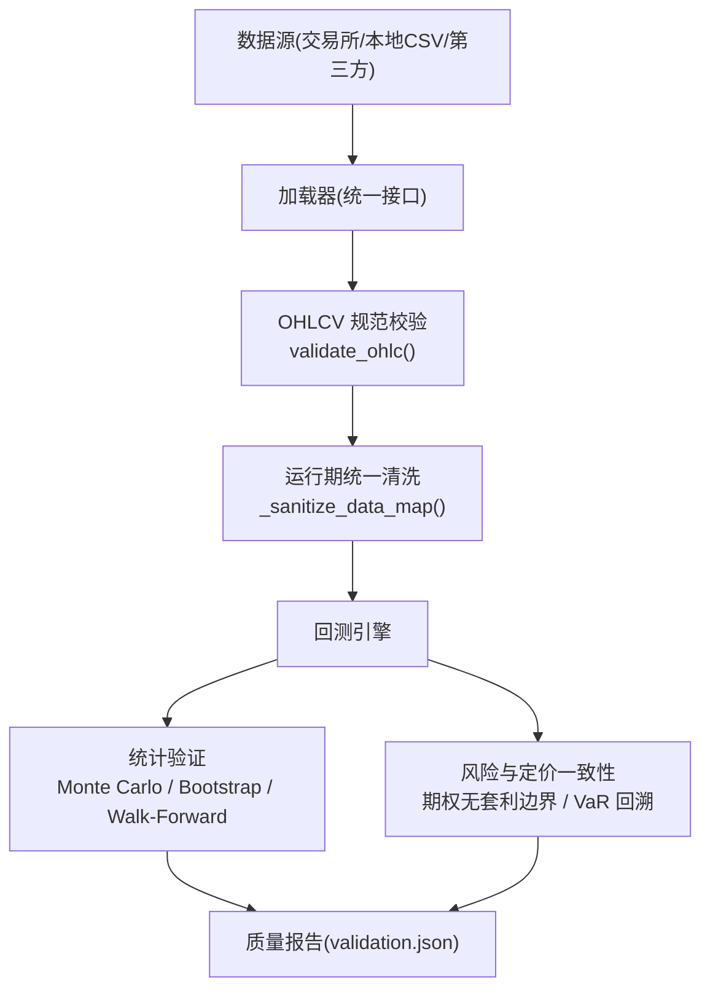
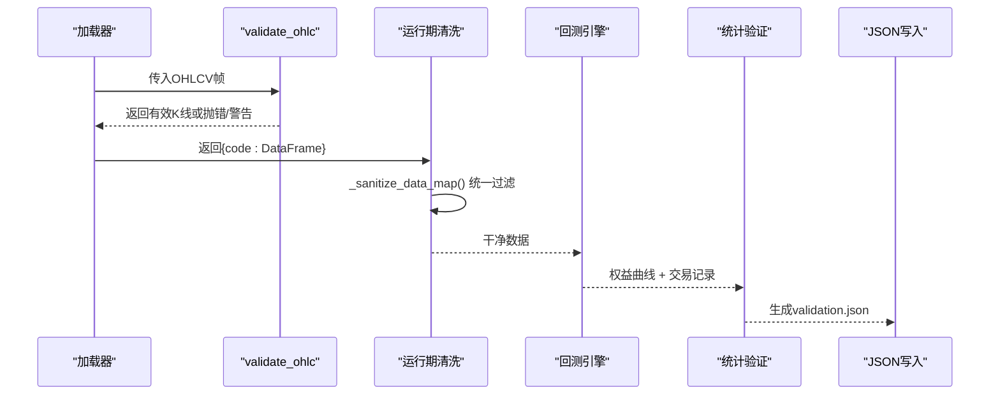
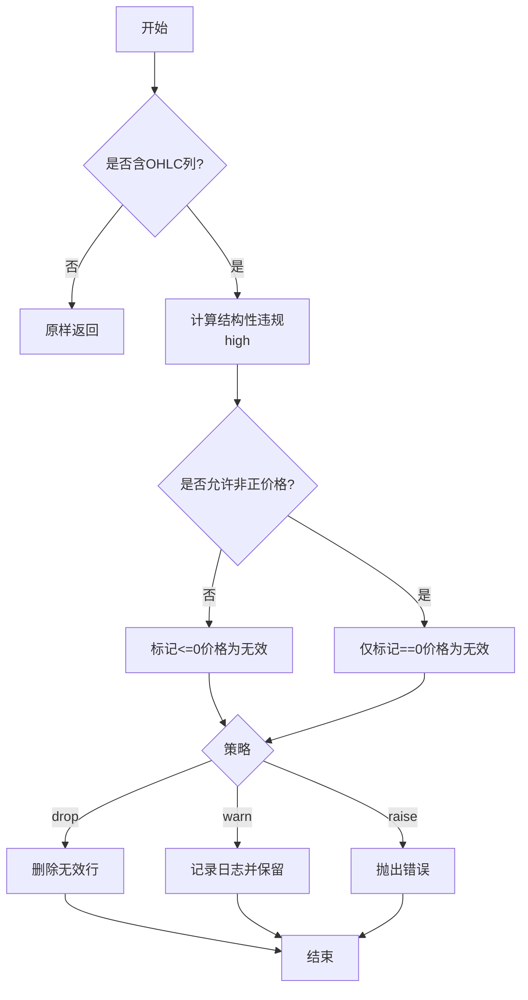
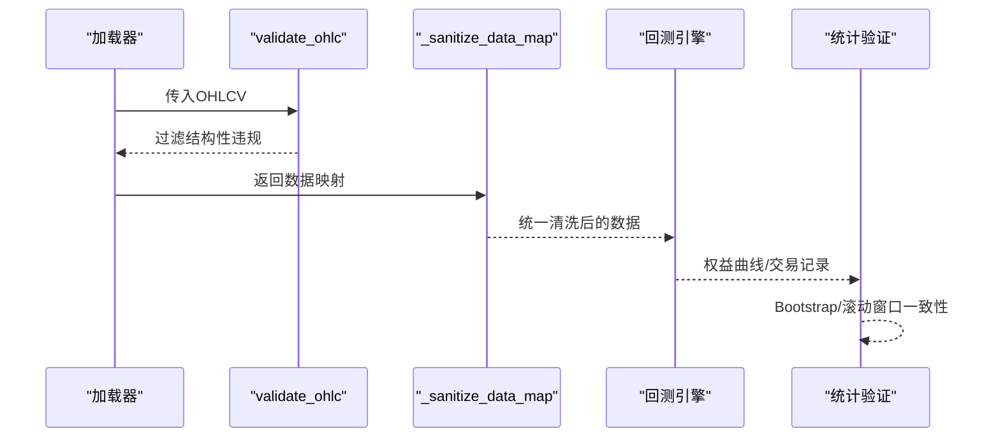
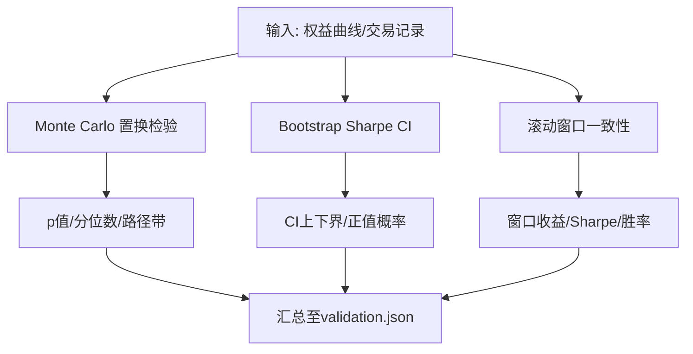
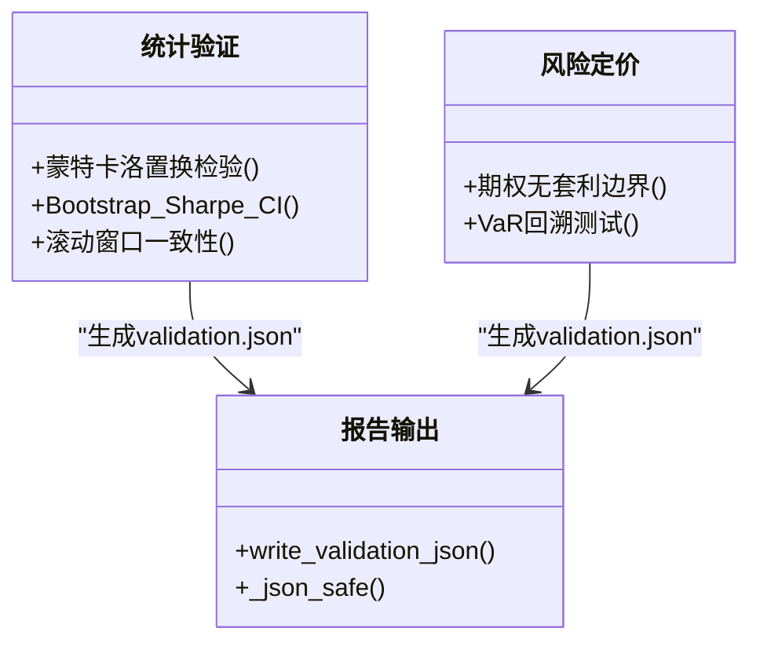
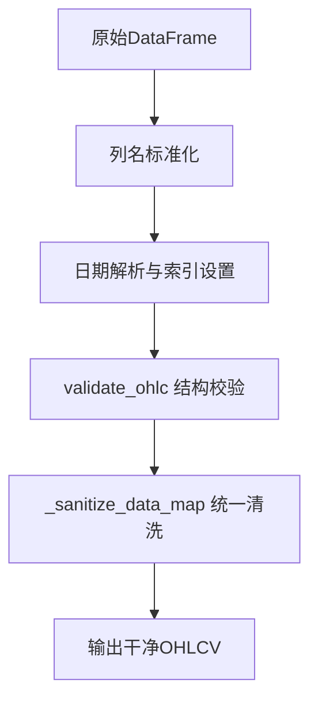
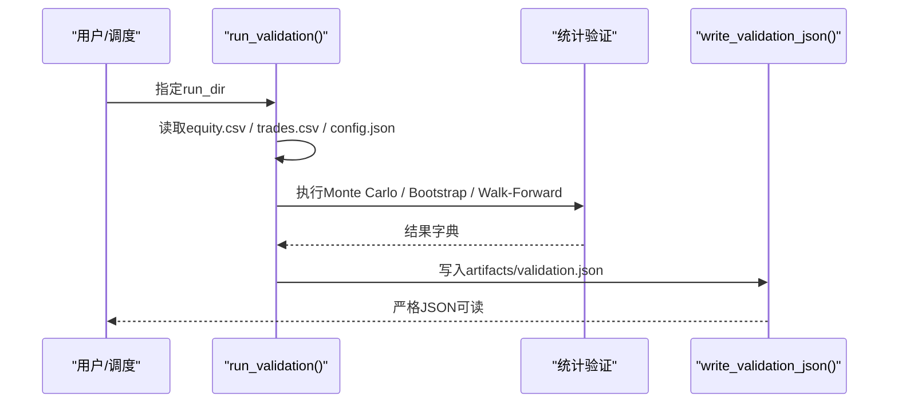
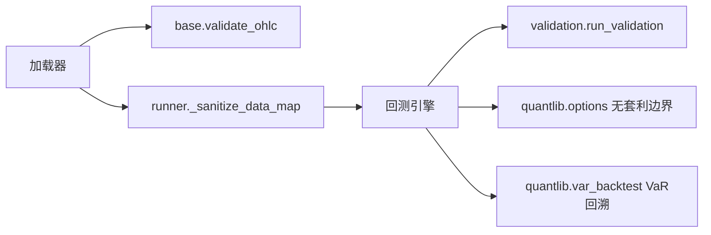

# 数据质量验证

<cite>
**本文引用的文件**
- [agent/backtest/validation.py](file://agent/backtest/validation.py)
- [agent/backtest/runner.py](file://agent/backtest/runner.py)
- [agent/backtest/loaders/base.py](file://agent/backtest/loaders/base.py)
- [agent/backtest/loaders/local_loader.py](file://agent/backtest/loaders/local_loader.py)
- [agent/tests/test_ohlc_validation.py](file://agent/tests/test_ohlc_validation.py)
- [agent/tests/test_validation.py](file://agent/tests/test_validation.py)
- [agent/src/quantlib/options.py](file://agent/src/quantlib/options.py)
- [agent/src/quantlib/var_backtest.py](file://agent/src/quantlib/var_backtest.py)
- [agent/src/skills/data-routing/SKILL.md](file://agent/src/skills/data-routing/SKILL.md)
</cite>

## 目录
1. [简介](#简介)
2. [项目结构](#项目结构)
3. [核心组件](#核心组件)
4. [架构总览](#架构总览)
5. [详细组件分析](#详细组件分析)
6. [依赖关系分析](#依赖关系分析)
7. [性能考虑](#性能考虑)
8. [故障排查指南](#故障排查指南)
9. [结论](#结论)
10. [附录](#附录)

## 简介
本技术文档围绕数据质量验证系统，系统化说明完整性检查、逻辑一致性校验、异常值检测、质量评分与报告、数据清洗流程以及质量监控工具的使用。该体系覆盖从数据接入到回测评估的全链路质量控制，确保价格、成交量、收益率等关键指标在结构与业务层面均满足一致性与稳健性要求。

## 项目结构
数据质量相关能力主要分布在以下模块：
- 数据接入与清洗：OHLCV 规范校验、字段标准化、无效K线剔除
- 回测结果统计验证：蒙特卡洛置换检验、Bootstrap Sharpe 置信区间、滚动窗口一致性
- 风险与定价一致性：期权无套利边界、VaR 回溯测试
- 多源数据交叉核对：财务与行情数据的来源比对与偏差告警

**图示来源**
- [agent/backtest/loaders/base.py:187-256](file://agent/backtest/loaders/base.py#L187-L256)
- [agent/backtest/runner.py:1938-1955](file://agent/backtest/runner.py#L1938-L1955)
- [agent/backtest/validation.py:291-346](file://agent/backtest/validation.py#L291-L346)
- [agent/src/quantlib/options.py:448-477](file://agent/src/quantlib/options.py#L448-L477)
- [agent/src/quantlib/var_backtest.py:26-97](file://agent/src/quantlib/var_backtest.py#L26-L97)

**章节来源**
- [agent/backtest/loaders/base.py:187-256](file://agent/backtest/loaders/base.py#L187-L256)
- [agent/backtest/runner.py:1938-1955](file://agent/backtest/runner.py#L1938-L1955)
- [agent/backtest/validation.py:291-346](file://agent/backtest/validation.py#L291-L346)

## 核心组件
- OHLCV 完整性校验：强制高低价逻辑、非正价格处理、可选“丢弃/警告/抛出”策略
- 运行期统一清洗：所有加载器的输出经统一清洗，避免脏K线进入回测
- 统计验证套件：蒙特卡洛置换检验（路径显著性）、Bootstrap Sharpe 置信区间、滚动窗口一致性
- 风险与定价一致性：期权无套利边界检查、VaR 回溯测试（突破计数、交通灯）
- 多源数据交叉核对：跨源数值一致性校验与偏差告警

**章节来源**
- [agent/backtest/loaders/base.py:187-256](file://agent/backtest/loaders/base.py#L187-L256)
- [agent/backtest/runner.py:1938-1955](file://agent/backtest/runner.py#L1938-L1955)
- [agent/backtest/validation.py:29-113](file://agent/backtest/validation.py#L29-L113)
- [agent/backtest/validation.py:142-203](file://agent/backtest/validation.py#L142-L203)
- [agent/backtest/validation.py:214-291](file://agent/backtest/validation.py#L214-L291)
- [agent/src/quantlib/options.py:448-477](file://agent/src/quantlib/options.py#L448-L477)
- [agent/src/quantlib/var_backtest.py:26-97](file://agent/src/quantlib/var_backtest.py#L26-L97)
- [agent/src/skills/data-routing/SKILL.md:139-153](file://agent/src/skills/data-routing/SKILL.md#L139-L153)

## 架构总览
数据质量验证贯穿“接入—清洗—回测—评估—报告”全链路：
- 接入层：各加载器返回标准 OHLCV 表；缺失列或非法日期会被拒绝或转换
- 清洗层：统一调用 validate_ohlc 进行结构校验；运行期 _sanitize_data_map 作为兜底过滤
- 回测层：基于清洗后的数据进行策略回测，产出权益曲线与交易记录
- 评估层：对权益曲线与交易序列执行统计验证；对定价与风险指标做一致性校验
- 报告层：生成严格 JSON 的 validation.json，便于审计与可视化

**图示来源**
- [agent/backtest/loaders/base.py:187-256](file://agent/backtest/loaders/base.py#L187-L256)
- [agent/backtest/runner.py:1938-1955](file://agent/backtest/runner.py#L1938-L1955)
- [agent/backtest/validation.py:291-346](file://agent/backtest/validation.py#L291-L346)
- [agent/backtest/validation.py:453-470](file://agent/backtest/validation.py#L453-L470)

## 详细组件分析

### 完整性检查规则（必填字段、范围、重复）
- 必填字段：OHLCV 必须包含 open/high/low/close；local_loader 会映射常见别名并强制存在这些列
- 数据范围：
  - 结构性约束：high >= low；high 不低于 open/close；low 不高于 open/close
  - 价格非负：默认拒绝 <=0 的价格；可配置允许负价但拒绝零价
- 重复与时间：
  - 日期解析为 UTC 后转为本地索引，去重与排序保证时间序
  - 估值输入中重复日期直接拒绝，避免歧义

**图示来源**
- [agent/backtest/loaders/base.py:187-256](file://agent/backtest/loaders/base.py#L187-L256)
- [agent/backtest/loaders/local_loader.py:141-176](file://agent/backtest/loaders/local_loader.py#L141-L176)
- [agent/src/quantlib/performance.py:281-307](file://agent/src/quantlib/performance.py#L281-L307)

**章节来源**
- [agent/backtest/loaders/base.py:187-256](file://agent/backtest/loaders/base.py#L187-L256)
- [agent/backtest/loaders/local_loader.py:141-176](file://agent/backtest/loaders/local_loader.py#L141-L176)
- [agent/src/quantlib/performance.py:281-307](file://agent/src/quantlib/performance.py#L281-L307)

### 逻辑一致性验证（价格关系、成交量、收益率）
- 价格关系：通过 validate_ohlc 强制 high/low 包围 open/close，杜绝高低价倒挂
- 成交量合理性：加载器将 vol/amount 统一为 volume；空量或异常量由后续指标计算容忍
- 收益率计算：权益曲线按日收益计算 Sharpe，并在 Bootstrap 与滚动窗口中评估稳定性
- 期权定价一致性：市场报价需满足无套利上下界，否则拒绝隐含波动率求解

**图示来源**
- [agent/backtest/loaders/base.py:187-256](file://agent/backtest/loaders/base.py#L187-L256)
- [agent/backtest/runner.py:1938-1955](file://agent/backtest/runner.py#L1938-L1955)
- [agent/backtest/validation.py:142-203](file://agent/backtest/validation.py#L142-L203)
- [agent/src/quantlib/options.py:448-477](file://agent/src/quantlib/options.py#L448-L477)

**章节来源**
- [agent/backtest/loaders/base.py:187-256](file://agent/backtest/loaders/base.py#L187-L256)
- [agent/backtest/runner.py:1938-1955](file://agent/backtest/runner.py#L1938-L1955)
- [agent/backtest/validation.py:142-203](file://agent/backtest/validation.py#L142-L203)
- [agent/src/quantlib/options.py:448-477](file://agent/src/quantlib/options.py#L448-L477)

### 异常值检测方法（统计、业务规则、极端值）
- 统计异常值：
  - Monte Carlo 置换检验：打乱交易PnL顺序，评估Sharpe与最大回撤是否显著优于随机
  - Bootstrap Sharpe CI：估计Sharpe的置信区间与正值概率
  - 滚动窗口一致性：分段评估收益与风险，衡量策略稳定性
- 业务规则违反：
  - OHLC 结构性违规（高低价倒挂、未包围开收）
  - 期权无套利边界：报价低于内在价值或达到上界时拒绝求解
- 极端值处理：
  - 权益曲线无穷/NaN 被清理为0后再计算
  - 严格 JSON 序列化时将非有限值转为 null，避免下游解析失败

**图示来源**
- [agent/backtest/validation.py:29-113](file://agent/backtest/validation.py#L29-L113)
- [agent/backtest/validation.py:142-203](file://agent/backtest/validation.py#L142-L203)
- [agent/backtest/validation.py:214-291](file://agent/backtest/validation.py#L214-L291)
- [agent/backtest/validation.py:453-470](file://agent/backtest/validation.py#L453-L470)

**章节来源**
- [agent/backtest/validation.py:29-113](file://agent/backtest/validation.py#L29-L113)
- [agent/backtest/validation.py:142-203](file://agent/backtest/validation.py#L142-L203)
- [agent/backtest/validation.py:214-291](file://agent/backtest/validation.py#L214-L291)
- [agent/backtest/validation.py:453-470](file://agent/backtest/validation.py#L453-L470)

### 数据质量评分系统（指标定义、算法、报告）
- 质量指标定义：
  - 路径显著性：蒙特卡洛 p 值（Sharpe/最大回撤）
  - 风险调整后收益稳定性：Bootstrap Sharpe 置信区间宽度与中位数
  - 时间一致性：滚动窗口盈利比例、Sharpe 均值/方差
  - 风险回溯：VaR 突破次数与交通灯区域
- 评分算法：
  - 以统计显著性与稳定性为核心，结合业务阈值（如 Sharpe 下限、最大回撤上限）形成通过/观察/不建议分级
- 质量报告：
  - 统一输出 validation.json，严格 JSON（禁止 NaN/Infinity），便于审计与可视化

**图示来源**
- [agent/backtest/validation.py:291-346](file://agent/backtest/validation.py#L291-L346)
- [agent/backtest/validation.py:453-470](file://agent/backtest/validation.py#L453-L470)
- [agent/src/quantlib/options.py:448-477](file://agent/src/quantlib/options.py#L448-L477)
- [agent/src/quantlib/var_backtest.py:26-97](file://agent/src/quantlib/var_backtest.py#L26-L97)

**章节来源**
- [agent/backtest/validation.py:291-346](file://agent/backtest/validation.py#L291-L346)
- [agent/backtest/validation.py:453-470](file://agent/backtest/validation.py#L453-L470)
- [agent/src/quantlib/options.py:448-477](file://agent/src/quantlib/options.py#L448-L477)
- [agent/src/quantlib/var_backtest.py:26-97](file://agent/src/quantlib/var_backtest.py#L26-L97)

### 数据清洗流程（缺失值、异常值修正、格式规范化）
- 缺失值处理：
  - 日期解析失败行被丢弃；无必要列的数据框原样返回
- 异常值修正：
  - 结构性违规K线按策略丢弃/警告/抛错
  - 运行期统一清洗对所有加载器生效，防止脏数据流入回测
- 格式规范化：
  - 列名标准化（vol/amount -> volume；trade_date/datetime/timestamp -> date）
  - 日期统一为UTC解析后转本地索引，并按目标日期截断与排序

**图示来源**
- [agent/backtest/loaders/local_loader.py:141-176](file://agent/backtest/loaders/local_loader.py#L141-L176)
- [agent/backtest/loaders/base.py:187-256](file://agent/backtest/loaders/base.py#L187-L256)
- [agent/backtest/runner.py:1938-1955](file://agent/backtest/runner.py#L1938-L1955)

**章节来源**
- [agent/backtest/loaders/local_loader.py:141-176](file://agent/backtest/loaders/local_loader.py#L141-L176)
- [agent/backtest/loaders/base.py:187-256](file://agent/backtest/loaders/base.py#L187-L256)
- [agent/backtest/runner.py:1938-1955](file://agent/backtest/runner.py#L1938-L1955)

### 质量监控工具与使用指南（实时检查、批量验证、问题定位）
- 实时质量检查：
  - 在数据接入阶段启用 validate_ohlc 的 “warn” 模式，记录日志并保留数据，便于在线监控
- 批量验证：
  - 对历史回测产物 artifacts/equity.csv 与 artifacts/trades.csv 执行 run_validation，生成 validation.json
- 问题定位：
  - 若出现结构性违规，优先检查数据源与列映射；若统计显著性不足，关注样本量与参数稳健性
  - 期权报价异常时，检查无套利边界与隐含波动率求解收敛条件

**图示来源**
- [agent/backtest/validation.py:291-346](file://agent/backtest/validation.py#L291-L346)
- [agent/backtest/validation.py:366-410](file://agent/backtest/validation.py#L366-L410)
- [agent/backtest/validation.py:453-470](file://agent/backtest/validation.py#L453-L470)

**章节来源**
- [agent/backtest/validation.py:291-346](file://agent/backtest/validation.py#L291-L346)
- [agent/backtest/validation.py:366-410](file://agent/backtest/validation.py#L366-L410)
- [agent/backtest/validation.py:453-470](file://agent/backtest/validation.py#L453-L470)

## 依赖关系分析
- 加载器与校验：
  - 所有加载器最终汇聚于 _sanitize_data_map，统一调用 validate_ohlc，确保一致的完整性保障
- 回测与验证：
  - 回测引擎产出权益曲线与交易记录，供统计验证模块使用
- 风险与定价：
  - 期权定价函数提供无套利边界检查；VaR 回溯提供突破统计与交通灯判定

**图示来源**
- [agent/backtest/loaders/base.py:187-256](file://agent/backtest/loaders/base.py#L187-L256)
- [agent/backtest/runner.py:1938-1955](file://agent/backtest/runner.py#L1938-L1955)
- [agent/backtest/validation.py:291-346](file://agent/backtest/validation.py#L291-L346)
- [agent/src/quantlib/options.py:448-477](file://agent/src/quantlib/options.py#L448-L477)
- [agent/src/quantlib/var_backtest.py:26-97](file://agent/src/quantlib/var_backtest.py#L26-L97)

**章节来源**
- [agent/backtest/loaders/base.py:187-256](file://agent/backtest/loaders/base.py#L187-L256)
- [agent/backtest/runner.py:1938-1955](file://agent/backtest/runner.py#L1938-L1955)
- [agent/backtest/validation.py:291-346](file://agent/backtest/validation.py#L291-L346)
- [agent/src/quantlib/options.py:448-477](file://agent/src/quantlib/options.py#L448-L477)
- [agent/src/quantlib/var_backtest.py:26-97](file://agent/src/quantlib/var_backtest.py#L26-L97)

## 性能考虑
- 蒙特卡洛模拟规模受内存与JSON体积限制，路径矩阵仅在合理规模下保留
- Bootstrap 与滚动窗口计算对长序列友好，建议根据数据长度调整 n_bootstrap 与 n_windows
- OHLCV 校验在加载后立即执行，减少后续计算中的无效分支与异常传播
- 严格 JSON 序列化避免非有限值导致的解析失败，提升下游消费效率

[本节为通用指导，无需特定文件引用]

## 故障排查指南
- OHLC 结构性违规：
  - 现象：回测中出现 NaN/inf 指标或校验失败
  - 处理：检查数据源列映射与日期解析；必要时启用 “raise” 策略快速定位
- 统计验证失败：
  - 现象：p 值偏高、CI过宽、滚动窗口不一致
  - 处理：增加样本量、检查参数稳健性、审视交易频率与滑点假设
- 期权报价异常：
  - 现象：隐含波动率求解失败或返回NaN
  - 处理：确认报价满足无套利边界；放宽或收紧容差以诊断
- 多源数据不一致：
  - 现象：不同来源数值偏差超过阈值
  - 处理：采用 cross_validate 工具对比，标注口径差异（GAAP/Non-GAAP、币种、TTM/年度）

**章节来源**
- [agent/tests/test_ohlc_validation.py:23-56](file://agent/tests/test_ohlc_validation.py#L23-L56)
- [agent/tests/test_validation.py:73-123](file://agent/tests/test_validation.py#L73-L123)
- [agent/src/quantlib/options.py:448-477](file://agent/src/quantlib/options.py#L448-L477)
- [agent/src/skills/data-routing/SKILL.md:139-153](file://agent/src/skills/data-routing/SKILL.md#L139-L153)

## 结论
本数据质量验证体系以“结构完整性—逻辑一致性—统计稳健性—风险一致性”为主线，构建了从数据接入到回测评估的闭环质量控制。通过统一的OHLCV校验、运行期清洗、统计验证与风险定价检查，配合严格的报告输出，能够有效识别并修复数据质量问题，提升策略开发与风控决策的可信度与可审计性。

[本节为总结性内容，无需特定文件引用]

## 附录
- 常用命令与入口：
  - 对历史回测产物执行统计验证：backtest.validation.main(run_dir)
  - 加载器边界校验：backtest.loaders.base.validate_ohlc(frame, strategy="drop|warn|raise")
  - 运行期统一清洗：backtest.runner._sanitize_data_map(data_map)
- 参考实现与测试：
  - OHLC 校验行为与用例：agent/tests/test_ohlc_validation.py
  - 统计验证用例与输出结构：agent/tests/test_validation.py

**章节来源**
- [agent/backtest/validation.py:473-511](file://agent/backtest/validation.py#L473-L511)
- [agent/backtest/loaders/base.py:187-256](file://agent/backtest/loaders/base.py#L187-L256)
- [agent/backtest/runner.py:1938-1955](file://agent/backtest/runner.py#L1938-L1955)
- [agent/tests/test_ohlc_validation.py:23-56](file://agent/tests/test_ohlc_validation.py#L23-L56)
- [agent/tests/test_validation.py:73-123](file://agent/tests/test_validation.py#L73-L123)