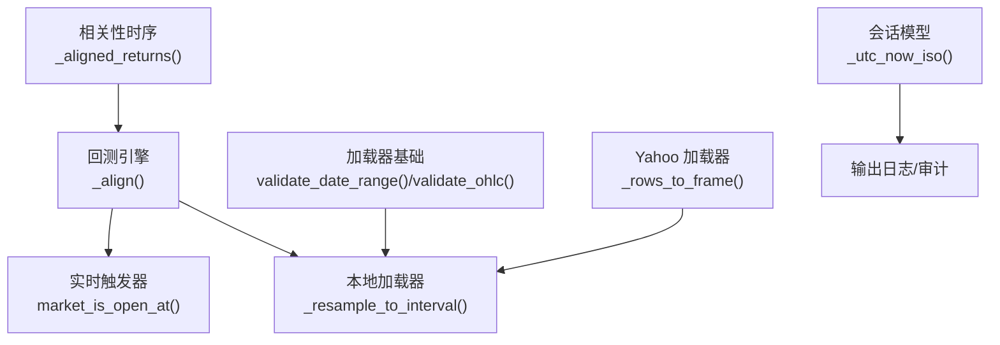
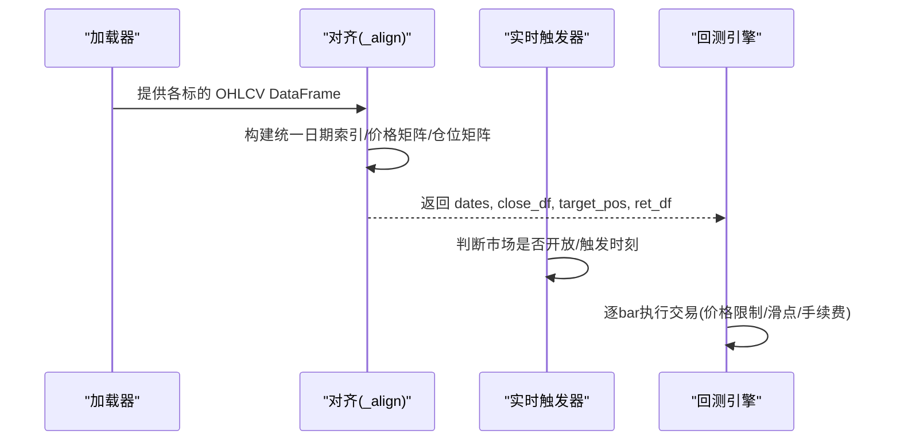
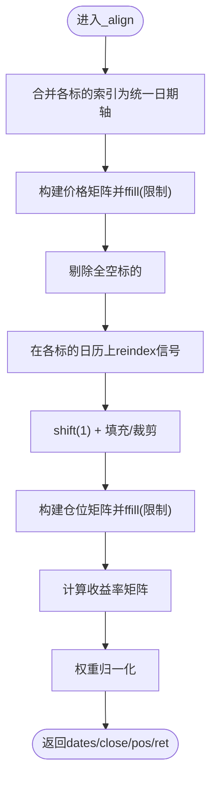
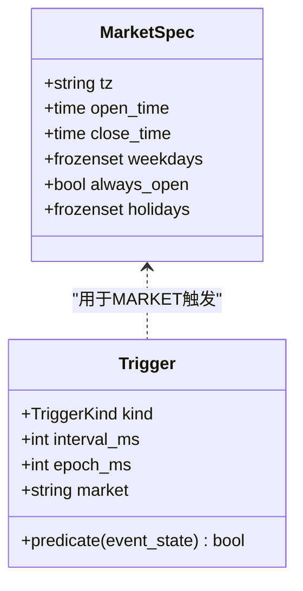
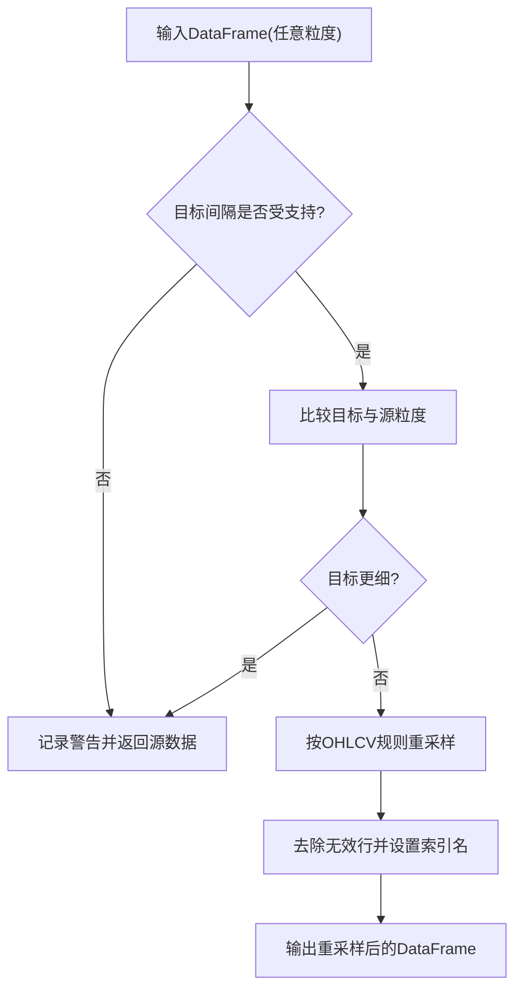
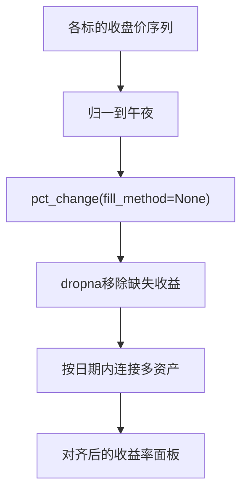
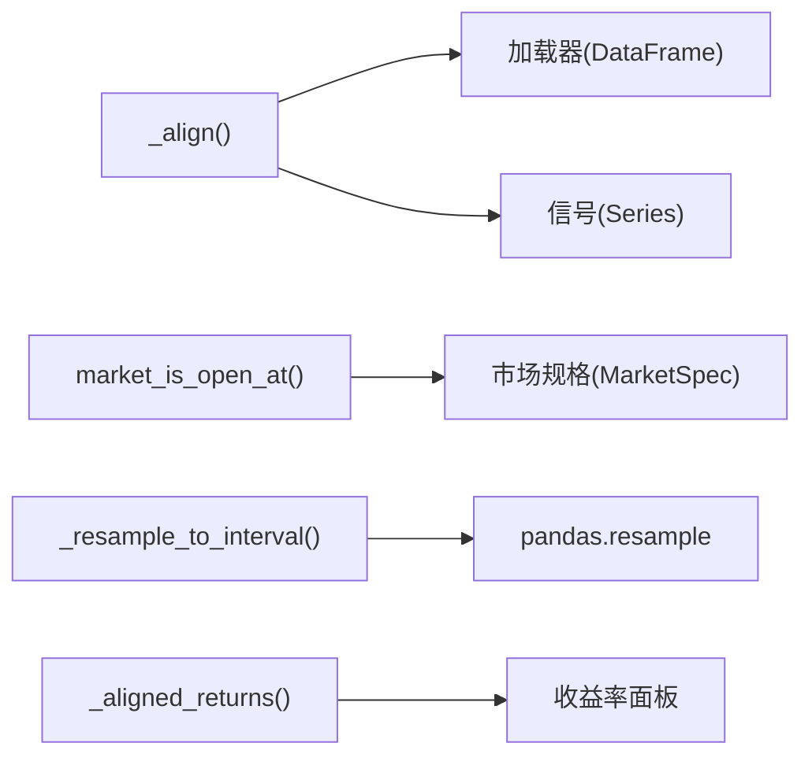

# 时间对齐

<cite>
**本文引用的文件**
- [base.py](file://agent/backtest/engines/base.py)
- [triggers.py](file://agent/src/live/runtime/triggers.py)
- [local_loader.py](file://agent/backtest/loaders/local_loader.py)
- [regime.py](file://agent/backtest/regime.py)
- [base.py（加载器基础）](file://agent/backtest/loaders/base.py)
- [models.py](file://agent/src/session/models.py)
- [yahoo_loader.py](file://agent/backtest/loaders/yahoo_loader.py)
- [tushare.py](file://agent/backtest/loaders/tushare.py)
- [test_signal_alignment_perf.py](file://agent/tests/test_signal_alignment_perf.py)
- [test_regime.py](file://agent/tests/test_regime.py)
- [test_local_loader.py](file://agent/tests/test_local_loader.py)
- [交易日历.md](file://agent/src/skills/tushare/references/期货数据/交易日历.md)
</cite>

## 目录
1. [简介](#简介)
2. [项目结构](#项目结构)
3. [核心组件](#核心组件)
4. [架构总览](#架构总览)
5. [详细组件分析](#详细组件分析)
6. [依赖关系分析](#依赖关系分析)
7. [性能考虑](#性能考虑)
8. [故障排查指南](#故障排查指南)
9. [结论](#结论)
10. [附录](#附录)

## 简介
本技术文档聚焦“时间对齐”机制，覆盖以下关键主题：
- 时区处理策略：UTC 标准化、本地时区转换、夏令时与跨市场交易时段。
- 频率转换算法：日线转分钟线、周线聚合、缺失交易日插补与重采样边界处理。
- 时间戳标准化流程：ISO 格式、毫秒精度与时区信息保留。
- 缺失值处理策略：前向填充、线性插值、业务日历过滤与不制造虚假收益。
- 时间序列对齐算法：多标的同步、重采样策略、边界条件与对齐一致性。
- 诊断方法与性能优化：常见错误定位、对齐性能瓶颈与优化建议。
- 跨市场交易时间特殊考虑：美股、加密资产、外汇等市场的开闭市与节假日。

## 项目结构
时间对齐能力由多个模块协作完成：
- 回测引擎的对齐与信号移位、前向填充限制、统一日期索引构建。
- 实时运行时的触发器与交易时段判定（含时区与节假日）。
- 本地数据加载器的重采样与时间戳归一化。
- 基本面与相关性时序的日级对齐与缺失值处理。
- 加载器通用校验与缓存、日期范围校验。
- 会话模型的时间戳生成（带时区的 ISO 字符串）。
- 外部数据源（如 Yahoo）对日级时间戳的归一化。

图表来源
- [base.py:149-249](file://agent/backtest/engines/base.py#L149-L249)
- [local_loader.py:88-131](file://agent/backtest/loaders/local_loader.py#L88-L131)
- [triggers.py:261-290](file://agent/src/live/runtime/triggers.py#L261-L290)
- [base.py（加载器基础）:168-256](file://agent/backtest/loaders/base.py#L168-L256)
- [regime.py:101-122](file://agent/backtest/regime.py#L101-L122)
- [yahoo_loader.py:139-151](file://agent/backtest/loaders/yahoo_loader.py#L139-L151)
- [models.py:13-14](file://agent/src/session/models.py#L13-L14)

章节来源
- [base.py:149-249](file://agent/backtest/engines/base.py#L149-L249)
- [local_loader.py:88-131](file://agent/backtest/loaders/local_loader.py#L88-L131)
- [triggers.py:261-290](file://agent/src/live/runtime/triggers.py#L261-L290)
- [base.py（加载器基础）:168-256](file://agent/backtest/loaders/base.py#L168-L256)
- [regime.py:101-122](file://agent/backtest/regime.py#L101-L122)
- [yahoo_loader.py:139-151](file://agent/backtest/loaders/yahoo_loader.py#L139-L151)
- [models.py:13-14](file://agent/src/session/models.py#L13-L14)

## 核心组件
- 回测引擎对齐函数 _align：构建统一日期索引、价格矩阵、目标仓位矩阵与收益率矩阵；执行信号移位、前向填充限制、跨市场 ffill_limit 调整、符号剔除与权重归一化。
- 实时触发器 market_is_open_at/due_now：基于 IANA 时区、工作日与静态节假日判断市场是否开放；支持区间触发、市场触发与事件触发。
- 本地加载器重采样 _resample_to_interval：将任意粒度 OHLCV 重采样到目标间隔；支持降采样与上采样告警；OHLCV 聚合规则明确。
- 相关性时序对齐 _aligned_returns：日级收益率对齐，显式禁止前向填充以避免伪造零收益；按日期归一化并内连接。
- 加载器基础 validate_date_range/validate_ohlc：日期范围校验与 OHLC 不变量检查，支持允许负价的市场场景。
- Yahoo 加载器 _rows_to_frame：日级时间戳归一到午夜，分钟/小时保持真实日内时间戳。
- 会话模型时间戳：使用 UTC 生成带时区的 ISO 字符串，确保可解析且具时区信息。

章节来源
- [base.py:149-249](file://agent/backtest/engines/base.py#L149-L249)
- [triggers.py:261-290](file://agent/src/live/runtime/triggers.py#L261-L290)
- [local_loader.py:88-131](file://agent/backtest/loaders/local_loader.py#L88-L131)
- [regime.py:101-122](file://agent/backtest/regime.py#L101-L122)
- [base.py（加载器基础）:168-256](file://agent/backtest/loaders/base.py#L168-L256)
- [yahoo_loader.py:139-151](file://agent/backtest/loaders/yahoo_loader.py#L139-L151)
- [models.py:13-14](file://agent/src/session/models.py#L13-L14)

## 架构总览
时间对齐贯穿数据加载、信号生成与回测执行三个阶段：
- 数据加载阶段：各加载器将原始时间戳转换为统一格式（UTC 或本地午夜），并进行重采样与 OHLC 校验。
- 信号对齐阶段：_align 合并所有标的的交易日历，构建统一时间轴，执行信号移位与前向填充限制，计算收益率。
- 执行阶段：逐 bar 执行交易逻辑，使用历史基准价与滑点模型，保证无未来信息泄露。

图表来源
- [base.py:149-249](file://agent/backtest/engines/base.py#L149-L249)
- [triggers.py:261-290](file://agent/src/live/runtime/triggers.py#L261-L290)

章节来源
- [base.py:149-249](file://agent/backtest/engines/base.py#L149-L249)
- [triggers.py:261-290](file://agent/src/live/runtime/triggers.py#L261-L290)

## 详细组件分析

### 回测引擎对齐与信号移位
- 统一日期索引：合并各标的 DatetimeIndex，若存在共同时区则转换为该时区；否则使用无时区索引。
- 价格矩阵构建：通过 searchsorted 将各标的收盘价映射到统一网格，随后进行带限制的 ffill。
- 信号移位与填充：在每个标的自身日历上 reindex 信号，填充 NaN、裁剪至 [-1,1]，然后 shift(1) 实现“下一根K线开盘”语义。
- 跨市场 ffill_limit：根据标的类型（加密/外汇/股票）动态调整前向填充上限，避免长停牌或长假掩盖真实状态。
- 权重归一化：按行绝对值和裁剪后归一化，确保 sum(abs(weights)) <= 1。

图表来源
- [base.py:149-249](file://agent/backtest/engines/base.py#L149-L249)

章节来源
- [base.py:149-249](file://agent/backtest/engines/base.py#L149-L249)
- [test_signal_alignment_perf.py:354-377](file://agent/tests/test_signal_alignment_perf.py#L354-L377)

### 实时触发器与市场时段
- 市场规格：定义 IANA 时区、开闭市时间、允许工作日与节假日集合；加密市场标记 always_open。
- 时段判定：将 UTC 毫秒时间转换为本地时区 datetime，检查工作日、节假日与时间区间。
- 触发器类型：INTERVAL（固定周期）、MARKET（市场开放即触发）、EVENT（自定义谓词）。

图表来源
- [triggers.py:37-111](file://agent/src/live/runtime/triggers.py#L37-L111)
- [triggers.py:127-205](file://agent/src/live/runtime/triggers.py#L127-L205)

章节来源
- [triggers.py:261-290](file://agent/src/live/runtime/triggers.py#L261-L290)
- [triggers.py:293-333](file://agent/src/live/runtime/triggers.py#L293-L333)

### 本地加载器重采样与时间戳归一化
- 重采样规则：将项目约定的间隔（1m/5m/15m/30m/1H/4H/1D）映射到 pandas offset；OHLCV 聚合采用首开、最高、最低、末收、成交量求和。
- 上采样保护：当请求粒度细于源数据时，记录警告并返回源数据，避免虚构更高频数据。
- 时间戳归一化：先以 UTC 解析，再转为本地无时区索引，确保跨 DST 变化的一致性。

图表来源
- [local_loader.py:88-131](file://agent/backtest/loaders/local_loader.py#L88-L131)

章节来源
- [local_loader.py:162-189](file://agent/backtest/loaders/local_loader.py#L162-L189)
- [test_local_loader.py:208-252](file://agent/tests/test_local_loader.py#L208-L252)

### 相关性时序对齐与缺失值处理
- 日级对齐：将收盘价序列归一到午夜，计算 pct_change(fill_method=None) 并 dropna，避免前向填充制造零收益。
- 内连接：仅保留重叠交易日，确保多资产对齐严格。
- 业务日历过滤：在相关性与回归中，缺失交易日不参与统计，防止偏差。

图表来源
- [regime.py:101-122](file://agent/backtest/regime.py#L101-L122)

章节来源
- [regime.py:101-122](file://agent/backtest/regime.py#L101-L122)
- [test_regime.py:132-150](file://agent/tests/test_regime.py#L132-L150)

### 时间戳标准化与ISO输出
- 会话模型：使用 UTC 生成 ISO 字符串，确保 created_at/updated_at/completed_at 带时区信息。
- Yahoo 加载器：日级时间戳归一到午夜，分钟/小时保持真实时间戳，保证跨源对齐一致。
- 本地加载器：UTC 解析后再转为本地无时区索引，规避 DST 问题。

章节来源
- [models.py:13-14](file://agent/src/session/models.py#L13-L14)
- [yahoo_loader.py:139-151](file://agent/backtest/loaders/yahoo_loader.py#L139-L151)
- [local_loader.py:162-189](file://agent/backtest/loaders/local_loader.py#L162-L189)

### 频率转换与缺失交易日插补
- 日线转分钟线：本地加载器不支持上采样，会记录警告并返回源数据；如需分钟线，需从高频源获取。
- 周线聚合：通过重采样规则（如 1D→1W）进行聚合；OHLCV 聚合遵循标准规则。
- 缺失交易日插补：对齐阶段使用带限制的 ffill，避免长停牌/长假导致的价格失真；相关性计算禁用 ffill，防止伪造收益。

章节来源
- [local_loader.py:88-131](file://agent/backtest/loaders/local_loader.py#L88-L131)
- [base.py:184-197](file://agent/backtest/engines/base.py#L184-L197)
- [regime.py:101-122](file://agent/backtest/regime.py#L101-L122)

### 跨市场交易时间特殊考虑
- 美股：America/New_York 时区，工作日与节假日集合控制开闭市。
- 加密资产：UTC 时区，always_open=True，跳过时间与节假日检查。
- 外汇：通过代码模式识别为 forex，对齐时使用更大的 ffill_limit 以适应长假。

章节来源
- [triggers.py:97-111](file://agent/src/live/runtime/triggers.py#L97-L111)
- [base.py:112-118](file://agent/backtest/engines/base.py#L112-L118)

## 依赖关系分析
- 对齐函数依赖加载器输出的 DataFrame 与信号 Series；依赖 numpy/pandas 的高效操作。
- 触发器依赖 IANA 时区与静态节假日；与实时调度解耦，纯函数设计便于测试。
- 本地加载器依赖 pandas resample 与 OHLCV 聚合规则；与缓存层交互减少重复 IO。
- 相关性时序依赖收益率面板；严格对齐避免未来信息泄露。

图表来源
- [base.py:149-249](file://agent/backtest/engines/base.py#L149-L249)
- [triggers.py:261-290](file://agent/src/live/runtime/triggers.py#L261-L290)
- [local_loader.py:88-131](file://agent/backtest/loaders/local_loader.py#L88-L131)
- [regime.py:101-122](file://agent/backtest/regime.py#L101-L122)

章节来源
- [base.py:149-249](file://agent/backtest/engines/base.py#L149-L249)
- [triggers.py:261-290](file://agent/src/live/runtime/triggers.py#L261-L290)
- [local_loader.py:88-131](file://agent/backtest/loaders/local_loader.py#L88-L131)
- [regime.py:101-122](file://agent/backtest/regime.py#L101-L122)

## 性能考虑
- 对齐性能：使用 int64 视图与 searchsorted 进行 O(log n) 查找；numpy 数组构建与 pandas 向量化的 ffill 结合，降低开销。
- 前向填充限制：合理设置 ffill_limit，避免长停牌/长假导致的失真；跨市场场景使用更大限制。
- 重采样性能：优先使用 pandas resample 的内置聚合；避免不必要的上采样。
- 缓存与校验：加载器基础提供缓存与 OHLC 校验，减少重复 IO 与脏数据影响。

章节来源
- [base.py:181-197](file://agent/backtest/engines/base.py#L181-L197)
- [base.py（加载器基础）:168-256](file://agent/backtest/loaders/base.py#L168-L256)
- [local_loader.py:88-131](file://agent/backtest/loaders/local_loader.py#L88-L131)

## 故障排查指南
- 时间戳时区不一致：检查加载器是否将时间戳归一到 UTC 或本地午夜；确认对齐阶段是否保留共同时区。
- 缺失值导致收益为零：确认相关性计算使用 fill_method=None；对齐阶段的 ffill 是否超过限制。
- 重采样结果异常：检查目标间隔是否受支持；上采样会被拒绝并返回源数据。
- 市场时段误判：确认市场规格中的时区、工作日与节假日配置；未知市场会抛出异常。
- 日期范围无效：使用 validate_date_range 校验起止日期；确保 end_date 包含全天。

章节来源
- [test_local_loader.py:208-252](file://agent/tests/test_local_loader.py#L208-L252)
- [test_regime.py:132-150](file://agent/tests/test_regime.py#L132-L150)
- [base.py（加载器基础）:168-256](file://agent/backtest/loaders/base.py#L168-L256)
- [triggers.py:261-290](file://agent/src/live/runtime/triggers.py#L261-L290)

## 结论
本项目的“时间对齐”机制通过统一的日期索引构建、严格的缺失值处理、跨市场时段判定与高效的重采样策略，确保了多标的、多时区、多频率数据的一致性与准确性。对齐过程避免未来信息泄露，前向填充受限以防止失真，实时触发器保证交易时段正确性。建议在扩展新市场或数据源时，遵循现有规范进行时间戳归一化与对齐处理。

## 附录
- 业务日历参考：期货交易所交易日历示例，可用于验证开闭市与节假日。
- 加载器缓存：内容寻址键与版本管理，确保缓存一致性与可恢复性。

章节来源
- [交易日历.md:45-108](file://agent/src/skills/tushare/references/期货数据/交易日历.md#L45-L108)
- [base.py（加载器基础）:243-441](file://agent/backtest/loaders/base.py#L243-L441)