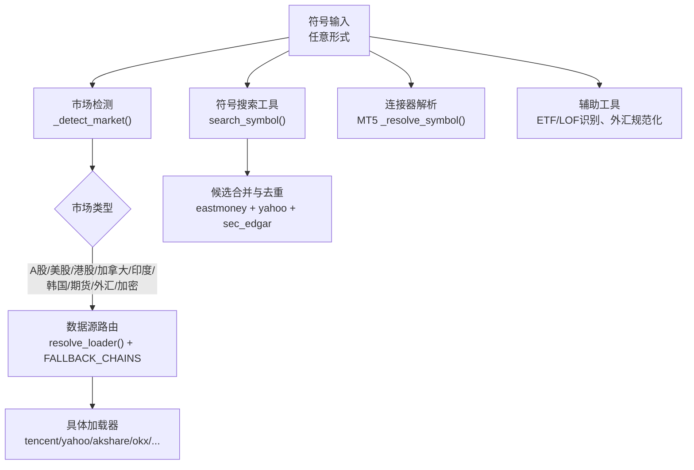
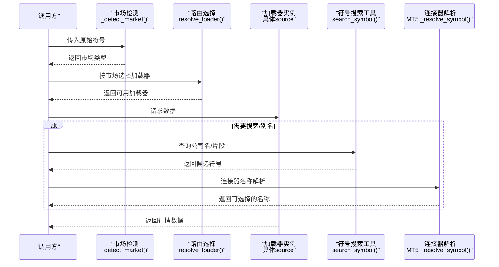
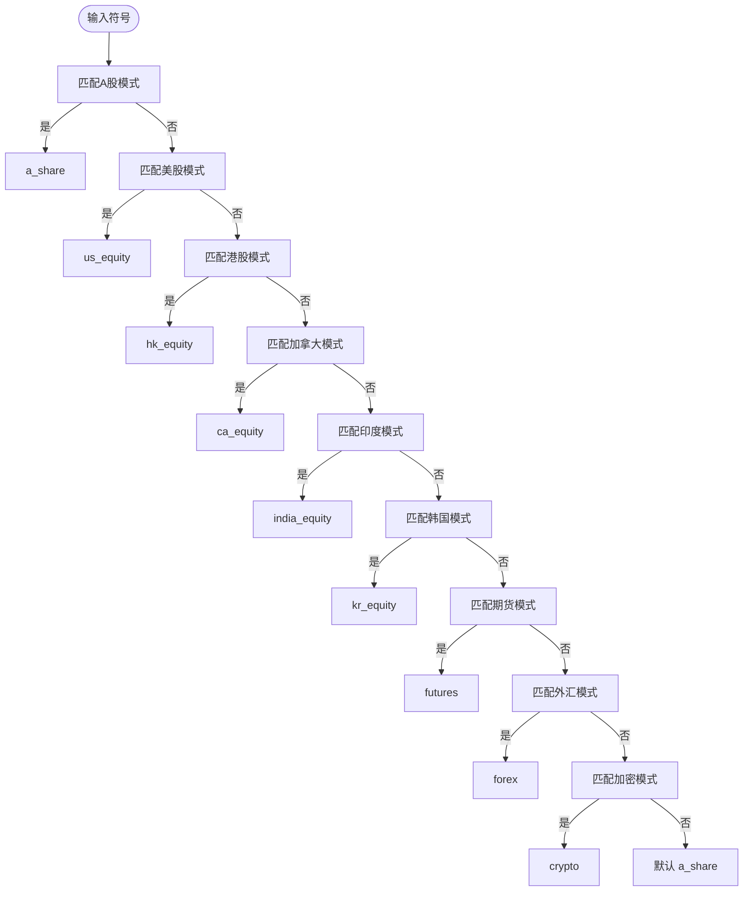
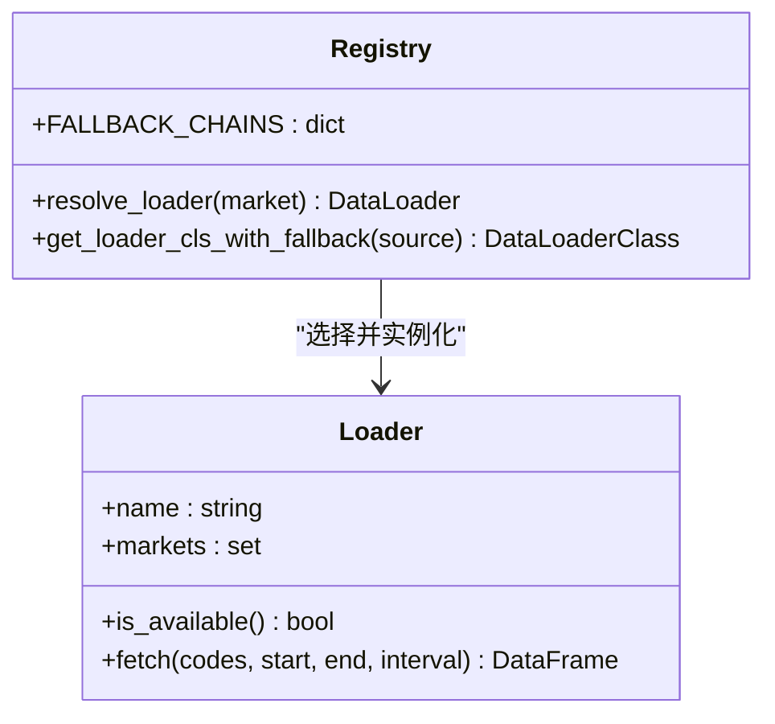
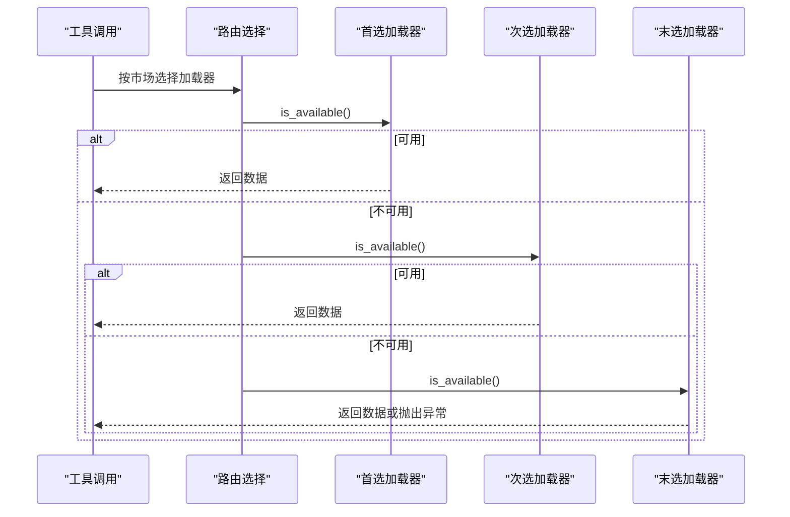
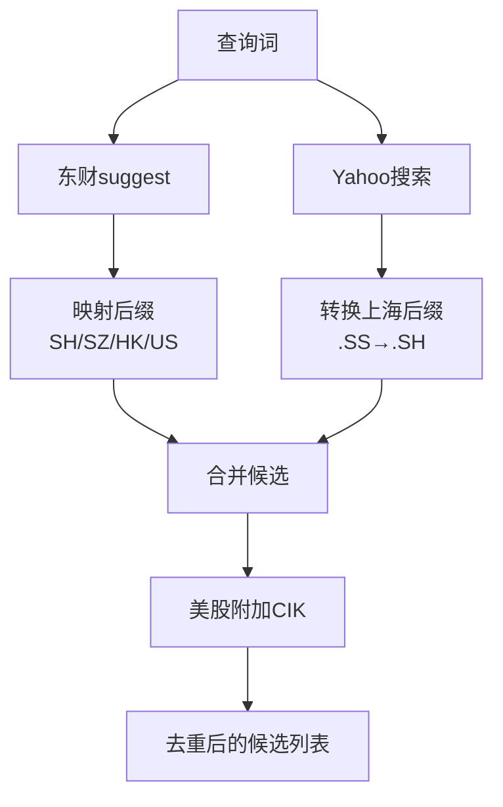
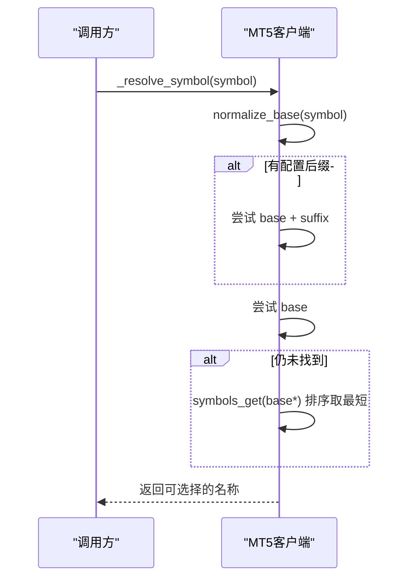
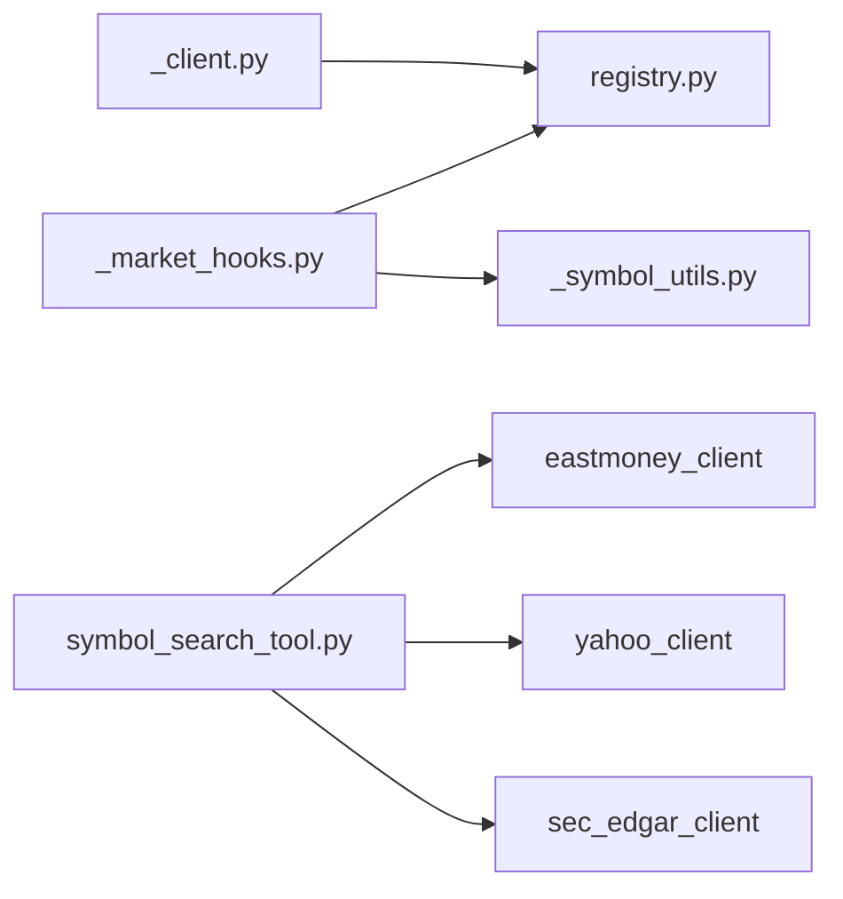

# 符号映射

<cite>
**本文引用的文件**
- [agent/backtest/engines/_market_hooks.py](file://agent/backtest/engines/_market_hooks.py)
- [agent/backtest/loaders/registry.py](file://agent/backtest/loaders/registry.py)
- [agent/backtest/loaders/akshare_loader.py](file://agent/backtest/loaders/akshare_loader.py)
- [agent/backtest/loaders/_symbol_utils.py](file://agent/backtest/loaders/_symbol_utils.py)
- [agent/src/tools/symbol_search_tool.py](file://agent/src/tools/symbol_search_tool.py)
- [agent/src/trading/connectors/mt5/_client.py](file://agent/src/trading/connectors/mt5/_client.py)
- [agent/src/tools/get_fundamentals_tool.py](file://agent/src/tools/get_fundamentals_tool.py)
- [agent/src/skills/data-routing/SKILL.md](file://agent/src/skills/data-routing/SKILL.md)
- [README_zh.md](file://README_zh.md)
- [agent/tests/test_correlation.py](file://agent/tests/test_correlation.py)
- [agent/tests/test_market_data_tool.py](file://agent/tests/test_market_data_tool.py)
- [agent/mcp_server.py](file://agent/mcp_server.py)
</cite>

## 目录
1. [简介](#简介)
2. [项目结构](#项目结构)
3. [核心组件](#核心组件)
4. [架构总览](#架构总览)
5. [详细组件分析](#详细组件分析)
6. [依赖关系分析](#依赖关系分析)
7. [性能考虑](#性能考虑)
8. [故障排查指南](#故障排查指南)
9. [结论](#结论)
10. [附录](#附录)

## 简介
本技术文档围绕“符号映射系统”展开，覆盖股票代码标准化规则、市场检测算法、符号解析器、数据源路由机制、别名管理、验证与调试方法，以及多市场兼容性最佳实践。目标是让读者在不深入源码的情况下，也能理解并正确使用系统中的符号识别、归一化与自动路由能力。

## 项目结构
符号映射相关能力分布在以下模块：
- 市场检测与符号分类：统一在引擎层的市场钩子中集中实现，供回测与组合引擎复用。
- 数据源注册与回退链：按市场维护优先顺序，支持自动选择与降级。
- 符号搜索工具：跨东财、Yahoo、SEC等多源合并候选，输出项目约定符号。
- 交易连接器符号解析：如MT5的券商侧名称解析策略。
- 辅助工具：ETF/LOF识别、外汇符号规范化等。

图表来源
- [agent/backtest/engines/_market_hooks.py:25-60](file://agent/backtest/engines/_market_hooks.py#L25-L60)
- [agent/backtest/loaders/registry.py:139-158](file://agent/backtest/loaders/registry.py#L139-L158)
- [agent/src/tools/symbol_search_tool.py:133-194](file://agent/src/tools/symbol_search_tool.py#L133-L194)
- [agent/src/trading/connectors/mt5/_client.py:303-331](file://agent/src/trading/connectors/mt5/_client.py#L303-L331)

章节来源
- [agent/backtest/engines/_market_hooks.py:25-60](file://agent/backtest/engines/_market_hooks.py#L25-L60)
- [agent/backtest/loaders/registry.py:139-158](file://agent/backtest/loaders/registry.py#L139-L158)
- [agent/src/tools/symbol_search_tool.py:133-194](file://agent/src/tools/symbol_search_tool.py#L133-L194)
- [agent/src/trading/connectors/mt5/_client.py:303-331](file://agent/src/trading/connectors/mt5/_client.py#L303-L331)

## 核心组件
- 市场检测与符号分类：基于正则表达式表匹配不同市场的符号格式，提供统一的 `_detect_market` 入口。
- 数据源路由与回退链：按市场维护优先级列表，自动选择可用加载器，失败时沿链降级。
- 符号搜索工具：并发查询多个公开API，归一化为项目符号约定，合并去重并裁剪结果。
- 连接器符号解析：针对特定券商/终端（如MT5）进行后缀与名称匹配，确保可被选中。
- 辅助工具：ETF/LOF前缀识别、外汇符号规范化等。

章节来源
- [agent/backtest/engines/_market_hooks.py:25-60](file://agent/backtest/engines/_market_hooks.py#L25-L60)
- [agent/backtest/loaders/registry.py:139-158](file://agent/backtest/loaders/registry.py#L139-L158)
- [agent/src/tools/symbol_search_tool.py:133-194](file://agent/src/tools/symbol_search_tool.py#L133-L194)
- [agent/backtest/loaders/_symbol_utils.py:12-21](file://agent/backtest/loaders/_symbol_utils.py#L12-L21)
- [agent/backtest/engines/_market_hooks.py:522-529](file://agent/backtest/engines/_market_hooks.py#L522-L529)

## 架构总览
符号从输入到最终数据获取的关键路径如下：
- 输入符号经市场检测归类为具体市场类型。
- 根据市场类型选择对应回退链中的首个可用加载器。
- 若需搜索或别名处理，则通过符号搜索工具合并候选。
- 对于特定连接器（如MT5），再进行本地名称解析与选择。

图表来源
- [agent/backtest/engines/_market_hooks.py:135-150](file://agent/backtest/engines/_market_hooks.py#L135-L150)
- [agent/backtest/loaders/registry.py:614-649](file://agent/backtest/loaders/registry.py#L614-L649)
- [agent/src/tools/symbol_search_tool.py:133-194](file://agent/src/tools/symbol_search_tool.py#L133-L194)
- [agent/src/trading/connectors/mt5/_client.py:303-331](file://agent/src/trading/connectors/mt5/_client.py#L303-L331)

## 详细组件分析

### 市场检测与符号分类
- 使用一组有序的正则模式匹配不同市场：
  - A股：六位数字+交易所后缀（SZ/SH/BJ），以及ETF/LOF前缀。
  - 美股：字母+US后缀或裸字母代码（长度限制避免与外汇/加密冲突）。
  - 港股：3-5位数字+HK后缀。
  - 加拿大：TO/V后缀。
  - 印度/韩国：NS/BO/KS/KQ后缀。
  - 期货：中国期货产品+交割月+交易所；全球期货产品+月份代码或YYMM；带交易所后缀的全球期货。
  - 外汇：XXX/YYY或六位.FX。
  - 加密货币：以USDT/USD结尾的配对。
- 未匹配到的未知符号默认归类为A股，以避免误入其他市场。
- 提供子类市场检测（如区分美股/港股/加拿大）用于后续路由。

图表来源
- [agent/backtest/engines/_market_hooks.py:25-60](file://agent/backtest/engines/_market_hooks.py#L25-L60)
- [agent/backtest/engines/_market_hooks.py:135-150](file://agent/backtest/engines/_market_hooks.py#L135-L150)

章节来源
- [agent/backtest/engines/_market_hooks.py:25-60](file://agent/backtest/engines/_market_hooks.py#L25-L60)
- [agent/backtest/engines/_market_hooks.py:135-150](file://agent/backtest/engines/_market_hooks.py#L135-L150)

### 数据源路由与回退链
- 每个市场维护一个有序的“回退链”，按IP封禁风险与可用性排序：
  - A股：tencent → mootdx → eastmoney → baostock → akshare → tushare → local
  - 美股：yahoo → stooq → sina → eastmoney → yfinance → tiingo → fmp → finnhub → alphavantage → longbridge → akshare → local
  - 港股：tencent → eastmoney → yahoo → futu → akshare → yfinance → tushare → longbridge → local
  - 加密：okx → binance → ccxt → yfinance → local
  - 外汇：mt5 → akshare → yfinance → local
- `resolve_loader` 会遍历该链，尝试构造并检查可用性，返回首个可用加载器。
- 某些显式请求的源（如local、tickerall、qveris）不允许静默降级到网络源，必须明确配置。

图表来源
- [agent/backtest/loaders/registry.py:139-158](file://agent/backtest/loaders/registry.py#L139-L158)
- [agent/backtest/loaders/registry.py:614-649](file://agent/backtest/loaders/registry.py#L614-L649)
- [agent/backtest/loaders/registry.py:199-256](file://agent/backtest/loaders/registry.py#L199-L256)

章节来源
- [agent/backtest/loaders/registry.py:139-158](file://agent/backtest/loaders/registry.py#L139-L158)
- [agent/backtest/loaders/registry.py:614-649](file://agent/backtest/loaders/registry.py#L614-L649)
- [agent/backtest/loaders/registry.py:199-256](file://agent/backtest/loaders/registry.py#L199-L256)

### 符号解析器与优先级规则
- 正则匹配优先级：更具体的模式在前（如带交易所后缀的A股/美股/港股），通用模式在后（如裸字母美股）。
- 冲突解决：
  - 裸字母代码仅当长度在1-5且无其他匹配时才视为美股，避免与外汇或加密混淆。
  - 期货模式包含中国交易所后缀与全球产品+月份两种形式，避免将裸产品码误判为全球期货。
- 子类市场检测：根据后缀判断美股/港股/加拿大，便于后续路由与展示。

章节来源
- [agent/backtest/engines/_market_hooks.py:25-60](file://agent/backtest/engines/_market_hooks.py#L25-L60)
- [agent/backtest/engines/_market_hooks.py:184-199](file://agent/backtest/engines/_market_hooks.py#L184-L199)

### 数据源路由机制（基于符号的自动选择与回退）
- 自动选择：根据市场检测结果，选择对应回退链的首个可用加载器。
- 回退链配置：按市场维护，考虑IP封禁风险与数据质量。
- 负载均衡：通过多源并行搜索与合并（符号搜索工具）分散负载，单源失败不影响整体。
- 显式源不可用时的行为：对local/tickerall/qveris等不静默降级，提示配置问题。

图表来源
- [agent/backtest/loaders/registry.py:614-649](file://agent/backtest/loaders/registry.py#L614-L649)

章节来源
- [agent/backtest/loaders/registry.py:139-158](file://agent/backtest/loaders/registry.py#L139-L158)
- [agent/backtest/loaders/registry.py:614-649](file://agent/backtest/loaders/registry.py#L614-L649)

### 别名管理与同义词映射
- 东财suggest返回的候选通过市场号映射到项目后缀（SH/SZ/HK/US），并对HK代码零填充至五位。
- Yahoo搜索结果中的上海股票“.SS”转换为“.SH”，避免同一标的在不同源出现重复候选。
- 加拿大符号（.TO/.V）走Yahoo专用路径，跳过东财，避免OTC别名导致身份冲突。
- SEC CIK增强：对美股标的附加CIK，提升实体唯一性。

图表来源
- [agent/src/tools/symbol_search_tool.py:222-334](file://agent/src/tools/symbol_search_tool.py#L222-L334)
- [agent/src/tools/symbol_search_tool.py:336-432](file://agent/src/tools/symbol_search_tool.py#L336-L432)
- [agent/src/tools/symbol_search_tool.py:907-948](file://agent/src/tools/symbol_search_tool.py#L907-L948)

章节来源
- [agent/src/tools/symbol_search_tool.py:222-334](file://agent/src/tools/symbol_search_tool.py#L222-L334)
- [agent/src/tools/symbol_search_tool.py:336-432](file://agent/src/tools/symbol_search_tool.py#L336-L432)
- [agent/src/tools/symbol_search_tool.py:907-948](file://agent/src/tools/symbol_search_tool.py#L907-L948)

### 连接器符号解析（以MT5为例）
- 解析策略：先尝试配置的符号后缀，再尝试裸基础名，最后通过symbols_get发现匹配项（最短匹配优先）。
- 错误处理：若无匹配或无法选中，抛出配置错误，便于用户调整。

图表来源
- [agent/src/trading/connectors/mt5/_client.py:303-331](file://agent/src/trading/connectors/mt5/_client.py#L303-L331)

章节来源
- [agent/src/trading/connectors/mt5/_client.py:303-331](file://agent/src/trading/connectors/mt5/_client.py#L303-L331)

### ETF/LOF识别与外汇规范化
- ETF/LOF识别：基于交易所后缀与六位数字前缀集合判断。
- 外汇规范化：将“XXX/YYY”或“XXXXXX.FX”统一为“XXX/YYY”大写形式，便于后续计算与查找。

章节来源
- [agent/backtest/loaders/_symbol_utils.py:12-21](file://agent/backtest/loaders/_symbol_utils.py#L12-L21)
- [agent/backtest/engines/_market_hooks.py:522-529](file://agent/backtest/engines/_market_hooks.py#L522-L529)

## 依赖关系分析
- 市场检测模块被回测引擎与组合引擎共用，保证符号分类一致性。
- 数据源路由模块集中管理所有加载器与回退链，避免分散逻辑。
- 符号搜索工具依赖东财、Yahoo、SEC三个外部客户端，合并结果并去重。
- 连接器解析模块独立于数据源路由，专注于本地终端名称匹配。

图表来源
- [agent/backtest/engines/_market_hooks.py:25-60](file://agent/backtest/engines/_market_hooks.py#L25-L60)
- [agent/backtest/loaders/registry.py:139-158](file://agent/backtest/loaders/registry.py#L139-L158)
- [agent/src/tools/symbol_search_tool.py:133-194](file://agent/src/tools/symbol_search_tool.py#L133-L194)
- [agent/src/trading/connectors/mt5/_client.py:303-331](file://agent/src/trading/connectors/mt5/_client.py#L303-L331)

章节来源
- [agent/backtest/engines/_market_hooks.py:25-60](file://agent/backtest/engines/_market_hooks.py#L25-L60)
- [agent/backtest/loaders/registry.py:139-158](file://agent/backtest/loaders/registry.py#L139-L158)
- [agent/src/tools/symbol_search_tool.py:133-194](file://agent/src/tools/symbol_search_tool.py#L133-L194)
- [agent/src/trading/connectors/mt5/_client.py:303-331](file://agent/src/trading/connectors/mt5/_client.py#L303-L331)

## 性能考虑
- 符号搜索工具对每源设置上限，合并后去重并裁剪，避免响应膨胀。
- 回退链按IP封禁风险排序，优先使用稳定公开源，降低超时与限流概率。
- 外汇与加密计算采用缓存与去重集合，避免重复计算资金费率与掉期。

[本节为通用指导，无需引用具体文件]

## 故障排查指南
- 常见符号错误：
  - 裸代码误判：确认是否满足长度与字符集要求，必要时添加交易所后缀。
  - 外汇符号缺失后缀：使用规范化函数将“XXXXXX.FX”转为“XXX/YYY”。
  - 加拿大符号在东财无覆盖：直接使用Yahoo路径，避免非JSON响应。
- 修复建议：
  - 使用符号搜索工具获取候选，确认市场与后缀。
  - 检查回退链中各源的可用性，必要时配置密钥或安装SDK。
  - 对显式源（local/tickerall/qveris）确保配置正确，避免静默降级掩盖问题。

章节来源
- [agent/backtest/engines/_market_hooks.py:522-529](file://agent/backtest/engines/_market_hooks.py#L522-L529)
- [agent/src/tools/symbol_search_tool.py:222-334](file://agent/src/tools/symbol_search_tool.py#L222-L334)
- [agent/backtest/loaders/registry.py:199-256](file://agent/backtest/loaders/registry.py#L199-L256)

## 结论
符号映射系统通过统一的市场检测、灵活的回退链路由、强大的符号搜索与别名管理，实现了跨市场、多数据源的稳健接入。遵循项目约定的符号格式与后缀规范，结合自动路由与调试工具，可显著提升多市场研究的效率与准确性。

[本节为总结，无需引用具体文件]

## 附录

### 符号标准化规则
- 大小写处理：统一为大写，去除多余空白。
- 交易所前缀：A股（.SH/.SZ/.BJ）、美股（.US）、港股（.HK）、加拿大（.TO/.V）、印度（.NS/.BO）、韩国（.KS/.KQ）。
- 后缀识别：外汇（.FX或XXX/YYY）、加密（-USDT/-USD）、期货（产品+交割月+交易所或全球产品+月份）。
- 特殊处理：HK代码零填充至五位；上海股票“.SS”转换为“.SH”。

章节来源
- [agent/backtest/engines/_market_hooks.py:25-60](file://agent/backtest/engines/_market_hooks.py#L25-L60)
- [agent/src/tools/symbol_search_tool.py:735-753](file://agent/src/tools/symbol_search_tool.py#L735-L753)
- [agent/backtest/engines/_market_hooks.py:522-529](file://agent/backtest/engines/_market_hooks.py#L522-L529)

### 市场检测算法
- 正则优先级：更具体模式在前，通用模式在后。
- 默认策略：未知符号默认归为A股，避免误入其他市场。
- 子类检测：根据后缀区分美股/港股/加拿大。

章节来源
- [agent/backtest/engines/_market_hooks.py:25-60](file://agent/backtest/engines/_market_hooks.py#L25-L60)
- [agent/backtest/engines/_market_hooks.py:184-199](file://agent/backtest/engines/_market_hooks.py#L184-L199)

### 数据源路由机制
- 自动选择：按市场选择回退链首源。
- 回退链：按IP封禁风险与数据质量排序。
- 负载均衡：多源并行搜索与合并，单源失败不影响整体。
- 显式源：local/tickerall/qveris不静默降级。

章节来源
- [agent/backtest/loaders/registry.py:139-158](file://agent/backtest/loaders/registry.py#L139-L158)
- [agent/backtest/loaders/registry.py:614-649](file://agent/backtest/loaders/registry.py#L614-L649)
- [agent/backtest/loaders/registry.py:199-256](file://agent/backtest/loaders/registry.py#L199-L256)

### 别名管理功能
- 同义词映射：东财市场号映射到项目后缀。
- 历史名称更新：Yahoo“.SS”转换为“.SH”。
- 自定义别名：加拿大符号走Yahoo专用路径，避免OTC别名冲突。

章节来源
- [agent/src/tools/symbol_search_tool.py:222-334](file://agent/src/tools/symbol_search_tool.py#L222-L334)
- [agent/src/tools/symbol_search_tool.py:336-432](file://agent/src/tools/symbol_search_tool.py#L336-L432)

### 符号验证工具与调试方法
- 验证工具：统计验证（蒙特卡洛、Bootstrap、Walk-Forward）用于回测结果评估。
- 调试方法：检查回退链可用性、查看符号搜索候选、确认连接器名称匹配。

章节来源
- [agent/backtest/validation.py:291-346](file://agent/backtest/validation.py#L291-L346)
- [agent/backtest/validation.py:473-505](file://agent/backtest/validation.py#L473-L505)

### 多市场符号兼容性最佳实践
- 始终使用项目约定的符号格式（含交易所后缀）。
- 优先使用自动路由与符号搜索工具，减少手动配置。
- 对显式源（local/tickerall/qveris）确保配置正确，避免静默降级。
- 关注外汇与加密的规范化，避免格式不一致导致的错误。

章节来源
- [agent/src/skills/data-routing/SKILL.md:97-137](file://agent/src/skills/data-routing/SKILL.md#L97-L137)
- [README_zh.md:343-364](file://README_zh.md#L343-L364)
- [agent/mcp_server.py:1554-1577](file://agent/mcp_server.py#L1554-L1577)