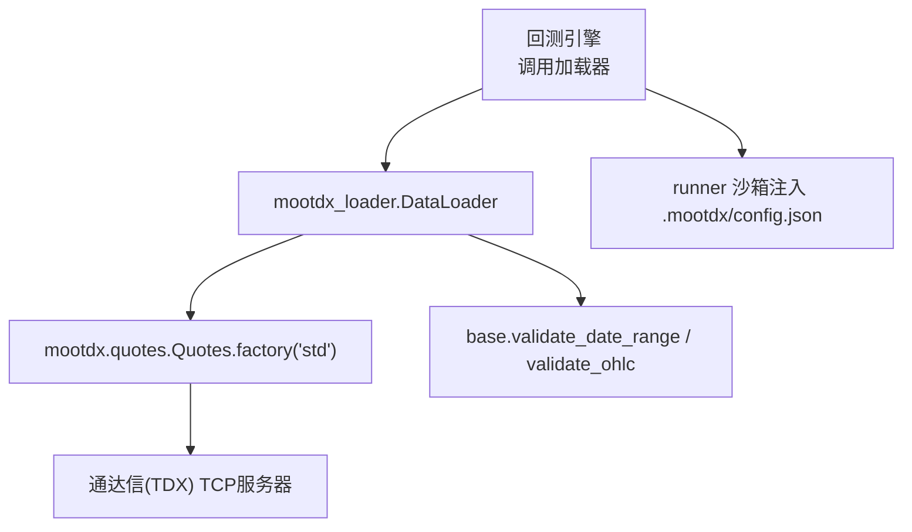
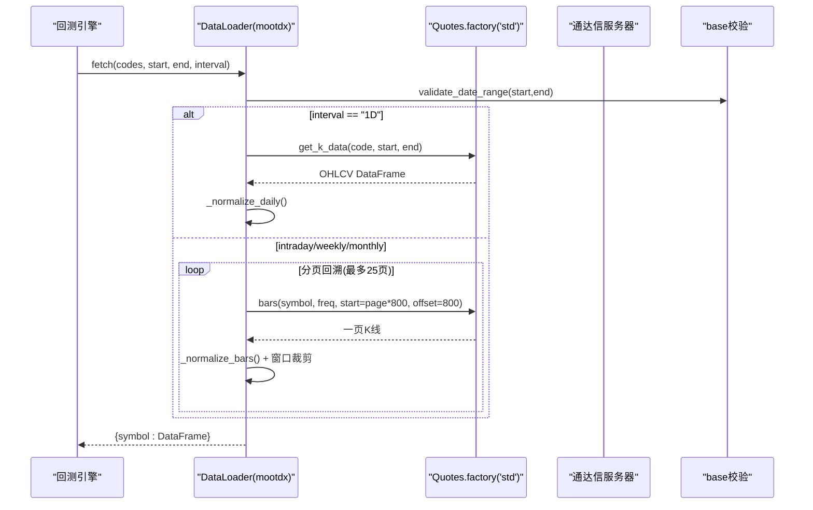
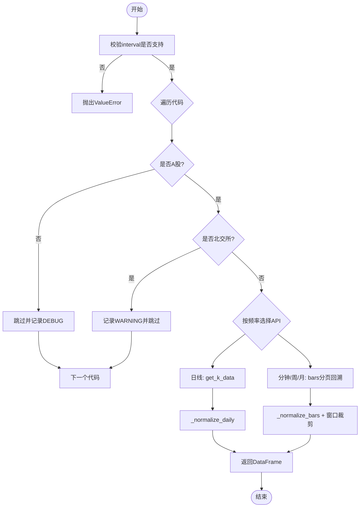
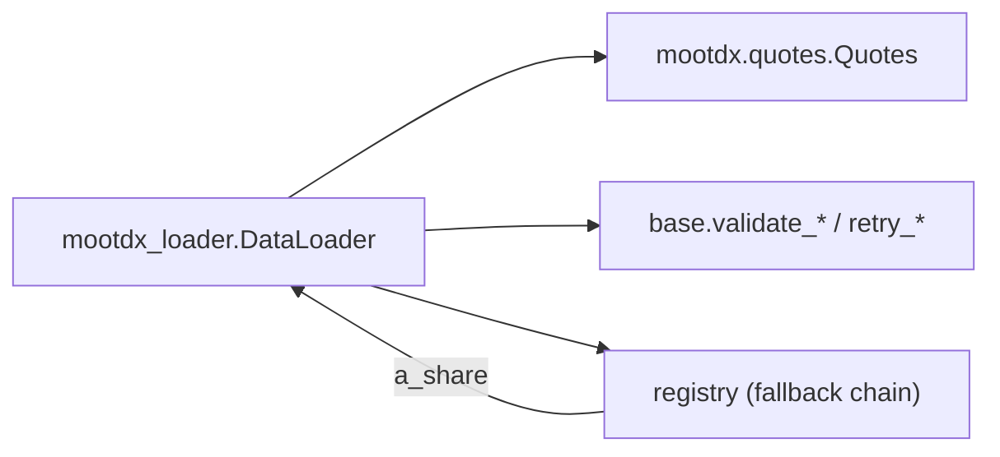

# MooDuckX本地行情加载器

<cite>
**本文引用的文件**
- [mootdx_loader.py](file://agent/backtest/loaders/mootdx_loader.py)
- [a_mootdx_fetcher.py](file://agent/skills/ashare-mootdx/references/a_mootdx_fetcher.py)
- [SKILL.md](file://agent/src/skills/mootdx/SKILL.md)
- [test_mootdx_loader.py](file://agent/tests/test_mootdx_loader.py)
- [base.py](file://agent/backtest/loaders/base.py)
- [runner.py](file://agent/src/core/runner.py)
</cite>

## 目录
1. [简介](#简介)
2. [项目结构](#项目结构)
3. [核心组件](#核心组件)
4. [架构总览](#架构总览)
5. [详细组件分析](#详细组件分析)
6. [依赖关系分析](#依赖关系分析)
7. [性能考量](#性能考量)
8. [故障排除指南](#故障排除指南)
9. [结论](#结论)
10. [附录](#附录)

## 简介
本技术文档面向使用 MooDuckX（mootdx）作为本地A股数据源的开发者，系统化说明：
- 如何通过MooDuckX本地服务器接口获取A股的实时与历史行情；
- 本地部署配置要点（连接参数、认证、端口等）；
- 数据类型与格式（A股、港股、期货等市场支持情况）；
- 数据质量校验（价格、成交量、时间戳完整性）；
- 常见问题排查（连接问题、数据异常、性能调优）；
- 与回测引擎的集成方式与最佳实践。

MooDuckX通过TCP直连通达信（TDX）协议获取公开行情，无需API Key与IP限频，适合在受限网络或高并发场景下稳定拉取A股日线与分钟级K线。

## 项目结构
围绕MooDuckX的数据接入主要涉及以下模块：
- 加载器实现：backtest/loaders/mootdx_loader.py
- 技能参考实现：skills/ashare-mootdx/references/a_mootdx_fetcher.py
- 技能说明与用法：src/skills/mootdx/SKILL.md
- 单元测试：tests/test_mootdx_loader.py
- 通用加载器基类与校验工具：backtest/loaders/base.py
- 运行时沙箱与配置注入：src/core/runner.py

图表来源
- [mootdx_loader.py:66-153](file://agent/backtest/loaders/mootdx_loader.py#L66-L153)
- [base.py:168-256](file://agent/backtest/loaders/base.py#L168-L256)
- [runner.py:238-256](file://agent/src/core/runner.py#L238-L256)

章节来源
- [mootdx_loader.py:1-258](file://agent/backtest/loaders/mootdx_loader.py#L1-L258)
- [SKILL.md:1-95](file://agent/src/skills/mootdx/SKILL.md#L1-L95)
- [base.py:1-200](file://agent/backtest/loaders/base.py#L1-L200)
- [runner.py:238-256](file://agent/src/core/runner.py#L238-L256)

## 核心组件
- DataLoader（mootdx_loader.py）
  - 负责A股OHLCV数据的拉取、分页、归一化与缓存；
  - 支持区间内日线（get_k_data）与分钟/周/月（bars分页回溯）；
  - 内置符号识别（沪/深/京前缀或后缀），跳过北交所并记录告警；
  - 声明volume_units为“手”，适配项目统一量纲。
- 参考适配器（a_mootdx_fetcher.py）
  - 提供便捷函数：日线批量拉取、实时快照、股票列表等；
  - 便于独立脚本或技能快速验证连通性与数据格式。
- 通用校验（base.py）
  - 日期范围校验、OHLC结构校验（价格正负、高低开收逻辑）；
  - 重试与预算控制工具，供其他加载器复用。
- 运行时配置注入（runner.py）
  - 将用户本地.mootdx/config.json复制到沙箱，确保mootdx客户端能读取服务器选择与代理设置。

章节来源
- [mootdx_loader.py:66-153](file://agent/backtest/loaders/mootdx_loader.py#L66-L153)
- [a_mootdx_fetcher.py:1-89](file://agent/skills/ashare-mootdx/references/a_mootdx_fetcher.py#L1-L89)
- [base.py:168-256](file://agent/backtest/loaders/base.py#L168-L256)
- [runner.py:238-256](file://agent/src/core/runner.py#L238-L256)

## 架构总览
MooDuckX加载器通过mootdx SDK访问通达信TCP服务，不经过HTTP抓取层，规避了部分公共源被限频的问题。整体流程如下：

图表来源
- [mootdx_loader.py:96-207](file://agent/backtest/loaders/mootdx_loader.py#L96-L207)
- [base.py:168-184](file://agent/backtest/loaders/base.py#L168-L184)

## 详细组件分析

### 加载器：DataLoader（mootdx_loader.py）
- 功能职责
  - 支持A股（沪/深/京）日线与分钟级K线；
  - 自动识别交易所后缀或纯6位代码；
  - 对北交所代码给出警告并跳过（上游缺失）；
  - 对非A股代码静默跳过；
  - 对分钟/周/月采用分页回溯，限制最大页数避免长时间请求；
  - 输出标准化OHLCV列名与索引（trade_date）。
- 关键方法
  - fetch：入口方法，校验区间与频率，分发到具体拉取逻辑；
  - _fetch_one：按频率选择get_k_data或分页bars；
  - _fetch_bars_paginated：分页回溯直到覆盖起始日期或达到上限；
  - _normalize_daily/_normalize_bars：统一列名、类型转换、去空值、排序与窗口裁剪。
- 错误处理
  - 不支持的频率抛出ValueError；
  - 北交所代码记录WARNING并跳过；
  - 分页未达起始日期抛错提示不完整历史；
  - 单个代码异常捕获并记录WARNING，不影响其他代码。

图表来源
- [mootdx_loader.py:96-207](file://agent/backtest/loaders/mootdx_loader.py#L96-L207)
- [mootdx_loader.py:209-257](file://agent/backtest/loaders/mootdx_loader.py#L209-L257)

章节来源
- [mootdx_loader.py:66-258](file://agent/backtest/loaders/mootdx_loader.py#L66-L258)
- [test_mootdx_loader.py:105-192](file://agent/tests/test_mootdx_loader.py#L105-L192)

### 参考适配器：a_mootdx_fetcher.py
- 提供便捷函数：
  - fetch_daily：按limit拉取最近N条日线，支持起止日期过滤；
  - fetch_realtime：批量获取实时快照（price、open、high、low、last_close、change、change_pct、volume、amount）；
  - batch_fetch_daily：批量拉取并容错；
  - get_a_share_list：获取全市场股票代码列表。
- 适用场景
  - 独立脚本快速验证连通性；
  - 技能示例中演示如何构造标准OHLCV与实时数据。

章节来源
- [a_mootdx_fetcher.py:1-89](file://agent/skills/ashare-mootdx/references/a_mootdx_fetcher.py#L1-L89)

### 通用校验：base.py
- 日期范围校验：validate_date_range
  - 检查start_date <= end_date，非法格式抛出ValueError。
- OHLC结构校验：validate_ohlc
  - 强制结构不变式（high>=low，high/low需包围open/close）；
  - 默认拒绝非正价格，可配置允许负价但拒绝零价；
  - 支持drop/warn/raise三种策略。
- 重试与预算：retry_with_budget/check_budget
  - 用于外部不稳定接口的有限重试与超时保护。

章节来源
- [base.py:168-256](file://agent/backtest/loaders/base.py#L168-L256)
- [base.py:377-414](file://agent/backtest/loaders/base.py#L377-L414)

### 运行时配置注入：runner.py
- 行为说明
  - 在沙箱环境中创建.mootdx目录；
  - 优先复制用户主目录下的.mootdx/config.json到沙箱；
  - 若不存在则尝试从mootdx默认配置生成JSON写入；
  - 写入失败时静默降级，不影响其他A股数据源。
- 意义
  - 使mootdx客户端在隔离环境中仍能读取服务器选择、代理等配置；
  - 保证首次连接时的服务器选择与网络环境一致。

章节来源
- [runner.py:238-256](file://agent/src/core/runner.py#L238-L256)

## 依赖关系分析
- 外部依赖
  - mootdx：通过TCP直连通达信服务器，无需认证与限频；
  - pandas：数据处理与时间序列操作。
- 内部依赖
  - backtest.loaders.base：日期与OHLC校验、重试工具；
  - backtest.loaders.registry：注册机制与回退链（a_share链包含mootdx）。
- 运行期依赖
  - 系统网络可达通达信服务器；
  - 可选代理环境变量（HTTP_PROXY/HTTPS_PROXY/ALL_PROXY/NO_PROXY）影响底层网络栈。

图表来源
- [mootdx_loader.py:66-153](file://agent/backtest/loaders/mootdx_loader.py#L66-L153)
- [base.py:31-200](file://agent/backtest/loaders/base.py#L31-L200)

章节来源
- [mootdx_loader.py:66-153](file://agent/backtest/loaders/mootdx_loader.py#L66-L153)
- [base.py:31-200](file://agent/backtest/loaders/base.py#L31-L200)

## 性能考量
- 分页与上限
  - 分钟/周/月采用分页回溯，每页800行，最多25页，防止极端请求导致长时间阻塞；
  - 对于超长历史（如1分钟级别多年数据），建议结合tushare分钟数据源。
- 首调延迟
  - 首次调用会进行服务器选择，存在冷启动延迟（约数秒）；
  - 后续调用复用已建立客户端，性能更稳定。
- 数据裁剪
  - 对bars结果进行窗口裁剪，减少内存占用与传输开销；
  - 统一列名与类型转换，降低下游计算成本。
- 缓存与重试
  - 使用cached_loader_fetch减少重复请求；
  - 通过base中的重试工具可应对短暂网络抖动（由上层loader组合使用）。

章节来源
- [mootdx_loader.py:39-45](file://agent/backtest/loaders/mootdx_loader.py#L39-L45)
- [mootdx_loader.py:171-207](file://agent/backtest/loaders/mootdx_loader.py#L171-L207)
- [SKILL.md:81-89](file://agent/src/skills/mootdx/SKILL.md#L81-L89)

## 故障排除指南
- 连接问题
  - 现象：无法连接通达信服务器或首次调用很慢；
  - 排查：
    - 确认网络可达性与代理设置（HTTP_PROXY/HTTPS_PROXY/ALL_PROXY/NO_PROXY）；
    - 检查.mootdx/config.json是否存在且可读（runner会在沙箱中注入）；
    - 首次调用可能较慢属正常（服务器选择冷启动）。
- 数据异常
  - 现象：返回空DataFrame或字段缺失；
  - 排查：
    - 确认代码是否为A股（非A股会被跳过）；
    - 北交所代码上游缺失，会记录WARNING并跳过；
    - 检查区间是否有效（validate_date_range）；
    - 查看OHLC结构是否满足不变式（validate_ohlc）。
- 性能问题
  - 现象：拉取分钟级长历史耗时过长；
  - 排查：
    - 合理缩小时间窗口；
    - 考虑使用tushare分钟数据源补充更长历史；
    - 利用分页上限保护避免无限回溯。
- 常见错误定位
  - ValueError：不支持的频率或日期无效；
  - TimeoutError：超出预算或网络超时（由重试工具包装）；
  - 日志WARNING：北交所跳过、网络异常等。

章节来源
- [mootdx_loader.py:121-153](file://agent/backtest/loaders/mootdx_loader.py#L121-L153)
- [mootdx_loader.py:199-207](file://agent/backtest/loaders/mootdx_loader.py#L199-L207)
- [base.py:168-256](file://agent/backtest/loaders/base.py#L168-L256)
- [runner.py:238-256](file://agent/src/core/runner.py#L238-L256)

## 结论
MooDuckX本地行情加载器以TCP直连通达信的方式，提供了稳定、无认证的A股数据获取能力，适用于回测与实盘研究。其设计强调：
- 明确的A股范围与符号识别；
- 标准化的OHLCV输出与窗口裁剪；
- 健壮的分页回溯与上限保护；
- 与回测引擎的良好集成（注册、回退链、沙箱配置注入）。

在生产环境中，建议结合tushare/akshare构建多源回退链，以覆盖北交所与更长历史需求，并通过基础校验与日志监控保障数据质量与稳定性。

## 附录

### 本地部署与配置要点
- 安装与依赖
  - 安装mootdx与兼容的httpx版本；
  - 确保Python环境具备pandas等数据处理库。
- 服务器连接参数
  - 通过.mootdx/config.json配置服务器选择与代理；
  - 运行时runner会将该配置文件复制到沙箱，保证mootdx客户端可用。
- 认证设置
  - 无需API Key或Token，直接TCP访问公开行情；
  - 注意网络可达性与代理设置。
- 端口配置
  - 通过mootdx内部机制选择通达信服务器端口，通常无需手动指定；
  - 如遇连接问题，可在config.json中调整服务器优先级或代理。

章节来源
- [SKILL.md:7-14](file://agent/src/skills/mootdx/SKILL.md#L7-L14)
- [SKILL.md:72-79](file://agent/src/skills/mootdx/SKILL.md#L72-L79)
- [runner.py:238-256](file://agent/src/core/runner.py#L238-L256)

### 数据类型与市场支持
- A股（沪/深/京）
  - 支持日线与分钟/周/月K线；
  - 自动识别交易所后缀或纯6位代码；
  - 北交所代码上游缺失，会记录WARNING并跳过。
- 港股与期货
  - 当前mootdx扩展市场端点（期货/期权）在上游存在问题，建议使用tushare/akshare；
  - 港股不在mootdx范围内，可通过其他加载器获取。
- 数据格式
  - 统一输出列：open、high、low、close、volume；
  - 索引为trade_date（datetime类型）；
  - 成交量单位为“手”（a_share）。

章节来源
- [mootdx_loader.py:25-37](file://agent/backtest/loaders/mootdx_loader.py#L25-L37)
- [mootdx_loader.py:47-64](file://agent/backtest/loaders/mootdx_loader.py#L47-L64)
- [mootdx_loader.py:70-77](file://agent/backtest/loaders/mootdx_loader.py#L70-L77)
- [SKILL.md:58-70](file://agent/src/skills/mootdx/SKILL.md#L58-L70)

### 数据质量验证
- 价格校验
  - 使用validate_ohlc确保high>=low且包围open/close；
  - 默认拒绝非正价格，可配置允许负价但拒绝零价。
- 成交量检查
  - 统一列名为volume，类型为数值；
  - 单位声明为“手”，便于跨源一致性。
- 时间戳完整性
  - 索引为trade_date，确保datetime类型；
  - 窗口裁剪保证起止日期包含完整交易日。

章节来源
- [base.py:187-256](file://agent/backtest/loaders/base.py#L187-L256)
- [mootdx_loader.py:209-257](file://agent/backtest/loaders/mootdx_loader.py#L209-L257)

### 与回测引擎的集成示例与最佳实践
- 显式指定数据源
  - 在run中指定source="mootdx"以优先使用mootdx；
  - 回退链顺序：当token存在时tushare优先，否则mootdx优先于akshare。
- 最佳实践
  - 使用validate_date_range与validate_ohlc确保输入与输出质量；
  - 对分钟级长历史结合tushare分钟数据源；
  - 监控日志WARNING（北交所跳过、网络异常）并及时处理；
  - 合理设置时间窗口与分页上限，避免性能瓶颈。

章节来源
- [SKILL.md:72-79](file://agent/src/skills/mootdx/SKILL.md#L72-L79)
- [test_mootdx_loader.py:231-243](file://agent/tests/test_mootdx_loader.py#L231-L243)