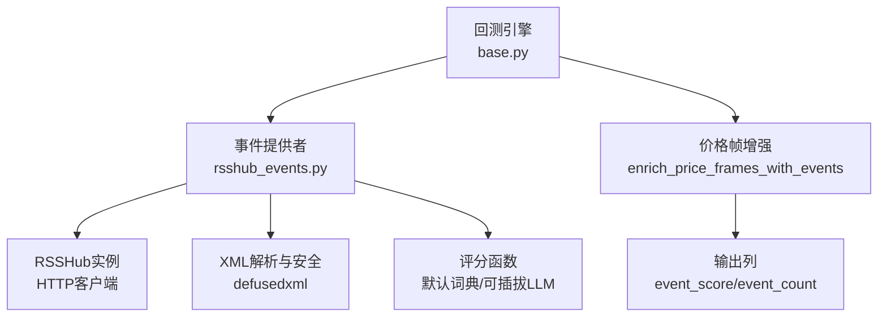
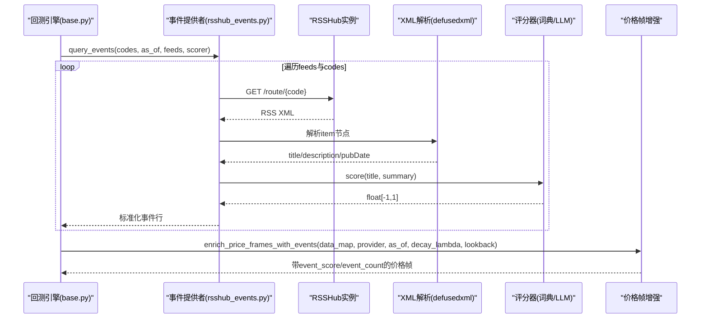
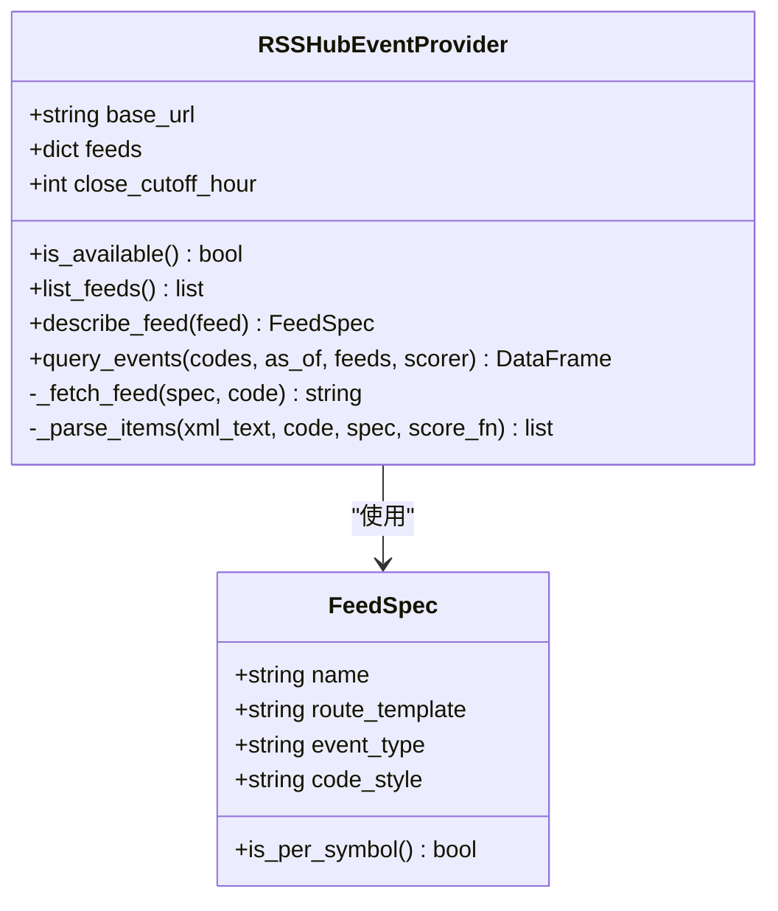
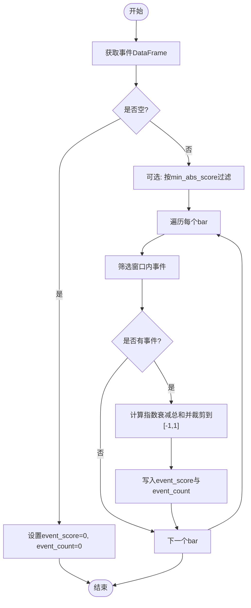
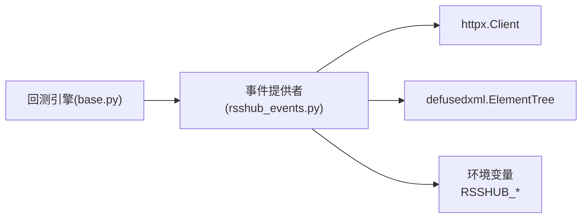

# RSSHub事件流加载器

<cite>
**本文引用的文件**
- [agent/backtest/loaders/rsshub_events.py](file://agent/backtest/loaders/rsshub_events.py)
- [agent/backtest/engines/base.py](file://agent/backtest/engines/base.py)
- [agent/tests/test_rsshub_events_provider.py](file://agent/tests/test_rsshub_events_provider.py)
- [agent/tests/test_rsshub_events_lookahead.py](file://agent/tests/test_rsshub_events_lookahead.py)
- [agent/src/config/env_schema.py](file://agent/src/config/env_schema.py)
- [agent/src/core/runner.py](file://agent/src/core/runner.py)
</cite>

## 目录
1. [简介](#简介)
2. [项目结构](#项目结构)
3. [核心组件](#核心组件)
4. [架构总览](#架构总览)
5. [详细组件分析](#详细组件分析)
6. [依赖关系分析](#依赖关系分析)
7. [性能与可靠性](#性能与可靠性)
8. [故障排查指南](#故障排查指南)
9. [结论](#结论)
10. [附录：配置与使用示例](#附录配置与使用示例)

## 简介
本技术文档围绕“RSSHub事件流加载器”展开，说明如何通过自托管的RSSHub实例订阅金融新闻与市场事件，将非结构化信息标准化为事件驱动信号，并在回测与实盘中以“点-in-time安全”的方式注入到价格序列中。文档覆盖以下主题：
- 新闻聚合、事件提取与评分机制
- RSSHub API集成（端点配置、认证方式、请求频率控制）
- 事件类型支持与分类过滤
- 事件存储与管理方案（数据库设计、查询接口、历史回溯）
- 使用示例与集成指南，帮助构建事件驱动的交易策略与研究流程

## 项目结构
RSSHub事件流加载器位于回测数据加载层，作为独立的数据提供者，与基础引擎解耦。关键位置如下：
- 事件提供者与解析逻辑：agent/backtest/loaders/rsshub_events.py
- 回测引擎集成入口：agent/backtest/engines/base.py
- 单元测试与行为验证：agent/tests/test_rsshub_events_provider.py、agent/tests/test_rsshub_events_lookahead.py
- 环境变量与运行期传播：agent/src/config/env_schema.py、agent/src/core/runner.py

图表来源
- [agent/backtest/engines/base.py:452-490](file://agent/backtest/engines/base.py#L452-L490)
- [agent/backtest/loaders/rsshub_events.py:288-400](file://agent/backtest/loaders/rsshub_events.py#L288-L400)
- [agent/backtest/loaders/rsshub_events.py:501-569](file://agent/backtest/loaders/rsshub_events.py#L501-L569)

章节来源
- [agent/backtest/loaders/rsshub_events.py:1-569](file://agent/backtest/loaders/rsshub_events.py#L1-L569)
- [agent/backtest/engines/base.py:452-490](file://agent/backtest/engines/base.py#L452-L490)

## 核心组件
- FeedSpec：描述一个RSSHub路由及其事件类型、代码格式风格
- RSSHubEventProvider：负责拉取、解析、评分、去重与点-in-time过滤的事件提供者
- enrich_price_frames_with_events：将事件按时间窗口与衰减规则注入到价格帧，生成event_score与event_count
- 评分器：默认基于词典的正负词频打分，支持外部替换（如LLM评分）

章节来源
- [agent/backtest/loaders/rsshub_events.py:107-184](file://agent/backtest/loaders/rsshub_events.py#L107-L184)
- [agent/backtest/loaders/rsshub_events.py:239-262](file://agent/backtest/loaders/rsshub_events.py#L239-L262)
- [agent/backtest/loaders/rsshub_events.py:288-400](file://agent/backtest/loaders/rsshub_events.py#L288-L400)
- [agent/backtest/loaders/rsshub_events.py:501-569](file://agent/backtest/loaders/rsshub_events.py#L501-L569)

## 架构总览
系统通过回测引擎在信号生成前调用事件增强步骤，从RSSHub拉取指定feed的RSS XML，解析为标准事件表，再按“可知道日期”与“as_of”边界进行严格的时间对齐，最后计算滚动窗口内的指数衰减事件分数并写回价格帧。

图表来源
- [agent/backtest/engines/base.py:452-490](file://agent/backtest/engines/base.py#L452-L490)
- [agent/backtest/loaders/rsshub_events.py:343-400](file://agent/backtest/loaders/rsshub_events.py#L343-L400)
- [agent/backtest/loaders/rsshub_events.py:449-484](file://agent/backtest/loaders/rsshub_events.py#L449-L484)
- [agent/backtest/loaders/rsshub_events.py:501-569](file://agent/backtest/loaders/rsshub_events.py#L501-L569)

## 详细组件分析

### 事件提供者：RSSHubEventProvider
- 功能职责
  - 读取RSSHub基础URL与环境变量（超时、预算）
  - 根据FeedSpec构造请求URL，支持按标的代码格式化
  - 拉取RSS XML并使用defusedxml安全解析
  - 将每个item标准化为事件行（ts_code、knowable_date、event_type、score、source、summary）
  - 应用点-in-time过滤（仅保留knowable_date <= as_of）
  - 去重与排序，返回整洁DataFrame
- 错误处理
  - 所有请求失败时抛出EventProviderError，避免静默零分污染
  - 单个feed不可达或XML非法时跳过并记录日志
- 可插拔评分
  - 默认词典评分器，支持传入自定义scorer（例如LLM评分）

图表来源
- [agent/backtest/loaders/rsshub_events.py:107-184](file://agent/backtest/loaders/rsshub_events.py#L107-L184)
- [agent/backtest/loaders/rsshub_events.py:288-400](file://agent/backtest/loaders/rsshub_events.py#L288-L400)

章节来源
- [agent/backtest/loaders/rsshub_events.py:288-400](file://agent/backtest/loaders/rsshub_events.py#L288-L400)
- [agent/backtest/loaders/rsshub_events.py:402-484](file://agent/backtest/loaders/rsshub_events.py#L402-L484)

### 价格帧增强：enrich_price_frames_with_events
- 功能职责
  - 对每个标的的价格帧，按lookback窗口内的事件计算指数衰减总分，写入event_score；同时统计窗口内事件数event_count
  - 保证无未来泄漏：仅当事件knowable_date落在(t-lookback, t]时才计入
  - 支持最小绝对分数阈值过滤
- 复杂度与性能
  - 对每个bar扫描窗口内事件，整体O(N*M)，N为bar数，M为窗口内事件数；可通过调整lookback与事件密度优化
  - 使用numpy向量化计算衰减，减少循环开销

图表来源
- [agent/backtest/loaders/rsshub_events.py:501-569](file://agent/backtest/loaders/rsshub_events.py#L501-L569)

章节来源
- [agent/backtest/loaders/rsshub_events.py:501-569](file://agent/backtest/loaders/rsshub_events.py#L501-L569)

### 回测引擎集成
- 在信号生成前，若配置了event_feeds，则创建RSSHubEventProvider并执行增强
- 未配置RSSHub_BASE_URL时会抛出运行时错误，确保显式启用
- 支持通过config参数调节衰减系数与回溯窗口

章节来源
- [agent/backtest/engines/base.py:452-490](file://agent/backtest/engines/base.py#L452-L490)

### 事件类型与分类
- 事件类型由FeedSpec.event_type声明，常见包括：earnings（财报）、macro（宏观）、policy（政策）、sentiment（情绪）、insider（内部人交易）、technical_break（技术突破）等
- 分类逻辑由feed定义决定；评分器提供情感极性，便于后续策略加权
- 可按event_type进行过滤与聚合，实现多源事件融合

章节来源
- [agent/backtest/loaders/rsshub_events.py:107-184](file://agent/backtest/loaders/rsshub_events.py#L107-L184)

### 事件过滤与重要性评级
- 关键词匹配：默认词典评分器基于正负词频计算[-1,1]的情感分数
- 来源筛选：通过feeds参数选择特定feed集合
- 重要性评级：可结合event_type、score绝对值、以及业务规则（如只关注earnings/macro）进行过滤
- 最小绝对分数阈值：enrich阶段支持min_abs_score过滤弱信号

章节来源
- [agent/backtest/loaders/rsshub_events.py:239-262](file://agent/backtest/loaders/rsshub_events.py#L239-L262)
- [agent/backtest/loaders/rsshub_events.py:501-569](file://agent/backtest/loaders/rsshub_events.py#L501-L569)

### 存储与管理方案
- 事件表结构：ts_code、knowable_date、event_type、score、source、summary
- 查询接口：provider.query_events返回标准DataFrame，可直接入库或用于实时流
- 历史回溯：通过as_of参数与knowable_date约束，确保历史回测无未来泄漏
- 建议存储：
  - 关系型数据库：events表（主键建议(ts_code, knowable_date, event_type, summary)），索引(knowable_date)、(ts_code, knowable_date)
  - 时序数据库：按ts_code与knowable_date分区，适合高频事件写入与滑动窗口查询
  - 查询接口：REST/GraphQL暴露按标的、日期范围、事件类型的检索能力

[本节为概念性设计，不直接引用具体文件]

## 依赖关系分析
- 模块耦合
  - 回测引擎依赖事件提供者，但通过配置与接口解耦
  - 事件提供者依赖HTTP客户端与XML解析库，屏蔽网络与格式差异
- 外部依赖
  - RSSHub实例：需配置RSSHUB_BASE_URL
  - defusedxml：防止XXE攻击
  - httpx：默认HTTP客户端（可注入测试替身）
- 环境变量
  - RSSHUB_BASE_URL：RSSHub根地址
  - RSSHUB_TIMEOUT_S：单次请求超时
  - RSSHUB_FETCH_BUDGET_S：整体抓取预算（wall-clock限制）

图表来源
- [agent/backtest/engines/base.py:452-490](file://agent/backtest/engines/base.py#L452-L490)
- [agent/backtest/loaders/rsshub_events.py:40-45](file://agent/backtest/loaders/rsshub_events.py#L40-L45)
- [agent/backtest/loaders/rsshub_events.py:442-447](file://agent/backtest/loaders/rsshub_events.py#L442-L447)
- [agent/src/config/env_schema.py:252-252](file://agent/src/config/env_schema.py#L252-L252)
- [agent/src/core/runner.py:322-324](file://agent/src/core/runner.py#L322-L324)

章节来源
- [agent/backtest/loaders/rsshub_events.py:40-45](file://agent/backtest/loaders/rsshub_events.py#L40-L45)
- [agent/src/config/env_schema.py:252-252](file://agent/src/config/env_schema.py#L252-L252)
- [agent/src/core/runner.py:322-324](file://agent/src/core/runner.py#L322-L324)

## 性能与可靠性
- 性能特性
  - 抓取预算：通过RSSHUB_FETCH_BUDGET_S限制整体抓取耗时，避免长时间阻塞
  - 单请求超时：RSSHUB_TIMEOUT_S控制每次HTTP请求超时
  - 去重与排序：在内存中进行，注意大数据集下的内存占用
  - 衰减计算：使用numpy向量化，降低逐bar循环成本
- 可靠性保障
  - 全失败报错：若所有feed均不可达，抛出EventProviderError，避免误判
  - 安全解析：使用defusedxml抵御恶意XML
  - 点-in-time安全：严格依据knowable_date与as_of过滤，杜绝未来泄漏

[本节提供通用指导，不直接分析具体文件]

## 故障排查指南
- 常见问题
  - RSSHub不可达：检查RSSHUB_BASE_URL与网络连通性；确认路由存在
  - 全部抓取失败：会抛出EventProviderError；检查超时与预算设置
  - 事件为空：可能feed无item或XML解析失败；检查RSSHub响应与路由
  - 未来泄漏：确认as_of与knowable_date逻辑正确；参考测试用例验证
- 调试建议
  - 注入测试客户端：使用FakeClient固定响应，验证解析与评分路径
  - 调整lookback与decay_lambda：观察event_score变化是否符合预期
  - 查看日志：抓取失败会记录warning，定位具体feed与URL

章节来源
- [agent/tests/test_rsshub_events_provider.py:223-233](file://agent/tests/test_rsshub_events_provider.py#L223-L233)
- [agent/tests/test_rsshub_events_provider.py:236-263](file://agent/tests/test_rsshub_events_provider.py#L236-L263)
- [agent/tests/test_rsshub_events_lookahead.py:53-77](file://agent/tests/test_rsshub_events_lookahead.py#L53-L77)

## 结论
RSSHub事件流加载器提供了稳定、可扩展且点-in-time安全的金融事件接入能力。通过FeedSpec灵活定义RSSHub路由，结合默认词典评分与可插拔LLM评分，能够在回测与实盘中将新闻与公告转化为可量化的事件信号。其严格的as_of过滤与衰减窗口机制，确保了策略研究的可重复性与稳健性。配合合理的存储设计与查询接口，可支撑事件驱动的自动化交易与研究流水线。

[本节为总结性内容，不直接分析具体文件]

## 附录：配置与使用示例

### 环境变量与配置
- RSSHUB_BASE_URL：RSSHub实例根地址（必填）
- RSSHUB_TIMEOUT_S：单次请求超时秒数（可选，默认15）
- RSSHUB_FETCH_BUDGET_S：整体抓取预算秒数（可选，默认60）
- 回测配置event_feeds：列表，每项包含name、route_template、event_type、可选code_style
- 回测配置event_decay_lambda与event_lookback：控制衰减与回溯窗口

章节来源
- [agent/backtest/loaders/rsshub_events.py:40-45](file://agent/backtest/loaders/rsshub_events.py#L40-L45)
- [agent/backtest/engines/base.py:452-490](file://agent/backtest/engines/base.py#L452-L490)
- [agent/src/config/env_schema.py:252-252](file://agent/src/config/env_schema.py#L252-L252)
- [agent/src/core/runner.py:322-324](file://agent/src/core/runner.py#L322-L324)

### 基本用法
- 初始化提供者并查询事件
  - 构造RSSHubEventProvider，传入base_url与feeds
  - 调用query_events(codes, as_of, feeds, scorer)获取事件DataFrame
- 增强价格帧
  - 调用enrich_price_frames_with_events(data_map, provider, as_of, decay_lambda, lookback, min_abs_score)
  - 结果包含event_score与event_count列

章节来源
- [agent/backtest/loaders/rsshub_events.py:288-400](file://agent/backtest/loaders/rsshub_events.py#L288-L400)
- [agent/backtest/loaders/rsshub_events.py:501-569](file://agent/backtest/loaders/rsshub_events.py#L501-L569)

### 事件类型与过滤示例
- 事件类型：earnings、macro、policy、sentiment、insider、technical_break
- 过滤策略：
  - 按event_type筛选（如仅关注earnings与macro）
  - 按score绝对值过滤（min_abs_score）
  - 按source（feed名称）筛选（feeds参数）

章节来源
- [agent/backtest/loaders/rsshub_events.py:107-184](file://agent/backtest/loaders/rsshub_events.py#L107-L184)
- [agent/backtest/loaders/rsshub_events.py:501-569](file://agent/backtest/loaders/rsshub_events.py#L501-L569)

### 集成到回测引擎
- 在回测配置中添加event_feeds
- 引擎会在信号生成前自动执行事件增强
- 若未配置RSSHub_BASE_URL，将抛出运行时错误

章节来源
- [agent/backtest/engines/base.py:452-490](file://agent/backtest/engines/base.py#L452-L490)

### 测试与验证
- 单元测试覆盖：
  - 可用性检查、事件评分、收盘后发布日滚动、点-in-time过滤、去重、恶意XML防护、未知feed报错、自定义评分器、环境参数回退、全失败报错、代码格式转换等
- 无未来泄漏验证：
  - 添加未来事件不应影响更早bar的event_score

章节来源
- [agent/tests/test_rsshub_events_provider.py:76-271](file://agent/tests/test_rsshub_events_provider.py#L76-L271)
- [agent/tests/test_rsshub_events_lookahead.py:53-97](file://agent/tests/test_rsshub_events_lookahead.py#L53-L97)