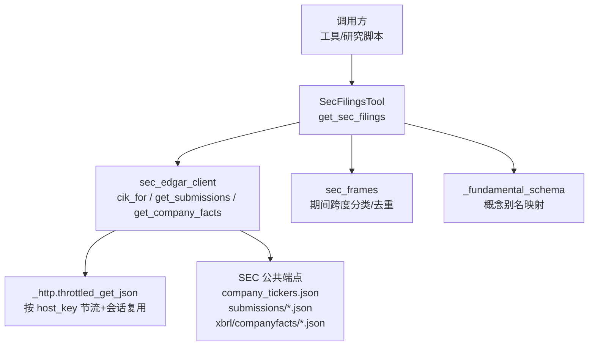
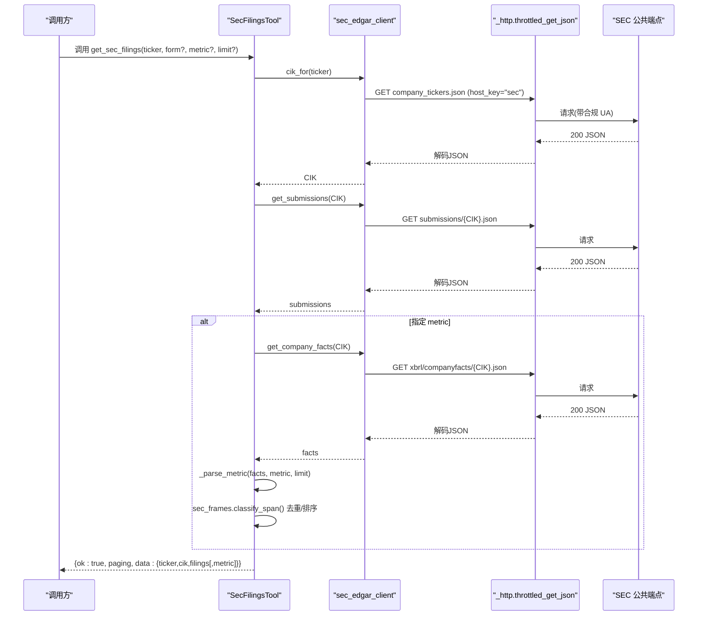
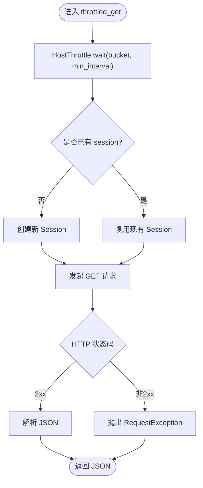
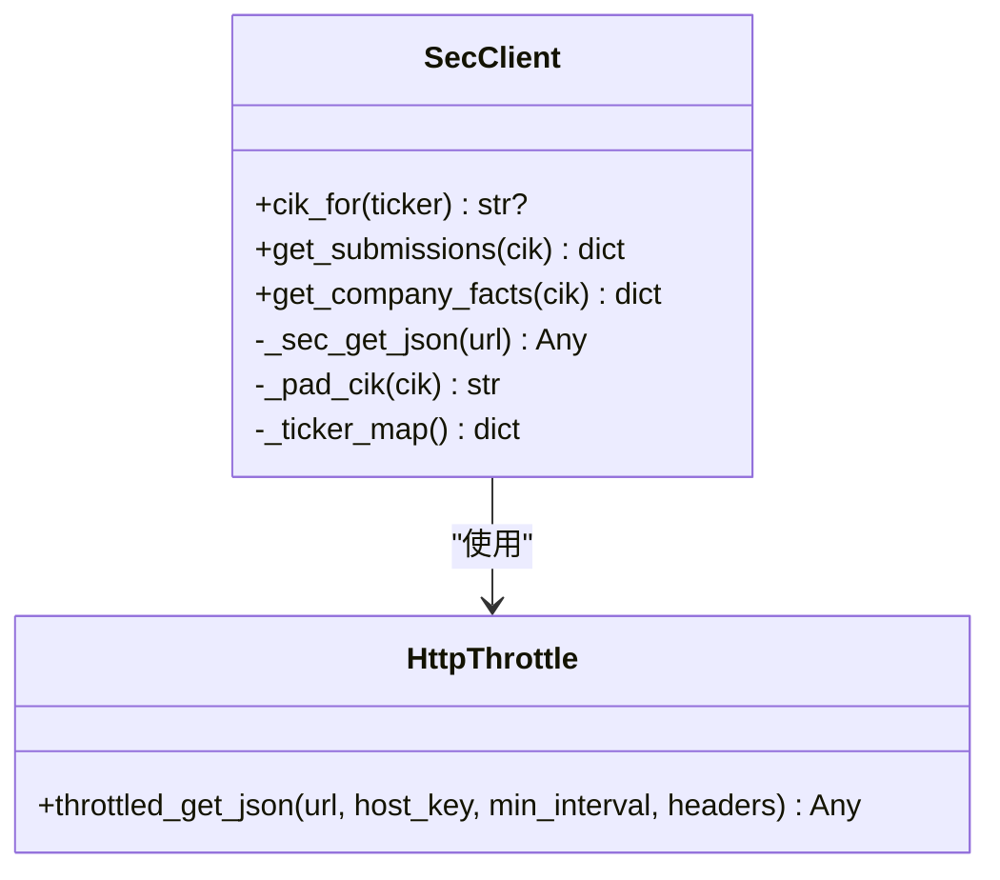
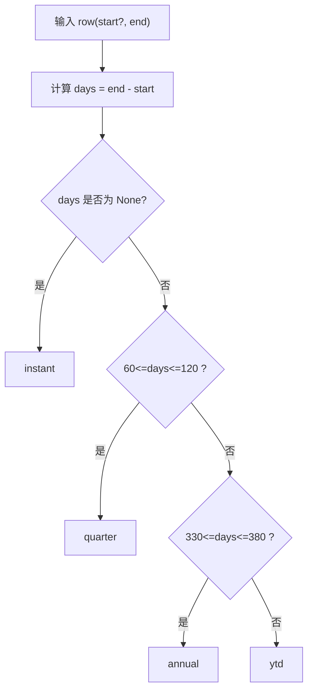
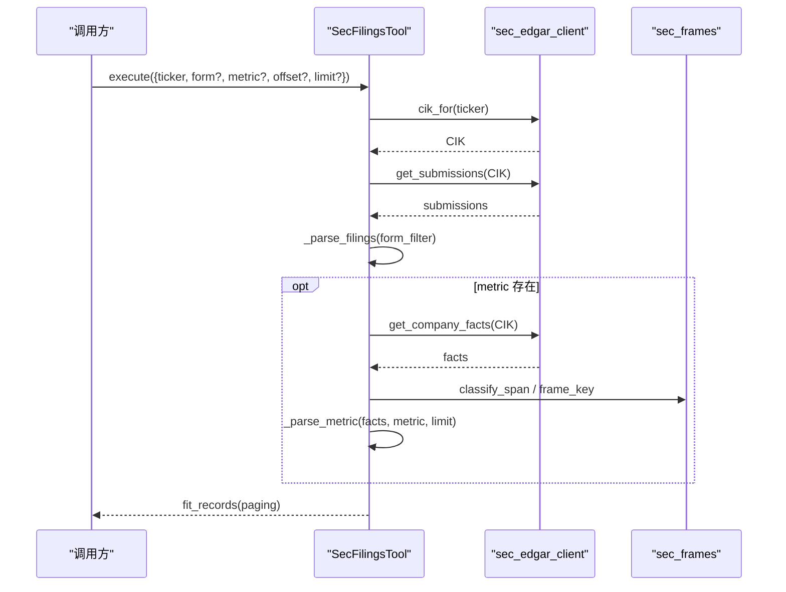
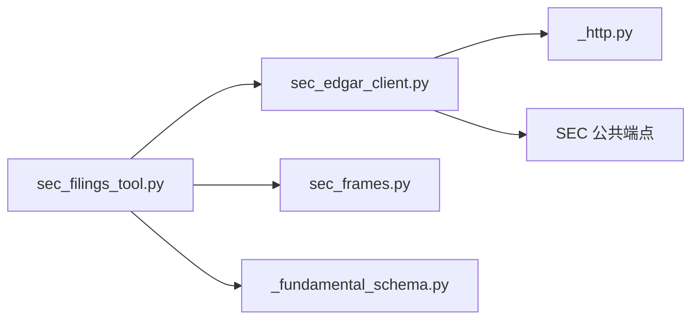

# SEC EDGAR文件客户端

<cite>
**本文引用的文件**
- [sec_edgar_client.py](file://agent/backtest/loaders/sec_edgar_client.py)
- [sec_frames.py](file://agent/backtest/loaders/sec_frames.py)
- [_fundamental_schema.py](file://agent/backtest/loaders/_fundamental_schema.py)
- [fundamentals_loader.py](file://agent/backtest/loaders/fundamentals_loader.py)
- [sec_filings_tool.py](file://agent/src/tools/sec_filings_tool.py)
- [_http.py](file://agent/backtest/loaders/_http.py)
- [SKILL.md（EDGAR 技能）](file://agent/src/skills/edgar-sec-filings/SKILL.md)
</cite>

## 目录
1. [简介](#简介)
2. [项目结构](#项目结构)
3. [核心组件](#核心组件)
4. [架构总览](#架构总览)
5. [详细组件分析](#详细组件分析)
6. [依赖关系分析](#依赖关系分析)
7. [性能与合规建议](#性能与合规建议)
8. [故障排查指南](#故障排查指南)
9. [结论](#结论)
10. [附录：API 与数据模型](#附录api-与数据模型)

## 简介
本技术文档面向美股研究与量化用户，系统化说明本项目中“SEC EDGAR 文件客户端”的实现与使用方式。内容覆盖：
- 访问接口：公司 filings、财务报表、XBRL 事实数据的获取方法
- API 使用规范：请求格式、分页处理、速率限制与 User-Agent 要求
- 支持的文件类型：10-K、10-Q、8-K、DEF 14A 等
- XML/XBRL 解析：从 XBRL companyfacts 提取结构化财务指标
- 合规性指导：遵守 SEC 公平访问政策、数据引用与商业使用限制
- 性能优化：缓存、并发控制、错误重试与预算控制

## 项目结构
围绕 SEC EDGAR 的数据流由以下模块协作完成：
- 传输层：统一 HTTP 节流与会话复用
- 客户端层：SEC 公共 JSON 端点封装（CIK 映射、submissions、companyfacts）
- 框架层：XBRL 期间跨度分类与去重策略
- 工具层：对外暴露的 get_sec_filings 工具（filings 列表 + 可选 XBRL 指标序列）
- 基础面加载器：将稀疏 XBRL 事实转换为 PIT-safe 面板数据

图表来源
- [sec_filings_tool.py:43-173](file://agent/src/tools/sec_filings_tool.py#L43-L173)
- [sec_edgar_client.py:78-227](file://agent/backtest/loaders/sec_edgar_client.py#L78-L227)
- [_http.py:141-200](file://agent/backtest/loaders/_http.py#L141-L200)
- [sec_frames.py:42-129](file://agent/backtest/loaders/sec_frames.py#L42-L129)
- [_fundamental_schema.py:99-170](file://agent/backtest/loaders/_fundamental_schema.py#L99-L170)

章节来源
- [sec_edgar_client.py:1-235](file://agent/backtest/loaders/sec_edgar_client.py#L1-L235)
- [sec_filings_tool.py:1-401](file://agent/src/tools/sec_filings_tool.py#L1-L401)
- [_http.py:1-200](file://agent/backtest/loaders/_http.py#L1-L200)

## 核心组件
- SEC 传输与节流
  - 通过统一的 HostThrottle 实现进程内每 host 的最小请求间隔，附带随机抖动避免同步突发；每个 host bucket 复用 requests.Session，降低 TCP/TLS 开销。
  - SEC 专用最小间隔默认 0.12s，可通过环境变量调整；User-Agent 必须包含联系邮箱以符合 SEC 公平访问政策。
- SEC 客户端
  - ticker->CIK 映射：一次性拉取并进程级缓存，支持 .US 后缀与带连字符的份额类符号。
  - submissions：获取公司近期 filings 索引（含 accessionNumber、filingDate、reportDate、primaryDocument 等）。
  - companyfacts：获取 XBRL us-gaap 全部事实，供指标序列抽取。
- XBRL 期间框架
  - 基于 start/end 计算跨度天数，区分 instant、quarter、annual、ytd，避免将 YTD 与同 end 的真实季度混淆。
- 基础面加载器
  - 将稀疏 XBRL 事实转为 PIT-safe 面板：仅当 filed 日期到达才可见；TTM 采用滚动四期近似；Q4 可由 FY 合成。
- 工具层
  - get_sec_filings：返回 filings 列表（可过滤 form），并可附加单一 us-gaap 概念的 XBRL 时间序列；内置分页与结果大小限制。

章节来源
- [_http.py:46-110](file://agent/backtest/loaders/_http.py#L46-L110)
- [sec_edgar_client.py:39-96](file://agent/backtest/loaders/sec_edgar_client.py#L39-L96)
- [sec_frames.py:29-129](file://agent/backtest/loaders/sec_frames.py#L29-L129)
- [fundamentals_loader.py:1-131](file://agent/backtest/loaders/fundamentals_loader.py#L1-L131)
- [sec_filings_tool.py:43-173](file://agent/src/tools/sec_filings_tool.py#L43-L173)

## 架构总览
下图展示一次典型调用：工具层接收参数，解析 ticker 为 CIK，拉取 submissions 和可选 companyfacts，利用 sec_frames 对 XBRL 点进行去重与归类，最终返回分页化的 filings 与指标序列。

图表来源
- [sec_filings_tool.py:102-173](file://agent/src/tools/sec_filings_tool.py#L102-L173)
- [sec_edgar_client.py:166-227](file://agent/backtest/loaders/sec_edgar_client.py#L166-L227)
- [_http.py:176-200](file://agent/backtest/loaders/_http.py#L176-L200)

## 详细组件分析

### SEC 传输与节流（_http.py）
- HostThrottle：进程内按 host_key 维护最近触发时间与最小间隔，支持周期性清理过期桶；等待时加入随机抖动，避免并发锁步。
- 会话复用：按 host_key 缓存 requests.Session，减少握手成本。
- throttled_get_json：封装 GET、状态码检查与 JSON 解码，非 2xx 或无法解码即抛出异常，便于上层重试策略识别。

图表来源
- [_http.py:46-110](file://agent/backtest/loaders/_http.py#L46-L110)
- [_http.py:141-200](file://agent/backtest/loaders/_http.py#L141-L200)

章节来源
- [_http.py:1-200](file://agent/backtest/loaders/_http.py#L1-L200)

### SEC 客户端（sec_edgar_client.py）
- 关键端点
  - company_tickers.json：ticker->CIK 映射表
  - submissions/CIK{padded}.json：公司近期 filings 索引
  - xbrl/companyfacts/CIK{padded}.json：XBRL us-gaap 全部事实
- 特性
  - 进程级 ticker->CIK 缓存，线程安全初始化
  - CIK 标准化：去除前缀、保留数字、零填充至 10 位
  - 支持 AAPL.US 与 BRK-B 等常见变体
  - 强制合规 UA：默认包含 Vibe-Trading 标识与联系邮箱，可被环境变量覆盖
  - 最小请求间隔：默认 0.12s，可通过环境变量调整

图表来源
- [sec_edgar_client.py:78-227](file://agent/backtest/loaders/sec_edgar_client.py#L78-L227)
- [_http.py:176-200](file://agent/backtest/loaders/_http.py#L176-L200)

章节来源
- [sec_edgar_client.py:1-235](file://agent/backtest/loaders/sec_edgar_client.py#L1-L235)

### XBRL 期间框架（sec_frames.py）
- 设计目标：用 (start, end) 作为期间唯一键，避免 YTD 与真实季度在同一 end 上的冲突。
- 能力
  - span_days：计算持续期间的天数
  - classify_span：标注 instant/quarter/annual/ytd
  - matches_cadence：按 cadence 筛选有效观测
- 阈值：季度窗口约 60-120 天，年度窗口约 330-380 天，兼顾 4-4-5 财年与 52/53 周年的边界情况。

图表来源
- [sec_frames.py:42-90](file://agent/backtest/loaders/sec_frames.py#L42-L90)

章节来源
- [sec_frames.py:1-129](file://agent/backtest/loaders/sec_frames.py#L1-L129)

### 基础面加载器（fundamentals_loader.py）
- PIT 安全：值在 filed 日期之后才可见，避免未来信息泄露
- 频率支持：annual、quarterly、ttm
- 流量型指标（如收入、利润、经营现金流、资本支出）：
  - 先按 (start, end) 去重，再根据季度/年度窗口筛选
  - Q4 缺失时可用 FY 合成：FY - (Q1+Q2+Q3)
- 存量型指标（资产负债表、股本）：按 period_end 最新 filed 取值
- TTM：对流量型指标做滚动四期求和，并以窗口内最新 filed 锚定

章节来源
- [fundamentals_loader.py:1-131](file://agent/backtest/loaders/fundamentals_loader.py#L1-L131)

### 工具层：get_sec_filings（sec_filings_tool.py）
- 功能
  - 返回列表式 filings（可按 form 过滤：10-K、10-Q、8-K 等）
  - 可选 metric：返回单一 us-gaap 概念的 XBRL 时间序列
- 分页与限流
  - offset/limit 分页；内部最大限制防止响应过大
  - 所有网络请求经 SEC 专属 host_key 节流，遵循 SEC 速率限制
- 输出
  - 成功：{ok:true, market:"US", source:"sec_edgar", paging:{...}, data:{ticker,cik,filings[,metric]}}
  - 失败：{ok:false, error:"..."}

图表来源
- [sec_filings_tool.py:102-173](file://agent/src/tools/sec_filings_tool.py#L102-L173)
- [sec_edgar_client.py:198-227](file://agent/backtest/loaders/sec_edgar_client.py#L198-L227)
- [sec_frames.py:93-129](file://agent/backtest/loaders/sec_frames.py#L93-L129)

章节来源
- [sec_filings_tool.py:1-401](file://agent/src/tools/sec_filings_tool.py#L1-L401)

### 概念映射与字段定义（_fundamental_schema.py）
- 提供 RAW_FIELDS 与 DERIVED_FIELDS 的统一语义
- SEC_CONCEPT_MAP：us-gaap 概念别名优先级映射（例如收入优先新口径）
- 派生字段：ROE、ROA、杠杆率、应计项等，均基于安全除法避免除零

章节来源
- [_fundamental_schema.py:1-227](file://agent/backtest/loaders/_fundamental_schema.py#L1-L227)

## 依赖关系分析
- 低耦合：工具层不直接处理网络细节，仅依赖 sec_edgar_client；后者仅负责 URL 组装与节流调用；_http 提供通用能力。
- 高内聚：sec_frames 专注 XBRL 期间语义；_fundamental_schema 专注字段与概念映射。
- 外部依赖：仅依赖 requests 与标准库；无第三方 XBRL 解析库，采用轻量 JSON 路径提取。

图表来源
- [sec_filings_tool.py:22-33](file://agent/src/tools/sec_filings_tool.py#L22-L33)
- [sec_edgar_client.py:31-35](file://agent/backtest/loaders/sec_edgar_client.py#L31-L35)
- [_http.py:1-17](file://agent/backtest/loaders/_http.py#L1-L17)

章节来源
- [sec_filings_tool.py:1-401](file://agent/src/tools/sec_filings_tool.py#L1-L401)
- [sec_edgar_client.py:1-235](file://agent/backtest/loaders/sec_edgar_client.py#L1-L235)
- [_http.py:1-200](file://agent/backtest/loaders/_http.py#L1-L200)

## 性能与合规建议

### 速率限制与合规
- SEC 公平访问政策
  - 必须设置包含联系信息的 User-Agent；默认已内置，可通过环境变量覆盖
  - 请求间隔：默认 0.12s/次，可通过环境变量调大以避免临时封禁
- 进程内节流
  - 所有 SEC 请求走同一 host_key，自动加抖动，避免并发锁步
- 结果大小控制
  - 工具层限制 filings 与 metric 点数上限，避免响应过大

### 缓存与并发
- ticker->CIK 映射进程级缓存，首次拉取后复用
- requests.Session 按 host_key 复用，减少连接建立开销
- 批量场景建议：
  - 提高最小间隔（环境变量）
  - 串行化或限制并发度，避免瞬时突发
  - 对失败请求实施指数退避重试（由上层重试策略处理）

### 错误与重试
- 非 2xx 或 JSON 解析失败会抛出异常，适合由上层重试机制识别为瞬态错误
- 建议在业务层实现：
  - 有限重试次数
  - 指数退避
  - 超时保护（默认 15s）

### 合规与法律提示
- 数据来源：SEC 公开免费 JSON 端点，仅供研究与分析用途
- 引用规范：在研究报告中注明数据来源为 SEC EDGAR，并附上具体 filing 的 accession number 与 URL
- 商业使用：请遵守 SEC 公平访问政策与网站条款，避免高频抓取导致被封禁

[本节为通用指导，不直接分析具体代码文件]

## 故障排查指南
- 现象：频繁 429/临时封禁
  - 检查是否设置了合规 UA；确认最小间隔未低于 0.12s；适当增大间隔
- 现象：指标为空或错配
  - 确认 metric 名称为 us-gaap 概念名；检查 sec_frames 的期间分类是否正确
  - 若为流量型指标，注意 YTD 与季度的区分
- 现象：PIT 数据不可见
  - 确认查询日期晚于 filed 日期；TTM 需确保滚动窗口内有足够 filed 记录
- 现象：响应过大或被截断
  - 减小 limit；使用分页 offset 逐步获取

章节来源
- [sec_edgar_client.py:63-96](file://agent/backtest/loaders/sec_edgar_client.py#L63-L96)
- [sec_filings_tool.py:176-183](file://agent/src/tools/sec_filings_tool.py#L176-L183)
- [sec_frames.py:72-90](file://agent/backtest/loaders/sec_frames.py#L72-L90)

## 结论
本实现以极简依赖与清晰分层，提供了稳定可靠的 SEC EDGAR 数据接入能力：
- 传输层保证节流与连接复用
- 客户端层封装三大公共端点，支持 ticker->CIK 映射与 XBRL 事实获取
- 框架层解决 XBRL 期间歧义，保障数据正确性
- 工具层提供易用接口，支持 filings 列表与单指标序列，内置分页与限流
- 配合基础面加载器，可将稀疏 XBRL 事实转化为 PIT-safe 面板，支撑回测与研究

对于美股研究与分析用户，该方案在合规、性能与可用性之间取得平衡，可作为 SEC 数据源的基础设施。

[本节为总结性内容，不直接分析具体代码文件]

## 附录：API 与数据模型

### 支持的 SEC 文件类型
- 10-K：年度报告，完整财务与风险披露
- 10-Q：季度报告，中期财务与管理讨论
- 8-K：重大事件即时披露
- DEF 14A：委托书，治理与薪酬披露
- Form 4：内部人交易
- 13F：机构持仓披露
- SC 13D/G：持股超过 5% 的披露

章节来源
- [SKILL.md（EDGAR 技能）:14-23](file://agent/src/skills/edgar-sec-filings/SKILL.md#L14-L23)

### 请求与响应要点
- 请求
  - ticker：必填，大小写不敏感
  - form：可选，过滤 filings 类型
  - metric：可选，us-gaap 概念名，返回对应 XBRL 时间序列
  - offset/limit：分页参数，limit 有上限
- 响应
  - ok：布尔
  - market/source：固定为 US/sec_edgar
  - paging：分页元信息
  - data：包含 ticker、cik、filings 列表；当指定 metric 时包含 metric 块

章节来源
- [sec_filings_tool.py:55-117](file://agent/src/tools/sec_filings_tool.py#L55-L117)

### XBRL 指标序列字段
- concept：概念名
- unit：单位键（选择数据最丰富的单位）
- label：概念标签
- points：数组，每项包含 end、val、start、period_days、period_type、filed、fy、fp、form、accn、frame

章节来源
- [sec_filings_tool.py:267-320](file://agent/src/tools/sec_filings_tool.py#L267-L320)
- [sec_frames.py:42-90](file://agent/backtest/loaders/sec_frames.py#L42-L90)