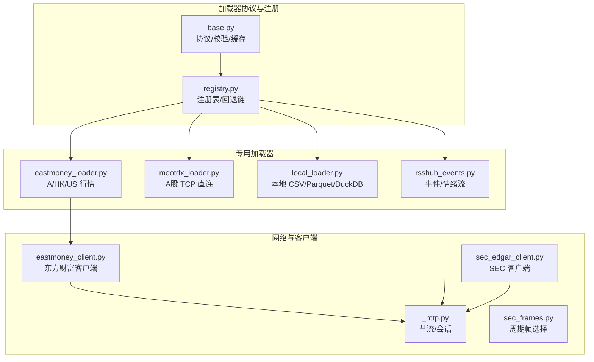
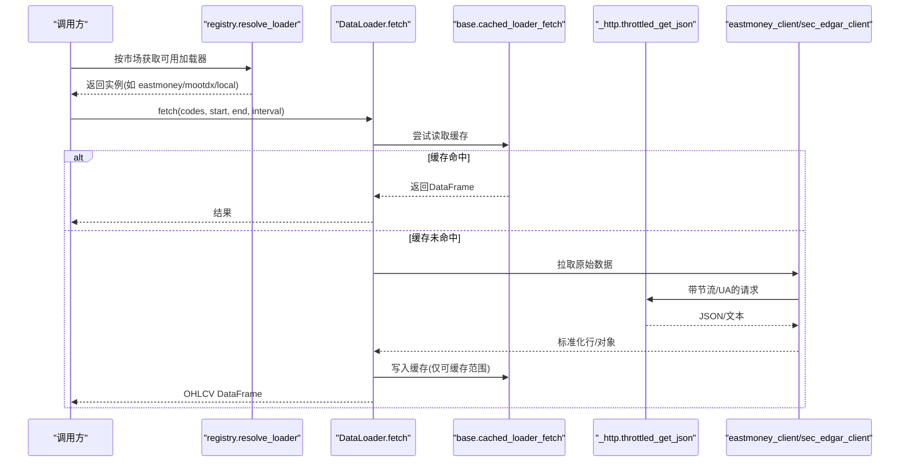
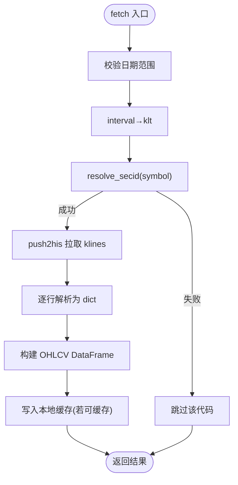
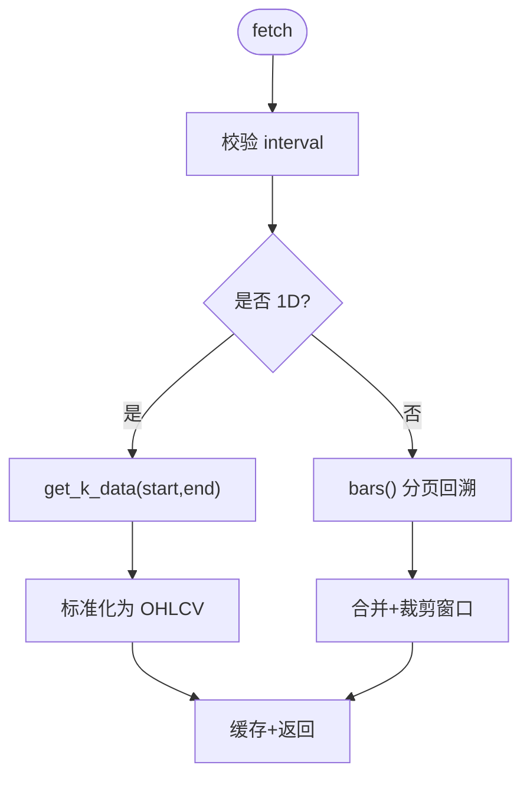
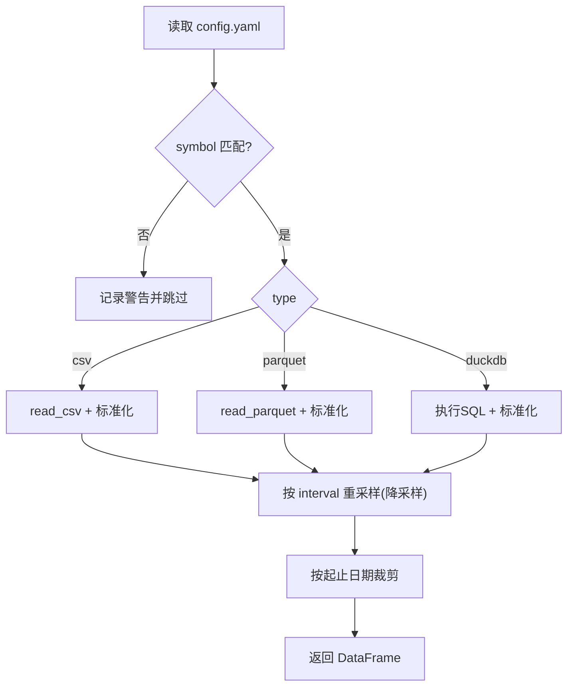
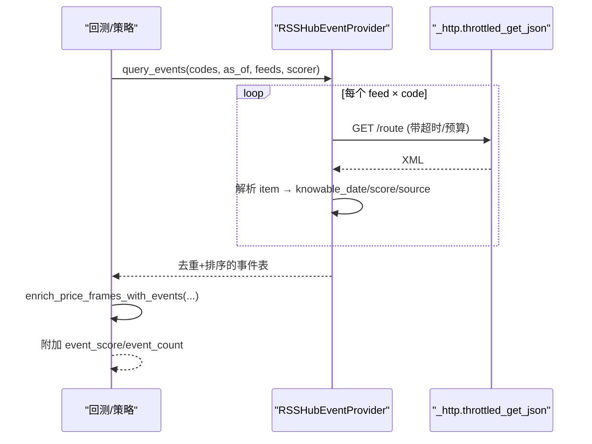
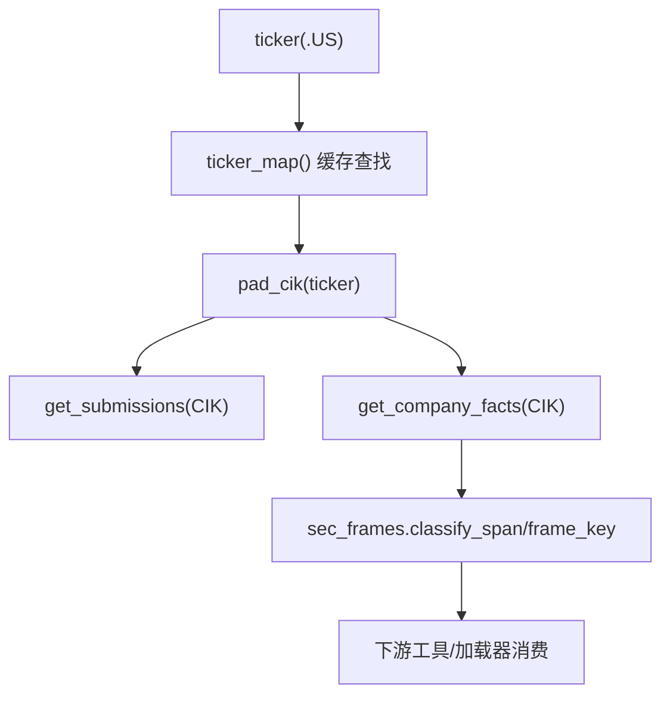
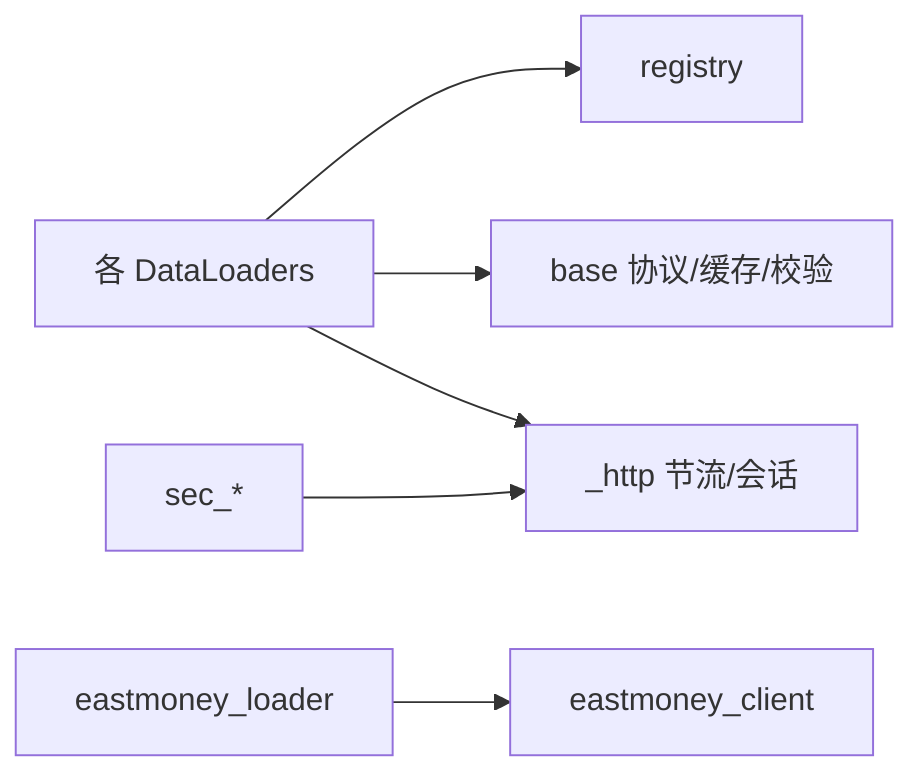

# 专用数据加载器

<cite>
**本文引用的文件**
- [base.py](file://agent/backtest/loaders/base.py)
- [registry.py](file://agent/backtest/loaders/registry.py)
- [eastmoney_loader.py](file://agent/backtest/loaders/eastmoney_loader.py)
- [eastmoney_client.py](file://agent/backtest/loaders/eastmoney_client.py)
- [mootdx_loader.py](file://agent/backtest/loaders/mootdx_loader.py)
- [local_loader.py](file://agent/backtest/loaders/local_loader.py)
- [rsshub_events.py](file://agent/backtest/loaders/rsshub_events.py)
- [sec_edgar_client.py](file://agent/backtest/loaders/sec_edgar_client.py)
- [sec_frames.py](file://agent/backtest/loaders/sec_frames.py)
- [_http.py](file://agent/backtest/loaders/_http.py)
</cite>

## 目录
1. [简介](#简介)
2. [项目结构](#项目结构)
3. [核心组件](#核心组件)
4. [架构总览](#架构总览)
5. [详细组件分析](#详细组件分析)
6. [依赖关系分析](#依赖关系分析)
7. [性能与调优](#性能与调优)
8. [故障排查指南](#故障排查指南)
9. [结论](#结论)
10. [附录：配置与环境变量](#附录：配置与环境变量)

## 简介
本文件面向专业用户与系统集成开发者，系统化梳理 Vibe-Trading 回测与事件驱动系统中的“专用数据加载器”实现。覆盖以下场景与能力：
- A股深度行情（东方财富、MooDuckX）
- 本地文件加载（CSV/Parquet/DuckDB）
- 事件流（RSSHub 新闻/公告/情绪）
- 监管文件（SEC EDGAR 公司事实与申报索引）
- 统一的数据协议、重试/预算控制、本地缓存、市场回退链等基础设施

目标：帮助读者理解各加载器的应用场景、数据处理特点、配置项、集成方式、性能调优与最佳实践。

## 项目结构
加载器位于 agent/backtest/loaders 目录，采用“协议 + 注册表 + 多实现”的模块化设计：
- base.py：定义 DataLoaderProtocol、校验工具、重试/预算、本地 Parquet 缓存等通用能力
- registry.py：全局注册表、按市场的回退链、自动解析可用加载器
- 具体加载器：eastmoney_loader、mootdx_loader、local_loader、rsshub_events、sec_* 等
- 共享网络层：_http.py 提供每主机节流、会话复用、JSON/CSV GET
- 领域客户端：eastmoney_client、sec_edgar_client、sec_frames 等

图表来源
- [registry.py:19-158](file://agent/backtest/loaders/registry.py#L19-L158)
- [base.py:851-887](file://agent/backtest/loaders/base.py#L851-L887)
- [eastmoney_loader.py:51-63](file://agent/backtest/loaders/eastmoney_loader.py#L51-L63)
- [mootdx_loader.py:66-77](file://agent/backtest/loaders/mootdx_loader.py#L66-L77)
- [local_loader.py:271-277](file://agent/backtest/loaders/local_loader.py#L271-L277)
- [rsshub_events.py:288-327](file://agent/backtest/loaders/rsshub_events.py#L288-L327)
- [eastmoney_client.py:32-40](file://agent/backtest/loaders/eastmoney_client.py#L32-L40)
- [sec_edgar_client.py:39-57](file://agent/backtest/loaders/sec_edgar_client.py#L39-L57)
- [_http.py:46-107](file://agent/backtest/loaders/_http.py#L46-L107)

章节来源
- [registry.py:19-158](file://agent/backtest/loaders/registry.py#L19-L158)
- [base.py:851-887](file://agent/backtest/loaders/base.py#L851-L887)

## 核心组件
- DataLoaderProtocol：统一接口 name/markets/requires_auth/is_available/fetch，约定 OHLCV DataFrame 契约
- 校验与清洗：validate_date_range、validate_ohlc 保证数据质量边界
- 重试与预算：retry_with_budget/check_budget 为外部 API 提供有界重试与超时保护
- 本地缓存：基于 Parquet + DuckDB 的内容寻址缓存，支持元数据持久化与类型恢复
- 注册与回退：按市场维护加载器优先级链，自动选择可用源；对 local/qveris/tickerall 禁止静默降级到网络源

章节来源
- [base.py:168-256](file://agent/backtest/loaders/base.py#L168-L256)
- [base.py:377-450](file://agent/backtest/loaders/base.py#L377-L450)
- [base.py:243-441](file://agent/backtest/loaders/base.py#L243-L441)
- [registry.py:119-196](file://agent/backtest/loaders/registry.py#L119-L196)

## 架构总览
下图展示从调用方到具体加载器与底层网络的完整流程，包括缓存命中、失败回退、节流与重试。

图表来源
- [registry.py:614-649](file://agent/backtest/loaders/registry.py#L614-L649)
- [base.py:623-661](file://agent/backtest/loaders/base.py#L623-L661)
- [eastmoney_loader.py:69-116](file://agent/backtest/loaders/eastmoney_loader.py#L69-L116)
- [eastmoney_client.py:300-355](file://agent/backtest/loaders/eastmoney_client.py#L300-L355)
- [_http.py:141-201](file://agent/backtest/loaders/_http.py#L141-L201)

## 详细组件分析

### 东方财富（A股/HK/US 行情）
- 适用场景：免费无鉴权的历史与分钟级 K 线，适合 A 股深度数据、港股、美股（通过搜索定位 secid）
- 数据处理特点：
  - 符号路由：将 Vibe-Trading 符号映射为 Eastmoney secid（SH/SZ/BJ/HK/US）
  - 区间转换：YYYY-MM-DD → YYYYMMDD
  - 列标准化：trade_date/open/high/low/close/volume
  - 单条失败不影响批量
- 配置与认证：无需 token；通过环境变量调整最小请求间隔
- 性能要点：
  - 使用 _http 的 per-host 节流与 Session 复用
  - 使用 base 的 cached_loader_fetch 做本地 Parquet 缓存
  - US 市场 secid 搜索结果进程内缓存

图表来源
- [eastmoney_loader.py:69-116](file://agent/backtest/loaders/eastmoney_loader.py#L69-L116)
- [eastmoney_loader.py:118-183](file://agent/backtest/loaders/eastmoney_loader.py#L118-L183)
- [eastmoney_client.py:239-355](file://agent/backtest/loaders/eastmoney_client.py#L239-L355)
- [base.py:623-661](file://agent/backtest/loaders/base.py#L623-L661)

章节来源
- [eastmoney_loader.py:1-183](file://agent/backtest/loaders/eastmoney_loader.py#L1-L183)
- [eastmoney_client.py:1-325](file://agent/backtest/loaders/eastmoney_client.py#L1-L325)
- [_http.py:127-201](file://agent/backtest/loaders/_http.py#L127-L201)

### MooDuckX（本地通达信 TCP 行情）
- 适用场景：A 股 OHLCV，TCP 直连通达信服务器，不受 HTTP 抓取 IP 封禁影响
- 数据处理特点：
  - 支持 1m/5m/15m/30m/1H/1D/1W/1M
  - 日线走 get_k_data；其他频率通过 bars() 分页回溯至起始日
  - 北交所代码上游不可用，会记录警告并跳过
- 配置与认证：无需 token；需安装 mootdx 依赖
- 性能要点：
  - 分页上限限制，避免长时间请求
  - 使用 base 的 cached_loader_fetch 缓存

图表来源
- [mootdx_loader.py:96-153](file://agent/backtest/loaders/mootdx_loader.py#L96-L153)
- [mootdx_loader.py:155-207](file://agent/backtest/loaders/mootdx_loader.py#L155-L207)
- [mootdx_loader.py:209-258](file://agent/backtest/loaders/mootdx_loader.py#L209-L258)

章节来源
- [mootdx_loader.py:1-258](file://agent/backtest/loaders/mootdx_loader.py#L1-L258)

### 本地文件加载（CSV/Parquet/DuckDB）
- 适用场景：自有历史数据或离线数据集，灵活字段映射与时间重采样
- 数据处理特点：
  - 支持 CSV/Parquet/DuckDB 三种类型
  - 字段映射 date/open/high/low/close/volume，可选自定义列名与日期格式
  - 自动 UTC→本地时区归一化，OHLC 校验与缺失值处理
  - 支持降采样（resample），不支持升采样（发出警告并返回原粒度）
- 配置与认证：
  - 配置文件路径：~/.vibe-trading/data-bridge/config.yaml
  - sources 列表每项包含 symbol/type/path/db_path/query/columns/date_format
- 性能要点：
  - 使用 base 的 cached_loader_fetch 缓存
  - 对大文件建议 Parquet 存储，减少 IO 与内存占用

图表来源
- [local_loader.py:129-216](file://agent/backtest/loaders/local_loader.py#L129-L216)
- [local_loader.py:301-405](file://agent/backtest/loaders/local_loader.py#L301-L405)

章节来源
- [local_loader.py:1-354](file://agent/backtest/loaders/local_loader.py#L1-L354)

### RSSHub 事件流（事件驱动/情绪因子）
- 适用场景：新闻/公告/情绪事件，注入到价格序列中形成 event_score/event_count
- 数据处理特点：
  - FeedSpec 声明 route_template、event_type、code_style
  - 默认词典打分器（正负词频），可替换为任意 scorer(title, summary)
  - Point-in-time 安全：knowable_date 规则（收盘后延至下一交易日）
  - 聚合函数 enrich_price_frames_with_events：指数衰减、滑动窗口
- 配置与认证：
  - 需要自托管 RSSHub 实例，base_url 来自环境变量或配置
  - 可通过 feeds 参数指定订阅源
- 性能要点：
  - 使用 retry_with_budget 控制整体预算与超时
  - 所有 feed 全部失败才抛错，部分失败不中断

图表来源
- [rsshub_events.py:288-400](file://agent/backtest/loaders/rsshub_events.py#L288-L400)
- [rsshub_events.py:402-447](file://agent/backtest/loaders/rsshub_events.py#L402-L447)
- [rsshub_events.py:449-569](file://agent/backtest/loaders/rsshub_events.py#L449-L569)

章节来源
- [rsshub_events.py:1-569](file://agent/backtest/loaders/rsshub_events.py#L1-L569)

### SEC EDGAR 文件（监管文件与公司事实）
- 适用场景：美国上市公司 XBRL 财务事实与申报索引，用于基本面/事件研究
- 数据处理特点：
  - ticker→CIK 映射（进程内缓存），支持 .US 后缀剥离与 BRK-B 类点号替换
  - 获取 submissions（近期申报索引）与 companyfacts（全量 XBRL 概念）
  - sec_frames 根据 start/end 跨度分类 instant/quarter/annual/ytd，避免季度与 YTD 混淆
- 配置与认证：
  - 免费公开接口，遵守 SEC 速率限制与 UA 要求
  - 可通过环境变量调整最小请求间隔与 UA
- 性能要点：
  - 通过 _http 的 throttled_get_json 进行节流与 UA 注入
  - ticker→CIK 表进程内缓存，避免重复网络请求

图表来源
- [sec_edgar_client.py:118-196](file://agent/backtest/loaders/sec_edgar_client.py#L118-L196)
- [sec_edgar_client.py:198-227](file://agent/backtest/loaders/sec_edgar_client.py#L198-L227)
- [sec_frames.py:42-129](file://agent/backtest/loaders/sec_frames.py#L42-L129)
- [_http.py:141-201](file://agent/backtest/loaders/_http.py#L141-L201)

章节来源
- [sec_edgar_client.py:1-235](file://agent/backtest/loaders/sec_edgar_client.py#L1-L235)
- [sec_frames.py:1-129](file://agent/backtest/loaders/sec_frames.py#L1-L129)

## 依赖关系分析
- 加载器均遵循 DataLoaderProtocol，并通过 registry 自动发现与回退
- 网络访问统一经 _http 的 HostThrottle 与 Session 池，避免被限流
- 东方财富与 SEC 客户端各自封装协议细节，loader 只负责数据契约
- 本地缓存与校验在 base 层提供，所有 loader 均可复用

图表来源
- [registry.py:19-158](file://agent/backtest/loaders/registry.py#L19-L158)
- [base.py:851-887](file://agent/backtest/loaders/base.py#L851-L887)
- [eastmoney_loader.py:51-63](file://agent/backtest/loaders/eastmoney_loader.py#L51-L63)
- [sec_edgar_client.py:39-57](file://agent/backtest/loaders/sec_edgar_client.py#L39-L57)
- [_http.py:46-107](file://agent/backtest/loaders/_http.py#L46-L107)

章节来源
- [registry.py:19-158](file://agent/backtest/loaders/registry.py#L19-L158)
- [base.py:851-887](file://agent/backtest/loaders/base.py#L851-L887)

## 性能与调优
- 网络节流
  - 东方财富：通过 VIBE_TRADING_EASTMONEY_MIN_INTERVAL 调整最小请求间隔（默认 1.0s）
  - SEC：通过 VIBE_TRADING_SEC_MIN_INTERVAL 调整最小请求间隔（默认 0.12s）
  - 通用：_http 提供 jitter 与进程内会话复用，降低握手开销
- 重试与预算
  - 使用 retry_with_budget 对瞬态异常进行有限次重试，并在 deadline 到达时快速失败
  - RSSHub 事件拉取支持 RSSHUB_TIMEOUT_S 与 RSSHUB_FETCH_BUDGET_S 控制单次查询预算
- 本地缓存
  - 启用条件：VIBE_TRADING_DATA_CACHE=true，且 end_date 必须已结算（非未来）
  - 缓存根目录：VIBE_TRADING_DATA_CACHE_ROOT（默认 ~/.vibe-trading/cache/loaders）
  - 内容寻址 key 包含 source/symbol/timeframe/start/end/fields，版本化防脏读
- 数据质量
  - validate_ohlc 强制 high>=low 且高低价包围开收价，拒绝零价（可配置允许负价）
  - 本地加载支持 resample 降采样，避免无效升采样
- 并发与批处理
  - 批量拉取时提高 *_MIN_INTERVAL 以避免触发服务端限速
  - 合理设置 RSSHUB 预算，避免长尾请求拖慢整体

[本节为通用指导，不直接分析具体文件]

## 故障排查指南
- 无法找到可用数据源
  - 现象：NoAvailableSourceError
  - 排查：检查网络、API Token、依赖安装（如 mootdx）、local 配置是否存在
  - 参考：registry 的回退链与 _NO_NETWORK_FALLBACK_SOURCES 行为
- 东方财富解析失败
  - 现象：某些 interval 不被支持或 secid 解析为空
  - 排查：确认 interval 是否在 KLT_BY_INTERVAL；US 代码需能搜索到 secid
- MooDuckX 北交所不可用
  - 现象：北交所代码被跳过并记录警告
  - 排查：改用 akshare/tushare 等其他源
- RSSHub 全部失败
  - 现象：EventProviderError 提示所有 feed 不可达
  - 排查：确认 RSSHUB_BASE_URL、feeds 路由存在、网络可达
- SEC 数据错误
  - 现象：ticker→CIK 映射失败或 XBRL 字段缺失
  - 排查：检查 ticker 格式（支持 .US 剥离与点号替换）、网络状态与 UA 设置

章节来源
- [registry.py:119-196](file://agent/backtest/loaders/registry.py#L119-L196)
- [eastmoney_client.py:239-267](file://agent/backtest/loaders/eastmoney_client.py#L239-L267)
- [mootdx_loader.py:47-64](file://agent/backtest/loaders/mootdx_loader.py#L47-L64)
- [rsshub_events.py:343-400](file://agent/backtest/loaders/rsshub_events.py#L343-L400)
- [sec_edgar_client.py:166-196](file://agent/backtest/loaders/sec_edgar_client.py#L166-L196)

## 结论
本系统通过统一的 DataLoaderProtocol、健壮的重试/预算机制、内容寻址的本地缓存以及按市场的回退链，为多市场、多来源的数据接入提供了稳定可扩展的基础设施。针对东方财富、MooDuckX、本地文件、RSSHub 事件流与 SEC EDGAR 的专用实现，覆盖了实时/历史回测、事件驱动与监管文件等典型场景。结合节流、缓存与数据校验，可在生产环境中获得高可用与高性能的数据供给。

[本节为总结性内容，不直接分析具体文件]

## 附录：配置与环境变量
- 通用
  - VIBE_TRADING_DATA_CACHE：是否启用本地数据缓存（true/false）
  - VIBE_TRADING_DATA_CACHE_ROOT：缓存根目录（默认 ~/.vibe-trading/cache/loaders）
  - VIBE_TRADING_SEC_UA：SEC 请求 User-Agent（合规必需）
  - VIBE_TRADING_SEC_MIN_INTERVAL：SEC 最小请求间隔（秒）
- 东方财富
  - VIBE_TRADING_EASTMONEY_MIN_INTERVAL：最小请求间隔（秒）
- RSSHub
  - RSSHUB_BASE_URL：RSSHub 实例地址
  - RSSHUB_TIMEOUT_S：单次请求超时（秒）
  - RSSHUB_FETCH_BUDGET_S：单次查询预算（秒）
- 本地加载器
  - 配置文件：~/.vibe-trading/data-bridge/config.yaml
  - sources 条目字段：symbol、type（csv/parquet/duckdb）、path/db_path、query、columns、date_format

章节来源
- [base.py:243-283](file://agent/backtest/loaders/base.py#L243-L283)
- [eastmoney_client.py:37-40](file://agent/backtest/loaders/eastmoney_client.py#L37-L40)
- [sec_edgar_client.py:43-57](file://agent/backtest/loaders/sec_edgar_client.py#L43-L57)
- [rsshub_events.py:40-50](file://agent/backtest/loaders/rsshub_events.py#L40-L50)
- [local_loader.py:1-30](file://agent/backtest/loaders/local_loader.py#L1-L30)