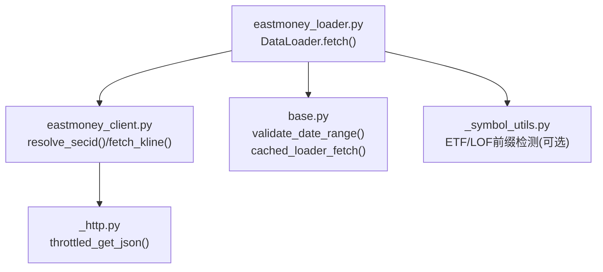
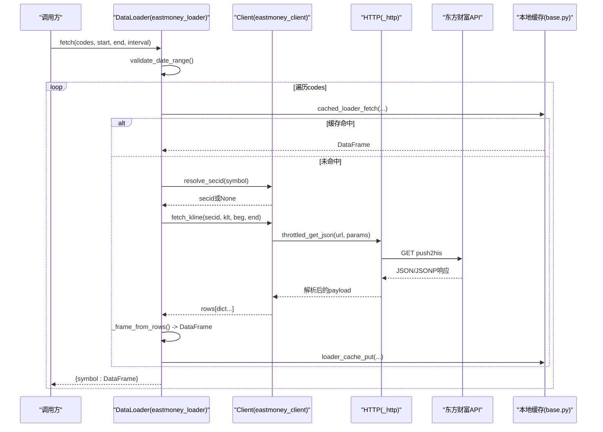
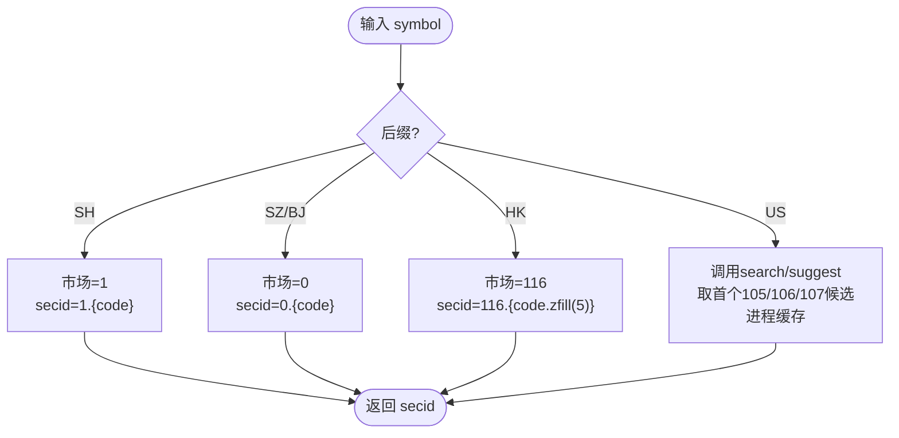
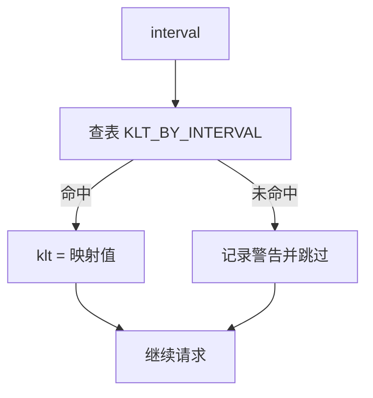
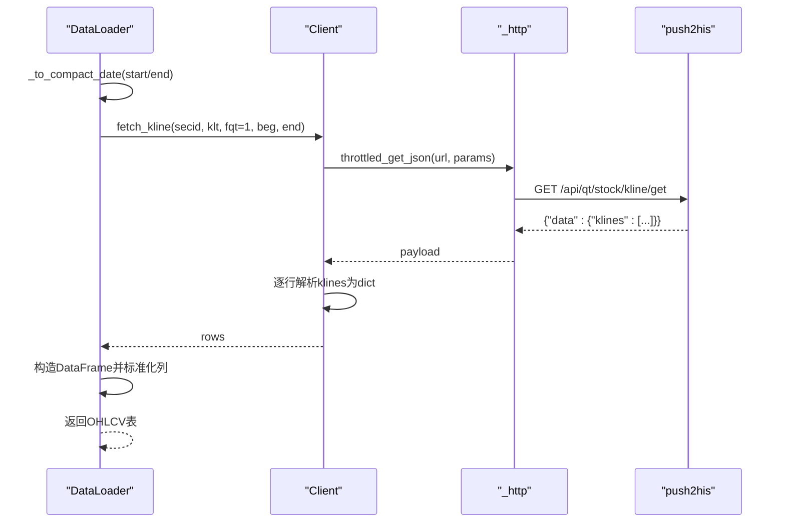
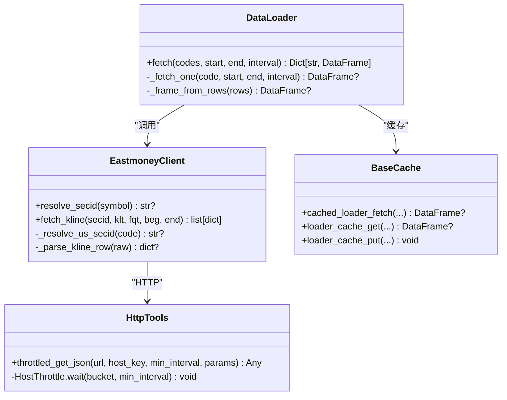
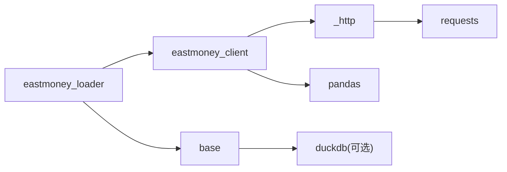

# 东方财富数据加载器

<cite>
**本文引用的文件**
- [eastmoney_loader.py](file://agent/backtest/loaders/eastmoney_loader.py)
- [eastmoney_client.py](file://agent/backtest/loaders/eastmoney_client.py)
- [_http.py](file://agent/backtest/loaders/_http.py)
- [base.py](file://agent/backtest/loaders/base.py)
- [_symbol_utils.py](file://agent/backtest/loaders/_symbol_utils.py)
- [test_eastmoney_loader.py](file://agent/tests/test_eastmoney_loader.py)
- [test_eastmoney_client.py](file://agent/tests/test_eastmoney_client.py)
</cite>

## 目录
1. [简介](#简介)
2. [项目结构](#项目结构)
3. [核心组件](#核心组件)
4. [架构总览](#架构总览)
5. [详细组件分析](#详细组件分析)
6. [依赖关系分析](#依赖关系分析)
7. [性能考量](#性能考量)
8. [故障排查指南](#故障排查指南)
9. [结论](#结论)
10. [附录](#附录)

## 简介
本技术文档聚焦于“东方财富数据加载器”的实现，面向量化回测场景，提供对A股、港股、美股的免费OHLCV（开高收量）历史行情获取能力。该实现通过统一的符号路由机制将不同市场的代码格式映射为东方财富内部secid标识；通过频率映射将统一的时间粒度标签转换为东方财富klt参数；通过共享HTTP客户端与进程级限流策略控制IP级别的请求速率；并通过本地缓存减少重复网络请求。单个符号失败不会影响批量请求的整体返回结果，保证批处理的鲁棒性。

## 项目结构
围绕东方财富数据加载的核心文件组织如下：
- eastmoney_loader.py：对外暴露的数据加载器类，负责参数校验、符号到klt/secid转换、构建DataFrame并封装错误隔离。
- eastmoney_client.py：东方财富专用HTTP客户端，负责secid解析、JSON/JSONP处理、K线接口调用与行解析。
- _http.py：通用HTTP工具，提供按主机桶的节流与Session复用。
- base.py：通用基础能力，包括日期校验、OHLC校验、重试预算、本地Parquet缓存等。
- _symbol_utils.py：交易所ETF/LOF前缀识别（辅助工具）。
- 测试文件：覆盖符号路由、频率映射、端到端HTTP边界行为与异常路径。

图表来源
- [eastmoney_loader.py:69-149](file://agent/backtest/loaders/eastmoney_loader.py#L69-L149)
- [eastmoney_client.py:239-355](file://agent/backtest/loaders/eastmoney_client.py#L239-L355)
- [_http.py:141-200](file://agent/backtest/loaders/_http.py#L141-L200)
- [base.py:168-184](file://agent/backtest/loaders/base.py#L168-L184)
- [base.py:623-661](file://agent/backtest/loaders/base.py#L623-L661)

章节来源
- [eastmoney_loader.py:1-183](file://agent/backtest/loaders/eastmoney_loader.py#L1-L183)
- [eastmoney_client.py:1-325](file://agent/backtest/loaders/eastmoney_client.py#L1-L325)
- [_http.py:1-201](file://agent/backtest/loaders/_http.py#L1-L201)
- [base.py:1-657](file://agent/backtest/loaders/base.py#L1-L657)
- [_symbol_utils.py:1-21](file://agent/backtest/loaders/_symbol_utils.py#L1-L21)

## 核心组件
- DataLoader（eastmoney_loader.py）
  - 声明市场集合：A股、港股、美股。
  - 支持区间：日线、周线、月线、分钟线（含1m/5m/15m/30m）、小时线（1H/60m）。
  - fetch()方法：对每个符号进行安全抓取，单个失败不影响整体；输出标准OHLCV DataFrame。
  - 内部函数_to_compact_date()：将YYYY-MM-DD转为YYYYMMDD供接口使用。
- Eastmoney Client（eastmoney_client.py）
  - resolve_secid()：将“代码.后缀”映射为东方财富secid（如1.600519、116.00700、105.AAPL）。
  - fetch_kline()：调用push2his接口，解析klines字符串行，返回字典列表。
  - KLT_BY_INTERVAL：时间粒度到klt参数的映射表。
  - US secid缓存：进程内缓存搜索得到的美股secid，避免重复查询。
- HTTP工具（_http.py）
  - HostThrottle：进程内按host_key的最小间隔限制，带抖动防同步。
  - throttled_get_json()：统一GET+JSON解码+状态码检查。
  - Session复用：按host_key维护requests.Session，降低TCP/TLS开销。
- 基础能力（base.py）
  - validate_date_range()：起止日期合法性校验。
  - cached_loader_fetch()：基于配置的本地Parquet缓存读写，命中则直接返回。
  - OHLC校验工具：用于后续统一清洗（当前加载器仅做NaN清理）。

章节来源
- [eastmoney_loader.py:51-183](file://agent/backtest/loaders/eastmoney_loader.py#L51-L183)
- [eastmoney_client.py:42-64](file://agent/backtest/loaders/eastmoney_client.py#L42-L64)
- [eastmoney_client.py:136-267](file://agent/backtest/loaders/eastmoney_client.py#L136-L267)
- [eastmoney_client.py:300-355](file://agent/backtest/loaders/eastmoney_client.py#L300-L355)
- [_http.py:46-107](file://agent/backtest/loaders/_http.py#L46-L107)
- [_http.py:141-200](file://agent/backtest/loaders/_http.py#L141-L200)
- [base.py:168-184](file://agent/backtest/loaders/base.py#L168-L184)
- [base.py:623-661](file://agent/backtest/loaders/base.py#L623-L661)

## 架构总览
从调用方到数据落盘的完整流程如下：

图表来源
- [eastmoney_loader.py:69-149](file://agent/backtest/loaders/eastmoney_loader.py#L69-L149)
- [eastmoney_client.py:239-355](file://agent/backtest/loaders/eastmoney_client.py#L239-L355)
- [_http.py:141-200](file://agent/backtest/loaders/_http.py#L141-L200)
- [base.py:623-661](file://agent/backtest/loaders/base.py#L623-L661)

## 详细组件分析

### 符号路由机制（A股、港股、美股）
- A股：
  - 上海：后缀.SH → 市场号1，secid形如“1.600519”。
  - 深圳/北京：后缀.SZ/.BJ → 市场号0，secid形如“0.000001”、“0.830799”。
- 港股：
  - 后缀.HK → 市场号116，代码零填充至5位，如“00700.HK”→“116.00700”。
- 美股：
  - 后缀.US → 通过search/suggest接口查找NASDAQ/NYSE/AMEX对应市场号（105/106/107），结果进程内缓存，避免重复请求。

图表来源
- [eastmoney_client.py:136-267](file://agent/backtest/loaders/eastmoney_client.py#L136-L267)

章节来源
- [eastmoney_client.py:136-267](file://agent/backtest/loaders/eastmoney_client.py#L136-L267)
- [test_eastmoney_client.py:22-46](file://agent/tests/test_eastmoney_client.py#L22-L46)
- [test_eastmoney_client.py:48-93](file://agent/tests/test_eastmoney_client.py#L48-L93)

### 数据频率映射（interval → klt）
支持的interval与klt映射：
- 1D/1d → 101
- 1W/1w → 102
- 1M/1m → 103
- 1m → 1
- 5m → 5
- 15m → 15
- 30m → 30
- 1H/60m → 60

当传入不支持的interval时，加载器会记录警告并跳过该符号，不中断批量请求。

图表来源
- [eastmoney_client.py:42-55](file://agent/backtest/loaders/eastmoney_client.py#L42-L55)
- [eastmoney_loader.py:133-136](file://agent/backtest/loaders/eastmoney_loader.py#L133-L136)

章节来源
- [eastmoney_client.py:42-55](file://agent/backtest/loaders/eastmoney_client.py#L42-L55)
- [test_eastmoney_client.py:188-199](file://agent/tests/test_eastmoney_client.py#L188-L199)
- [test_eastmoney_loader.py:104-113](file://agent/tests/test_eastmoney_loader.py#L104-L113)

### 数据获取与解析流程
- 日期格式化：_to_compact_date将YYYY-MM-DD转为YYYYMMDD。
- 接口参数：secid、klt、fqt（复权方式）、beg/end、fields1/fields2、rev、lmt。
- 响应解析：klines为逗号分隔的行，顺序为date, open, close, high, low, volume, amount。
- DataFrame构建：设置trade_date为索引，标准化列名为open/high/low/close/volume，数值类型float，丢弃无效行。

图表来源
- [eastmoney_loader.py:33-49](file://agent/backtest/loaders/eastmoney_loader.py#L33-L49)
- [eastmoney_loader.py:118-183](file://agent/backtest/loaders/eastmoney_loader.py#L118-L183)
- [eastmoney_client.py:300-355](file://agent/backtest/loaders/eastmoney_client.py#L300-L355)
- [_http.py:176-200](file://agent/backtest/loaders/_http.py#L176-L200)

章节来源
- [eastmoney_loader.py:33-49](file://agent/backtest/loaders/eastmoney_loader.py#L33-L49)
- [eastmoney_loader.py:118-183](file://agent/backtest/loaders/eastmoney_loader.py#L118-L183)
- [eastmoney_client.py:270-355](file://agent/backtest/loaders/eastmoney_client.py#L270-L355)
- [test_eastmoney_loader.py:166-192](file://agent/tests/test_eastmoney_loader.py#L166-L192)

### 缓存机制与限流策略
- 本地缓存（base.py）
  - 启用条件：环境变量配置开启且end_date为已结算日期（非当日）。
  - 键生成：source/symbol/timeframe/start/end/fields经哈希生成稳定key。
  - 存储格式：Parquet + 元数据JSON，使用duckdb读写，原子替换写入。
  - 读取失败降级：损坏或缺失直接回退到在线请求。
- 进程内限流（_http.py）
  - HostThrottle：按host_key维护最近请求时间与最小间隔，带随机抖动避免并发同步。
  - Session复用：同一host_key共用requests.Session，减少连接建立成本。
  - 可配置最小间隔：通过环境变量VIBE_TRADING_EASTMONEY_MIN_INTERVAL覆盖默认值。

图表来源
- [eastmoney_loader.py:51-183](file://agent/backtest/loaders/eastmoney_loader.py#L51-L183)
- [eastmoney_client.py:136-355](file://agent/backtest/loaders/eastmoney_client.py#L136-L355)
- [_http.py:46-200](file://agent/backtest/loaders/_http.py#L46-L200)
- [base.py:243-441](file://agent/backtest/loaders/base.py#L243-L441)

章节来源
- [base.py:243-441](file://agent/backtest/loaders/base.py#L243-L441)
- [_http.py:46-200](file://agent/backtest/loaders/_http.py#L46-L200)
- [eastmoney_client.py:62-78](file://agent/backtest/loaders/eastmoney_client.py#L62-L78)

### 错误处理与批量容错
- 单个符号失败不影响整体：
  - fetch()中对每个符号try/except捕获异常并记录日志，继续处理下一个。
  - 无法解析的符号或无数据的符号直接跳过，不出现在结果中。
- 接口层异常传播：
  - HTTP非2xx或JSON解析失败由_http抛出，被上层重试/超时策略处理。
  - 美股搜索失败返回None，不会中断流程。
- 数据质量：
  - 构建DataFrame时对数值列进行coerce转float，丢弃缺失关键列的行。
  - 支持后续统一OHLC校验（当前加载器仅dropna）。

章节来源
- [eastmoney_loader.py:96-116](file://agent/backtest/loaders/eastmoney_loader.py#L96-L116)
- [eastmoney_loader.py:133-149](file://agent/backtest/loaders/eastmoney_loader.py#L133-L149)
- [eastmoney_client.py:210-236](file://agent/backtest/loaders/eastmoney_client.py#L210-L236)
- [test_eastmoney_loader.py:125-153](file://agent/tests/test_eastmoney_loader.py#L125-L153)

### 最佳实践与性能优化建议
- 合理设置最小间隔：
  - 批量拉取时提高VIBE_TRADING_EASTMONEY_MIN_INTERVAL以避免触发IP封禁。
- 利用本地缓存：
  - 开启数据缓存并尽量拉取历史区间（end_date早于今日），显著减少网络IO。
- 控制并发与抖动：
  - 多进程/多线程场景下，HostThrottle已在进程内生效；跨进程需自行协调或通过增大min_interval规避竞争。
- 选择合适的时间粒度：
  - 分钟线请求更频繁，注意限流；日线/周线适合长周期回测。
- 字段与复权：
  - 默认使用向前复权（fqt=1），如需原始价格可调整；确保下游计算兼容复权逻辑。
- 数据清洗：
  - 在加载后统一执行OHLC校验，剔除结构异常与非法价格，保障指标计算稳定性。

[本节为通用指导，无需特定文件引用]

## 依赖关系分析
- 模块耦合
  - DataLoader依赖eastmoney_client进行secid解析与K线获取，依赖base进行日期校验与缓存。
  - eastmoney_client依赖_http进行受限HTTP访问，并维护进程内美股secid缓存。
  - _http提供进程内节流与会话复用，屏蔽具体provider细节。
- 外部依赖
  - 东方财富push2his与search/suggest接口。
  - requests库用于HTTP通信。
  - pandas用于DataFrame操作。
  - duckdb用于本地Parquet读写（可选，仅在缓存启用时）。

图表来源
- [eastmoney_loader.py:16-27](file://agent/backtest/loaders/eastmoney_loader.py#L16-L27)
- [eastmoney_client.py:21-30](file://agent/backtest/loaders/eastmoney_client.py#L21-L30)
- [_http.py:19-31](file://agent/backtest/loaders/_http.py#L19-L31)
- [base.py:12-23](file://agent/backtest/loaders/base.py#L12-L23)

章节来源
- [eastmoney_loader.py:16-27](file://agent/backtest/loaders/eastmoney_loader.py#L16-L27)
- [eastmoney_client.py:21-30](file://agent/backtest/loaders/eastmoney_client.py#L21-L30)
- [_http.py:19-31](file://agent/backtest/loaders/_http.py#L19-L31)
- [base.py:12-23](file://agent/backtest/loaders/base.py#L12-L23)

## 性能考量
- 网络层面
  - 使用进程内HostThrottle限制同主机最小间隔，避免触发服务端限流。
  - Session复用减少握手与TLS开销。
- 数据层面
  - 本地Parquet缓存避免重复下载，尤其适用于长回测窗口。
  - 美股secid进程内缓存，避免重复搜索。
- 计算层面
  - 批量拉取时逐个符号try/except，失败不阻塞其他符号。
  - DataFrame构建时尽早过滤空/无效行，减少后续计算负担。

[本节为通用指导，无需特定文件引用]

## 故障排查指南
- 常见错误与定位
  - 日期格式错误：validate_date_range会抛出ValueError，检查start/end是否为合法YYYY-MM-DD且start<=end。
  - 不支持的时间粒度：interval不在KLT_BY_INTERVAL中会被跳过并记录警告。
  - 符号无法解析：后缀未知或美股搜索失败返回None，该符号不出现在结果中。
  - HTTP异常：非2xx或JSON解析失败会抛出异常，检查网络与服务端状态码。
- 调试建议
  - 增加日志级别观察警告信息。
  - 临时增大min_interval以缓解限流。
  - 关闭缓存验证是否由缓存导致的数据不一致。
- 参考用例
  - 单元测试覆盖了批量容错、JSONP处理、K线解析与HTTP边界行为。

章节来源
- [base.py:168-184](file://agent/backtest/loaders/base.py#L168-L184)
- [eastmoney_loader.py:133-136](file://agent/backtest/loaders/eastmoney_loader.py#L133-L136)
- [eastmoney_client.py:210-236](file://agent/backtest/loaders/eastmoney_client.py#L210-L236)
- [test_eastmoney_loader.py:125-153](file://agent/tests/test_eastmoney_loader.py#L125-L153)
- [test_eastmoney_client.py:154-159](file://agent/tests/test_eastmoney_client.py#L154-L159)

## 结论
该东方财富数据加载器通过清晰的职责划分与稳健的错误隔离，提供了跨A股、港股、美股的免费OHLCV数据获取能力。其符号路由、频率映射、限流与缓存机制共同保障了在高并发与严格限流环境下的可用性与性能。对于量化回测场景，建议结合本地缓存与合理的min_interval配置，以获得稳定高效的批量数据拉取体验。

[本节为总结，无需特定文件引用]

## 附录
- 环境变量
  - VIBE_TRADING_EASTMONEY_MIN_INTERVAL：覆盖东方财富请求最小间隔（秒）。
  - VIBE_TRADING_DATA_CACHE：启用/禁用本地数据缓存。
  - VIBE_TRADING_DATA_CACHE_ROOT：自定义缓存根目录。
- 接口说明
  - push2his：历史K线接口，返回klines字符串数组。
  - search/suggest：美股ticker搜索，返回QuotationCodeTable.Data中的QuoteID。

[本节为补充信息，无需特定文件引用]