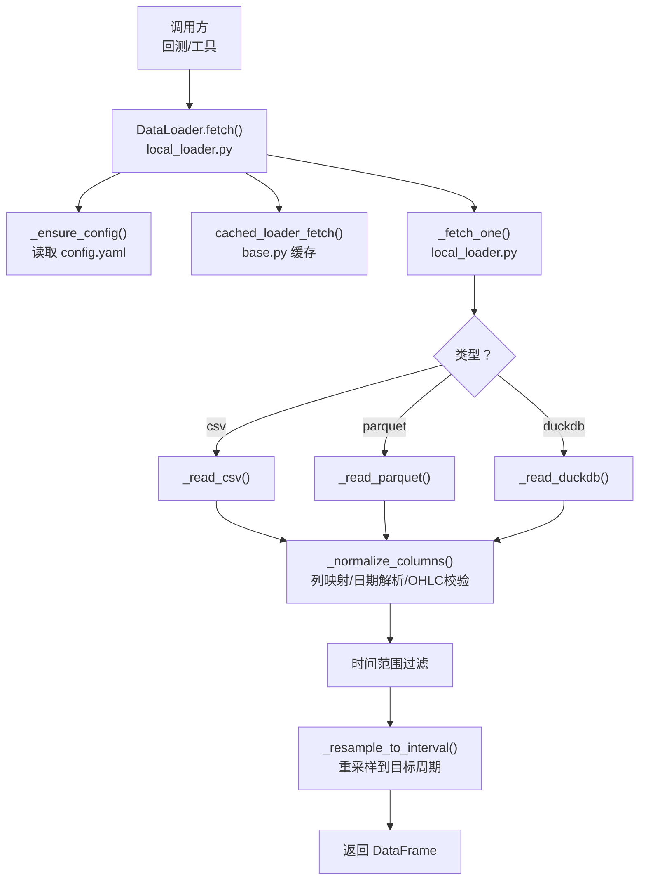
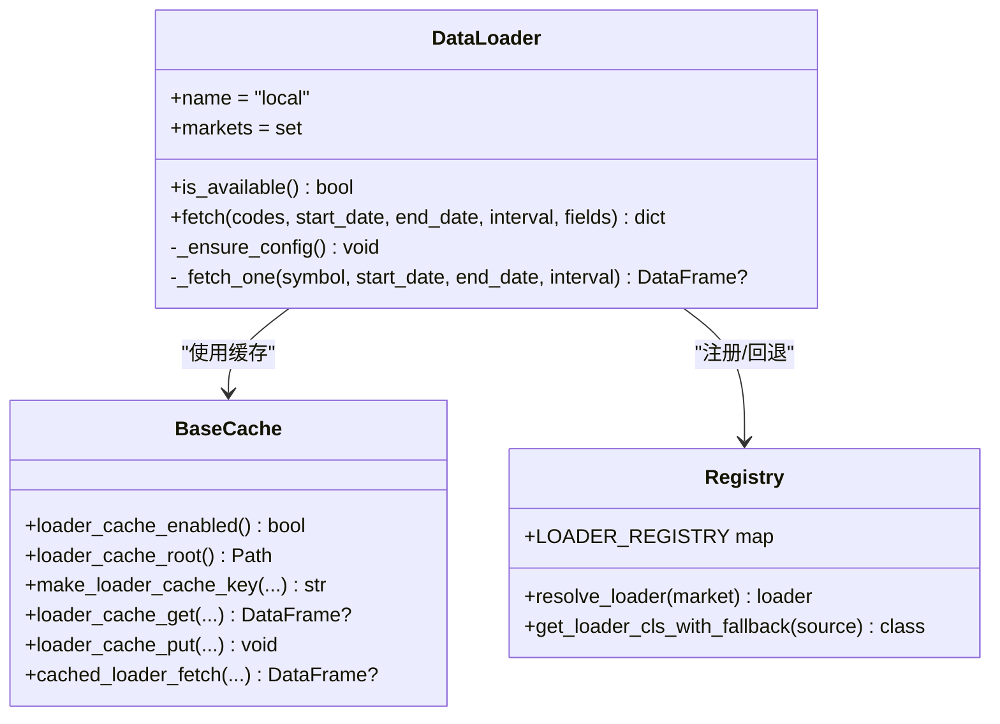
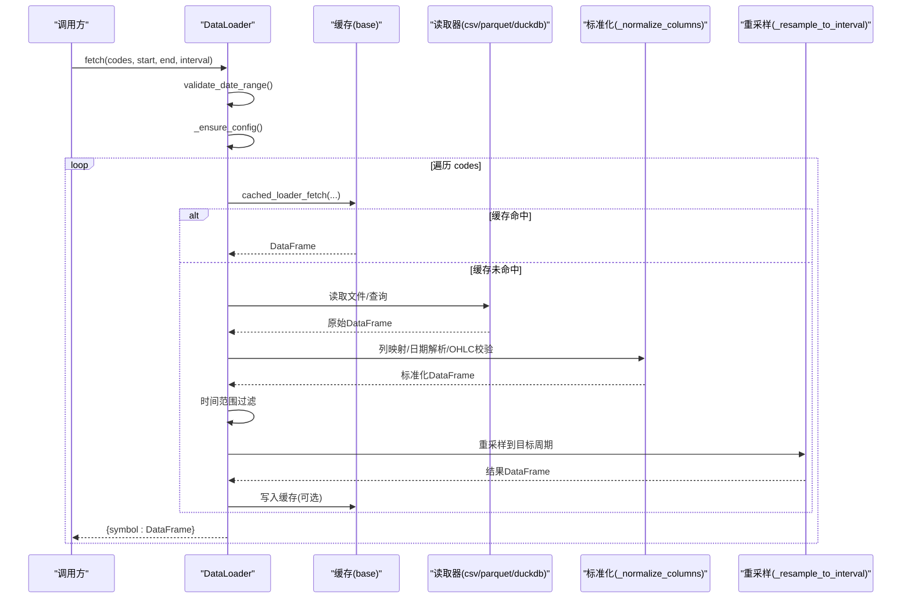
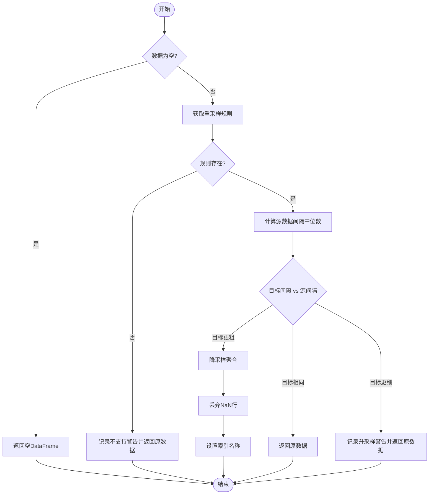
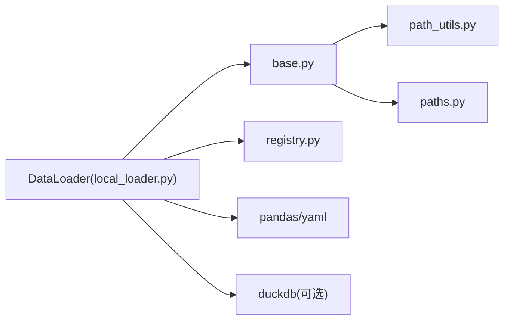

# 本地文件数据加载器

<cite>
**本文引用的文件**
- [local_loader.py](file://agent/backtest/loaders/local_loader.py)
- [base.py](file://agent/backtest/loaders/base.py)
- [registry.py](file://agent/backtest/loaders/registry.py)
- [path_utils.py](file://agent/src/tools/path_utils.py)
- [paths.py](file://agent/src/config/paths.py)
- [test_local_loader.py](file://agent/tests/test_local_loader.py)
</cite>

## 目录
1. [简介](#简介)
2. [项目结构](#项目结构)
3. [核心组件](#核心组件)
4. [架构总览](#架构总览)
5. [详细组件分析](#详细组件分析)
6. [依赖关系分析](#依赖关系分析)
7. [性能考虑](#性能考虑)
8. [故障排查指南](#故障排查指南)
9. [结论](#结论)
10. [附录](#附录)

## 简介
本技术文档面向需要在本地文件系统加载金融数据的用户，覆盖从 CSV、Excel（通过通用读取路径）、Parquet、DuckDB 等格式读取 OHLCV 数据的能力。重点说明：
- 配置文件驱动的数据源注册与解析
- 路径解析机制（相对路径、绝对路径、用户目录展开）与环境变量集成
- 数据格式规范（列名映射、日期解析、时间索引处理、OHLC 校验）
- 批量加载流程（多符号、时间窗口过滤、重采样到目标周期）
- 缓存策略（可选的本地 Parquet 缓存）
- 文件组织建议与最佳实践
- 性能优化技巧（内存管理、并行读取、缓存策略）

该加载器以配置为中心，支持将本地文件作为“本地数据源”，并通过统一的 Data Loader 接口接入回测与数据管道。

## 项目结构
与本地文件数据加载相关的核心代码位于 backtest.loaders 包中，配合全局注册表与基础工具模块：
- local_loader.py：实现本地数据加载器，负责读取 CSV/Parquet/DuckDB，进行列映射、日期解析、时间范围过滤与重采样
- base.py：提供日期校验、OHLC 校验、可选的本地缓存读写、重试与预算控制等通用能力
- registry.py：数据源注册表与按市场类型的回退链，确保“local”可被自动选择或显式指定
- path_utils.py：安全路径解析、UNC 拒绝、允许根目录白名单、用户目录展开等
- paths.py：运行时根目录解析（~/.vibe-trading），支持环境变量覆盖
- test_local_loader.py：覆盖本地加载器的典型用例（CSV、DuckDB、时区、重采样等）

图表来源
- [local_loader.py:271-405](file://agent/backtest/loaders/local_loader.py#L271-L405)
- [base.py:243-441](file://agent/backtest/loaders/base.py#L243-L441)

章节来源
- [local_loader.py:1-354](file://agent/backtest/loaders/local_loader.py#L1-L354)
- [base.py:1-657](file://agent/backtest/loaders/base.py#L1-L657)
- [registry.py:1-256](file://agent/backtest/loaders/registry.py#L1-L256)
- [path_utils.py:46-74](file://agent/src/tools/path_utils.py#L46-L74)
- [paths.py:13-34](file://agent/src/config/paths.py#L13-L34)
- [test_local_loader.py:1-298](file://agent/tests/test_local_loader.py#L1-L298)

## 核心组件
- DataLoader（local_loader.py）
  - 名称：local
  - 支持市场：美股、A股、港股、加密货币、期货、外汇、宏观、基金
  - 入口方法：fetch(codes, start_date, end_date, interval="1D", fields=None)
  - 行为：根据配置为每个 symbol 读取对应文件，标准化为统一 OHLCV 框架，按时间窗口过滤并重采样到目标周期
- 配置加载（local_loader.py）
  - 配置文件路径：~/.vibe-trading/data-bridge/config.yaml
  - 配置项：sources 列表，每项包含 symbol、type（csv/parquet/duckdb）、path/db_path、columns、date_format、query（duckdb）
- 数据读取器（local_loader.py）
  - _read_csv：使用 pandas 读取 CSV
  - _read_parquet：使用 pandas 读取 Parquet，若已有 DatetimeIndex 则重置为列并推断 date 列
  - _read_duckdb：只读连接 DuckDB 执行 SQL 查询
- 列规范化与校验（local_loader.py + base.py）
  - _normalize_columns：列名映射、日期解析、UTC 归一化、数值转换、缺失值处理、OHLC 校验
  - validate_ohlc：结构性校验（high < low 等）与价格非正数处理策略
- 缓存（base.py）
  - 可选的本地 Parquet 缓存，键由 source/symbol/timeframe/start/end/fields 生成
  - 仅对已结算的时间段（end_date 早于今天）写入缓存
  - 读写失败不中断主流程，降级为直接读取
- 注册与回退（registry.py）
  - “local”在多个市场的回退链末尾，避免静默回退到网络源
  - 显式请求“local”不可用时给出明确提示（检查 Data Bridge 配置）

章节来源
- [local_loader.py:51-85](file://agent/backtest/loaders/local_loader.py#L51-L85)
- [local_loader.py:129-216](file://agent/backtest/loaders/local_loader.py#L129-L216)
- [local_loader.py:271-405](file://agent/backtest/loaders/local_loader.py#L271-L405)
- [base.py:168-256](file://agent/backtest/loaders/base.py#L168-L256)
- [base.py:243-441](file://agent/backtest/loaders/base.py#L243-L441)
- [registry.py:119-158](file://agent/backtest/loaders/registry.py#L119-L158)
- [registry.py:161-256](file://agent/backtest/loaders/registry.py#L161-L256)

## 架构总览
本地数据加载器采用“配置驱动 + 统一接口”的架构：
- 配置层：config.yaml 声明各 symbol 对应的数据源与列映射
- 加载层：DataLoader 根据 type 路由到具体读取器
- 标准化层：列映射、日期解析、时间索引归一化、OHLC 校验
- 聚合层：时间范围过滤、重采样到目标周期
- 缓存层：可选的本地 Parquet 缓存，命中则跳过重复读取
- 注册层：通过 @register 装饰器注册到全局注册表，支持按市场回退链选择

图表来源
- [local_loader.py:271-405](file://agent/backtest/loaders/local_loader.py#L271-L405)
- [base.py:243-441](file://agent/backtest/loaders/base.py#L243-L441)
- [registry.py:23-158](file://agent/backtest/loaders/registry.py#L23-L158)

## 详细组件分析

### 配置与数据源注册
- 配置文件位置：~/.vibe-trading/data-bridge/config.yaml
- sources 条目字段：
  - symbol：交易标的标识
  - type：csv / parquet / duckdb
  - path：文件路径（csv/parquet）
  - db_path：DuckDB 数据库路径（duckdb）
  - query：SQL 查询语句（duckdb）
  - columns：列名映射（如 date/open/high/low/close/volume）
  - date_format：日期格式字符串（可选）
- 注册方式：DataLoader 类通过 @register 装饰器加入全局注册表，可在 auto 模式下被选择或在回退链中被尝试

章节来源
- [local_loader.py:1-30](file://agent/backtest/loaders/local_loader.py#L1-L30)
- [local_loader.py:51-85](file://agent/backtest/loaders/local_loader.py#L51-L85)
- [registry.py:63-117](file://agent/backtest/loaders/registry.py#L63-L117)
- [registry.py:119-158](file://agent/backtest/loaders/registry.py#L119-L158)

### 路径解析机制
- 用户目录展开：Path.expanduser() 支持 ~ 展开（例如 ~/data/aapl.csv）
- 绝对/相对路径：
  - 绝对路径直接使用
  - 相对路径相对于当前工作目录解析
- 安全限制：
  - 拒绝 UNC 路径（\\server\share 或 //server/share）
  - 可通过允许的根目录白名单控制访问范围（path_utils）
- 运行时根目录：
  - 默认 ~/.vibe-trading，可通过 VIBE_TRADING_HOME 环境变量覆盖
  - 当提供显式配置文件路径时，运行时根为该配置文件所在目录

章节来源
- [local_loader.py:374-389](file://agent/backtest/loaders/local_loader.py#L374-L389)
- [path_utils.py:46-74](file://agent/src/tools/path_utils.py#L46-L74)
- [path_utils.py:185-230](file://agent/src/tools/path_utils.py#L185-L230)
- [paths.py:13-34](file://agent/src/config/paths.py#L13-L34)

### 数据格式规范
- 列名映射：
  - 默认标准列：date/open/high/low/close/volume
  - 可通过 columns 自定义原始列名到标准列名的映射
- 日期解析：
  - 支持指定 date_format；未指定时自动解析
  - 解析后转换为 UTC 再转为无时区索引，保证跨时区一致性
- 数据类型转换：
  - open/high/low/close/volume 强制转换为 float64
  - 缺失值与非法值会被丢弃
- OHLC 校验：
  - 结构性校验：high >= low，且 high/low 需包围 open/close
  - 价格非正数策略：默认拒绝 <= 0 的价格；可配置允许负价但拒绝零价
- 时间索引：
  - 最终索引为 trade_date（DatetimeIndex），排序后用于时间范围过滤与重采样

章节来源
- [local_loader.py:141-189](file://agent/backtest/loaders/local_loader.py#L141-L189)
- [base.py:168-184](file://agent/backtest/loaders/base.py#L168-L184)
- [base.py:187-256](file://agent/backtest/loaders/base.py#L187-L256)

### 批量加载流程
- 输入：codes（可带 local: 前缀）、start_date、end_date、interval
- 流程：
  - 验证日期范围（start <= end）
  - 确保配置已加载并构建 symbol -> 配置项映射
  - 对每个 code：
    - 解析 symbol（去除 local: 前缀）
    - 根据 type 选择读取器
    - 读取数据并进行列映射与标准化
    - 时间范围过滤（含当天边界处理，确保日内数据不被截断）
    - 重采样到目标周期（降采样聚合，升采样无法实现则警告并返回原数据）
    - 通过缓存包装减少重复读取
  - 返回 {symbol: DataFrame} 映射

图表来源
- [local_loader.py:301-405](file://agent/backtest/loaders/local_loader.py#L301-L405)
- [base.py:623-661](file://agent/backtest/loaders/base.py#L623-L661)

章节来源
- [local_loader.py:301-405](file://agent/backtest/loaders/local_loader.py#L301-L405)
- [base.py:623-661](file://agent/backtest/loaders/base.py#L623-L661)

### Excel 支持与数据合并
- Excel 读取：
  - 当前本地加载器未内置 Excel 专用读取器；可通过通用读取路径（pandas.read_excel）扩展
  - 建议在配置中增加 type: excel 并实现 _read_excel 函数，复用 _normalize_columns 完成标准化
- 多文件合并：
  - 当前实现按 symbol 一对一映射；如需多文件合并，可在配置层拆分多个 entry 并在上层聚合
  - 或使用 DuckDB 视图/CTE 将多个文件注册为表后统一查询
- 增量更新：
  - 通过时间范围过滤与重采样实现增量拉取；结合缓存可减少重复计算
- 数据去重：
  - 标准化阶段会丢弃 NaN 与无效行；如需业务级去重，可在外部预处理或扩展 _normalize_columns

章节来源
- [local_loader.py:187-216](file://agent/backtest/loaders/local_loader.py#L187-L216)
- [local_loader.py:141-189](file://agent/backtest/loaders/local_loader.py#L141-L189)

### 时间索引与重采样
- 时间索引：
  - 解析后的日期转换为 UTC 再转为无时区索引，避免 DST 切换导致的问题
- 重采样规则：
  - 支持 1m/5m/15m/30m/1H/4H/1D 等常见周期
  - 降采样：按 OHLCV 聚合（open=first, high=max, low=min, close=last, volume=sum）
  - 升采样：无法伪造更细粒度数据，记录警告并返回原数据
  - 匹配源粒度：直接返回

图表来源
- [local_loader.py:88-131](file://agent/backtest/loaders/local_loader.py#L88-L131)

章节来源
- [local_loader.py:88-131](file://agent/backtest/loaders/local_loader.py#L88-L131)

## 依赖关系分析
- DataLoader 依赖：
  - base：日期校验、OHLC 校验、缓存
  - registry：注册与回退链
  - pandas/yaml：数据处理与配置解析
  - duckdb（可选）：DuckDB 查询
- 路径与安全：
  - path_utils：安全路径解析、UNC 拒绝、允许根白名单
  - paths：运行时根目录解析与环境变量覆盖

图表来源
- [local_loader.py:34-42](file://agent/backtest/loaders/local_loader.py#L34-L42)
- [base.py:12-23](file://agent/backtest/loaders/base.py#L12-L23)
- [registry.py:12-16](file://agent/backtest/loaders/registry.py#L12-L16)
- [path_utils.py:46-74](file://agent/src/tools/path_utils.py#L46-L74)
- [paths.py:13-34](file://agent/src/config/paths.py#L13-L34)

章节来源
- [local_loader.py:34-42](file://agent/backtest/loaders/local_loader.py#L34-L42)
- [base.py:12-23](file://agent/backtest/loaders/base.py#L12-L23)
- [registry.py:12-16](file://agent/backtest/loaders/registry.py#L12-L16)

## 性能考虑
- 内存管理：
  - 使用 pandas 逐文件读取，避免一次性加载超大文件
  - 标准化阶段及时丢弃无效行，减少后续计算开销
- 并行读取：
  - 当前实现为串行循环；可在上层对多 symbol 并行调用 fetch，注意 I/O 与 CPU 资源平衡
- 缓存策略：
  - 启用本地缓存（VIBE_TRADING_DATA_CACHE=true）可显著减少重复读取
  - 缓存键包含 timeframe/start/end/fields，确保不同查询独立缓存
  - 仅对已结算时间段写入缓存，避免缓存未完成数据
- 重采样优化：
  - 降采样使用向量化聚合，效率高
  - 升采样直接返回原数据，避免无效计算
- 磁盘 I/O：
  - 使用 Parquet 格式存储中间数据可获得更好的压缩与读取性能
  - DuckDB 适合复杂查询与大数据集

章节来源
- [base.py:243-441](file://agent/backtest/loaders/base.py#L243-L441)
- [local_loader.py:88-131](file://agent/backtest/loaders/local_loader.py#L88-L131)
- [local_loader.py:187-216](file://agent/backtest/loaders/local_loader.py#L187-L216)

## 故障排查指南
- 配置问题：
  - 检查 config.yaml 是否存在且包含 sources 列表
  - 确认 symbol、type、path/db_path 等必填字段正确
- 路径问题：
  - 使用 ~ 展开用户目录
  - 避免 UNC 路径
  - 确保路径在允许根目录内
- 数据问题：
  - 列名映射错误会导致标准化失败
  - 日期格式不匹配会导致解析失败
  - OHLC 校验失败会丢弃无效行
- 时间问题：
  - 时区感知时间会被转换为无时区索引
  - 时间范围过滤需确保 start <= end
- 缓存问题：
  - 缓存未命中可能因 end_date 未结算或缓存禁用
  - 缓存损坏会降级为直接读取

章节来源
- [local_loader.py:134-138](file://agent/backtest/loaders/local_loader.py#L134-L138)
- [local_loader.py:141-189](file://agent/backtest/loaders/local_loader.py#L141-L189)
- [base.py:168-184](file://agent/backtest/loaders/base.py#L168-L184)
- [base.py:550-562](file://agent/backtest/loaders/base.py#L550-L562)
- [path_utils.py:46-74](file://agent/src/tools/path_utils.py#L46-L74)

## 结论
本地文件数据加载器提供了灵活、可扩展的本地数据接入方案，支持多种文件格式与配置驱动的数据源管理。通过标准化的列映射、日期解析、OHLC 校验与重采样，确保了数据的一致性与可用性。结合可选的本地缓存与安全的路径解析机制，为用户提供了高效、可靠的本地数据存储解决方案。建议在生产环境中合理组织文件结构、命名约定与版本管理，并结合缓存策略与并行读取优化性能。

## 附录
- 配置示例：
  - CSV：定义 symbol、type、path、columns、date_format
  - Parquet：定义 symbol、type、path
  - DuckDB：定义 symbol、type、db_path、query
- 测试用例参考：
  - CSV 读取与本地前缀处理
  - 日内数据重采样到更高周期
  - 升采样警告与保留原数据
  - DuckDB 查询与时间范围过滤
  - 时区感知时间与 DST 处理

章节来源
- [test_local_loader.py:22-63](file://agent/tests/test_local_loader.py#L22-L63)
- [test_local_loader.py:100-124](file://agent/tests/test_local_loader.py#L100-L124)
- [test_local_loader.py:126-170](file://agent/tests/test_local_loader.py#L126-L170)
- [test_local_loader.py:173-205](file://agent/tests/test_local_loader.py#L173-L205)
- [test_local_loader.py:208-298](file://agent/tests/test_local_loader.py#L208-L298)