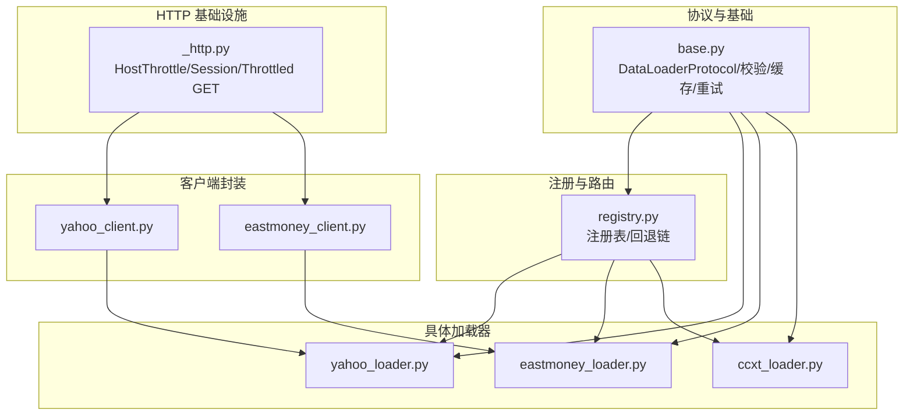
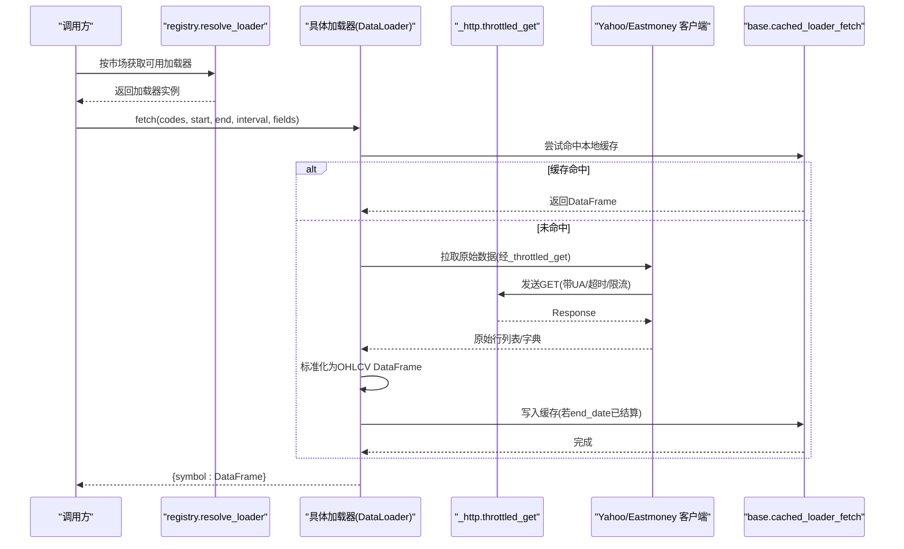
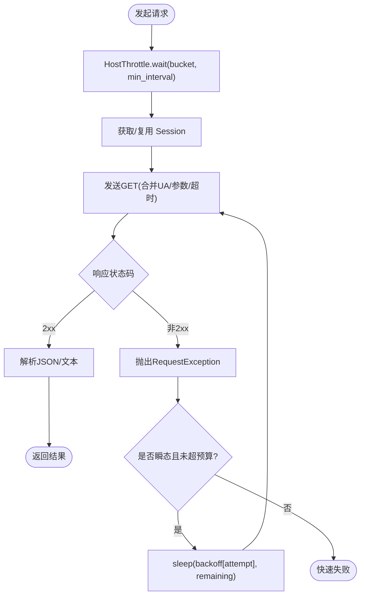
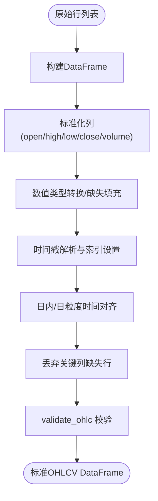
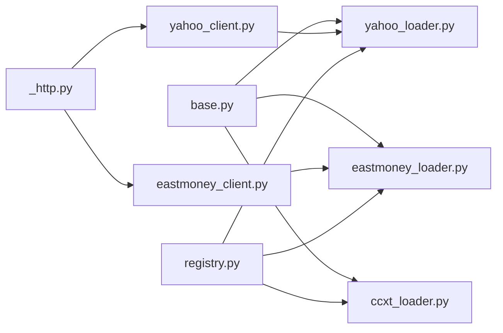

# 加载器架构设计

<cite>
**本文引用的文件**
- [base.py](file://agent/backtest/loaders/base.py)
- [_http.py](file://agent/backtest/loaders/_http.py)
- [_symbol_utils.py](file://agent/backtest/loaders/_symbol_utils.py)
- [registry.py](file://agent/backtest/loaders/registry.py)
- [yahoo_loader.py](file://agent/backtest/loaders/yahoo_loader.py)
- [eastmoney_loader.py](file://agent/backtest/loaders/eastmoney_loader.py)
- [ccxt_loader.py](file://agent/backtest/loaders/ccxt_loader.py)
- [yahoo_client.py](file://agent/backtest/loaders/yahoo_client.py)
- [eastmoney_client.py](file://agent/backtest/loaders/eastmoney_client.py)
</cite>

## 目录
1. [简介](#简介)
2. [项目结构](#项目结构)
3. [核心组件](#核心组件)
4. [架构总览](#架构总览)
5. [详细组件分析](#详细组件分析)
6. [依赖关系分析](#依赖关系分析)
7. [性能考量](#性能考量)
8. [故障排查指南](#故障排查指南)
9. [结论](#结论)
10. [附录](#附录)

## 简介
本技术文档聚焦于数据加载器子系统的设计与实现，围绕以下目标展开：
- 解释 BaseLoader 抽象接口（DataLoaderProtocol）的设计模式、核心方法规范与生命周期管理。
- 说明 HTTP 客户端封装的通用能力：请求重试、超时处理、连接池与限流。
- 文档化符号工具函数：股票代码标准化、市场识别、格式转换等。
- 阐述数据标准化流程：OHLCV 统一格式、时间戳处理、缺失值与异常值处理。
- 给出扩展点说明：自定义字段映射、数据清洗规则、性能优化钩子。
- 提供架构图与代码级流程图，帮助开发者理解整体设计思路。

## 项目结构
数据加载器子系统位于 agent/backtest/loaders 目录下，采用“协议 + 注册表 + 具体加载器 + 共享基础设施”的分层组织方式：
- 协议与基础能力：base.py 定义 DataLoaderProtocol、校验与缓存、重试预算等。
- HTTP 基础设施：_http.py 提供进程内按主机桶限流、会话复用、JSON/CSV GET 封装。
- 符号工具：_symbol_utils.py 提供 ETF/LOF 前缀识别等辅助函数。
- 注册与回退：registry.py 维护全局注册表、市场到加载器的回退链。
- 具体加载器：如 yahoo_loader、eastmoney_loader、ccxt_loader 等，各自负责特定数据源适配。
- 客户端封装：yahoo_client、eastmoney_client 等，屏蔽第三方 API 细节并复用 _http。



**图表来源**
- [base.py:122-237](file://agent/backtest/loaders/base.py#L122-L237)
- [_http.py:46-173](file://agent/backtest/loaders/_http.py#L46-L173)
- [registry.py:139-196](file://agent/backtest/loaders/registry.py#L139-L196)
- [yahoo_client.py:156-200](file://agent/backtest/loaders/yahoo_client.py#L156-L200)
- [eastmoney_client.py:112-133](file://agent/backtest/loaders/eastmoney_client.py#L112-L133)
- [yahoo_loader.py:173-200](file://agent/backtest/loaders/yahoo_loader.py#L173-L200)
- [eastmoney_loader.py:51-116](file://agent/backtest/loaders/eastmoney_loader.py#L51-L116)
- [ccxt_loader.py:184-200](file://agent/backtest/loaders/ccxt_loader.py#L184-L200)

**章节来源**
- [base.py:1-237](file://agent/backtest/loaders/base.py#L1-L237)
- [_http.py:1-173](file://agent/backtest/loaders/_http.py#L1-L173)
- [registry.py:1-196](file://agent/backtest/loaders/registry.py#L1-L196)

## 核心组件
- DataLoaderProtocol（抽象接口）
  - 声明 name、markets、requires_auth 等类属性。
  - 定义 is_available() 与 fetch(codes, start_date, end_date, interval, fields) 契约，返回 {symbol: DataFrame}。
  - 约定 volume_units 可选属性，用于声明不同市场的成交量单位（如 lots/shares）。
- 校验与清理
  - validate_date_range：校验起止日期合法性与顺序。
  - validate_ohlc：对 OHLC 不变量进行结构性校验（high/low 与 open/close 的区间关系），支持 drop/warn/raise 策略；可配置是否允许非正价格。
- 重试与预算
  - check_budget：基于单调时钟检查是否超过截止时间，快速失败。
  - retry_with_budget：对声明的瞬态异常进行有界重试，结合 backoff 与剩余预算控制。
- 本地缓存
  - loader_cache_enabled/root/path/get/put/cached_loader_fetch：以内容寻址的 parquet 缓存，仅对已结算的 end_date 生效；读写失败不阻塞主流程。
- HTTP 限流与会话
  - HostThrottle：按 host_key 维度保证最小请求间隔，带抖动避免并发同步。
  - throttled_get/throttled_get_json：复用 requests.Session，合并默认 UA，统一超时与错误传播。
- 注册与回退
  - register：装饰器将加载器类注册到全局 LOADER_REGISTRY。
  - FALLBACK_CHAINS：按市场类型定义加载器优先级链。
  - resolve_loader/get_loader_cls_with_fallback：按市场或显式 source 解析可用加载器，必要时回退。

**章节来源**
- [base.py:164-256](file://agent/backtest/loaders/base.py#L164-L256)
- [base.py:122-237](file://agent/backtest/loaders/base.py#L122-L237)
- [base.py:243-441](file://agent/backtest/loaders/base.py#L243-L441)
- [_http.py:46-173](file://agent/backtest/loaders/_http.py#L46-L173)
- [registry.py:63-117](file://agent/backtest/loaders/registry.py#L63-L117)
- [registry.py:139-196](file://agent/backtest/loaders/registry.py#L139-L196)

## 架构总览
加载器子系统通过统一的 DataLoaderProtocol 抽象，屏蔽多数据源的差异；registry 负责按市场选择最合适的加载器；_http 提供跨加载器的限流与会话复用；各 loader 专注于符号映射、字段对齐与 OHLCV 标准化。



**图表来源**
- [registry.py:614-649](file://agent/backtest/loaders/registry.py#L614-L649)
- [_http.py:141-173](file://agent/backtest/loaders/_http.py#L141-L173)
- [yahoo_client.py:156-200](file://agent/backtest/loaders/yahoo_client.py#L156-L200)
- [eastmoney_client.py:112-133](file://agent/backtest/loaders/eastmoney_client.py#L112-L133)
- [base.py:623-661](file://agent/backtest/loaders/base.py#L623-L661)

## 详细组件分析

### DataLoaderProtocol 与基类模式
- 抽象接口
  - name/markets/requires_auth：描述加载器标识、支持的市场集合、是否需要认证。
  - is_available：判断当前环境是否可用（网络、凭据、依赖）。
  - fetch：统一输入输出契约，返回 {symbol: DataFrame}，DataFrame 索引为 trade_date，列包含 open/high/low/close/volume。
- 生命周期
  - 构造阶段：加载器通常无状态或持有轻量配置；is_available 在构造后执行可用性探测。
  - 运行阶段：fetch 内部使用 cached_loader_fetch 包裹实际拉取逻辑，优先读缓存，再落盘。
  - 资源释放：requests.Session 由 _http 模块进程内复用，无需显式关闭。

```mermaid
classDiagram
class DataLoaderProtocol {
+string name
+set markets
+bool requires_auth
+is_available() bool
+fetch(codes, start_date, end_date, interval, fields) dict
}
class YahooLoader {
+name = "yahoo"
+markets = {...}
+volume_units = {...}
+is_available() bool
+fetch(...)
}
class EastmoneyLoader {
+name = "eastmoney"
+markets = {...}
+volume_units = {...}
+is_available() bool
+fetch(...)
}
class CCXTLoader {
+name = "ccxt"
+markets = {"crypto"}
+is_available() bool
+fetch(...)
}
DataLoaderProtocol <|.. YahooLoader
DataLoaderProtocol <|.. EastmoneyLoader
DataLoaderProtocol <|.. CCXTLoader
```

**图表来源**
- [base.py:851-887](file://agent/backtest/loaders/base.py#L851-L887)
- [yahoo_loader.py:173-200](file://agent/backtest/loaders/yahoo_loader.py#L173-L200)
- [eastmoney_loader.py:51-116](file://agent/backtest/loaders/eastmoney_loader.py#L51-L116)
- [ccxt_loader.py:184-200](file://agent/backtest/loaders/ccxt_loader.py#L184-L200)

**章节来源**
- [base.py:851-887](file://agent/backtest/loaders/base.py#L851-L887)

### HTTP 客户端封装（重试、超时、连接池）
- 限流与去抖
  - HostThrottle 按 host_key 维护最近一次触发时间与最小间隔，加入随机抖动避免并发同步。
  - 定期清理过期 bucket，防止长进程中内存增长。
- 会话复用
  - 每个 host_key 对应一个 requests.Session，复用 TCP/TLS 握手成本，隔离 cookie 与连接池。
- 统一 GET/JSON
  - throttled_get 合并默认 User-Agent，支持 params/headers/timeout。
  - throttled_get_json 自动 raise_for_status 并解析 JSON。
- 重试与预算
  - base.retry_with_budget 对瞬态异常进行有界重试，结合 backoff 与 deadline 快速失败。
  - base.check_budget 在分页/循环中周期性检查预算，避免长时间挂起。



**图表来源**
- [_http.py:46-173](file://agent/backtest/loaders/_http.py#L46-L173)
- [base.py:377-450](file://agent/backtest/loaders/base.py#L377-L450)

**章节来源**
- [_http.py:1-201](file://agent/backtest/loaders/_http.py#L1-L201)
- [base.py:122-237](file://agent/backtest/loaders/base.py#L122-L237)

### 符号工具函数（标准化、市场识别、格式转换）
- ETF/LOF 前缀识别
  - _is_etf_listed：根据交易所后缀与六位数字前缀识别上市 ETF/LOF。
- Yahoo 符号映射
  - map_symbol：将 Vibe-Trading 符号映射为 Yahoo 约定（如 .US 去掉后缀、.HK 去除前导零等）。
- Eastmoney secid 解析
  - resolve_secid：将 A/HK/US 代码转换为 Eastmoney 的 secid（含 US 搜索缓存）。
- 区间映射
  - Yahoo/CCXT/Eastmoney 各自维护 interval -> provider 区间的映射，确保粒度一致。

**章节来源**
- [_symbol_utils.py:1-21](file://agent/backtest/loaders/_symbol_utils.py#L1-L21)
- [yahoo_client.py:71-93](file://agent/backtest/loaders/yahoo_client.py#L71-L93)
- [eastmoney_client.py:136-231](file://agent/backtest/loaders/eastmoney_client.py#L136-L231)
- [yahoo_loader.py:31-73](file://agent/backtest/loaders/yahoo_loader.py#L31-L73)
- [ccxt_loader.py:32-48](file://agent/backtest/loaders/ccxt_loader.py#L32-L48)

### 数据标准化流程（OHLCV、时间戳、缺失值）
- 统一列名与类型
  - 各 loader 将原始行转为 DataFrame，补齐 open/high/low/close/volume，强制数值类型，缺失值填充或丢弃。
- 时间戳处理
  - Yahoo：trade_date 为 epoch 秒，转为 tz-naive DatetimeIndex；日及以上粒度归一化至午夜对齐。
  - Eastmoney：直接解析日期列并排序。
  - CCXT：按 timeframe 计算时间步长，对齐索引。
- 缺失值与异常值
  - 先 dropna 缺失关键列的行，再调用 validate_ohlc 进行结构性校验（high/low 与 open/close 的关系、非正价格策略）。
- 缓存友好
  - 仅对 end_date 已结算的数据写入缓存，避免缓存未完成日期的中间态。



**图表来源**
- [yahoo_loader.py:139-184](file://agent/backtest/loaders/yahoo_loader.py#L139-L184)
- [eastmoney_loader.py:151-183](file://agent/backtest/loaders/eastmoney_loader.py#L151-L183)
- [base.py:187-256](file://agent/backtest/loaders/base.py#L187-L256)

**章节来源**
- [yahoo_loader.py:139-184](file://agent/backtest/loaders/yahoo_loader.py#L139-L184)
- [eastmoney_loader.py:151-183](file://agent/backtest/loaders/eastmoney_loader.py#L151-L183)
- [base.py:187-256](file://agent/backtest/loaders/base.py#L187-L256)

### 扩展点说明
- 自定义字段映射
  - 在各 loader 的 _frame_from_rows / _rows_to_frame 中实现 provider 字段到 OHLCV 的映射。
  - 通过 volume_units 声明不同市场的成交量单位，供上层消费时做单位换算。
- 数据清洗规则
  - 在 fetch 末尾统一调用 validate_ohlc，可选择 drop/warn/raise 策略；allow_nonpositive_prices 控制负价格容忍度。
- 性能优化钩子
  - 使用 cached_loader_fetch 启用本地 parquet 缓存，减少重复请求。
  - 通过环境变量调整最小请求间隔（如 VIBE_TRADING_YAHOO_MIN_INTERVAL、VIBE_TRADING_EASTMONEY_MIN_INTERVAL）。
  - 使用 retry_with_budget/check_budget 限制单次 fetch 的总耗时与重试次数。
  - 利用 HostThrottle 的 host_key 隔离不同提供商的请求节奏。

**章节来源**
- [base.py:243-441](file://agent/backtest/loaders/base.py#L243-L441)
- [base.py:187-256](file://agent/backtest/loaders/base.py#L187-L256)
- [_http.py:127-139](file://agent/backtest/loaders/_http.py#L127-L139)
- [yahoo_loader.py:173-200](file://agent/backtest/loaders/yahoo_loader.py#L173-L200)
- [eastmoney_loader.py:51-116](file://agent/backtest/loaders/eastmoney_loader.py#L51-L116)

## 依赖关系分析
- 耦合与内聚
  - base 提供协议与通用能力，被所有 loader 依赖，内聚度高。
  - _http 作为横切关注点，被多个 client/loader 复用，降低重复实现。
  - registry 集中管理加载器发现与回退，解耦具体 provider。
- 直接/间接依赖
  - loader -> base（校验/缓存/重试）、loader -> _http（限流/会话）、loader -> client（provider 细节）。
  - client -> _http（统一 HTTP 行为）。
- 外部依赖
  - requests、pandas、duckdb（缓存读写）、ccxt（加密资产）。
- 潜在循环依赖
  - 当前分层清晰，未见循环导入；registry 通过 importlib 延迟导入各 loader 模块，避免启动时强耦合。



**图表来源**
- [base.py:122-237](file://agent/backtest/loaders/base.py#L122-L237)
- [_http.py:141-173](file://agent/backtest/loaders/_http.py#L141-L173)
- [registry.py:72-117](file://agent/backtest/loaders/registry.py#L72-L117)
- [yahoo_client.py:35-40](file://agent/backtest/loaders/yahoo_client.py#L35-L40)
- [eastmoney_client.py:28-29](file://agent/backtest/loaders/eastmoney_client.py#L28-L29)

**章节来源**
- [registry.py:72-117](file://agent/backtest/loaders/registry.py#L72-L117)
- [yahoo_client.py:35-40](file://agent/backtest/loaders/yahoo_client.py#L35-L40)
- [eastmoney_client.py:28-29](file://agent/backtest/loaders/eastmoney_client.py#L28-L29)

## 性能考量
- 请求节流与连接复用
  - 通过 HostThrottle 与 requests.Session 复用，显著降低连接开销与 IP 封禁风险。
- 本地缓存
  - 使用 parquet 存储与 duckdb 读取，提升冷启动与重复查询性能；仅缓存已结算范围。
- 重试与预算
  - 有界重试与截止时间检查，避免长时间阻塞；backoff 缓解瞬时拥塞。
- 时间对齐
  - 日粒度统一午夜对齐，减少后续合并/去重成本。
- 可扩展性
  - 新增 provider 仅需实现 DataLoaderProtocol，并通过 @register 注册；回退链可灵活调整。

[本节为通用指导，不直接分析具体文件]

## 故障排查指南
- 常见错误与定位
  - NoAvailableSourceError：指定市场无可用的加载器，检查网络、凭据与回退链。
  - TimeoutError：超出预算或重试耗尽，检查 CCXT_FETCH_BUDGET_S、CCXT_TIMEOUT_MS 及 provider 限流。
  - ValueError：日期无效或 OHLC 不变量违规，检查 validate_date_range 与 validate_ohlc 策略。
- 调试建议
  - 开启日志观察 HostThrottle 等待与重试过程。
  - 检查本地缓存路径与元数据是否损坏（cache read/write 失败会降级到在线拉取）。
  - 针对 Yahoo/Eastmoney 等免费源，适当增大最小请求间隔以避免临时封禁。

**章节来源**
- [registry.py:614-649](file://agent/backtest/loaders/registry.py#L614-L649)
- [base.py:377-450](file://agent/backtest/loaders/base.py#L377-L450)
- [base.py:187-256](file://agent/backtest/loaders/base.py#L187-L256)
- [_http.py:141-173](file://agent/backtest/loaders/_http.py#L141-L173)

## 结论
该加载器架构通过清晰的协议抽象、统一的 HTTP 基础设施、健壮的缓存与重试机制，以及灵活的注册与回退策略，实现了多数据源的高内聚、低耦合接入。开发者只需遵循 DataLoaderProtocol 并实现必要的字段映射与标准化逻辑，即可快速接入新的数据源，同时享受系统级的限流、缓存与容错保障。

[本节为总结性内容，不直接分析具体文件]

## 附录
- 环境变量参考
  - VIBE_TRADING_DATA_CACHE：是否启用本地缓存。
  - VIBE_TRADING_DATA_CACHE_ROOT：缓存根目录。
  - VIBE_TRADING_YAHOO_MIN_INTERVAL：Yahoo 最小请求间隔。
  - VIBE_TRADING_EASTMONEY_MIN_INTERVAL：Eastmoney 最小请求间隔。
  - CCXT_TIMEOUT_MS、CCXT_FETCH_BUDGET_S：CCXT 超时与预算。
- 最佳实践
  - 在 fetch 末尾统一调用 validate_ohlc，确保下游引擎稳定性。
  - 合理设置 volume_units，避免单位不一致导致的指标偏差。
  - 使用 cached_loader_fetch 减少重复请求，提高批处理效率。
  - 通过回退链组合多个 provider，提升鲁棒性与覆盖率。

[本节为补充信息，不直接分析具体文件]