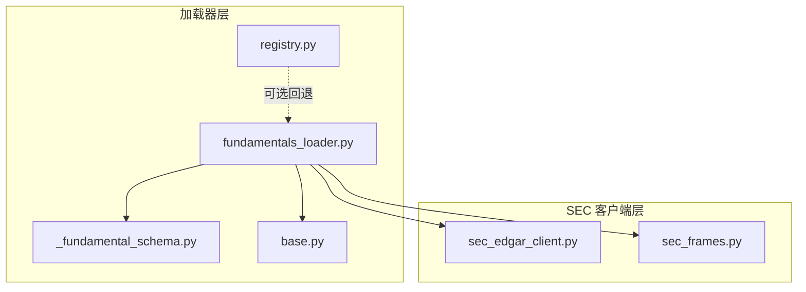
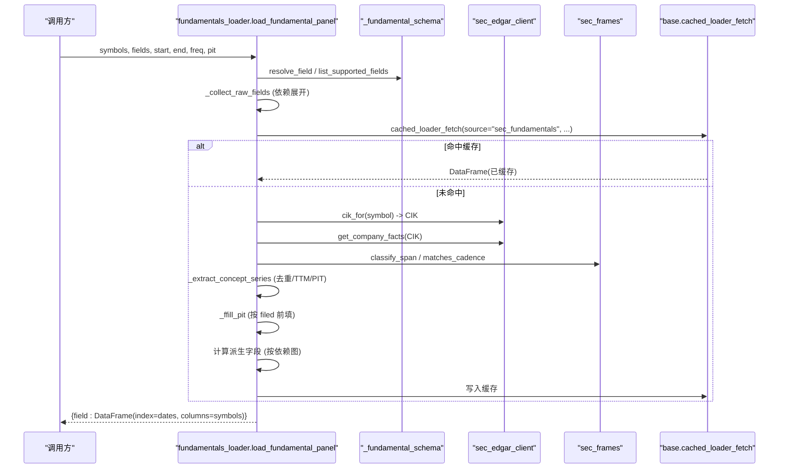
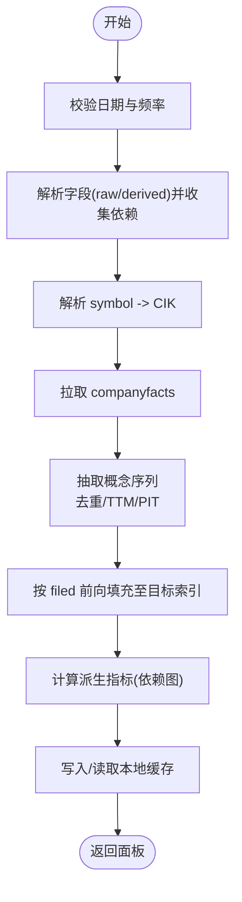
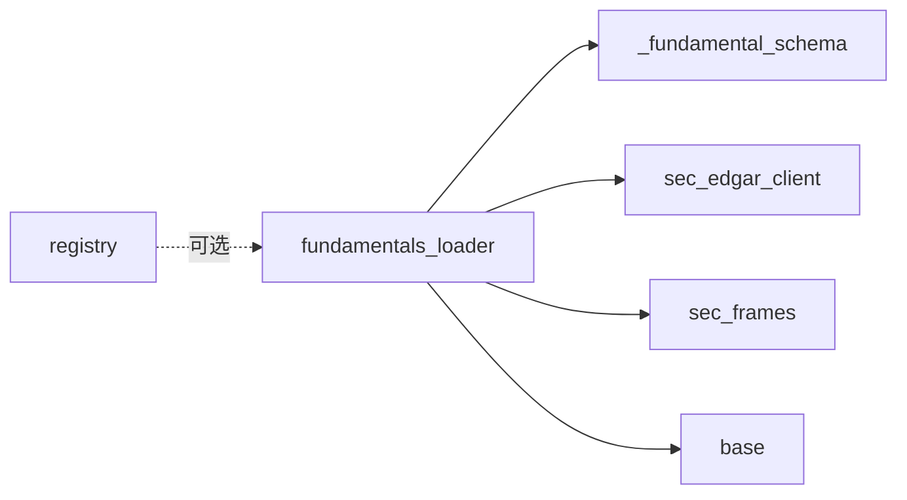

# 基本面数据加载器

<cite>
**本文引用的文件**
- [agent/backtest/loaders/_fundamental_schema.py](file://agent/backtest/loaders/_fundamental_schema.py)
- [agent/backtest/loaders/fundamentals_loader.py](file://agent/backtest/loaders/fundamentals_loader.py)
- [agent/backtest/loaders/sec_edgar_client.py](file://agent/backtest/loaders/sec_edgar_client.py)
- [agent/backtest/loaders/sec_frames.py](file://agent/backtest/loaders/sec_frames.py)
- [agent/backtest/loaders/base.py](file://agent/backtest/loaders/base.py)
- [agent/backtest/loaders/registry.py](file://agent/backtest/loaders/registry.py)
- [agent/tests/test_fundamental_schema.py](file://agent/tests/test_fundamental_schema.py)
- [agent/tests/test_get_fundamentals_tool.py](file://agent/tests/test_get_fundamentals_tool.py)
</cite>

## 目录
1. [简介](#简介)
2. [项目结构](#项目结构)
3. [核心组件](#核心组件)
4. [架构总览](#架构总览)
5. [详细组件分析](#详细组件分析)
6. [依赖关系分析](#依赖关系分析)
7. [性能与更新策略](#性能与更新策略)
8. [数据质量保障](#数据质量保障)
9. [使用示例与分析模板](#使用示例与分析模板)
10. [故障排查指南](#故障排查指南)
11. [结论](#结论)

## 简介
本技术文档面向金融数据工程师与量化分析师，系统化说明“基本面数据加载器”的设计与实现。重点覆盖：
- 财务数据模型：资产负债表、利润表、现金流量表的标准化字段与派生指标
- 数据获取流程：SEC XBRL 公司事实（companyfacts）拉取、清洗、去重、TTM 滚动、PIT 对齐
- 指标计算：盈利能力、偿债能力、运营效率等关键比率
- 更新策略：定期同步、增量更新、异常检测与容错
- 数据质量：完整性检查、一致性验证、缺失值处理
- 使用示例与分析模板：帮助快速上手并落地到因子构建与回测

## 项目结构
本项目将基本面数据加载逻辑集中在 backtest/loaders 子模块中，采用“协议 + 注册表 + 专用加载器”的分层设计：
- 基础协议与缓存：base.py 提供 DataLoaderProtocol、重试/预算、本地 Parquet 缓存等通用能力
- 注册与回退：registry.py 维护市场级回退链与加载器注册机制
- SEC 客户端：sec_edgar_client.py 封装 SEC EDGAR REST API（ticker->CIK、submissions、companyfacts），带节流与 UA 合规
- 周期帧选择：sec_frames.py 定义季度/年度/YTD/瞬时事实的识别规则
- 统一字段模式：_fundamental_schema.py 定义 RAW_FIELDS、DERIVED_FIELDS、SEC_CONCEPT_MAP 及解析工具
- 加载器主流程：fundamentals_loader.py 串联上述模块，输出 PIT-safe 的日频面板

图表来源
- [agent/backtest/loaders/fundamentals_loader.py:196-277](file://agent/backtest/loaders/fundamentals_loader.py#L196-L277)
- [agent/backtest/loaders/_fundamental_schema.py:28-189](file://agent/backtest/loaders/_fundamental_schema.py#L28-L189)
- [agent/backtest/loaders/sec_edgar_client.py:166-227](file://agent/backtest/loaders/sec_edgar_client.py#L166-L227)
- [agent/backtest/loaders/sec_frames.py:42-129](file://agent/backtest/loaders/sec_frames.py#L42-L129)
- [agent/backtest/loaders/base.py:168-256](file://agent/backtest/loaders/base.py#L168-L256)
- [agent/backtest/loaders/registry.py:139-158](file://agent/backtest/loaders/registry.py#L139-L158)

章节来源
- [agent/backtest/loaders/fundamentals_loader.py:196-277](file://agent/backtest/loaders/fundamentals_loader.py#L196-L277)
- [agent/backtest/loaders/_fundamental_schema.py:28-189](file://agent/backtest/loaders/_fundamental_schema.py#L28-L189)
- [agent/backtest/loaders/sec_edgar_client.py:166-227](file://agent/backtest/loaders/sec_edgar_client.py#L166-L227)
- [agent/backtest/loaders/sec_frames.py:42-129](file://agent/backtest/loaders/sec_frames.py#L42-L129)
- [agent/backtest/loaders/base.py:168-256](file://agent/backtest/loaders/base.py#L168-L256)
- [agent/backtest/loaders/registry.py:139-158](file://agent/backtest/loaders/registry.py#L139-L158)

## 核心组件
- 统一字段模式（_fundamental_schema.py）
  - 原始字段（RAW_FIELDS）：revenue、cogs、gross_profit、operating_income、net_income、total_assets、total_equity、total_debt、cash、shares_diluted、cfo、capex
  - 派生字段（DERIVED_FIELDS）：roe、roa、gross_profitability、asset_growth、accruals、leverage
  - SEC 概念映射（SEC_CONCEPT_MAP）：将统一字段映射到 US-GAAP 多个 XBRL 概念别名，按优先级 union 取值
  - 解析工具：resolve_field、list_supported_fields
- SEC 客户端（sec_edgar_client.py）
  - ticker->CIK 映射缓存、提交索引与 companyfacts 拉取
  - 节流与合规 UA，支持环境变量覆盖最小间隔与 UA
- 周期帧选择（sec_frames.py）
  - 基于 start/end 跨度识别 instant/quarter/annual/ytd
  - 提供 frame_key、matches_cadence 等工具
- 加载器主流程（fundamentals_loader.py）
  - load_fundamental_panel：接收 symbols、fields、时间范围、freq、pit、source、index
  - _extract_concept_series：抽取稀疏 facts，去重、TTM 滚动、PIT 对齐
  - _ffill_pit：以 filed 为锚点前向填充至目标日期索引
  - 派生字段计算：按依赖图递归计算，保证无环
- 基础能力（base.py）
  - 日期校验、OHLC 校验（供其他加载器复用）
  - 重试/预算、本地 Parquet 缓存（content-addressed key）
- 注册与回退（registry.py）
  - 市场级回退链（如 us_equity 优先 yahoo/stooq/sina/eastmoney/yfinance/tiingo/fmp/finnhub/alphavantage/longbridge/akshare/local）
  - 显式 source 不可用时的严格失败或同市场回退

章节来源
- [agent/backtest/loaders/_fundamental_schema.py:28-189](file://agent/backtest/loaders/_fundamental_schema.py#L28-L189)
- [agent/backtest/loaders/sec_edgar_client.py:166-227](file://agent/backtest/loaders/sec_edgar_client.py#L166-L227)
- [agent/backtest/loaders/sec_frames.py:42-129](file://agent/backtest/loaders/sec_frames.py#L42-L129)
- [agent/backtest/loaders/fundamentals_loader.py:196-277](file://agent/backtest/loaders/fundamentals_loader.py#L196-L277)
- [agent/backtest/loaders/base.py:168-256](file://agent/backtest/loaders/base.py#L168-L256)
- [agent/backtest/loaders/registry.py:139-158](file://agent/backtest/loaders/registry.py#L139-L158)

## 架构总览
下图展示从调用方到 SEC 的端到端数据流，包括字段解析、XBRL 事实抽取、TTM 聚合、PIT 对齐与派生指标计算。

图表来源
- [agent/backtest/loaders/fundamentals_loader.py:196-277](file://agent/backtest/loaders/fundamentals_loader.py#L196-L277)
- [agent/backtest/loaders/sec_edgar_client.py:166-227](file://agent/backtest/loaders/sec_edgar_client.py#L166-L227)
- [agent/backtest/loaders/sec_frames.py:42-129](file://agent/backtest/loaders/sec_frames.py#L42-L129)
- [agent/backtest/loaders/base.py:623-661](file://agent/backtest/loaders/base.py#L623-L661)

## 详细组件分析

### 财务数据模型与标准化结构
- 报表维度
  - 利润表（IS）：revenue、cogs、gross_profit、operating_income、net_income
  - 资产负债表（BS）：total_assets、total_equity、total_debt、cash
  - 现金流量表（CF）：cfo、capex
  - 覆盖字段（cover）：shares_diluted（用于 EPS 相关衍生）
- 派生指标
  - 盈利能力：roe = net_income / total_equity；roa = net_income / total_assets；gross_profitability = gross_profit / total_assets
  - 增长与应计：asset_growth = total_assets 同比变化；accruals = (net_income - cfo) / total_assets
  - 杠杆：leverage = total_debt / total_equity
- SEC 概念映射
  - 每个统一字段对应一组 US-GAAP 概念别名，按优先级 union 取值，确保新旧准则兼容（例如 revenue 优先新准则 RevenueFromContractWithCustomer...）
  - 对债务、现金等存在行业差异的概念，提供多候选以降低缺失率

章节来源
- [agent/backtest/loaders/_fundamental_schema.py:28-189](file://agent/backtest/loaders/_fundamental_schema.py#L28-L189)

### 数据获取流程（API 调用、清洗、转换、验证）
- 步骤概览
  - 参数校验：validate_date_range(start, end)，freq 合法性检查
  - 字段解析：通过 schema.resolve_field 区分 raw/derived，展开依赖收集 raw_fields
  - CIK 解析：cik_for(symbol) 获取 SEC CIK，缺失时记录警告
  - 拉取 XBRL：get_company_facts(CIK) 获取公司全部事实
  - 事实抽取：_extract_concept_series 过滤表单类型（10-K/10-Q）、按 (start,end) 去重、TTM 滚动（流量类）、PIT 保留最早 filed
  - 稠密化：_ffill_pit 以 filed 为锚点前向填充至目标日期索引
  - 派生计算：按依赖图递归计算 DERIVED_FIELDS
  - 缓存：通过 base.cached_loader_fetch 读写本地 Parquet 缓存
- 关键细节
  - 流量 vs 存量：flow concepts 需按 (start,end) 去重并按季度/年度窗口筛选；TTM 对流量概念做 4 期滚动求和
  - PIT 安全：duplicate period_end 行在 PIT=True 时保留最早 filed，避免未来信息泄露
  - 季度合成：当 FY Q4 缺失时，利用 10-K 全年与前三季推导 Q4，并以 10-K filed 锚定

图表来源
- [agent/backtest/loaders/fundamentals_loader.py:196-277](file://agent/backtest/loaders/fundamentals_loader.py#L196-L277)
- [agent/backtest/loaders/sec_edgar_client.py:166-227](file://agent/backtest/loaders/sec_edgar_client.py#L166-L227)
- [agent/backtest/loaders/sec_frames.py:42-129](file://agent/backtest/loaders/sec_frames.py#L42-L129)
- [agent/backtest/loaders/base.py:623-661](file://agent/backtest/loaders/base.py#L623-L661)

章节来源
- [agent/backtest/loaders/fundamentals_loader.py:196-277](file://agent/backtest/loaders/fundamentals_loader.py#L196-L277)
- [agent/backtest/loaders/sec_edgar_client.py:166-227](file://agent/backtest/loaders/sec_edgar_client.py#L166-L227)
- [agent/backtest/loaders/sec_frames.py:42-129](file://agent/backtest/loaders/sec_frames.py#L42-L129)
- [agent/backtest/loaders/base.py:623-661](file://agent/backtest/loaders/base.py#L623-L661)

### 数据更新策略（定期同步、增量更新、异常检测）
- 定期同步
  - 建议每日运行一次，覆盖最近 N 年区间；仅对已结算日期（end < today）启用缓存
  - 可通过调度任务触发 load_fundamental_panel，按 market 回退链自动选择可用源（若扩展至多源）
- 增量更新
  - 基于 filed 锚点的 PIT 语义天然支持增量：新增 filing 会改变后续日期的可见值
  - 缓存键包含 timeframe、fields、start/end，便于只刷新受影响片段
- 异常检测
  - SEC 请求失败、概念缺失、无 CIK 等情况均记录日志并返回空面板或 NaN，不中断整体流程
  - 可结合外部监控对缺失率、NaN 比例、TTM 滚动窗口不足等阈值告警

章节来源
- [agent/backtest/loaders/fundamentals_loader.py:448-521](file://agent/backtest/loaders/fundamentals_loader.py#L448-L521)
- [agent/backtest/loaders/base.py:550-562](file://agent/backtest/loaders/base.py#L550-L562)
- [agent/backtest/loaders/sec_edgar_client.py:78-96](file://agent/backtest/loaders/sec_edgar_client.py#L78-L96)

### 数据质量保障（完整性、一致性、缺失值处理）
- 完整性
  - 字段覆盖：RAW_FIELDS 与 SEC_CONCEPT_MAP 一一对应，缺失概念会记录警告
  - 周期帧：sec_frames 严格区分 quarter/annual/ytd/instant，避免混用
- 一致性
  - OHLC 校验（在其他加载器中复用）：结构性违规（high<low、非正价格等）会被丢弃或告警
  - TTM 滚动：仅对流量概念进行 4 期滚动，且 filed 锚点随窗口移动，保证 PIT 安全
- 缺失值处理
  - 无法解析或无概念匹配时返回 NaN；_ffill_pit 使用前向填充保持时间序列连续性
  - 派生计算使用安全除法（分母为零置 NaN），避免 inf/NaN 污染

章节来源
- [agent/backtest/loaders/sec_frames.py:42-129](file://agent/backtest/loaders/sec_frames.py#L42-L129)
- [agent/backtest/loaders/base.py:187-256](file://agent/backtest/loaders/base.py#L187-L256)
- [agent/backtest/loaders/_fundamental_schema.py:22-26](file://agent/backtest/loaders/_fundamental_schema.py#L22-L26)

## 依赖关系分析
- fundamentals_loader 依赖
  - _fundamental_schema：字段与派生公式、SEC 概念映射
  - sec_edgar_client：SEC REST 访问、ticker->CIK、companyfacts
  - sec_frames：周期帧识别与匹配
  - base：缓存、重试/预算、日期校验
- registry 与市场回退
  - 虽当前 Phase 1 仅支持 SEC，但框架预留了市场级回退链，便于未来接入多源

图表来源
- [agent/backtest/loaders/fundamentals_loader.py:196-277](file://agent/backtest/loaders/fundamentals_loader.py#L196-L277)
- [agent/backtest/loaders/registry.py:139-158](file://agent/backtest/loaders/registry.py#L139-L158)

章节来源
- [agent/backtest/loaders/fundamentals_loader.py:196-277](file://agent/backtest/loaders/fundamentals_loader.py#L196-L277)
- [agent/backtest/loaders/registry.py:139-158](file://agent/backtest/loaders/registry.py#L139-L158)

## 性能与更新策略
- 性能要点
  - SEC 节流：默认最小间隔 0.12s，避免 IP 封禁；可通过环境变量调整
  - 本地缓存：基于 content-addressed key 的 Parquet 缓存，减少重复请求
  - 批量处理：symbols 列表并行度由上层调度控制，单符号内部串行拉取
- 更新策略建议
  - 全量重建：每月或财报季后执行一次全量重建，确保历史一致
  - 增量刷新：每日仅刷新最新区间（如近 3 个月），利用缓存加速
  - 异常恢复：网络抖动或限流时，重试+预算控制，失败降级为空面板

[本节为通用指导，无需特定文件引用]

## 数据质量保障
- 完整性检查
  - 字段覆盖率：统计各字段 NaN 比例，低于阈值告警
  - 周期帧一致性：确保 quarter/annual 正确分类，避免 YTD 误用
- 一致性验证
  - 派生指标合理性：roe、roa、leverage 等应在合理范围，异常值标记
  - TTM 窗口充足性：至少 4 个有效季度方可产出 TTM 值
- 缺失值处理
  - 前向填充：以 filed 为锚点，保证交易日历连续
  - 安全除法：分母为零置 NaN，避免 inf
  - 缺失回填：必要时结合业务规则（如行业均值）回填，但需谨慎

章节来源
- [agent/backtest/loaders/_fundamental_schema.py:22-26](file://agent/backtest/loaders/_fundamental_schema.py#L22-L26)
- [agent/backtest/loaders/fundamentals_loader.py:170-194](file://agent/backtest/loaders/fundamentals_loader.py#L170-L194)
- [agent/backtest/loaders/sec_frames.py:42-129](file://agent/backtest/loaders/sec_frames.py#L42-L129)

## 使用示例与分析模板
- 基本用法
  - 调用 load_fundamental_panel(symbols=["AAPL.US","MSFT.US"], fields=["roe","revenue","cfo"], start="2020-01-01", end="2024-12-31", freq="ttm", pit=True)
  - 返回字典 {field: DataFrame(index=dates, columns=symbols)}
- 因子构建
  - 使用 fund: 前缀引用统一字段，如 fund:roe、fund:gross_profitability
  - 横截面标准化：zscore 标准化后用于排序选股
- 分析模板
  - 盈利能力趋势：roe、roa 的时间序列可视化
  - 杠杆与风险：leverage 与 cfo/net_income 对比
  - 增长质量：asset_growth 与 accruals 联合观察盈余质量

章节来源
- [agent/tests/test_get_fundamentals_tool.py:22-60](file://agent/tests/test_get_fundamentals_tool.py#L22-L60)
- [agent/tests/test_get_fundamentals_tool.py:97-142](file://agent/tests/test_get_fundamentals_tool.py#L97-L142)

## 故障排查指南
- 常见问题
  - 无 CIK：symbol 非美股或缺失，记录警告并返回空面板
  - 概念缺失：SEC_CONCEPT_MAP 未覆盖该字段，记录警告
  - SEC 限流/超时：通过重试+预算控制，最终可能返回空面板
  - 缓存损坏：读失败降级为重新拉取
- 调试建议
  - 开启日志查看警告与错误信息
  - 检查 freq、pit、source 参数是否符合预期
  - 验证字段是否在 supported fields 列表中

章节来源
- [agent/backtest/loaders/fundamentals_loader.py:448-521](file://agent/backtest/loaders/fundamentals_loader.py#L448-L521)
- [agent/backtest/loaders/sec_edgar_client.py:78-96](file://agent/backtest/loaders/sec_edgar_client.py#L78-L96)
- [agent/backtest/loaders/base.py:477-513](file://agent/backtest/loaders/base.py#L477-L513)

## 结论
本加载器以 SEC XBRL 为核心数据源，通过统一的字段模式、严格的周期帧识别与 PIT 安全对齐，提供了稳健的基本面数据管道。其模块化设计便于扩展多源与更多指标，配合本地缓存与重试机制，满足生产环境的稳定性与性能要求。对于量化分析师而言，可直接基于统一字段构建因子并进行回测；对于数据工程师，可按需扩展概念映射与派生指标，持续优化数据质量与覆盖度。