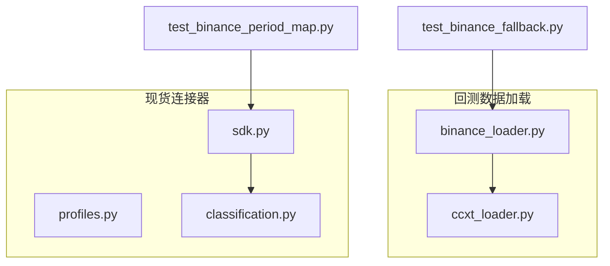
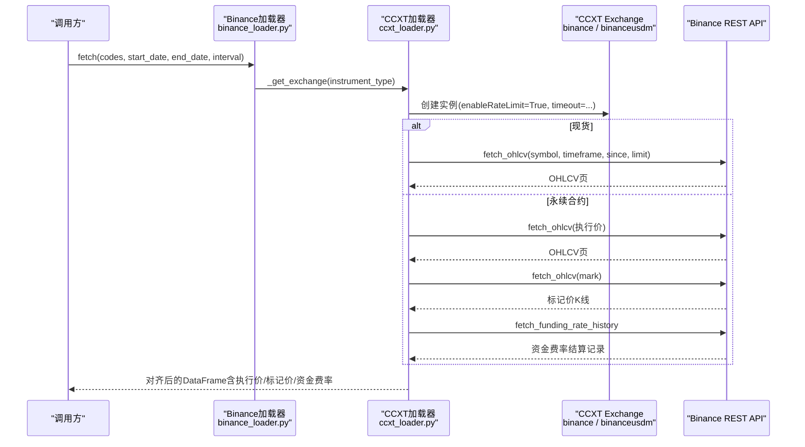
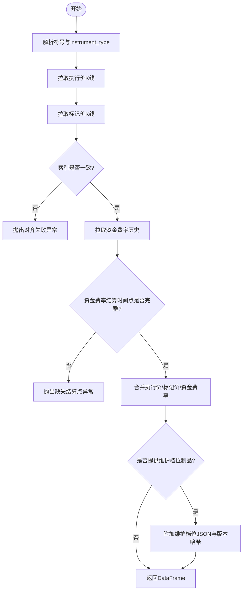
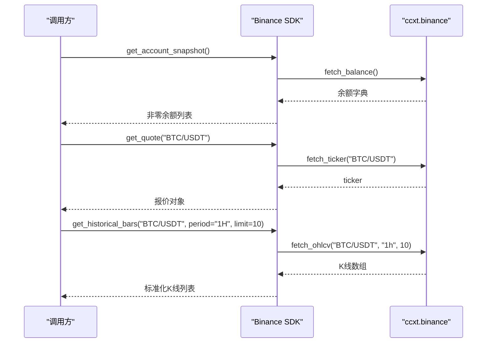
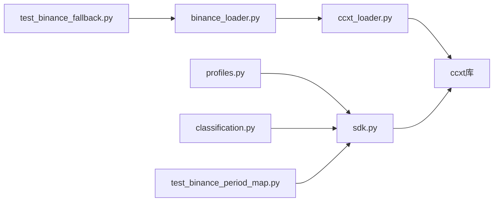

# Binance专用加载器

<cite>
**本文引用的文件**
- [agent/backtest/loaders/binance_loader.py](file://agent/backtest/loaders/binance_loader.py)
- [agent/backtest/loaders/ccxt_loader.py](file://agent/backtest/loaders/ccxt_loader.py)
- [agent/src/trading/connectors/binance/sdk.py](file://agent/src/trading/connectors/binance/sdk.py)
- [agent/src/trading/connectors/binance/profiles.py](file://agent/src/trading/connectors/binance/profiles.py)
- [agent/src/trading/connectors/binance/classification.py](file://agent/src/trading/connectors/binance/classification.py)
- [agent/tests/test_binance_fallback.py](file://agent/tests/test_binance_fallback.py)
- [agent/tests/test_binance_period_map.py](file://agent/tests/test_binance_period_map.py)
</cite>

## 目录
1. [简介](#简介)
2. [项目结构](#项目结构)
3. [核心组件](#核心组件)
4. [架构总览](#架构总览)
5. [详细组件分析](#详细组件分析)
6. [依赖关系分析](#依赖关系分析)
7. [性能与限流](#性能与限流)
8. [故障排查指南](#故障排查指南)
9. [结论](#结论)
10. [附录：常用工具与示例](#附录常用工具与示例)

## 简介
本文件面向Binance专用数据加载器的实现与使用，覆盖现货、永续合约（USD-M）等产品的历史K线、资金费率、标记价格等数据的获取与对齐；说明Binance特有的数据结构与字段处理；文档化认证机制、请求频率限制、代理配置、错误处理与性能优化建议。同时给出基于CCXT的Binance现货连接器在账户快照、报价、历史K线、下单/撤单等方面的能力边界与用法要点。

## 项目结构
- 回测数据加载层
  - binance_loader.py：注册名为“binance”的数据加载器，专用于Binance现货与USD-M永续合约的OHLCV拉取，通过CCXT访问公共市场数据，无需API Key。
  - ccxt_loader.py：通用CCXT数据加载基类，封装时间周期映射、分页拉取、预算控制、重试策略、永续合约资金费率与标记价格对齐等逻辑。
- 交易连接器层（现货）
  - sdk.py：基于ccxt.binance的只读/可写接口封装，提供账户快照、持仓（余额）、报价、历史K线、下单/撤单等能力；内置paper/live环境隔离与主机校验。
  - profiles.py：内置Binance连接配置文件（纸交易/实盘只读/实盘交易），声明能力集与读写权限。
  - classification.py：对ccxt方法做读写分类，确保网关对写入操作进行严格管控。
- 测试
  - test_binance_fallback.py：验证OKX不可用时的自动回退到Binance。
  - test_binance_period_map.py：验证项目风格的时间周期（如1H/4H）正确映射到ccxt timeframe。



图表来源
- [agent/backtest/loaders/binance_loader.py:1-45](file://agent/backtest/loaders/binance_loader.py#L1-L45)
- [agent/backtest/loaders/ccxt_loader.py:184-308](file://agent/backtest/loaders/ccxt_loader.py#L184-L308)
- [agent/src/trading/connectors/binance/sdk.py:355-405](file://agent/src/trading/connectors/binance/sdk.py#L355-L405)
- [agent/src/trading/connectors/binance/profiles.py:14-70](file://agent/src/trading/connectors/binance/profiles.py#L14-L70)
- [agent/src/trading/connectors/binance/classification.py:13-24](file://agent/src/trading/connectors/binance/classification.py#L13-L24)
- [agent/tests/test_binance_fallback.py:11-42](file://agent/tests/test_binance_fallback.py#L11-L42)
- [agent/tests/test_binance_period_map.py:17-43](file://agent/tests/test_binance_period_map.py#L17-L43)

章节来源
- [agent/backtest/loaders/binance_loader.py:1-45](file://agent/backtest/loaders/binance_loader.py#L1-L45)
- [agent/backtest/loaders/ccxt_loader.py:184-308](file://agent/backtest/loaders/ccxt_loader.py#L184-L308)
- [agent/src/trading/connectors/binance/sdk.py:355-405](file://agent/src/trading/connectors/binance/sdk.py#L355-L405)
- [agent/src/trading/connectors/binance/profiles.py:14-70](file://agent/src/trading/connectors/binance/profiles.py#L14-L70)
- [agent/src/trading/connectors/binance/classification.py:13-24](file://agent/src/trading/connectors/binance/classification.py#L13-L24)
- [agent/tests/test_binance_fallback.py:11-42](file://agent/tests/test_binance_fallback.py#L11-L42)
- [agent/tests/test_binance_period_map.py:17-43](file://agent/tests/test_binance_period_map.py#L17-L43)

## 核心组件
- Binance专用数据加载器（binance_loader.py）
  - 名称为“binance”，仅支持加密货币市场，公开行情无需认证。
  - 根据产品形态选择ccxt.binance或ccxt.binanceusdm，强制启用速率限制并设置超时。
- CCXT通用数据加载器（ccxt_loader.py）
  - 统一符号解析、时间周期映射、分页拉取、预算与重试、永续合约资金费率与标记价格对齐、保证金档位校验（外部制品）。
- Binance现货连接器（sdk.py）
  - 账户快照、持仓（非零余额）、最新报价、历史K线、下单/撤单；支持paper/live环境隔离与主机白名单校验。
- 连接配置文件（profiles.py）
  - 定义纸交易、实盘只读、实盘交易三类Profile及能力集。
- 读写分类（classification.py）
  - 将ccxt方法标注为READ/WRITE，保障网关安全策略。

章节来源
- [agent/backtest/loaders/binance_loader.py:23-44](file://agent/backtest/loaders/binance_loader.py#L23-L44)
- [agent/backtest/loaders/ccxt_loader.py:60-70](file://agent/backtest/loaders/ccxt_loader.py#L60-L70)
- [agent/backtest/loaders/ccxt_loader.py:226-308](file://agent/backtest/loaders/ccxt_loader.py#L226-L308)
- [agent/src/trading/connectors/binance/sdk.py:267-405](file://agent/src/trading/connectors/binance/sdk.py#L267-L405)
- [agent/src/trading/connectors/binance/profiles.py:14-70](file://agent/src/trading/connectors/binance/profiles.py#L14-L70)
- [agent/src/trading/connectors/binance/classification.py:13-24](file://agent/src/trading/connectors/binance/classification.py#L13-L24)

## 架构总览
下图展示从调用方到交易所的数据流：回测加载器通过CCXT访问Binance现货/永续合约；现货连接器通过ccxt.binance提供账户与交易能力；所有网络调用受超时、预算、重试与代理配置保护。



图表来源
- [agent/backtest/loaders/binance_loader.py:31-44](file://agent/backtest/loaders/binance_loader.py#L31-L44)
- [agent/backtest/loaders/ccxt_loader.py:226-308](file://agent/backtest/loaders/ccxt_loader.py#L226-L308)
- [agent/backtest/loaders/ccxt_loader.py:310-372](file://agent/backtest/loaders/ccxt_loader.py#L310-L372)
- [agent/backtest/loaders/ccxt_loader.py:374-424](file://agent/backtest/loaders/ccxt_loader.py#L374-L424)
- [agent/backtest/loaders/ccxt_loader.py:426-501](file://agent/backtest/loaders/ccxt_loader.py#L426-L501)

## 详细组件分析

### 组件A：Binance专用数据加载器（binance_loader.py）
- 职责
  - 注册名为“binance”的数据源，仅支持加密货币市场，公开行情无需认证。
  - 根据instrument_type选择ccxt.binance或ccxt.binanceusdm，强制开启速率限制并设置超时。
- 关键点
  - 忽略全局CCXT_EXCHANGE环境变量，始终指向Binance。
  - 通过代理环境变量注入proxies配置。
- 适用场景
  - 回测与批量历史数据拉取；与OKX并列作为加密资产自动回退链的一环。

```mermaid
classDiagram
class DataLoader {
+name = "binance"
+markets = {"crypto"}
+requires_auth = False
+_get_exchange(instrument_type)
}
```

图表来源
- [agent/backtest/loaders/binance_loader.py:23-44](file://agent/backtest/loaders/binance_loader.py#L23-L44)

章节来源
- [agent/backtest/loaders/binance_loader.py:1-45](file://agent/backtest/loaders/binance_loader.py#L1-L45)

### 组件B：CCXT通用数据加载器（ccxt_loader.py）
- 职责
  - 统一符号解析（如BTC-USDT-PERP -> BTC/USDT:USDT，swap类型）。
  - 时间周期映射与容差检查，分页拉取，预算与重试，异常处理。
  - 永续合约：拉取执行价K线与标记价K线并对齐；拉取资金费率历史并填充funding_rate与funding_settlement_time；可选附加维护保证金档位（外部制品）。
- 关键流程（永续合约对齐）


图表来源
- [agent/backtest/loaders/ccxt_loader.py:60-70](file://agent/backtest/loaders/ccxt_loader.py#L60-L70)
- [agent/backtest/loaders/ccxt_loader.py:226-308](file://agent/backtest/loaders/ccxt_loader.py#L226-L308)
- [agent/backtest/loaders/ccxt_loader.py:310-372](file://agent/backtest/loaders/ccxt_loader.py#L310-L372)
- [agent/backtest/loaders/ccxt_loader.py:374-424](file://agent/backtest/loaders/ccxt_loader.py#L374-L424)
- [agent/backtest/loaders/ccxt_loader.py:426-501](file://agent/backtest/loaders/ccxt_loader.py#L426-L501)

- 关键数据结构与字段
  - 执行价K线：open/high/low/close/volume，时间戳毫秒转DatetimeIndex。
  - 标记价K线：mark_open/mark_high/mark_low/mark_close。
  - 资金费率：funding_rate（结算时点赋值），funding_settlement_time（结算时间戳）。
  - 维护档位（可选）：maintenance_brackets（JSON数组），maintenance_bracket_version（内容哈希前缀）。
- 复杂度与性能
  - 分页拉取，每页limit=1000，最多循环200次；整体时间复杂度O(N)，N为K线根数。
  - 预算控制：单次fetch总耗时不超过CCXT_FETCH_BUDGET_S秒，避免长尾挂起。
  - 重试策略：对网络类异常（NetworkError）进行有限重试。

章节来源
- [agent/backtest/loaders/ccxt_loader.py:32-57](file://agent/backtest/loaders/ccxt_loader.py#L32-L57)
- [agent/backtest/loaders/ccxt_loader.py:60-70](file://agent/backtest/loaders/ccxt_loader.py#L60-L70)
- [agent/backtest/loaders/ccxt_loader.py:226-308](file://agent/backtest/loaders/ccxt_loader.py#L226-L308)
- [agent/backtest/loaders/ccxt_loader.py:310-372](file://agent/backtest/loaders/ccxt_loader.py#L310-L372)
- [agent/backtest/loaders/ccxt_loader.py:374-424](file://agent/backtest/loaders/ccxt_loader.py#L374-L424)
- [agent/backtest/loaders/ccxt_loader.py:426-501](file://agent/backtest/loaders/ccxt_loader.py#L426-L501)

### 组件C：Binance现货连接器（sdk.py）
- 能力
  - 账户快照：返回非零余额（free/used/total）。
  - 持仓：现货无仓位概念，以非零余额表示持仓。
  - 报价：最新ticker（bid/ask/last/high/low/volume/time）。
  - 历史K线：按周期拉取OHLCV，支持1m~1M多种周期。
  - 下单/撤单：market/limit订单，支持GTC/IOC/FOK；notional仅在市价单有效。
- 认证与环境
  - paper/live通过set_sandbox_mode区分；host白名单校验防止错配。
  - 配置读取自用户运行时目录binance.json，支持profile与覆盖参数。
- 时间周期映射
  - 项目风格的1H/4H等映射到ccxt的1h/4h。



图表来源
- [agent/src/trading/connectors/binance/sdk.py:267-405](file://agent/src/trading/connectors/binance/sdk.py#L267-L405)
- [agent/src/trading/connectors/binance/sdk.py:377-405](file://agent/src/trading/connectors/binance/sdk.py#L377-L405)

章节来源
- [agent/src/trading/connectors/binance/sdk.py:59-152](file://agent/src/trading/connectors/binance/sdk.py#L59-L152)
- [agent/src/trading/connectors/binance/sdk.py:267-405](file://agent/src/trading/connectors/binance/sdk.py#L267-L405)
- [agent/src/trading/connectors/binance/sdk.py:423-547](file://agent/src/trading/connectors/binance/sdk.py#L423-L547)
- [agent/src/trading/connectors/binance/sdk.py:550-600](file://agent/src/trading/connectors/binance/sdk.py#L550-L600)
- [agent/src/trading/connectors/binance/sdk.py:628-663](file://agent/src/trading/connectors/binance/sdk.py#L628-L663)
- [agent/tests/test_binance_period_map.py:17-43](file://agent/tests/test_binance_period_map.py#L17-L43)

### 组件D：连接配置文件与读写分类（profiles.py, classification.py）
- profiles.py
  - 定义四类Profile：纸交易只读、实盘只读、纸交易可下单、实盘可下单（需授权）。
  - 明确readonly标志与能力集，确保上层网关按能力放行。
- classification.py
  - 将ccxt方法归类为READ/WRITE，create_order/cancel_order为WRITE，其余为READ。

章节来源
- [agent/src/trading/connectors/binance/profiles.py:14-70](file://agent/src/trading/connectors/binance/profiles.py#L14-L70)
- [agent/src/trading/connectors/binance/classification.py:13-24](file://agent/src/trading/connectors/binance/classification.py#L13-L24)

## 依赖关系分析
- 回测加载器依赖
  - binance_loader依赖ccxt_loader提供的通用拉取逻辑与缓存、重试、预算控制。
  - 两者均依赖ccxt库；binance_loader固定使用Binance相关exchange类。
- 现货连接器依赖
  - sdk依赖ccxt.binance；通过set_sandbox_mode切换paper/live；通过host白名单校验确保安全。
- 测试用例
  - test_binance_fallback验证OKX不可用时回退到binance。
  - test_binance_period_map验证时间周期映射正确性。



图表来源
- [agent/backtest/loaders/binance_loader.py:15-44](file://agent/backtest/loaders/binance_loader.py#L15-L44)
- [agent/backtest/loaders/ccxt_loader.py:184-308](file://agent/backtest/loaders/ccxt_loader.py#L184-L308)
- [agent/src/trading/connectors/binance/sdk.py:628-640](file://agent/src/trading/connectors/binance/sdk.py#L628-L640)
- [agent/src/trading/connectors/binance/profiles.py:14-70](file://agent/src/trading/connectors/binance/profiles.py#L14-L70)
- [agent/src/trading/connectors/binance/classification.py:13-24](file://agent/src/trading/connectors/binance/classification.py#L13-L24)
- [agent/tests/test_binance_fallback.py:11-42](file://agent/tests/test_binance_fallback.py#L11-L42)
- [agent/tests/test_binance_period_map.py:17-43](file://agent/tests/test_binance_period_map.py#L17-L43)

章节来源
- [agent/backtest/loaders/binance_loader.py:15-44](file://agent/backtest/loaders/binance_loader.py#L15-L44)
- [agent/backtest/loaders/ccxt_loader.py:184-308](file://agent/backtest/loaders/ccxt_loader.py#L184-L308)
- [agent/src/trading/connectors/binance/sdk.py:628-640](file://agent/src/trading/connectors/binance/sdk.py#L628-L640)
- [agent/src/trading/connectors/binance/profiles.py:14-70](file://agent/src/trading/connectors/binance/profiles.py#L14-L70)
- [agent/src/trading/connectors/binance/classification.py:13-24](file://agent/src/trading/connectors/binance/classification.py#L13-L24)
- [agent/tests/test_binance_fallback.py:11-42](file://agent/tests/test_binance_fallback.py#L11-L42)
- [agent/tests/test_binance_period_map.py:17-43](file://agent/tests/test_binance_period_map.py#L17-L43)

## 性能与限流
- 请求超时与预算
  - 单次HTTP调用超时由CCXT_TIMEOUT_MS控制；单次fetch总预算由CCXT_FETCH_BUDGET_S控制，避免长时间阻塞。
- 分页与重试
  - 每页limit=1000，最多200页；对网络异常进行有限重试，其他异常直接上报。
- 代理配置
  - 支持ALL_PROXY/HTTP_PROXY/HTTPS_PROXY等环境变量注入到CCXT。
- 指标与建议
  - 合理设置区间起止时间与时间粒度，减少不必要的大范围拉取。
  - 对高频周期（如1m/5m）建议分批拉取，结合本地缓存降低重复请求。
  - 永续合约拉取包含执行价、标记价与资金费率三处网络IO，注意预算分配。

章节来源
- [agent/backtest/loaders/ccxt_loader.py:50-57](file://agent/backtest/loaders/ccxt_loader.py#L50-L57)
- [agent/backtest/loaders/ccxt_loader.py:220-224](file://agent/backtest/loaders/ccxt_loader.py#L220-L224)
- [agent/backtest/loaders/ccxt_loader.py:374-424](file://agent/backtest/loaders/ccxt_loader.py#L374-L424)
- [agent/backtest/loaders/ccxt_loader.py:426-501](file://agent/backtest/loaders/ccxt_loader.py#L426-L501)

## 故障排查指南
- 常见错误与定位
  - 符号不合法或无法识别：检查符号规范化（如BTC-USDT -> BTC/USDT，永续合约BASE-USDT-PERP格式）。
  - 时间周期不支持：确认传入interval属于支持的集合（1m/5m/15m/30m/1h/4h/1d/1w/1M）。
  - 历史数据不完整：当达到页上限且未覆盖目标区间会抛出不完整历史异常，需调整起止时间或分片拉取。
  - 永续合约资金费率缺失：若结算时间点缺失（例如08/16/00附近），会抛出缺失结算点异常。
  - 主机不匹配：paper/live配置与host不一致会触发配置错误，需修正testnet_host或live host。
  - 缺少必要字段：下单/撤单参数校验失败会返回错误信息，需补齐quantity/notional/price等。
- 调试建议
  - 启用日志输出，关注警告与异常堆栈。
  - 使用check_status健康检查快速定位配置与依赖问题。
  - 对网络异常优先检查代理与网络连通性。

章节来源
- [agent/backtest/loaders/ccxt_loader.py:60-70](file://agent/backtest/loaders/ccxt_loader.py#L60-L70)
- [agent/backtest/loaders/ccxt_loader.py:493-501](file://agent/backtest/loaders/ccxt_loader.py#L493-L501)
- [agent/backtest/loaders/ccxt_loader.py:348-364](file://agent/backtest/loaders/ccxt_loader.py#L348-L364)
- [agent/src/trading/connectors/binance/sdk.py:643-663](file://agent/src/trading/connectors/binance/sdk.py#L643-L663)
- [agent/src/trading/connectors/binance/sdk.py:465-547](file://agent/src/trading/connectors/binance/sdk.py#L465-L547)
- [agent/src/trading/connectors/binance/sdk.py:550-600](file://agent/src/trading/connectors/binance/sdk.py#L550-L600)

## 结论
本仓库提供了面向Binance的专用数据加载器与现货连接器：
- 回测侧通过binance_loader与ccxt_loader实现对现货与永续合约的历史K线、资金费率与标记价格的稳定获取与对齐，具备完善的超时、预算、重试与代理支持。
- 现货连接器提供账户快照、报价、历史K线与下单/撤单能力，并通过paper/live环境隔离与主机白名单保证安全。
- 针对Binance特有数据结构（如资金费率结算、标记价格、维护档位）进行了专门处理与校验。
- 建议在大规模拉取时采用分片与缓存策略，并结合健康检查与日志进行监控与排障。

## 附录：常用工具与示例
- 历史K线（现货）
  - 使用get_historical_bars，传入symbol与period（如1H/4H），内部会映射到ccxt timeframe并拉取OHLCV。
- 最新报价（现货）
  - 使用get_quote获取bid/ask/last/high/low/volume/time。
- 账户快照与持仓（现货）
  - get_account_snapshot返回非零余额；get_positions以持仓形式呈现非零余额。
- 下单与撤单（现货）
  - place_order支持market/limit，limit需指定limit_price；notional仅适用于市价单。
  - cancel_order需要order_id与symbol。
- 回测数据拉取（现货/永续）
  - 使用DataLoader.fetch，传入codes（如BTC-USDT或BTC-USDT-PERP）、start_date、end_date、interval；永续合约会自动对齐执行价、标记价与资金费率。
- 回退机制
  - 当OKX不可用时，系统会自动回退到binance，确保数据可用性。

章节来源
- [agent/src/trading/connectors/binance/sdk.py:355-405](file://agent/src/trading/connectors/binance/sdk.py#L355-L405)
- [agent/src/trading/connectors/binance/sdk.py:267-314](file://agent/src/trading/connectors/binance/sdk.py#L267-L314)
- [agent/src/trading/connectors/binance/sdk.py:423-547](file://agent/src/trading/connectors/binance/sdk.py#L423-L547)
- [agent/src/trading/connectors/binance/sdk.py:550-600](file://agent/src/trading/connectors/binance/sdk.py#L550-L600)
- [agent/backtest/loaders/ccxt_loader.py:226-308](file://agent/backtest/loaders/ccxt_loader.py#L226-L308)
- [agent/tests/test_binance_fallback.py:11-42](file://agent/tests/test_binance_fallback.py#L11-L42)