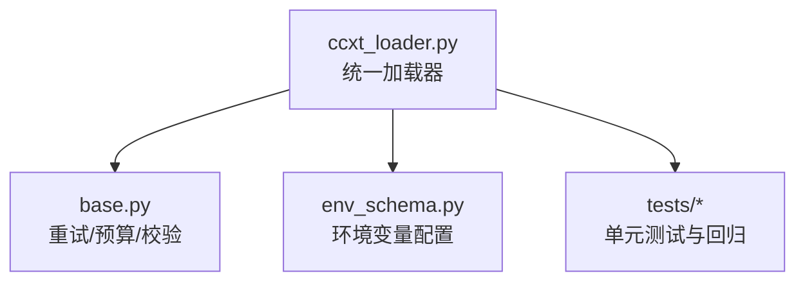
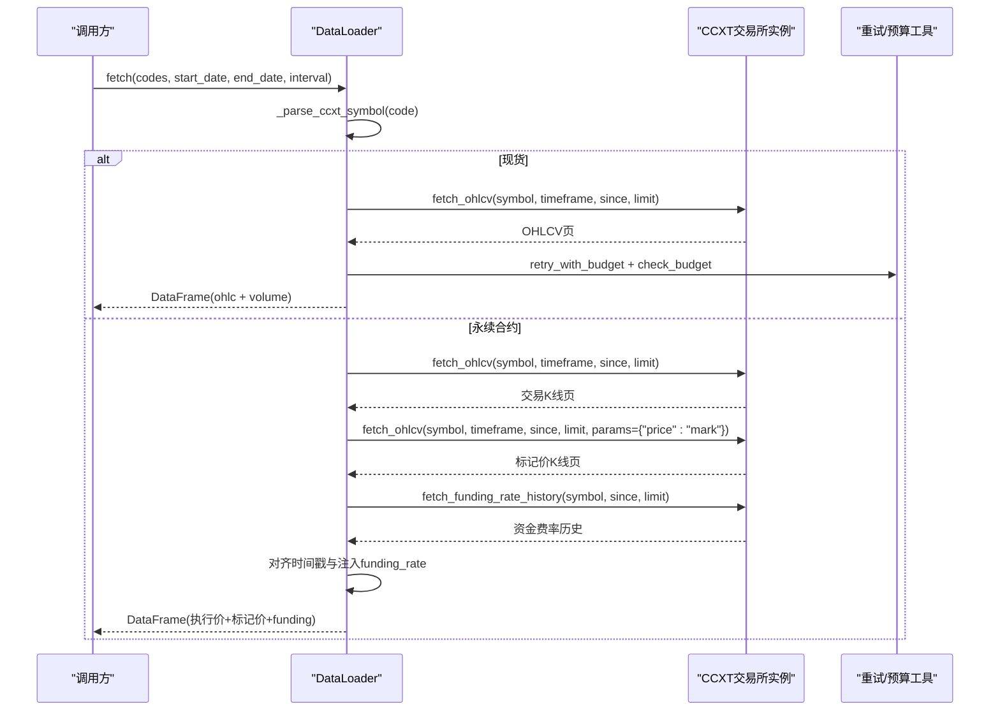
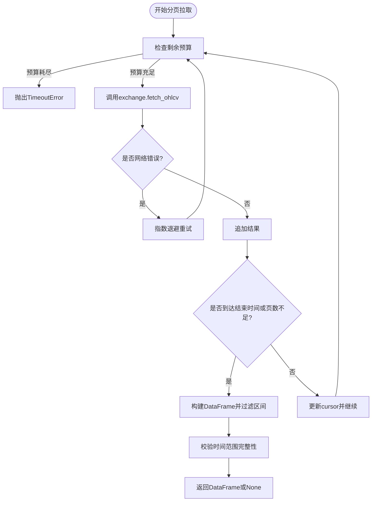
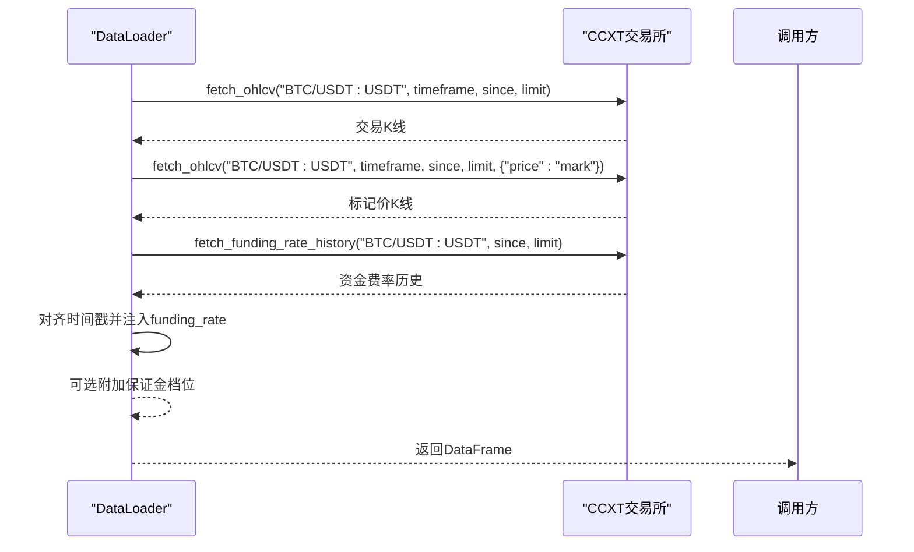
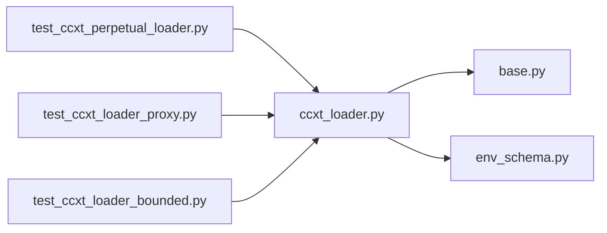

# CCXT统一接口加载器

<cite>
**本文引用的文件**
- [agent/backtest/loaders/ccxt_loader.py](file://agent/backtest/loaders/ccxt_loader.py)
- [agent/backtest/loaders/base.py](file://agent/backtest/loaders/base.py)
- [agent/src/config/env_schema.py](file://agent/src/config/env_schema.py)
- [agent/tests/test_ccxt_perpetual_loader.py](file://agent/tests/test_ccxt_perpetual_loader.py)
- [agent/tests/test_ccxt_loader_proxy.py](file://agent/tests/test_ccxt_loader_proxy.py)
- [agent/tests/test_ccxt_loader_bounded.py](file://agent/tests/test_ccxt_loader_bounded.py)
</cite>

## 目录
1. [简介](#简介)
2. [项目结构](#项目结构)
3. [核心组件](#核心组件)
4. [架构总览](#架构总览)
5. [详细组件分析](#详细组件分析)
6. [依赖关系分析](#依赖关系分析)
7. [性能考量](#性能考量)
8. [故障排除指南](#故障排除指南)
9. [结论](#结论)
10. [附录](#附录)

## 简介
本文件系统化文档化仓库中的CCXT统一接口加载器，覆盖以下主题：
- 支持100+交易所的统一数据获取（现货与合约）
- 符号解析与时区处理、24小时连续交易对齐
- BASE-USDT-PERP永续合约的专用处理逻辑（执行价与标记价对齐、资金费率结算）
- 代理配置、超时设置、速率限制等网络相关配置
- 分页数据获取、错误重试、预算控制等高级特性
- 多交易所数据同步、价格对齐、流动性检查等使用建议
- 安全配置、性能优化与故障排除最佳实践

该加载器通过统一的DataLoader接口，屏蔽不同交易所API差异，提供一致的OHLCV与永续合约数据。

## 项目结构
- 加载器实现位于 backtest/loaders/ccxt_loader.py，封装了CCXT库调用、符号解析、分页、重试与预算控制。
- 通用重试/预算工具在 base.py，供所有外部API调用型加载器复用。
- 环境变量与默认值定义在 src/config/env_schema.py，集中管理CCXT相关配置项。
- 测试用例覆盖永续合约、代理、超时与预算等关键路径。

图表来源
- [agent/backtest/loaders/ccxt_loader.py:184-308](file://agent/backtest/loaders/ccxt_loader.py#L184-L308)
- [agent/backtest/loaders/base.py:377-414](file://agent/backtest/loaders/base.py#L377-L414)
- [agent/src/config/env_schema.py:205-207](file://agent/src/config/env_schema.py#L205-L207)

章节来源
- [agent/backtest/loaders/ccxt_loader.py:1-502](file://agent/backtest/loaders/ccxt_loader.py#L1-L502)
- [agent/backtest/loaders/base.py:1-200](file://agent/backtest/loaders/base.py#L1-L200)
- [agent/src/config/env_schema.py:201-211](file://agent/src/config/env_schema.py#L201-L211)

## 核心组件
- DataLoader类：统一入口，负责创建交易所实例、符号解析、分页拉取、永续合约数据处理与返回DataFrame映射。
- 符号解析函数：将用户输入符号转换为CCXT内部符号并区分现货与合约类型。
- 代理配置函数：从系统代理环境变量构建CCXT代理配置。
- 分页与重试：基于base模块的retry_with_budget与check_budget，确保在网络波动时快速失败与重试。
- 永续合约处理：分别拉取交易K线与标记价K线，并对齐时间戳；拉取资金费率历史并在固定结算时间点注入。

章节来源
- [agent/backtest/loaders/ccxt_loader.py:60-92](file://agent/backtest/loaders/ccxt_loader.py#L60-L92)
- [agent/backtest/loaders/ccxt_loader.py:184-308](file://agent/backtest/loaders/ccxt_loader.py#L184-L308)
- [agent/backtest/loaders/ccxt_loader.py:310-425](file://agent/backtest/loaders/ccxt_loader.py#L310-L425)
- [agent/backtest/loaders/base.py:377-414](file://agent/backtest/loaders/base.py#L377-L414)

## 架构总览
下图展示从调用方到交易所的数据流，包括符号解析、分页拉取、重试与预算控制、以及永续合约的标记价与资金费率对齐流程。

图表来源
- [agent/backtest/loaders/ccxt_loader.py:226-308](file://agent/backtest/loaders/ccxt_loader.py#L226-L308)
- [agent/backtest/loaders/ccxt_loader.py:310-425](file://agent/backtest/loaders/ccxt_loader.py#L310-L425)
- [agent/backtest/loaders/base.py:377-414](file://agent/backtest/loaders/base.py#L377-L414)

## 详细组件分析

### 符号解析与合约区分
- 输入符号规范：
  - 现货：如“BTC-USDT”，会被规范化为“BTC/USDT”并标记为spot。
  - 永续合约：仅支持“BASE-USDT-PERP”格式（例如“BTC-USDT-PERP”），会映射到CCXT的“BTC/USDT:USDT”并标记为swap。
- 非标准永续符号将被拒绝，避免误用。
- 合约类型决定后续拉取策略：现货仅拉取OHLCV；永续合约额外拉取标记价与资金费率。

章节来源
- [agent/backtest/loaders/ccxt_loader.py:60-70](file://agent/backtest/loaders/ccxt_loader.py#L60-L70)
- [agent/tests/test_ccxt_perpetual_loader.py:103-114](file://agent/tests/test_ccxt_perpetual_loader.py#L103-L114)

### 交易所实例与网络配置
- 交易所选择：
  - 通过环境变量CCXT_EXCHANGE指定交易所ID，默认binance。
  - 当instrument_type为swap时，强制要求binance或binanceusdm，否则抛出异常。
- 网络参数：
  - 启用速率限制enableRateLimit。
  - 请求超时timeout由CCXT_TIMEOUT_MS控制。
  - 代理配置从ALL_PROXY/HTTP_PROXY/HTTPS_PROXY及其小写形式读取，自动注入proxies字典。
- 延迟初始化：仅在需要时创建exchange实例，避免缓存命中时的不必要导入与连接。

章节来源
- [agent/backtest/loaders/ccxt_loader.py:203-224](file://agent/backtest/loaders/ccxt_loader.py#L203-L224)
- [agent/backtest/loaders/ccxt_loader.py:73-92](file://agent/backtest/loaders/ccxt_loader.py#L73-L92)
- [agent/tests/test_ccxt_loader_proxy.py:27-65](file://agent/tests/test_ccxt_loader_proxy.py#L27-L65)
- [agent/src/config/env_schema.py:205-207](file://agent/src/config/env_schema.py#L205-L207)

### 分页数据获取与预算控制
- 分页拉取：
  - 每次请求limit=1000条，cursor以毫秒时间戳推进。
  - 循环最多200次，防止无限拉取。
- 预算控制：
  - 每次页面拉取前调用check_budget，超过CCXT_FETCH_BUDGET_S即抛出TimeoutError快速失败。
  - 用于避免长时间挂起导致整体任务阻塞。
- 重试机制：
  - 对ccxt.NetworkError进行有限重试，最大重试次数与退避间隔由base模块提供。
  - 非网络错误（如符号错误）不重试，直接向上抛出。

图表来源
- [agent/backtest/loaders/ccxt_loader.py:426-502](file://agent/backtest/loaders/ccxt_loader.py#L426-L502)
- [agent/backtest/loaders/base.py:377-414](file://agent/backtest/loaders/base.py#L377-L414)

章节来源
- [agent/backtest/loaders/ccxt_loader.py:426-502](file://agent/backtest/loaders/ccxt_loader.py#L426-L502)
- [agent/backtest/loaders/base.py:377-414](file://agent/backtest/loaders/base.py#L377-L414)
- [agent/tests/test_ccxt_loader_bounded.py:111-144](file://agent/tests/test_ccxt_loader_bounded.py#L111-L144)

### 永续合约处理逻辑（BASE-USDT-PERP）
- 执行价与标记价对齐：
  - 分别拉取交易K线与标记价K线（params={"price":"mark"}）。
  - 校验两者索引一致，否则抛出异常。
  - 输出列包含execution_open及mark_open/mark_high/mark_low/mark_close。
- 资金费率结算：
  - 拉取资金费率历史，按固定结算小时（0/8/16）对齐到K线时间轴。
  - 若缺失必要结算点则抛出异常；重复结算也会报错。
  - 资金费率时间戳存在毫秒抖动，会四舍五入到秒以对齐K线。
- 保证金档位（可选）：
  - 通过传入已验证的维护保证金档位artifact，附加maintenance_brackets与版本号列。
  - 严格模式require_brackets=True时，未提供有效artifact将提前失败，不会发起任何网络调用。

图表来源
- [agent/backtest/loaders/ccxt_loader.py:310-425](file://agent/backtest/loaders/ccxt_loader.py#L310-L425)
- [agent/tests/test_ccxt_perpetual_loader.py:130-200](file://agent/tests/test_ccxt_perpetual_loader.py#L130-L200)

章节来源
- [agent/backtest/loaders/ccxt_loader.py:310-425](file://agent/backtest/loaders/ccxt_loader.py#L310-L425)
- [agent/tests/test_ccxt_perpetual_loader.py:130-200](file://agent/tests/test_ccxt_perpetual_loader.py#L130-L200)

### 错误处理与边界情况
- 日期范围校验：start_date必须<=end_date，否则抛出ValueError。
- 时间框架不支持：timeframe不在映射表内将抛出异常。
- 历史不完整：若达到页上限且仍未覆盖到结束时间，抛出异常提示不完整历史。
- 永续合约：
  - 标记价时间戳不一致或缺失：抛出异常。
  - 资金费率缺失或重复：抛出异常。
  - 严格模式下缺少保证金档位artifact：提前失败。

章节来源
- [agent/backtest/loaders/ccxt_loader.py:226-308](file://agent/backtest/loaders/ccxt_loader.py#L226-L308)
- [agent/backtest/loaders/ccxt_loader.py:426-502](file://agent/backtest/loaders/ccxt_loader.py#L426-L502)
- [agent/backtest/loaders/base.py:168-184](file://agent/backtest/loaders/base.py#L168-L184)

## 依赖关系分析
- DataLoader依赖base模块的重试与预算工具，保证对外部API调用的鲁棒性。
- 环境变量配置集中在env_schema.py，便于统一管理CCXT_EXCHANGE、CCXT_TIMEOUT_MS、CCXT_FETCH_BUDGET_S等参数。
- 测试覆盖了符号解析、代理注入、超时与预算行为，确保实现符合预期。

图表来源
- [agent/backtest/loaders/ccxt_loader.py:184-308](file://agent/backtest/loaders/ccxt_loader.py#L184-L308)
- [agent/backtest/loaders/base.py:377-414](file://agent/backtest/loaders/base.py#L377-L414)
- [agent/src/config/env_schema.py:205-207](file://agent/src/config/env_schema.py#L205-L207)
- [agent/tests/test_ccxt_perpetual_loader.py:103-200](file://agent/tests/test_ccxt_perpetual_loader.py#L103-L200)
- [agent/tests/test_ccxt_loader_proxy.py:27-65](file://agent/tests/test_ccxt_loader_proxy.py#L27-L65)
- [agent/tests/test_ccxt_loader_bounded.py:111-144](file://agent/tests/test_ccxt_loader_bounded.py#L111-L144)

章节来源
- [agent/backtest/loaders/ccxt_loader.py:184-308](file://agent/backtest/loaders/ccxt_loader.py#L184-L308)
- [agent/backtest/loaders/base.py:377-414](file://agent/backtest/loaders/base.py#L377-L414)
- [agent/src/config/env_schema.py:205-207](file://agent/src/config/env_schema.py#L205-L207)

## 性能考量
- 请求超时：通过CCXT_TIMEOUT_MS限制单次HTTP请求耗时，避免长尾阻塞。
- 预算控制：CCXT_FETCH_BUDGET_S限制整个拉取过程的墙钟时间，防止分页循环过长。
- 速率限制：启用enableRateLimit，降低被交易所限流的风险。
- 分页上限：每页limit=1000，最多200页，兼顾效率与安全。
- 时间对齐：对资金费率时间戳进行秒级对齐，减少因毫秒抖动导致的匹配失败。
- 缓存命中：仅在首次需要时创建exchange实例，提高缓存命中率下的性能。

[本节为通用性能指导，不直接分析具体代码文件]

## 故障排除指南
- 符号错误：
  - 永续合约必须使用BASE-USDT-PERP格式，否则会抛出ValueError。
  - 现货符号需使用“-”分隔的基础货币与计价货币。
- 网络问题：
  - 检查代理环境变量是否正确设置（ALL_PROXY/HTTP_PROXY/HTTPS_PROXY）。
  - 调整CCXT_TIMEOUT_MS与CCXT_FETCH_BUDGET_S以适配网络状况。
- 数据不完整：
  - 若历史数据未达到结束时间，会抛出异常提示不完整历史。
  - 永续合约需确保标记价与资金费率数据完整，否则抛出相应异常。
- 严格模式：
  - require_brackets=True时必须提供有效的保证金档位artifact，否则会提前失败。

章节来源
- [agent/backtest/loaders/ccxt_loader.py:60-70](file://agent/backtest/loaders/ccxt_loader.py#L60-L70)
- [agent/backtest/loaders/ccxt_loader.py:310-425](file://agent/backtest/loaders/ccxt_loader.py#L310-L425)
- [agent/backtest/loaders/ccxt_loader.py:426-502](file://agent/backtest/loaders/ccxt_loader.py#L426-L502)
- [agent/tests/test_ccxt_perpetual_loader.py:153-200](file://agent/tests/test_ccxt_perpetual_loader.py#L153-L200)

## 结论
CCXT统一接口加载器提供了稳定、可配置的加密货币市场数据获取能力，覆盖现货与永续合约场景。通过符号解析、分页拉取、重试与预算控制，确保了在高延迟或不稳定网络环境下的健壮性。永续合约的标记价与资金费率对齐机制，为回测与实盘策略提供了可靠的数据基础。结合代理配置与环境变量，用户可根据实际部署需求灵活调整网络与性能参数。

[本节为总结性内容，不直接分析具体代码文件]

## 附录

### 环境变量与配置项
- CCXT_EXCHANGE：交易所ID，默认binance；永续合约当前要求binance或binanceusdm。
- CCXT_TIMEOUT_MS：单次请求超时毫秒数，默认15000。
- CCXT_FETCH_BUDGET_S：拉取过程总预算秒数，默认60.0。
- ALL_PROXY/HTTP_PROXY/HTTPS_PROXY：代理地址，支持socks5h/http等协议。

章节来源
- [agent/src/config/env_schema.py:205-207](file://agent/src/config/env_schema.py#L205-L207)
- [agent/backtest/loaders/ccxt_loader.py:73-92](file://agent/backtest/loaders/ccxt_loader.py#L73-L92)

### 使用示例与建议
- 多交易所数据同步：
  - 通过切换CCXT_EXCHANGE在不同交易所间切换，保持符号规范一致。
  - 建议使用统一的符号命名规则（现货“BASE-QUOTE”，永续“BASE-USDT-PERP”）。
- 价格对齐：
  - 永续合约中，执行价与标记价K线需时间戳完全一致，否则视为异常。
  - 资金费率在固定结算小时注入，确保策略能正确计算持仓成本。
- 流动性检查：
  - 可通过volume列评估流动性，建议在策略中加入最小成交量阈值。
- 安全配置：
  - 历史回测路径不携带API密钥，避免敏感信息泄露。
  - 严格模式下，保证金档位通过artifact传入，避免实时认证调用。

[本节为概念性指导，不直接分析具体代码文件]