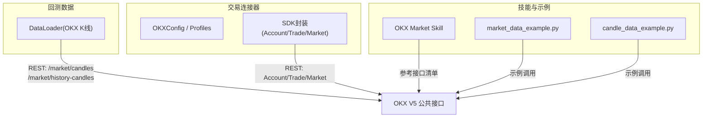
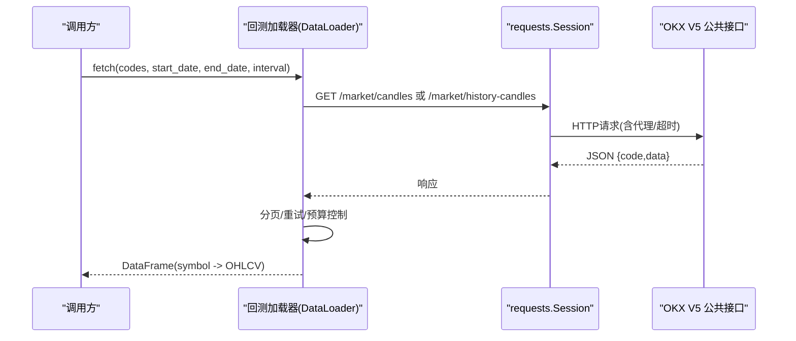
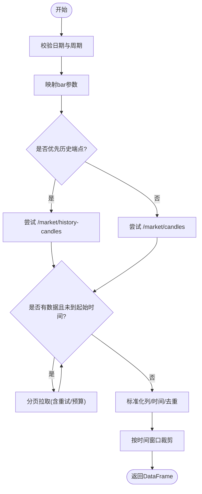
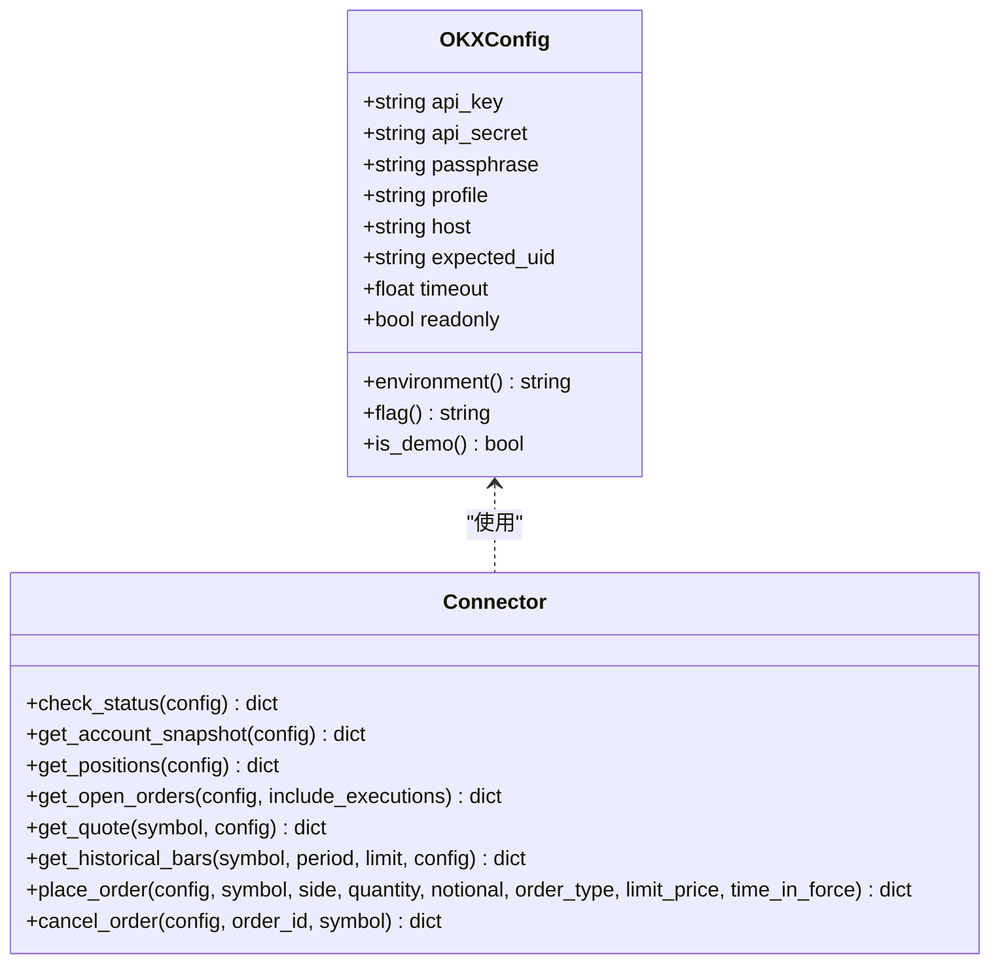
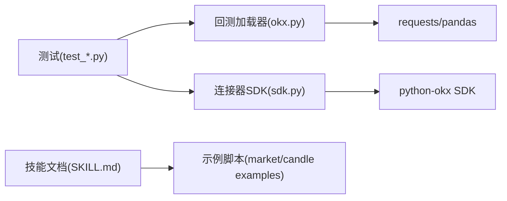

# OKX交易所集成

<cite>
**本文引用的文件**
- [agent/backtest/loaders/okx.py](file://agent/backtest/loaders/okx.py)
- [agent/src/trading/connectors/okx/__init__.py](file://agent/src/trading/connectors/okx/__init__.py)
- [agent/src/trading/connectors/okx/sdk.py](file://agent/src/trading/connectors/okx/sdk.py)
- [agent/src/trading/connectors/okx/profiles.py](file://agent/src/trading/connectors/okx/profiles.py)
- [agent/src/skills/okx-market/SKILL.md](file://agent/src/skills/okx-market/SKILL.md)
- [agent/src/skills/okx-market/scripts/market_data_example.py](file://agent/src/skills/okx-market/scripts/market_data_example.py)
- [agent/src/skills/okx-market/scripts/candle_data_example.py](file://agent/src/skills/okx-market/scripts/candle_data_example.py)
- [agent/tests/test_okx_bar_map.py](file://agent/tests/test_okx_bar_map.py)
- [agent/tests/test_okx_loader_bounded.py](file://agent/tests/test_okx_loader_bounded.py)
- [agent/tests/test_okx_loader_interval_case.py](file://agent/tests/test_okx_loader_interval_case.py)
</cite>

## 目录
1. [简介](#简介)
2. [项目结构](#项目结构)
3. [核心组件](#核心组件)
4. [架构总览](#架构总览)
5. [详细组件分析](#详细组件分析)
6. [依赖关系分析](#依赖关系分析)
7. [性能与可用性](#性能与可用性)
8. [故障诊断与排错](#故障诊断与排错)
9. [结论](#结论)
10. [附录：API与数据模型速查](#附录api与数据模型速查)

## 简介
本文件面向在系统中集成OKX交易所的开发者，覆盖现货、合约（永续/交割）、期权等市场数据的获取方式，以及账户与订单的只读访问与下单能力。文档重点包括：
- OKX V5 REST API的市场数据接口与数据结构（交易对命名、K线、资金费率、持仓量、标记价格等）
- 认证与环境隔离（模拟盘/实盘、UID校验、头标志位）
- 历史K线加载器的分页、重试、代理与预算控制
- 策略回测、实盘交易与风险管理的应用示例
- 错误处理、性能调优与故障诊断指南

## 项目结构
围绕OKX集成的代码主要分布在以下位置：
- 回测数据加载器：用于拉取历史K线（现货），支持多周期、双端点回退、代理与超时预算控制
- 交易连接器（SDK层）：基于python-okx SDK封装账户、行情、交易接口，提供配置管理、环境隔离与健康检查
- 技能文档与示例脚本：OKX市场数据接口清单与Python调用示例（行情、K线、资金费率）
- 测试用例：验证周期映射、边界条件、网络异常与代理行为

图表来源
- [agent/backtest/loaders/okx.py:59-69](file://agent/backtest/loaders/okx.py#L59-L69)
- [agent/src/trading/connectors/okx/sdk.py:37-40](file://agent/src/trading/connectors/okx/sdk.py#L37-L40)
- [agent/src/skills/okx-market/SKILL.md:56-72](file://agent/src/skills/okx-market/SKILL.md#L56-L72)

章节来源
- [agent/backtest/loaders/okx.py:1-20](file://agent/backtest/loaders/okx.py#L1-L20)
- [agent/src/trading/connectors/okx/__init__.py:1-16](file://agent/src/trading/connectors/okx/__init__.py#L1-L16)
- [agent/src/skills/okx-market/SKILL.md:1-11](file://agent/src/skills/okx-market/SKILL.md#L1-L11)

## 核心组件
- OKX K线数据加载器（回测用）
  - 公开REST接口拉取OHLCV，支持分钟到日线等多周期
  - 自动选择“近期”与“历史”端点，分页拉取，带重试与墙钟预算
  - 统一输出标准列：open/high/low/close/volume，时间戳UTC对齐
- OKX交易连接器（SDK层）
  - 通过python-okx SDK封装Account/Trade/Market三类只读接口
  - 配置管理：读取本地JSON，支持profile切换（paper/live-readonly/live）
  - 环境隔离：通过SDK flag与可选UID校验，防止误连实盘
  - 订单能力：现货下单与撤单（fail-closed设计）
- OKX市场技能与示例
  - 提供完整接口清单与Python示例（行情、批量行情、资金费率、K线、指数K线）

章节来源
- [agent/backtest/loaders/okx.py:101-208](file://agent/backtest/loaders/okx.py#L101-L208)
- [agent/src/trading/connectors/okx/sdk.py:51-127](file://agent/src/trading/connectors/okx/sdk.py#L51-L127)
- [agent/src/skills/okx-market/SKILL.md:56-72](file://agent/src/skills/okx-market/SKILL.md#L56-L72)

## 架构总览
系统通过两条主线对接OKX：
- 回测数据流：使用公开REST接口拉取历史K线，适配不同周期与深度范围，保证数据一致性与可重复性
- 交易与只读数据流：通过python-okx SDK进行账户余额、持仓、订单查询与现货下单；以profile与flag区分模拟/实盘，并附加UID校验增强安全性

图表来源
- [agent/backtest/loaders/okx.py:131-208](file://agent/backtest/loaders/okx.py#L131-L208)
- [agent/backtest/loaders/okx.py:220-373](file://agent/backtest/loaders/okx.py#L220-L373)

章节来源
- [agent/backtest/loaders/okx.py:131-208](file://agent/backtest/loaders/okx.py#L131-L208)
- [agent/backtest/loaders/okx.py:220-373](file://agent/backtest/loaders/okx.py#L220-L373)

## 详细组件分析

### 组件A：OKX K线数据加载器（回测）
- 功能要点
  - 周期映射：将项目侧周期token映射为OKX bar参数，保持大小写敏感（如1m/1M区分分钟/月）
  - 端点选择：根据时间跨度优先尝试历史端点，否则回退至近期端点
  - 分页与去重：按after游标分页拉取，保留已确认K线，必要时兼容未确认数据
  - 标准化输出：统一列名与时间索引，过滤无效行并按时间窗口裁剪
- 关键流程
  - 校验日期范围与周期
  - 构建Session（支持代理）
  - 循环分页拉取，遇到HTTP 429/5xx与业务码非0时抛出异常交由重试
  - 合并结果、类型转换、去重与裁剪

图表来源
- [agent/backtest/loaders/okx.py:157-208](file://agent/backtest/loaders/okx.py#L157-L208)
- [agent/backtest/loaders/okx.py:220-373](file://agent/backtest/loaders/okx.py#L220-L373)

章节来源
- [agent/backtest/loaders/okx.py:34-69](file://agent/backtest/loaders/okx.py#L34-L69)
- [agent/backtest/loaders/okx.py:101-208](file://agent/backtest/loaders/okx.py#L101-L208)
- [agent/backtest/loaders/okx.py:220-373](file://agent/backtest/loaders/okx.py#L220-L373)

### 组件B：OKX交易连接器（SDK层）
- 功能要点
  - 配置管理：从本地JSON加载配置，支持profile覆盖与CLI覆盖
  - 环境隔离：通过SDK flag（demo=1, live=0）与可选expected_uid校验，确保目标环境正确
  - 只读接口：账户余额、持仓、订单查询、行情快照与历史K线
  - 下单能力：现货市价/限价下单与撤单，fail-closed错误处理
- 关键流程
  - 构建客户端：AccountAPI/TradeAPI/MarketAPI，传入flag与host
  - 健康检查：check_status汇总配置、SDK安装状态、账户信息
  - 订单执行：参数校验→构造请求→直接调用SDK→解析响应→统一错误封装

图表来源
- [agent/src/trading/connectors/okx/sdk.py:51-127](file://agent/src/trading/connectors/okx/sdk.py#L51-L127)
- [agent/src/trading/connectors/okx/sdk.py:186-349](file://agent/src/trading/connectors/okx/sdk.py#L186-L349)
- [agent/src/trading/connectors/okx/sdk.py:371-574](file://agent/src/trading/connectors/okx/sdk.py#L371-L574)

章节来源
- [agent/src/trading/connectors/okx/sdk.py:138-174](file://agent/src/trading/connectors/okx/sdk.py#L138-L174)
- [agent/src/trading/connectors/okx/sdk.py:186-349](file://agent/src/trading/connectors/okx/sdk.py#L186-L349)
- [agent/src/trading/connectors/okx/sdk.py:371-574](file://agent/src/trading/connectors/okx/sdk.py#L371-L574)

### 组件C：OKX市场数据技能与示例
- 接口清单：涵盖现货行情、批量行情、K线、最近成交、产品列表、深度、资金费率、历史资金费率、标记价格、持仓量、限价、指数行情与指数K线
- 示例脚本：展示如何获取单个/批量行情、资金费率、K线与指数K线，并转换为DataFrame便于分析

章节来源
- [agent/src/skills/okx-market/SKILL.md:56-72](file://agent/src/skills/okx-market/SKILL.md#L56-L72)
- [agent/src/skills/okx-market/scripts/market_data_example.py:14-93](file://agent/src/skills/okx-market/scripts/market_data_example.py#L14-L93)
- [agent/src/skills/okx-market/scripts/candle_data_example.py:17-76](file://agent/src/skills/okx-market/scripts/candle_data_example.py#L17-L76)

### 组件D：周期映射与测试保障
- 周期映射：确保小时级周期不被误映射为日线，分钟与月线保持大小写敏感
- 测试覆盖：
  - 周期映射正确性（1H/4H与1h/4h）
  - 加载器边界行为（重试、预算、代理、双端点回退）
  - 区间大小写处理（1h/4h不静默降级为日线）

章节来源
- [agent/tests/test_okx_bar_map.py:8-17](file://agent/tests/test_okx_bar_map.py#L8-L17)
- [agent/tests/test_okx_loader_bounded.py:64-149](file://agent/tests/test_okx_loader_bounded.py#L64-L149)
- [agent/tests/test_okx_loader_interval_case.py:26-40](file://agent/tests/test_okx_loader_interval_case.py#L26-L40)

## 依赖关系分析
- 外部依赖
  - python-okx SDK：账户、交易、行情接口
  - requests：回测加载器HTTP请求
  - pandas：数据清洗与时间序列处理
- 内部依赖
  - 回测加载器依赖通用工具（缓存、重试、预算、日期校验）
  - 连接器依赖配置路径与运行时根目录
  - 技能文档与示例脚本作为参考与演示

图表来源
- [agent/backtest/loaders/okx.py:29-31](file://agent/backtest/loaders/okx.py#L29-L31)
- [agent/src/trading/connectors/okx/sdk.py:589-615](file://agent/src/trading/connectors/okx/sdk.py#L589-L615)
- [agent/src/skills/okx-market/SKILL.md:51-54](file://agent/src/skills/okx-market/SKILL.md#L51-L54)

章节来源
- [agent/backtest/loaders/okx.py:29-31](file://agent/backtest/loaders/okx.py#L29-L31)
- [agent/src/trading/connectors/okx/sdk.py:589-615](file://agent/src/trading/connectors/okx/sdk.py#L589-L615)
- [agent/src/skills/okx-market/SKILL.md:51-54](file://agent/src/skills/okx-market/SKILL.md#L51-L54)

## 性能与可用性
- 回测加载器
  - 代理支持：遵循ALL_PROXY/HTTP_PROXY/HTTPS_PROXY环境变量，便于受限网络环境
  - 超时与预算：可配置单次请求超时与整体拉取预算，避免长时间阻塞
  - 重试策略：对HTTP 429/5xx与业务码非0进行重试，提升鲁棒性
  - 端点回退：历史端点优先，失败则回退至近期端点，提高成功率
- 连接器
  - 健康检查：check_status聚合SDK安装、配置完整性与账户信息，便于快速定位问题
  - 安全隔离：通过flag与expected_uid双重校验，降低误连风险
  - 幂等与容错：订单执行fail-closed，任何异常均返回结构化错误，不发送订单

章节来源
- [agent/backtest/loaders/okx.py:67-98](file://agent/backtest/loaders/okx.py#L67-L98)
- [agent/backtest/loaders/okx.py:291-322](file://agent/backtest/loaders/okx.py#L291-L322)
- [agent/src/trading/connectors/okx/sdk.py:186-245](file://agent/src/trading/connectors/okx/sdk.py#L186-L245)
- [agent/src/trading/connectors/okx/sdk.py:371-574](file://agent/src/trading/connectors/okx/sdk.py#L371-L574)

## 故障诊断与排错
- 常见问题
  - 网络超时/限流：检查代理设置与超时预算；关注HTTP 429/5xx重试日志
  - 业务错误：当code非0时，记录msg/error_message以便定位
  - 配置缺失：连接器会报告缺失字段（api_key/api_secret/passphrase）
  - 环境误配：check_status中flag与UID不匹配将报错
- 诊断步骤
  - 使用check_status获取健康报告，确认SDK安装与配置完整性
  - 若仅历史端点失败，尝试近期端点；反之亦然
  - 调整OKX_TIMEOUT_S与OKX_FETCH_BUDGET_S以平衡速度与稳定性
  - 核对expected_uid与实际账户UID是否一致

章节来源
- [agent/backtest/loaders/okx.py:291-322](file://agent/backtest/loaders/okx.py#L291-L322)
- [agent/src/trading/connectors/okx/sdk.py:186-245](file://agent/src/trading/connectors/okx/sdk.py#L186-L245)
- [agent/tests/test_okx_loader_bounded.py:157-185](file://agent/tests/test_okx_loader_bounded.py#L157-L185)

## 结论
本集成通过回测加载器与SDK连接器两条路径，全面覆盖OKX现货、合约、期权等市场数据的获取与账户/订单的只读访问与下单能力。设计上强调：
- 数据一致性：统一周期映射与时间戳处理
- 高可用：代理、重试、预算与端点回退
- 安全隔离：profile+flag+UID校验
- 可观测：健康检查与结构化错误
建议在生产环境中结合监控与告警，持续优化超时与预算参数，并严格管理API密钥与白名单。

## 附录：API与数据模型速查
- 交易对命名规则
  - 现货：BTC-USDT、ETH-USDT
  - 永续：BTC-USDT-SWAP、ETH-USDT-SWAP
  - 交割：BTC-USDT-250328（YYMMDD）
  - 期权：BTC-USD-250328-95000-C
  - 指数：BTC-USD、ETH-USD
- K线周期（bar）
  - 1m、3m、5m、15m、30m、1H、2H、4H、6H、12H、1D、1W、1M
- 产品类型（instType）
  - SPOT、SWAP、FUTURES、OPTION
- 常用接口
  - /market/ticker、/market/tickers、/market/candles、/market/trades、/public/instruments、/market/books
  - /public/funding-rate、/public/funding-rate-history、/public/mark-price、/public/open-interest、/public/price-limit
  - /market/index-tickers、/market/index-candles
- 资金费率年化
  - 年化 = funding_rate × 3 × 365（OKX每8小时结算一次）
- 订单簿与深度
  - 通过/market/books获取买卖盘深度，注意单位与精度
- 标记价格与爆仓
  - 使用/public/mark-price获取标记价格，结合杠杆与维持保证金计算爆仓价

章节来源
- [agent/src/skills/okx-market/SKILL.md:36-47](file://agent/src/skills/okx-market/SKILL.md#L36-L47)
- [agent/src/skills/okx-market/SKILL.md:56-72](file://agent/src/skills/okx-market/SKILL.md#L56-L72)
- [agent/src/skills/perp-funding-basis/SKILL.md:18-31](file://agent/src/skills/perp-funding-basis/SKILL.md#L18-L31)
- [agent/src/skills/perp-funding-basis/SKILL.md:187-200](file://agent/src/skills/perp-funding-basis/SKILL.md#L187-L200)