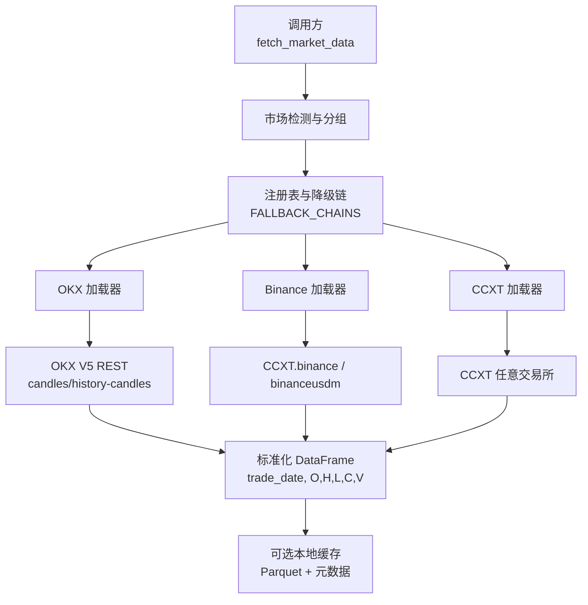
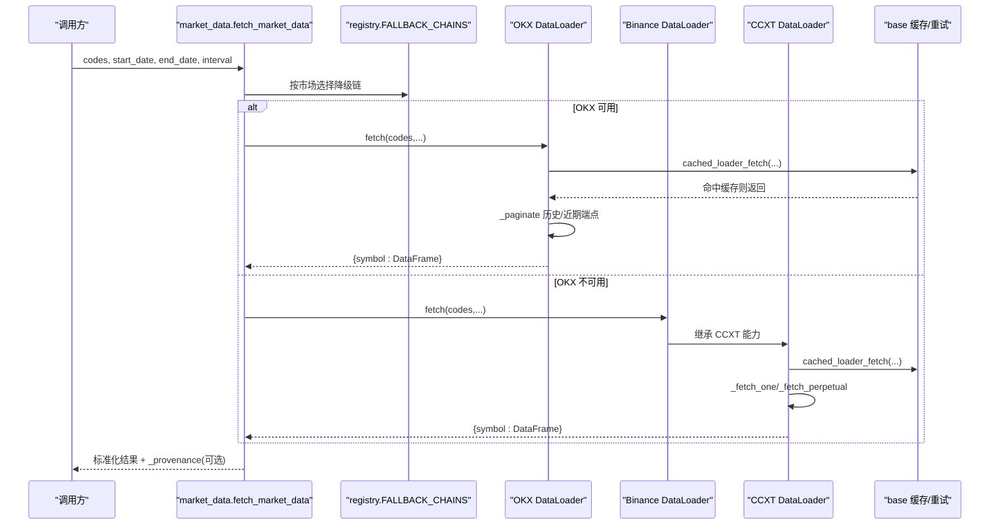
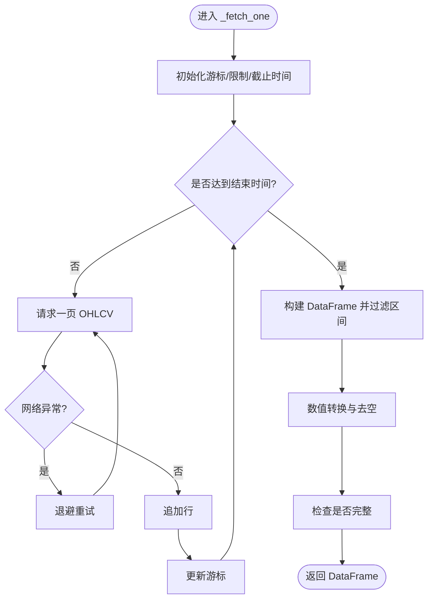
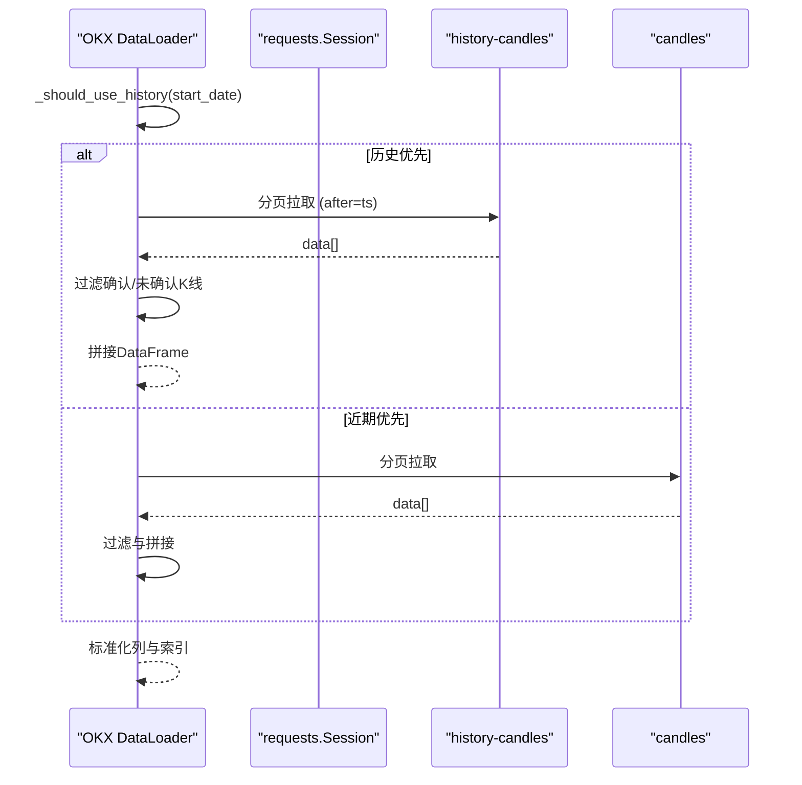
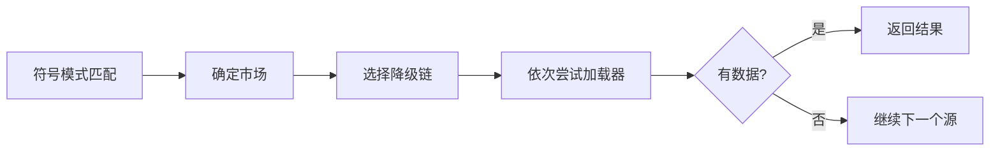
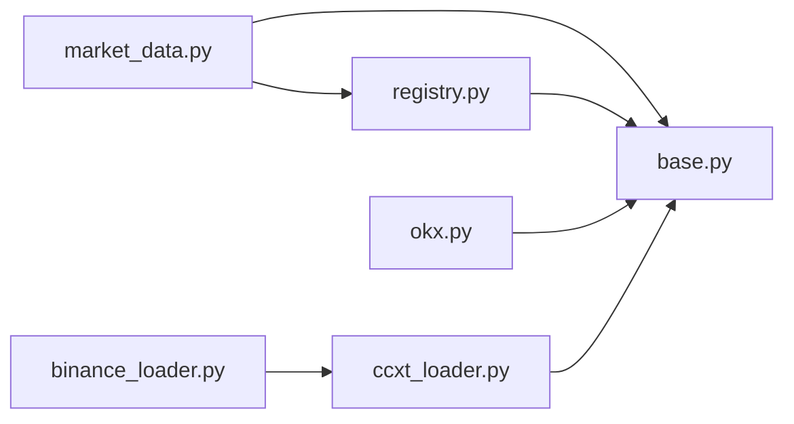

# 加密货币市场加载器

<cite>
**本文引用的文件**
- [agent/backtest/loaders/ccxt_loader.py](file://agent/backtest/loaders/ccxt_loader.py)
- [agent/backtest/loaders/binance_loader.py](file://agent/backtest/loaders/binance_loader.py)
- [agent/backtest/loaders/okx.py](file://agent/backtest/loaders/okx.py)
- [agent/backtest/loaders/base.py](file://agent/backtest/loaders/base.py)
- [agent/backtest/loaders/registry.py](file://agent/backtest/loaders/registry.py)
- [agent/src/market_data.py](file://agent/src/market_data.py)
- [agent/src/config/env_schema.py](file://agent/src/config/env_schema.py)
- [agent/src/config/accessor.py](file://agent/src/config/accessor.py)
</cite>

## 目录
1. [简介](#简介)
2. [项目结构](#项目结构)
3. [核心组件](#核心组件)
4. [架构总览](#架构总览)
5. [详细组件分析](#详细组件分析)
6. [依赖关系分析](#依赖关系分析)
7. [性能与可靠性](#性能与可靠性)
8. [故障排查指南](#故障排查指南)
9. [结论](#结论)
10. [附录：配置与环境变量](#附录：配置与环境变量)

## 简介
本仓库实现了面向加密货币市场的统一数据加载层，覆盖 CCXT 统一接口、Binance 专用加载器以及 OKX 交易所直连加载器。其目标是为回测与策略研究提供稳定、可缓存、带预算控制的 OHLCV 历史数据，并针对永续合约场景补齐执行价与标记价的对齐、资金费率等关键指标。同时提供多交易所自动降级（OKX → Binance → CCXT）与符号路由能力，确保在部分源不可用时仍能获取数据。

## 项目结构
围绕加密货币数据加载的关键模块如下：
- 通用基础能力：重试、预算控制、OHLC 校验、本地 Parquet 缓存、协议定义
- 交易所适配：CCXT 统一适配器、Binance 专用适配器、OKX 直连 REST
- 路由与注册：按市场类型选择优先源与降级链
- 高层入口：统一 fetch_market_data 接口，负责分组、路由、降级与结果封装

图表来源
- [agent/src/market_data.py:97-234](file://agent/src/market_data.py#L97-L234)
- [agent/backtest/loaders/registry.py:139-158](file://agent/backtest/loaders/registry.py#L139-L158)
- [agent/backtest/loaders/okx.py:131-208](file://agent/backtest/loaders/okx.py#L131-L208)
- [agent/backtest/loaders/binance_loader.py:23-44](file://agent/backtest/loaders/binance_loader.py#L23-L44)
- [agent/backtest/loaders/ccxt_loader.py:203-308](file://agent/backtest/loaders/ccxt_loader.py#L203-L308)

章节来源
- [agent/backtest/loaders/registry.py:139-158](file://agent/backtest/loaders/registry.py#L139-L158)
- [agent/src/market_data.py:16-56](file://agent/src/market_data.py#L16-L56)

## 核心组件
- DataLoaderProtocol 与共享工具：统一的加载器接口、日期范围校验、OHLC 不变量校验、重试与预算控制、本地缓存读写
- CCXT 加载器：基于 CCXT 的跨交易所 OHLCV 获取；支持现货与 USD-M 永续合约（交易价与标记价对齐、资金费率合并、保证金层级附件）
- Binance 加载器：固定使用 Binance 现货或 USD-M 永续，复用 CCXT 能力
- OKX 加载器：直接调用 OKX V5 公开 REST，支持近期与历史 K 线端点切换、分页拉取、业务码错误处理
- 路由与降级：根据符号模式识别市场，按市场级降级链依次尝试可用加载器

章节来源
- [agent/backtest/loaders/base.py:168-256](file://agent/backtest/loaders/base.py#L168-L256)
- [agent/backtest/loaders/base.py:377-450](file://agent/backtest/loaders/base.py#L377-L450)
- [agent/backtest/loaders/base.py:243-441](file://agent/backtest/loaders/base.py#L243-L441)
- [agent/backtest/loaders/ccxt_loader.py:184-308](file://agent/backtest/loaders/ccxt_loader.py#L184-L308)
- [agent/backtest/loaders/binance_loader.py:23-44](file://agent/backtest/loaders/binance_loader.py#L23-L44)
- [agent/backtest/loaders/okx.py:101-208](file://agent/backtest/loaders/okx.py#L101-L208)
- [agent/backtest/loaders/registry.py:139-158](file://agent/backtest/loaders/registry.py#L139-L158)

## 架构总览
下图展示从高层入口到具体加载器的调用流程，包括自动路由、降级与数据标准化。

图表来源
- [agent/src/market_data.py:97-234](file://agent/src/market_data.py#L97-L234)
- [agent/backtest/loaders/registry.py:139-158](file://agent/backtest/loaders/registry.py#L139-L158)
- [agent/backtest/loaders/okx.py:220-373](file://agent/backtest/loaders/okx.py#L220-L373)
- [agent/backtest/loaders/ccxt_loader.py:426-501](file://agent/backtest/loaders/ccxt_loader.py#L426-L501)
- [agent/backtest/loaders/base.py:623-661](file://agent/backtest/loaders/base.py#L623-L661)

## 详细组件分析

### CCXT 统一加载器
- 功能要点
  - 统一通过 CCXT 拉取 OHLCV，支持多种时间周期映射
  - 区分现货与 USD-M 永续合约：永续合约会并行拉取交易价与标记价 K 线，并对齐时间戳；补充资金费率与结算时间；可选附加维护保证金层级（来自外部版本化 artifact）
  - 分页拉取、超时与预算控制、网络异常重试、不完整历史检测
  - 代理配置读取标准环境变量（HTTP_PROXY/HTTPS_PROXY/ALL_PROXY）
- 关键实现路径
  - 符号解析与交易所实例创建：[ccxt_loader.py:60-70](file://agent/backtest/loaders/ccxt_loader.py#L60-L70)、[ccxt_loader.py:203-224](file://agent/backtest/loaders/ccxt_loader.py#L203-L224)
  - 主流程与缓存：[ccxt_loader.py:226-308](file://agent/backtest/loaders/ccxt_loader.py#L226-L308)
  - 永续合约对齐与资金费率：[ccxt_loader.py:310-372](file://agent/backtest/loaders/ccxt_loader.py#L310-L372)
  - 资金费率历史拉取与对齐：[ccxt_loader.py:374-424](file://agent/backtest/loaders/ccxt_loader.py#L374-L424)
  - 通用 OHLCV 分页拉取与完整性检查：[ccxt_loader.py:426-501](file://agent/backtest/loaders/ccxt_loader.py#L426-L501)

图表来源
- [agent/backtest/loaders/ccxt_loader.py:426-501](file://agent/backtest/loaders/ccxt_loader.py#L426-L501)
- [agent/backtest/loaders/base.py:377-450](file://agent/backtest/loaders/base.py#L377-L450)

章节来源
- [agent/backtest/loaders/ccxt_loader.py:60-70](file://agent/backtest/loaders/ccxt_loader.py#L60-L70)
- [agent/backtest/loaders/ccxt_loader.py:203-308](file://agent/backtest/loaders/ccxt_loader.py#L203-L308)
- [agent/backtest/loaders/ccxt_loader.py:310-424](file://agent/backtest/loaders/ccxt_loader.py#L310-L424)
- [agent/backtest/loaders/ccxt_loader.py:426-501](file://agent/backtest/loaders/ccxt_loader.py#L426-L501)

### Binance 专用加载器
- 功能要点
  - 固定使用 Binance 现货或 USD-M 永续（binance/bianceusdm），忽略 CCXT_EXCHANGE
  - 复用 CCXT 加载器的全部能力（含永续合约对齐与资金费率）
  - 公共数据无需 API Key，启用速率限制与超时
- 关键实现路径
  - 类定义与交易所构造：[binance_loader.py:23-44](file://agent/backtest/loaders/binance_loader.py#L23-L44)

章节来源
- [agent/backtest/loaders/binance_loader.py:23-44](file://agent/backtest/loaders/binance_loader.py#L23-L44)

### OKX 加载器
- 功能要点
  - 直接调用 OKX V5 公开 REST：近期 K 线与历史 K 线两个端点
  - 深度历史优先：当起始日早于阈值时优先使用 history-candles，避免近期端点数据不足
  - 分页拉取、业务码错误处理、HTTP 429/5xx 重试、代理支持
  - 时间戳归一化为 UTC 无时区时间，保证多源合并一致性
- 关键实现路径
  - 可用性探测与 fetch 入口：[okx.py:101-208](file://agent/backtest/loaders/okx.py#L101-L208)
  - 历史/近期端点选择与分页：[okx.py:220-373](file://agent/backtest/loaders/okx.py#L220-L373)

图表来源
- [agent/backtest/loaders/okx.py:210-373](file://agent/backtest/loaders/okx.py#L210-L373)

章节来源
- [agent/backtest/loaders/okx.py:101-208](file://agent/backtest/loaders/okx.py#L101-L208)
- [agent/backtest/loaders/okx.py:220-373](file://agent/backtest/loaders/okx.py#L220-L373)

### 路由与降级
- 符号到市场与源的识别：正则匹配决定首选源（如 USDT 后缀优先 OKX，斜杠形式走 CCXT）
- 市场级降级链：crypto 市场顺序为 okx → binance → ccxt → yfinance → local
- 高层入口对每个分组按降级链尝试，直到成功或耗尽尝试次数

图表来源
- [agent/src/market_data.py:16-56](file://agent/src/market_data.py#L16-L56)
- [agent/backtest/loaders/registry.py:139-158](file://agent/backtest/loaders/registry.py#L139-L158)
- [agent/src/market_data.py:143-200](file://agent/src/market_data.py#L143-L200)

章节来源
- [agent/src/market_data.py:16-56](file://agent/src/market_data.py#L16-L56)
- [agent/backtest/loaders/registry.py:139-158](file://agent/backtest/loaders/registry.py#L139-L158)
- [agent/src/market_data.py:143-200](file://agent/src/market_data.py#L143-L200)

### 加密货币特有数据处理
- 24 小时连续交易：所有加载器以毫秒时间戳拉取并按 trade_date 排序，不依赖传统交易日边界
- 时区处理：OKX 将时间戳转为 UTC 无时区时间；CCXT 同样以毫秒时间戳处理，最终统一到 trade_date
- 合约与现货区分：CCXT 加载器根据符号后缀判断现货或 USD-M 永续；永续合约额外拉取标记价并与交易价对齐
- 资金费率：对永续合约拉取历史资金费率，按结算时刻对齐到 K 线，填充 funding_rate 与 funding_settlement_time
- 保证金层级：可通过外部版本化 artifact 注入维护保证金层级，用于严格风控场景

章节来源
- [agent/backtest/loaders/ccxt_loader.py:60-70](file://agent/backtest/loaders/ccxt_loader.py#L60-L70)
- [agent/backtest/loaders/ccxt_loader.py:310-372](file://agent/backtest/loaders/ccxt_loader.py#L310-L372)
- [agent/backtest/loaders/ccxt_loader.py:374-424](file://agent/backtest/loaders/ccxt_loader.py#L374-L424)
- [agent/backtest/loaders/okx.py:341-373](file://agent/backtest/loaders/okx.py#L341-L373)

## 依赖关系分析
- 模块耦合
  - market_data 依赖 registry 与市场检测逻辑，组织多源降级
  - 各加载器均依赖 base 的重试、预算、缓存与校验能力
  - CCXT 加载器被 Binance 加载器继承复用
- 外部依赖
  - CCXT 库（需安装）
  - requests（OKX 直连）
  - pandas（数据框）
  - duckdb（可选，用于本地缓存读写）

图表来源
- [agent/src/market_data.py:97-234](file://agent/src/market_data.py#L97-L234)
- [agent/backtest/loaders/registry.py:1-117](file://agent/backtest/loaders/registry.py#L1-L117)
- [agent/backtest/loaders/okx.py:101-208](file://agent/backtest/loaders/okx.py#L101-L208)
- [agent/backtest/loaders/binance_loader.py:23-44](file://agent/backtest/loaders/binance_loader.py#L23-L44)
- [agent/backtest/loaders/ccxt_loader.py:184-308](file://agent/backtest/loaders/ccxt_loader.py#L184-L308)

章节来源
- [agent/backtest/loaders/registry.py:1-117](file://agent/backtest/loaders/registry.py#L1-L117)
- [agent/backtest/loaders/base.py:1-236](file://agent/backtest/loaders/base.py#L1-L236)

## 性能与可靠性
- 预算与重试
  - 每次分页拉取前检查 wall-clock 预算，防止长时间挂起
  - 对声明的瞬态异常进行指数退避重试，失败后抛出 TimeoutError 并保留原始异常
- 缓存
  - 仅对已结束的日期范围写入本地 Parquet 缓存，键由 source/symbol/timeframe/start/end/fields 内容寻址生成
  - 读/写失败不影响主流程，自动回退到在线拉取
- 数据质量
  - OHLC 不变量校验：拒绝 high < low、价格非正等结构性问题
  - 完整性检查：若分页拉取未完成期望区间，抛出异常提示不完整历史
- 代理与超时
  - 支持 HTTP_PROXY/HTTPS_PROXY/ALL_PROXY 环境变量
  - 可配置 CCXT_TIMEOUT_MS、OKX_TIMEOUT_S、各类 FETCH_BUDGET_S

章节来源
- [agent/backtest/loaders/base.py:377-450](file://agent/backtest/loaders/base.py#L377-L450)
- [agent/backtest/loaders/base.py:243-441](file://agent/backtest/loaders/base.py#L243-L441)
- [agent/backtest/loaders/base.py:187-256](file://agent/backtest/loaders/base.py#L187-L256)
- [agent/backtest/loaders/ccxt_loader.py:50-57](file://agent/backtest/loaders/ccxt_loader.py#L50-L57)
- [agent/backtest/loaders/okx.py:67-69](file://agent/backtest/loaders/okx.py#L67-L69)

## 故障排查指南
- 常见错误与定位
  - “不完整历史”：CCXT 拉取未达到期望区间，检查时间范围与时间粒度，或提高预算/重试次数
  - “资金费率缺失”：永续合约要求特定结算时刻存在资金费率，检查时间窗口与结算频率
  - “OKX 业务码非 0”：检查 instId/bar/limit 参数与网络状态，必要时切换到历史端点
  - “无可用源”：检查网络、代理与依赖库安装情况，确认降级链中至少一个可用
- 调试建议
  - 开启日志观察降级过程与失败原因
  - 临时关闭缓存验证是否为缓存不一致导致
  - 调整 FETCH_BUDGET_S 与 TIMEOUT 以应对慢网络或限流

章节来源
- [agent/backtest/loaders/ccxt_loader.py:493-501](file://agent/backtest/loaders/ccxt_loader.py#L493-L501)
- [agent/backtest/loaders/ccxt_loader.py:348-364](file://agent/backtest/loaders/ccxt_loader.py#L348-L364)
- [agent/backtest/loaders/okx.py:291-315](file://agent/backtest/loaders/okx.py#L291-L315)
- [agent/backtest/loaders/registry.py:629-649](file://agent/backtest/loaders/registry.py#L629-L649)

## 结论
该加载层以“统一接口 + 多源降级 + 强约束校验 + 预算与缓存”为核心设计，兼顾了加密货币 24 小时连续交易、永续合约对齐与资金费率等特性。通过 OKX 直连与 CCXT 统一适配的组合，既保证了主流交易所的高可用，也提供了广泛的交易所覆盖。配合严格的 OHLC 校验与完整性检查，整体具备较强的鲁棒性与可观测性。

## 附录：配置与环境变量
- 数据相关
  - CCXT_EXCHANGE：默认 binance，指定 CCXT 交易所
  - CCXT_TIMEOUT_MS、CCXT_FETCH_BUDGET_S：CCXT 超时与预算
  - OKX_TIMEOUT_S、OKX_FETCH_BUDGET_S、OKX_PROBE_TIMEOUT_S：OKX 超时、预算与探测超时
  - VIBE_TRADING_DATA_CACHE、VIBE_TRADING_DATA_CACHE_ROOT：开关与缓存根目录
- 代理相关
  - HTTP_PROXY/HTTPS_PROXY/ALL_PROXY 及其小写别名：统一被 CCXT 与 OKX 加载器读取
- 配置访问
  - 通过 EnvConfig 单例集中读取，线程安全；支持 reset 刷新

章节来源
- [agent/src/config/env_schema.py:166-200](file://agent/src/config/env_schema.py#L166-L200)
- [agent/src/config/accessor.py:52-76](file://agent/src/config/accessor.py#L52-L76)
- [agent/backtest/loaders/ccxt_loader.py:73-92](file://agent/backtest/loaders/ccxt_loader.py#L73-L92)
- [agent/backtest/loaders/okx.py:72-98](file://agent/backtest/loaders/okx.py#L72-L98)