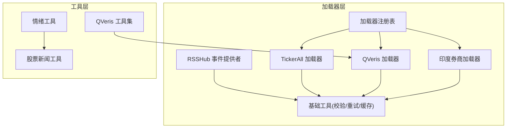
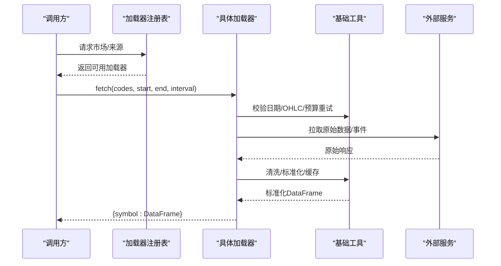
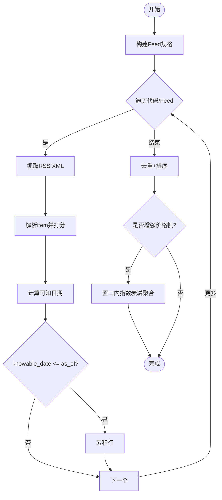
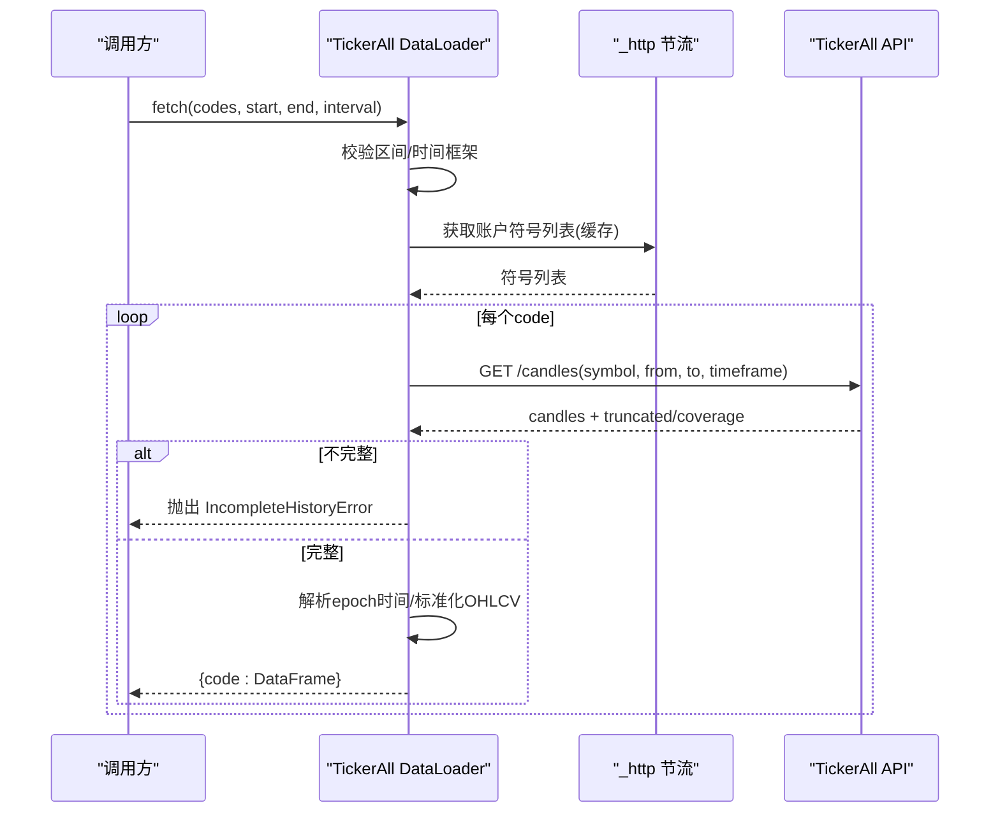
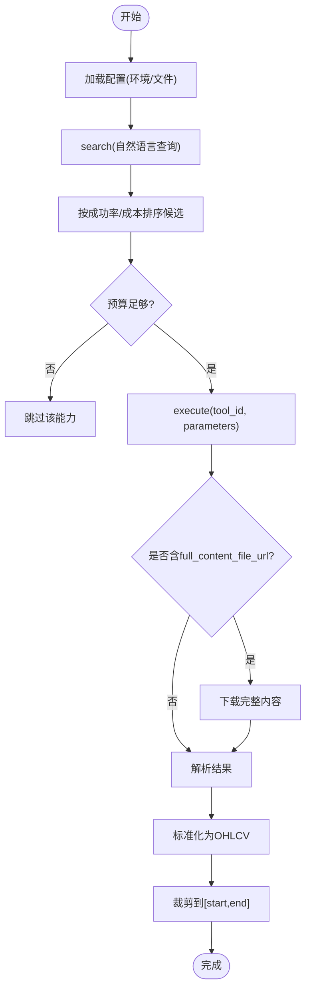
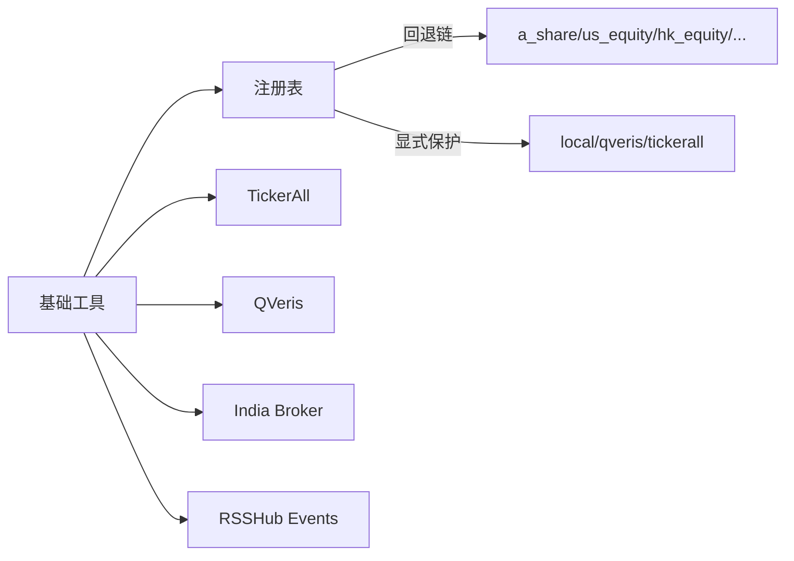

# 另类数据加载器

<cite>
**本文引用的文件**
- [agent/backtest/loaders/rsshub_events.py](file://agent/backtest/loaders/rsshub_events.py)
- [agent/backtest/loaders/tickerall_loader.py](file://agent/backtest/loaders/tickerall_loader.py)
- [agent/backtest/loaders/qveris_loader.py](file://agent/backtest/loaders/qveris_loader.py)
- [agent/backtest/loaders/india_broker_loader.py](file://agent/backtest/loaders/india_broker_loader.py)
- [agent/backtest/loaders/base.py](file://agent/backtest/loaders/base.py)
- [agent/backtest/loaders/registry.py](file://agent/backtest/loaders/registry.py)
- [agent/src/tools/sentiment_tool.py](file://agent/src/tools/sentiment_tool.py)
- [agent/src/tools/stock_news_tool.py](file://agent/src/tools/stock_news_tool.py)
- [agent/src/tools/qveris_tool.py](file://agent/src/tools/qveris_tool.py)
</cite>

## 目录
1. [简介](#简介)
2. [项目结构](#项目结构)
3. [核心组件](#核心组件)
4. [架构总览](#架构总览)
5. [详细组件分析](#详细组件分析)
6. [依赖关系分析](#依赖关系分析)
7. [性能与成本优化](#性能与成本优化)
8. [故障排查指南](#故障排查指南)
9. [结论](#结论)
10. [附录：在量化策略中的应用案例](#附录在量化策略中的应用案例)

## 简介
本技术文档聚焦于“另类数据加载器”的集成与实践，覆盖以下关键能力：
- RSSHub 事件流（新闻/公告/情绪）的点时安全注入与衰减聚合
- TickerAll 托管 MetaTrader 5 行情（外汇、贵金属、CFD）的跨平台 HTTP 获取
- QVeris 机构持仓与多市场数据的付费路由、预算控制与结果标准化
- 印度券商（Shoonya/Dhan）历史 K 线桥接，补齐本地账户视角的历史数据
- 实时新闻流、社交媒体情绪、宏观事件监测等新兴数据源的工程化接入
- 数据质量控制、延迟处理与成本优化的实践指南

## 项目结构
本项目将“数据源加载器”统一抽象为可注册、可回退、可缓存的模块，并通过工具层暴露给上层策略与研究流程。

图表来源
- [agent/backtest/loaders/rsshub_events.py:288-400](file://agent/backtest/loaders/rsshub_events.py#L288-L400)
- [agent/backtest/loaders/tickerall_loader.py:208-339](file://agent/backtest/loaders/tickerall_loader.py#L208-L339)
- [agent/backtest/loaders/qveris_loader.py:260-381](file://agent/backtest/loaders/qveris_loader.py#L260-L381)
- [agent/backtest/loaders/india_broker_loader.py:118-195](file://agent/backtest/loaders/india_broker_loader.py#L118-L195)
- [agent/backtest/loaders/base.py:398-450](file://agent/backtest/loaders/base.py#L398-L450)
- [agent/backtest/loaders/registry.py:139-158](file://agent/backtest/loaders/registry.py#L139-L158)
- [agent/src/tools/sentiment_tool.py:94-147](file://agent/src/tools/sentiment_tool.py#L94-L147)
- [agent/src/tools/stock_news_tool.py:245-387](file://agent/src/tools/stock_news_tool.py#L245-L387)
- [agent/src/tools/qveris_tool.py:394-665](file://agent/src/tools/qveris_tool.py#L394-L665)

章节来源
- [agent/backtest/loaders/registry.py:139-158](file://agent/backtest/loaders/registry.py#L139-L158)
- [agent/backtest/loaders/base.py:243-441](file://agent/backtest/loaders/base.py#L243-L441)

## 核心组件
- RSSHub 事件提供者：从自托管 RSSHub 拉取新闻/公告/情绪事件，标准化为事件驱动 schema，并基于“可知日期”进行点时安全过滤；支持可插拔评分器与指数衰减聚合。
- TickerAll 加载器：通过 REST 获取外汇/贵金属/CFD 的 OHLCV，严格校验完整性，拒绝静默截断的历史。
- QVeris 加载器：付费路由的数据发现与执行，自动选择合适的能力，按会话信用预算控制调用，标准化输出标准 OHLCV。
- 印度券商加载器：适配 Shoonya/Dhan 的历史 K 线接口，补齐本地账户视角的历史数据。
- 基础工具：统一的日期校验、OHLC 结构校验、带预算的重试机制、可选本地 Parquet 缓存。
- 注册表：市场级回退链与显式来源保护（如 local、qveris、tickerall 不静默降级）。

章节来源
- [agent/backtest/loaders/rsshub_events.py:288-400](file://agent/backtest/loaders/rsshub_events.py#L288-L400)
- [agent/backtest/loaders/tickerall_loader.py:208-339](file://agent/backtest/loaders/tickerall_loader.py#L208-L339)
- [agent/backtest/loaders/qveris_loader.py:260-381](file://agent/backtest/loaders/qveris_loader.py#L260-L381)
- [agent/backtest/loaders/india_broker_loader.py:118-195](file://agent/backtest/loaders/india_broker_loader.py#L118-L195)
- [agent/backtest/loaders/base.py:168-256](file://agent/backtest/loaders/base.py#L168-L256)
- [agent/backtest/loaders/base.py:398-450](file://agent/backtest/loaders/base.py#L398-L450)
- [agent/backtest/loaders/base.py:243-441](file://agent/backtest/loaders/base.py#L243-L441)
- [agent/backtest/loaders/registry.py:119-158](file://agent/backtest/loaders/registry.py#L119-L158)

## 架构总览
整体数据流分为“拉取—清洗—标准化—注入”四步：
- 拉取：各加载器通过 HTTP/SDK 获取原始数据或事件流
- 清洗：去重、时间对齐、字段映射、异常值剔除
- 标准化：统一为 OHLCV 或事件驱动 schema
- 注入：将事件分数/计数附加到价格序列，供因子与策略使用

图表来源
- [agent/backtest/loaders/registry.py:614-649](file://agent/backtest/loaders/registry.py#L614-L649)
- [agent/backtest/loaders/base.py:168-256](file://agent/backtest/loaders/base.py#L168-L256)
- [agent/backtest/loaders/base.py:398-450](file://agent/backtest/loaders/base.py#L398-L450)
- [agent/backtest/loaders/base.py:623-661](file://agent/backtest/loaders/base.py#L623-L661)

## 详细组件分析

### RSSHub 事件提供者
- 功能要点
  - 从自托管 RSSHub 拉取 XML 事件，解析为统一事件表（ts_code、knowable_date、event_type、score、source、summary）
  - 点时安全：根据发布时间与收盘截止小时计算“可知日期”，仅允许 knowable_date <= as_of 的事件参与
  - 评分器可插拔：默认基于词典的正负词频打分，也可替换为 LLM 裁判
  - 事件聚合：对每个交易日窗口内的事件做指数衰减求和，生成 event_score/event_count 列
- 关键流程
  - 查询事件：遍历 feeds/codes，抓取 XML，解析 item，计算 score，过滤未来事件，去重排序
  - 增强价格帧：按日窗口聚合事件，应用衰减函数，裁剪至 [-1,1]
- 错误与健壮性
  - 所有 feed 均失败则抛出明确错误；部分失败记录日志并跳过
  - 使用 defusedxml 防 XXE/实体膨胀攻击
  - 超时与预算控制：通过 retry_with_budget 限制单次抓取耗时

图表来源
- [agent/backtest/loaders/rsshub_events.py:343-400](file://agent/backtest/loaders/rsshub_events.py#L343-L400)
- [agent/backtest/loaders/rsshub_events.py:501-569](file://agent/backtest/loaders/rsshub_events.py#L501-L569)
- [agent/backtest/loaders/base.py:398-450](file://agent/backtest/loaders/base.py#L398-L450)

章节来源
- [agent/backtest/loaders/rsshub_events.py:288-400](file://agent/backtest/loaders/rsshub_events.py#L288-L400)
- [agent/backtest/loaders/rsshub_events.py:501-569](file://agent/backtest/loaders/rsshub_events.py#L501-L569)

### TickerAll 加载器
- 功能要点
  - 通过 REST 获取外汇/贵金属/CFD 的 OHLCV，无需本地 MT5 终端
  - 严格完整性检查：若 API 返回 truncated 或不完整 coverage，直接抛出不完整历史错误，避免静默短序列
  - 符号解析：按账户符号列表解析 broker symbol，兼容 Exness 等后缀
  - 节流与会话复用：通过共享最小间隔与 session 降低频率风险
- 关键流程
  - 校验区间与时间框架映射
  - 按账户与 base_url 缓存符号列表
  - 调用 /candles，解析 epoch 时间戳，构造 OHLCV 并裁剪到窗口
- 错误与健壮性
  - range_too_large 400 转换为 IncompleteHistoryError
  - 单标的失败不影响批次，其他标的继续执行

图表来源
- [agent/backtest/loaders/tickerall_loader.py:224-339](file://agent/backtest/loaders/tickerall_loader.py#L224-L339)
- [agent/backtest/loaders/tickerall_loader.py:341-394](file://agent/backtest/loaders/tickerall_loader.py#L341-L394)
- [agent/backtest/loaders/tickerall_loader.py:397-458](file://agent/backtest/loaders/tickerall_loader.py#L397-L458)

章节来源
- [agent/backtest/loaders/tickerall_loader.py:208-339](file://agent/backtest/loaders/tickerall_loader.py#L208-L339)
- [agent/backtest/loaders/tickerall_loader.py:341-458](file://agent/backtest/loaders/tickerall_loader.py#L341-L458)

### QVeris 加载器
- 功能要点
  - 付费路由：仅在显式启用且配置了 API Key 与 paid 模式时可用
  - 能力发现与选择：自然语言搜索 + 成功率/成本排序，优先匹配所需粒度（日/分钟/周/月）
  - 预算控制：按会话信用预算预留与扣减，防止超支
  - 结果标准化：多种 provider 形状统一为 OHLCV 表格
- 关键流程
  - 读取配置与环境覆盖
  - search(query) -> select_capabilities() -> build_parameters() -> execute(tool_id, params)
  - 解析 result，迭代嵌套结构，提取 OHLCV 记录，构造 DataFrame 并裁剪窗口
- 错误与健壮性
  - 429 限流：读取 Retry-After 并重试
  - 预算超限：提前拒绝，避免无效请求
  - 结果无条：记录警告并跳过

图表来源
- [agent/backtest/loaders/qveris_loader.py:113-152](file://agent/backtest/loaders/qveris_loader.py#L113-L152)
- [agent/backtest/loaders/qveris_loader.py:199-276](file://agent/backtest/loaders/qveris_loader.py#L199-L276)
- [agent/backtest/loaders/qveris_loader.py:276-381](file://agent/backtest/loaders/qveris_loader.py#L276-L381)
- [agent/backtest/loaders/qveris_loader.py:387-580](file://agent/backtest/loaders/qveris_loader.py#L387-L580)

章节来源
- [agent/backtest/loaders/qveris_loader.py:260-381](file://agent/backtest/loaders/qveris_loader.py#L260-L381)
- [agent/backtest/loaders/qveris_loader.py:387-580](file://agent/backtest/loaders/qveris_loader.py#L387-L580)

### 印度券商加载器
- 功能要点
  - 桥接 Shoonya/Dhan 的历史 K 线接口，适配交易所后缀（NSE/BSE）
  - 仅支持有限周期集合（1m/5m/15m/30m/1h/1d），不支持的周期直接拒绝
  - 请求最近 bars 并裁剪到目标窗口，适合匹配本地账户视角的回测
- 关键流程
  - 解析 period 映射，计算 limit 以覆盖窗口
  - 调用 get_historical_bars，转换 time 为索引，标准化 OHLCV
- 错误与健壮性
  - 接口差异（exchange vs exchange_segment）自动回退
  - 单标的失败不影响批次

章节来源
- [agent/backtest/loaders/india_broker_loader.py:50-116](file://agent/backtest/loaders/india_broker_loader.py#L50-L116)
- [agent/backtest/loaders/india_broker_loader.py:118-195](file://agent/backtest/loaders/india_broker_loader.py#L118-L195)

### 情绪与新闻工具（补充）
- 情绪工具：提供文本情绪打分（词典法）与加密恐惧贪婪指数获取，便于快速情绪信号构建
- 股票新闻工具：聚合东方财富（A股/中国）与 Yahoo Finance（美股/港股）的新闻标题与摘要，统一格式输出

章节来源
- [agent/src/tools/sentiment_tool.py:94-147](file://agent/src/tools/sentiment_tool.py#L94-L147)
- [agent/src/tools/stock_news_tool.py:245-387](file://agent/src/tools/stock_news_tool.py#L245-L387)

## 依赖关系分析
- 加载器注册表维护市场级回退链，确保在某个来源不可用时自动降级到更稳定的公开源
- 显式来源保护：local、qveris、tickerall 不会静默降级到其他网络源，避免误用用户凭据或隐藏配置问题
- 基础工具被多个加载器复用：日期校验、OHLC 结构校验、预算重试、本地缓存

图表来源
- [agent/backtest/loaders/registry.py:119-158](file://agent/backtest/loaders/registry.py#L119-L158)
- [agent/backtest/loaders/base.py:243-441](file://agent/backtest/loaders/base.py#L243-L441)

章节来源
- [agent/backtest/loaders/registry.py:119-158](file://agent/backtest/loaders/registry.py#L119-L158)
- [agent/backtest/loaders/base.py:243-441](file://agent/backtest/loaders/base.py#L243-L441)

## 性能与成本优化
- 请求节流与会话复用
  - TickerAll：进程级最小间隔与共享 session，降低频率风险
  - QVeris：最小请求间隔与 429 Retry-After 处理
- 预算与重试
  - RSSHub：wall-clock 预算 + 重试，避免长时间阻塞
  - QVeris：会话信用预算预留与扣减，防止超支
- 本地缓存
  - 可选 Parquet 缓存，键由 source/symbol/timeframe/start/end/fields 哈希生成
  - 仅对已结算日期范围写入，避免缓存未闭合的 bar
- 数据质量
  - OHLC 结构校验：丢弃 high < low、非正价格等非法 bar
  - 完整性检查：TickerAll 对 truncated/incomplete 直接报错，避免静默短序列

章节来源
- [agent/backtest/loaders/base.py:398-450](file://agent/backtest/loaders/base.py#L398-L450)
- [agent/backtest/loaders/base.py:243-441](file://agent/backtest/loaders/base.py#L243-L441)
- [agent/backtest/loaders/tickerall_loader.py:341-394](file://agent/backtest/loaders/tickerall_loader.py#L341-L394)
- [agent/backtest/loaders/qveris_loader.py:256-276](file://agent/backtest/loaders/qveris_loader.py#L256-L276)

## 故障排查指南
- RSSHub 全部失败
  - 现象：所有 feed 抓取失败
  - 处理：抛出 EventProviderError，检查 base_url、feeds 配置与网络可达性
- TickerAll 不完整历史
  - 现象：API 返回 truncated 或 coverage 非 complete/full
  - 处理：抛出 IncompleteHistoryError，缩小日期范围或降低时间粒度
- QVeris 预算超限
  - 现象：执行前预算不足
  - 处理：调整 budget_credits_per_session 或减少调用次数
- 印度券商接口差异
  - 现象：exchange 参数不兼容
  - 处理：自动回退到 exchange_segment 调用
- 通用 OHLC 校验失败
  - 现象：high < low 或非正价格
  - 处理：按策略 drop/warn/raise，建议 drop 并记录日志

章节来源
- [agent/backtest/loaders/rsshub_events.py:383-391](file://agent/backtest/loaders/rsshub_events.py#L383-L391)
- [agent/backtest/loaders/tickerall_loader.py:341-394](file://agent/backtest/loaders/tickerall_loader.py#L341-L394)
- [agent/backtest/loaders/qveris_loader.py:347-381](file://agent/backtest/loaders/qveris_loader.py#L347-L381)
- [agent/backtest/loaders/india_broker_loader.py:178-197](file://agent/backtest/loaders/india_broker_loader.py#L178-L197)
- [agent/backtest/loaders/base.py:187-256](file://agent/backtest/loaders/base.py#L187-L256)

## 结论
本方案通过统一的加载器协议、注册表回退机制与基础工具，实现了多源另类数据的稳定接入与高质量输出。RSSHub 事件流提供了点时安全的新闻/情绪注入；TickerAll 解决了跨平台外汇/贵金属行情获取；QVeris 提供了付费能力的智能选择与预算控制；印度券商加载器补齐了本地账户视角的历史数据。配合情绪与新闻工具，可在量化策略中实现情绪因子、资金流向追踪与宏观事件监测。

## 附录：在量化策略中的应用案例
- 情绪分析
  - 使用 RSSHub 事件流与词典评分器，生成 event_score 作为情绪因子；结合 StockNewsTool 与 SentimentTool 的文本打分，构建混合情绪信号
- 资金流向追踪
  - 利用 QVeris 机构持仓数据（需付费模式），跟踪大资金动向；结合 TickerAll 的外汇/贵金属流动性指标，识别资金迁移
- 宏观事件监测
  - 通过 RSSHub 事件流捕获政策/宏观事件，按窗口衰减聚合，形成宏观冲击因子；结合新闻工具的全球头条，捕捉突发风险
- 卫星图像分析（概念扩展）
  - 可将卫星图像特征（如港口活动、农场产量）作为另类因子输入模型；在本项目中可通过本地加载器接入清洗后的图像特征数据集，与价格序列对齐后训练因子模型

[本节为概念性说明，不直接分析具体文件]