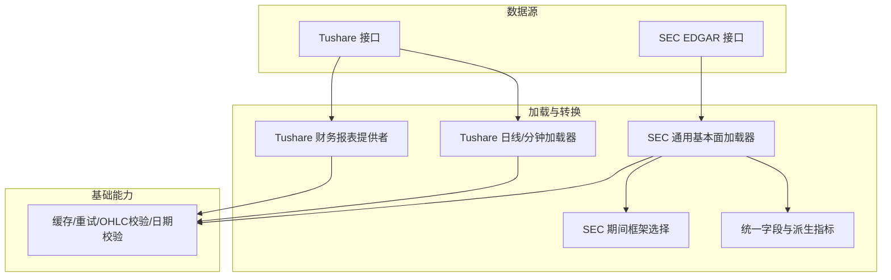
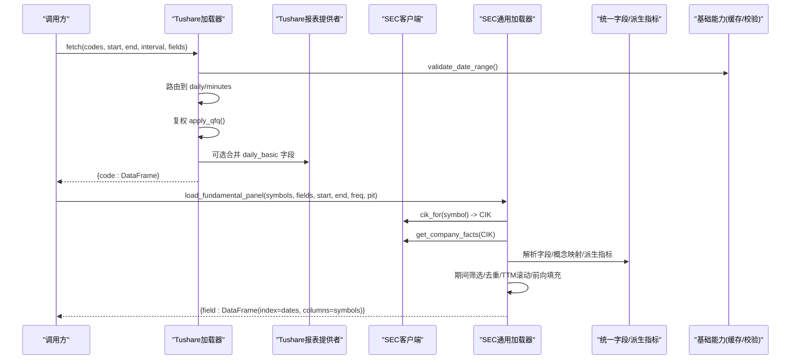
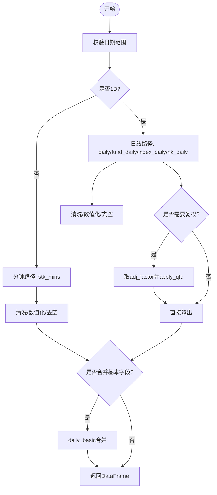
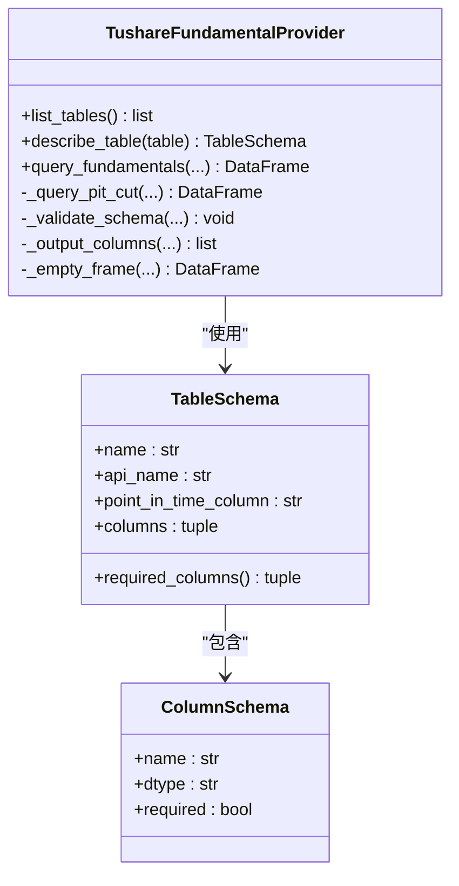
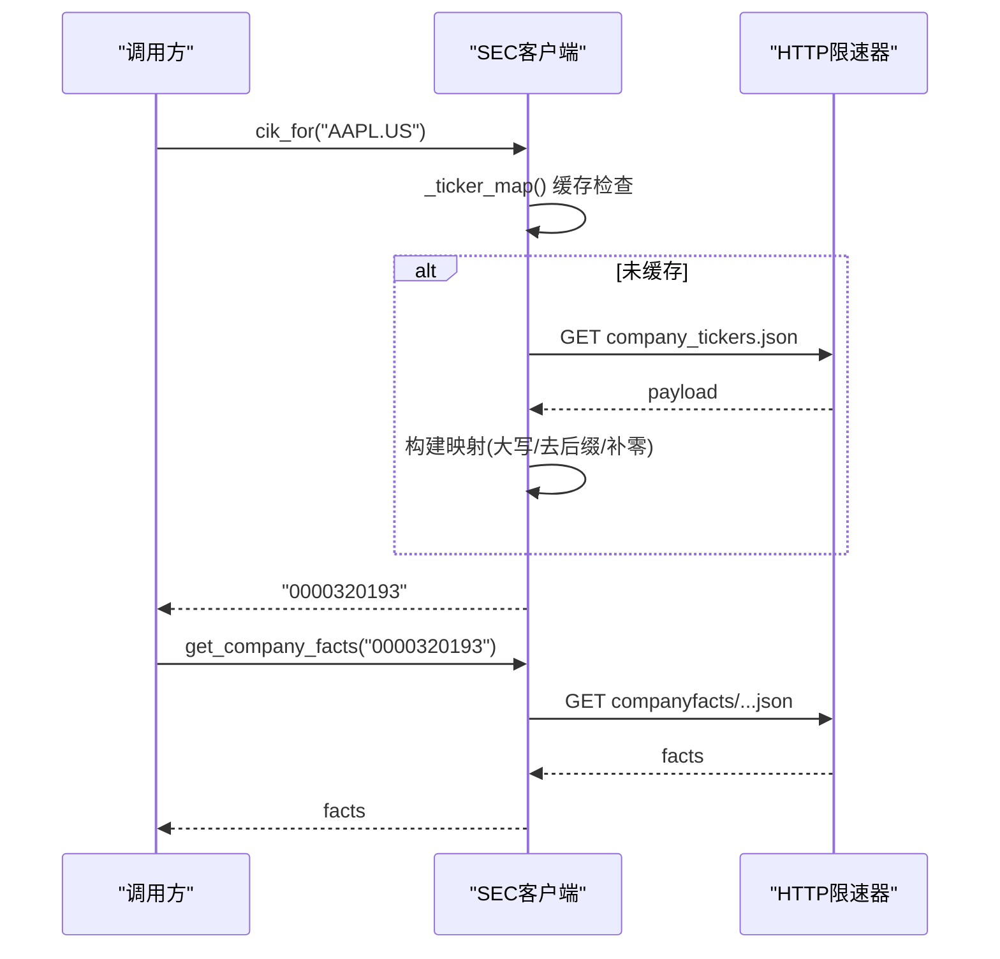
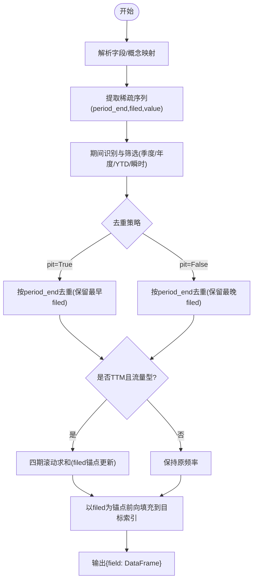
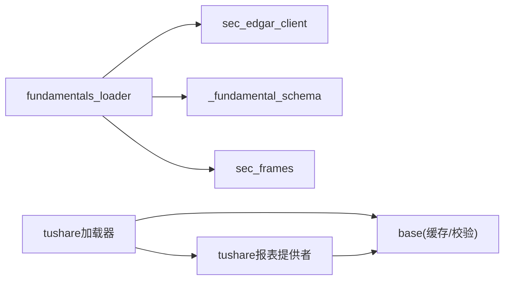

# 基本面数据加载器

<cite>
**本文引用的文件**
- [tushare.py](file://agent/backtest/loaders/tushare.py)
- [tushare_fundamentals.py](file://agent/backtest/loaders/tushare_fundamentals.py)
- [sec_edgar_client.py](file://agent/backtest/loaders/sec_edgar_client.py)
- [fundamentals_loader.py](file://agent/backtest/loaders/fundamentals_loader.py)
- [_fundamental_schema.py](file://agent/backtest/loaders/_fundamental_schema.py)
- [sec_frames.py](file://agent/backtest/loaders/sec_frames.py)
- [base.py](file://agent/backtest/loaders/base.py)
- [test_tushare_fundamentals_provider.py](file://agent/tests/test_tushare_fundamentals_provider.py)
- [test_sec_edgar_client.py](file://agent/tests/test_sec_edgar_client.py)
- [test_fundamentals_pit.py](file://agent/tests/test_fundamentals_pit.py)
</cite>

## 目录
1. [简介](#简介)
2. [项目结构](#项目结构)
3. [核心组件](#核心组件)
4. [架构总览](#架构总览)
5. [详细组件分析](#详细组件分析)
6. [依赖关系分析](#依赖关系分析)
7. [性能与可用性](#性能与可用性)
8. [故障排查指南](#故障排查指南)
9. [结论](#结论)
10. [附录：使用示例与最佳实践](#附录使用示例与最佳实践)

## 简介
本文件面向“基本面数据加载器”的完整技术文档，覆盖以下能力与要点：
- 财务数据、公司事件、监管文件的获取与处理（A股 Tushare、美国 SEC EDGAR XBRL、通用基本面加载器）。
- 财务报表解析、指标计算、数据标准化流程。
- 质量验证、缺失值处理、历史调整（复权）等关键技术。
- 财报分析、估值建模、事件研究等应用场景的使用方式。
- 数据质量评估与异常检测方法。

## 项目结构
本项目将基本面数据加载分为三层：
- 数据源层：Tushare（A股/港股/指数/基金）、SEC EDGAR（XBRL公司事实）。
- 加载与转换层：统一字段映射、点时安全（PIT）切片、TTM/季度/年度聚合、前向填充、去重与合并。
- 基础能力层：缓存、重试、OHLC校验、日期范围校验等公共工具。

图表来源
- [tushare.py:116-205](file://agent/backtest/loaders/tushare.py#L116-L205)
- [tushare_fundamentals.py:118-187](file://agent/backtest/loaders/tushare_fundamentals.py#L118-L187)
- [sec_edgar_client.py:166-227](file://agent/backtest/loaders/sec_edgar_client.py#L166-L227)
- [fundamentals_loader.py:196-277](file://agent/backtest/loaders/fundamentals_loader.py#L196-L277)
- [_fundamental_schema.py:28-189](file://agent/backtest/loaders/_fundamental_schema.py#L28-L189)
- [sec_frames.py:29-129](file://agent/backtest/loaders/sec_frames.py#L29-L129)
- [base.py:168-256](file://agent/backtest/loaders/base.py#L168-L256)

章节来源
- [tushare.py:116-205](file://agent/backtest/loaders/tushare.py#L116-L205)
- [sec_edgar_client.py:166-227](file://agent/backtest/loaders/sec_edgar_client.py#L166-L227)
- [fundamentals_loader.py:196-277](file://agent/backtest/loaders/fundamentals_loader.py#L196-L277)
- [_fundamental_schema.py:28-189](file://agent/backtest/loaders/_fundamental_schema.py#L28-L189)
- [sec_frames.py:29-129](file://agent/backtest/loaders/sec_frames.py#L29-L129)
- [base.py:168-256](file://agent/backtest/loaders/base.py#L168-L256)

## 核心组件
- Tushare 日线/分钟加载器：负责 A 股、港股、指数、基金的 OHLCV 抓取、复权、可选基本字段合并。
- Tushare 财务报表提供者：按表元数据查询利润表、资产负债表、现金流量表及指标，提供 PIT 切片与去重。
- SEC EDGAR 客户端：ticker->CIK 映射、提交索引与公司事实 JSON 获取，带限流与合规 UA。
- 通用基本面加载器：将稀疏 XBRL 事实转换为按日对齐的面板，支持 annual/quarterly/ttm，并做 PIT 前向填充。
- 统一字段与派生指标：定义 RAW_FIELDS、DERIVED_FIELDS 与 SEC_CONCEPT_MAP，实现跨源字段统一与指标计算。
- SEC 期间框架选择：识别瞬时、季度、年度、YTD 期间，避免同期末不同期间的混淆。
- 基础能力：缓存、重试、OHLC 校验、日期范围校验等。

章节来源
- [tushare.py:116-386](file://agent/backtest/loaders/tushare.py#L116-L386)
- [tushare_fundamentals.py:110-380](file://agent/backtest/loaders/tushare_fundamentals.py#L110-L380)
- [sec_edgar_client.py:1-235](file://agent/backtest/loaders/sec_edgar_client.py#L1-L235)
- [fundamentals_loader.py:1-501](file://agent/backtest/loaders/fundamentals_loader.py#L1-L501)
- [_fundamental_schema.py:1-227](file://agent/backtest/loaders/_fundamental_schema.py#L1-L227)
- [sec_frames.py:1-129](file://agent/backtest/loaders/sec_frames.py#L1-L129)
- [base.py:1-657](file://agent/backtest/loaders/base.py#L1-L657)

## 架构总览
下图展示从请求到面板产出的端到端调用链，涵盖 Tushare 与 SEC 两条路径。

图表来源
- [tushare.py:148-211](file://agent/backtest/loaders/tushare.py#L148-L211)
- [tushare.py:207-268](file://agent/backtest/loaders/tushare.py#L207-L268)
- [tushare_fundamentals.py:144-187](file://agent/backtest/loaders/tushare_fundamentals.py#L144-L187)
- [sec_edgar_client.py:166-227](file://agent/backtest/loaders/sec_edgar_client.py#L166-L227)
- [fundamentals_loader.py:196-277](file://agent/backtest/loaders/fundamentals_loader.py#L196-L277)
- [_fundamental_schema.py:28-189](file://agent/backtest/loaders/_fundamental_schema.py#L28-L189)
- [base.py:168-256](file://agent/backtest/loaders/base.py#L168-L256)

## 详细组件分析

### Tushare 日线/分钟加载器
- 功能要点
  - 支持 1D/1m/5m/15m/30m/1H；非 1D 走分钟路径，否则走日线路径。
  - 自动识别标的类型（指数、ETF、港股、美股、加密货币），对不支持的路径跳过或告警。
  - 日线路径可合并 daily_basic 基本字段（如 PE、PB 等）。
  - 复权：优先取 adj_factor 后应用前复权；若不可用则丢弃该标的，避免回测偏差。
  - 限流：针对 Tushare 每分钟配额拒绝进行退避重试。
- 关键流程
  - 日期校验 -> 区间归一化 -> 标的路由 -> 拉取 -> 清洗 -> 复权 -> 可选合并基本字段 -> 返回。

图表来源
- [tushare.py:148-211](file://agent/backtest/loaders/tushare.py#L148-L211)
- [tushare.py:207-268](file://agent/backtest/loaders/tushare.py#L207-L268)
- [tushare.py:361-414](file://agent/backtest/loaders/tushare.py#L361-L414)
- [tushare.py:416-476](file://agent/backtest/loaders/tushare.py#L416-L476)

章节来源
- [tushare.py:116-386](file://agent/backtest/loaders/tushare.py#L116-L386)

### Tushare 财务报表提供者
- 功能要点
  - 声明式表元数据（列名、必填列、点时列），用于校验与输出控制。
  - query_fundamentals 支持 as_of 切片、periods 过滤、fields 选择。
  - PIT 去重：同一 (ts_code, end_date) 保留最新有效披露日（优先 f_ann_date，否则 ann_date）。
  - enrich_price_frames_with_fundamentals：将报表快照以“披露可见性”附加到价格序列，避免未来函数。
- 关键流程
  - 拉取全量 -> 校验 schema -> 按 as_of 切分 -> 构建有效时间线 -> 去重 -> 输出。

图表来源
- [tushare_fundamentals.py:33-53](file://agent/backtest/loaders/tushare_fundamentals.py#L33-L53)
- [tushare_fundamentals.py:118-187](file://agent/backtest/loaders/tushare_fundamentals.py#L118-L187)
- [tushare_fundamentals.py:189-259](file://agent/backtest/loaders/tushare_fundamentals.py#L189-L259)

章节来源
- [tushare_fundamentals.py:110-380](file://agent/backtest/loaders/tushare_fundamentals.py#L110-L380)

### SEC EDGAR 客户端
- 功能要点
  - ticker->CIK 映射：进程级缓存，支持 .US 后缀剥离、大小写不敏感、破折号/点号兼容。
  - 提交索引与公司事实：通过受限速率的 HTTP 获取，遵守 SEC 公平访问策略（最小间隔、UA 含联系方式）。
  - 错误传播：网络异常原样抛出，由上层重试/预算机制处理。
- 关键流程
  - 首次请求拉取 tickers.json -> 构建映射 -> 后续 cik_for 快速命中 -> 构造 URL -> 获取 submissions/companyfacts。

图表来源
- [sec_edgar_client.py:118-163](file://agent/backtest/loaders/sec_edgar_client.py#L118-L163)
- [sec_edgar_client.py:166-227](file://agent/backtest/loaders/sec_edgar_client.py#L166-L227)

章节来源
- [sec_edgar_client.py:1-235](file://agent/backtest/loaders/sec_edgar_client.py#L1-L235)

### 通用基本面加载器（SEC）
- 功能要点
  - 将稀疏 XBRL 事实转为按日对齐的面板，支持 annual/quarterly/ttm。
  - 期间识别：基于 sec_frames 的跨度窗口区分季度/年度/YTD/瞬时。
  - 去重与 PIT：按 period_end 去重，pit=True 保留最早 filed，pit=False 保留最新 filed。
  - TTM 近似：对流量型概念做四期滚动求和，并维护 filed 锚点。
  - 前向填充：以 filed 为锚点向前填充至目标日期索引。
- 关键流程
  - 解析字段 -> 解析概念 -> 提取稀疏序列 -> 期间筛选/去重 -> TTM/季度/年度聚合 -> 前向填充 -> 组装面板。

图表来源
- [fundamentals_loader.py:48-132](file://agent/backtest/loaders/fundamentals_loader.py#L48-L132)
- [fundamentals_loader.py:169-194](file://agent/backtest/loaders/fundamentals_loader.py#L169-L194)
- [fundamentals_loader.py:298-318](file://agent/backtest/loaders/fundamentals_loader.py#L298-L318)
- [sec_frames.py:29-129](file://agent/backtest/loaders/sec_frames.py#L29-L129)

章节来源
- [fundamentals_loader.py:1-501](file://agent/backtest/loaders/fundamentals_loader.py#L1-L501)
- [sec_frames.py:1-129](file://agent/backtest/loaders/sec_frames.py#L1-L129)

### 统一字段与派生指标
- 功能要点
  - RAW_FIELDS：定义原始字段（收入、成本、净利润、总资产、总负债、现金、现金流、资本支出等）。
  - DERIVED_FIELDS：派生指标（ROE、ROA、毛利率、资产增长、应计项、杠杆等），内置安全除法。
  - SEC_CONCEPT_MAP：将统一字段映射到多个 US-GAAP 概念别名，提高命中率。
- 关键点
  - 派生指标在面板维度计算，需保证输入字段已对齐。
  - 安全除法避免除零导致的无穷大。

章节来源
- [_fundamental_schema.py:28-189](file://agent/backtest/loaders/_fundamental_schema.py#L28-L189)

## 依赖关系分析
- 模块耦合
  - fundamentals_loader 依赖 sec_edgar_client 与 _fundamental_schema、sec_frames。
  - tushare_fundamentals 独立于 SEC 路径，但可与 tushare 日线加载器配合（enrich_price_frames_with_fundamentals）。
  - base 提供共享能力，被多加载器复用。
- 外部依赖
  - Tushare API（需要 token）。
  - SEC EDGAR 公开接口（无认证，受速率限制）。
- 循环依赖
  - 未发现循环导入；各模块职责清晰。

图表来源
- [fundamentals_loader.py:15-24](file://agent/backtest/loaders/fundamentals_loader.py#L15-L24)
- [tushare.py:13-16](file://agent/backtest/loaders/tushare.py#L13-L16)
- [tushare_fundamentals.py:118-131](file://agent/backtest/loaders/tushare_fundamentals.py#L118-L131)
- [base.py:240-441](file://agent/backtest/loaders/base.py#L240-L441)

章节来源
- [fundamentals_loader.py:15-24](file://agent/backtest/loaders/fundamentals_loader.py#L15-L24)
- [tushare.py:13-16](file://agent/backtest/loaders/tushare.py#L13-L16)
- [tushare_fundamentals.py:118-131](file://agent/backtest/loaders/tushare_fundamentals.py#L118-L131)
- [base.py:240-441](file://agent/backtest/loaders/base.py#L240-L441)

## 性能与可用性
- 限流与重试
  - Tushare：按分钟配额拒绝进行指数退避重试，避免误伤真实失败。
  - SEC：全局最小间隔（默认不低于 0.12s），进程内 ticker 映射缓存，减少重复请求。
- 缓存
  - 本地 Parquet 缓存（可选开关），键包含 source/symbol/timeframe/date range/fields，仅对已结算区间写入。
  - 读写失败不影响主流程，降级为实时拉取。
- 数据质量
  - OHLC 结构校验（high<low、open/close 不在 high-low 区间、非正价格等）可在 loader 边界统一处理。
  - 日期范围校验防止非法区间。
- 可用性与容错
  - 单标的失败不中断整体批量任务；日志记录便于定位。
  - SEC 公司事实拉取失败返回空面板，避免阻塞。

章节来源
- [tushare.py:18-79](file://agent/backtest/loaders/tushare.py#L18-L79)
- [sec_edgar_client.py:39-66](file://agent/backtest/loaders/sec_edgar_client.py#L39-L66)
- [base.py:168-256](file://agent/backtest/loaders/base.py#L168-L256)
- [base.py:240-441](file://agent/backtest/loaders/base.py#L240-L441)

## 故障排查指南
- Tushare 配额限制
  - 现象：出现“每分钟/每天/抽取/访问该接口/频率/ rate limit/ too many requests”等提示。
  - 处理：自动退避重试；建议降低并发或延长间隔。
- SEC 速率限制
  - 现象：频繁请求被限流或临时封禁。
  - 处理：确保遵守最小间隔；可通过环境变量自定义 UA；必要时降低请求频率。
- 数据为空或缺失
  - 现象：某标的拉不到数据或字段缺失。
  - 处理：检查 symbol 是否正确（SEC 支持 AAPL 或 AAPL.US）；确认字段是否在概念映射中；查看日志中的“concept miss”提示。
- 复权失败
  - 现象：无法获取 adj_factor。
  - 处理：Tushare 路径会丢弃该标的以避免回测偏差；检查标的类型与权限。
- 日期与区间问题
  - 现象：start > end 或格式错误。
  - 处理：使用 validate_date_range 校验；确保字符串为 YYYY-MM-DD。

章节来源
- [tushare.py:18-79](file://agent/backtest/loaders/tushare.py#L18-L79)
- [sec_edgar_client.py:39-66](file://agent/backtest/loaders/sec_edgar_client.py#L39-L66)
- [fundamentals_loader.py:508-520](file://agent/backtest/loaders/fundamentals_loader.py#L508-L520)
- [base.py:168-256](file://agent/backtest/loaders/base.py#L168-L256)

## 结论
本方案通过分层设计实现了跨市场基本面数据的稳定获取与高质量加工：
- Tushare 路径覆盖 A 股/港股/指数/基金，具备复权与基本字段合并能力。
- SEC 路径以 XBRL 为基础，提供 PIT 安全的点时面板，支持多种频率与派生指标。
- 统一的字段与指标体系降低了多源整合复杂度，配合缓存与校验提升鲁棒性。
- 测试覆盖了 PIT 行为、概念别名、CIK 映射与错误路径，保障可靠性。

## 附录：使用示例与最佳实践

### 场景一：财报分析（Tushare 报表快照）
- 步骤
  - 使用 TushareFundamentalProvider 查询 income/balancesheet/cashflow/fina_indicator。
  - 指定 as_of 与 periods，获取 PIT 安全的报表快照。
  - 使用 enrich_price_frames_with_fundamentals 将报表列附加到价格序列，列名前缀为表名。
- 参考
  - 查询与去重逻辑见 provider.query_fundamentals。
  - 价格序列增强见 enrich_price_frames_with_fundamentals。

章节来源
- [tushare_fundamentals.py:144-187](file://agent/backtest/loaders/tushare_fundamentals.py#L144-L187)
- [tushare_fundamentals.py:264-380](file://agent/backtest/loaders/tushare_fundamentals.py#L264-L380)
- [test_tushare_fundamentals_provider.py:75-94](file://agent/tests/test_tushare_fundamentals_provider.py#L75-L94)
- [test_tushare_fundamentals_provider.py:150-198](file://agent/tests/test_tushare_fundamentals_provider.py#L150-L198)

### 场景二：估值建模（SEC 面板 + 派生指标）
- 步骤
  - 调用 load_fundamental_panel 获取 revenue/net_income/total_equity 等字段面板。
  - 利用 _fundamental_schema 的 DERIVED_FIELDS 计算 ROE、ROA、leverage 等。
  - 结合价格数据计算市值相关因子（需在价格面板对齐后计算）。
- 参考
  - 字段与派生指标定义见 _fundamental_schema。
  - 面板生成与 TTM 聚合见 fundamentals_loader。

章节来源
- [_fundamental_schema.py:28-189](file://agent/backtest/loaders/_fundamental_schema.py#L28-L189)
- [fundamentals_loader.py:196-277](file://agent/backtest/loaders/fundamentals_loader.py#L196-L277)

### 场景三：事件研究（SEC 披露可见性）
- 步骤
  - 使用 PIT 模式（pit=True）确保仅在 filed 日期之后可见，避免未来函数。
  - 以 filed 为锚点进行前向填充，得到连续的时间序列。
  - 围绕事件窗口比较收益与基本面变化。
- 参考
  - PIT 行为与 filed 锚点前向填充见 fundamentals_loader。
  - 测试用例覆盖 filed 可见性与重述处理。

章节来源
- [fundamentals_loader.py:169-194](file://agent/backtest/loaders/fundamentals_loader.py#L169-L194)
- [test_fundamentals_pit.py:71-101](file://agent/tests/test_fundamentals_pit.py#L71-L101)
- [test_fundamentals_pit.py:104-145](file://agent/tests/test_fundamentals_pit.py#L104-L145)
- [test_fundamentals_pit.py:147-176](file://agent/tests/test_fundamentals_pit.py#L147-L176)

### 数据质量评估与异常检测
- 建议方法
  - 在 loader 边界调用 OHLC 校验，剔除结构性无效 K 线。
  - 统计缺失率与异常值比例，设置阈值告警。
  - 对 SEC 面板检查 concept alias 命中率，缺失时记录日志并评估覆盖度。
  - 对 Tushare 复权失败标的进行标记与排除。
- 参考
  - OHLC 校验与日期范围校验见 base。
  - SEC 概念缺失日志见 fundamentals_loader。

章节来源
- [base.py:168-256](file://agent/backtest/loaders/base.py#L168-L256)
- [fundamentals_loader.py:508-520](file://agent/backtest/loaders/fundamentals_loader.py#L508-L520)