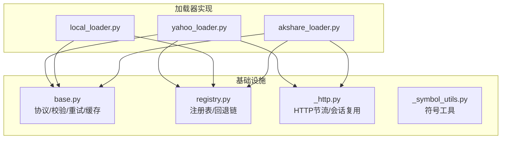
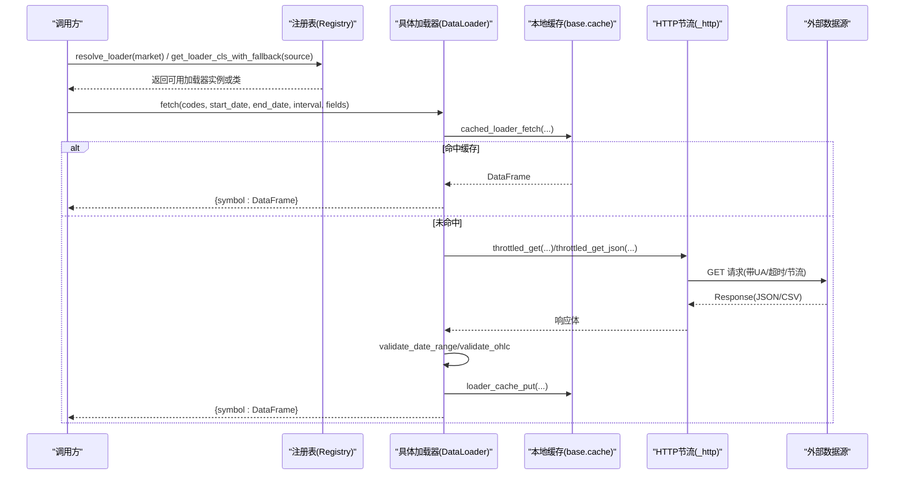
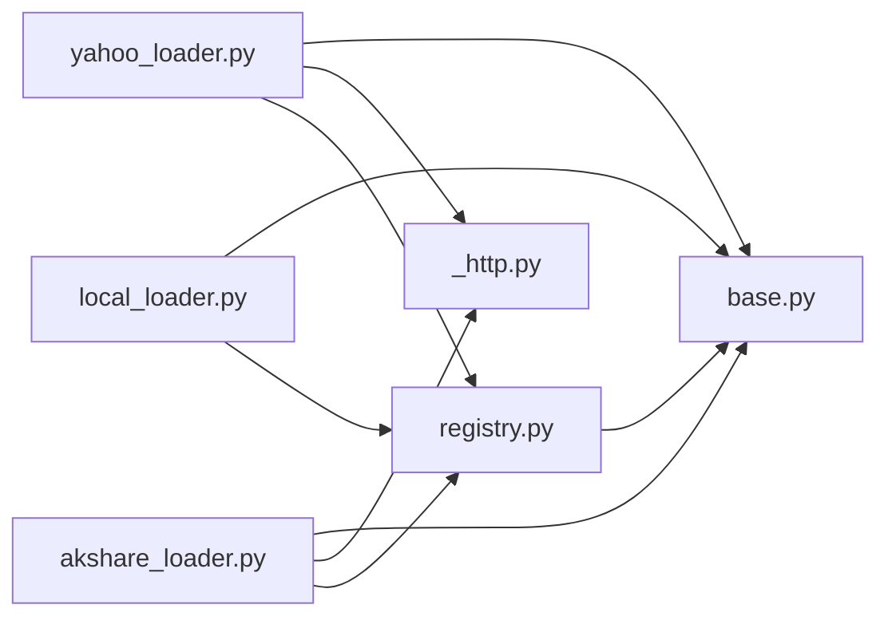
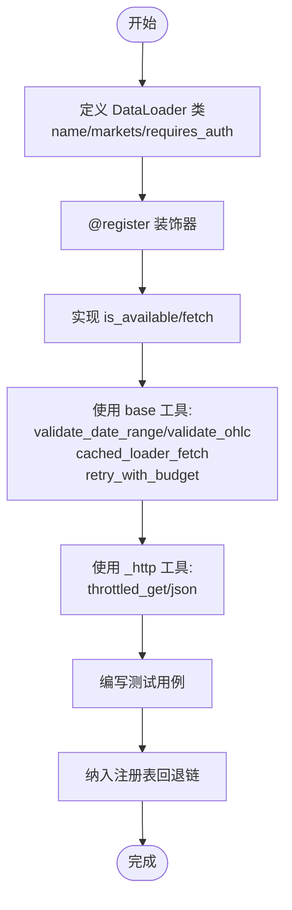

# 基础加载器架构

<cite>
**本文引用的文件**
- [base.py](file://agent/backtest/loaders/base.py)
- [registry.py](file://agent/backtest/loaders/registry.py)
- [_symbol_utils.py](file://agent/backtest/loaders/_symbol_utils.py)
- [_http.py](file://agent/backtest/loaders/_http.py)
- [yahoo_loader.py](file://agent/backtest/loaders/yahoo_loader.py)
- [local_loader.py](file://agent/backtest/loaders/local_loader.py)
- [akshare_loader.py](file://agent/backtest/loaders/akshare_loader.py)
</cite>

## 目录
1. [简介](#简介)
2. [项目结构](#项目结构)
3. [核心组件](#核心组件)
4. [架构总览](#架构总览)
5. [详细组件分析](#详细组件分析)
6. [依赖关系分析](#依赖关系分析)
7. [性能考量](#性能考量)
8. [故障排查指南](#故障排查指南)
9. [结论](#结论)
10. [附录：自定义加载器开发指南](#附录自定义加载器开发指南)

## 简介
本文件面向市场数据加载器基础架构，系统性阐述以下主题：
- BaseLoader 抽象与统一接口、错误处理、重试机制与性能监控
- 加载器注册表的工作原理：动态发现、依赖管理与版本控制
- 符号工具函数：股票代码标准化、市场识别、交易时间处理等
- 自定义加载器的开发指南：继承基类最佳实践、接口实现要求与测试策略
- 架构图与代码示例路径，展示如何扩展新的数据源

## 项目结构
市场数据加载子系统位于 backtest/loaders 目录下，采用“协议 + 注册表 + 具体加载器”的分层设计：
- base.py：定义 DataLoaderProtocol 协议、通用校验、重试/预算、本地缓存等基础设施
- registry.py：维护全局加载器注册表、按市场的回退链、自动发现与依赖管理
- _http.py：进程级 HTTP 节流与会话复用，避免被免费数据源封禁
- _symbol_utils.py：ETF/LOF 前缀识别等符号工具
- 各具体加载器（如 yahoo_loader、local_loader、akshare_loader）通过 @register 装饰器自注册

**图表来源**
- [base.py:1-657](file://agent/backtest/loaders/base.py#L1-L657)
- [registry.py:1-256](file://agent/backtest/loaders/registry.py#L1-L256)
- [_http.py:1-201](file://agent/backtest/loaders/_http.py#L1-L201)
- [_symbol_utils.py:1-21](file://agent/backtest/loaders/_symbol_utils.py#L1-L21)
- [yahoo_loader.py:1-200](file://agent/backtest/loaders/yahoo_loader.py#L1-L200)
- [local_loader.py:1-200](file://agent/backtest/loaders/local_loader.py#L1-L200)
- [akshare_loader.py:1-200](file://agent/backtest/loaders/akshare_loader.py#L1-L200)

**章节来源**
- [base.py:1-657](file://agent/backtest/loaders/base.py#L1-L657)
- [registry.py:1-256](file://agent/backtest/loaders/registry.py#L1-L256)

## 核心组件
- DataLoaderProtocol：统一的 fetch 接口，约定 name/markets/requires_auth/volume_units 及 is_available/fetch 方法
- 校验与清洗：validate_date_range、validate_ohlc 保证 OHLC 不变量与日期合法性
- 重试与预算：retry_with_budget、check_budget 提供带超时预算的指数退避重试
- 本地缓存：loader_cache_* 系列函数基于内容寻址键与 Parquet 存储，支持元数据与索引类型恢复
- 注册表：@register 装饰器将加载器加入 LOADER_REGISTRY；resolve_loader/get_loader_cls_with_fallback 实现按市场回退链选择可用加载器
- HTTP 节流：HostThrottle 与 throttled_get/throttled_get_json 对同 host 的请求进行最小间隔控制并复用 Session

**章节来源**
- [base.py:164-256](file://agent/backtest/loaders/base.py#L164-L256)
- [base.py:127-236](file://agent/backtest/loaders/base.py#L127-L236)
- [base.py:243-441](file://agent/backtest/loaders/base.py#L243-L441)
- [registry.py:23-117](file://agent/backtest/loaders/registry.py#L23-L117)
- [registry.py:139-196](file://agent/backtest/loaders/registry.py#L139-L196)
- [_http.py:46-173](file://agent/backtest/loaders/_http.py#L46-L173)

## 架构总览
下图展示了从调用方到具体数据源的请求流：调用方通过注册表解析市场或指定 source，得到可用加载器实例后调用 fetch；加载器内部可能使用 HTTP 节流、本地缓存、OHLC 校验等能力。

**图表来源**
- [registry.py:614-649](file://agent/backtest/loaders/registry.py#L614-L649)
- [base.py:565-661](file://agent/backtest/loaders/base.py#L565-L661)
- [_http.py:141-201](file://agent/backtest/loaders/_http.py#L141-L201)
- [yahoo_loader.py:173-200](file://agent/backtest/loaders/yahoo_loader.py#L173-L200)

## 详细组件分析

### BaseLoader 抽象与统一接口
- 协议定义：DataLoaderProtocol 强制实现 name/markets/requires_auth/is_available/fetch，确保所有加载器对外一致
- 数据契约：fetch 返回 {symbol: DataFrame(trade_date, open, high, low, close, volume)}，便于下游引擎统一消费
- 体积单位声明：volume_units 可选，声明不同市场的 volume 单位（如 A 股为手，美股/港股为股），消费者据此做归一化

**章节来源**
- [base.py:851-887](file://agent/backtest/loaders/base.py#L851-L887)

### 错误处理机制
- 无可用源异常：NoAvailableSourceError 用于标记某市场无可用的数据源
- OHLC 校验：validate_ohlc 在加载边界处剔除结构性无效 K 线（high<low、价格非正等），支持 drop/warn/raise 三种策略
- 日期校验：validate_date_range 确保 start_date <= end_date 且格式正确

**章节来源**
- [base.py:164-184](file://agent/backtest/loaders/base.py#L164-L184)
- [base.py:187-256](file://agent/backtest/loaders/base.py#L187-L256)

### 重试逻辑与预算控制
- retry_with_budget：针对声明的瞬态异常进行有限次重试，结合单调时钟 deadline 控制总耗时，失败时包装为 TimeoutError
- check_budget：在分页拉取等长循环中快速失败，避免耗尽预算继续请求
- 环境变量：positive_env_int/float 安全读取配置，非法值降级为默认值

**章节来源**
- [base.py:127-236](file://agent/backtest/loaders/base.py#L127-L236)

### 性能监控与本地缓存
- 内容寻址键：make_loader_cache_key 基于 source/symbol/timeframe/date range/fields 生成稳定哈希键
- 读写封装：loader_cache_get/loader_cache_put/cached_loader_fetch 提供透明缓存读/写
- 持久化：使用 Parquet + DuckDB 高效读写，附带元数据（索引列名/类型、列轴名称）以保障可复现
- 范围有效性：loader_cache_range_is_final 仅缓存已结算区间，避免缓存“进行中”的最后一根 K 线

**章节来源**
- [base.py:243-441](file://agent/backtest/loaders/base.py#L243-L441)
- [base.py:444-617](file://agent/backtest/loaders/base.py#L444-L617)

### 加载器注册表：动态发现、依赖管理与版本控制
- 动态发现：_ensure_registered 懒加载所有已知 loader 模块，触发 @register 装饰器完成自注册
- 依赖管理：VALID_SOURCES 集中声明合法 source；FALLBACK_CHAINS 按市场定义回退顺序，优先轻量/抗封禁源
- 版本控制：_LOADER_CACHE_VERSION 与缓存 key 绑定，当缓存布局变化时旧条目失效，避免脏数据
- 回退策略：resolve_loader 遍历回退链，遇到构造异常视为不可用；get_loader_cls_with_fallback 对显式 source 失败时尝试同市场回退，但 local/qveris/tickerall 禁止静默降级

**章节来源**
- [registry.py:23-117](file://agent/backtest/loaders/registry.py#L23-L117)
- [registry.py:119-196](file://agent/backtest/loaders/registry.py#L119-L196)
- [registry.py:199-256](file://agent/backtest/loaders/registry.py#L199-L256)
- [base.py:243-250](file://agent/backtest/loaders/base.py#L243-L250)

### 符号工具函数：标准化与市场识别
- ETF/LOF 前缀识别：_is_etf_listed 基于交易所后缀与 6 位代码前缀判断是否为上市 ETF/LOF
- 市场识别：各加载器内部根据代码后缀（.US/.HK/.SH/.SZ 等）区分市场；Yahoo/AKShare 等实现了对多市场的适配
- 交易时间处理：Yahoo 加载器将 trade_date 从 epoch 秒转换为 tz-naive DatetimeIndex，并按日/分钟粒度对齐午夜索引

**章节来源**
- [_symbol_utils.py:1-21](file://agent/backtest/loaders/_symbol_utils.py#L1-L21)
- [yahoo_loader.py:122-184](file://agent/backtest/loaders/yahoo_loader.py#L122-L184)
- [akshare_loader.py:39-71](file://agent/backtest/loaders/akshare_loader.py#L39-L71)

### HTTP 节流与会话复用
- HostThrottle：进程级最小间隔门控，按 host bucket 记录最近触发时间，并发场景下通过 jitter 错开
- throttled_get/throttled_get_json：合并默认 UA、复用 requests.Session、抛出 RequestException 交由上层重试策略处理
- 环境覆盖：可通过环境变量调整最小间隔，适应批量任务

**章节来源**
- [_http.py:46-173](file://agent/backtest/loaders/_http.py#L46-L173)
- [_http.py:176-201](file://agent/backtest/loaders/_http.py#L176-L201)

### 具体加载器示例

#### Yahoo 加载器
- 特点：免费直连 HTTP，无需认证；覆盖 US/HK/印度/韩国/加拿大股票及部分期货/外汇
- 关键实现：interval 映射、日内/日线时间戳对齐、缓存集成、注册至多个市场
- 适用场景：跨市场权益类数据的低成本获取

**章节来源**
- [yahoo_loader.py:1-200](file://agent/backtest/loaders/yahoo_loader.py#L1-L200)

#### Local 加载器
- 特点：从用户配置的 CSV/Parquet/DuckDB 读取本地数据，支持列名映射、日期格式、重采样
- 关键实现：_normalize_columns 标准化 OHLCV，_resample_to_interval 支持降采样，严格 OHLC 校验
- 适用场景：私有数据接入、离线回测、数据桥接

**章节来源**
- [local_loader.py:1-200](file://agent/backtest/loaders/local_loader.py#L1-L200)

#### AKShare 加载器
- 特点：免费聚合数据，覆盖 A 股、美股、港股、期货、基金、宏观、外汇
- 关键实现：按市场路由到不同 API，ETF 特殊处理，仅支持日线（部分市场），缓存集成
- 适用场景：A 股与全球多市场的免费数据源

**章节来源**
- [akshare_loader.py:1-200](file://agent/backtest/loaders/akshare_loader.py#L1-L200)

## 依赖关系分析
- 组件耦合：
  - 加载器强依赖 base 提供的协议、校验、重试与缓存
  - 网络型加载器依赖 _http 的节流与会话复用
  - 注册表集中管理所有加载器及其回退链
- 直接/间接依赖：
  - registry 依赖 base 的 NoAvailableSourceError
  - 各加载器通过 @register 自注册，避免循环导入
- 外部依赖：
  - requests（HTTP）、pandas（数据处理）、DuckDB（缓存读写）、yaml（本地配置）
- 潜在循环依赖：通过延迟 import 与模块隔离避免

**图表来源**
- [registry.py:1-256](file://agent/backtest/loaders/registry.py#L1-L256)
- [base.py:1-657](file://agent/backtest/loaders/base.py#L1-L657)
- [_http.py:1-201](file://agent/backtest/loaders/_http.py#L1-L201)
- [yahoo_loader.py:1-200](file://agent/backtest/loaders/yahoo_loader.py#L1-L200)
- [local_loader.py:1-200](file://agent/backtest/loaders/local_loader.py#L1-L200)
- [akshare_loader.py:1-200](file://agent/backtest/loaders/akshare_loader.py#L1-L200)

**章节来源**
- [registry.py:1-256](file://agent/backtest/loaders/registry.py#L1-L256)
- [base.py:1-657](file://agent/backtest/loaders/base.py#L1-L657)

## 性能考量
- 节流与连接复用：HostThrottle 降低同一 host 的突发请求频率，Session 复用减少 TCP/TLS 开销
- 本地缓存：基于 Parquet 的高效读写，内容寻址键避免重复拉取，元数据保证可复现
- 重试与预算：bounded retry 防止无限重试导致资源耗尽，deadline 保证整体耗时可控
- 数据清洗：validate_ohlc 尽早剔除无效数据，减少下游计算成本
- 建议：
  - 批量任务适当提高 *_MIN_INTERVAL 环境变量
  - 合理设置 max_retries 与 backoff，平衡成功率与延迟
  - 谨慎使用缓存，避免缓存“进行中”区间

[本节为通用指导，不直接分析具体文件]

## 故障排查指南
- 无可用数据源：检查市场回退链与各加载器 is_available；确认网络与 API Token
- 数据质量异常：查看 validate_ohlc 日志，必要时调整 allow_nonpositive_prices 或 strategy
- 缓存问题：确认 VIBE_TRADING_DATA_CACHE 开关与范围有效性；检查缓存元数据是否损坏
- HTTP 限流：观察 HostThrottle 行为，调整 min_interval；检查 User-Agent 与超时设置
- 重试失败：确认 transient 异常类型是否正确；检查 deadline 与 backoff 配置

**章节来源**
- [registry.py:614-649](file://agent/backtest/loaders/registry.py#L614-L649)
- [base.py:187-256](file://agent/backtest/loaders/base.py#L187-L256)
- [base.py:550-661](file://agent/backtest/loaders/base.py#L550-L661)
- [_http.py:127-173](file://agent/backtest/loaders/_http.py#L127-L173)

## 结论
该基础架构通过协议化接口、统一校验、重试与缓存、以及注册表回退链，实现了多源、多市场、高可用的市场数据加载体系。开发者可基于 DataLoaderProtocol 快速扩展新数据源，并通过注册表无缝融入现有生态。

[本节为总结性内容，不直接分析具体文件]

## 附录：自定义加载器开发指南

### 设计模式与最佳实践
- 遵循 DataLoaderProtocol：实现 name/markets/requires_auth/is_available/fetch
- 使用 @register：在模块顶层装饰 DataLoader 类，使其自动进入注册表
- 利用基础设施：
  - 使用 validate_date_range/validate_ohlc 保证数据质量
  - 使用 cached_loader_fetch 获得透明缓存
  - 使用 retry_with_budget/check_budget 处理不稳定网络
  - 使用 throttled_get/throttled_get_json 进行 HTTP 访问

### 接口实现要求
- fetch 返回值：{symbol: DataFrame(trade_date, open, high, low, close, volume)}
- 时间索引：trade_date 应为 tz-naive DatetimeIndex，日线需对齐午夜
- 字段缺失：缺失列应填充默认值（如 volume=0.0），并确保数值类型转换
- 市场声明：markets 集合需准确反映该加载器支持的市场，以便回退链工作

### 测试策略
- 单元测试：
  - 验证 is_available 在不同环境下的行为
  - 验证 fetch 对空结果、异常输入的处理
  - 验证 validate_ohlc 的行为（drop/warn/raise）
- 集成测试：
  - 模拟网络响应，验证缓存命中与写入
  - 验证注册表回退链选择逻辑
- 性能测试：
  - 评估节流效果与缓存命中率
  - 测量重试对延迟的影响

### 扩展新数据源的步骤
1. 新建 loader 模块，实现 DataLoader 类并 @register
2. 在 FALLBACK_CHAINS 中添加市场回退项（如需）
3. 实现 is_available：检测依赖/网络/凭证
4. 实现 fetch：使用缓存、校验、重试、节流等基础设施
5. 添加测试用例，覆盖正常与异常路径

**图表来源**
- [registry.py:63-117](file://agent/backtest/loaders/registry.py#L63-L117)
- [base.py:168-256](file://agent/backtest/loaders/base.py#L168-L256)
- [base.py:398-450](file://agent/backtest/loaders/base.py#L398-L450)
- [_http.py:141-201](file://agent/backtest/loaders/_http.py#L141-L201)

**章节来源**
- [registry.py:63-117](file://agent/backtest/loaders/registry.py#L63-L117)
- [base.py:168-256](file://agent/backtest/loaders/base.py#L168-L256)
- [base.py:398-450](file://agent/backtest/loaders/base.py#L398-L450)
- [_http.py:141-201](file://agent/backtest/loaders/_http.py#L141-L201)