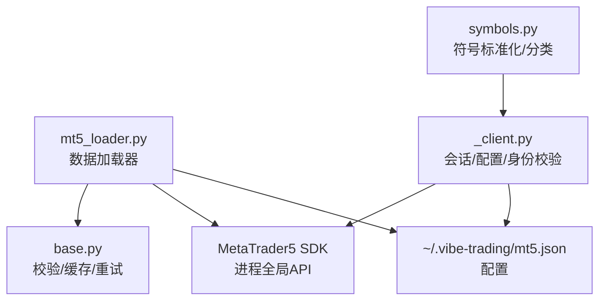
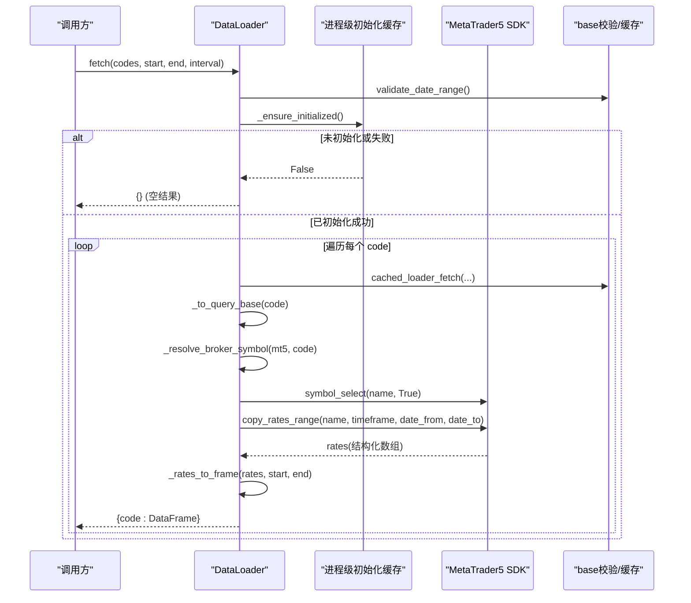
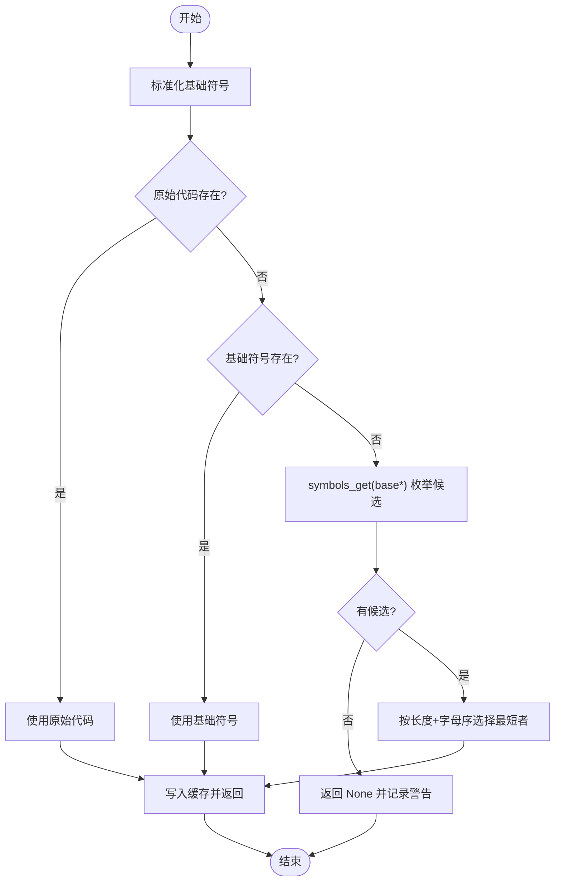
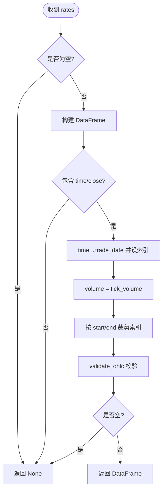
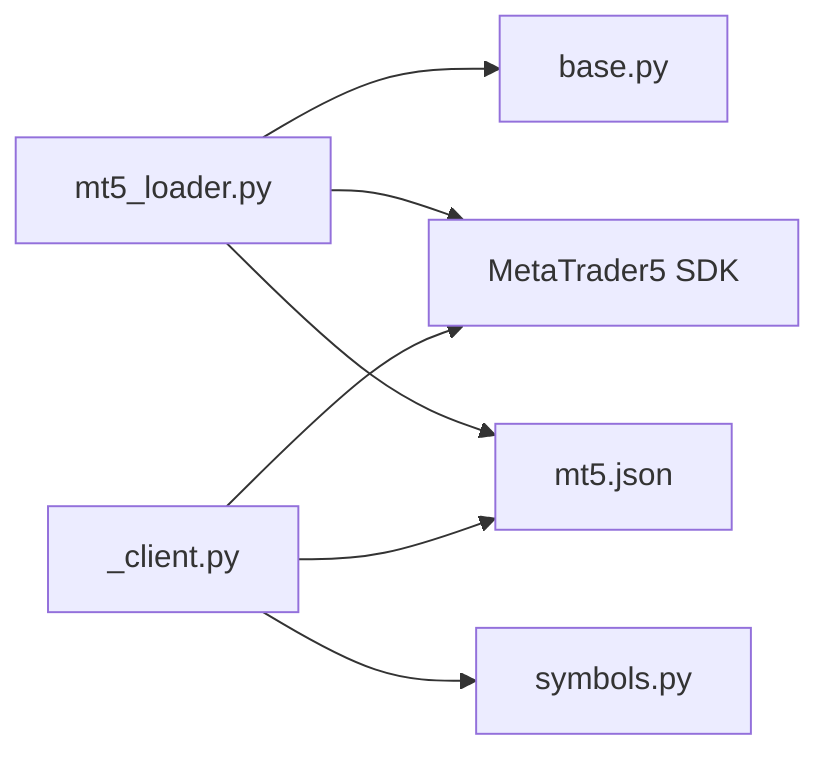

# MetaTrader5 加载器

<cite>
**本文引用的文件**
- [mt5_loader.py](file://agent/backtest/loaders/mt5_loader.py)
- [_client.py](file://agent/src/trading/connectors/mt5/_client.py)
- [symbols.py](file://agent/src/trading/connectors/mt5/symbols.py)
- [base.py](file://agent/backtest/loaders/base.py)
- [test_mt5_loader.py](file://agent/tests/test_mt5_loader.py)
</cite>

## 目录
1. [简介](#简介)
2. [项目结构](#项目结构)
3. [核心组件](#核心组件)
4. [架构总览](#架构总览)
5. [详细组件分析](#详细组件分析)
6. [依赖关系分析](#依赖关系分析)
7. [性能考量](#性能考量)
8. [故障排查指南](#故障排查指南)
9. [结论](#结论)
10. [附录：安装与配置指南](#附录安装与配置指南)

## 简介
本技术文档聚焦于本地 MT5 终端的数据加载器，面向回测与行情获取场景。内容涵盖：
- 进程级初始化缓存、配置文件读取与错误处理
- 品种符号解析算法（原始代码匹配、基础符号标准化、经纪商后缀自动发现）
- 时间框架映射系统（分钟到月线）
- OHLCV 数据转换流程（成交量代理、时区处理、日期范围验证）
- 终端安装与配置要点（Windows 环境、账户登录、数据权限）
- 常见问题诊断方法（连接失败、品种不可用、数据缺失等）

## 项目结构
MT5 数据加载相关代码主要分布在以下位置：
- 数据加载器实现：agent/backtest/loaders/mt5_loader.py
- 交易连接器客户端（共享配置、会话生命周期、符号解析工具）：agent/src/trading/connectors/mt5/_client.py, symbols.py
- 通用校验与缓存基类：agent/backtest/loaders/base.py
- 单元测试（覆盖符号解析、区间映射、帧契约、可用性降级等）：agent/tests/test_mt5_loader.py

图表来源
- [mt5_loader.py:1-251](file://agent/backtest/loaders/mt5_loader.py#L1-L251)
- [_client.py:1-380](file://agent/src/trading/connectors/mt5/_client.py#L1-L380)
- [symbols.py:1-77](file://agent/src/trading/connectors/mt5/symbols.py#L1-L77)
- [base.py:1-200](file://agent/backtest/loaders/base.py#L1-L200)

章节来源
- [mt5_loader.py:1-251](file://agent/backtest/loaders/mt5_loader.py#L1-L251)
- [_client.py:1-380](file://agent/src/trading/connectors/mt5/_client.py#L1-L380)
- [symbols.py:1-77](file://agent/src/trading/connectors/mt5/symbols.py#L1-L77)
- [base.py:1-200](file://agent/backtest/loaders/base.py#L1-L200)

## 核心组件
- DataLoader（MT5 数据加载器）
  - 负责：可用性与初始化缓存、符号解析、时间框架映射、OHLCV 转换、批量拉取与单符号容错
- 配置与连接管理（_client.py）
  - 负责：mt5.json 读写、会话生命周期（initialize/shutdown）、账户身份校验、符号选择与后缀策略
- 符号工具（symbols.py）
  - 负责：基础符号标准化、后缀拆分、外汇对识别与分类
- 通用校验与缓存（base.py）
  - 负责：日期范围校验、OHLC 有效性校验、缓存与重试辅助

章节来源
- [mt5_loader.py:170-251](file://agent/backtest/loaders/mt5_loader.py#L170-L251)
- [_client.py:55-171](file://agent/src/trading/connectors/mt5/_client.py#L55-L171)
- [symbols.py:29-77](file://agent/src/trading/connectors/mt5/symbols.py#L29-L77)
- [base.py:168-256](file://agent/backtest/loaders/base.py#L168-L256)

## 架构总览
MT5 数据加载器通过“进程级初始化缓存”避免重复连接开销；在每次 fetch 前进行符号解析与时间框架映射；调用 MT5 SDK 获取结构化数组并转换为统一 DataFrame 契约；所有异常均被捕获并记录日志，确保单品种失败不影响整体批次。

图表来源
- [mt5_loader.py:79-108](file://agent/backtest/loaders/mt5_loader.py#L79-L108)
- [mt5_loader.py:111-167](file://agent/backtest/loaders/mt5_loader.py#L111-L167)
- [mt5_loader.py:186-251](file://agent/backtest/loaders/mt5_loader.py#L186-L251)
- [base.py:168-256](file://agent/backtest/loaders/base.py#L168-L256)

## 详细组件分析

### 进程级初始化与配置读取
- 懒加载 SDK：仅在需要时导入 MetaTrader5，避免非 Windows 环境导入失败
- 配置读取：从 ~/.vibe-trading/mt5.json 读取 login/password/server/terminal_path/timeout 等键；缺失或格式错误时回退为空字典
- 初始化缓存：模块级布尔状态缓存 initialize 结果，避免重复尝试；失败时记录 last_error 便于诊断
- 安全与健壮性：初始化过程包裹 try/except，保证 availability 探测不抛出异常

章节来源
- [mt5_loader.py:61-108](file://agent/backtest/loaders/mt5_loader.py#L61-L108)
- [_client.py:146-171](file://agent/src/trading/connectors/mt5/_client.py#L146-L171)

### 品种符号解析算法
- 基础标准化：去除分隔符与 .FX 标记，统一为大写（如 EUR/USD → EURUSD）
- 精确匹配优先：先尝试原始输入（保留大小写敏感），再尝试标准化后的基础符号
- 后缀自动发现：当精确匹配失败时，使用 symbols_get(base*) 枚举候选，按名称长度升序、字母序排序，稳定选择最短且字典序最小的名称（例如 Exness 的 EURUSDm 优于 EURUSDz）
- 缓存命中：以基础符号为键缓存解析结果，减少重复查询

图表来源
- [mt5_loader.py:111-147](file://agent/backtest/loaders/mt5_loader.py#L111-L147)
- [symbols.py:29-56](file://agent/src/trading/connectors/mt5/symbols.py#L29-L56)

章节来源
- [mt5_loader.py:111-147](file://agent/backtest/loaders/mt5_loader.py#L111-L147)
- [symbols.py:29-77](file://agent/src/trading/connectors/mt5/symbols.py#L29-L77)

### 时间框架映射系统
- 支持周期：1m、5m、15m、30m、1H/1h、4H/4h、1D/1d、1W/1w、1M
- 映射规则：将项目风格的小写/大写别名映射到 MT5 的时间框架常量名（TIMEFRAME_M1/M5/M15/M30/H1/H4/D1/W1/MN1）
- 未知周期拒绝：不支持的周期直接返回空结果，不会降级为默认周期

章节来源
- [mt5_loader.py:41-52](file://agent/backtest/loaders/mt5_loader.py#L41-L52)
- [mt5_loader.py:212-217](file://agent/backtest/loaders/mt5_loader.py#L212-L217)

### OHLCV 数据转换流程
- 结构化数组转 DataFrame：将 MT5 返回的结构化数组转为 DataFrame，提取 time/open/high/low/close/tick_volume
- 成交量代理：多数经纪商的 real_volume 为零，采用 tick_volume 作为 volume 代理
- 时区处理：传入 MT5 API 的起止时间为带 UTC 时区的 datetime，避免本地时区偏移导致范围错位
- 日期裁剪：end_date 包含当天全天，最终按索引裁剪至 [start, end) 范围
- OHLC 校验：调用 validate_ohlc 剔除无效 K 线（如 high < low、价格非正等）

图表来源
- [mt5_loader.py:162-179](file://agent/backtest/loaders/mt5_loader.py#L162-L179)
- [base.py:168-256](file://agent/backtest/loaders/base.py#L168-L256)

章节来源
- [mt5_loader.py:162-179](file://agent/backtest/loaders/mt5_loader.py#L162-L179)
- [base.py:168-256](file://agent/backtest/loaders/base.py#L168-L256)

### 批量拉取与单符号容错
- 批量循环：对 codes 逐一拉取，任一符号失败仅记录警告并跳过，不影响其他符号
- 缓存复用：基于 base.cached_loader_fetch 对同一 source/symbol/timeframe/date 的结果进行缓存，减少重复请求
- 结果键保持原始输入：返回字典的 key 为原始 code，便于上层覆盖检查

章节来源
- [mt5_loader.py:186-227](file://agent/backtest/loaders/mt5_loader.py#L186-L227)
- [base.py:1-200](file://agent/backtest/loaders/base.py#L1-L200)

### 交易连接器侧的符号解析与会话管理（补充）
- 会话上下文：_session 提供 initialize/account_info/shutdown 的锁保护与身份校验，确保读/写操作针对正确账户
- 符号选择：若配置了 symbol_suffix，优先尝试 base+suffix，否则 base，最后 fallback 到 symbols_get(base*) 最短匹配
- 身份守卫：paper/live 模式与 trade_mode 严格匹配，login 必须与终端一致，防止误连

章节来源
- [_client.py:237-331](file://agent/src/trading/connectors/mt5/_client.py#L237-L331)

## 依赖关系分析
- mt5_loader.py 依赖：
  - base.py：日期范围校验、OHLC 校验、缓存与重试
  - MetaTrader5 SDK：进程全局 API（initialize、symbol_info、symbols_get、copy_rates_range 等）
  - 配置文件：~/.vibe-trading/mt5.json
- _client.py 依赖：
  - symbols.py：符号标准化与分类（无 SDK 依赖，可跨平台使用）
  - 配置文件：~/.vibe-trading/mt5.json
  - 线程锁：保证会话串行执行

图表来源
- [mt5_loader.py:1-251](file://agent/backtest/loaders/mt5_loader.py#L1-L251)
- [_client.py:1-380](file://agent/src/trading/connectors/mt5/_client.py#L1-L380)
- [symbols.py:1-77](file://agent/src/trading/connectors/mt5/symbols.py#L1-L77)
- [base.py:1-200](file://agent/backtest/loaders/base.py#L1-L200)

章节来源
- [mt5_loader.py:1-251](file://agent/backtest/loaders/mt5_loader.py#L1-L251)
- [_client.py:1-380](file://agent/src/trading/connectors/mt5/_client.py#L1-L380)
- [symbols.py:1-77](file://agent/src/trading/connectors/mt5/symbols.py#L1-L77)
- [base.py:1-200](file://agent/backtest/loaders/base.py#L1-L200)

## 性能考量
- 进程级初始化缓存：避免多次 initialize 带来的秒级延迟
- 符号解析缓存：以基础符号为键缓存 broker 符号，降低重复 symbols_get 调用
- 批量拉取中的单点容错：单个品种失败不阻塞整体批次
- 时区与范围裁剪：UTC 时区传递与 end 日包含逻辑减少不必要的数据量
- 建议：
  - 合理设置 terminal 的“图表最大柱数”，避免历史深度受限
  - 控制 interval 粒度与时间跨度，避免单次请求过大
  - 利用缓存键（source/symbol/timeframe/date）减少重复拉取

[本节为通用指导，无需特定文件引用]

## 故障排查指南
- 终端连接失败
  - 现象：is_available 返回 False，initialize 失败
  - 可能原因：未安装 MetaTrader5 包、终端未运行或未登录、配置中 server/login/password 不匹配、超时过短
  - 排查步骤：
    - 确认已安装可选依赖并能在当前环境导入 MetaTrader5
    - 确认终端已启动并登录到配置的服务器
    - 检查 ~/.vibe-trading/mt5.json 中 login/password/server/terminal_path/timeout
    - 查看 last_error 文本定位具体错误码与描述
- 品种不可用
  - 现象：fetch 返回空或某品种缺失
  - 可能原因：经纪商未提供该符号、后缀不匹配、Market Watch 未选中
  - 排查步骤：
    - 确认符号标准化与后缀策略（优先精确匹配，其次基础符号，最后 suffix* 枚举）
    - 检查终端 Market Watch 是否可见该品种
    - 查看日志中关于“symbol not offered by this broker”的警告
- 数据缺失或异常
  - 现象：返回的 DataFrame 为空或 OHLC 校验失败
  - 可能原因：时间范围超出终端历史深度、tick_volume 全零、K 线结构异常
  - 排查步骤：
    - 调整 start/end 范围，确保在终端允许的历史范围内
    - 确认 tick_volume 可作为成交量代理
    - 检查 validate_ohlc 抛出的无效 K 线数量与类型

章节来源
- [mt5_loader.py:79-108](file://agent/backtest/loaders/mt5_loader.py#L79-L108)
- [mt5_loader.py:121-147](file://agent/backtest/loaders/mt5_loader.py#L121-L147)
- [mt5_loader.py:162-179](file://agent/backtest/loaders/mt5_loader.py#L162-L179)
- [_client.py:237-331](file://agent/src/trading/connectors/mt5/_client.py#L237-L331)
- [base.py:168-256](file://agent/backtest/loaders/base.py#L168-L256)

## 结论
MT5 数据加载器通过进程级初始化缓存、稳健的符号解析与时间框架映射、严格的 OHLC 校验与时区处理，提供了可靠的外汇/贵金属历史数据接入能力。其设计强调容错与可观测性：单品种失败不影响整体批次，关键路径均有日志输出，便于快速定位问题。配合交易连接器侧的会话管理与身份校验，可在多账户/多环境下安全运行。

[本节为总结性内容，无需特定文件引用]

## 附录：安装与配置指南
- 环境要求
  - 操作系统：Windows（MetaTrader5 Python SDK 仅支持 Windows）
  - 依赖：安装可选依赖以启用 MT5 功能
  - 终端：本地已安装并运行的 MT5 终端，且已登录到目标经纪商账户
- 账户与权限
  - 登录信息：在 ~/.vibe-trading/mt5.json 中配置 login、password、server
  - 终端路径：如有多个终端实例，可通过 terminal_path 指定
  - 超时：根据网络与终端响应情况调整 timeout
  - 数据权限：确保账户具有历史数据下载权限（部分经纪商需开启）
- 常见配置项说明
  - profile：paper/live-readonly/live，用于区分模拟/实盘只读/实盘交易
  - symbol_suffix：经纪商账户类型后缀（如 m/z/raw），用于符号解析
  - deviation_points/max_order_volume/max_order_notional_usd：交易风控参数（主要用于交易连接器）
- 验证步骤
  - 运行 is_available 确认 SDK 可导入且终端可连接
  - 执行一次小范围 fetch，确认符号解析与数据转换正常
  - 检查日志中是否有 initialize 失败、符号未找到或 OHLC 校验警告

章节来源
- [_client.py:55-171](file://agent/src/trading/connectors/mt5/_client.py#L55-L171)
- [mt5_loader.py:70-108](file://agent/backtest/loaders/mt5_loader.py#L70-L108)
- [test_mt5_loader.py:91-147](file://agent/tests/test_mt5_loader.py#L91-L147)