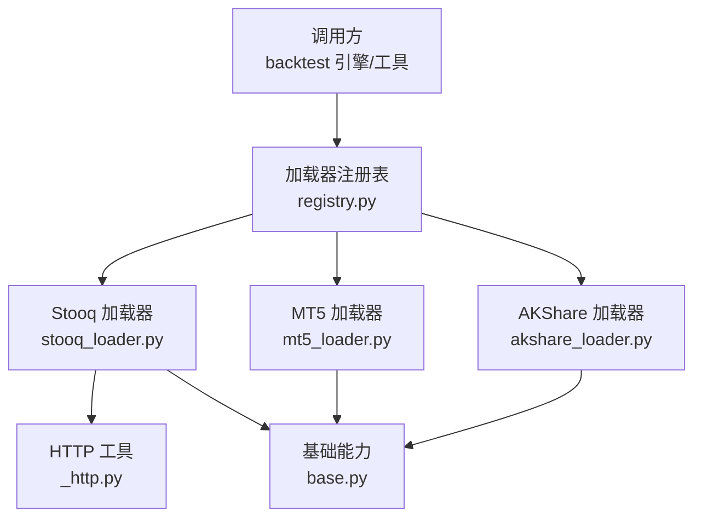
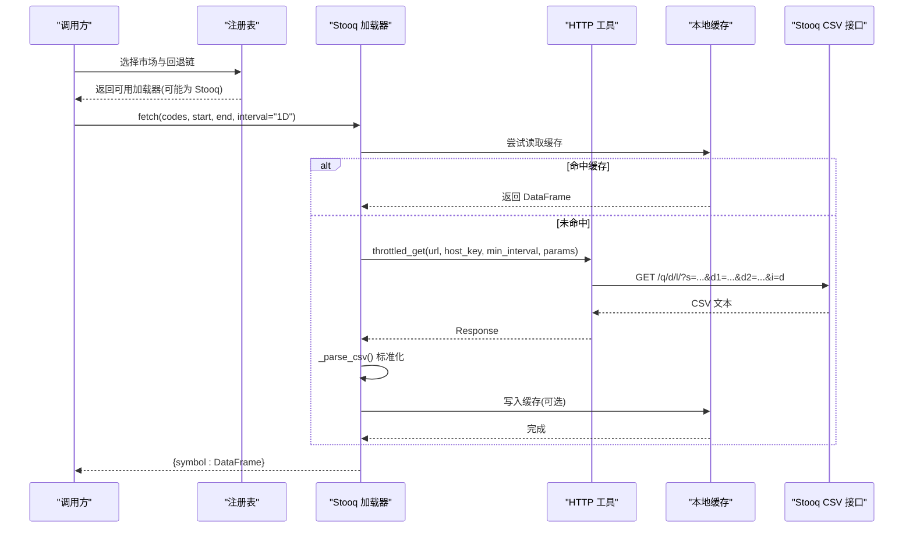
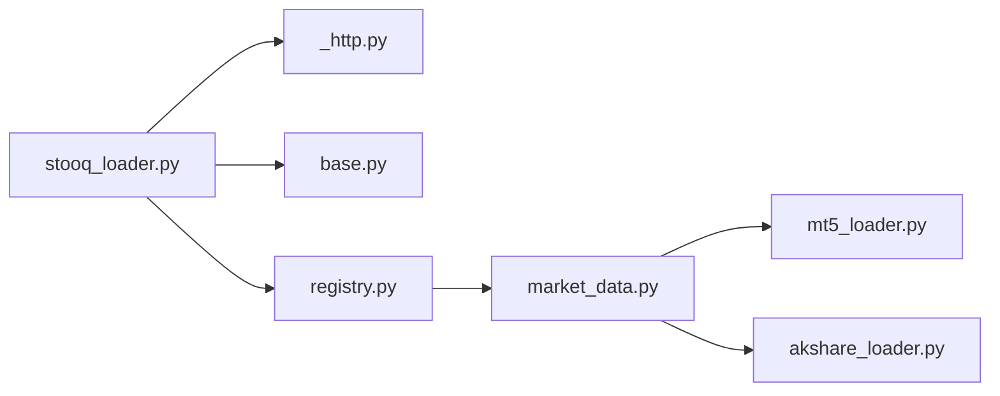

# Stooq 数据加载器

<cite>
**本文引用的文件**
- [stooq_loader.py](file://agent/backtest/loaders/stooq_loader.py)
- [_http.py](file://agent/backtest/loaders/_http.py)
- [base.py](file://agent/backtest/loaders/base.py)
- [registry.py](file://agent/backtest/loaders/registry.py)
- [test_stooq_loader.py](file://agent/tests/test_stooq_loader.py)
- [test_stooq_interval_reject.py](file://agent/tests/test_stooq_interval_reject.py)
- [market_data.py](file://agent/src/market_data.py)
- [mt5_loader.py](file://agent/backtest/loaders/mt5_loader.py)
- [akshare_loader.py](file://agent/backtest/loaders/akshare_loader.py)
</cite>

## 目录
1. [简介](#简介)
2. [项目结构](#项目结构)
3. [核心组件](#核心组件)
4. [架构总览](#架构总览)
5. [详细组件分析](#详细组件分析)
6. [依赖关系分析](#依赖关系分析)
7. [性能与网络优化](#性能与网络优化)
8. [故障排查指南](#故障排查指南)
9. [结论](#结论)
10. [附录](#附录)

## 简介
本技术文档围绕 Stooq 数据加载器展开，说明其作为免费、无需认证的历史行情数据源的特点与限制，并系统梳理其在 Vibe-Trading 框架中的集成方式。重点包括：
- Stooq 的免费 CSV 接口与按 IP 限流特性
- 符号格式转换（以美股为主；外汇由其他加载器承担）
- 历史数据获取流程：CSV 下载、解析与标准化
- 数据质量校验：OHLC 完整性检查、异常值处理与缺失值策略
- 网络请求优化：共享会话、主机级节流、缓存与重试
- 使用限制：频率限制、更新延迟、可用品种范围

## 项目结构
Stooq 加载器位于 backtest 数据加载层，通过注册表与其他加载器协同工作，统一对外提供 OHLCV 数据。关键文件与职责如下：
- stooq_loader.py：实现 Stooq 每日 OHLCV 数据的拉取、解析与标准化
- _http.py：提供跨加载器共享的 HTTP 工具（主机级节流、会话复用）
- base.py：通用基础能力（日期校验、OHLC 校验、本地缓存、重试预算）
- registry.py：加载器注册与市场回退链配置
- market_data.py：市场到加载器的路由规则（外汇优先走 MT5/AKShare/Yahoo）
- mt5_loader.py / akshare_loader.py：外汇数据的主要来源（与 Stooq 形成互补）

图表来源
- [registry.py:131-158](file://agent/backtest/loaders/registry.py#L131-L158)
- [stooq_loader.py:88-160](file://agent/backtest/loaders/stooq_loader.py#L88-L160)
- [_http.py:141-173](file://agent/backtest/loaders/_http.py#L141-L173)
- [base.py:168-256](file://agent/backtest/loaders/base.py#L168-L256)

章节来源
- [registry.py:131-158](file://agent/backtest/loaders/registry.py#L131-L158)
- [stooq_loader.py:88-160](file://agent/backtest/loaders/stooq_loader.py#L88-L160)

## 核心组件
- Stooq DataLoader：声明名称、支持市场、是否需认证、可用性判断与 fetch 接口
- 符号映射：将项目侧符号转换为 Stooq 小写 ticker（如 AAPL.US → aapl.us）
- CSV 解析：将 Stooq 返回的 Date,Open,High,Low,Close,Volume 转为标准 OHLCV DataFrame
- 日期格式化：将 YYYY-MM-DD 转换为 Stooq 所需的 YYYYMMDD
- 批量隔离：单个代码失败不影响批次中其他代码的拉取

章节来源
- [stooq_loader.py:55-80](file://agent/backtest/loaders/stooq_loader.py#L55-L80)
- [stooq_loader.py:88-160](file://agent/backtest/loaders/stooq_loader.py#L88-L160)
- [stooq_loader.py:148-201](file://agent/backtest/loaders/stooq_loader.py#L148-L201)

## 架构总览
Stooq 加载器在“美股”市场中作为回退链的一部分，当首选 Yahoo/yfinance 不可用时自动降级至 Stooq。外汇市场则优先走 MT5/AKShare/Yahoo，不经过 Stooq。

图表来源
- [registry.py:131-158](file://agent/backtest/loaders/registry.py#L131-L158)
- [stooq_loader.py:106-160](file://agent/backtest/loaders/stooq_loader.py#L106-L160)
- [stooq_loader.py:148-201](file://agent/backtest/loaders/stooq_loader.py#L148-L201)
- [_http.py:141-173](file://agent/backtest/loaders/_http.py#L141-L173)
- [base.py:623-661](file://agent/backtest/loaders/base.py#L623-L661)

## 详细组件分析

### Stooq 加载器类与接口
- 类属性：name="stooq"，markets={"us_equity"}，requires_auth=False，volume_units={"us_equity": "shares"}
- is_available：始终可用（纯 HTTP，无鉴权）
- fetch：仅支持日频（1D/d/day/daily），非日频直接返回空字典，避免误用
- 批量处理：对每个 code 单独 try/except，确保一个失败不影响整体批次

章节来源
- [stooq_loader.py:88-160](file://agent/backtest/loaders/stooq_loader.py#L88-L160)

#### 符号转换
- map_symbol：去除空白并转小写，保留 .US 后缀（例如 AAPL.US → aapl.us）
- 注意：Stooq 加载器当前面向美股，外汇符号不在其 markets 集合内

章节来源
- [stooq_loader.py:71-80](file://agent/backtest/loaders/stooq_loader.py#L71-L80)

#### CSV 解析与标准化
- 输入：Stooq 返回的 CSV 文本（Date,Open,High,Low,Close,Volume）
- 特殊处理：空体或 "N/D" 视为无数据
- 列映射：将 Open/High/Low/Close/Volume 映射为 open/high/low/close/volume
- 时间索引：将 Date 转为 trade_date 并排序
- 数值类型：强制转换为 float，丢弃 NaN 行
- 输出：DataFrame 索引名为 trade_date，列为标准 OHLCV

章节来源
- [stooq_loader.py:201-234](file://agent/backtest/loaders/stooq_loader.py#L201-L234)

#### 日期格式化
- _compact_date：将 YYYY-MM-DD 转为 YYYYMMDD 以满足 Stooq 参数要求

章节来源
- [stooq_loader.py:83-85](file://agent/backtest/loaders/stooq_loader.py#L83-L85)

### 网络请求与节流
- throttled_get：按 host_key 进行进程级最小间隔控制，附带随机抖动，避免并发同步
- 会话复用：按 host_key 复用 requests.Session，减少 TCP/TLS 开销
- User-Agent：默认浏览器 UA，降低被拒绝概率
- 超时：默认 15 秒

章节来源
- [_http.py:46-106](file://agent/backtest/loaders/_http.py#L46-L106)
- [_http.py:118-173](file://agent/backtest/loaders/_http.py#L118-L173)

### 本地缓存
- cached_loader_fetch：先查缓存，未命中再调用 fetch，并将非空结果落盘 parquet
- 缓存键：基于 source/symbol/timeframe/start/end/fields 的内容寻址哈希
- 有效性：仅对已结算日期范围（end_date < 今日）缓存，避免缓存未完成 K 线
- 读写容错：读/写失败均不中断主流程

章节来源
- [base.py:243-441](file://agent/backtest/loaders/base.py#L243-L441)

### 数据质量校验
- validate_date_range：校验起止日期合法性与顺序
- validate_ohlc：检查 OHLC 结构性不变量（high>=low，高低价包围开收价），以及价格正负策略
- Stooq 解析阶段：丢弃 NaN 行与无效列组合，保证输出干净

章节来源
- [base.py:168-256](file://agent/backtest/loaders/base.py#L168-L256)
- [stooq_loader.py:201-234](file://agent/backtest/loaders/stooq_loader.py#L201-L234)

### 外汇交易对符号格式与来源
- Stooq 加载器当前仅支持美股（markets={"us_equity"}），不处理外汇
- 外汇符号（EURUSD、GBPUSD 等）在项目内通过以下路径识别与处理：
  - 路由：EUR/USD、EURUSD.FX 等匹配外汇模式，优先走 MT5，其次 AKShare/Yahoo
  - 归一化：统一为 XXX/YYY 或六字母大写形式，便于后续处理
- 因此，外汇数据不经过 Stooq 加载器

章节来源
- [market_data.py:30-48](file://agent/src/market_data.py#L30-L48)
- [mt5_loader.py:1-19](file://agent/backtest/loaders/mt5_loader.py#L1-L19)
- [akshare_loader.py:270-283](file://agent/backtest/loaders/akshare_loader.py#L270-L283)

### 测试覆盖要点
- 符号映射：AAPL.US → aapl.us，去空白与小写
- CSV 解析：正确生成 trade_date 索引与 OHLCV 列，升序排列
- 边界情况：空体/N/D 返回空结果；缺少列返回 None
- 批量隔离：单代码网络错误不影响其他代码
- 区间拒绝：非日频（如 1H、4H）不调用 API，直接返回空

章节来源
- [test_stooq_loader.py:58-177](file://agent/tests/test_stooq_loader.py#L58-L177)
- [test_stooq_interval_reject.py:10-44](file://agent/tests/test_stooq_interval_reject.py#L10-L44)

## 依赖关系分析
- Stooq 加载器依赖：
  - HTTP 工具：throttled_get（节流与会话复用）
  - 基础能力：validate_date_range、cached_loader_fetch、validate_ohlc
  - 注册表：@register 装饰器注入全局注册表
- 市场回退链：
  - us_equity：yahoo → stooq → sina → eastmoney → yfinance → tiingo → fmp → finnhub → alphavantage → longbridge → akshare → local
  - forex：mt5 → akshare → yfinance → local（不经过 Stooq）

图表来源
- [stooq_loader.py:29-31](file://agent/backtest/loaders/stooq_loader.py#L29-L31)
- [registry.py:131-158](file://agent/backtest/loaders/registry.py#L131-L158)
- [market_data.py:30-48](file://agent/src/market_data.py#L30-L48)

章节来源
- [registry.py:131-158](file://agent/backtest/loaders/registry.py#L131-L158)
- [market_data.py:30-48](file://agent/src/market_data.py#L30-L48)

## 性能与网络优化
- 主机级节流：按 host_key 控制最小请求间隔，防止触发 Stooq 的 IP 限流
- 随机抖动：在最小间隔基础上增加抖动，避免并发同步风暴
- 会话复用：同一 host_key 复用 Session，降低连接建立成本
- 本地缓存：对已结算日期范围的请求进行 parquet 缓存，显著减少重复网络请求
- 批量隔离：单个代码失败不中断批次，提升鲁棒性
- 超时控制：默认 15 秒，避免长时间阻塞

建议实践
- 批处理时适当提高环境变量 VIBE_TRADING_STOOQ_MIN_INTERVAL，降低限流风险
- 启用本地缓存以减少重复拉取（默认由配置开关控制）
- 合理设置 end_date，避免缓存未完成 K 线

章节来源
- [_http.py:46-106](file://agent/backtest/loaders/_http.py#L46-L106)
- [_http.py:118-173](file://agent/backtest/loaders/_http.py#L118-L173)
- [base.py:243-441](file://agent/backtest/loaders/base.py#L243-L441)
- [stooq_loader.py:66-68](file://agent/backtest/loaders/stooq_loader.py#L66-L68)

## 故障排查指南
常见问题与定位方法
- 非日频请求被拒绝：确认 interval 为 1D/d/day/daily，否则不会发起网络请求
- 返回空结果：检查 Stooq 响应是否为空或 "N/D"，或 CSV 缺少必要列
- 批量部分失败：查看日志中对应 symbol 的网络错误，不影响其他 symbol
- 限流或 429：提高 STOOQ_MIN_INTERVAL 或降低并发度
- 缓存问题：确认 end_date 已结算且缓存开关开启；缓存读写失败会回退到在线拉取

章节来源
- [test_stooq_interval_reject.py:10-44](file://agent/tests/test_stooq_interval_reject.py#L10-L44)
- [test_stooq_loader.py:112-148](file://agent/tests/test_stooq_loader.py#L112-L148)
- [stooq_loader.py:136-142](file://agent/backtest/loaders/stooq_loader.py#L136-L142)
- [stooq_loader.py:201-234](file://agent/backtest/loaders/stooq_loader.py#L201-L234)

## 结论
Stooq 数据加载器为美股日线 OHLCV 提供了免费、轻量且易于集成的数据源。其通过统一的 HTTP 节流与本地缓存机制，有效平衡了稳定性与性能。对于外汇数据，项目采用 MT5/AKShare/Yahoo 的路由策略，不与 Stooq 混用。建议在批量任务中合理设置最小间隔与缓存策略，以获得更稳定的数据获取体验。

## 附录

### Stooq 特点与使用限制
- 免费、无需认证：直接访问 CSV 接口
- 按 IP 限流：必须通过节流与重试策略控制请求频率
- 数据粒度：仅支持日频（1D/d/day/daily）
- 数据范围：以 Stooq 公开数据为准，具体品种与历史深度受限于其服务
- 更新延迟：EOD（收盘后）数据，不适合盘中实时场景

章节来源
- [stooq_loader.py:1-19](file://agent/backtest/loaders/stooq_loader.py#L1-L19)
- [stooq_loader.py:136-142](file://agent/backtest/loaders/stooq_loader.py#L136-L142)

### 外汇符号识别与处理（与 Stooq 无关）
- 路由规则：EUR/USD、EURUSD.FX 等匹配外汇模式，优先走 MT5，其次 AKShare/Yahoo
- 符号归一化：统一为 XXX/YYY 或六字母大写形式
- 数据源：外汇数据不由 Stooq 提供

章节来源
- [market_data.py:30-48](file://agent/src/market_data.py#L30-L48)
- [mt5_loader.py:1-19](file://agent/backtest/loaders/mt5_loader.py#L1-L19)
- [akshare_loader.py:270-283](file://agent/backtest/loaders/akshare_loader.py#L270-L283)