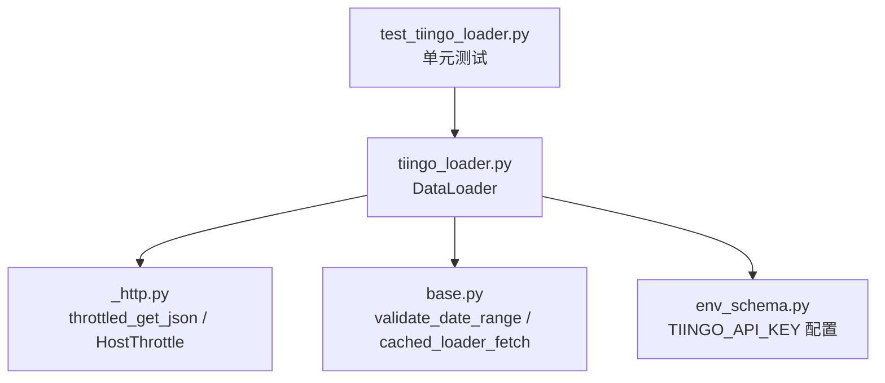
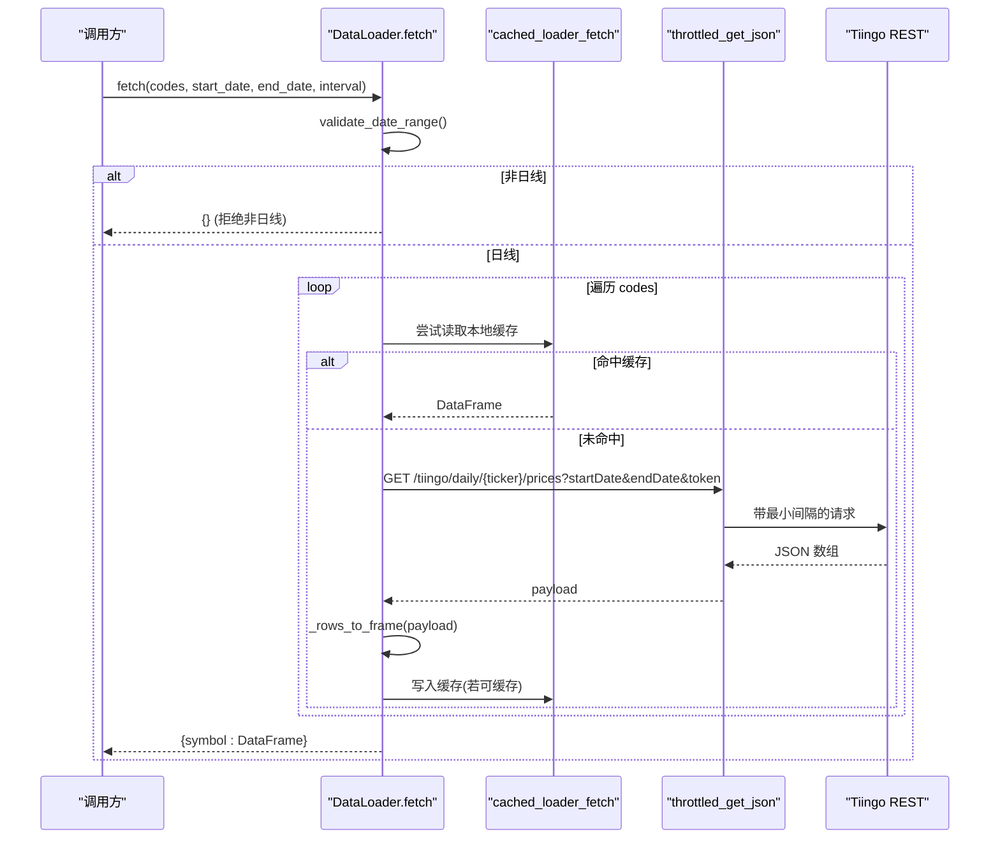
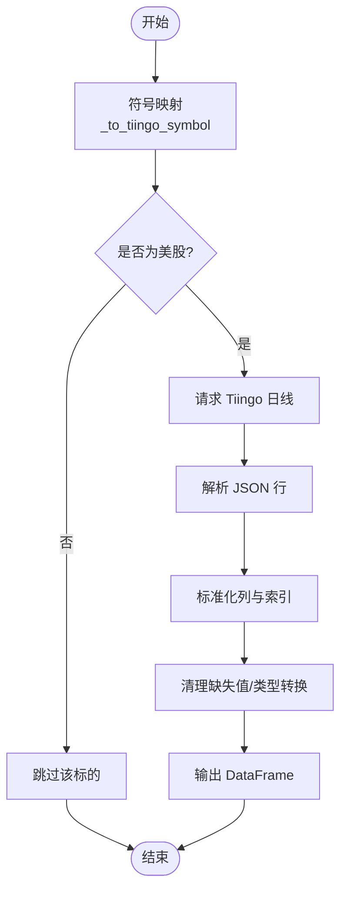
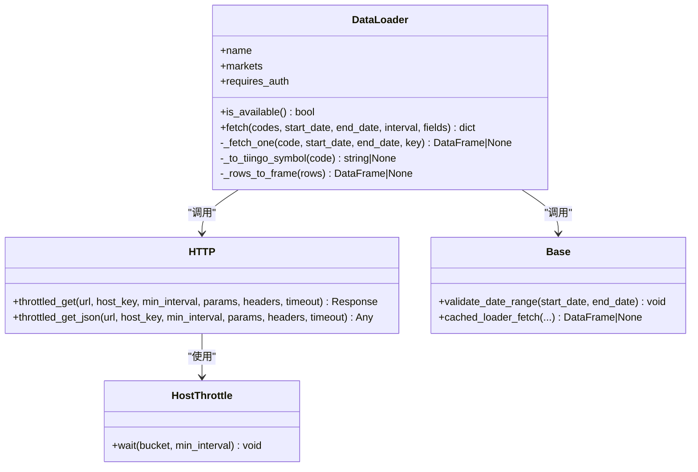

# Tiingo 数据加载器

<cite>
**本文引用的文件**
- [agent/backtest/loaders/tiingo_loader.py](file://agent/backtest/loaders/tiingo_loader.py)
- [agent/backtest/loaders/_http.py](file://agent/backtest/loaders/_http.py)
- [agent/backtest/loaders/base.py](file://agent/backtest/loaders/base.py)
- [agent/src/config/env_schema.py](file://agent/src/config/env_schema.py)
- [agent/tests/test_tiingo_loader.py](file://agent/tests/test_tiingo_loader.py)
</cite>

## 目录
1. [简介](#简介)
2. [项目结构](#项目结构)
3. [核心组件](#核心组件)
4. [架构总览](#架构总览)
5. [详细组件分析](#详细组件分析)
6. [依赖关系分析](#依赖关系分析)
7. [性能考虑](#性能考虑)
8. [故障排查指南](#故障排查指南)
9. [结论](#结论)

## 简介
本技术文档聚焦于 Tiingo 数据加载器的实现与集成，覆盖以下主题：
- 认证机制与 API 密钥管理（环境变量、占位符过滤）
- 请求限流与会话复用（按主机桶的节流、抖动、连接池）
- 数据获取范围（当前仅支持美股日线 OHLCV；外汇/期货/基本面不在该加载器范围内）
- 数据标准化流程（统一列名、索引、数值类型、缺失值处理）
- 高级功能说明（调整价、股息与拆股：由 Tiingo 返回字段但本加载器未使用）
- 性能优化建议（批量请求、缓存策略、并发控制）
- 错误处理最佳实践（网络超时、API 限制、无效数据的处理）

## 项目结构
Tiingo 加载器位于回测数据加载器模块中，通过注册表与其他加载器协同工作。其关键文件与职责如下：
- tiingo_loader.py：定义 DataLoader 类，封装 Tiingo REST 调用、符号映射、数据标准化与批量拉取逻辑
- _http.py：提供跨加载器共享的 HTTP 工具（按主机桶节流、会话复用、JSON 解码）
- base.py：提供通用能力（日期校验、OHLC 校验、重试预算、本地 Parquet 缓存等）
- env_schema.py：集中声明环境变量，包括 TIINGO_API_KEY 等
- test_tiingo_loader.py：对符号映射、可用性判断、行解析、fetch 行为等进行单元测试

图表来源
- [agent/backtest/loaders/tiingo_loader.py:133-246](file://agent/backtest/loaders/tiingo_loader.py#L133-L246)
- [agent/backtest/loaders/_http.py:141-201](file://agent/backtest/loaders/_http.py#L141-L201)
- [agent/backtest/loaders/base.py:168-184](file://agent/backtest/loaders/base.py#L168-L184)
- [agent/src/config/env_schema.py:212-212](file://agent/src/config/env_schema.py#L212-L212)
- [agent/tests/test_tiingo_loader.py:121-142](file://agent/tests/test_tiingo_loader.py#L121-L142)

章节来源
- [agent/backtest/loaders/tiingo_loader.py:1-246](file://agent/backtest/loaders/tiingo_loader.py#L1-L246)
- [agent/backtest/loaders/_http.py:1-201](file://agent/backtest/loaders/_http.py#L1-L201)
- [agent/backtest/loaders/base.py:1-657](file://agent/backtest/loaders/base.py#L1-L657)
- [agent/src/config/env_schema.py:170-210](file://agent/src/config/env_schema.py#L170-L210)
- [agent/tests/test_tiingo_loader.py:1-203](file://agent/tests/test_tiingo_loader.py#L1-L203)

## 核心组件
- DataLoader（tiingo_loader.py）
  - name/markets/requires_auth：标识为“tiingo”，市场为“us_equity”，需要鉴权
  - is_available()：基于环境中的 TIINGO_API_KEY 是否有效（非空且非占位符）
  - fetch(codes, start_date, end_date, interval, fields)：批量拉取并标准化为 DataFrame；仅支持日线
  - _fetch_one(code, start_date, end_date, key)：单标的请求与解析
  - _to_tiingo_symbol(code)：将项目符号映射为 Tiingo 期望的小写 ticker（仅 US 股票）
  - _rows_to_frame(rows)：将 JSON 行转换为标准 OHLCV 表格（trade_date 索引、float64 列）

- HTTP 工具（_http.py）
  - HostThrottle：进程级按 host_key 的最小间隔控制，带随机抖动避免同步风暴
  - throttled_get / throttled_get_json：封装请求发送、状态码检查、JSON 解析
  - 会话复用：按 host_key 维护 requests.Session，减少 TCP/TLS 握手开销

- 基础能力（base.py）
  - validate_date_range：起止日期合法性校验
  - validate_ohlc：OHLC 结构性校验（可配置严格度）
  - retry_with_budget / check_budget：带预算的重试框架（适用于其他加载器）
  - 本地缓存：loader_cache_* 系列函数，基于 Parquet + 元数据，内容寻址键，仅对已结算区间生效

- 配置（env_schema.py）
  - TIINGO_API_KEY：用于鉴权的 API Key 环境变量

章节来源
- [agent/backtest/loaders/tiingo_loader.py:133-246](file://agent/backtest/loaders/tiingo_loader.py#L133-L246)
- [agent/backtest/loaders/_http.py:46-110](file://agent/backtest/loaders/_http.py#L46-L110)
- [agent/backtest/loaders/_http.py:141-201](file://agent/backtest/loaders/_http.py#L141-L201)
- [agent/backtest/loaders/base.py:168-184](file://agent/backtest/loaders/base.py#L168-L184)
- [agent/backtest/loaders/base.py:398-450](file://agent/backtest/loaders/base.py#L398-L450)
- [agent/backtest/loaders/base.py:243-441](file://agent/backtest/loaders/base.py#L243-L441)
- [agent/src/config/env_schema.py:212-212](file://agent/src/config/env_schema.py#L212-L212)

## 架构总览
Tiingo 加载器通过统一的 HTTP 层访问 Tiingo REST API，并在加载器内部完成符号映射与数据标准化。批量拉取时每个标的独立请求，失败不中断整体批次。

图表来源
- [agent/backtest/loaders/tiingo_loader.py:149-209](file://agent/backtest/loaders/tiingo_loader.py#L149-L209)
- [agent/backtest/loaders/tiingo_loader.py:211-246](file://agent/backtest/loaders/tiingo_loader.py#L211-L246)
- [agent/backtest/loaders/_http.py:176-201](file://agent/backtest/loaders/_http.py#L176-L201)
- [agent/backtest/loaders/base.py:623-661](file://agent/backtest/loaders/base.py#L623-L661)

## 详细组件分析

### 认证机制与 API 密钥管理
- 密钥来源：从配置读取 TIINGO_API_KEY（env_schema.py），在加载器内通过 _resolve_key() 获取
- 占位符过滤：空串或常见示例值被视为未配置，is_available() 返回 False
- 安全原则：密钥从不硬编码，仅在请求参数 token 中传递

章节来源
- [agent/src/config/env_schema.py:212-212](file://agent/src/config/env_schema.py#L212-L212)
- [agent/backtest/loaders/tiingo_loader.py:50-60](file://agent/backtest/loaders/tiingo_loader.py#L50-L60)
- [agent/backtest/loaders/tiingo_loader.py:217-219](file://agent/backtest/loaders/tiingo_loader.py#L217-L219)
- [agent/backtest/loaders/tiingo_loader.py:260-263](file://agent/backtest/loaders/tiingo_loader.py#L260-L263)

### 请求限流与并发控制
- 每主机桶节流：HostThrottle 保证同一 host_key 的最小时间间隔，避免触发 API 限流
- 抖动防同步：在等待后加入随机抖动，降低并发场景下的同步风暴风险
- 会话复用：按 host_key 复用 requests.Session，提升吞吐并减少握手成本
- 最小间隔可调：通过 VIBE_TRADING_TIINGO_MIN_INTERVAL 环境变量覆盖默认间隔

章节来源
- [agent/backtest/loaders/_http.py:46-110](file://agent/backtest/loaders/_http.py#L46-L110)
- [agent/backtest/loaders/_http.py:118-124](file://agent/backtest/loaders/_http.py#L118-L124)
- [agent/backtest/loaders/_http.py:127-139](file://agent/backtest/loaders/_http.py#L127-L139)
- [agent/backtest/loaders/tiingo_loader.py:35-38](file://agent/backtest/loaders/tiingo_loader.py#L35-L38)

### 数据获取方式（外汇/期货/基本面）
- 当前实现：仅支持美股日线 OHLCV（/tiingo/daily/{symbol}/prices）
- 外汇与期货：该加载器不支持；如需外汇/期货数据，请使用对应市场的加载器
- 基本面信息：该加载器不拉取基本面数据；可通过其他加载器或外部系统获取

章节来源
- [agent/backtest/loaders/tiingo_loader.py:1-14](file://agent/backtest/loaders/tiingo_loader.py#L1-L14)
- [agent/backtest/loaders/tiingo_loader.py:209-211](file://agent/backtest/loaders/tiingo_loader.py#L209-L211)
- [agent/backtest/loaders/tiingo_loader.py:252-258](file://agent/backtest/loaders/tiingo_loader.py#L252-L258)

### 数据标准化过程
- 符号映射：_to_tiingo_symbol() 将 AAPL.US/AAPL 等映射为 aapl，拒绝非美股后缀与加密对
- 行转表：_rows_to_frame() 将 JSON 行转为 DataFrame，统一列顺序 open/high/low/close/volume
- 索引与时区：将 ISO 时间戳转为无时区的 DatetimeIndex，并归一化到午夜
- 数值类型：强制 float64，volume 缺失填充为 0.0，删除缺失 OHLC 的行
- 输出契约：返回 {symbol: DataFrame(trade_date, open, high, low, close, volume)}

图表来源
- [agent/backtest/loaders/tiingo_loader.py:63-83](file://agent/backtest/loaders/tiingo_loader.py#L63-L83)
- [agent/backtest/loaders/tiingo_loader.py:82-131](file://agent/backtest/loaders/tiingo_loader.py#L82-L131)
- [agent/backtest/loaders/tiingo_loader.py:211-246](file://agent/backtest/loaders/tiingo_loader.py#L211-L246)

章节来源
- [agent/backtest/loaders/tiingo_loader.py:59-131](file://agent/backtest/loaders/tiingo_loader.py#L59-L131)
- [agent/backtest/loaders/tiingo_loader.py:211-246](file://agent/backtest/loaders/tiingo_loader.py#L211-L246)

### 高级功能：调整后的价格、股息与拆股
- Tiingo 响应包含 adjusted 相关字段，但本加载器仅使用原始 OHLCV，未应用调整
- 因此，本加载器不直接提供股息调整与拆股处理；如需调整后价格，请在下游进行重算或使用支持该能力的加载器

章节来源
- [agent/backtest/loaders/tiingo_loader.py:1-14](file://agent/backtest/loaders/tiingo_loader.py#L1-L14)
- [agent/backtest/loaders/tiingo_loader.py:82-131](file://agent/backtest/loaders/tiingo_loader.py#L82-L131)

### 批量请求与容错
- 逐标的独立请求：任一标的失败不会中断整个批次，失败日志记录并跳过
- 空结果处理：空列表或非列表响应视为无数据，返回空映射
- 区间校验：start_date > end_date 抛出 ValueError

章节来源
- [agent/backtest/loaders/tiingo_loader.py:149-209](file://agent/backtest/loaders/tiingo_loader.py#L149-L209)
- [agent/backtest/loaders/tiingo_loader.py:211-246](file://agent/backtest/loaders/tiingo_loader.py#L211-L246)
- [agent/backtest/loaders/base.py:168-184](file://agent/backtest/loaders/base.py#L168-L184)

## 依赖关系分析
- DataLoader 依赖：
  - _http.throttled_get_json：负责限速与 JSON 解码
  - base.validate_date_range：日期合法性校验
  - base.cached_loader_fetch：可选本地缓存读写
  - registry.register：自动注册到加载器注册表
- HTTP 层依赖：
  - requests.Session：连接池复用
  - HostThrottle：进程级节流
- 配置依赖：
  - env_schema.TIINGO_API_KEY：鉴权密钥

图表来源
- [agent/backtest/loaders/tiingo_loader.py:133-246](file://agent/backtest/loaders/tiingo_loader.py#L133-L246)
- [agent/backtest/loaders/_http.py:46-110](file://agent/backtest/loaders/_http.py#L46-L110)
- [agent/backtest/loaders/_http.py:141-201](file://agent/backtest/loaders/_http.py#L141-L201)
- [agent/backtest/loaders/base.py:168-184](file://agent/backtest/loaders/base.py#L168-L184)
- [agent/backtest/loaders/base.py:623-661](file://agent/backtest/loaders/base.py#L623-L661)

章节来源
- [agent/backtest/loaders/tiingo_loader.py:133-246](file://agent/backtest/loaders/tiingo_loader.py#L133-L246)
- [agent/backtest/loaders/_http.py:46-201](file://agent/backtest/loaders/_http.py#L46-L201)
- [agent/backtest/loaders/base.py:168-184](file://agent/backtest/loaders/base.py#L168-L184)
- [agent/backtest/loaders/base.py:623-661](file://agent/backtest/loaders/base.py#L623-L661)

## 性能考虑
- 批量请求
  - 逐标的并行友好：每个标的独立请求，失败隔离，适合分批调度
  - 建议：合理拆分批次大小，结合任务队列控制并发度
- 缓存策略
  - 启用本地缓存：设置 VIBE_TRADING_DATA_CACHE=true，并将 VIBE_TRADING_DATA_CACHE_ROOT 指向用户目录
  - 仅缓存已结算区间：end_date 必须早于今天，避免缓存正在形成的日K
  - 内容寻址键：source/symbol/timeframe/start/end/fields 哈希生成稳定键，Parquet 存储，元数据保存索引与列名
- 并发控制
  - 最小间隔：通过 VIBE_TRADING_TIINGO_MIN_INTERVAL 调大间隔以降低限流风险
  - 抖动：内置随机抖动避免并发同步
  - 会话复用：同主机桶共享 Session，减少握手开销
- 超时与重试
  - 请求超时：默认 15 秒，可在上层根据网络情况调整
  - 重试预算：对于易失败的加载器可使用 base.retry_with_budget；Tiingo 加载器本身未内置重试，建议在调用侧包装

章节来源
- [agent/backtest/loaders/base.py:243-441](file://agent/backtest/loaders/base.py#L243-L441)
- [agent/backtest/loaders/_http.py:127-139](file://agent/backtest/loaders/_http.py#L127-L139)
- [agent/backtest/loaders/_http.py:141-201](file://agent/backtest/loaders/_http.py#L141-L201)
- [agent/backtest/loaders/base.py:398-450](file://agent/backtest/loaders/base.py#L398-L450)

## 故障排查指南
- 未配置 API Key
  - 现象：is_available() 返回 False，fetch 返回空映射
  - 处理：设置 TIINGO_API_KEY，并确保不是占位符
- 非美股符号被拒绝
  - 现象：HK/.SZ/BTC-USDT 等符号不被映射，直接跳过
  - 处理：仅传入美股符号（如 AAPL.US 或 AAPL）
- 非日线区间被拒绝
  - 现象：interval 不为 1D/D/day/daily 时返回空映射
  - 处理：仅使用日线区间
- 网络超时与限流
  - 现象：HTTP 异常或 4xx/5xx
  - 处理：增大最小间隔、增加抖动、降低并发；必要时在上层添加重试
- 无效数据
  - 现象：缺少 date 或 OHLC 的行被丢弃
  - 处理：确认上游数据质量；必要时在下游做进一步清洗
- 缓存问题
  - 现象：读取不到缓存或读到旧数据
  - 处理：确保 end_date 为已结算日期；检查缓存根路径权限；关注版本迁移导致的键失效

章节来源
- [agent/backtest/loaders/tiingo_loader.py:217-263](file://agent/backtest/loaders/tiingo_loader.py#L217-L263)
- [agent/backtest/loaders/tiingo_loader.py:63-83](file://agent/backtest/loaders/tiingo_loader.py#L63-L83)
- [agent/backtest/loaders/tiingo_loader.py:252-258](file://agent/backtest/loaders/tiingo_loader.py#L252-L258)
- [agent/backtest/loaders/_http.py:176-201](file://agent/backtest/loaders/_http.py#L176-L201)
- [agent/backtest/loaders/base.py:550-562](file://agent/backtest/loaders/base.py#L550-L562)
- [agent/backtest/loaders/base.py:565-620](file://agent/backtest/loaders/base.py#L565-L620)

## 结论
Tiingo 数据加载器提供了稳健的美股日线 OHLCV 获取能力，具备完善的鉴权、限流、会话复用与本地缓存机制。其数据标准化流程确保了不同来源的一致性输出。对于外汇、期货与基本面数据，需选用对应的加载器或外部系统。通过合理的批量策略、缓存与并发控制，可以在满足 API 限制的前提下获得良好的性能表现。错误处理方面，采用隔离失败、日志记录与健壮的数据清洗，保障批处理的稳定性。