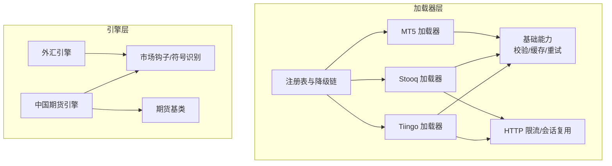
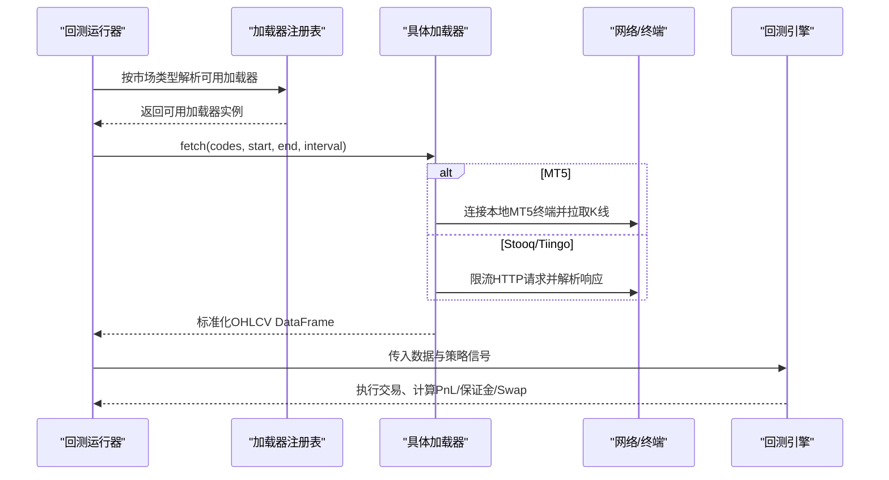
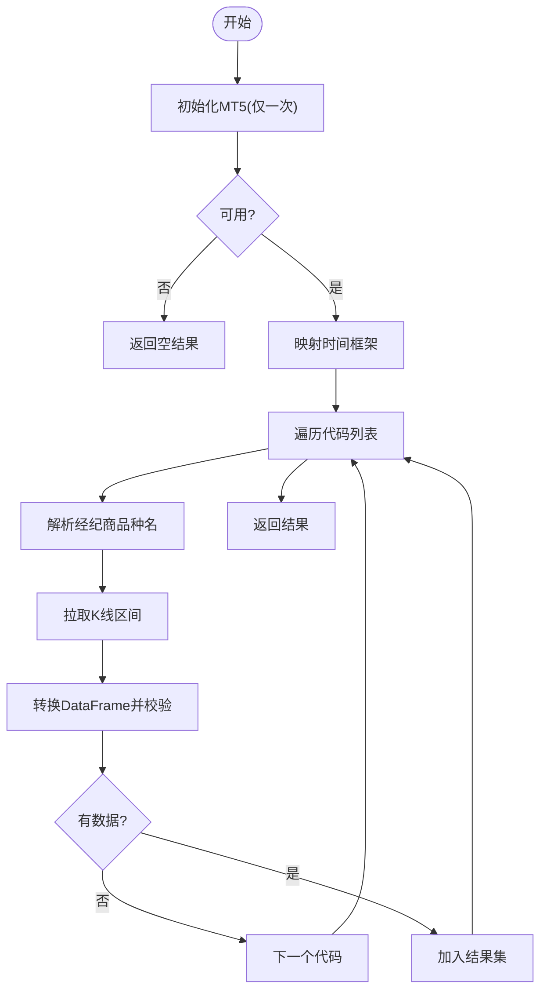
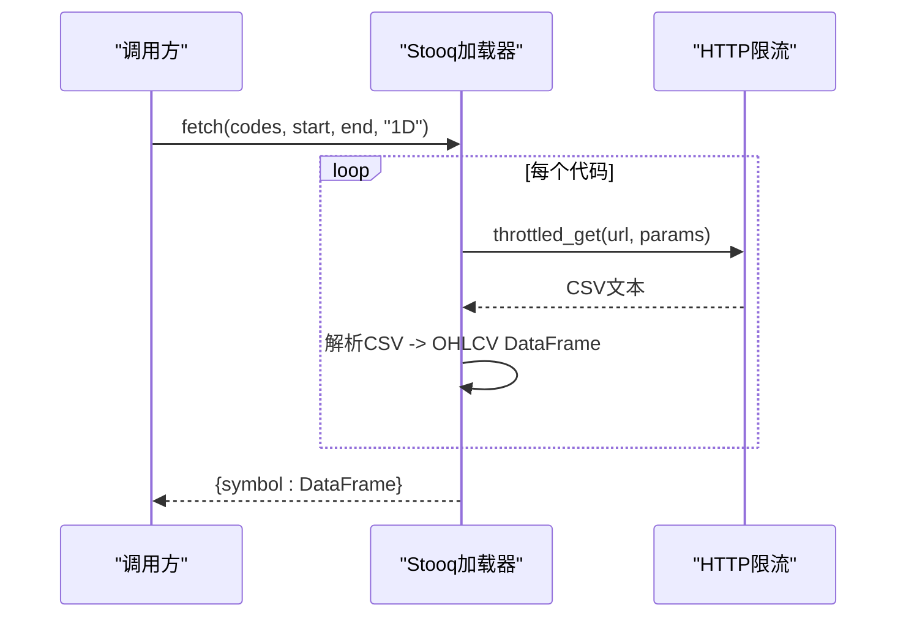
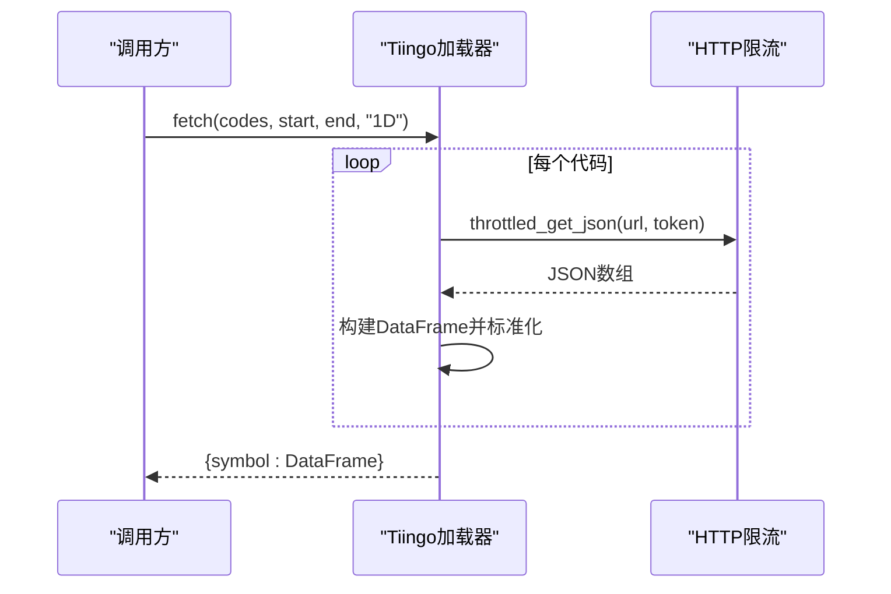
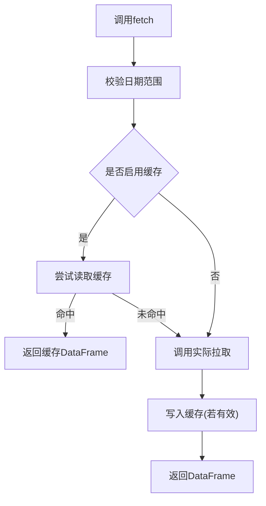
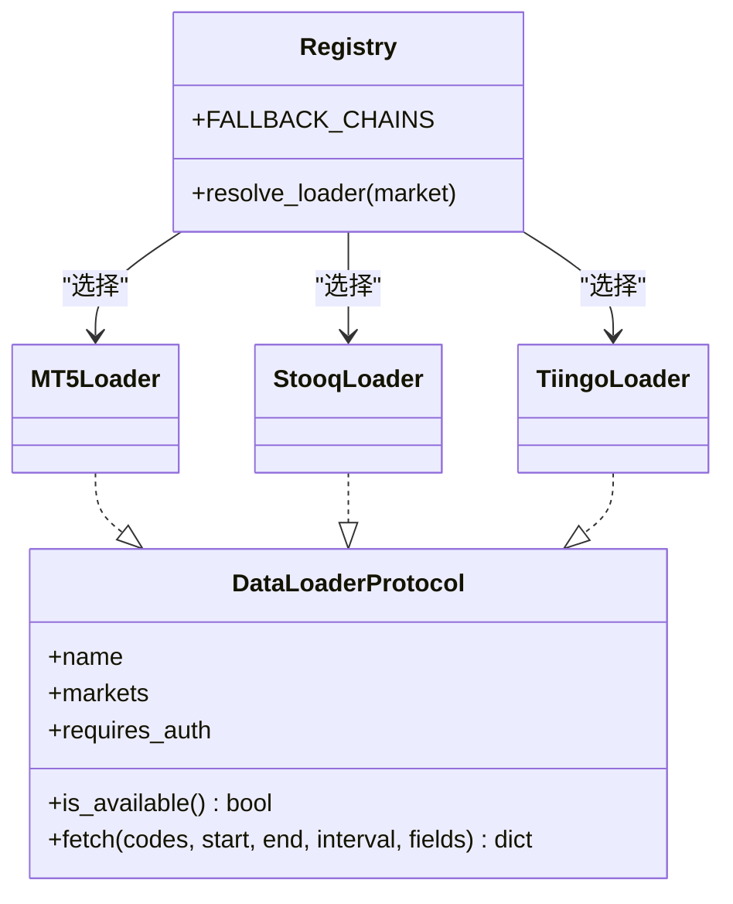
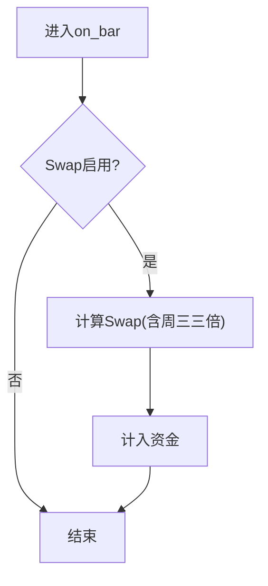
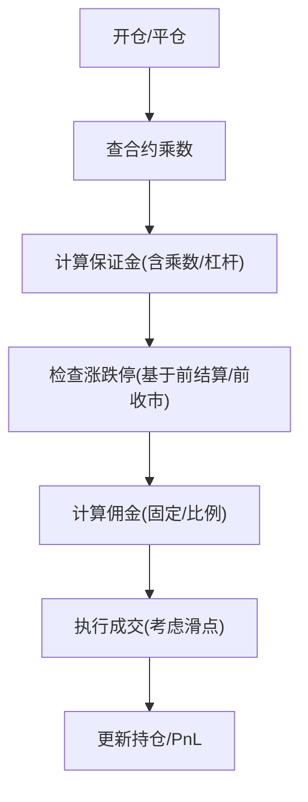
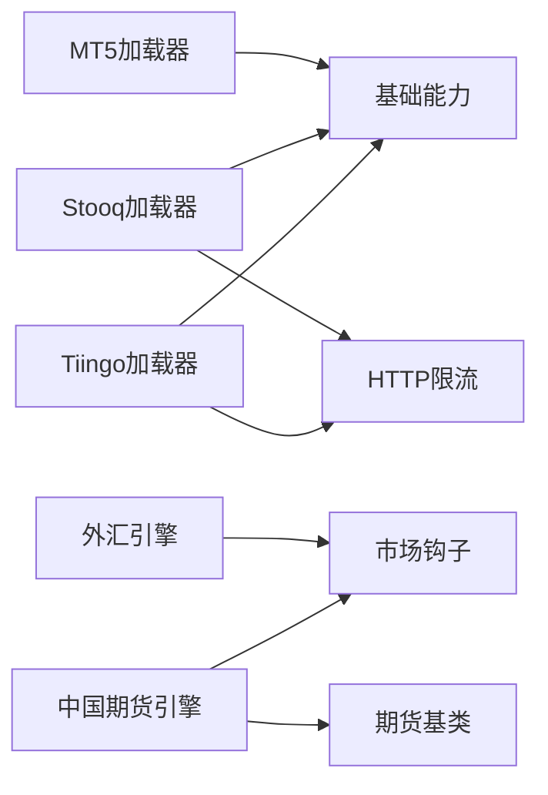

# 外汇期货加载器

<cite>
**本文引用的文件**
- [mt5_loader.py](file://agent/backtest/loaders/mt5_loader.py)
- [stooq_loader.py](file://agent/backtest/loaders/stooq_loader.py)
- [tiingo_loader.py](file://agent/backtest/loaders/tiingo_loader.py)
- [base.py](file://agent/backtest/loaders/base.py)
- [registry.py](file://agent/backtest/loaders/registry.py)
- [_http.py](file://agent/backtest/loaders/_http.py)
- [forex.py](file://agent/backtest/engines/forex.py)
- [futures_base.py](file://agent/backtest/engines/futures_base.py)
- [china_futures.py](file://agent/backtest/engines/china_futures.py)
- [_market_hooks.py](file://agent/backtest/engines/_market_hooks.py)
</cite>

## 目录
1. [简介](#简介)
2. [项目结构](#项目结构)
3. [核心组件](#核心组件)
4. [架构总览](#架构总览)
5. [详细组件分析](#详细组件分析)
6. [依赖关系分析](#依赖关系分析)
7. [性能与可靠性](#性能与可靠性)
8. [故障排查指南](#故障排查指南)
9. [结论](#结论)
10. [附录](#附录)

## 简介
本技术文档聚焦于外汇与期货市场的数据加载器实现，重点覆盖：
- MetaTrader5（MT5）本地终端连接、品种解析、历史K线获取
- Stooq与Tiingo等外部数据源在FX与期货领域的应用方式与限制
- 外汇市场的点差、滑点、杠杆、标准手、隔夜利息（Swap）等关键概念
- 期货的合约乘数、保证金、涨跌停板、佣金、交割与展期处理思路
- 实盘数据对接与模拟交易环境搭建建议
- 常见问题诊断与解决方案

## 项目结构
本项目将“数据加载器”与“回测引擎”解耦：
- 加载器层：负责从不同来源拉取OHLCV数据并统一为标准化DataFrame
- 引擎层：基于市场规则执行交易逻辑（点差、滑点、保证金、涨跌停、Swap等）
- 注册表与HTTP工具：提供按市场类型的自动降级链路与请求限流

图表来源
- [mt5_loader.py:170-251](file://agent/backtest/loaders/mt5_loader.py#L170-L251)
- [stooq_loader.py:74-166](file://agent/backtest/loaders/stooq_loader.py#L74-L166)
- [tiingo_loader.py:133-246](file://agent/backtest/loaders/tiingo_loader.py#L133-L246)
- [base.py:31-119, 243-441:168-256](file://agent/backtest/loaders/base.py#L168-L256)
- [registry.py:139-196](file://agent/backtest/loaders/registry.py#L139-L196)
- [_http.py:46-173](file://agent/backtest/loaders/_http.py#L46-L173)
- [forex.py:56-137](file://agent/backtest/engines/forex.py#L56-L137)
- [futures_base.py:19-57](file://agent/backtest/engines/futures_base.py#L19-L57)
- [china_futures.py:131-251](file://agent/backtest/engines/china_futures.py#L131-L251)
- [_market_hooks.py:23-60, 89-115, 135-181, 322-374:23-60](file://agent/backtest/engines/_market_hooks.py#L23-L60)

章节来源
- [registry.py:139-196](file://agent/backtest/loaders/registry.py#L139-L196)
- [base.py:168-256](file://agent/backtest/loaders/base.py#L168-L256)

## 核心组件
- MT5 加载器：通过本地MetaTrader5终端读取外汇/贵金属历史K线，支持品种后缀自动发现与时间范围裁剪
- Stooq 加载器：免费CSV接口拉取美股日频数据，内置限流与CSV解析
- Tiingo 加载器：REST API拉取美股日频数据，需API Key，JSON解析与标准化
- 基础能力：日期校验、OHLC结构校验、本地Parquet缓存、重试预算
- 注册表：按市场类型维护降级链，自动选择可用加载器
- HTTP工具：进程级Host限流与会话复用，避免被服务商封禁
- 外汇引擎：点差/滑点、标准手、隔夜利息、杠杆与PnL计算
- 期货基类与中国期货引擎：合约乘数、保证金、涨跌停、佣金、T+0与最小交易单位

章节来源
- [mt5_loader.py:170-251](file://agent/backtest/loaders/mt5_loader.py#L170-L251)
- [stooq_loader.py:74-166](file://agent/backtest/loaders/stooq_loader.py#L74-L166)
- [tiingo_loader.py:133-246](file://agent/backtest/loaders/tiingo_loader.py#L133-L246)
- [base.py:31-119, 243-441:168-256](file://agent/backtest/loaders/base.py#L168-L256)
- [registry.py:139-196](file://agent/backtest/loaders/registry.py#L139-L196)
- [_http.py:46-173](file://agent/backtest/loaders/_http.py#L46-L173)
- [forex.py:56-137](file://agent/backtest/engines/forex.py#L56-L137)
- [futures_base.py:19-57](file://agent/backtest/engines/futures_base.py#L19-L57)
- [china_futures.py:131-251](file://agent/backtest/engines/china_futures.py#L131-L251)

## 架构总览
系统采用“加载器-引擎”分层设计。加载器屏蔽多源差异，输出统一的OHLCV DataFrame；引擎依据市场规则进行下单、滑点、保证金、涨跌停、Swap等处理。注册表根据市场类型自动选择可用加载器，必要时降级到备选源。

图表来源
- [registry.py:614-649](file://agent/backtest/loaders/registry.py#L614-L649)
- [mt5_loader.py:186-251](file://agent/backtest/loaders/mt5_loader.py#L186-L251)
- [stooq_loader.py:92-166](file://agent/backtest/loaders/stooq_loader.py#L92-L166)
- [tiingo_loader.py:149-246](file://agent/backtest/loaders/tiingo_loader.py#L149-L246)
- [forex.py:124-137](file://agent/backtest/engines/forex.py#L124-L137)

## 详细组件分析

### MT5 加载器（外汇/贵金属）
- 本地终端连接：进程内一次性初始化MT5 SDK，支持从配置文件读取登录信息或附加已登录终端
- 品种管理：支持多种符号写法（如EURUSD、EUR/USD、EURUSD.FX），并通过symbols_get模糊匹配最短名称，解决经纪商后缀差异（如EURUSDm）
- 历史数据：使用copy_rates_range按区间拉取，转换为trade_date索引的OHLCV，体积用tick_volume代理
- 容错：单个品种失败不影响批次，未知间隔直接拒绝

图表来源
- [mt5_loader.py:79-108](file://agent/backtest/loaders/mt5_loader.py#L79-L108)
- [mt5_loader.py:111-147](file://agent/backtest/loaders/mt5_loader.py#L111-L147)
- [mt5_loader.py:162-179](file://agent/backtest/loaders/mt5_loader.py#L162-L179)
- [mt5_loader.py:186-251](file://agent/backtest/loaders/mt5_loader.py#L186-L251)

章节来源
- [mt5_loader.py:79-108](file://agent/backtest/loaders/mt5_loader.py#L79-L108)
- [mt5_loader.py:111-147](file://agent/backtest/loaders/mt5_loader.py#L111-L147)
- [mt5_loader.py:162-179](file://agent/backtest/loaders/mt5_loader.py#L162-L179)
- [mt5_loader.py:186-251](file://agent/backtest/loaders/mt5_loader.py#L186-L251)

### Stooq 加载器（美股日频）
- 数据源：免费CSV接口，无需认证，但受IP限流
- 限流：通过共享HTTP模块按主机桶限流与Session复用
- 解析：将Date列转为trade_date索引，统一为open/high/low/close/volume

图表来源
- [stooq_loader.py:92-166](file://agent/backtest/loaders/stooq_loader.py#L92-L166)
- [_http.py:141-173](file://agent/backtest/loaders/_http.py#L141-L173)

章节来源
- [stooq_loader.py:92-166](file://agent/backtest/loaders/stooq_loader.py#L92-L166)
- [_http.py:141-173](file://agent/backtest/loaders/_http.py#L141-L173)

### Tiingo 加载器（美股日频）
- 数据源：REST JSON接口，需要API Key
- 限流：同Stooq，按主机桶限流
- 解析：将ISO时间戳归一化为无时区午夜索引，统一数值类型

图表来源
- [tiingo_loader.py:149-246](file://agent/backtest/loaders/tiingo_loader.py#L149-L246)
- [_http.py:176-201](file://agent/backtest/loaders/_http.py#L176-L201)

章节来源
- [tiingo_loader.py:149-246](file://agent/backtest/loaders/tiingo_loader.py#L149-L246)
- [_http.py:176-201](file://agent/backtest/loaders/_http.py#L176-L201)

### 基础能力（校验、缓存、重试）
- 日期范围校验：确保start<=end且格式正确
- OHLC结构校验：剔除无效K线（如high<low、价格非正等），可配置严格模式
- 本地缓存：可选Parquet缓存，键由source/symbol/timeframe/date范围生成，避免重复拉取
- 重试预算：对瞬态异常进行有限次重试，超时即抛错

图表来源
- [base.py:168-256](file://agent/backtest/loaders/base.py#L168-L256)
- [base.py:243-441](file://agent/backtest/loaders/base.py#L243-L441)

章节来源
- [base.py:168-256](file://agent/backtest/loaders/base.py#L168-L256)
- [base.py:243-441](file://agent/backtest/loaders/base.py#L243-L441)

### 注册表与降级链
- 市场类型到加载器链：例如外汇优先MT5，否则akshare/yfinance/local
- 自动选择：按is_available()顺序尝试，任一失败继续下一条
- 特殊源保护：local/qveris/tickerall等显式请求不可静默降级到无关网络源

图表来源
- [registry.py:139-196](file://agent/backtest/loaders/registry.py#L139-L196)
- [base.py:851-887](file://agent/backtest/loaders/base.py#L851-L887)

章节来源
- [registry.py:139-196](file://agent/backtest/loaders/registry.py#L139-L196)
- [base.py:851-887](file://agent/backtest/loaders/base.py#L851-L887)

### 外汇引擎（点差、杠杆、隔夜利息）
- 点差与滑点：按货币对默认点差（JPY为0.01，其他为0.0001），叠加额外滑点；买入/卖出方向对称应用半点差
- 杠杆：默认100倍，影响保证金占用
- 标准手：100,000基础货币单位；持仓大小按1000单位（微手）对齐
- Swap：每日收盘结算，周三三倍；按多头/空头不同利率表计算
- PnL：以报价货币计价，交叉对以平仓价换算

图表来源
- [forex.py:56-137](file://agent/backtest/engines/forex.py#L56-L137)
- [_market_hooks.py:510-573](file://agent/backtest/engines/_market_hooks.py#L510-L573)

章节来源
- [forex.py:56-137](file://agent/backtest/engines/forex.py#L56-L137)
- [_market_hooks.py:510-573](file://agent/backtest/engines/_market_hooks.py#L510-L573)

### 期货引擎（合约乘数、保证金、涨跌停、佣金、交割/展期）
- 合约乘数：产品维度查表（如IF=300，rb=10，au=1000），影响PnL、保证金与头寸规模
- 保证金：按交易所最低保证金率或配置覆盖，杠杆=1/保证金率
- 涨跌停：基于前结算/前收市价计算上下限，执行时拦截越界订单
- 佣金：按产品固定每手或名义价值比例收取
- 交割/展期：回测中通常以连续合约或主力合约序列表示；展期价差与移仓成本可在策略层建模（不在加载器内硬编码）

图表来源
- [futures_base.py:19-57](file://agent/backtest/engines/futures_base.py#L19-L57)
- [china_futures.py:131-251](file://agent/backtest/engines/china_futures.py#L131-L251)

章节来源
- [futures_base.py:19-57](file://agent/backtest/engines/futures_base.py#L19-L57)
- [china_futures.py:131-251](file://agent/backtest/engines/china_futures.py#L131-L251)

## 依赖关系分析
- 加载器依赖：
  - MT5：Windows平台、MetaTrader5 SDK、本地终端在线
  - Stooq/Tiingo：HTTP访问、限流模块、pandas解析
  - 基础能力：pandas、duckdb（缓存）、requests（HTTP）
- 引擎依赖：
  - 外汇：市场钩子（Swap表、符号归一化）
  - 期货：合约乘数表、保证金率表、涨跌停规则、佣金表

图表来源
- [mt5_loader.py:170-251](file://agent/backtest/loaders/mt5_loader.py#L170-L251)
- [stooq_loader.py:74-166](file://agent/backtest/loaders/stooq_loader.py#L74-L166)
- [tiingo_loader.py:133-246](file://agent/backtest/loaders/tiingo_loader.py#L133-L246)
- [base.py:243-441](file://agent/backtest/loaders/base.py#L243-L441)
- [_http.py:46-173](file://agent/backtest/loaders/_http.py#L46-L173)
- [forex.py:56-137](file://agent/backtest/engines/forex.py#L56-L137)
- [futures_base.py:19-57](file://agent/backtest/engines/futures_base.py#L19-L57)
- [china_futures.py:131-251](file://agent/backtest/engines/china_futures.py#L131-L251)
- [_market_hooks.py:23-60, 89-115, 135-181, 322-374:23-60](file://agent/backtest/engines/_market_hooks.py#L23-L60)

章节来源
- [registry.py:139-196](file://agent/backtest/loaders/registry.py#L139-L196)
- [base.py:243-441](file://agent/backtest/loaders/base.py#L243-L441)

## 性能与可靠性
- 限流与并发：HTTP模块按主机桶限流并添加抖动，避免并发请求同步导致被封
- 缓存：本地Parquet缓存减少重复请求，仅对已结算日期范围生效
- 健壮性：单品种失败不中断批次；未知间隔或无数据直接跳过
- 资源占用：MT5初始化可能耗时，进程内缓存避免重复连接

优化建议
- 批量拉取时增大最小间隔环境变量以降低被封风险
- 合理设置缓存根目录，避免写入仓库工作树
- 对高频场景优先使用MT5本地终端，降低网络波动影响

[本节为通用指导，不直接分析具体文件]

## 故障排查指南
- MT5无法连接
  - 现象：is_available返回False，日志提示initialize失败或last_error
  - 排查：确认Windows环境、已安装SDK、终端已登录；检查配置文件路径与参数
  - 参考路径：[mt5_loader.py:79-108](file://agent/backtest/loaders/mt5_loader.py#L79-L108)
- 品种找不到
  - 现象：symbols_get无匹配，警告“未提供该品种”
  - 排查：确认经纪商后缀（如EURUSDm），或使用基础代码触发模糊匹配
  - 参考路径：[mt5_loader.py:121-147](file://agent/backtest/loaders/mt5_loader.py#L121-L147)
- 时间范围错误
  - 现象：抛出ValueError（start>end或格式非法）
  - 排查：检查日期字符串格式与顺序
  - 参考路径：[base.py:168-184](file://agent/backtest/loaders/base.py#L168-L184)
- OHLC结构异常
  - 现象：出现high<low或非正价格，被丢弃或告警
  - 排查：检查数据源质量；必要时放宽allow_nonpositive_prices
  - 参考路径：[base.py:187-256](file://agent/backtest/loaders/base.py#L187-L256)
- 网络被封或限流
  - 现象：Stooq/Tiingo频繁报错或空响应
  - 排查：提高*_MIN_INTERVAL环境变量；减少并发；更换网络出口
  - 参考路径：[_http.py:46-107](file://agent/backtest/loaders/_http.py#L46-L107)
- 外汇Swap未生效
  - 现象：资金未随Swap变化
  - 排查：确认swap_enabled为True；检查交易日历与周三三倍逻辑
  - 参考路径：[forex.py:124-137](file://agent/backtest/engines/forex.py#L124-L137), [_market_hooks.py:532-573](file://agent/backtest/engines/_market_hooks.py#L532-L573)
- 期货涨跌停拦截
  - 现象：开仓/平仓被拒绝
  - 排查：检查前结算/前收市价与涨跌停带；确认bar字段存在
  - 参考路径：[china_futures.py:161-188](file://agent/backtest/engines/china_futures.py#L161-L188)

章节来源
- [mt5_loader.py:79-108](file://agent/backtest/loaders/mt5_loader.py#L79-L108)
- [mt5_loader.py:121-147](file://agent/backtest/loaders/mt5_loader.py#L121-L147)
- [base.py:168-256](file://agent/backtest/loaders/base.py#L168-L256)
- [_http.py:46-107](file://agent/backtest/loaders/_http.py#L46-L107)
- [forex.py:124-137](file://agent/backtest/engines/forex.py#L124-L137)
- [_market_hooks.py:532-573](file://agent/backtest/engines/_market_hooks.py#L532-L573)
- [china_futures.py:161-188](file://agent/backtest/engines/china_futures.py#L161-L188)

## 结论
本方案通过标准化的加载器与引擎分离架构，实现了外汇与期货数据的可靠接入与交易仿真：
- MT5提供贴近真实经纪商环境的本地数据接入
- Stooq/Tiingo作为免费/低成本替代，满足美股日频需求
- 外汇与期货引擎分别实现点差、Swap、合约乘数、保证金、涨跌停等关键机制
- 注册表与HTTP限流保障系统的鲁棒性与可扩展性

建议在实盘中优先使用MT5直连，结合本地缓存与限流策略；在研究阶段可使用Stooq/Tiingo快速验证策略。

[本节为总结性内容，不直接分析具体文件]

## 附录
- 外汇市场要点
  - 点差：按货币对默认值（JPY为0.01，其他为0.0001），可通过spread_pips_override全局覆盖
  - 杠杆：默认100倍，影响保证金占用
  - 标准手：100,000基础货币单位；下单按1000单位对齐
  - Swap：每日结算，周三三倍；按多头/空头不同利率表
- 期货市场要点
  - 合约乘数：产品维度查表，影响PnL与保证金
  - 保证金：按交易所最低保证金率或配置覆盖
  - 涨跌停：基于前结算/前收市价计算上下限
  - 佣金：固定每手或名义价值比例
  - 交割/展期：回测中以连续合约或主力序列表示；展期成本可在策略层建模
- 实盘与模拟环境搭建
  - 实盘：安装MT5终端并登录；配置mt5.json；确保Windows环境
  - 模拟：使用Stooq/Tiingo进行离线回测；调整限流与缓存参数
  - 数据桥接：如需本地文件接入，配置local源并确保Data Bridge配置正确

[本节为补充说明，不直接分析具体文件]