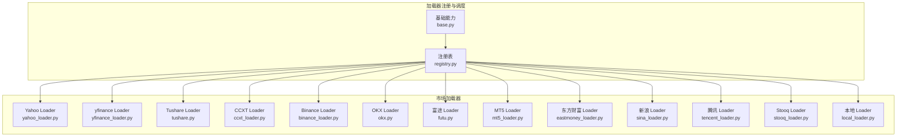
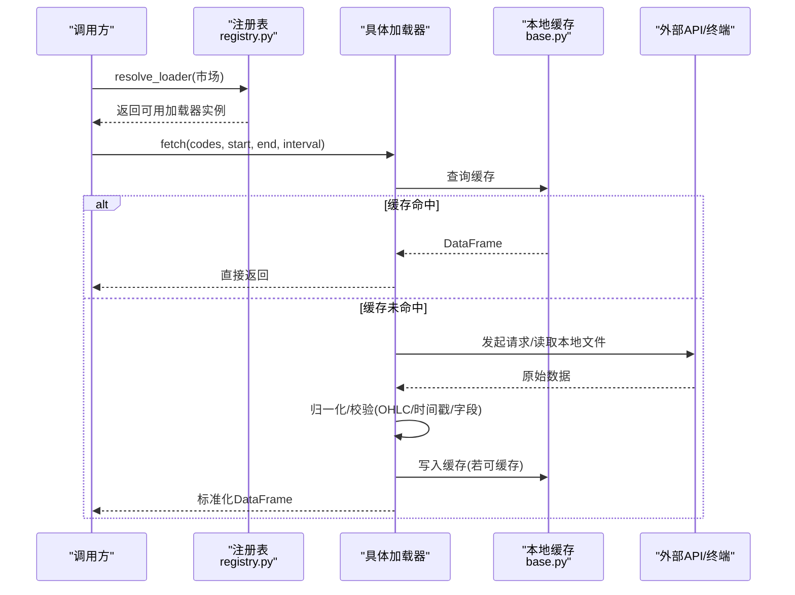
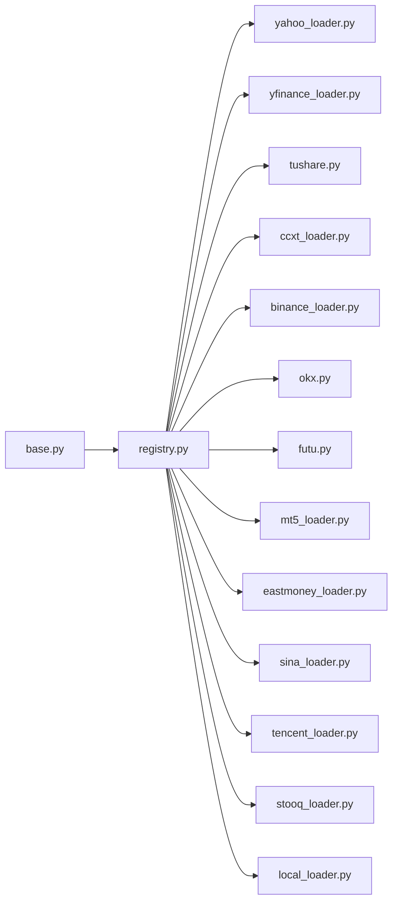

# 市场数据加载器

<cite>
**本文引用的文件**
- [base.py](file://agent/backtest/loaders/base.py)
- [registry.py](file://agent/backtest/loaders/registry.py)
- [yahoo_loader.py](file://agent/backtest/loaders/yahoo_loader.py)
- [yfinance_loader.py](file://agent/backtest/loaders/yfinance_loader.py)
- [tushare.py](file://agent/backtest/loaders/tushare.py)
- [ccxt_loader.py](file://agent/backtest/loaders/ccxt_loader.py)
- [binance_loader.py](file://agent/backtest/loaders/binance_loader.py)
- [futu.py](file://agent/backtest/loaders/futu.py)
- [mt5_loader.py](file://agent/backtest/loaders/mt5_loader.py)
- [eastmoney_loader.py](file://agent/backtest/loaders/eastmoney_loader.py)
- [okx.py](file://agent/backtest/loaders/okx.py)
- [sina_loader.py](file://agent/backtest/loaders/sina_loader.py)
- [tencent_loader.py](file://agent/backtest/loaders/tencent_loader.py)
- [stooq_loader.py](file://agent/backtest/loaders/stooq_loader.py)
- [local_loader.py](file://agent/backtest/loaders/local_loader.py)
</cite>

## 目录
1. [简介](#简介)
2. [项目结构](#项目结构)
3. [核心组件](#核心组件)
4. [架构总览](#架构总览)
5. [详细组件分析](#详细组件分析)
6. [依赖关系分析](#依赖关系分析)
7. [性能考量](#性能考量)
8. [故障排查指南](#故障排查指南)
9. [结论](#结论)
10. [附录](#附录)

## 简介
本技术文档聚焦于“市场数据加载器”子系统，覆盖美股（Yahoo Finance、yfinance）、A股（Tushare、东方财富、腾讯、新浪、Stooq等）、加密货币（OKX、Binance、CCXT）、港股/A股（富途）、外汇/期货（MetaTrader5）以及本地数据源（CSV/Parquet/DuckDB）。文档从系统架构、组件职责、数据流与处理逻辑、认证与限制、市场特定处理（交易日历、复权因子、货币换算、时区）、性能优化（批量请求、缓存、并发与预算控制）、使用示例与最佳实践（错误处理、重试、数据验证）等方面展开，并提供对比表帮助选型。

## 项目结构
- 统一接口与基础设施：所有加载器实现统一的 DataLoaderProtocol（名称、市场集合、是否需认证、可用性检查、fetch 方法），并通过注册表自动发现与按市场回退选择。
- 市场回退链：按市场类型维护优先顺序，例如 A 股优先腾讯/同花顺/东方财富/本地；美股优先 Yahoo/Stooq/Sina；加密优先 OKX/Binance/CCXT；外汇优先 MT5。
- 公共能力：日期校验、OHLC 不变量校验、可选本地 Parquet 缓存、带预算的重试与超时控制、代理配置、最小间隔限流等。

图表来源
- [registry.py:1-256](file://agent/backtest/loaders/registry.py#L1-L256)
- [base.py:1-657](file://agent/backtest/loaders/base.py#L1-L657)

章节来源
- [registry.py:1-256](file://agent/backtest/loaders/registry.py#L1-L256)
- [base.py:1-657](file://agent/backtest/loaders/base.py#L1-L657)

## 核心组件
- DataLoaderProtocol：定义 name/markets/requires_auth/is_available/fetch 的统一契约，并声明 volume_units 约定（如 A 股为“手”，港股/美股为“股”）。
- 注册表与回退链：按市场维护加载器优先级，resolve_loader 会尝试每个候选的 is_available() 并返回首个可用者；get_loader_cls_with_fallback 支持显式 source 不可用时的同市场回退。
- 基础工具：
  - 日期范围校验 validate_date_range
  - OHLC 不变量校验 validate_ohlc（结构性与正负价格策略）
  - 可选本地缓存 loader_cache_*（基于 Parquet + DuckDB，版本化键，仅对已结算区间写入）
  - 重试与预算 retry_with_budget/check_budget（带单调时钟截止与指数退避）
  - 环境变量读取 positive_env_int/positive_env_float

章节来源
- [base.py:164-256](file://agent/backtest/loaders/base.py#L164-L256)
- [base.py:377-450](file://agent/backtest/loaders/base.py#L377-L450)
- [base.py:243-441](file://agent/backtest/loaders/base.py#L243-L441)
- [registry.py:131-196](file://agent/backtest/loaders/registry.py#L131-L196)
- [registry.py:199-256](file://agent/backtest/loaders/registry.py#L199-L256)

## 架构总览
下图展示从调用方到具体加载器的典型流程，包括缓存命中、网络请求、重试与预算控制、结果归一化与校验。

图表来源
- [registry.py:614-649](file://agent/backtest/loaders/registry.py#L614-L649)
- [base.py:565-661](file://agent/backtest/loaders/base.py#L565-L661)
- [base.py:398-450](file://agent/backtest/loaders/base.py#L398-L450)

## 详细组件分析

### Yahoo Finance（美股/港股/加股/印度/韩国）
- 特性与限制
  - 免费直连 HTTP，无需认证；支持 US/HK/India/Korea/Canada 等后缀符号；日频为主，分钟/小时通过映射获取。
  - 不支持 4H 原生 K 线，内部近似为 1h。
- 认证方式
  - 无认证。
- 数据范围
  - 通过 epoch 秒窗口拉取，按起止日期裁剪；分钟级保留真实时间戳，日级及以上归一化为午夜索引。
- 市场特定处理
  - 时间戳转换：将 UTC 时间转为 tz-naive 索引；非日内周期归一化到午夜以对齐其他加载器。
  - 成交量单位：美股/港股为“股”。
- 性能优化
  - 使用共享客户端节流；每标的独立缓存；异常隔离（单标失败不影响批次）。
- 使用要点
  - 输入代码形如 AAPL.US、00700.HK、TD.TO；interval 支持 1D/1H/4H→1h/1W/1M。

章节来源
- [yahoo_loader.py:1-275](file://agent/backtest/loaders/yahoo_loader.py#L1-L275)

### yfinance（全球权益/加密）
- 特性与限制
  - 基于 yfinance 包；支持 US/HK/India/Korea/Canada 及加密；批量下载后按标的拆分；4H 通过 1h 重采样聚合。
- 认证方式
  - 无认证。
- 数据范围
  - 支持分钟至月频；自动调整关闭，保持原始价格序列。
- 市场特定处理
  - 多列 MultiIndex 扁平化；去重与缺失值处理；4H 特殊重采样。
- 性能优化
  - 先查缓存再批量下载；失败回退到单标的下载；异常日志化不中断批次。
- 使用要点
  - 代码映射规则见实现；interval 映射包含 1m/5m/15m/30m/1H/4H/1W/1M。

章节来源
- [yfinance_loader.py:1-346](file://agent/backtest/loaders/yfinance_loader.py#L1-L346)

### Tushare（A股/港股/期货/基金）
- 特性与限制
  - 需要 Token；支持日频与分钟频（部分权限）；ETF/指数/港股/美股权重不同；分钟频仅限 A 股股票。
- 认证方式
  - 需要 TUSHARE_TOKEN。
- 数据范围
  - 日频：daily/fund_daily/index_daily；分钟频：stk_mins（频率受限）。
- 市场特定处理
  - 复权因子：除指数/港股外，尝试获取 adj_factor 并应用前复权；若无可用因子则丢弃该标的以防回测偏差。
  - 基本财务字段：可按 fields 合并 daily_basic 指标（仅限股票）。
  - 配额限制：识别“每分钟/每天/抽取/访问该接口/频率”等关键词进行退避重试。
- 性能优化
  - 每标的缓存；配额退避；异常隔离。
- 使用要点
  - 代码格式：A 股 .SZ/.SH，港股 .HK；分钟频仅支持 1m/5m/15m/30m/1H。

章节来源
- [tushare.py:1-386](file://agent/backtest/loaders/tushare.py#L1-L386)

### CCXT（加密货币通用）
- 特性与限制
  - 通过 CCXT 连接 100+ 交易所；默认 Binance；支持现货与永续合约（USD-M）；公开行情无需 API Key。
- 认证方式
  - 公开数据无需认证；永续保证金参数通过外部 artifact 注入（避免在线签名端点）。
- 数据范围
  - 支持多种周期；分页拉取，带页上限与完整度检查；永续合约额外拉取标记价与资金费率历史。
- 市场特定处理
  - 符号解析：BASE-USDT-PERP → swap；否则 spot。
  - 资金费率：仅在整点（0/8/16）结算，缺失会报错；标记价与成交价时间对齐校验。
  - 保证金档位：通过受校验的外部 artifact 注入，禁止在线拉取。
- 性能优化
  - 请求超时、预算控制、网络错误重试；代理配置；延迟导入 ccxt 以避免冷路径开销。
- 使用要点
  - 可通过 CCXT_EXCHANGE 切换交易所；-PERP 符号需配合 bracket_artifacts 使用。

章节来源
- [ccxt_loader.py:1-502](file://agent/backtest/loaders/ccxt_loader.py#L1-L502)

### Binance（加密货币专用）
- 特性与限制
  - 基于 CCXT 但固定使用 Binance/Binance USD-M；公开行情无需 Key。
- 认证方式
  - 无认证。
- 数据范围
  - 与 CCXT 一致，但强制 Binance 后端。
- 性能优化
  - 复用 CCXT 的超时/代理/重试机制。
- 使用要点
  - 适合在加密回退链中作为 OKX 之外的备选。

章节来源
- [binance_loader.py:1-45](file://agent/backtest/loaders/binance_loader.py#L1-L45)

### 富途（港股/A股）
- 特性与限制
  - 需要本地 FutuOpenD 服务与端口；支持多周期（分钟/小时/日/周/月）。
- 认证方式
  - 通过主机/端口连接本地网关。
- 数据范围
  - 历史 K 线分页拉取；支持 A 股与港股。
- 市场特定处理
  - 代码转换：700.HK → HK.00700；000001.SZ → SZ.000001；600519.SH → SH.600519。
- 性能优化
  - 先查缓存，命中则无需连接网关；分页拉取；异常隔离。
- 使用要点
  - 设置 FUTU_HOST/FUTU_PORT；interval 必须为支持的 KLType。

章节来源
- [futu.py:1-253](file://agent/backtest/loaders/futu.py#L1-L253)

### MetaTrader5（外汇/贵金属/期货）
- 特性与限制
  - 需要 Windows 与 MT5 终端登录；历史深度受终端“最大K线数”限制；支持多周期。
- 认证方式
  - 通过 mt5.json 或自动附加最近登录终端。
- 数据范围
  - 通过 copy_rates_range 拉取；tick_volume 作为成交量代理。
- 市场特定处理
  - 符号解析：去除分隔符，支持 .FX 后缀；按 broker 实际符号名匹配（含账户类型后缀）。
  - 时区：传入 UTC 时间，避免本地时区偏移导致范围错位。
- 性能优化
  - 进程内初始化状态缓存；符号解析缓存；异常隔离。
- 使用要点
  - 安装可选依赖；确保终端运行且可连接；interval 映射包含 m/h/d/w/mn。

章节来源
- [mt5_loader.py:1-251](file://agent/backtest/loaders/mt5_loader.py#L1-L251)

### 东方财富（A股/港股/美股）
- 特性与限制
  - 免费 HTTP 接口，按 IP 限速；通过共享客户端节流；支持 A/HK/US。
- 认证方式
  - 无认证。
- 数据范围
  - 通过 secid 路由与 klt 周期拉取；返回行转标准 OHLCV。
- 市场特定处理
  - 成交量单位：A 股为“手”，港股为“股”。
- 性能优化
  - 每标的缓存；异常隔离；统一节流。
- 使用要点
  - 代码格式：600519.SH / 00700.HK / AAPL.US；interval 由 KLT_BY_INTERVAL 映射。

章节来源
- [eastmoney_loader.py:1-183](file://agent/backtest/loaders/eastmoney_loader.py#L1-L183)

### OKX（加密货币）
- 特性与限制
  - 公开 REST V5；近期 K 线与历史 K 线双端点；支持分钟/小时/日；深度历史优先 history-candles。
- 认证方式
  - 无认证。
- 数据范围
  - 分页拉取，按 after 游标回溯；确认标志过滤；分钟/小周期页上限更高。
- 市场特定处理
  - 时间戳：UTC 毫秒转 tz-naive；每日开盘为 UTC+8 午夜，统一为绝对 UTC 时间。
- 性能优化
  - 代理支持；HTTP 429/5xx 重试；预算控制；可用性探测。
- 使用要点
  - 代码大写并用“-”分隔；interval 区分大小写（1m vs 1M）。

章节来源
- [okx.py:1-373](file://agent/backtest/loaders/okx.py#L1-L373)

### 新浪（美股日频）
- 特性与限制
  - JSONP 接口，仅日频；按 IP 限速；无需认证。
- 认证方式
  - 无认证。
- 数据范围
  - 解析 JSONP 包裹数组，构建 OHLCV。
- 市场特定处理
  - 仅支持 .US 后缀；interval 仅接受日频别名。
- 性能优化
  - 共享节流；每标的缓存。
- 使用要点
  - 代码形如 AAPL.US；interval 必须为日频。

章节来源
- [sina_loader.py:1-201](file://agent/backtest/loaders/sina_loader.py#L1-L201)

### 腾讯（A股/港股）
- 特性与限制
  - 免费 HTTP 接口；仅日频；无需认证。
- 认证方式
  - 无认证。
- 数据范围
  - 构造 URL 拉取 qfqday/day；A 股与港股零填充规则不同。
- 市场特定处理
  - 成交量单位：A 股为“手”，港股为“股”。
- 性能优化
  - 每标的缓存；异常隔离。
- 使用要点
  - 代码格式：600519.SH / 00700.HK；interval 仅日频。

章节来源
- [tencent_loader.py:1-164](file://agent/backtest/loaders/tencent_loader.py#L1-L164)

### Stooq（美股日频）
- 特性与限制
  - CSV 下载；仅日频；按 IP 限速；无需认证。
- 认证方式
  - 无认证。
- 数据范围
  - 解析 CSV 头 Date,Open,High,Low,Close,Volume；未知符号返回 N/D。
- 市场特定处理
  - 代码小写并保留 .us；成交量为“股”。
- 性能优化
  - 共享节流；每标的缓存。
- 使用要点
  - 代码形如 aapl.us；interval 仅日频。

章节来源
- [stooq_loader.py:1-202](file://agent/backtest/loaders/stooq_loader.py#L1-L202)

### 本地数据源（CSV/Parquet/DuckDB）
- 特性与限制
  - 从用户配置文件读取数据；支持 CSV/Parquet/DuckDB；可自定义列映射与日期格式；支持重采样。
- 认证方式
  - 无认证。
- 数据范围
  - 任意粒度；若请求更细粒度无法上采样，返回原粒度并告警。
- 市场特定处理
  - 统一 UTC 解析后转 tz-naive 索引；OHLC 校验；volume 缺失补 0。
- 性能优化
  - 每标的缓存；重采样按需执行；异常隔离。
- 使用要点
  - 配置文件位于 ~/.vibe-trading/data-bridge/config.yaml；支持 local: 前缀指定来源。

章节来源
- [local_loader.py:1-354](file://agent/backtest/loaders/local_loader.py#L1-L354)

## 依赖关系分析
- 加载器均通过 @register 装饰器向全局 LOADER_REGISTRY 注册，并在 _ensure_registered 时懒加载模块。
- 各加载器依赖 base 提供的校验、缓存与重试工具；部分加载器依赖第三方库（yfinance、ccxt、MetaTrader5、futu）。
- 回退链按市场组织，保证在首选不可用时平滑降级。

图表来源
- [registry.py:84-117](file://agent/backtest/loaders/registry.py#L84-L117)
- [base.py:851-887](file://agent/backtest/loaders/base.py#L851-L887)

章节来源
- [registry.py:84-117](file://agent/backtest/loaders/registry.py#L84-L117)
- [base.py:851-887](file://agent/backtest/loaders/base.py#L851-L887)

## 性能考量
- 批量请求
  - yfinance 支持批量下载后按标的拆分，减少握手与解析开销。
  - CCXT/OKX 采用分页拉取，限制每页大小与最大页数，避免无限循环。
- 缓存机制
  - 所有加载器普遍使用 cached_loader_fetch；仅对已结算区间写入 Parquet；读/写失败均非致命。
- 并发与预算
  - 通过 check_budget 与 retry_with_budget 控制单次 fetch 的总耗时与重试次数；网络错误分类重试，业务错误立即抛出。
- 节流与代理
  - 免费接口（Sina/Eastmoney/Stooq/Tencent）通过共享节流器按 host 限流；CCXT/OKX 支持代理环境变量。
- 资源惰性加载
  - 仅在必要时导入重型依赖（ccxt、MetaTrader5、futu），降低冷启动成本。

[本节提供通用指导，不直接分析具体文件]

## 故障排查指南
- 常见错误与定位
  - 无可用数据源：当某市场所有候选加载器不可用时抛出 NoAvailableSourceError；检查网络、Token、本地终端或配置文件。
  - 日期范围无效：validate_date_range 会拒绝非法或倒序日期。
  - OHLC 异常：validate_ohlc 会剔除或拒绝违反不变量的 K 线；可根据策略记录或中止。
  - 配额限制（Tushare）：识别关键词并退避重试；若仍失败，降低请求频率或提升权限。
  - 代理/超时：CCXT/OKX 支持代理环境变量；合理设置超时与预算。
- 调试建议
  - 开启日志观察警告信息；检查缓存目录是否存在脏数据；确认本地文件路径与列映射正确。
  - 对于 MT5，确认终端已登录且可连接；检查 mt5.json 配置。
  - 对于富途，确认 FutuOpenD 运行且端口可达。

章节来源
- [base.py:164-256](file://agent/backtest/loaders/base.py#L164-L256)
- [tushare.py:18-79](file://agent/backtest/loaders/tushare.py#L18-L79)
- [mt5_loader.py:70-108](file://agent/backtest/loaders/mt5_loader.py#L70-L108)
- [futu.py:80-101](file://agent/backtest/loaders/futu.py#L80-L101)
- [okx.py:109-125](file://agent/backtest/loaders/okx.py#L109-L125)

## 结论
本加载器体系通过统一协议、注册表与回退链，实现了跨市场、跨数据源的稳定接入；借助缓存、重试与预算控制，兼顾了可靠性与性能。针对不同市场的特性（复权、成交量单位、时区、符号命名），各加载器提供了精细化的适配与校验。开发者可根据目标市场与数据需求选择合适的加载器，并结合缓存与重试策略获得稳定的回测与实盘数据供给。

[本节总结性内容，不直接分析具体文件]

## 附录

### 加载器对比表
- 市场覆盖
  - Yahoo：美股/港股/印度/韩国/加拿大
  - yfinance：美股/港股/印度/韩国/加拿大/加密
  - Tushare：A股/港股/期货/基金（需 Token）
  - CCXT：加密（多交易所，公开数据）
  - Binance：加密（Binance 专用）
  - 富途：港股/A股（需本地网关）
  - MT5：外汇/贵金属/期货（需终端）
  - 东方财富：A股/港股/美股（免费）
  - OKX：加密（公开）
  - 新浪：美股日频（免费）
  - 腾讯：A股/港股日频（免费）
  - Stooq：美股日频（免费）
  - 本地：CSV/Parquet/DuckDB（用户数据）
- 认证要求
  - 需认证：Tushare、富途、MT5
  - 免认证：其余
- 主要限制
  - 新浪/腾讯/Stooq：仅日频
  - 富途：需本地网关
  - MT5：Windows + 终端
  - Tushare：分钟频权限限制
  - CCXT/OKX：网络与配额限制
- 推荐场景
  - 美股日频：Yahoo/Stooq/Sina
  - A 股/港股：Tushare（高质量/复权）、东方财富/腾讯（免费）
  - 加密：OKX/Binance/CCXT
  - 外汇/期货：MT5（精确经纪商数据）
  - 自有数据：本地加载器

[本节为概念性汇总，不直接分析具体文件]