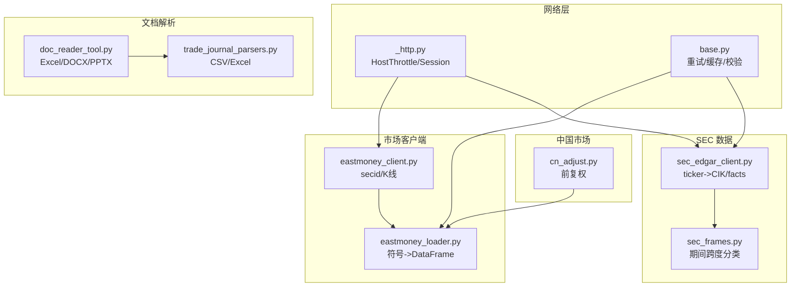
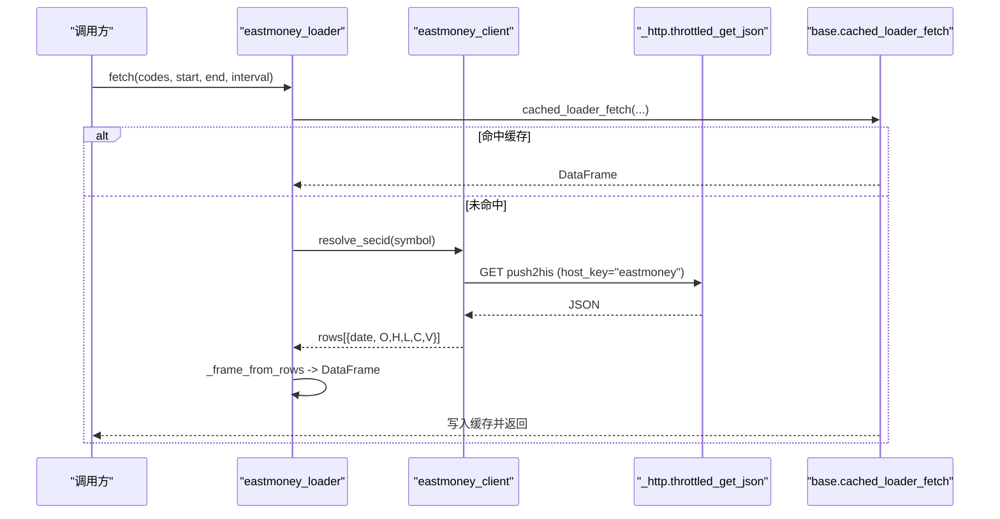
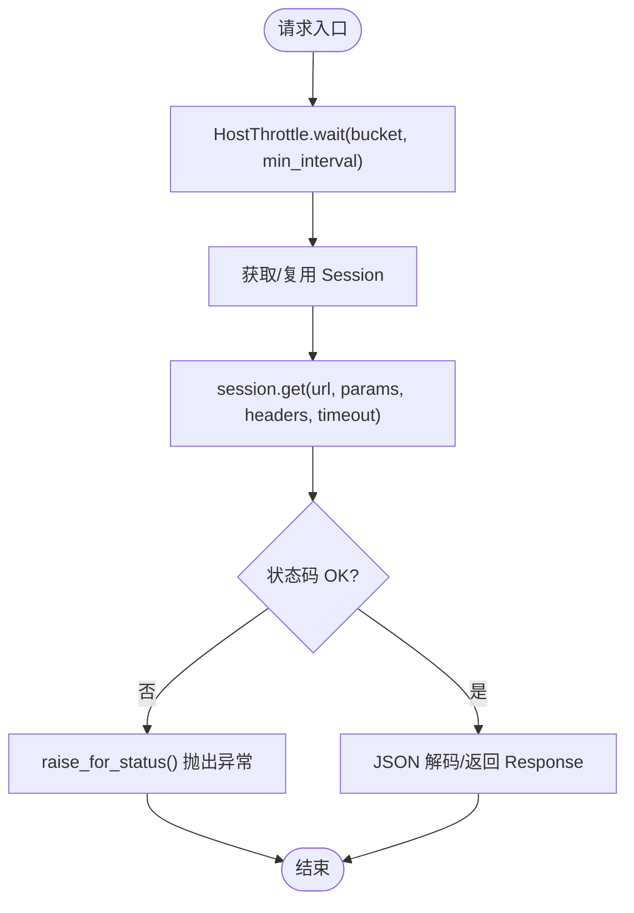
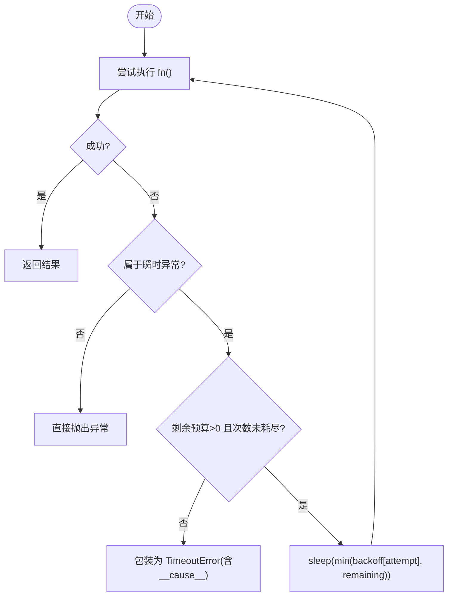
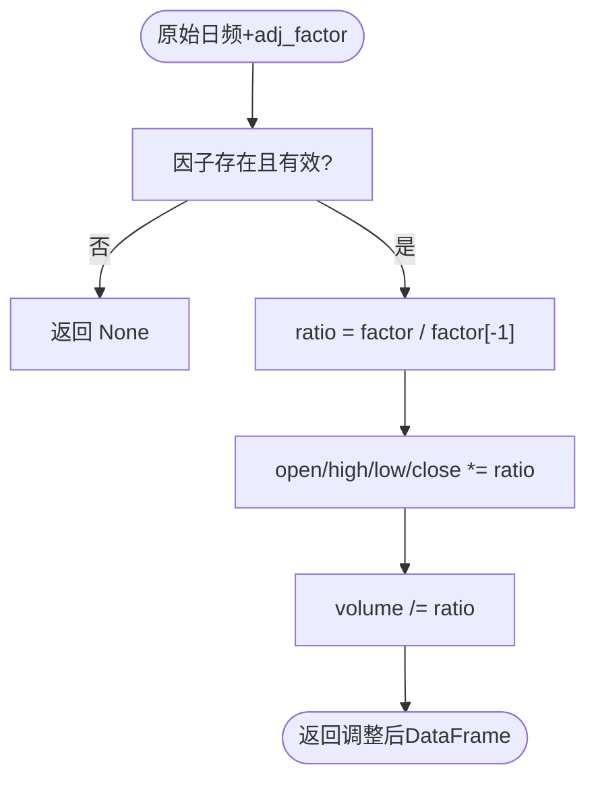
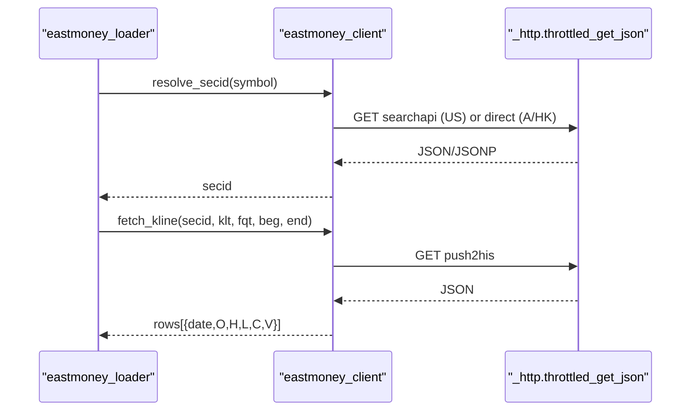
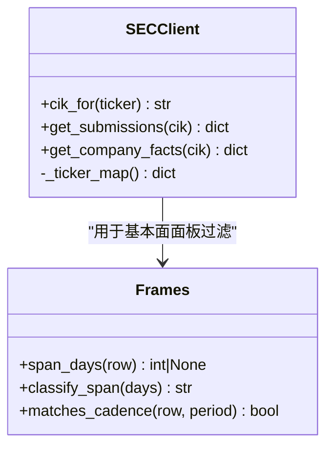
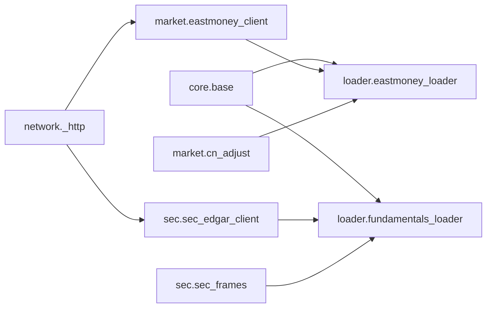

# 数据处理工具

<cite>
**本文引用的文件**
- [agent/backtest/loaders/_http.py](file://agent/backtest/loaders/_http.py)
- [agent/backtest/loaders/base.py](file://agent/backtest/loaders/base.py)
- [agent/backtest/loaders/eastmoney_client.py](file://agent/backtest/loaders/eastmoney_client.py)
- [agent/backtest/loaders/eastmoney_loader.py](file://agent/backtest/loaders/eastmoney_loader.py)
- [agent/backtest/loaders/cn_adjust.py](file://agent/backtest/loaders/cn_adjust.py)
- [agent/backtest/loaders/sec_edgar_client.py](file://agent/backtest/loaders/sec_edgar_client.py)
- [agent/backtest/loaders/sec_frames.py](file://agent/backtest/loaders/sec_frames.py)
- [agent/src/tools/doc_reader_tool.py](file://agent/src/tools/doc_reader_tool.py)
- [agent/src/tools/trade_journal_parsers.py](file://agent/src/tools/trade_journal_parsers.py)
</cite>

## 目录
1. [简介](#简介)
2. [项目结构](#项目结构)
3. [核心组件](#核心组件)
4. [架构总览](#架构总览)
5. [详细组件分析](#详细组件分析)
6. [依赖关系分析](#依赖关系分析)
7. [性能考虑](#性能考虑)
8. [故障诊断与调试](#故障诊断与调试)
9. [结论](#结论)
10. [附录](#附录)

## 简介
本文件面向数据加载器辅助工具的工程化使用与维护，聚焦以下能力：
- HTTP 请求封装：统一限速、会话复用、超时控制、代理支持（通过环境变量）、错误传播。
- 中国股市复权因子处理：前复权计算、除权除息影响校正、成交量缩放与金额不变原则。
- 东方财富客户端：secid 解析、K线拉取、JSONP 兼容、市场后缀映射、缓存策略。
- SEC 文件格式解析：ticker->CIK 映射、提交索引与 XBRL companyfacts 获取、期间跨度分类与 PIT 安全面板生成。
- 多格式解析器：Excel/CSV/DOCX/PPTX 等文档读取、交易流水 CSV 编码自动探测。
- 性能优化：连接池管理、并发去抖、本地 Parquet 缓存、预算内重试。
- 错误诊断与调试：日志记录、异常包装、可观测性提示。

## 项目结构
数据加载相关代码集中在 agent/backtest/loaders 下，辅以通用工具与文档解析工具：
- 网络层：_http.py 提供进程级 HostThrottle、按 host bucket 的 requests.Session 复用、throttled_get/throttled_get_json。
- 基础能力：base.py 提供重试预算、OHLC 校验、本地 loader 缓存（Parquet + DuckDB）。
- 市场客户端：eastmoney_client.py 实现 Eastmoney 的 secid 解析与 K线拉取；eastmoney_loader.py 将符号/周期映射到 DataFrame。
- 中国市场复权：cn_adjust.py 实现 Tushare 前复权调整。
- SEC 数据：sec_edgar_client.py 负责 ticker->CIK、submissions/companyfacts 获取；sec_frames.py 负责期间跨度分类。
- 文档解析：doc_reader_tool.py 支持 Excel/DOCX/PPTX 读取；trade_journal_parsers.py 支持 CSV/Excel 交易流水读取与编码探测。

图表来源
- [agent/backtest/loaders/_http.py:1-201](file://agent/backtest/loaders/_http.py#L1-L201)
- [agent/backtest/loaders/base.py:1-657](file://agent/backtest/loaders/base.py#L1-L657)
- [agent/backtest/loaders/eastmoney_client.py:1-325](file://agent/backtest/loaders/eastmoney_client.py#L1-L325)
- [agent/backtest/loaders/eastmoney_loader.py:1-183](file://agent/backtest/loaders/eastmoney_loader.py#L1-L183)
- [agent/backtest/loaders/cn_adjust.py:1-78](file://agent/backtest/loaders/cn_adjust.py#L1-L78)
- [agent/backtest/loaders/sec_edgar_client.py:1-235](file://agent/backtest/loaders/sec_edgar_client.py#L1-L235)
- [agent/backtest/loaders/sec_frames.py:1-129](file://agent/backtest/loaders/sec_frames.py#L1-L129)
- [agent/src/tools/doc_reader_tool.py:245-281](file://agent/src/tools/doc_reader_tool.py#L245-L281)
- [agent/src/tools/trade_journal_parsers.py:130-172](file://agent/src/tools/trade_journal_parsers.py#L130-L172)

章节来源
- [agent/backtest/loaders/_http.py:1-201](file://agent/backtest/loaders/_http.py#L1-L201)
- [agent/backtest/loaders/base.py:1-657](file://agent/backtest/loaders/base.py#L1-L657)

## 核心组件
- HTTP 限速与会话复用：按 host bucket 维护最小间隔与抖动，避免同主机突发请求被限流或封禁；每个 bucket 复用 requests.Session 以摊销 TCP/TLS 开销。
- 重试与预算：基于单调时钟的 deadline 与指数退避，仅对声明的瞬时异常重试，失败时包装为 TimeoutError 并保留 __cause__。
- 本地缓存：可选的 Parquet 缓存，内容寻址键（source/symbol/timeframe/date range/fields），DuckDB 读写，原子替换，元数据保存 index/columns/dtypes。
- OHLC 校验：统一剔除高低价逻辑冲突、非正价格等结构性脏数据，保障回测指标稳定。
- 中国市场前复权：基于 adj_factor 比率将价格序列缩放到窗口末值，成交量反向缩放，金额保持不变。
- Eastmoney 客户端：A/HK/US 市场 secid 解析、push2his K线拉取、JSONP 兼容、过程级 US secid 缓存。
- SEC 客户端：ticker->CIK 表一次性拉取并缓存，submissions/companyfacts 获取，期间跨度分类用于 PIT 安全面板。
- 文档解析：Excel/DOCX/PPTX 读取预览；交易流水 CSV/Excel 读取并自动尝试多种编码。

章节来源
- [agent/backtest/loaders/_http.py:46-173](file://agent/backtest/loaders/_http.py#L46-L173)
- [agent/backtest/loaders/base.py:127-236](file://agent/backtest/loaders/base.py#L127-L236)
- [agent/backtest/loaders/base.py:243-441](file://agent/backtest/loaders/base.py#L243-L441)
- [agent/backtest/loaders/base.py:477-598](file://agent/backtest/loaders/base.py#L477-L598)
- [agent/backtest/loaders/cn_adjust.py:27-78](file://agent/backtest/loaders/cn_adjust.py#L27-L78)
- [agent/backtest/loaders/eastmoney_client.py:136-267](file://agent/backtest/loaders/eastmoney_client.py#L136-L267)
- [agent/backtest/loaders/sec_edgar_client.py:45-163](file://agent/backtest/loaders/sec_edgar_client.py#L45-L163)
- [agent/backtest/loaders/sec_frames.py:42-129](file://agent/backtest/loaders/sec_frames.py#L42-L129)
- [agent/src/tools/doc_reader_tool.py:255-278](file://agent/src/tools/doc_reader_tool.py#L255-L278)
- [agent/src/tools/trade_journal_parsers.py:130-172](file://agent/src/tools/trade_journal_parsers.py#L130-L172)

## 架构总览
数据从外部源经网络层进入，经市场客户端/SEC 客户端转换为结构化数据，再由 loader 组装为标准 DataFrame，必要时应用中国市场复权，最终输出供回测/因子使用。

图表来源
- [agent/backtest/loaders/eastmoney_loader.py:69-183](file://agent/backtest/loaders/eastmoney_loader.py#L69-L183)
- [agent/backtest/loaders/eastmoney_client.py:300-355](file://agent/backtest/loaders/eastmoney_client.py#L300-L355)
- [agent/backtest/loaders/_http.py:141-201](file://agent/backtest/loaders/_http.py#L141-L201)
- [agent/backtest/loaders/base.py:623-661](file://agent/backtest/loaders/base.py#L623-L661)

## 详细组件分析

### HTTP 请求封装（限速、会话、超时、代理）
- HostThrottle：进程级最小间隔门控，按 host bucket 维护最近触发时间与间隔，加入随机抖动避免同步爆发；定期清理过期桶。
- Session 复用：按 host bucket 缓存 requests.Session，减少握手成本；默认 User-Agent 伪装浏览器。
- throttled_get / throttled_get_json：统一入口，合并 headers，传入 timeout；JSON 版本会 raise_for_status 并解码。
- 代理支持：requests 默认遵循系统/环境变量代理设置，无需额外配置。
- 超时：默认 15 秒，可按需覆盖；结合 base.retry_with_budget 形成整体超时与重试策略。

图表来源
- [agent/backtest/loaders/_http.py:46-173](file://agent/backtest/loaders/_http.py#L46-L173)
- [agent/backtest/loaders/_http.py:176-201](file://agent/backtest/loaders/_http.py#L176-L201)

章节来源
- [agent/backtest/loaders/_http.py:46-201](file://agent/backtest/loaders/_http.py#L46-L201)

### 重试机制与预算控制
- retry_with_budget：对指定瞬时异常进行有限次重试，每次睡眠不超过剩余预算；超时会包装为 TimeoutError 并保留原始异常链。
- check_budget：在分页/循环中检查是否超过截止时间，快速失败。
- 适用场景：任何不稳定的外部 API 调用，如交易所、数据提供商。

图表来源
- [agent/backtest/loaders/base.py:377-450](file://agent/backtest/loaders/base.py#L377-L450)

章节来源
- [agent/backtest/loaders/base.py:377-450](file://agent/backtest/loaders/base.py#L377-L450)

### 中国股市复权因子处理（前复权）
- 输入：Tushare 未复权日频行情与对应 adj_factor 序列。
- 逻辑：将价格序列按比例缩放到窗口末值（前复权），成交量除以相同比例，金额列保持现金量不变。
- 健壮性：缺失/无效因子直接返回 None，由上层丢弃该标的，避免污染收益序列。

图表来源
- [agent/backtest/loaders/cn_adjust.py:27-78](file://agent/backtest/loaders/cn_adjust.py#L27-L78)

章节来源
- [agent/backtest/loaders/cn_adjust.py:27-78](file://agent/backtest/loaders/cn_adjust.py#L27-L78)

### 东方财富客户端（secid 解析与 K线拉取）
- secid 解析：A 股 SH/SZ/BJ、港股 HK（5位数字补零）、美股通过搜索端点解析并缓存。
- K线拉取：push2his 接口，字段选择 fields1/fields2，支持 fqt 复权模式；返回升序 OHLCV 列表。
- JSONP 兼容：先尝试原生 JSON，再匹配回调包裹体后解析。
- 节流：所有请求走 eastmoney 专属 host bucket，最小间隔可通过环境变量覆盖。

图表来源
- [agent/backtest/loaders/eastmoney_client.py:136-267](file://agent/backtest/loaders/eastmoney_client.py#L136-L267)
- [agent/backtest/loaders/eastmoney_client.py:300-355](file://agent/backtest/loaders/eastmoney_client.py#L300-L355)
- [agent/backtest/loaders/_http.py:141-201](file://agent/backtest/loaders/_http.py#L141-L201)

章节来源
- [agent/backtest/loaders/eastmoney_client.py:1-325](file://agent/backtest/loaders/eastmoney_client.py#L1-L325)
- [agent/backtest/loaders/eastmoney_loader.py:1-183](file://agent/backtest/loaders/eastmoney_loader.py#L1-L183)

### SEC 文件格式解析（EDGAR REST）
- ticker->CIK：一次性拉取 company_tickers.json 并构建进程级缓存，支持 .US 后缀剥离与 share class 连字符转换。
- submissions/companyfacts：通过 CIK 获取公司近期提交与 XBRL 全量事实。
- 期间跨度分类：根据 start/end 计算跨度，区分 instant/quarter/annual/ytd，避免 YTD 与季度混淆。
- PIT 安全：基本面面板以 filed 日期可见，ttm 采用滚动四季报求和近似。

图表来源
- [agent/backtest/loaders/sec_edgar_client.py:45-163](file://agent/backtest/loaders/sec_edgar_client.py#L45-L163)
- [agent/backtest/loaders/sec_edgar_client.py:166-227](file://agent/backtest/loaders/sec_edgar_client.py#L166-L227)
- [agent/backtest/loaders/sec_frames.py:42-129](file://agent/backtest/loaders/sec_frames.py#L42-L129)

章节来源
- [agent/backtest/loaders/sec_edgar_client.py:1-235](file://agent/backtest/loaders/sec_edgar_client.py#L1-L235)
- [agent/backtest/loaders/sec_frames.py:1-129](file://agent/backtest/loaders/sec_frames.py#L1-L129)
- [agent/backtest/loaders/fundamentals_loader.py:1-200](file://agent/backtest/loaders/fundamentals_loader.py#L1-L200)

### 多格式解析器（Excel、PDF、XML 等）
- Excel：通过 pandas.ExcelFile 逐 sheet 读取，返回行×列预览与元信息。
- CSV：自动尝试 utf-8-sig/utf-8/utf-16/gbk/gb2312 编码，失败抛错。
- DOCX/PPTX：提取段落与表格文本，便于报告阅读。
- XML：本项目主要使用 JSON/XML 的 EDGAR REST 接口；如需自定义 XML 解析，可参考上述 CSV/Excel 的错误处理与编码探测模式。

章节来源
- [agent/src/tools/doc_reader_tool.py:245-281](file://agent/src/tools/doc_reader_tool.py#L245-L281)
- [agent/src/tools/trade_journal_parsers.py:130-172](file://agent/src/tools/trade_journal_parsers.py#L130-L172)

## 依赖关系分析
- _http.py 被 eastmoney_client.py、sec_edgar_client.py 复用，作为统一网络出口。
- base.py 被各 loader 复用，提供重试、缓存、校验等横切能力。
- eastmoney_loader.py 依赖 eastmoney_client.py 完成具体协议细节。
- fundamentals_loader.py 依赖 sec_edgar_client.py 与 sec_frames.py 完成 SEC 基本面面板。
- cn_adjust.py 独立于网络层，专注中国市场复权逻辑。

图表来源
- [agent/backtest/loaders/_http.py:1-201](file://agent/backtest/loaders/_http.py#L1-L201)
- [agent/backtest/loaders/base.py:1-657](file://agent/backtest/loaders/base.py#L1-L657)
- [agent/backtest/loaders/eastmoney_client.py:1-325](file://agent/backtest/loaders/eastmoney_client.py#L1-L325)
- [agent/backtest/loaders/eastmoney_loader.py:1-183](file://agent/backtest/loaders/eastmoney_loader.py#L1-L183)
- [agent/backtest/loaders/sec_edgar_client.py:1-235](file://agent/backtest/loaders/sec_edgar_client.py#L1-L235)
- [agent/backtest/loaders/sec_frames.py:1-129](file://agent/backtest/loaders/sec_frames.py#L1-L129)
- [agent/backtest/loaders/cn_adjust.py:1-78](file://agent/backtest/loaders/cn_adjust.py#L1-L78)

章节来源
- [agent/backtest/loaders/_http.py:1-201](file://agent/backtest/loaders/_http.py#L1-L201)
- [agent/backtest/loaders/base.py:1-657](file://agent/backtest/loaders/base.py#L1-L657)

## 性能考虑
- 连接池管理：按 host bucket 复用 requests.Session，显著降低 TCP/TLS 握手成本。
- 并发控制：HostThrottle 保证同一 host 的最小间隔，避免触发服务端限流；抖动避免并发锁步。
- 本地缓存：启用 VIBE_TRADING_DATA_CACHE 后可将已结算区间的 DataFrame 持久化为 Parquet，使用 DuckDB 高效读写；键包含 source/symbol/timeframe/date range/fields，确保一致性。
- 内存优化：缓存写入时记录 index dtypes 与 columns name，读回时尽量恢复原类型；只序列化必要列，避免冗余。
- 重试与预算：retry_with_budget 限制最大重试次数与总耗时，防止长尾阻塞；check_budget 在分页循环中快速失败。
- 代理支持：requests 默认遵循系统代理环境变量，适合企业网络环境。

章节来源
- [agent/backtest/loaders/_http.py:46-173](file://agent/backtest/loaders/_http.py#L46-L173)
- [agent/backtest/loaders/base.py:243-441](file://agent/backtest/loaders/base.py#L243-L441)
- [agent/backtest/loaders/base.py:477-598](file://agent/backtest/loaders/base.py#L477-L598)
- [agent/backtest/loaders/base.py:377-450](file://agent/backtest/loaders/base.py#L377-L450)

## 故障诊断与调试
- 日志记录：各模块使用标准 logging，关键路径（如 secid 解析失败、缓存读写失败、OHLC 校验告警）均有日志输出。
- 异常包装：重试失败统一包装为 TimeoutError，并保留原始异常链，便于定位根因。
- 常见错误：
  - 网络限流：提高 VIBE_TRADING_EASTMONEY_MIN_INTERVAL/VIBE_TRADING_SEC_MIN_INTERVAL 以降低频率。
  - 缓存损坏：自动降级到在线拉取；检查磁盘权限与 DuckDB 安装。
  - 编码问题：CSV 读取失败时确认文件编码，或使用工具自动探测。
  - 日期格式：确保 start_date/end_date 符合 YYYY-MM-DD 规范。
- 调试建议：
  - 开启详细日志，观察 HostThrottle 等待时间、重试次数与异常堆栈。
  - 临时关闭缓存验证是否为缓存导致的数据不一致。
  - 针对 SEC 数据，检查 ticker->CIK 映射是否包含目标标的。

章节来源
- [agent/backtest/loaders/_http.py:141-201](file://agent/backtest/loaders/_http.py#L141-L201)
- [agent/backtest/loaders/base.py:377-450](file://agent/backtest/loaders/base.py#L377-L450)
- [agent/backtest/loaders/base.py:477-598](file://agent/backtest/loaders/base.py#L477-L598)
- [agent/backtest/loaders/eastmoney_client.py:210-236](file://agent/backtest/loaders/eastmoney_client.py#L210-L236)
- [agent/src/tools/trade_journal_parsers.py:130-172](file://agent/src/tools/trade_journal_parsers.py#L130-L172)

## 结论
本套数据加载器辅助工具提供了稳健的网络层、跨市场客户端、中国市场复权、SEC 基本面面板与多格式解析能力，并通过本地缓存与重试预算显著提升鲁棒性与性能。建议在批量任务中合理设置最小间隔与预算，启用缓存以减少重复请求；在出现限流或网络波动时，优先检查节流参数与日志信息。

## 附录
- 环境变量参考：
  - VIBE_TRADING_EASTMONEY_MIN_INTERVAL：东方财富最小请求间隔（秒）。
  - VIBE_TRADING_SEC_MIN_INTERVAL：SEC 最小请求间隔（秒）。
  - VIBE_TRADING_SEC_UA：SEC 请求 User-Agent 覆盖。
  - VIBE_TRADING_DATA_CACHE：是否启用本地缓存。
  - VIBE_TRADING_DATA_CACHE_ROOT：缓存根目录。
- 最佳实践：
  - 对所有不稳定外部 API 使用 retry_with_budget，限定 transient 异常类别。
  - 对高频访问的主机使用 HostThrottle 并按业务需求设置 min_interval。
  - 对已结算区间启用本地缓存，缩短二次运行时间。
  - 对 OHLC 数据统一调用 validate_ohlc，避免脏数据污染回测。