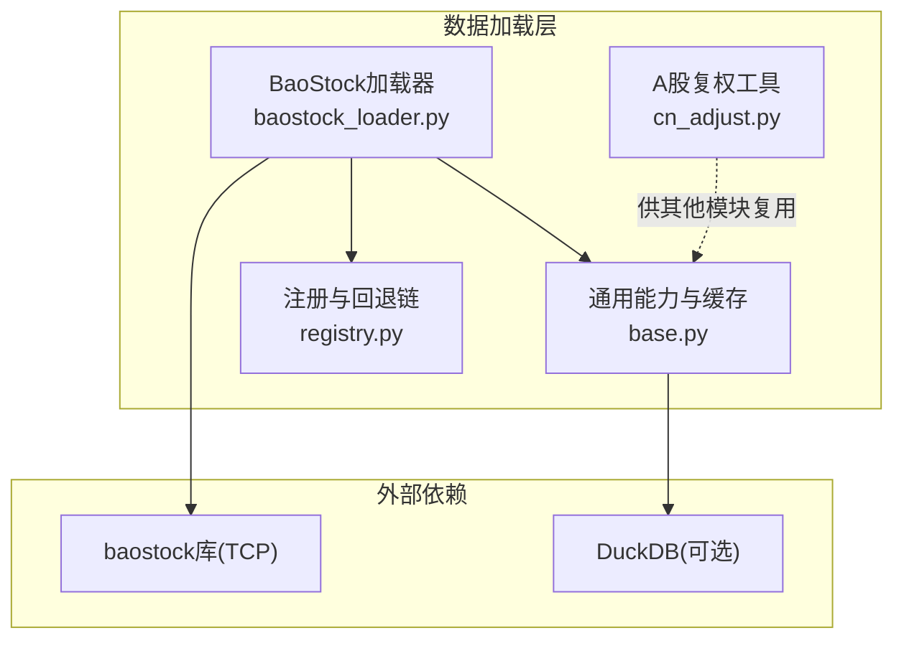
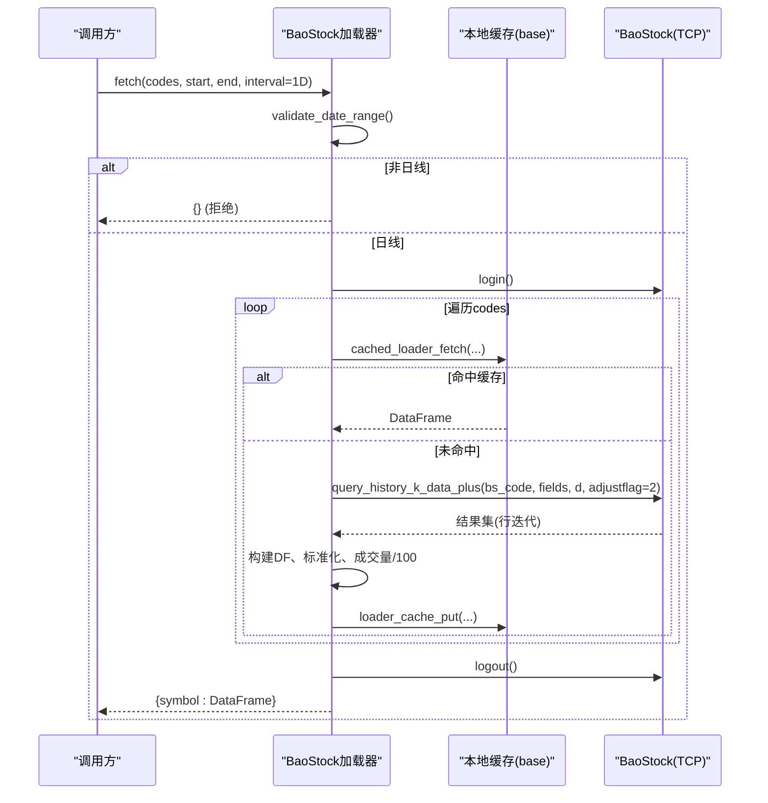
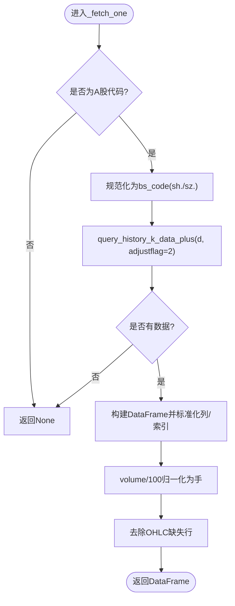
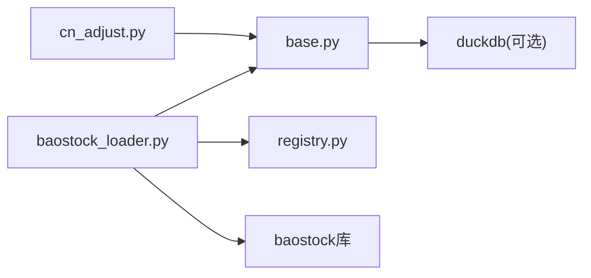

# BaoStock加载器

<cite>
**本文引用的文件**
- [baostock_loader.py](file://agent/backtest/loaders/baostock_loader.py)
- [base.py](file://agent/backtest/loaders/base.py)
- [registry.py](file://agent/backtest/loaders/registry.py)
- [cn_adjust.py](file://agent/backtest/loaders/cn_adjust.py)
- [test_baostock_loader.py](file://agent/tests/test_baostock_loader.py)
- [test_baostock_interval_reject.py](file://agent/tests/test_baostock_interval_reject.py)
</cite>

## 目录
1. [简介](#简介)
2. [项目结构](#项目结构)
3. [核心组件](#核心组件)
4. [架构总览](#架构总览)
5. [详细组件分析](#详细组件分析)
6. [依赖关系分析](#依赖关系分析)
7. [性能与批量优化](#性能与批量优化)
8. [故障排查指南](#故障排查指南)
9. [结论](#结论)
10. [附录：配置示例与调优建议](#附录：配置示例与调优建议)

## 简介
本文件面向BaoStock A股市场数据加载器的实现与使用，覆盖以下要点：
- BaoStock作为开源A股数据源的特点与限制（免费、无需鉴权、TCP协议、仅A股、日线）
- 数据获取流程：登录机制、数据下载、本地缓存策略
- A股特有数据处理逻辑：复权因子、除权除息、交易日历等
- 批量处理优化：分片下载、断点续传、错误恢复
- 配置示例与性能调优建议
- 常见问题解决方案：网络连接、数据完整性检查等

## 项目结构
BaoStock加载器位于回测数据加载子系统中，遵循统一的DataLoader协议，并通过注册表进行市场级自动选择与降级。关键文件：
- 加载器实现：agent/backtest/loaders/baostock_loader.py
- 通用能力与缓存：agent/backtest/loaders/base.py
- 市场级回退链与注册：agent/backtest/loaders/registry.py
- A股复权处理工具：agent/backtest/loaders/cn_adjust.py
- 单元测试：agent/tests/test_baostock_loader.py, agent/tests/test_baostock_interval_reject.py

图表来源
- [baostock_loader.py:32-112](file://agent/backtest/loaders/baostock_loader.py#L32-L112)
- [base.py:243-441](file://agent/backtest/loaders/base.py#L243-L441)
- [registry.py:139-158](file://agent/backtest/loaders/registry.py#L139-L158)

章节来源
- [baostock_loader.py:1-174](file://agent/backtest/loaders/baostock_loader.py#L1-L174)
- [base.py:1-657](file://agent/backtest/loaders/base.py#L1-L657)
- [registry.py:1-256](file://agent/backtest/loaders/registry.py#L1-L256)
- [cn_adjust.py:1-78](file://agent/backtest/loaders/cn_adjust.py#L1-L78)

## 核心组件
- BaoStock加载器(DataLoader)
  - 名称与声明：name="baostock"，markets={"a_share"}，requires_auth=False
  - 成交量单位：a_share为“手”（lots），内部将BaoStock原始“股”归一化为“手”
  - 可用性检测：is_available()通过尝试导入baostock判断
  - 数据获取：fetch()支持codes列表、start_date/end_date、interval=1D（仅日线）
  - 单标的获取：_fetch_one()负责代码格式转换、调用BaoStock历史K线接口、构造DataFrame并标准化列名与索引
- 通用能力(base.py)
  - 日期范围校验、OHLC有效性校验
  - 重试预算与指数退避（retry_with_budget、check_budget）
  - 本地Parquet缓存（loader_cache_*系列函数），含版本控制、原子写入、元数据持久化
- 注册与回退(registry.py)
  - 全局注册表与懒加载
  - 市场级回退链：a_share优先tencent/mootdx/eastmoney，其次baostock，再akshare/tushare/local
- A股复权(cn_adjust.py)
  - 前复权apply_qfq：基于adj_factor对价格缩放、对成交量反向缩放，保持金额不变

章节来源
- [baostock_loader.py:23-174](file://agent/backtest/loaders/baostock_loader.py#L23-L174)
- [base.py:168-256](file://agent/backtest/loaders/base.py#L168-L256)
- [base.py:398-450](file://agent/backtest/loaders/base.py#L398-L450)
- [base.py:243-441](file://agent/backtest/loaders/base.py#L243-L441)
- [registry.py:139-158](file://agent/backtest/loaders/registry.py#L139-L158)
- [cn_adjust.py:27-78](file://agent/backtest/loaders/cn_adjust.py#L27-L78)

## 架构总览
BaoStock加载器在回测数据管线中的位置如下：
- 上层请求按市场类型选择加载器（registry回退链）
- 若选择baostock，则执行：
  - 校验区间与时间粒度（仅1D）
  - 登录BaoStock（TCP）
  - 逐标的拉取历史K线（日线）
  - 通过cached_loader_fetch走本地缓存（可选）
  - 标准化输出（trade_date索引、OHLCV列、成交量归一化为手）
  - 登出BaoStock

图表来源
- [baostock_loader.py:55-112](file://agent/backtest/loaders/baostock_loader.py#L55-L112)
- [baostock_loader.py:114-174](file://agent/backtest/loaders/baostock_loader.py#L114-L174)
- [base.py:623-661](file://agent/backtest/loaders/base.py#L623-L661)

## 详细组件分析

### BaoStock加载器类
- 职责
  - 声明市场与单位：a_share，volume单位为“手”
  - 可用性检查：依赖baostock库是否可导入
  - 批量拉取：循环codes，逐个调用_fetch_one，聚合结果
  - 登录/登出：一次会话内完成所有标的查询，减少连接开销
- 关键行为
  - 仅支持日线：interval非日线的请求直接返回空字典，避免误用
  - 代码格式兼容：同时接受sh.601398/sz.000001与601398.SH/000001.SZ
  - 字段与复权：固定字段date/open/high/low/close/volume/amount；adjustflag=2表示前复权
  - 数据清洗：日期转datetime，数值列coerce，去缺失OHLC行，设置trade_date为索引
  - 成交量归一化：BaoStock原始单位为“股”，统一除以100得到“手”（允许小数手）

图表来源
- [baostock_loader.py:114-174](file://agent/backtest/loaders/baostock_loader.py#L114-L174)

章节来源
- [baostock_loader.py:23-174](file://agent/backtest/loaders/baostock_loader.py#L23-L174)
- [test_baostock_loader.py:1-151](file://agent/tests/test_baostock_loader.py#L1-L151)
- [test_baostock_interval_reject.py:1-31](file://agent/tests/test_baostock_interval_reject.py#L1-L31)

### 本地缓存策略（base.py）
- 启用方式
  - 环境变量开关：VIBE_TRADING_DATA_CACHE（需显式True）
  - 根路径：VIBE_TRADING_DATA_CACHE_ROOT（默认~/.vibe-trading/cache/loaders）
- 缓存键与版本
  - 内容寻址键：source/symbol/timeframe/start/end/fields的JSON序列化后SHA256
  - 版本位：_LOADER_CACHE_VERSION=4（当数据结构或单位变化时升级，避免旧缓存被误用）
- 读写语义
  - 读：loader_cache_get仅在end_date已结算（非今日及未来）且缓存存在时返回
  - 写：loader_cache_put以原子方式写入parquet与json元数据，失败不阻塞主流程
  - 读取使用DuckDB加速，保留索引列名与dtype信息
- 适用场景
  - 适合批量重复拉取相同区间的历史数据，显著降低网络与解析成本

章节来源
- [base.py:243-441](file://agent/backtest/loaders/base.py#L243-L441)
- [base.py:477-598](file://agent/backtest/loaders/base.py#L477-L598)

### 市场级回退链（registry.py）
- a_share回退顺序：tencent → mootdx → eastmoney → baostock → akshare → tushare → local
- 含义：当首选不可用时自动降级到baostock，保证A股数据可用性与鲁棒性

章节来源
- [registry.py:139-158](file://agent/backtest/loaders/registry.py#L139-L158)

### A股复权与除权除息（cn_adjust.py）
- 背景：部分数据源返回未复权价格，跨除权日的收益率会被机械性价格跳空污染
- 方法：apply_qfq使用前复权因子series对价格缩放、对成交量反向缩放，金额保持不变
- 注意：BaoStock本身已返回前复权（adjustflag=2），因此本模块主要用于其他未复权数据源的统一处理

章节来源
- [cn_adjust.py:1-78](file://agent/backtest/loaders/cn_adjust.py#L1-L78)

## 依赖关系分析
- 外部依赖
  - baostock库：提供TCP协议的历史K线接口，无需API Key
  - pandas：数据框操作与类型转换
  - duckdb（可选）：用于本地缓存的parquet读写
- 内部依赖
  - base：日期校验、OHLC校验、重试预算、本地缓存
  - registry：市场回退链与加载器注册
  - cn_adjust：A股复权工具（与其他加载器共用）

图表来源
- [baostock_loader.py:10-18](file://agent/backtest/loaders/baostock_loader.py#L10-L18)
- [base.py:243-441](file://agent/backtest/loaders/base.py#L243-L441)
- [registry.py:84-117](file://agent/backtest/loaders/registry.py#L84-L117)

章节来源
- [baostock_loader.py:10-18](file://agent/backtest/loaders/baostock_loader.py#L10-L18)
- [base.py:243-441](file://agent/backtest/loaders/base.py#L243-L441)
- [registry.py:84-117](file://agent/backtest/loaders/registry.py#L84-L117)

## 性能与批量优化
- 批量拉取
  - 单次会话内循环codes，减少登录/登出开销
  - 每个标的独立缓存键，命中即跳过网络请求
- 分片下载
  - 建议在调用方按时间窗口或标的集合分批调用fetch()，避免单次请求过大
  - 结合本地缓存，后续增量更新只需拉取新近区间
- 断点续传
  - 利用本地缓存的原子写入与元数据，失败后可从上次成功写入的分区继续
  - 对于未命中缓存的标的，可在调用层记录进度并重试
- 错误恢复
  - 单个标的异常不影响其他标的（try/except包裹）
  - 可使用base.retry_with_budget封装易失败的调用（当前BaoStock加载器未直接使用，但可作为扩展点）
- 性能调优建议
  - 开启本地缓存：设置VIBE_TRADING_DATA_CACHE=true，必要时指定VIBE_TRADING_DATA_CACHE_ROOT
  - 控制时间范围：尽量缩小start/end，减少数据量
  - 避免非日线请求：非1D会直接拒绝，避免无效网络调用
  - 合理批次大小：根据内存与网络状况调整codes批次规模

章节来源
- [baostock_loader.py:55-112](file://agent/backtest/loaders/baostock_loader.py#L55-L112)
- [base.py:398-450](file://agent/backtest/loaders/base.py#L398-L450)
- [base.py:243-441](file://agent/backtest/loaders/base.py#L243-L441)

## 故障排查指南
- 网络连接问题
  - 现象：login失败或query失败
  - 排查：确认baostock库已安装；检查网络连通性；观察日志中error_code与error_msg
  - 参考：登录与查询的错误码检查
- 数据完整性检查
  - OHLC校验：base.validate_ohlc可识别high<low、价格非正等结构性异常
  - 缺失值处理：加载器会dropna(OHLC)，确保下游指标计算稳定
- 成交量单位不一致
  - BaoStock原始单位为“股”，加载器已统一转换为“手”（除以100），与主流A股源一致
- 非日线请求被拒绝
  - 现象：传入1H/4H等返回空字典
  - 原因：BaoStock仅提供日线；调用层应确保interval=1D
- 缓存相关问题
  - 缓存未命中：检查end_date是否已结算（非今日及未来）；确认缓存开关已启用
  - 缓存损坏：读取失败会降级到在线拉取，不影响主流程

章节来源
- [baostock_loader.py:86-112](file://agent/backtest/loaders/baostock_loader.py#L86-L112)
- [base.py:168-256](file://agent/backtest/loaders/base.py#L168-L256)
- [base.py:550-661](file://agent/backtest/loaders/base.py#L550-L661)
- [test_baostock_interval_reject.py:10-31](file://agent/tests/test_baostock_interval_reject.py#L10-L31)

## 结论
BaoStock加载器以简洁、稳定的方式提供A股日线数据，具备：
- 免鉴权、TCP协议绕过HTTP限速
- 标准化的数据输出与成交量单位
- 完善的本地缓存与错误隔离
- 在市场回退链中的兜底作用
配合合理的批量策略与缓存配置，可在大规模历史数据拉取中取得良好性能与稳定性。

## 附录：配置示例与调优建议
- 启用本地缓存
  - 环境变量：VIBE_TRADING_DATA_CACHE=true
  - 自定义根路径：VIBE_TRADING_DATA_CACHE_ROOT=/path/to/cache
- 调用示例（概念性）
  - 准备codes列表（如["601398.SH","000001.SZ"]）
  - 设置start_date与end_date（YYYY-MM-DD）
  - interval固定为"1D"
  - 调用fetch()获取{symbol: DataFrame}映射
- 性能调优
  - 分批拉取：将codes切分为较小批次，结合缓存提升命中率
  - 控制时间窗口：优先拉取近期数据，历史长区间按需增量
  - 监控日志：关注login/query错误码与警告信息，及时定位网络或权限问题
  - 校验数据：使用validate_ohlc确保OHLC结构正确，避免下游指标异常

章节来源
- [base.py:243-441](file://agent/backtest/loaders/base.py#L243-L441)
- [baostock_loader.py:55-112](file://agent/backtest/loaders/baostock_loader.py#L55-L112)