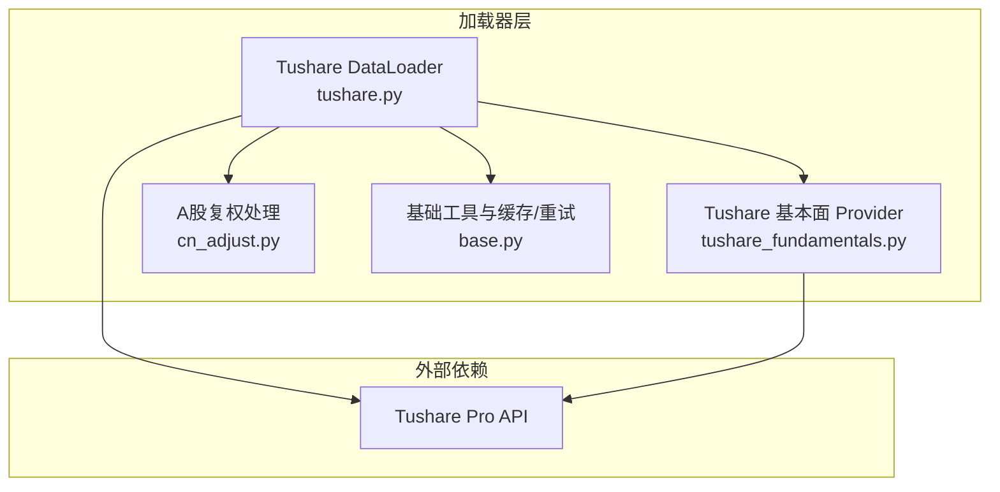
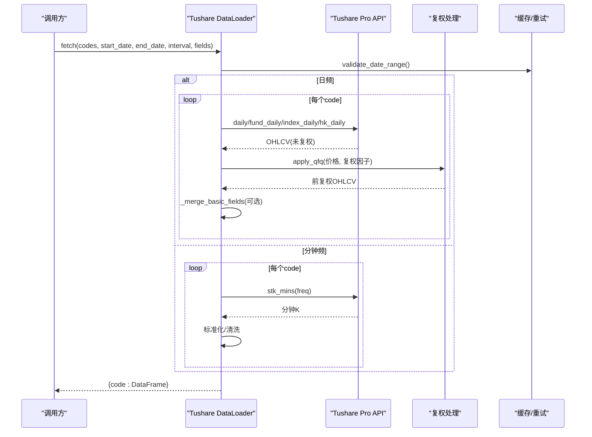
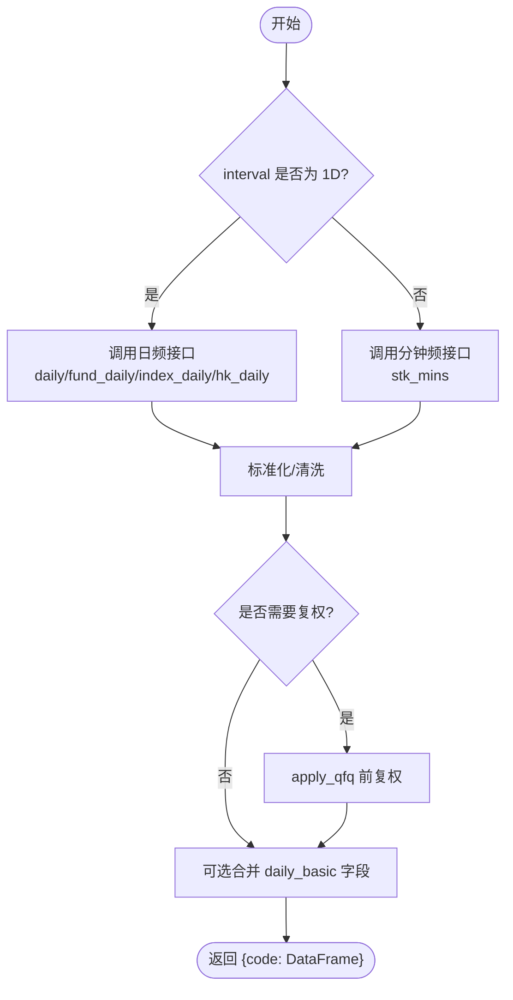
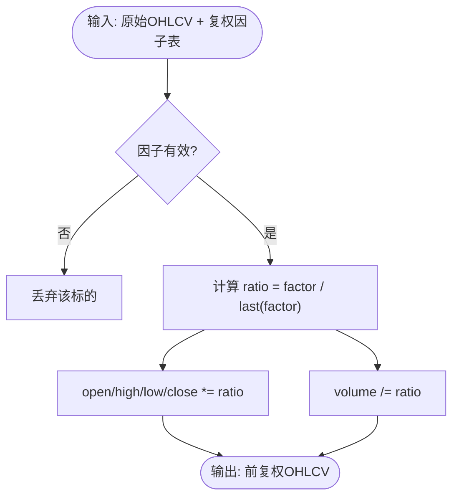
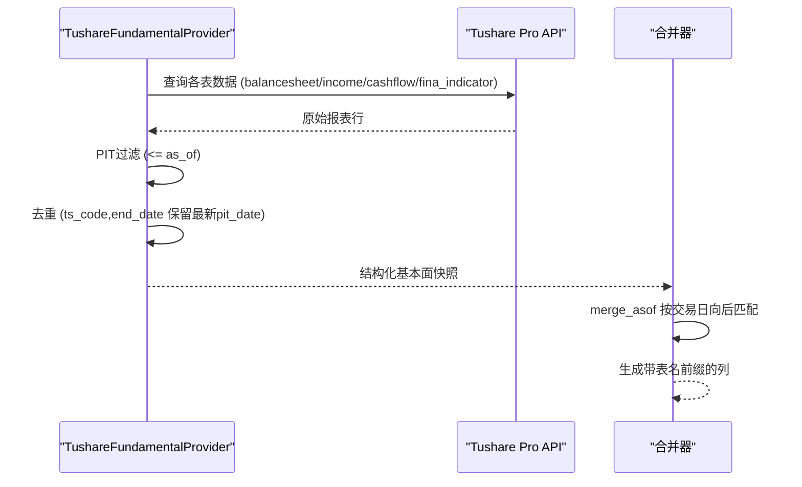
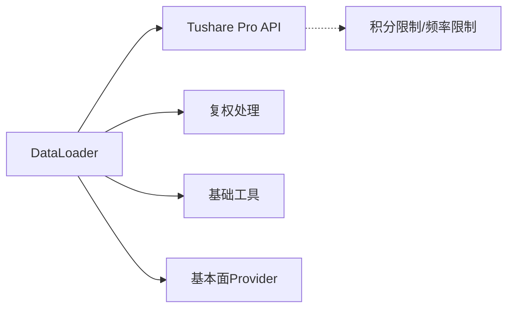

# Tushare A股加载器

<cite>
**本文引用的文件**
- [tushare.py](file://agent/backtest/loaders/tushare.py)
- [tushare_fundamentals.py](file://agent/backtest/loaders/tushare_fundamentals.py)
- [cn_adjust.py](file://agent/backtest/loaders/cn_adjust.py)
- [base.py](file://agent/backtest/loaders/base.py)
- [test_tushare_loader.py](file://agent/tests/test_tushare_loader.py)
- [Settings.tsx](file://frontend/src/pages/Settings.tsx)
- [_legacy.py](file://agent/cli/_legacy.py)
</cite>

## 目录
1. [简介](#简介)
2. [项目结构](#项目结构)
3. [核心组件](#核心组件)
4. [架构总览](#架构总览)
5. [详细组件分析](#详细组件分析)
6. [依赖关系分析](#依赖关系分析)
7. [性能与优化建议](#性能与优化建议)
8. [配置示例](#配置示例)
9. [故障排除指南](#故障排除指南)
10. [结论](#结论)

## 简介
本文件面向Tushare Pro A股市场数据加载器的实现与使用，覆盖认证方式、积分限制与数据范围；A股特有的数据处理逻辑（复权因子计算、除权除息处理、交易日历适配）；基本面数据获取能力（财务报表、指标等）；以及批量请求策略、缓存机制、错误重试等性能优化建议。同时提供配置示例与常见问题的排查方法。

## 项目结构
Tushare A股加载器位于回测数据加载器子系统中，围绕统一的DataLoader协议实现，并与基础工具模块配合完成日期校验、OHLC校验、缓存与重试等通用能力。

图表来源
- [tushare.py:116-141](file://agent/backtest/loaders/tushare.py#L116-L141)
- [tushare_fundamentals.py:118-131](file://agent/backtest/loaders/tushare_fundamentals.py#L118-L131)
- [cn_adjust.py:27-77](file://agent/backtest/loaders/cn_adjust.py#L27-L77)
- [base.py:168-184](file://agent/backtest/loaders/base.py#L168-L184)

章节来源
- [tushare.py:1-386](file://agent/backtest/loaders/tushare.py#L1-L386)
- [tushare_fundamentals.py:1-380](file://agent/backtest/loaders/tushare_fundamentals.py#L1-L380)
- [cn_adjust.py:1-78](file://agent/backtest/loaders/cn_adjust.py#L1-L78)
- [base.py:1-200](file://agent/backtest/loaders/base.py#L1-L200)

## 核心组件
- Tushare DataLoader：统一入口，负责按标的类型路由到不同API（股票、ETF/LOF、指数、港股），并执行日频与分钟频数据的拉取、标准化、合并基本面字段、复权处理与缓存。
- 复权处理模块：基于Tushare的复权因子序列对原始价格进行前复权调整，避免除权除息造成的收益失真。
- 基本面Provider：以“时间点可见性”（Point-in-Time, PIT）的方式拉取财务报表与指标，确保在回溯时不会用到未来信息，并对重述数据进行正确处理。
- 基础工具：日期范围校验、OHLC结构校验、预算化重试与缓存封装，为加载器提供稳定可靠的底层支撑。

章节来源
- [tushare.py:116-205](file://agent/backtest/loaders/tushare.py#L116-L205)
- [cn_adjust.py:27-77](file://agent/backtest/loaders/cn_adjust.py#L27-L77)
- [tushare_fundamentals.py:118-187](file://agent/backtest/loaders/tushare_fundamentals.py#L118-L187)
- [base.py:168-256](file://agent/backtest/loaders/base.py#L168-L256)

## 架构总览
Tushare加载器通过环境变量中的Token初始化Pro API，依据代码后缀与规则识别标的类型，调用对应接口获取日K或分钟K，随后进行数据清洗、复权与可选的基本面字段合并，最终返回标准化的OHLCV DataFrame集合。

图表来源
- [tushare.py:148-211](file://agent/backtest/loaders/tushare.py#L148-L211)
- [tushare.py:207-268](file://agent/backtest/loaders/tushare.py#L207-L268)
- [tushare.py:416-476](file://agent/backtest/loaders/tushare.py#L416-L476)
- [cn_adjust.py:27-77](file://agent/backtest/loaders/cn_adjust.py#L27-L77)

## 详细组件分析

### Tushare DataLoader（日线与分钟线）
- 认证与可用性：从环境配置读取TUSHARE_TOKEN，若为空或占位符则标记不可用。
- 标的路由：
  - A股股票：daily + adj_factor
  - ETF/LOF：fund_daily + fund_adj
  - 指数：index_daily（无需复权）
  - 港股：hk_daily（无复权因子）
  - 美股/加密货币：不支持，直接跳过并记录警告
- 数据标准化：统一列名（vol→volume）、时间索引、数值转换、缺失值清理。
- 复权处理：对股票与基金应用前复权，指数与港股不处理。
- 基本面字段合并：仅对A股股票支持daily_basic字段合并。
- 分钟线：仅支持A股股票，频率映射到Tushare支持的分钟粒度；ETF/指数/港股/美股/加密均不支持分钟线。

图表来源
- [tushare.py:148-211](file://agent/backtest/loaders/tushare.py#L148-L211)
- [tushare.py:207-268](file://agent/backtest/loaders/tushare.py#L207-L268)
- [tushare.py:416-476](file://agent/backtest/loaders/tushare.py#L416-L476)

章节来源
- [tushare.py:116-386](file://agent/backtest/loaders/tushare.py#L116-L386)

### 复权因子与前复权处理
- 数据来源：股票使用adj_factor，基金使用fund_adj；指数与港股不提供复权因子。
- 处理逻辑：将价格序列按最后一个交易日因子归一化，得到前复权价格；成交量同比例缩放，金额保持不变。
- 安全边界：若复权因子缺失、含非正数或无法对齐，则放弃该标的，避免回测被除权缺口污染。

图表来源
- [cn_adjust.py:27-77](file://agent/backtest/loaders/cn_adjust.py#L27-L77)

章节来源
- [cn_adjust.py:1-78](file://agent/backtest/loaders/cn_adjust.py#L1-L78)

### 基本面数据（财务报表与指标）
- 支持表：资产负债表、现金流量表、利润表、财务指标等，均以PIT方式过滤，保证在as_of之前可见。
- 去重与重述：同一(end_date)保留最新有效披露时间（优先f_ann_date，否则ann_date）；对旧期重述不回退到更早期间。
- 合并策略：通过merge_asof将基本面快照按交易日向后匹配，生成带表名前缀的列（如income_total_revenue）。

图表来源
- [tushare_fundamentals.py:144-187](file://agent/backtest/loaders/tushare_fundamentals.py#L144-L187)
- [tushare_fundamentals.py:264-379](file://agent/backtest/loaders/tushare_fundamentals.py#L264-L379)

章节来源
- [tushare_fundamentals.py:1-380](file://agent/backtest/loaders/tushare_fundamentals.py#L1-L380)

### 交易日历适配
- 日期校验：强制start_date <= end_date，格式为YYYY-MM-DD。
- 时间索引：所有DataFrame统一以交易日期为索引，便于后续对齐与回测。
- 分钟线：仅A股股票支持，频率映射到Tushare支持的分钟粒度；其他市场/品种不支持分钟线。

章节来源
- [base.py:168-184](file://agent/backtest/loaders/base.py#L168-L184)
- [tushare.py:148-175](file://agent/backtest/loaders/tushare.py#L148-L175)
- [tushare.py:416-476](file://agent/backtest/loaders/tushare.py#L416-L476)

## 依赖关系分析
- DataLoader依赖：
  - Tushare Pro API（需Token）
  - 复权处理模块（cn_adjust）
  - 基础工具（日期校验、OHLC校验、缓存/重试）
  - 基本面Provider（可选）
- 外部约束：
  - 分钟线需要较高积分（>=2000）
  - 港股无复权因子
  - 指数无需复权
  - 美股/加密货币不受支持

图表来源
- [tushare.py:116-141](file://agent/backtest/loaders/tushare.py#L116-L141)
- [tushare.py:416-476](file://agent/backtest/loaders/tushare.py#L416-L476)

章节来源
- [tushare.py:116-386](file://agent/backtest/loaders/tushare.py#L116-L386)
- [tushare_fundamentals.py:118-187](file://agent/backtest/loaders/tushare_fundamentals.py#L118-L187)
- [base.py:127-200](file://agent/backtest/loaders/base.py#L127-L200)

## 性能与优化建议
- 批量请求策略
  - 按标的逐个请求，利用内置缓存减少重复拉取。
  - 对分钟线请求，注意Tushare的频率限制与积分门槛（>=2000）。
- 缓存机制
  - 使用统一缓存封装，针对相同source/symbol/timeframe/date/fields命中缓存，避免重复网络请求。
- 错误重试
  - 针对Tushare配额拒绝（每分钟/每天访问次数限制）采用指数退避重试（5s、20s、40s），仅对限流类异常重试，普通错误立即抛出。
  - 基础工具提供预算化重试与超时控制，可在更广泛的场景复用。
- 数据质量
  - 统一进行OHLC结构校验，剔除无效K线，防止下游指标异常。
  - 复权因子缺失或不合法时主动丢弃标的，避免回测偏差。

章节来源
- [tushare.py:18-79](file://agent/backtest/loaders/tushare.py#L18-L79)
- [tushare.py:182-211](file://agent/backtest/loaders/tushare.py#L182-L211)
- [base.py:127-200](file://agent/backtest/loaders/base.py#L127-L200)
- [base.py:187-256](file://agent/backtest/loaders/base.py#L187-L256)

## 配置示例
- 环境变量
  - TUSHARE_TOKEN：用于Tushare Pro认证。前端设置界面与CLI均可写入.env，并在桌面模式下安全存储。
- 前端设置
  - 在设置页面中可输入/清除TUSHARE_TOKEN，保存后重启后端生效。
- CLI引导
  - 初始化过程中可提示输入TUSHARE_TOKEN，并写入.env文件（权限受限）。

章节来源
- [Settings.tsx:262-276](file://frontend/src/pages/Settings.tsx#L262-L276)
- [Settings.tsx:575-601](file://frontend/src/pages/Settings.tsx#L575-L601)
- [_legacy.py:6192-6204](file://agent/cli/_legacy.py#L6192-L6204)

## 故障排除指南
- 常见问题
  - Token未配置或为占位符：加载器不可用，需设置TUSHARE_TOKEN。
  - 分钟线不可用：可能因积分不足（<2000）或品种不支持（ETF/指数/港股/美股/加密）。
  - 空结果：检查标的是否存在、日期范围是否合理、接口是否返回空。
  - 复权失败：若复权因子缺失或非正，将丢弃该标的，避免回测污染。
- 限流与重试
  - 当出现“每分钟/每天访问该接口”等限流提示时，系统会自动等待并重试；若多次仍失败，请降低并发或延长间隔。
  - 测试覆盖了限流分类逻辑，确保只有限流类异常触发重试。
- 数据质量
  - 若出现OHLC结构异常（如high < low），将被剔除或告警；必要时调整策略或检查数据源。

章节来源
- [tushare.py:18-79](file://agent/backtest/loaders/tushare.py#L18-L79)
- [tushare.py:207-268](file://agent/backtest/loaders/tushare.py#L207-L268)
- [tushare.py:416-476](file://agent/backtest/loaders/tushare.py#L416-L476)
- [test_tushare_loader.py:449-473](file://agent/tests/test_tushare_loader.py#L449-L473)
- [base.py:187-256](file://agent/backtest/loaders/base.py#L187-L256)

## 结论
Tushare A股加载器提供了稳健的日频与分钟频数据获取能力，结合复权处理与PIT基本面数据，满足A股回测与分析的核心需求。通过缓存、重试与预算控制，系统在外部API不稳定与积分限制下仍能保持高可用性与数据一致性。建议在生产环境中合理配置Token与并发策略，关注分钟线积分门槛与限流提示，确保数据质量与回测可靠性。