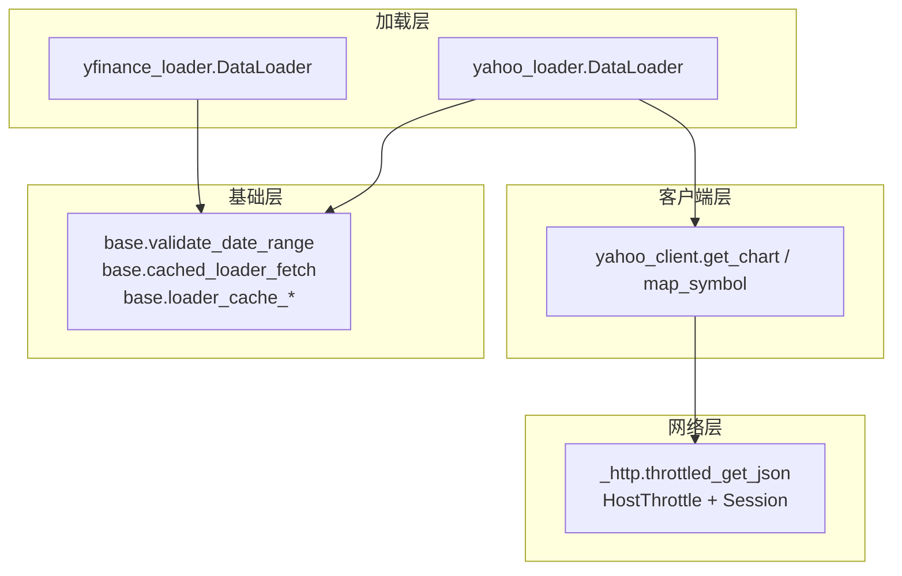
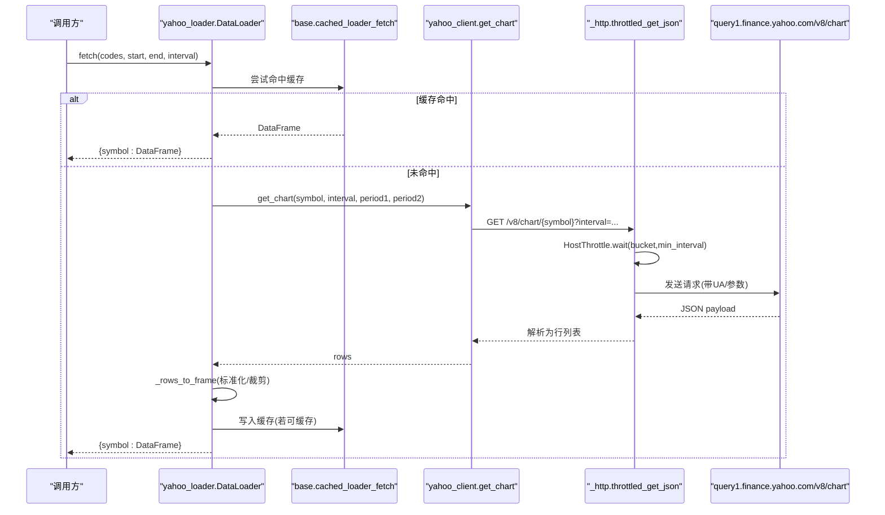
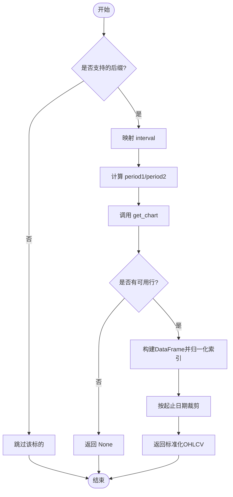
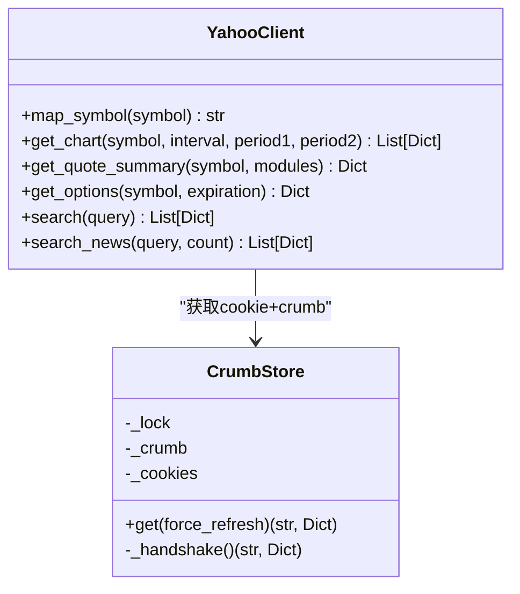
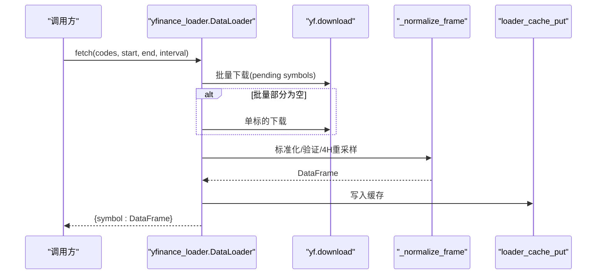
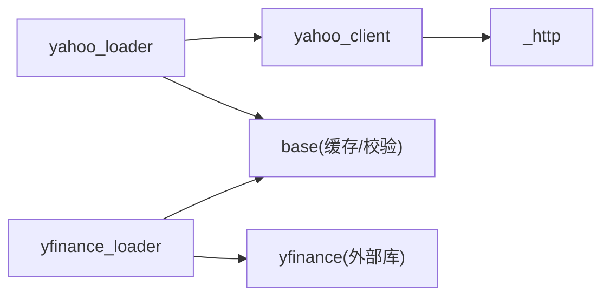

# Yahoo Finance 加载器

<cite>
**本文引用的文件**
- [yahoo_loader.py](file://agent/backtest/loaders/yahoo_loader.py)
- [yahoo_client.py](file://agent/backtest/loaders/yahoo_client.py)
- [yfinance_loader.py](file://agent/backtest/loaders/yfinance_loader.py)
- [_http.py](file://agent/backtest/loaders/_http.py)
- [base.py](file://agent/backtest/loaders/base.py)
- [test_yahoo_loader.py](file://agent/tests/test_yahoo_loader.py)
- [test_yfinance_interval_map.py](file://agent/tests/test_yfinance_interval_map.py)
</cite>

## 目录
1. [简介](#简介)
2. [项目结构](#项目结构)
3. [核心组件](#核心组件)
4. [架构总览](#架构总览)
5. [详细组件分析](#详细组件分析)
6. [依赖关系分析](#依赖关系分析)
7. [性能与批量优化](#性能与批量优化)
8. [故障排查指南](#故障排查指南)
9. [结论](#结论)
10. [附录：配置示例](#附录：配置示例)

## 简介
本模块提供基于 Yahoo Finance 的免费、无需认证的美股/港股等全球权益类 OHLCV 数据加载能力。它通过直接 HTTP 访问 Yahoo 公开图表接口（v8 chart），并封装统一的节流与会话复用，避免 IP 限流；同时提供基于 yfinance 的备选实现以兼容更广泛的符号与加密货币场景。文档重点说明：
- 支持市场与后缀：美股 .US、港股 .HK、印度 .NS/.BO、韩国 .KS/.KQ、加拿大 .TO/.V，以及期货 =F、外汇 =X 后缀
- 时间间隔映射：1D→1d、4H→1h、1W→1wk、1M→1mo，分钟级保持原样
- 复权因子处理：默认不自动复权，返回原始价格序列
- 交易日历适配：按交易日过滤空值，日频索引归一化至午夜对齐其他数据源
- 批量请求优化：共享节流、会话复用、缓存机制
- 错误恢复：401 自动刷新 crumb、异常隔离、失败重试预算

## 项目结构
Yahoo 相关代码位于 backtest/loaders 目录下，分为“直连 Yahoo 客户端”和“两种加载器实现”：
- yahoo_client.py：共享的 Yahoo 公开 API 客户端（chart、quoteSummary、options、search）
- yahoo_loader.py：基于直连 Yahoo v8 chart 的加载器（无第三方依赖）
- yfinance_loader.py：基于 yfinance 包的加载器（可覆盖更多符号类型）
- _http.py：进程内 HTTP 节流与会话复用
- base.py：通用校验、OHLC 校验、本地缓存、重试预算等基础设施

图示来源
- [yahoo_loader.py:173-275](file://agent/backtest/loaders/yahoo_loader.py#L173-L275)
- [yahoo_client.py:156-205](file://agent/backtest/loaders/yahoo_client.py#L156-L205)
- [_http.py:141-200](file://agent/backtest/loaders/_http.py#L141-L200)
- [base.py:565-661](file://agent/backtest/loaders/base.py#L565-L661)

章节来源
- [yahoo_loader.py:1-275](file://agent/backtest/loaders/yahoo_loader.py#L1-L275)
- [yahoo_client.py:1-419](file://agent/backtest/loaders/yahoo_client.py#L1-L419)
- [yfinance_loader.py:1-346](file://agent/backtest/loaders/yfinance_loader.py#L1-L346)
- [_http.py:1-201](file://agent/backtest/loaders/_http.py#L1-L201)
- [base.py:1-657](file://agent/backtest/loaders/base.py#L1-L657)

## 核心组件
- Yahoo 直连加载器（yahoo_loader.DataLoader）
  - 面向 US/HK/India/Korea/Canada 权益及期货/外汇后缀，直接调用 Yahoo v8 chart
  - 内置时间间隔映射与日内/日频索引归一化
  - 使用进程内缓存与日期范围裁剪
- Yahoo 客户端（yahoo_client）
  - 统一 symbol 映射（如 AAPL.US→AAPL，00700.HK→0700.HK）
  - 封装 chart、quoteSummary、options、search 等端点
  - 处理 cookie+crumb 握手与 401 自动刷新
- yfinance 加载器（yfinance_loader.DataLoader）
  - 基于 yfinance 包，支持更广符号集（含加密货币）
  - 批量下载、单标的回退、4H 重采样到 4h
  - 本地缓存写入与读取
- HTTP 节流与缓存（_http.py, base.py）
  - 进程内 HostThrottle 控制最小请求间隔与抖动
  - requests.Session 复用连接池
  - 可选本地 parquet 缓存（内容寻址键、版本化）

章节来源
- [yahoo_loader.py:173-275](file://agent/backtest/loaders/yahoo_loader.py#L173-L275)
- [yahoo_client.py:71-93](file://agent/backtest/loaders/yahoo_client.py#L71-L93)
- [yfinance_loader.py:229-346](file://agent/backtest/loaders/yfinance_loader.py#L229-L346)
- [_http.py:46-107](file://agent/backtest/loaders/_http.py#L46-L107)
- [base.py:243-441](file://agent/backtest/loaders/base.py#L243-L441)

## 架构总览
下图展示从调用方到 Yahoo 接口的完整链路，包括节流、会话复用、缓存与错误恢复。

图示来源
- [yahoo_loader.py:195-275](file://agent/backtest/loaders/yahoo_loader.py#L195-L275)
- [yahoo_client.py:156-205](file://agent/backtest/loaders/yahoo_client.py#L156-L205)
- [_http.py:141-200](file://agent/backtest/loaders/_http.py#L141-L200)
- [base.py:623-661](file://agent/backtest/loaders/base.py#L623-L661)

## 详细组件分析

### Yahoo 直连加载器（yahoo_loader.DataLoader）
- 支持市场与后缀
  - 权益：.US、.HK、.NS、.BO、.KS、.KQ、.TO、.V
  - 衍生品：=F（期货）、=X（外汇）
  - 判断逻辑在支持性检查中完成，非匹配符号将被跳过
- 时间间隔映射
  - 1D→1d，1H→1h，4H→1h（Yahoo 无 4h 原生支持，采用 1h 近似），1W→1wk，1M→1mo
  - 分钟级（如 5m、15m、30m）保持小写透传
- 日内/日频索引归一化
  - 日频及以上将索引归一化为午夜，确保与其他数据源对齐
  - 日内（分钟/小时）保留真实时间戳
- 数据清洗与裁剪
  - 去除缺失 OHLC 的行，volume 填充为 0
  - 按 inclusive 起止日期裁剪结果
- 批量与容错
  - 逐标的循环，单个失败不影响整体批次
  - 使用 cached_loader_fetch 进行本地缓存读写

图示来源
- [yahoo_loader.py:44-74](file://agent/backtest/loaders/yahoo_loader.py#L44-L74)
- [yahoo_loader.py:139-184](file://agent/backtest/loaders/yahoo_loader.py#L139-L184)
- [yahoo_loader.py:244-275](file://agent/backtest/loaders/yahoo_loader.py#L244-L275)

章节来源
- [yahoo_loader.py:44-106](file://agent/backtest/loaders/yahoo_loader.py#L44-L106)
- [yahoo_loader.py:139-184](file://agent/backtest/loaders/yahoo_loader.py#L139-L184)
- [yahoo_loader.py:173-275](file://agent/backtest/loaders/yahoo_loader.py#L173-L275)
- [test_yahoo_loader.py:56-107](file://agent/tests/test_yahoo_loader.py#L56-L107)
- [test_yahoo_loader.py:130-176](file://agent/tests/test_yahoo_loader.py#L130-L176)

### Yahoo 客户端（yahoo_client）
- Symbol 映射规则
  - .US 后缀去掉；.HK 前导零规范化为 4 位；印度/加拿大后缀原样传递；其他符号原样
- Chart 接口
  - 通过 throttled_get_json 获取 v8 chart，解析 timestamp 与 indicators.quote 为行列表
  - 剔除 OHLC 为空的非交易日行
- QuoteSummary/Options 安全握手
  - 首次需要 cookie+crumb，后续 401 时自动刷新一次并重试
- 搜索与新闻
  - 提供 search 与 search_news 能力

图示来源
- [yahoo_client.py:71-93](file://agent/backtest/loaders/yahoo_client.py#L71-L93)
- [yahoo_client.py:98-147](file://agent/backtest/loaders/yahoo_client.py#L98-L147)
- [yahoo_client.py:156-205](file://agent/backtest/loaders/yahoo_client.py#L156-L205)
- [yahoo_client.py:302-357](file://agent/backtest/loaders/yahoo_client.py#L302-L357)
- [yahoo_client.py:360-419](file://agent/backtest/loaders/yahoo_client.py#L360-L419)

章节来源
- [yahoo_client.py:1-419](file://agent/backtest/loaders/yahoo_client.py#L1-L419)

### yfinance 加载器（yfinance_loader.DataLoader）
- 支持更广符号集（含加密货币），内部对 -USDT/-USDC 做 USD 转换
- 批量下载与单标的回退
  - 先尝试批量下载，若某标的为空则单独下载
- 4H 重采样
  - 当请求为 4H 且返回 1h 数据时，按 4h 窗口聚合 open/close/high/low/volume
- 本地缓存
  - 成功拉取后写入本地 parquet 缓存，下次命中直接返回

图示来源
- [yfinance_loader.py:97-121](file://agent/backtest/loaders/yfinance_loader.py#L97-L121)
- [yfinance_loader.py:194-248](file://agent/backtest/loaders/yfinance_loader.py#L194-L248)
- [yfinance_loader.py:254-346](file://agent/backtest/loaders/yfinance_loader.py#L254-L346)

章节来源
- [yfinance_loader.py:1-346](file://agent/backtest/loaders/yfinance_loader.py#L1-L346)
- [test_yfinance_interval_map.py:1-21](file://agent/tests/test_yfinance_interval_map.py#L1-L21)

### HTTP 节流与会话复用（_http.py）
- HostThrottle：按 host_key 维护最小请求间隔，加入随机抖动避免并发同步
- Session 复用：每个 host_key 一个 requests.Session，减少 TCP/TLS 开销
- 环境变量：可通过 VIBE_TRADING_YAHOO_MIN_INTERVAL 等调整最小间隔

章节来源
- [_http.py:46-107](file://agent/backtest/loaders/_http.py#L46-L107)
- [_http.py:127-200](file://agent/backtest/loaders/_http.py#L127-L200)

### 基础能力（base.py）
- 日期范围校验、OHLC 结构校验（高/低必须合理、正数限制可配）
- 本地缓存：内容寻址 key、版本化、仅对已结算日期范围缓存
- 重试预算：bounded retry 与超时预算，适用于不稳定外部 API

章节来源
- [base.py:168-256](file://agent/backtest/loaders/base.py#L168-L256)
- [base.py:398-450](file://agent/backtest/loaders/base.py#L398-L450)
- [base.py:243-441](file://agent/backtest/loaders/base.py#L243-L441)

## 依赖关系分析
- 加载器与客户端耦合度低：yahoo_loader 仅依赖 yahoo_client 的 get_chart，便于替换或扩展
- 网络层抽象：所有 Yahoo 请求经 _http 统一节流与会话管理，避免分散 sleep
- 缓存与校验解耦：base.py 提供通用能力，被多个加载器复用
- 外部依赖：yfinance_loader 额外依赖 yfinance 包；yahoo_loader 无第三方依赖

图示来源
- [yahoo_loader.py:173-275](file://agent/backtest/loaders/yahoo_loader.py#L173-L275)
- [yahoo_client.py:156-205](file://agent/backtest/loaders/yahoo_client.py#L156-L205)
- [_http.py:141-200](file://agent/backtest/loaders/_http.py#L141-L200)
- [yfinance_loader.py:229-346](file://agent/backtest/loaders/yfinance_loader.py#L229-L346)
- [base.py:565-661](file://agent/backtest/loaders/base.py#L565-L661)

章节来源
- [yahoo_loader.py:173-275](file://agent/backtest/loaders/yahoo_loader.py#L173-L275)
- [yahoo_client.py:156-205](file://agent/backtest/loaders/yahoo_client.py#L156-L205)
- [yfinance_loader.py:229-346](file://agent/backtest/loaders/yfinance_loader.py#L229-L346)
- [_http.py:141-200](file://agent/backtest/loaders/_http.py#L141-L200)
- [base.py:565-661](file://agent/backtest/loaders/base.py#L565-L661)

## 性能与批量优化
- 请求节流与抖动
  - 通过 HostThrottle 保证同一 host_key 的最小间隔，避免触发 Yahoo IP 限流
  - 随机抖动降低并发同步风险
- 会话复用
  - 每个 host_key 复用 requests.Session，减少握手成本
- 批量下载（yfinance_loader）
  - 优先批量下载，再对缺失标的回退单标的下载
  - 单标的失败不影响整体批次
- 本地缓存
  - 内容寻址 key（source/symbol/timeframe/start/end/fields），版本化防脏读
  - 仅对已结算日期范围缓存，避免缓存进行中数据
  - 使用 parquet 存储，读取快速且稳定
- 指标与日志
  - 关键路径记录警告日志，便于定位失败标的

章节来源
- [_http.py:46-107](file://agent/backtest/loaders/_http.py#L46-L107)
- [_http.py:141-200](file://agent/backtest/loaders/_http.py#L141-L200)
- [yfinance_loader.py:285-346](file://agent/backtest/loaders/yfinance_loader.py#L285-L346)
- [base.py:565-661](file://agent/backtest/loaders/base.py#L565-L661)

## 故障排查指南
- IP 限流/频繁 429
  - 调大 VIBE_TRADING_YAHOO_MIN_INTERVAL 增大最小间隔
  - 避免短时间内大量并发请求
- 401 未授权（crumb 过期）
  - 客户端会在 401 时自动刷新 crumb 并重试一次
  - 若仍失败，检查网络与 Yahoo 服务状态
- 数据格式不一致
  - 日频索引已归一化至午夜，确保与其他数据源对齐
  - 4H 在 Yahoo 直连加载器中映射为 1h；yfinance 加载器会重采样为 4h
- 无数据或空结果
  - 检查符号后缀是否正确（.US/.HK/.NS/.BO/.KS/.KQ/.TO/.V/=F/=X）
  - 确认起止日期有效且存在交易日
- 缓存问题
  - 若启用本地缓存，确认 end_date 为已结算日期才会写入/读取
  - 缓存损坏会自动回退到在线拉取

章节来源
- [yahoo_client.py:302-357](file://agent/backtest/loaders/yahoo_client.py#L302-L357)
- [yahoo_loader.py:139-184](file://agent/backtest/loaders/yahoo_loader.py#L139-L184)
- [yfinance_loader.py:194-248](file://agent/backtest/loaders/yfinance_loader.py#L194-L248)
- [base.py:550-661](file://agent/backtest/loaders/base.py#L550-L661)

## 结论
Yahoo Finance 加载器提供了免费、无需认证、跨市场的 OHLCV 数据获取能力。通过直连 Yahoo 与 yfinance 双实现，兼顾了轻量与兼容性；借助统一的 HTTP 节流、会话复用与本地缓存，显著提升了稳定性与性能。对于生产环境，建议：
- 根据负载调整最小请求间隔
- 开启本地缓存以减少重复请求
- 关注 401 与限流告警，必要时切换代理或增加间隔
- 使用标准化的时间间隔与符号后缀，确保数据一致性

## 附录：配置示例
- 环境变量
  - VIBE_TRADING_YAHOO_MIN_INTERVAL：设置 Yahoo 请求最小间隔（秒）
  - VIBE_TRADING_DATA_CACHE：是否启用本地缓存（true/false）
  - VIBE_TRADING_DATA_CACHE_ROOT：本地缓存根目录（可选）
- 使用方式
  - 选择 yahoo_loader 或 yfinance_loader 作为数据源
  - 传入 codes（如 AAPL.US、00700.HK、RELIANCE.NS、TD.TO、GC=F、EURUSD=X）
  - 指定 start_date、end_date、interval（如 1D、1H、4H、1W、1M、5m）
- 注意事项
  - 4H 在 Yahoo 直连加载器中映射为 1h；yfinance 加载器会重采样为 4h
  - 日频索引归一化至午夜，确保与其他数据源对齐
  - 复权因子默认关闭，返回原始价格

章节来源
- [_http.py:127-138](file://agent/backtest/loaders/_http.py#L127-L138)
- [base.py:243-283](file://agent/backtest/loaders/base.py#L243-L283)
- [yahoo_loader.py:31-74](file://agent/backtest/loaders/yahoo_loader.py#L31-L74)
- [yfinance_loader.py:37-50](file://agent/backtest/loaders/yfinance_loader.py#L37-L50)