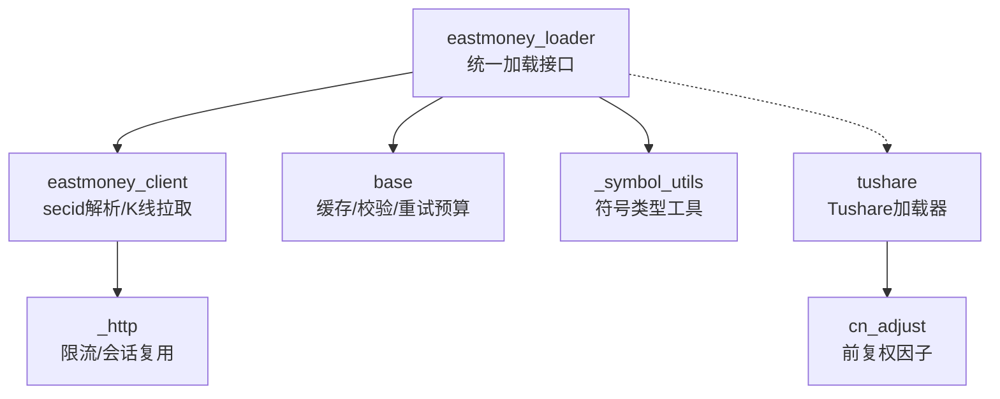
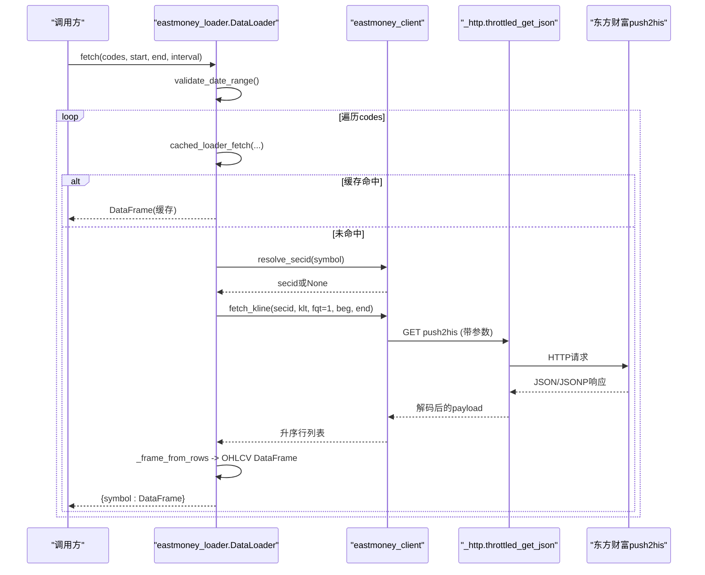
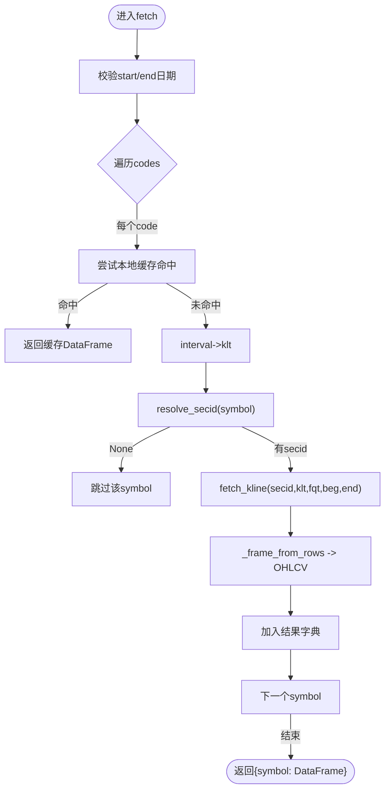
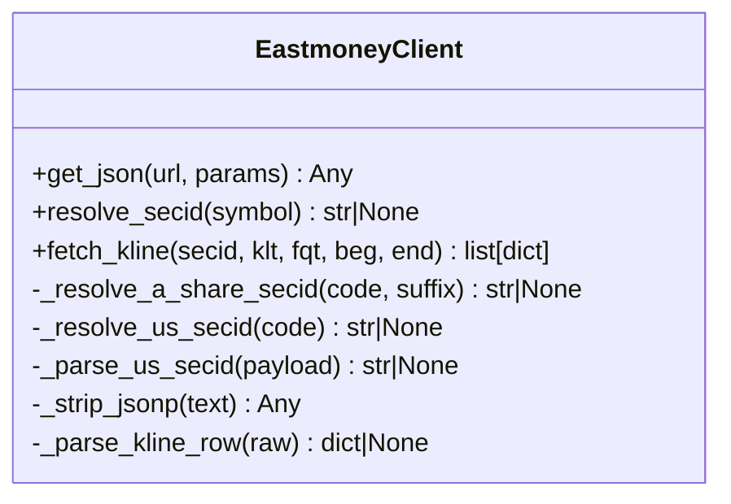
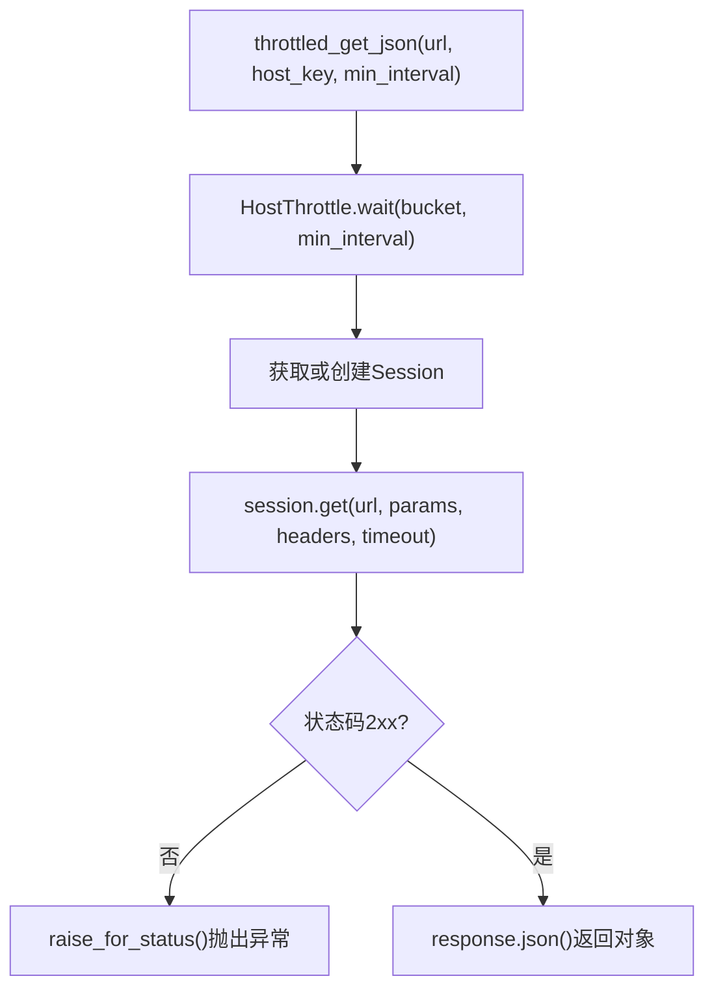
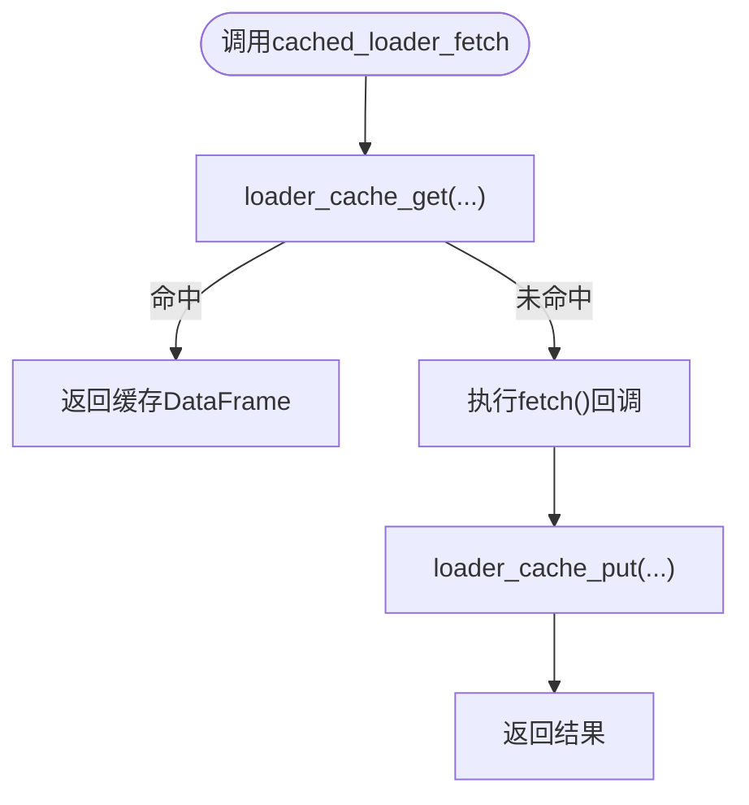
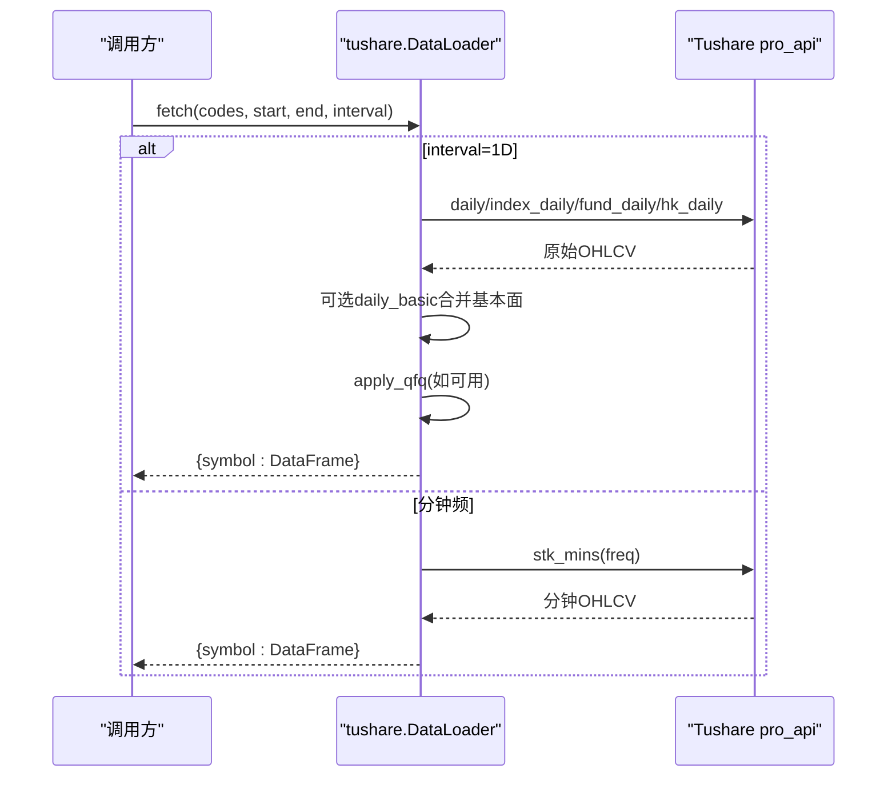
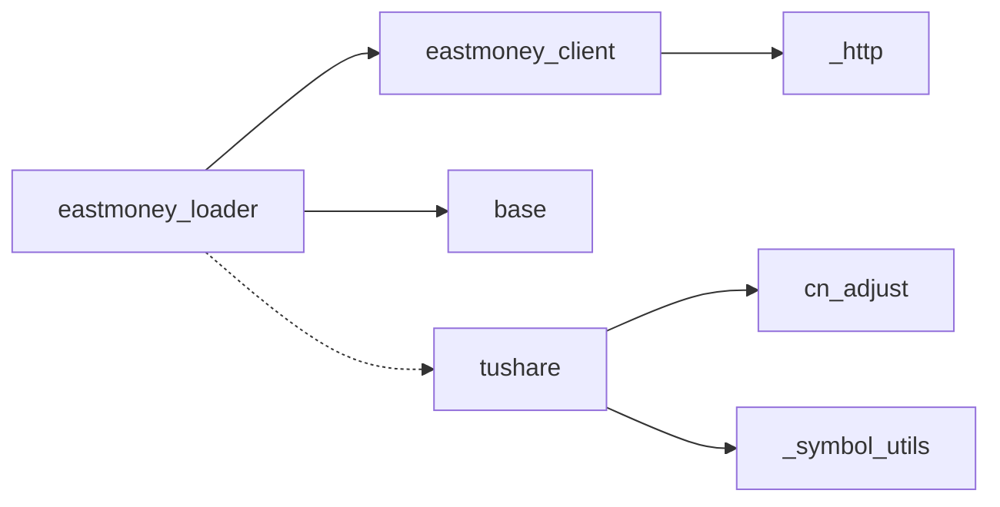

# 东方财富加载器

<cite>
**本文引用的文件**
- [eastmoney_loader.py](file://agent/backtest/loaders/eastmoney_loader.py)
- [eastmoney_client.py](file://agent/backtest/loaders/eastmoney_client.py)
- [_http.py](file://agent/backtest/loaders/_http.py)
- [base.py](file://agent/backtest/loaders/base.py)
- [tushare.py](file://agent/backtest/loaders/tushare.py)
- [cn_adjust.py](file://agent/backtest/loaders/cn_adjust.py)
- [_symbol_utils.py](file://agent/backtest/loaders/_symbol_utils.py)
- [test_eastmoney_loader.py](file://agent/tests/test_eastmoney_loader.py)
- [test_eastmoney_client.py](file://agent/tests/test_eastmoney_client.py)
</cite>

## 目录
1. [简介](#简介)
2. [项目结构](#项目结构)
3. [核心组件](#核心组件)
4. [架构总览](#架构总览)
5. [详细组件分析](#详细组件分析)
6. [依赖关系分析](#依赖关系分析)
7. [性能与并发优化](#性能与并发优化)
8. [故障排查指南](#故障排查指南)
9. [结论](#结论)
10. [附录：使用示例与切换策略](#附录使用示例与切换策略)

## 简介
本文件面向“东方财富A股市场数据加载器”的实现与使用，聚焦以下目标：
- 说明东方财富作为免费A股数据源的优势与特点（无需鉴权、覆盖A/H/美股、推流历史K线接口）。
- 详解数据格式转换、复权处理、交易时间适配等核心逻辑。
- 文档化与Tushare的互补关系与切换策略。
- 提供批量获取优化方案（并发控制、错误处理、数据验证）。
- 给出实际使用示例与常见问题解决方案（网络异常、数据缺失等）。

## 项目结构
围绕东方财富的数据获取链路，主要涉及以下模块：
- eastmoney_loader：对外暴露统一的数据加载接口，负责符号到secid映射、区间校验、结果DataFrame组装。
- eastmoney_client：封装东方财富HTTP调用、JSONP解析、secid解析、K线拉取。
- _http：进程级主机级限流与Session复用，避免被服务端封禁。
- base：通用缓存、重试预算、OHLC校验、日期范围校验等基础设施。
- tushare：Tushare数据加载器，用于对比与互补。
- cn_adjust：前复权因子应用，确保跨除权日的收益计算正确。
- _symbol_utils：ETF/LOF识别等符号类型工具。

图表来源
- [eastmoney_loader.py:51-183](file://agent/backtest/loaders/eastmoney_loader.py#L51-L183)
- [eastmoney_client.py:239-355](file://agent/backtest/loaders/eastmoney_client.py#L239-L355)
- [_http.py:46-201](file://agent/backtest/loaders/_http.py#L46-L201)
- [base.py:31-119, 403-441:168-256](file://agent/backtest/loaders/base.py#L168-L256)
- [tushare.py:116-386](file://agent/backtest/loaders/tushare.py#L116-L386)
- [cn_adjust.py:27-78](file://agent/backtest/loaders/cn_adjust.py#L27-L78)
- [_symbol_utils.py:12-21](file://agent/backtest/loaders/_symbol_utils.py#L12-L21)

章节来源
- [eastmoney_loader.py:51-183](file://agent/backtest/loaders/eastmoney_loader.py#L51-L183)
- [eastmoney_client.py:239-355](file://agent/backtest/loaders/eastmoney_client.py#L239-L355)
- [_http.py:46-201](file://agent/backtest/loaders/_http.py#L46-L201)
- [base.py:31-119, 403-441:168-256](file://agent/backtest/loaders/base.py#L168-L256)
- [tushare.py:116-386](file://agent/backtest/loaders/tushare.py#L116-L386)
- [cn_adjust.py:27-78](file://agent/backtest/loaders/cn_adjust.py#L27-L78)
- [_symbol_utils.py:12-21](file://agent/backtest/loaders/_symbol_utils.py#L12-L21)

## 核心组件
- DataLoader（东方财富）：实现统一的fetch接口，支持A股、港股、美股；按interval映射到klt；将原始行转为标准OHLCV DataFrame；单条失败不影响批次。
- eastmoney_client：负责secid解析（A/H/US）、push2his K线拉取、JSONP兼容、字段选择、返回升序行列表。
- _http：进程内HostThrottle，按host_key限制最小请求间隔并加入抖动；共享requests.Session减少握手开销。
- base：日期范围校验、OHLC结构校验、本地Parquet缓存、重试预算与退避、缓存读写原子性。
- tushare：Tushare加载器，支持日频与分钟频，具备配额拒绝重试、前复权因子合并、ETF/指数/港股/美股分支处理。
- cn_adjust：基于adj_factor的前复权调整，修正除权导致的收益失真。
- _symbol_utils：ETF/LOF前缀识别，辅助路由不同API。

章节来源
- [eastmoney_loader.py:51-183](file://agent/backtest/loaders/eastmoney_loader.py#L51-L183)
- [eastmoney_client.py:239-355](file://agent/backtest/loaders/eastmoney_client.py#L239-L355)
- [_http.py:46-201](file://agent/backtest/loaders/_http.py#L46-L201)
- [base.py:31-119, 403-441:168-256](file://agent/backtest/loaders/base.py#L168-L256)
- [tushare.py:116-386](file://agent/backtest/loaders/tushare.py#L116-L386)
- [cn_adjust.py:27-78](file://agent/backtest/loaders/cn_adjust.py#L27-L78)
- [_symbol_utils.py:12-21](file://agent/backtest/loaders/_symbol_utils.py#L12-L21)

## 架构总览
东方财富数据获取的整体流程如下：
- 上层调用DataLoader.fetch(codes, start_date, end_date, interval)。
- 对每个code进行日期范围校验，通过缓存层尝试命中本地缓存。
- 将interval映射为klt，调用resolve_secid得到secid。
- 通过eastmoney_client.fetch_kline拉取K线，内部走_http的throttled_get_json。
- 将原始行转换为标准OHLCV DataFrame，设置trade_date索引并排序。
- 返回{symbol: DataFrame}，单个symbol失败不影响其他symbol。

图表来源
- [eastmoney_loader.py:69-149](file://agent/backtest/loaders/eastmoney_loader.py#L69-L149)
- [eastmoney_client.py:300-355](file://agent/backtest/loaders/eastmoney_client.py#L300-L355)
- [_http.py:176-201](file://agent/backtest/loaders/_http.py#L176-L201)

## 详细组件分析

### 东方财富加载器（eastmoney_loader）
- 职责：统一接口、符号路由、区间校验、结果标准化。
- 关键行为：
  - 支持市场：a_share、hk_equity、us_equity；volume_units声明A股为“手”，港股为“股”。
  - interval到klt映射：1D/1W/1M/1m/5m/15m/30m/1H/60m。
  - 日期格式化：YYYY-MM-DD转YYYYMMDD。
  - 单条失败不中断批次，记录警告日志。
  - 输出DataFrame：索引trade_date，列open/high/low/close/volume，float类型，去空行。

图表来源
- [eastmoney_loader.py:69-183](file://agent/backtest/loaders/eastmoney_loader.py#L69-L183)

章节来源
- [eastmoney_loader.py:51-183](file://agent/backtest/loaders/eastmoney_loader.py#L51-L183)

### 东方财富客户端（eastmoney_client）
- 职责：secid解析、K线拉取、JSONP兼容、字段选择。
- 关键点：
  - A股：SH用市场1，SZ/BJ用市场0。
  - 港股：市场116，代码零填充至5位。
  - 美股：通过search/suggest端点发现市场前缀（NASDAQ/NYSE/AMEX），过程缓存。
  - 拉取参数：secid、klt、fqt（前复权模式）、beg/end、fields1/fields2、rev、lmt。
  - 行解析：逗号分隔字符串转为dict，包含trade_date/open/close/high/low/volume/amount。

图表来源
- [eastmoney_client.py:112-355](file://agent/backtest/loaders/eastmoney_client.py#L112-L355)

章节来源
- [eastmoney_client.py:1-325](file://agent/backtest/loaders/eastmoney_client.py#L1-L325)

### HTTP限流与会话复用（_http）
- HostThrottle：按host_key维护最近一次触发时间，保证同一host的最小请求间隔，加入随机抖动避免同步风暴。
- Session复用：按bucket创建并复用requests.Session，降低TCP/TLS握手成本。
- throttled_get_json：统一GET+状态码检查+JSON解析，抛出的异常交由上层重试策略处理。

图表来源
- [_http.py:46-201](file://agent/backtest/loaders/_http.py#L46-L201)

章节来源
- [_http.py:46-201](file://agent/backtest/loaders/_http.py#L46-L201)

### 基础能力（base）
- 日期范围校验：确保start<=end，格式合法。
- OHLC结构校验：检测high<low、高低价无法包围开收价、非正价格等，支持drop/warn/raise策略。
- 本地缓存：基于内容哈希的parquet缓存，仅对已结算区间写入；读/写失败不影响主流程。
- 重试预算：retry_with_budget在限定时间内对瞬态异常进行退避重试，超时则抛出TimeoutError。

图表来源
- [base.py:31-119, 403-441:168-256](file://agent/backtest/loaders/base.py#L168-L256)

章节来源
- [base.py:31-119, 403-441:168-256](file://agent/backtest/loaders/base.py#L168-L256)

### Tushare加载器（tushare）
- 支持日频与分钟频；分钟频需积分门槛。
- 配额拒绝识别与退避重试：根据消息关键字判断“每分钟/每天/抽取/访问该接口/频率/rate limit/too many requests”等。
- 前复权：对股票和基金使用adj_factor/fund_adj进行前复权，指数与港股无可用因子时直接返回原始数据。
- ETF/指数/港股/美股分支：ETF使用fund_daily，指数使用index_daily，港股使用hk_daily，美股/crypto不支持。

图表来源
- [tushare.py:116-386](file://agent/backtest/loaders/tushare.py#L116-L386)
- [cn_adjust.py:27-78](file://agent/backtest/loaders/cn_adjust.py#L27-L78)

章节来源
- [tushare.py:116-386](file://agent/backtest/loaders/tushare.py#L116-L386)
- [cn_adjust.py:27-78](file://agent/backtest/loaders/cn_adjust.py#L27-L78)

## 依赖关系分析
- eastmoney_loader依赖eastmoney_client进行secid解析与K线拉取，依赖base进行缓存与校验。
- eastmoney_client依赖_http进行限流与HTTP调用。
- tushare依赖cn_adjust进行前复权，依赖_symbol_utils进行ETF识别。
- 各加载器均遵循DataLoaderProtocol，便于统一调度与替换。

图表来源
- [eastmoney_loader.py:51-183](file://agent/backtest/loaders/eastmoney_loader.py#L51-L183)
- [eastmoney_client.py:239-355](file://agent/backtest/loaders/eastmoney_client.py#L239-L355)
- [_http.py:46-201](file://agent/backtest/loaders/_http.py#L46-L201)
- [base.py:31-119, 403-441:168-256](file://agent/backtest/loaders/base.py#L168-L256)
- [tushare.py:116-386](file://agent/backtest/loaders/tushare.py#L116-L386)
- [cn_adjust.py:27-78](file://agent/backtest/loaders/cn_adjust.py#L27-L78)
- [_symbol_utils.py:12-21](file://agent/backtest/loaders/_symbol_utils.py#L12-L21)

章节来源
- [eastmoney_loader.py:51-183](file://agent/backtest/loaders/eastmoney_loader.py#L51-L183)
- [eastmoney_client.py:239-355](file://agent/backtest/loaders/eastmoney_client.py#L239-L355)
- [_http.py:46-201](file://agent/backtest/loaders/_http.py#L46-L201)
- [base.py:31-119, 403-441:168-256](file://agent/backtest/loaders/base.py#L168-L256)
- [tushare.py:116-386](file://agent/backtest/loaders/tushare.py#L116-L386)
- [cn_adjust.py:27-78](file://agent/backtest/loaders/cn_adjust.py#L27-L78)
- [_symbol_utils.py:12-21](file://agent/backtest/loaders/_symbol_utils.py#L12-L21)

## 性能与并发优化
- 限流与抖动：通过_host_key与min_interval控制同一host的请求密度，避免被封IP；抖动防止并发同步。
- 会话复用：按host_key复用requests.Session，减少握手开销。
- 本地缓存：对已结算区间的查询优先命中parquet缓存，显著降低重复请求。
- 批量容错：单个symbol失败不影响整体批次，适合大规模批量拉取。
- 环境变量调优：可通过VIBE_TRADING_EASTMONEY_MIN_INTERVAL调整最小间隔；通过配置开启本地缓存。

建议实践：
- 大批量任务中提高min_interval以规避限流。
- 结合重试预算与退避策略，处理瞬时网络波动。
- 对高频指标启用本地缓存，减少重复IO。

章节来源
- [_http.py:46-201](file://agent/backtest/loaders/_http.py#L46-L201)
- [base.py:243-441](file://agent/backtest/loaders/base.py#L243-L441)
- [eastmoney_loader.py:69-183](file://agent/backtest/loaders/eastmoney_loader.py#L69-L183)

## 故障排查指南
- 网络异常/限流：
  - 现象：HTTP状态非2xx或JSON解析失败。
  - 处理：_http会抛出异常，由上层重试策略处理；适当增大min_interval或降低并发。
- 数据缺失：
  - 现象：返回空列表或DataFrame为空。
  - 处理：跳过该symbol，继续处理其他symbol；检查symbol后缀与secid解析是否正确。
- 日期格式错误：
  - 现象：validate_date_range抛出ValueError。
  - 处理：确保start_date<=end_date且格式为YYYY-MM-DD。
- OHLC结构异常：
  - 现象：high<low或价格非正。
  - 处理：使用validate_ohlc进行drop/warn/raise策略处理，避免污染回测。
- 美股secid解析失败：
  - 现象：search/suggest未找到匹配项。
  - 处理：检查ticker大小写与拼写；确认美股市场前缀是否可解析；必要时手动修正或降级到其他数据源。

章节来源
- [eastmoney_client.py:210-236](file://agent/backtest/loaders/eastmoney_client.py#L210-L236)
- [base.py:168-256](file://agent/backtest/loaders/base.py#L168-L256)
- [test_eastmoney_client.py:88-92](file://agent/tests/test_eastmoney_client.py#L88-L92)

## 结论
东方财富加载器提供了免鉴权、跨市场的A/H/美股历史K线获取能力，配合进程级限流与会话复用，能有效应对免费接口的严格限流。其数据格式标准化、缓存与校验机制完善，适合批量场景。与Tushare相比，东方财富更轻量、无需token，但Tushare在分钟频与基本面数据方面更具优势。两者可互补使用，依据业务需求与资源限制灵活切换。

## 附录：使用示例与切换策略

### 使用示例（东方财富）
- 基本调用：传入codes（如“600519.SH”、“00700.HK”、“AAPL.US”）、start_date、end_date、interval，返回{symbol: DataFrame}。
- 区间校验：确保start_date<=end_date，否则抛出ValueError。
- 批量容错：单个symbol失败不影响其他symbol，适合大规模拉取。

参考测试用例路径：
- [test_eastmoney_loader.py:75-159](file://agent/tests/test_eastmoney_loader.py#L75-L159)
- [test_eastmoney_client.py:22-46](file://agent/tests/test_eastmoney_client.py#L22-L46)

章节来源
- [test_eastmoney_loader.py:75-159](file://agent/tests/test_eastmoney_loader.py#L75-L159)
- [test_eastmoney_client.py:22-46](file://agent/tests/test_eastmoney_client.py#L22-L46)

### 与Tushare的互补与切换
- 数据源选择：
  - 东方财富：免鉴权、快速接入、适合日频与部分分钟频；限流严格，需合理控制并发。
  - Tushare：需要token，支持分钟频与基本面数据；具备配额拒绝重试与前复权因子。
- 切换策略：
  - 当东方财富限流严重或数据缺失时，切换到Tushare。
  - 当需要分钟频或基本面数据时，优先使用Tushare。
  - 组合使用：东方财富用于快速初筛与日线，Tushare用于精细化分析与分钟频。

章节来源
- [tushare.py:116-386](file://agent/backtest/loaders/tushare.py#L116-L386)
- [eastmoney_loader.py:51-183](file://agent/backtest/loaders/eastmoney_loader.py#L51-L183)

### 复权与交易时间适配
- 复权处理：
  - 东方财富：默认使用前复权（fqt=1），适用于连续收益计算。
  - Tushare：通过adj_factor/fund_adj进行前复权，指数与港股无可用因子时返回原始数据。
- 交易时间：
  - 东方财富：按交易日返回，需确保日期范围在交易日内。
  - Tushare：分钟频需满足积分要求，且仅支持特定频率。

章节来源
- [eastmoney_client.py:300-355](file://agent/backtest/loaders/eastmoney_client.py#L300-L355)
- [tushare.py:207-268](file://agent/backtest/loaders/tushare.py#L207-L268)
- [cn_adjust.py:27-78](file://agent/backtest/loaders/cn_adjust.py#L27-L78)