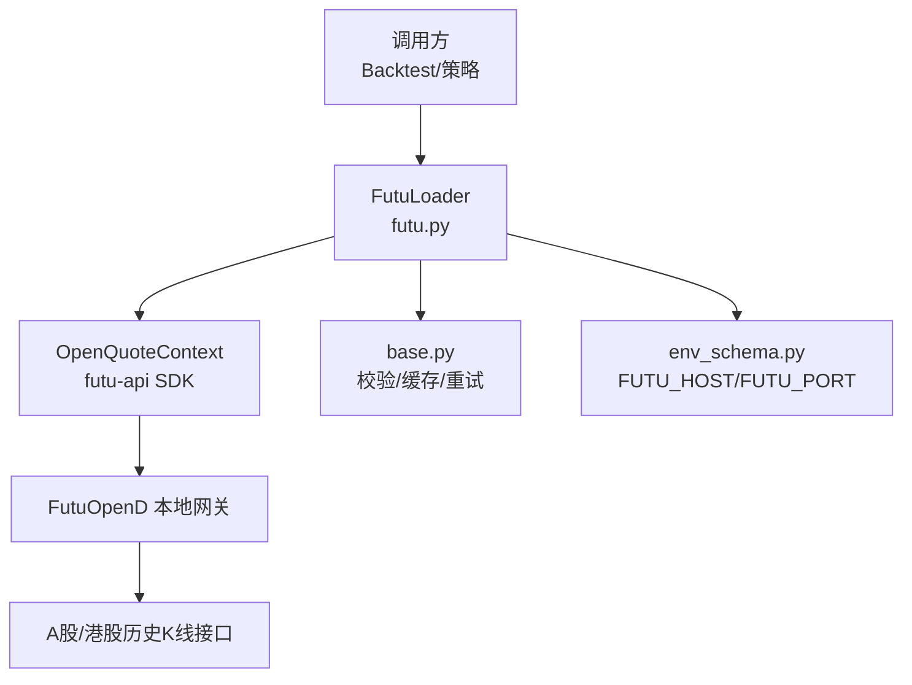
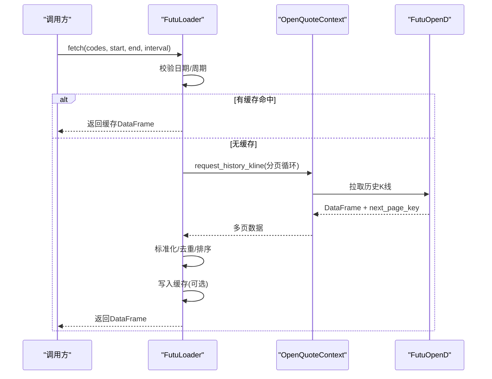
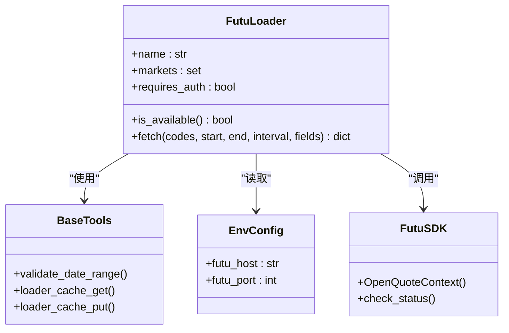

# 富途加载器

<cite>
**本文引用的文件**
- [agent/backtest/loaders/futu.py](file://agent/backtest/loaders/futu.py)
- [agent/backtest/loaders/base.py](file://agent/backtest/loaders/base.py)
- [agent/src/config/env_schema.py](file://agent/src/config/env_schema.py)
- [agent/tests/test_futu_loader.py](file://agent/tests/test_futu_loader.py)
- [agent/src/trading/connectors/futu/sdk.py](file://agent/src/trading/connectors/futu/sdk.py)
</cite>

## 目录
1. [简介](#简介)
2. [项目结构](#项目结构)
3. [核心组件](#核心组件)
4. [架构总览](#架构总览)
5. [详细组件分析](#详细组件分析)
6. [依赖关系分析](#依赖关系分析)
7. [性能与调优](#性能与调优)
8. [故障诊断指南](#故障诊断指南)
9. [结论](#结论)
10. [附录：配置与使用示例](#附录配置与使用示例)

## 简介
本文件面向“富途牛牛（Futu）A股/港股数据加载器”的集成与使用，聚焦以下目标：
- 认证与连接：说明如何通过本地 OpenD 网关建立连接、所需环境变量与可用性检查。
- 权限与范围：明确该加载器仅用于历史行情 OHLCV 获取，支持 A 股与港股，并给出支持的周期映射。
- 数据差异：对比 A 股与港股在交易时间、货币单位、复权因子处理等方面的差异与注意事项。
- 实时与历史：说明历史 K 线拉取流程与分钟级数据处理逻辑；对实时行情的接入方式给出指引。
- 性能优化：提供连接复用、分页拉取、缓存与内存优化的建议。
- 配置与排障：给出完整的环境变量配置清单与常见问题排查步骤。

## 项目结构
围绕富途数据加载的核心代码位于 backtest/loaders 下的 futu.py，配合 base.py 提供的通用校验、重试与缓存能力；环境配置由 env_schema.py 定义；连接器 SDK 封装了与 Futu OpenD 的交互细节。

图表来源
- [agent/backtest/loaders/futu.py:106-253](file://agent/backtest/loaders/futu.py#L106-L253)
- [agent/backtest/loaders/base.py:243-441](file://agent/backtest/loaders/base.py#L243-L441)
- [agent/src/config/env_schema.py:208-209](file://agent/src/config/env_schema.py#L208-L209)

章节来源
- [agent/backtest/loaders/futu.py:1-253](file://agent/backtest/loaders/futu.py#L1-L253)
- [agent/backtest/loaders/base.py:1-657](file://agent/backtest/loaders/base.py#L1-L657)
- [agent/src/config/env_schema.py:170-214](file://agent/src/config/env_schema.py#L170-L214)

## 核心组件
- FutuLoader：注册为数据源加载器，负责将项目符号转换为富途格式、映射周期、分页拉取历史 K 线、标准化输出为统一 OHLCV 表，并写入本地缓存。
- 基础工具（base.py）：日期范围校验、OHLC 结构校验、重试预算、本地 Parquet 缓存读写等。
- 环境配置（env_schema.py）：定义 FUTU_HOST、FUTU_PORT 等环境变量及默认值。
- 连接器 SDK（connectors/futu/sdk.py）：封装 OpenD 连接、账户环境区分、报价/交易上下文创建等。

章节来源
- [agent/backtest/loaders/futu.py:106-253](file://agent/backtest/loaders/futu.py#L106-L253)
- [agent/backtest/loaders/base.py:164-256](file://agent/backtest/loaders/base.py#L164-L256)
- [agent/src/config/env_schema.py:208-209](file://agent/src/config/env_schema.py#L208-L209)
- [agent/src/trading/connectors/futu/sdk.py:71-93](file://agent/src/trading/connectors/futu/sdk.py#L71-L93)

## 架构总览
富途加载器通过本地运行的 FutuOpenD 网关访问富途 OpenAPI，拉取 A 股与港股的历史 K 线数据。加载器内部完成：
- 符号转换：如 700.HK → HK.00700，000001.SZ → SZ.000001，600519.SH → SH.600519。
- 周期映射：1m/5m/15m/30m/1H/4H/1D/1W/1M 映射到富途 KLType。
- 分页拉取：每次最多 10,000 条，通过 page_req_key 翻页合并。
- 数据清洗：标准化列名、数值类型转换、去重、排序。
- 缓存落盘：仅在“已结算区间”且启用缓存时写入本地 Parquet。

图表来源
- [agent/backtest/loaders/futu.py:140-253](file://agent/backtest/loaders/futu.py#L140-L253)
- [agent/backtest/loaders/base.py:565-661](file://agent/backtest/loaders/base.py#L565-L661)

## 详细组件分析

### 符号与周期映射
- 符号转换规则：
  - 港股：后缀 .HK，补齐至5位数字，前缀交易所 HK。
  - A股：后缀 .SZ/.SH，补齐至6位数字，前缀交易所 SZ/SH。
- 周期映射：
  - 1m/5m/15m/30m/1H/4H/1D/1W/1M 分别映射到富途 KLType 常量。
  - 不支持的周期会直接抛出不可用异常，避免静默降级。

章节来源
- [agent/backtest/loaders/futu.py:39-79](file://agent/backtest/loaders/futu.py#L39-L79)
- [agent/tests/test_futu_loader.py:91-133](file://agent/tests/test_futu_loader.py#L91-L133)

### 数据拉取与标准化
- 拉取流程：
  - 构造富途符号与周期后，调用 request_history_kline，单次最大 10,000 条。
  - 通过 next_page_key 进行分页，直到返回空 key。
  - 若任一页面返回非 RET_OK，则跳过该标的。
- 标准化：
  - 将 time_key 转为 trade_date 索引。
  - 保留 open/high/low/close/volume 五列，volume 缺失填 0。
  - 去除 NaN 行、按时间升序、去重（保留最后一条）。

章节来源
- [agent/backtest/loaders/futu.py:104-125](file://agent/backtest/loaders/futu.py#L104-L125)
- [agent/backtest/loaders/futu.py:197-253](file://agent/backtest/loaders/futu.py#L197-L253)
- [agent/tests/test_futu_loader.py:141-170](file://agent/tests/test_futu_loader.py#L141-L170)

### 可用性与连接检查
- is_available：
  - 读取 FUTU_HOST/FUTU_PORT，尝试创建 OpenQuoteContext 并关闭，成功即认为可用。
  - 未设置或连接失败均返回 False。
- 测试覆盖：
  - 主机为空、端口无效、连接抛异常等场景均已验证。

章节来源
- [agent/backtest/loaders/futu.py:118-138](file://agent/backtest/loaders/futu.py#L118-L138)
- [agent/tests/test_futu_loader.py:167-206](file://agent/tests/test_futu_loader.py#L167-L206)

### 缓存机制
- 触发条件：
  - 需显式启用 VIBE_TRADING_DATA_CACHE。
  - 结束日期必须为“已结算日”（早于今天），防止缓存未闭合的日内数据。
- 存储格式：
  - 基于内容哈希的 Parquet 文件，附带元数据（索引列、名称、dtype 等）。
- 行为：
  - 读失败不阻塞主流程；写失败也不影响拉取结果。

章节来源
- [agent/backtest/loaders/base.py:243-441](file://agent/backtest/loaders/base.py#L243-L441)
- [agent/backtest/loaders/base.py:477-597](file://agent/backtest/loaders/base.py#L477-L597)

### 错误处理与健壮性
- 日期校验：start_date <= end_date，否则抛出 ValueError。
- 周期校验：不在支持列表内直接抛出 NoAvailableSourceError。
- 网络异常：连接失败包装为 NoAvailableSourceError；单页失败记录日志并跳过该标的。
- 重复时间戳：去重保留最后一页的值，保证最新数据优先。

章节来源
- [agent/backtest/loaders/base.py:168-184](file://agent/backtest/loaders/base.py#L168-L184)
- [agent/backtest/loaders/futu.py:200-205](file://agent/backtest/loaders/futu.py#L200-L205)
- [agent/backtest/loaders/futu.py:207-253](file://agent/backtest/loaders/futu.py#L207-L253)
- [agent/tests/test_futu_loader.py:275-364](file://agent/tests/test_futu_loader.py#L275-L364)

## 依赖关系分析
- FutuLoader 依赖：
  - futu API（OpenQuoteContext、KLType、RET_OK）。
  - 环境配置（FUTU_HOST、FUTU_PORT）。
  - 基础工具（日期校验、缓存）。
- 连接器 SDK：
  - 提供 OpenD 可达性检查、账户环境（paper/live）区分、报价/交易上下文创建。

图表来源
- [agent/backtest/loaders/futu.py:106-253](file://agent/backtest/loaders/futu.py#L106-L253)
- [agent/backtest/loaders/base.py:243-441](file://agent/backtest/loaders/base.py#L243-L441)
- [agent/src/config/env_schema.py:208-209](file://agent/src/config/env_schema.py#L208-L209)
- [agent/src/trading/connectors/futu/sdk.py:1048-1051](file://agent/src/trading/connectors/futu/sdk.py#L1048-L1051)

章节来源
- [agent/backtest/loaders/futu.py:106-253](file://agent/backtest/loaders/futu.py#L106-L253)
- [agent/src/trading/connectors/futu/sdk.py:71-93](file://agent/src/trading/connectors/futu/sdk.py#L71-L93)

## 性能与调优
- 连接管理
  - 每个 fetch 请求打开一个 OpenQuoteContext，并在 finally 中关闭，避免连接泄漏。
  - 建议在批量拉取多个标的时复用同一上下文（当前实现已在一次 fetch 内复用）。
- 请求频率控制
  - 单次请求上限 10,000 条，通过分页减少单次负载。
  - 可结合外部调度器限制并发与速率，避免触发富途侧限流。
- 内存优化
  - 标准化阶段仅保留必要列，填充 volume 缺失为 0，删除 NaN 行，降低后续计算开销。
  - 去重策略保留最后一条，避免重复时间戳导致的数据膨胀。
- 缓存利用
  - 启用 VIBE_TRADING_DATA_CACHE 并设置合理根路径，可减少重复拉取。
  - 仅对“已结算区间”写入缓存，避免缓存未闭合的日内数据。
- 指标与监控
  - 关注日志中的富途返回错误信息，便于快速定位问题。
  - 统计各标的拉取耗时与失败率，评估是否需要分片或降频。

[本节为通用指导，无需特定文件引用]

## 故障诊断指南
- 无法连接 OpenD
  - 检查 FUTU_HOST/FUTU_PORT 是否正确，OpenD 是否运行且登录。
  - 使用 is_available 快速自检，捕获连接异常。
- 返回错误码
  - 当富途返回非 RET_OK 时，记录错误并跳过该标的，不影响其他标的。
- 数据为空或缺失
  - 确认标的存在、交易时段有效、日期范围正确。
  - 检查标准化过程是否因 NaN 被过滤。
- 缓存未命中
  - 确认已启用缓存且结束日期为已结算日。
  - 检查缓存目录权限与磁盘空间。
- 周期不支持
  - 仅支持 1m/5m/15m/30m/1H/4H/1D/1W/1M，其他周期会直接报错。

章节来源
- [agent/backtest/loaders/futu.py:118-138](file://agent/backtest/loaders/futu.py#L118-L138)
- [agent/backtest/loaders/futu.py:197-253](file://agent/backtest/loaders/futu.py#L197-L253)
- [agent/backtest/loaders/base.py:550-562](file://agent/backtest/loaders/base.py#L550-L562)
- [agent/tests/test_futu_loader.py:167-206](file://agent/tests/test_futu_loader.py#L167-L206)

## 结论
富途加载器以简洁稳定的方式提供 A 股与港股的历史 K 线数据，具备符号与周期映射、分页拉取、标准化与缓存能力。通过环境变量配置本地 OpenD 网关即可接入，适合回测与离线研究场景。对于实时行情，可通过富途连接器 SDK 的报价上下文进行扩展。

[本节为总结性内容，无需特定文件引用]

## 附录：配置与使用示例
- 环境变量
  - FUTU_HOST：富途 OpenD 网关地址，默认 127.0.0.1。
  - FUTU_PORT：富途 OpenD 网关端口，默认 11111。
  - VIBE_TRADING_DATA_CACHE：是否启用本地缓存，默认 False。
  - VIBE_TRADING_DATA_CACHE_ROOT：缓存根目录，默认用户家目录下 .vibe-trading/cache/loaders。
- 使用步骤
  - 启动本地 OpenD 并登录富途账户。
  - 设置 FUTU_HOST/FUTU_PORT。
  - 调用 FutuLoader.fetch 传入股票代码（如 700.HK、000001.SZ）、起止日期与周期。
  - 如需加速，启用数据缓存并指定根目录。
- 常见用法
  - 日线：interval="1D"
  - 分钟线：interval="1m"/"5m"/"15m"/"30m"
  - 小时线：interval="1H"/"4H"
  - 周/月线：interval="1W"/"1M"

章节来源
- [agent/src/config/env_schema.py:177-200](file://agent/src/config/env_schema.py#L177-L200)
- [agent/backtest/loaders/futu.py:106-172](file://agent/backtest/loaders/futu.py#L106-L172)
- [agent/backtest/loaders/base.py:243-441](file://agent/backtest/loaders/base.py#L243-L441)