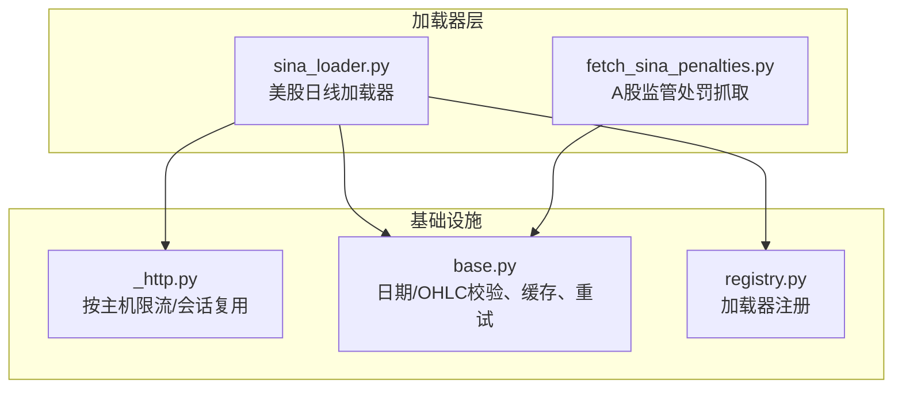
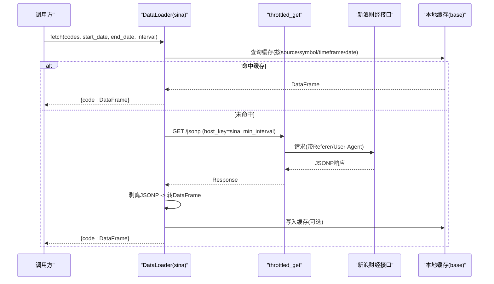
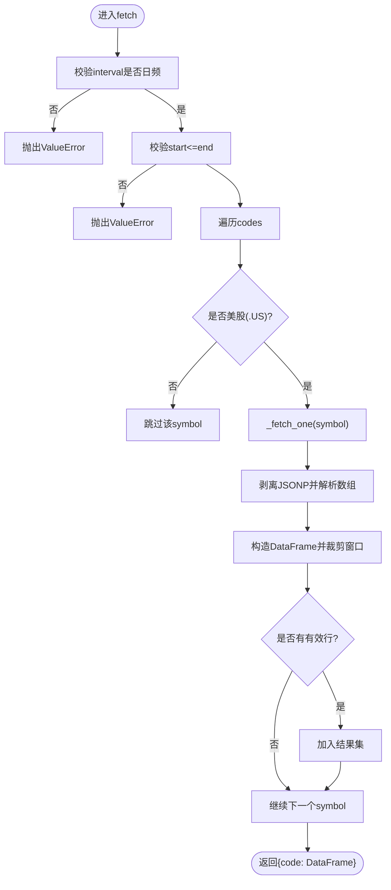
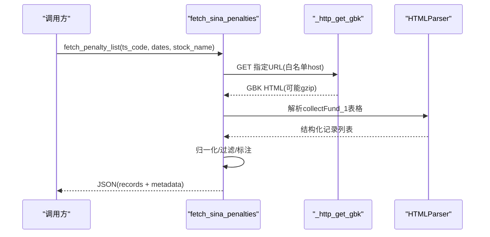
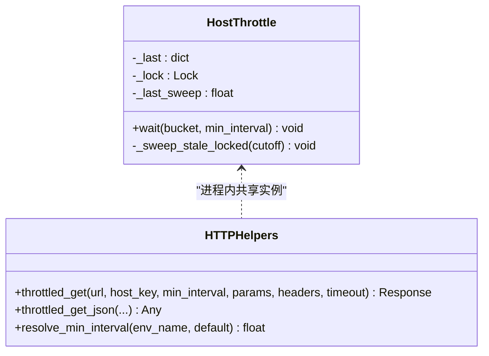
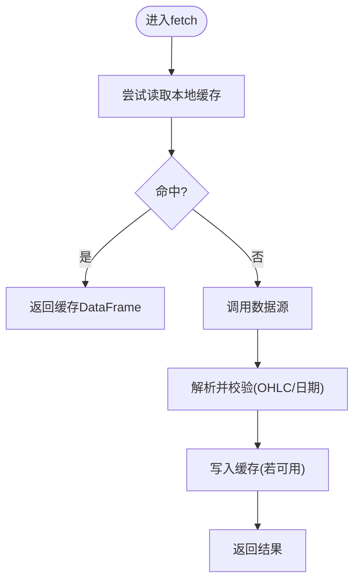
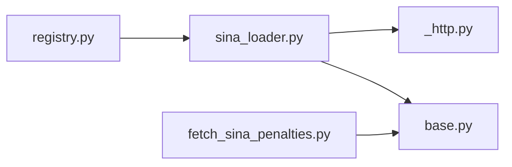

# 新浪财经加载器

<cite>
**本文引用的文件**
- [sina_loader.py](file://agent/backtest/loaders/sina_loader.py)
- [_http.py](file://agent/backtest/loaders/_http.py)
- [base.py](file://agent/backtest/loaders/base.py)
- [registry.py](file://agent/backtest/loaders/registry.py)
- [test_sina_loader.py](file://agent/tests/test_sina_loader.py)
- [fetch_sina_penalties.py](file://agent/src/skills/ashare-pre-st-filter/scripts/fetch_sina_penalties.py)
- [test_fetch_sina_penalties.py](file://agent/tests/test_fetch_sina_penalties.py)
</cite>

## 目录
1. [简介](#简介)
2. [项目结构](#项目结构)
3. [核心组件](#核心组件)
4. [架构总览](#架构总览)
5. [详细组件分析](#详细组件分析)
6. [依赖关系分析](#依赖关系分析)
7. [性能与高频采集优化](#性能与高频采集优化)
8. [故障排查指南](#故障排查指南)
9. [结论](#结论)
10. [附录：使用示例与集成方案](#附录使用示例与集成方案)

## 简介
本文件面向“新浪财经”数据源在 A 股场景下的数据加载能力，结合仓库中已有的通用加载器基础设施，给出系统化的实现说明、数据处理逻辑、并发与缓存策略、以及常见问题处理。需要特别说明的是：当前仓库中的 `sina_loader` 主要实现美股日线 OHLCV 的免费 HTTP/JSONP 获取；A 股相关能力通过独立脚本提供（如监管处罚抓取）。本文同时覆盖这两类能力，并基于通用 HTTP 限流、重试与本地缓存机制，给出可扩展到 A 股实时行情、历史数据、分时数据的工程化方案。

## 项目结构
围绕新浪财经的数据加载，仓库提供了以下关键模块：
- 通用加载器基础能力：日期校验、OHLC 校验、本地缓存、重试预算等
- 共享 HTTP 工具：按主机桶限流、会话复用、最小请求间隔控制
- 具体加载器：Sina 美股日线加载器（注册到统一注册表）
- A 股辅助脚本：新浪财经 A 股监管处罚抓取（GBK HTML 解析、SSRF 防护、指数退避重试）
- 测试：对加载器行为、解析边界、异常路径进行覆盖

图表来源
- [sina_loader.py:1-201](file://agent/backtest/loaders/sina_loader.py#L1-L201)
- [_http.py:1-201](file://agent/backtest/loaders/_http.py#L1-L201)
- [base.py:1-657](file://agent/backtest/loaders/base.py#L1-L657)
- [registry.py:90-100](file://agent/backtest/loaders/registry.py#L90-L100)

章节来源
- [sina_loader.py:1-201](file://agent/backtest/loaders/sina_loader.py#L1-L201)
- [_http.py:1-201](file://agent/backtest/loaders/_http.py#L1-L201)
- [base.py:1-657](file://agent/backtest/loaders/base.py#L1-L657)
- [registry.py:90-100](file://agent/backtest/loaders/registry.py#L90-L100)

## 核心组件
- 美股日线加载器（Sina）
  - 通过 JSONP 接口获取美股日线 OHLCV，剥离 JSONP 包装后转为标准 DataFrame
  - 仅支持日频，自动过滤非美股代码，失败不中断批量
  - 通过共享 HTTP 工具按主机限流，避免触发 IP 级封禁
- A 股监管处罚抓取（独立脚本）
  - 从新浪财经页面抓取 HTML 表格，解析为结构化记录
  - 内置 SSRF 白名单、GBK 解码、指数退避重试、日期过滤与相关性标注
- 通用基础设施
  - 日期范围校验、OHLC 结构校验、本地 Parquet 缓存、带预算的重试
  - 进程内按主机桶的最小请求间隔与抖动，避免并发同步

章节来源
- [sina_loader.py:122-201](file://agent/backtest/loaders/sina_loader.py#L122-L201)
- [fetch_sina_penalties.py:244-553](file://agent/src/skills/ashare-pre-st-filter/scripts/fetch_sina_penalties.py#L244-L553)
- [base.py:168-256](file://agent/backtest/loaders/base.py#L168-L256)
- [base.py:398-450](file://agent/backtest/loaders/base.py#L398-L450)
- [base.py:243-441](file://agent/backtest/loaders/base.py#L243-L441)
- [_http.py:46-173](file://agent/backtest/loaders/_http.py#L46-L173)

## 架构总览
下图展示了从调用方到数据源的完整链路：加载器通过注册表发现，使用共享 HTTP 工具进行限流与连接复用，拉取原始响应后进行格式解析与标准化，最终输出标准 OHLCV 或结构化记录。

图表来源
- [sina_loader.py:137-201](file://agent/backtest/loaders/sina_loader.py#L137-L201)
- [_http.py:141-173](file://agent/backtest/loaders/_http.py#L141-L173)
- [base.py:623-661](file://agent/backtest/loaders/base.py#L623-L661)

## 详细组件分析

### 美股日线加载器（Sina）
- 功能要点
  - 仅支持日频（1D/D/DAY/DAILY），其他区间直接拒绝
  - 自动识别美股代码（以 .US 结尾），非美股直接跳过
  - 将内部代码映射为新浪 bare ticker（去掉 .US）
  - 剥离 JSONP 包装，提取数组并转换为标准 OHLCV DataFrame
  - 按时间窗口裁剪，缺失列丢弃，空结果返回 None
- 错误与健壮性
  - 单只股票失败不影响整体批次
  - 非 2xx 状态码会抛出异常并被上层捕获
  - 日期范围非法时抛出 ValueError
- 性能与限制
  - 通过共享 HTTP 工具按主机限流，默认最小间隔可配置
  - 无认证、免费但受 IP 限速影响
  - 仅日线，不支持分钟/分时

图表来源
- [sina_loader.py:137-201](file://agent/backtest/loaders/sina_loader.py#L137-L201)
- [sina_loader.py:44-72](file://agent/backtest/loaders/sina_loader.py#L44-L72)
- [sina_loader.py:75-119](file://agent/backtest/loaders/sina_loader.py#L75-L119)

章节来源
- [sina_loader.py:44-119](file://agent/backtest/loaders/sina_loader.py#L44-L119)
- [sina_loader.py:122-201](file://agent/backtest/loaders/sina_loader.py#L122-L201)
- [test_sina_loader.py:148-207](file://agent/tests/test_sina_loader.py#L148-L207)

### A 股监管处罚抓取（独立脚本）
- 功能要点
  - 目标 URL 固定于新浪财经域名，严格 SSRF 白名单校验
  - 抓取 GBK 编码 HTML，必要时 gzip 解压
  - 使用 HTMLParser 安全解析表格，避免灾难性回溯正则
  - 抽取事件类型、公告日期、标题、原因、内容、处理人等字段
  - 主体识别（公司/股东/高管）、发行机构归一化（上交所/深交所/地方证监局/证监会）
  - 日期过滤、相关性标注（仅交易提及不计入）
- 错误与健壮性
  - HTTP/解析失败返回统一 fallback JSON，包含 source=unavailable 与 error 信息
  - 指数退避重试，避免瞬时网络抖动导致失败
- 适用场景
  - 作为 A 股事件面数据输入，配合 E2 频次规则与治理因子

图表来源
- [fetch_sina_penalties.py:244-274](file://agent/src/skills/ashare-pre-st-filter/scripts/fetch_sina_penalties.py#L244-L274)
- [fetch_sina_penalties.py:277-482](file://agent/src/skills/ashare-pre-st-filter/scripts/fetch_sina_penalties.py#L277-L482)
- [fetch_sina_penalties.py:508-553](file://agent/src/skills/ashare-pre-st-filter/scripts/fetch_sina_penalties.py#L508-L553)

章节来源
- [fetch_sina_penalties.py:244-553](file://agent/src/skills/ashare-pre-st-filter/scripts/fetch_sina_penalties.py#L244-L553)
- [test_fetch_sina_penalties.py:235-355](file://agent/tests/test_fetch_sina_penalties.py#L235-L355)

### 共享 HTTP 限流与会话复用
- 主机桶限流：同一 host_key 的请求之间保持最小间隔，并加入随机抖动，避免并发同步
- 会话复用：每个 host_key 维护一个 requests.Session，减少 TCP/TLS 握手开销
- 超时与头部：默认浏览器 UA，支持自定义 headers 与超时
- 环境变量：可通过环境变量调整最小间隔，适配批量任务

图表来源
- [_http.py:46-173](file://agent/backtest/loaders/_http.py#L46-L173)

章节来源
- [_http.py:46-173](file://agent/backtest/loaders/_http.py#L46-L173)

### 通用基础能力（日期/OHLC/缓存/重试）
- 日期范围校验：确保 start <= end，格式合法
- OHLC 结构校验：检测 high<low、价格非正等结构性违规，支持 drop/warn/raise 策略
- 本地缓存：基于 content-addressed key 的 Parquet 缓存，读写失败不阻塞主流程
- 重试预算：带 deadline 的有限重试，适用于不稳定外部 API

图表来源
- [base.py:168-256](file://agent/backtest/loaders/base.py#L168-L256)
- [base.py:243-441](file://agent/backtest/loaders/base.py#L243-L441)
- [base.py:398-450](file://agent/backtest/loaders/base.py#L398-L450)

章节来源
- [base.py:168-256](file://agent/backtest/loaders/base.py#L168-L256)
- [base.py:398-450](file://agent/backtest/loaders/base.py#L398-L450)
- [base.py:243-441](file://agent/backtest/loaders/base.py#L243-L441)

## 依赖关系分析
- 加载器与注册表：加载器通过装饰器注册到统一注册表，便于动态发现与路由
- 加载器与 HTTP：所有直连 API 的加载器均通过共享 HTTP 工具进行限流与会话管理
- 加载器与基础库：日期/OHLC 校验、缓存、重试由基础库统一提供，保证一致性

图表来源
- [registry.py:90-100](file://agent/backtest/loaders/registry.py#L90-L100)
- [sina_loader.py:122-201](file://agent/backtest/loaders/sina_loader.py#L122-L201)
- [fetch_sina_penalties.py:244-553](file://agent/src/skills/ashare-pre-st-filter/scripts/fetch_sina_penalties.py#L244-L553)

章节来源
- [registry.py:90-100](file://agent/backtest/loaders/registry.py#L90-L100)
- [sina_loader.py:122-201](file://agent/backtest/loaders/sina_loader.py#L122-L201)
- [fetch_sina_penalties.py:244-553](file://agent/src/skills/ashare-pre-st-filter/scripts/fetch_sina_penalties.py#L244-L553)

## 性能与高频采集优化
- 并发控制
  - 使用共享 HTTP 工具的 HostThrottle，按主机桶设置最小请求间隔，避免触发 IP 级限速
  - 通过环境变量调整最小间隔，适应不同负载与网络环境
- 数据去重
  - 本地缓存基于 content-addressed key，相同 symbol/timeframe/date 范围的结果不会重复请求
  - 仅对已结算日期范围进行缓存，避免缓存正在形成的当日数据
- 内存管理
  - 解析过程中逐条构建 DataFrame，及时丢弃无效行，降低峰值内存
  - 缓存读写失败不阻塞主流程，保障稳定性
- 建议扩展（面向 A 股实时/分时）
  - 引入 WebSocket 或长轮询通道，结合 HostThrottle 做消息级节流
  - 使用环形缓冲或分片存储（如按分钟/小时切分）降低内存占用
  - 增量更新：仅拉取新增时段，结合本地缓存合并去重
  - 指标监控：统计延迟、丢包率、重试次数，动态调整最小间隔

[本节为通用指导，不直接分析具体文件]

## 故障排查指南
- 网络问题
  - 现象：请求被限流或封禁
  - 处理：增大最小请求间隔，检查 Referer/User-Agent，确认未并发过猛
  - 参考：[throttled_get:141-173](file://agent/backtest/loaders/_http.py#L141-L173)
- 数据异常
  - 现象：OHLC 结构违规、价格为零或负数
  - 处理：启用 OHLC 校验，选择 drop/warn/raise 策略，定位脏数据
  - 参考：[validate_ohlc:187-256](file://agent/backtest/loaders/base.py#L187-L256)
- 解析失败
  - 现象：JSONP 无法解析、HTML 表格缺失
  - 处理：检查响应体、增加日志、降级为 fallback JSON
  - 参考：[strip JSONP:54-72](file://agent/backtest/loaders/sina_loader.py#L54-L72)、[HTML 解析:277-482](file://agent/src/skills/ashare-pre-st-filter/scripts/fetch_sina_penalties.py#L277-L482)
- 缓存问题
  - 现象：旧数据未更新或读取失败
  - 处理：检查缓存开关、日期范围是否可缓存、Parquet 元数据完整性
  - 参考：[loader_cache_*:243-441](file://agent/backtest/loaders/base.py#L243-L441)

章节来源
- [_http.py:141-173](file://agent/backtest/loaders/_http.py#L141-L173)
- [base.py:187-256](file://agent/backtest/loaders/base.py#L187-L256)
- [sina_loader.py:54-72](file://agent/backtest/loaders/sina_loader.py#L54-L72)
- [fetch_sina_penalties.py:277-482](file://agent/src/skills/ashare-pre-st-filter/scripts/fetch_sina_penalties.py#L277-L482)
- [base.py:243-441](file://agent/backtest/loaders/base.py#L243-L441)

## 结论
- 当前仓库实现了稳定的美股日线加载器（Sina），具备限流、缓存、校验与健壮的错误处理
- A 股能力通过独立脚本提供（监管处罚抓取），具备 SSRF 防护、GBK 解析、重试与相关性标注
- 借助通用基础设施，可平滑扩展到 A 股实时行情、历史数据与分时数据的高频采集
- 建议在扩展时遵循现有模式：统一限流、统一缓存、统一校验，确保一致性与可维护性

[本节为总结，不直接分析具体文件]

## 附录：使用示例与集成方案
- 美股日线（Sina）
  - 调用 DataLoader.fetch，传入 codes（如 AAPL.US）、start_date、end_date、interval="1D"
  - 返回 {code: DataFrame}，索引为 trade_date，列为 open/high/low/close/volume
  - 参考：[fetch 接口:137-181](file://agent/backtest/loaders/sina_loader.py#L137-L181)
- A 股监管处罚
  - 调用 fetch_penalty_list，传入 ts_code、可选日期范围与 stock_name
  - 返回 JSON，包含 records 与 metadata，失败时 source=unavailable
  - 参考：[fetch_penalty_list:508-553](file://agent/src/skills/ashare-pre-st-filter/scripts/fetch_sina_penalties.py#L508-L553)
- 与其他数据源集成
  - 通过注册表统一管理多个 loader，根据市场与符号路由
  - 使用统一的 HTTP 限流与缓存，避免重复请求与资源浪费
  - 参考：[注册表:90-100](file://agent/backtest/loaders/registry.py#L90-L100)

章节来源
- [sina_loader.py:137-181](file://agent/backtest/loaders/sina_loader.py#L137-L181)
- [fetch_sina_penalties.py:508-553](file://agent/src/skills/ashare-pre-st-filter/scripts/fetch_sina_penalties.py#L508-L553)
- [registry.py:90-100](file://agent/backtest/loaders/registry.py#L90-L100)