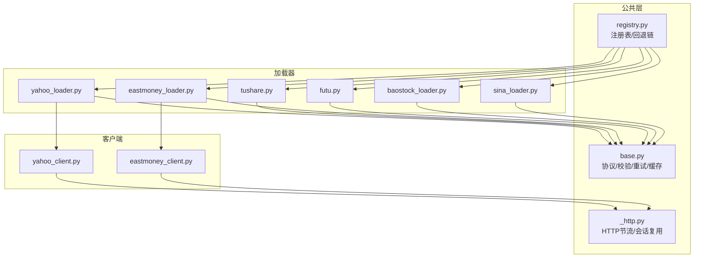
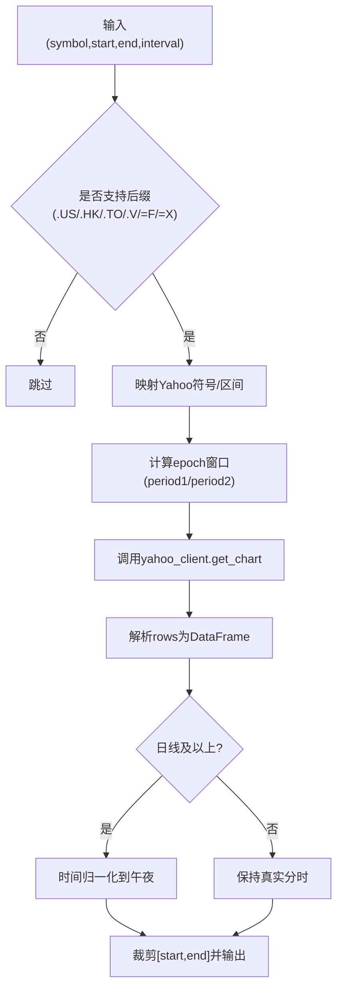
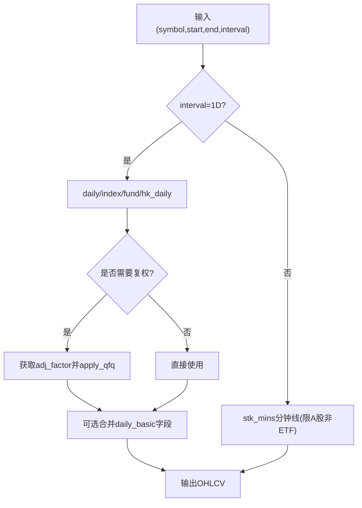
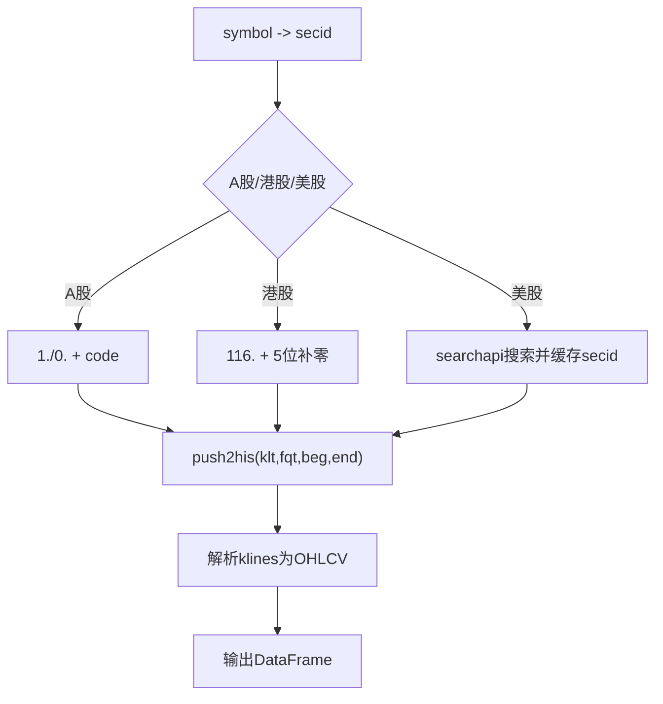
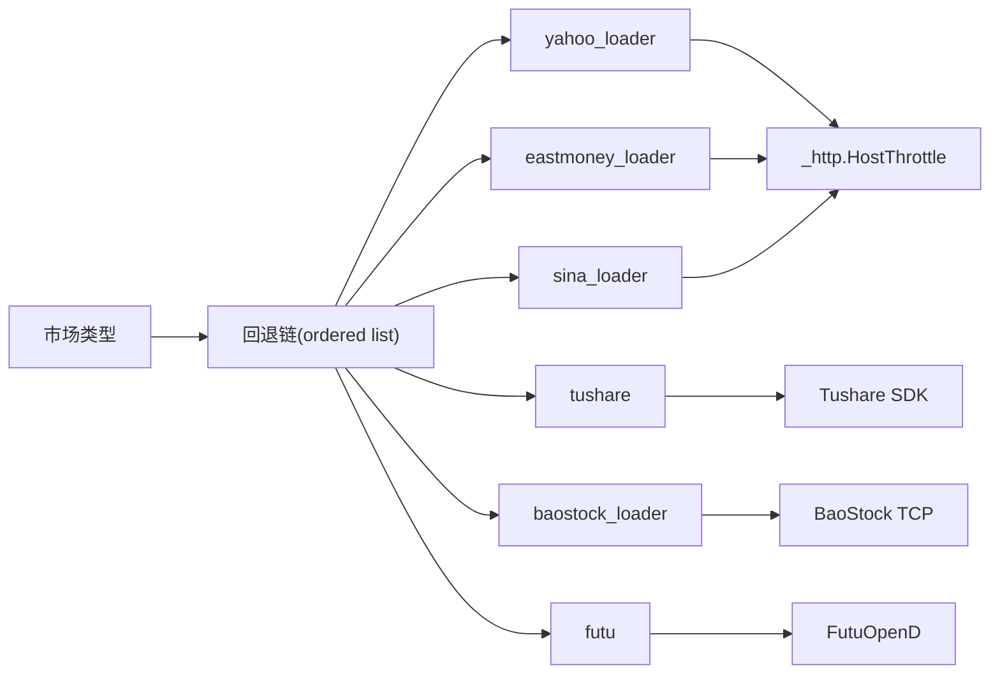

# 股票市场加载器

<cite>
**本文引用的文件**
- [agent/backtest/loaders/base.py](file://agent/backtest/loaders/base.py)
- [agent/backtest/loaders/registry.py](file://agent/backtest/loaders/registry.py)
- [agent/backtest/loaders/yahoo_loader.py](file://agent/backtest/loaders/yahoo_loader.py)
- [agent/backtest/loaders/yahoo_client.py](file://agent/backtest/loaders/yahoo_client.py)
- [agent/backtest/loaders/tushare.py](file://agent/backtest/loaders/tushare.py)
- [agent/backtest/loaders/eastmoney_loader.py](file://agent/backtest/loaders/eastmoney_loader.py)
- [agent/backtest/loaders/eastmoney_client.py](file://agent/backtest/loaders/eastmoney_client.py)
- [agent/backtest/loaders/futu.py](file://agent/backtest/loaders/futu.py)
- [agent/backtest/loaders/baostock_loader.py](file://agent/backtest/loaders/baostock_loader.py)
- [agent/backtest/loaders/sina_loader.py](file://agent/backtest/loaders/sina_loader.py)
- [agent/backtest/loaders/_http.py](file://agent/backtest/loaders/_http.py)
- [agent/backtest/loaders/cn_adjust.py](file://agent/backtest/loaders/cn_adjust.py)
</cite>

## 目录
1. [简介](#简介)
2. [项目结构](#项目结构)
3. [核心组件](#核心组件)
4. [架构总览](#架构总览)
5. [详细组件分析](#详细组件分析)
6. [依赖关系分析](#依赖关系分析)
7. [性能考量](#性能考量)
8. [故障排除指南](#故障排除指南)
9. [结论](#结论)
10. [附录：配置与使用建议](#附录：配置与使用建议)

## 简介
本文件面向“股票市场数据加载器”的综合文档，覆盖美股（Yahoo Finance）、A股（Tushare、东方财富、BaoStock、新浪财经）、港股/A股（富途）等主流市场的数据接入实现。重点说明各加载器的认证方式、数据范围、频率限制与特殊处理；统一复权因子处理、交易日历适配、货币换算等市场特定逻辑；并提供性能对比、批量请求优化、缓存策略与错误恢复机制，以及配置示例与故障排除指南。

## 项目结构
加载器采用“协议 + 注册表 + 市场回退链”的架构：
- DataLoaderProtocol 定义统一的 fetch 接口与元信息（name/markets/requires_auth/volume_units）。
- registry 维护全局注册表与按市场的回退链（如 a_share/us_equity/hk_equity），自动选择可用加载器。
- base 提供日期校验、OHLC 校验、重试预算、本地 Parquet 缓存等通用能力。
- 各市场加载器通过 @register 装饰器自注册，并实现 is_available/fetch。

图表来源
- [agent/backtest/loaders/base.py:1-657](file://agent/backtest/loaders/base.py#L1-L657)
- [agent/backtest/loaders/registry.py:1-256](file://agent/backtest/loaders/registry.py#L1-L256)
- [agent/backtest/loaders/_http.py:1-201](file://agent/backtest/loaders/_http.py#L1-L201)
- [agent/backtest/loaders/yahoo_loader.py:1-275](file://agent/backtest/loaders/yahoo_loader.py#L1-L275)
- [agent/backtest/loaders/yahoo_client.py:1-419](file://agent/backtest/loaders/yahoo_client.py#L1-L419)
- [agent/backtest/loaders/eastmoney_loader.py:1-183](file://agent/backtest/loaders/eastmoney_loader.py#L1-L183)
- [agent/backtest/loaders/eastmoney_client.py:1-325](file://agent/backtest/loaders/eastmoney_client.py#L1-L325)

章节来源
- [agent/backtest/loaders/base.py:1-657](file://agent/backtest/loaders/base.py#L1-L657)
- [agent/backtest/loaders/registry.py:1-256](file://agent/backtest/loaders/registry.py#L1-L256)

## 核心组件
- DataLoaderProtocol：统一接口 name/markets/requires_auth/is_available/fetch，约定 volume_units 声明成交量单位（lots/shares）。
- 注册表与回退链：按市场类型（a_share/us_equity/hk_equity 等）维护优先顺序，自动选择可用加载器；对显式指定 source（如 local/tickerall）禁止静默降级到网络源。
- 通用工具：
  - 日期与 OHLC 校验：validate_date_range、validate_ohlc。
  - 重试与预算：retry_with_budget/check_budget，用于易失败的外部 API。
  - 本地缓存：基于 Parquet 的内容寻址缓存，支持读写、版本控制、索引还原与范围有效性判断。

章节来源
- [agent/backtest/loaders/base.py:168-256](file://agent/backtest/loaders/base.py#L168-L256)
- [agent/backtest/loaders/base.py:377-450](file://agent/backtest/loaders/base.py#L377-L450)
- [agent/backtest/loaders/base.py:243-441](file://agent/backtest/loaders/base.py#L243-L441)
- [agent/backtest/loaders/registry.py:19-158](file://agent/backtest/loaders/registry.py#L19-L158)
- [agent/backtest/loaders/registry.py:161-256](file://agent/backtest/loaders/registry.py#L161-L256)

## 架构总览
加载器通过注册表按市场回退链选择，调用方传入 codes/start_date/end_date/interval，返回 {symbol: DataFrame}。每个加载器内部负责：
- 符号路由与格式转换
- 频率限制与重试
- 数据清洗与标准化（OHLCV、时间戳、缺失值）
- 可选复权与字段合并
- 写入本地缓存

```mermaid
sequenceDiagram
participant Caller as "调用方"
participant Reg as "注册表"
participant Ldr as "具体加载器"
participant Cln as "客户端(如yahoo_client)"
participant Net as "网络/节流(_http)"
participant Cache as "本地缓存(base)"
Caller->>Reg : resolve_loader(market)
Reg-->>Caller : 可用加载器实例
Caller->>Ldr : fetch(codes, start, end, interval)
loop 逐代码
Caller->>Cache : 尝试读取缓存
alt 命中
Cache-->>Caller : DataFrame
else 未命中
Ldr->>Cln : 拉取原始数据
Cln->>Net : 节流+会话复用
Net-->>Cln : 响应
Cln-->>Ldr : 原始行/字典
Ldr->>Ldr : 清洗/标准化/复权
Ldr->>Cache : 写入缓存(非空且可缓存)
Cache-->>Ldr : 确认
Ldr-->>Caller : DataFrame
end
end
Caller-->>Caller : 汇总结果{symbol : DataFrame}
```

图表来源
- [agent/backtest/loaders/registry.py:614-649](file://agent/backtest/loaders/registry.py#L614-L649)
- [agent/backtest/loaders/base.py:623-661](file://agent/backtest/loaders/base.py#L623-L661)
- [agent/backtest/loaders/yahoo_loader.py:195-275](file://agent/backtest/loaders/yahoo_loader.py#L195-L275)
- [agent/backtest/loaders/yahoo_client.py:156-205](file://agent/backtest/loaders/yahoo_client.py#L156-L205)
- [agent/backtest/loaders/_http.py:141-201](file://agent/backtest/loaders/_http.py#L141-L201)

## 详细组件分析

### Yahoo Finance（美股/港股/加股/印/韩）
- 认证：无需认证，直接 HTTP 访问 v8 chart 端点。
- 数据范围：US/HK/India/Korea/Canada 股票及期货/外汇后缀；分钟/小时/日/周/月粒度映射。
- 频率限制：通过共享 _http 节流与进程级会话复用；默认最小间隔约 0.6s，可通过环境变量调整。
- 特殊处理：
  - 符号映射：去 .US、HK 前导零规范化为4位、保留 .NS/.BO/.TO/.V 等后缀。
  - 时间戳：将 epoch 秒转为 tz-naive 时间；日线及以上归一化到午夜对齐。
  - 区间裁剪：period2 为独占，需延后一天再裁剪。
  - 成交量单位：声明 us_equity/hk_equity 为 shares。
- 缓存：使用通用 cached_loader_fetch，内容寻址存储 parquet。

图表来源
- [agent/backtest/loaders/yahoo_loader.py:44-106](file://agent/backtest/loaders/yahoo_loader.py#L44-L106)
- [agent/backtest/loaders/yahoo_loader.py:139-184](file://agent/backtest/loaders/yahoo_loader.py#L139-L184)
- [agent/backtest/loaders/yahoo_loader.py:195-275](file://agent/backtest/loaders/yahoo_loader.py#L195-L275)
- [agent/backtest/loaders/yahoo_client.py:71-93](file://agent/backtest/loaders/yahoo_client.py#L71-L93)
- [agent/backtest/loaders/yahoo_client.py:156-205](file://agent/backtest/loaders/yahoo_client.py#L156-L205)

章节来源
- [agent/backtest/loaders/yahoo_loader.py:1-275](file://agent/backtest/loaders/yahoo_loader.py#L1-L275)
- [agent/backtest/loaders/yahoo_client.py:1-419](file://agent/backtest/loaders/yahoo_client.py#L1-L419)

### Tushare（A股/港股/基金/期货）
- 认证：需要 TUSHARE_TOKEN；通过 pro_api 初始化。
- 数据范围：A股/港股/基金/期货；日线为主，分钟线（1m/5m/15m/30m/1H）需积分>=2000。
- 频率限制：针对每分钟配额拒绝进行指数退避重试（5/20/40s），避免误判普通失败。
- 特殊处理：
  - 复权因子：A股/基金获取 adj_factor/fund_adj，应用前复权（cn_adjust.apply_qfq），否则丢弃该标的以防收益污染。
  - 基本面字段：可按 fields 合并 daily_basic 列（仅股票）。
  - 成交量单位：A股为 lots。
- 缓存：日线路径通过 cached_loader_fetch 缓存（含合并后的额外字段）。

图表来源
- [agent/backtest/loaders/tushare.py:116-205](file://agent/backtest/loaders/tushare.py#L116-L205)
- [agent/backtest/loaders/tushare.py:207-268](file://agent/backtest/loaders/tushare.py#L207-L268)
- [agent/backtest/loaders/tushare.py:361-414](file://agent/backtest/loaders/tushare.py#L361-L414)
- [agent/backtest/loaders/tushare.py:416-476](file://agent/backtest/loaders/tushare.py#L416-L476)
- [agent/backtest/loaders/cn_adjust.py:27-78](file://agent/backtest/loaders/cn_adjust.py#L27-L78)

章节来源
- [agent/backtest/loaders/tushare.py:1-386](file://agent/backtest/loaders/tushare.py#L1-L386)
- [agent/backtest/loaders/cn_adjust.py:1-78](file://agent/backtest/loaders/cn_adjust.py#L1-L78)

### 东方财富（A股/港股/美股）
- 认证：无需认证，免费 push2his 端点。
- 数据范围：A股（SH/SZ/BJ）、港股（HK）、美股（通过搜索发现 NASDAQ/NYSE/AMEX 市场前缀并缓存）。
- 频率限制：通过 _http 节流（默认最小间隔约 1.0s），进程内会话复用。
- 特殊处理：
  - secid 解析：A股 1./0.，港股 116.（5位补零），美股搜索解析并缓存。
  - 复权：请求 fqt=1（前复权），返回已复权 K 线。
  - 成交量单位：A股为 lots，港股为 shares。
- 缓存：通用 cached_loader_fetch。

图表来源
- [agent/backtest/loaders/eastmoney_loader.py:51-183](file://agent/backtest/loaders/eastmoney_loader.py#L51-L183)
- [agent/backtest/loaders/eastmoney_client.py:136-267](file://agent/backtest/loaders/eastmoney_client.py#L136-L267)
- [agent/backtest/loaders/eastmoney_client.py:300-355](file://agent/backtest/loaders/eastmoney_client.py#L300-L355)

章节来源
- [agent/backtest/loaders/eastmoney_loader.py:1-183](file://agent/backtest/loaders/eastmoney_loader.py#L1-L183)
- [agent/backtest/loaders/eastmoney_client.py:1-325](file://agent/backtest/loaders/eastmoney_client.py#L1-L325)

### 富途（港股/A股）
- 认证：需要本地 FutuOpenD 服务（FUTU_HOST/FUTU_PORT）。
- 数据范围：港股/中国 A 股；支持多周期（1m/5m/15m/30m/1H/1D/1W/1M/4H）。
- 频率限制：SDK 分页拉取（max_count=10000），无内置节流；建议在调用侧控制并发。
- 特殊处理：
  - 符号转换：700.HK -> HK.00700，SZ/SH 补齐位数。
  - 周期映射：KLType 枚举映射。
  - 成交量单位：未声明（由消费者从 provenance 推断）。
- 缓存：手动 loader_cache_get/put，仅在至少一个标的未命中时连接 OpenQuoteContext。

章节来源
- [agent/backtest/loaders/futu.py:1-253](file://agent/backtest/loaders/futu.py#L1-L253)

### BaoStock（A股）
- 认证：无需认证，TCP 协议绕过 CDN IP 封禁。
- 数据范围：A股（SH/SZ），仅日线。
- 频率限制：无内置节流；适合低频或离线场景。
- 特殊处理：
  - 复权：查询 adjustflag="2"（前复权）。
  - 成交量单位：原生为 shares，加载器统一转换为 lots（除以100）。
- 缓存：通用 cached_loader_fetch。

章节来源
- [agent/backtest/loaders/baostock_loader.py:1-174](file://agent/backtest/loaders/baostock_loader.py#L1-L174)

### 新浪财经（美股）
- 认证：无需认证，JSONP 每日 K 线。
- 数据范围：美股日线。
- 频率限制：通过 _http 节流（默认最小间隔可调）。
- 特殊处理：
  - JSONP 剥离与数组提取。
  - 仅支持日线，其他周期会报错。
- 缓存：通用 cached_loader_fetch。

章节来源
- [agent/backtest/loaders/sina_loader.py:1-201](file://agent/backtest/loaders/sina_loader.py#L1-L201)

## 依赖关系分析
- 市场回退链优先级：
  - a_share：tencent > mootdx > eastmoney > baostock > akshare > tushare > local
  - us_equity：yahoo > stooq > sina > eastmoney > yfinance > tiingo > fmp > finnhub > alphavantage > longbridge > akshare > local
  - hk_equity：tencent > eastmoney > yahoo > futu > akshare > yfinance > tushare > longbridge > local
- 网络层：所有 HTTP 加载器共用 _http.HostThrottle 与 Session 池，按 host_key 隔离节流。
- 缓存层：base.loader_cache_* 提供内容寻址的 parquet 缓存，读/写失败均不中断主流程。

图表来源
- [agent/backtest/loaders/registry.py:139-158](file://agent/backtest/loaders/registry.py#L139-L158)
- [agent/backtest/loaders/_http.py:46-110](file://agent/backtest/loaders/_http.py#L46-L110)

章节来源
- [agent/backtest/loaders/registry.py:139-158](file://agent/backtest/loaders/registry.py#L139-L158)
- [agent/backtest/loaders/_http.py:1-201](file://agent/backtest/loaders/_http.py#L1-L201)

## 性能考量
- 批量请求优化
  - 逐标的循环中优先走本地缓存，减少网络开销。
  - 对高频网络源（Yahoo/Eastmoney/Sina）使用进程级节流与会话复用，降低握手与 TLS 成本。
  - Tushare 分钟线分片调用，避免单次过大请求。
- 缓存策略
  - 内容寻址 key（source/symbol/timeframe/start/end/fields），版本化防旧数据命中。
  - 仅对已结算区间（end_date < 今日）缓存，避免当日未完成条被固化。
  - 读写失败不影响主流程，保证健壮性。
- 错误恢复
  - 重试预算：retry_with_budget 以单调时钟 deadline 控制最大重试次数与退避。
  - 配额/限频：Tushare 识别“每分钟/每天/抽取/访问该接口/频率”等关键字触发退避。
  - 单标的不影响整体：任一 symbol 失败仅记录日志并跳过。
- 数据质量
  - validate_ohlc 强制 high>=low、open/close 在 high/low 之间，并可选择是否允许非正价格。
  - 时间对齐：Yahoo 日线归一到午夜，避免跨源合并错位。

[本节为通用指导，不直接分析具体文件]

## 故障排除指南
- 无法找到可用数据源
  - 现象：NoAvailableSourceError。
  - 排查：检查市场回退链中各加载器 is_available；确认网络与凭据（如 TUSHARE_TOKEN、FUTU_HOST/FUTU_PORT）。
  - 参考：resolve_loader 抛出异常包含尝试过的源列表。
- 频率限制/配额耗尽
  - Tushare：出现“每分钟/每天/抽取/访问该接口/频率”等提示即进入退避重试。
  - Eastmoney/Sina/Yahoo：通过 _http 节流；可通过环境变量调大最小间隔。
- 复权因子缺失
  - Tushare：若 adj_factor/fund_adj 不可用，将丢弃该标的以避免收益污染。
  - 解决：确保积分权限或改用其他源（如东方财富自带前复权）。
- 数据为空或格式异常
  - 检查符号后缀是否正确（.US/.HK/.SH/.SZ 等）。
  - 检查日期范围是否有效（start<=end）。
  - 查看 validate_ohlc 告警与 drop/warn/raise 行为。
- 本地缓存问题
  - 缓存未命中：可能因 end_date 未结算或键不一致（fields/timeframe 变化）。
  - 缓存损坏：自动回退到在线源；可清理 ~/.vibe-trading/cache/loaders 对应目录。

章节来源
- [agent/backtest/loaders/registry.py:614-649](file://agent/backtest/loaders/registry.py#L614-L649)
- [agent/backtest/loaders/tushare.py:18-79](file://agent/backtest/loaders/tushare.py#L18-L79)
- [agent/backtest/loaders/base.py:168-256](file://agent/backtest/loaders/base.py#L168-L256)
- [agent/backtest/loaders/base.py:550-661](file://agent/backtest/loaders/base.py#L550-L661)

## 结论
本加载器体系通过统一协议、注册表与回退链，实现了跨市场、跨源的多数据源接入；借助共享节流、会话复用与本地缓存，显著提升了批量拉取的稳定性与效率。针对不同市场特性，提供了复权因子处理、时间对齐、成交量单位归一化等关键逻辑。建议在生产环境中启用本地缓存、合理设置节流参数，并结合业务需求选择合适的回退链与数据源组合。

[本节为总结，不直接分析具体文件]

## 附录：配置与使用建议
- 环境变量（节选）
  - VIBE_TRADING_DATA_CACHE：是否启用本地缓存（true/false）。
  - VIBE_TRADING_DATA_CACHE_ROOT：缓存根目录（默认用户家目录下 .vibe-trading/cache/loaders）。
  - VIBE_TRADING_YAHOO_MIN_INTERVAL：Yahoo 最小请求间隔（秒）。
  - VIBE_TRADING_EASTMONEY_MIN_INTERVAL：东方财富最小请求间隔（秒）。
  - VIBE_TRADING_SINA_MIN_INTERVAL：新浪最小请求间隔（秒）。
  - TUSHARE_TOKEN：Tushare 访问令牌。
  - FUTU_HOST/FUTU_PORT：富途 OpenAPI 网关地址。
- 使用建议
  - 批量拉取：优先启用本地缓存；对高频源适当增大 *_MIN_INTERVAL。
  - 容错：利用 validate_ohlc 的 warn/drop/raise 策略，结合日志定位脏数据。
  - 回退链：根据目标市场选择合适的首选项（如 A 股优先腾讯/东方财富，美股优先 Yahoo）。
  - 复权：A 股建议使用具备可靠复权的源（东方财富前复权；Tushare 需有 adj_factor）。
  - 成交量单位：注意不同源的 units（lots/shares），必要时做归一化。

[本节为通用指导，不直接分析具体文件]