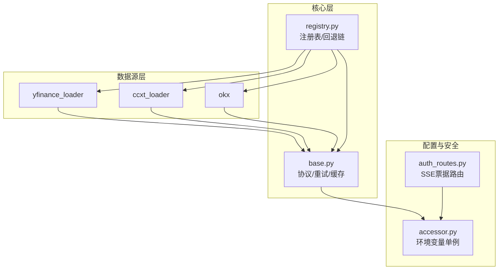
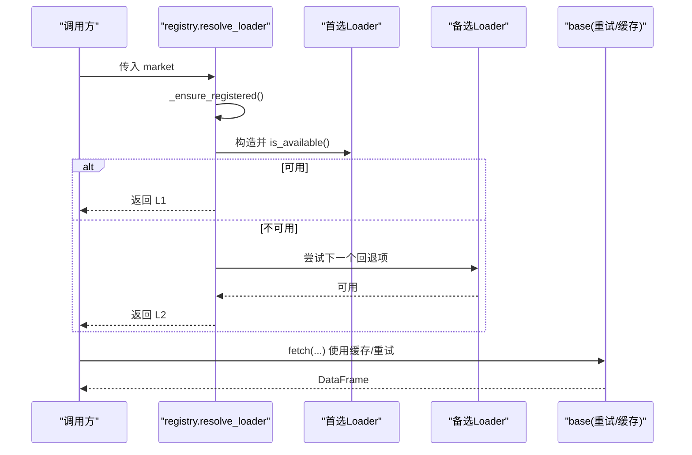
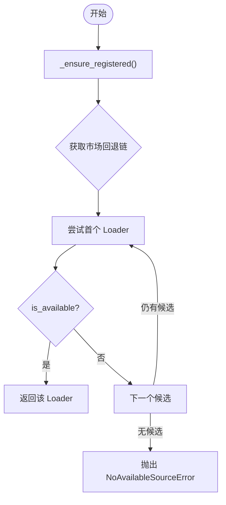
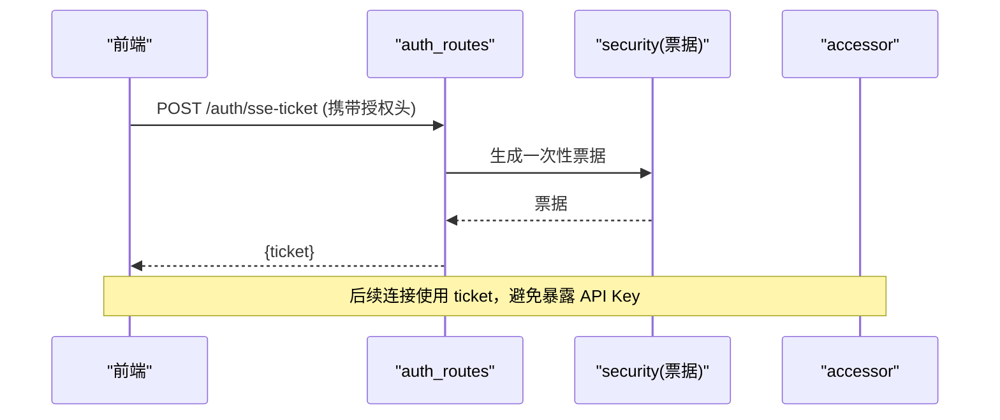
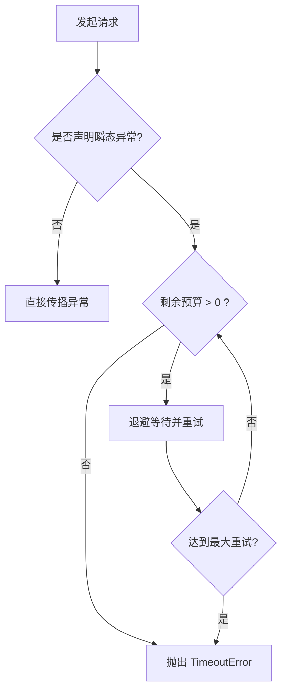
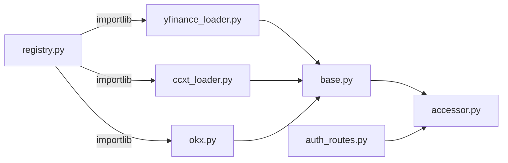

# 数据源集成

<cite>
**本文引用的文件**
- [base.py](file://agent/backtest/loaders/base.py)
- [registry.py](file://agent/backtest/loaders/registry.py)
- [yfinance_loader.py](file://agent/backtest/loaders/yfinance_loader.py)
- [ccxt_loader.py](file://agent/backtest/loaders/ccxt_loader.py)
- [okx.py](file://agent/backtest/loaders/okx.py)
- [accessor.py](file://agent/src/config/accessor.py)
- [auth_routes.py](file://agent/src/api/auth_routes.py)
</cite>

## 目录
1. [简介](#简介)
2. [项目结构](#项目结构)
3. [核心组件](#核心组件)
4. [架构总览](#架构总览)
5. [详细组件分析](#详细组件分析)
6. [依赖关系分析](#依赖关系分析)
7. [性能考虑](#性能考虑)
8. [故障排查指南](#故障排查指南)
9. [结论](#结论)
10. [附录：新数据源集成指南](#附录新数据源集成指南)

## 简介
本技术文档面向数据工程师与系统集成开发者，系统性说明 Vibe-Trading 的数据源集成方案。重点覆盖：
- 统一接口抽象设计（BaseLoader/DataLoaderProtocol）及扩展点
- 动态发现机制（注册表模式、插件加载、依赖注入）
- 负载均衡策略（多数据源切换、故障转移、性能监控）
- 认证管理（API 密钥配置、OAuth/SSE 票据、会话相关）
- 错误处理（重试策略、降级方案、异常分类）
- 新数据源接入指南（适配器开发、测试、部署）
- 性能优化建议与最佳实践

## 项目结构
数据源集成位于 agent/backtest/loaders 目录下，采用“协议 + 注册表 + 多实现”的分层组织：
- base.py：定义 DataLoaderProtocol 协议、通用校验、重试/预算控制、本地缓存等基础设施
- registry.py：维护全局注册表、市场级回退链、自动发现与解析
- 各 loader 实现：如 yfinance_loader、ccxt_loader、okx 等，遵循协议并自注册



图表来源
- [registry.py:19-158](file://agent/backtest/loaders/registry.py#L19-L158)
- [base.py:851-887](file://agent/backtest/loaders/base.py#L851-L887)
- [accessor.py:52-76](file://agent/src/config/accessor.py#L52-L76)
- [auth_routes.py:21-55](file://agent/src/api/auth_routes.py#L21-L55)

章节来源
- [registry.py:1-158](file://agent/backtest/loaders/registry.py#L1-L158)
- [base.py:1-657](file://agent/backtest/loaders/base.py#L1-L657)

## 核心组件
- DataLoaderProtocol：统一数据源接口，要求 name、markets、requires_auth 以及 is_available/fetch 方法，确保所有数据源以一致方式被调用与选择
- 注册表与回退链：通过 @register 装饰器将具体 Loader 类注册到全局 LOADER_REGISTRY；按市场类型维护有序的回退链，自动选择首个可用数据源
- 重试与预算：统一的 retry_with_budget/check_budget 提供带超时预算的指数退避重试，避免外部 API 抖动导致长时间挂起
- 本地缓存：基于 parquet 的内容寻址缓存，支持开关、版本化、原子写入与元数据恢复，显著降低重复请求
- OHLC 校验：在数据边界进行结构性与数值性校验，保证下游回测稳定性

章节来源
- [base.py:164-256](file://agent/backtest/loaders/base.py#L164-L256)
- [base.py:127-236](file://agent/backtest/loaders/base.py#L127-L236)
- [base.py:243-441](file://agent/backtest/loaders/base.py#L243-L441)
- [base.py:851-887](file://agent/backtest/loaders/base.py#L851-L887)
- [registry.py:19-158](file://agent/backtest/loaders/registry.py#L19-L158)

## 架构总览
系统通过“协议 + 注册表 + 多实现”解耦上层调度与底层数据源。调度侧不关心具体实现，仅依赖协议与可用性判断；注册表负责按市场类型选择最优数据源，并在不可用时沿回退链降级。



图表来源
- [registry.py:614-649](file://agent/backtest/loaders/registry.py#L614-L649)
- [base.py:398-450](file://agent/backtest/loaders/base.py#L398-L450)
- [base.py:623-661](file://agent/backtest/loaders/base.py#L623-L661)

## 详细组件分析

### 统一接口与基类能力（DataLoaderProtocol）
- 接口契约：name/markets/requires_auth/is_available/fetch
- 扩展点：
  - is_available：声明式检查依赖是否就绪（如库安装、网络可达、凭据存在）
  - fetch：统一输入输出（codes, start_date, end_date, interval, fields -> {symbol: DataFrame}）
- 数据质量：validate_ohlc 在 loader 边界执行 OHLC 不变量校验，防止脏数据进入回测
- 重试与预算：retry_with_budget 对声明的瞬态异常进行有限次重试，结合 deadline 快速失败
- 本地缓存：cached_loader_fetch/loader_cache_* 提供内容寻址、原子写入、元数据恢复的 parquet 缓存

```mermaid
classDiagram
class DataLoaderProtocol {
+string name
+set markets
+bool requires_auth
+is_available() bool
+fetch(codes, start_date, end_date, interval, fields) dict
}
class YFinanceLoader {
+name = "yfinance"
+markets = {"us_equity","hk_equity",...}
+is_available() bool
+fetch(...)
}
class CCXTLoader {
+name = "ccxt"
+markets = {"crypto"}
+is_available() bool
+fetch(...)
}
class OKXLoader {
+name = "okx"
+markets = {"crypto"}
+is_available() bool
+fetch(...)
}
DataLoaderProtocol <|.. YFinanceLoader
DataLoaderProtocol <|.. CCXTLoader
DataLoaderProtocol <|.. OKXLoader
```

图表来源
- [base.py:851-887](file://agent/backtest/loaders/base.py#L851-L887)
- [yfinance_loader.py:1-200](file://agent/backtest/loaders/yfinance_loader.py#L1-L200)
- [ccxt_loader.py:184-200](file://agent/backtest/loaders/ccxt_loader.py#L184-L200)
- [okx.py:101-129](file://agent/backtest/loaders/okx.py#L101-L129)

章节来源
- [base.py:164-256](file://agent/backtest/loaders/base.py#L164-L256)
- [base.py:398-450](file://agent/backtest/loaders/base.py#L398-L450)
- [base.py:243-441](file://agent/backtest/loaders/base.py#L243-L441)
- [base.py:851-887](file://agent/backtest/loaders/base.py#L851-L887)

### 动态发现与注册表（Registry）
- 注册机制：@register 装饰器将 Loader 类加入 LOADER_REGISTRY；_ensure_registered 懒加载所有已知模块，触发装饰器
- 市场回退链：FALLBACK_CHAINS 为每个市场定义优先级顺序，兼顾反封禁与数据质量
- 解析策略：resolve_loader 遍历回退链，返回首个 is_available=True 的实例；get_loader_cls_with_fallback 支持按 source 名解析并同市场降级
- 安全限制：local/tickerall/qveris 等显式请求不允许静默降级到无关网络源，避免掩盖配置问题



图表来源
- [registry.py:72-117](file://agent/backtest/loaders/registry.py#L72-L117)
- [registry.py:139-158](file://agent/backtest/loaders/registry.py#L139-L158)
- [registry.py:614-649](file://agent/backtest/loaders/registry.py#L614-L649)
- [registry.py:199-256](file://agent/backtest/loaders/registry.py#L199-L256)

章节来源
- [registry.py:19-158](file://agent/backtest/loaders/registry.py#L19-L158)
- [registry.py:161-256](file://agent/backtest/loaders/registry.py#L161-L256)

### 负载均衡与故障转移
- 多数据源切换：按市场类型从回退链中选择首个可用数据源，天然具备负载均衡与容错能力
- 故障转移：当首选源不可用或初始化失败时，自动尝试下一候选；对 local/tickerall/qveris 等显式源禁止静默降级
- 性能监控：可通过日志观察回退路径与失败原因；建议在业务层埋点记录每次选择的 source 名称与耗时

章节来源
- [registry.py:119-158](file://agent/backtest/loaders/registry.py#L119-L158)
- [registry.py:161-256](file://agent/backtest/loaders/registry.py#L161-L256)

### 认证管理与会话
- 环境变量与配置：通过 accessor.get_env_config 读取集中化的 EnvConfig，支持布尔值标准化与别名兼容
- SSE 票据：浏览器无法发送 Authorization 头，因此通过 /auth/sse-ticket 换取一次性票据，避免在 URL 中泄露长生命周期密钥
- 数据源鉴权：各 Loader 的 requires_auth 与 is_available 决定是否需要凭据；部分公开端点无需认证（如 okx/ccxt 公共行情）



图表来源
- [auth_routes.py:21-55](file://agent/src/api/auth_routes.py#L21-L55)
- [accessor.py:52-76](file://agent/src/config/accessor.py#L52-L76)

章节来源
- [accessor.py:52-149](file://agent/src/config/accessor.py#L52-L149)
- [auth_routes.py:21-55](file://agent/src/api/auth_routes.py#L21-L55)

### 错误处理机制
- 重试策略：retry_with_budget 针对声明的瞬态异常进行有限次重试，结合 backoff 与 deadline 控制整体耗时
- 降级方案：注册表回退链自动降级；对于特定源（local/tickerall/qveris）禁止静默降级，强制暴露配置问题
- 异常分类：NoAvailableSourceError 表示无可用的数据源；TimeoutError 用于预算耗尽的快速失败；OHLC 校验失败可抛 ValueError 或按策略丢弃/告警



图表来源
- [base.py:398-450](file://agent/backtest/loaders/base.py#L398-L450)
- [registry.py:614-649](file://agent/backtest/loaders/registry.py#L614-L649)
- [registry.py:199-256](file://agent/backtest/loaders/registry.py#L199-L256)

章节来源
- [base.py:398-450](file://agent/backtest/loaders/base.py#L398-L450)
- [registry.py:161-256](file://agent/backtest/loaders/registry.py#L161-L256)

### 典型数据源实现要点

#### yfinance 数据源
- 符号映射：将项目符号转换为 yfinance 兼容格式（如 .US/.HK 后缀、加密货币 USDT/USDC 转 USD）
- 周期映射：将 1D/1H/4H/1W/1M 等映射到 yfinance 区间
- 数据清洗：扁平化多级列、重命名列、缺失字段填充、时间索引规范化
- 缓存集成：通过 cached_loader_fetch 复用历史结果

章节来源
- [yfinance_loader.py:51-95](file://agent/backtest/loaders/yfinance_loader.py#L51-L95)
- [yfinance_loader.py:146-222](file://agent/backtest/loaders/yfinance_loader.py#L146-L222)

#### ccxt 数据源
- 代理支持：从 ALL_PROXY/HTTP_PROXY/HTTPS_PROXY 等环境变量构建代理配置
- 超时与预算：CCXT_TIMEOUT_MS、CCXT_FETCH_BUDGET_S 控制单次请求与整体预算
- 符号解析：支持现货与永续合约符号转换
- 维护参数：通过外部 artifact 验证保证金层级，避免敏感签名端点

章节来源
- [ccxt_loader.py:73-92](file://agent/backtest/loaders/ccxt_loader.py#L73-L92)
- [ccxt_loader.py:98-181](file://agent/backtest/loaders/ccxt_loader.py#L98-L181)
- [ccxt_loader.py:184-200](file://agent/backtest/loaders/ccxt_loader.py#L184-L200)

#### OKX 数据源
- 公开端点：无需认证即可拉取 K 线，支持近期与历史端点
- 可用性探测：is_available 会发起短超时探测，尊重代理设置
- 分页与预算：根据周期调整最大页数，结合 budget 控制整体耗时

章节来源
- [okx.py:72-98](file://agent/backtest/loaders/okx.py#L72-L98)
- [okx.py:101-129](file://agent/backtest/loaders/okx.py#L101-L129)
- [okx.py:131-200](file://agent/backtest/loaders/okx.py#L131-L200)

## 依赖关系分析
- 模块耦合：
  - 各 Loader 依赖 base 提供的协议、重试、缓存与校验
  - registry 依赖 base 的异常类型，并通过 importlib 懒加载各 Loader 模块
  - 配置通过 accessor 提供线程安全的单例访问
  - 认证通过 auth_routes 暴露轻量票据接口，避免密钥泄露
- 潜在循环：通过延迟导入与模块级锁避免循环依赖与竞态
- 外部依赖：yfinance、ccxt、requests 等第三方库按需引入，未安装时 gracefully 降级



图表来源
- [registry.py:72-117](file://agent/backtest/loaders/registry.py#L72-L117)
- [base.py:243-441](file://agent/backtest/loaders/base.py#L243-L441)
- [accessor.py:52-76](file://agent/src/config/accessor.py#L52-L76)
- [auth_routes.py:21-55](file://agent/src/api/auth_routes.py#L21-L55)

章节来源
- [registry.py:72-117](file://agent/backtest/loaders/registry.py#L72-L117)
- [base.py:243-441](file://agent/backtest/loaders/base.py#L243-L441)
- [accessor.py:52-76](file://agent/src/config/accessor.py#L52-L76)
- [auth_routes.py:21-55](file://agent/src/api/auth_routes.py#L21-L55)

## 性能考虑
- 本地缓存优先：启用后对已结算日期范围的结果进行 parquet 缓存，减少重复请求与 I/O
- 预算控制：为每个 fetch 设置 wall-clock 预算，避免慢查询拖垮整体流程
- 代理与超时：合理配置代理与超时，提升跨网络环境的稳定性
- 数据校验前置：在 loader 边界进行 OHLC 校验，尽早剔除无效数据，降低下游计算成本
- 回退链优化：按反封禁风险与数据质量排序，优先选择稳定且轻量的公开源

[本节为通用指导，不直接分析具体文件]

## 故障排查指南
- 无可用的数据源：检查市场回退链与各 Loader 的 is_available；确认依赖库已安装、网络可达、凭据正确
- 频繁超时：调大 CCXT_FETCH_BUDGET_S/OKX_FETCH_BUDGET_S 或缩短时间范围；检查代理与防火墙
- 数据异常：查看 validate_ohlc 的丢弃/告警日志；必要时调整 allow_nonpositive_prices
- 缓存问题：确认 VIBE_TRADING_DATA_CACHE 已开启且 end_date 已结算；检查缓存目录权限与磁盘空间
- 认证问题：确认 API Key 通过环境变量或 Settings API 正确设置；SSE 票据需通过 /auth/sse-ticket 获取

章节来源
- [registry.py:614-649](file://agent/backtest/loaders/registry.py#L614-L649)
- [base.py:398-450](file://agent/backtest/loaders/base.py#L398-L450)
- [base.py:243-441](file://agent/backtest/loaders/base.py#L243-L441)
- [auth_routes.py:21-55](file://agent/src/api/auth_routes.py#L21-L55)

## 结论
本项目通过协议抽象、注册表与回退链实现了高内聚、低耦合的数据源集成体系。借助统一的重试/预算与本地缓存，系统在稳定性与性能之间取得良好平衡。认证与票据机制进一步提升了安全性。按照本文指南，可高效接入新数据源并保障生产可用性。

[本节为总结，不直接分析具体文件]

## 附录：新数据源集成指南

### 适配器开发步骤
- 新建 Loader 模块：实现 DataLoaderProtocol 的 name/markets/requires_auth/is_available/fetch
- 自注册：使用 @register 装饰器将类注册到全局注册表
- 数据清洗：在 fetch 中完成符号映射、周期映射、列重命名与缺失值处理
- 校验与缓存：调用 validate_ohlc 进行数据质量校验；使用 cached_loader_fetch 接入本地缓存
- 重试与预算：对外部 API 调用使用 retry_with_budget/check_budget，设置合理的超时与预算

章节来源
- [base.py:851-887](file://agent/backtest/loaders/base.py#L851-L887)
- [base.py:398-450](file://agent/backtest/loaders/base.py#L398-L450)
- [base.py:623-661](file://agent/backtest/loaders/base.py#L623-L661)
- [registry.py:111-117](file://agent/backtest/loaders/registry.py#L111-L117)

### 测试方法
- 单元测试：验证符号映射、周期映射、列重命名与缺失值处理逻辑
- 可用性测试：模拟 is_available 的不同状态（依赖缺失、网络不可达、凭据缺失）
- 回退链测试：验证 resolve_loader 在不同场景下的选择行为与降级路径
- 缓存测试：验证缓存命中、过期与写入失败时的回退行为

[本节为通用指导，不直接分析具体文件]

### 部署步骤
- 安装依赖：确保目标 Loader 所需库已安装（如 yfinance、ccxt、requests）
- 配置环境变量：设置代理、超时、预算等关键参数；如需认证，配置相应 API Key
- 启用缓存：设置 VIBE_TRADING_DATA_CACHE=true 并指定缓存根目录（可选）
- 启动服务：确保 FastAPI 应用挂载了认证路由，以便前端获取 SSE 票据

章节来源
- [accessor.py:52-76](file://agent/src/config/accessor.py#L52-L76)
- [auth_routes.py:21-55](file://agent/src/api/auth_routes.py#L21-L55)