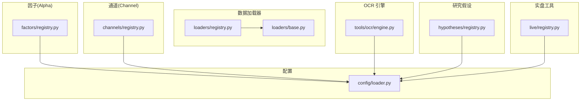
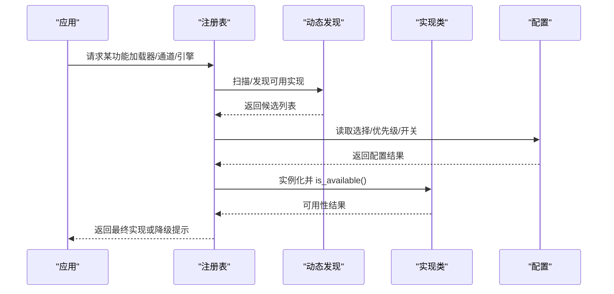
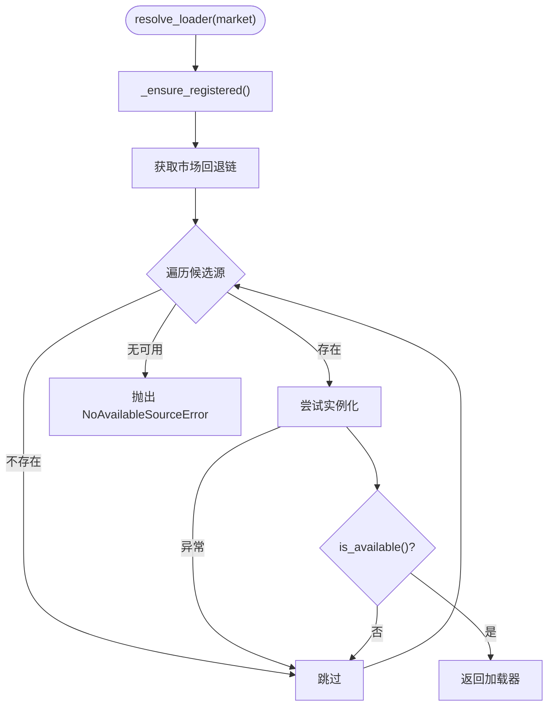
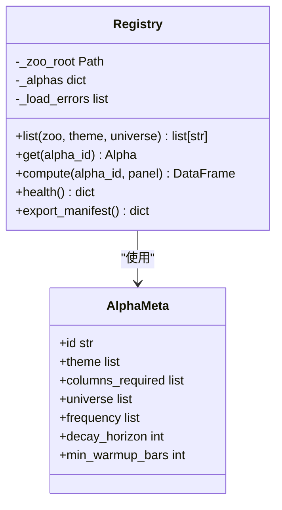
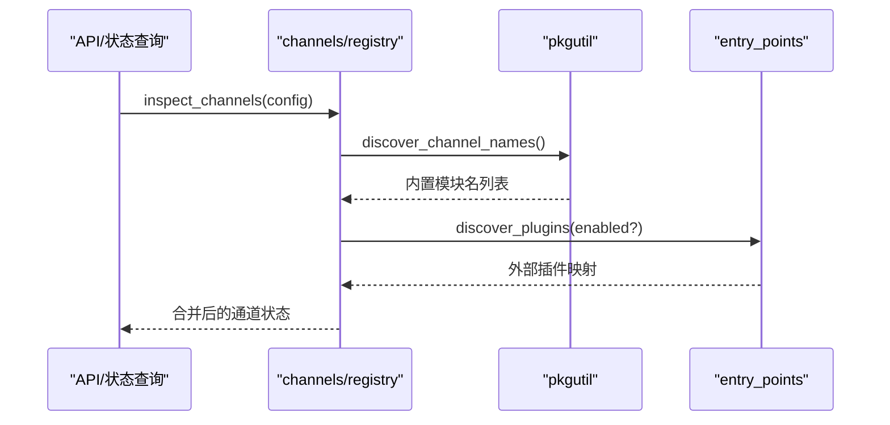
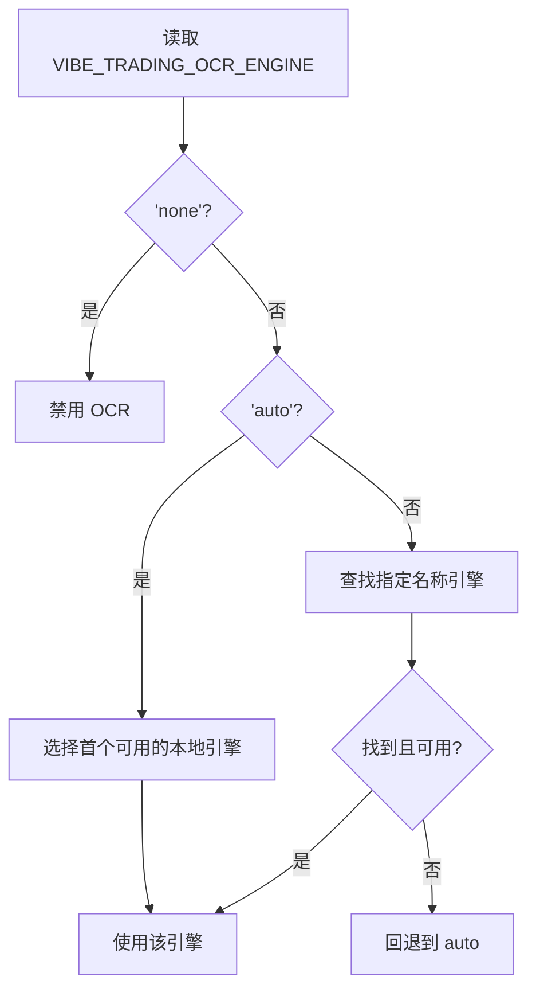
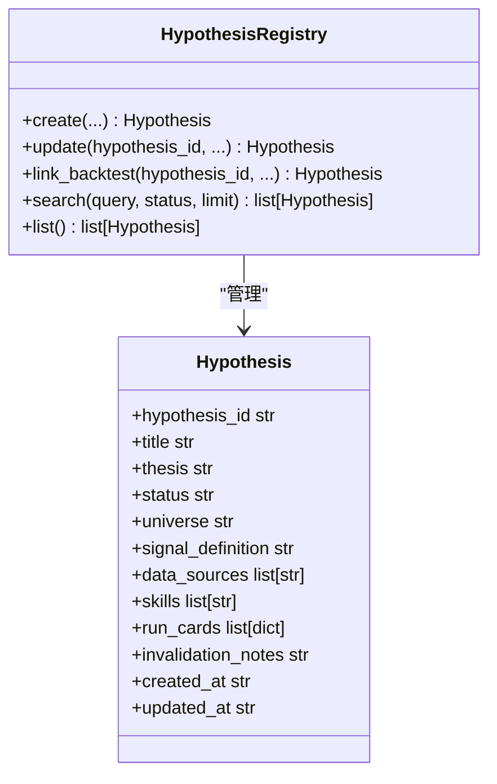
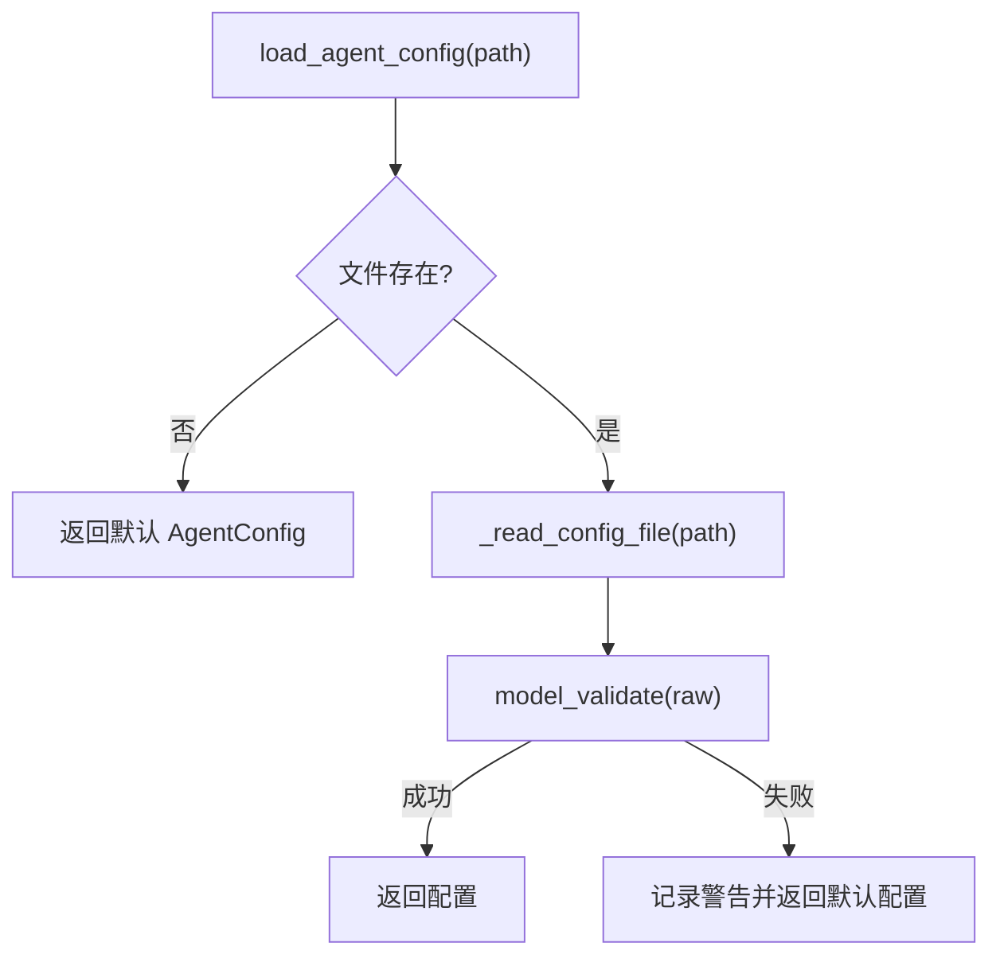
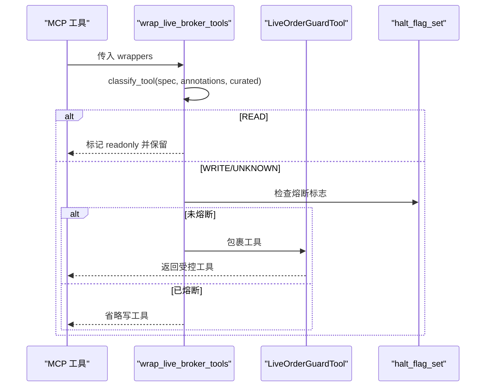
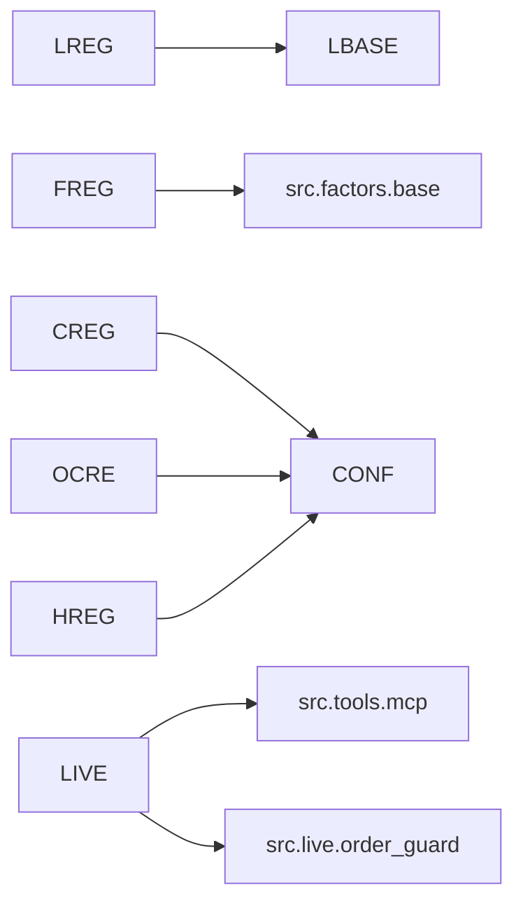

# 注册表系统

<cite>
**本文引用的文件**
- [agent/backtest/loaders/registry.py](file://agent/backtest/loaders/registry.py)
- [agent/backtest/loaders/base.py](file://agent/backtest/loaders/base.py)
- [agent/src/factors/registry.py](file://agent/src/factors/registry.py)
- [agent/src/channels/registry.py](file://agent/src/channels/registry.py)
- [agent/src/live/registry.py](file://agent/src/live/registry.py)
- [agent/src/hypotheses/registry.py](file://agent/src/hypotheses/registry.py)
- [agent/src/tools/ocr/engine.py](file://agent/src/tools/ocr/engine.py)
- [agent/src/config/loader.py](file://agent/src/config/loader.py)
</cite>

## 目录
1. [简介](#简介)
2. [项目结构](#项目结构)
3. [核心组件](#核心组件)
4. [架构总览](#架构总览)
5. [详细组件分析](#详细组件分析)
6. [依赖关系分析](#依赖关系分析)
7. [性能考量](#性能考量)
8. [故障排除指南](#故障排除指南)
9. [结论](#结论)
10. [附录：扩展开发指南](#附录：扩展开发指南)

## 简介
本技术文档聚焦于 Vibe-Trading 的“注册表系统”，围绕数据加载器、因子（Alpha）、通道（Channel）、OCR 引擎、研究假设等子系统的动态发现与注册机制展开。重点解释：
- 模块扫描与类自动注册
- 依赖解析与可用性检查
- 插件加载流程（导入策略、版本/冲突处理）
- 配置管理（选择逻辑、优先级、环境适配）
- 服务发现模式（运行时注册、热重载支持、状态管理）
- 扩展开发指南（自定义加载器注册、命名约定、元数据定义）
- 故障排除（常见注册问题与调试方法）

目标是让插件开发者快速理解并安全地扩展系统能力。

## 项目结构
注册表系统分布在多个子系统中，每个子系统采用统一的“协议 + 注册表 + 动态发现”模式：
- 数据加载器：backtest/loaders/registry.py + base.py
- 因子（Alpha）：src/factors/registry.py
- 通道（Channel）：src/channels/registry.py
- OCR 引擎：src/tools/ocr/engine.py
- 研究假设：src/hypotheses/registry.py
- 配置加载：src/config/loader.py
- 实盘工具包装：src/live/registry.py

**图表来源**
- [agent/backtest/loaders/registry.py:1-256](file://agent/backtest/loaders/registry.py#L1-L256)
- [agent/backtest/loaders/base.py:1-657](file://agent/backtest/loaders/base.py#L1-L657)
- [agent/src/factors/registry.py:1-454](file://agent/src/factors/registry.py#L1-L454)
- [agent/src/channels/registry.py:1-284](file://agent/src/channels/registry.py#L1-L284)
- [agent/src/tools/ocr/engine.py:1-212](file://agent/src/tools/ocr/engine.py#L1-L212)
- [agent/src/hypotheses/registry.py:1-387](file://agent/src/hypotheses/registry.py#L1-L387)
- [agent/src/config/loader.py:1-346](file://agent/src/config/loader.py#L1-L346)

**章节来源**
- [agent/backtest/loaders/registry.py:1-256](file://agent/backtest/loaders/registry.py#L1-L256)
- [agent/src/factors/registry.py:1-454](file://agent/src/factors/registry.py#L1-L454)
- [agent/src/channels/registry.py:1-284](file://agent/src/channels/registry.py#L1-L284)
- [agent/src/tools/ocr/engine.py:1-212](file://agent/src/tools/ocr/engine.py#L1-L212)
- [agent/src/hypotheses/registry.py:1-387](file://agent/src/hypotheses/registry.py#L1-L387)
- [agent/src/config/loader.py:1-346](file://agent/src/config/loader.py#L1-L346)

## 核心组件
- 数据加载器注册表：维护全局映射 source_name -> loader class，提供按市场类型的回退链选择可用加载器。
- 因子注册表：AST 扫描 zoo 目录，静态提取元数据，惰性导入并执行 compute。
- 通道注册表：内置通道通过包扫描发现，外部插件通过 entry_points 发现；支持启用过滤与状态检测。
- OCR 引擎注册表：内置与插件合并，支持 auto/local/cloud 选择与降级提示。
- 研究假设注册表：本地 JSON 持久化，支持创建、更新、链接回测产物、搜索。
- 配置加载器：统一读取 agent.json/yaml，支持运行时覆盖与安全限制。
- 实盘工具包装：对 MCP 工具进行读写分类与门禁封装，保障订单操作安全。

**章节来源**
- [agent/backtest/loaders/registry.py:1-256](file://agent/backtest/loaders/registry.py#L1-L256)
- [agent/src/factors/registry.py:1-454](file://agent/src/factors/registry.py#L1-L454)
- [agent/src/channels/registry.py:1-284](file://agent/src/channels/registry.py#L1-L284)
- [agent/src/tools/ocr/engine.py:1-212](file://agent/src/tools/ocr/engine.py#L1-L212)
- [agent/src/hypotheses/registry.py:1-387](file://agent/src/hypotheses/registry.py#L1-L387)
- [agent/src/config/loader.py:1-346](file://agent/src/config/loader.py#L1-L346)
- [agent/src/live/registry.py:1-229](file://agent/src/live/registry.py#L1-L229)

## 架构总览
各子系统遵循统一模式：
- 协议定义：明确接口（如 DataLoaderProtocol、OcrEngine）。
- 注册表：集中保存已发现的实现类或实例。
- 动态发现：模块扫描、AST 解析、entry_points 发现。
- 可用性检查：is_available()、可选依赖探测、环境变量控制。
- 配置驱动：从配置中选择具体实现或行为。
- 错误与降级：回退链、友好提示、失败隔离。

**图表来源**
- [agent/backtest/loaders/registry.py:614-649](file://agent/backtest/loaders/registry.py#L614-L649)
- [agent/src/channels/registry.py:223-284](file://agent/src/channels/registry.py#L223-L284)
- [agent/src/tools/ocr/engine.py:118-170](file://agent/src/tools/ocr/engine.py#L118-L170)
- [agent/src/config/loader.py:28-151](file://agent/src/config/loader.py#L28-L151)

## 详细组件分析

### 数据加载器注册表（backtest/loaders）
- 动态发现：通过 _ensure_registered() 在首次使用时批量 import 所有已知 loader 模块，触发模块级 @register 装饰器完成自注册。
- 回退链：按市场类型（a_share、us_equity、crypto 等）维护有序候选源，优先轻量公开源，再 key-gated REST，最后 local。
- 可用性检查：构造时捕获异常（如缺少凭据），调用 is_available() 判定是否可用。
- 冲突与不可用：local/qveris/tickerall 被标记为“禁止静默网络回退”，避免用户明确要求本地数据时被替换为网络源。
- 缓存与重试：base.py 提供本地 parquet 缓存、预算与重试辅助函数，提升鲁棒性。

**图表来源**
- [agent/backtest/loaders/registry.py:72-117](file://agent/backtest/loaders/registry.py#L72-L117)
- [agent/backtest/loaders/registry.py:614-649](file://agent/backtest/loaders/registry.py#L614-L649)
- [agent/backtest/loaders/base.py:377-450](file://agent/backtest/loaders/base.py#L377-L450)

**章节来源**
- [agent/backtest/loaders/registry.py:1-256](file://agent/backtest/loaders/registry.py#L1-L256)
- [agent/backtest/loaders/base.py:1-657](file://agent/backtest/loaders/base.py#L1-L657)

### 因子（Alpha）注册表（factors）
- 静态扫描：_scan() 遍历 zoo 子目录，忽略下划线前缀与 __pycache__。
- AST 解析：load_alpha_meta_from_py() 仅解析源码，不导入模块，提取 __alpha_meta__ 并校验 AlphaMeta。
- 惰性计算：Registry.compute() 仅在需要时导入模块并调用 compute(panel)，输出严格校验（形状、NaN/Inf 比例）。
- 健康报告：health() 汇总成功/失败数量及错误详情。
- 进程单例：get_default_registry() 提供线程安全的默认注册表缓存，减少重复扫描开销。

**图表来源**
- [agent/src/factors/registry.py:87-125](file://agent/src/factors/registry.py#L87-L125)
- [agent/src/factors/registry.py:201-261](file://agent/src/factors/registry.py#L201-L261)
- [agent/src/factors/registry.py:321-397](file://agent/src/factors/registry.py#L321-L397)

**章节来源**
- [agent/src/factors/registry.py:1-454](file://agent/src/factors/registry.py#L1-L454)

### 通道（Channel）注册表（channels）
- 内置发现：discover_channel_names() 使用 pkgutil.iter_modules 列出模块名，零导入。
- 外部插件：discover_plugins() 通过 importlib.metadata.entry_points(group="vibe_trading.channels") 发现。
- 启用过滤：discover_enabled() 仅导入启用的通道，避免不必要的第三方 SDK 导入。
- 状态检测：inspect_channels() 返回每个通道的可用、配置、启用、加载、运行状态。
- 冲突解决：内置通道优先，同名外部插件会被忽略并记录警告。

**图表来源**
- [agent/src/channels/registry.py:110-118](file://agent/src/channels/registry.py#L110-L118)
- [agent/src/channels/registry.py:223-284](file://agent/src/channels/registry.py#L223-L284)

**章节来源**
- [agent/src/channels/registry.py:1-284](file://agent/src/channels/registry.py#L1-L284)

### OCR 引擎注册表（tools/ocr）
- 内置与插件合并：_all_engines() 合并 _BUILTIN_ENGINES 与 entry_points 发现的插件，插件可覆盖同名内置。
- 选择策略：VIBE_TRADING_OCR_ENGINE 支持 "auto"/"<name>"|"none"；auto 仅选择本地引擎（is_cloud=False）。
- 降级提示：get_ocr_install_hint() 根据选择与可用情况生成安装建议。
- 别名兼容：旧名称到新的映射，带弃用日志。

**图表来源**
- [agent/src/tools/ocr/engine.py:86-90](file://agent/src/tools/ocr/engine.py#L86-L90)
- [agent/src/tools/ocr/engine.py:118-170](file://agent/src/tools/ocr/engine.py#L118-L170)

**章节来源**
- [agent/src/tools/ocr/engine.py:1-212](file://agent/src/tools/ocr/engine.py#L1-L212)

### 研究假设注册表（hypotheses）
- 本地存储：JSON 文件持久化，路径可通过环境变量覆盖。
- 生命周期：创建、更新、链接回测产物、搜索（文本+状态）。
- 数据模型：Hypothesis 数据类，字段校验与序列化。

**图表来源**
- [agent/src/hypotheses/registry.py:82-143](file://agent/src/hypotheses/registry.py#L82-L143)
- [agent/src/hypotheses/registry.py:145-387](file://agent/src/hypotheses/registry.py#L145-L387)

**章节来源**
- [agent/src/hypotheses/registry.py:1-387](file://agent/src/hypotheses/registry.py#L1-L387)

### 配置管理（config/loader）
- 文件加载：支持 JSON/YAML，缺失或无效时回退到默认配置。
- 运行时覆盖：merge_agent_config_overrides() 验证并合并，MCP 服务器字段特殊处理。
- 安全限制：sanitize_session_overrides() 剥离受限键（mcpServers/mcp_servers），除非显式允许。
- Swarm 配置：load_swarm_agent_config() 按优先级解析 swarm-agent.json 或主配置文件。

**图表来源**
- [agent/src/config/loader.py:28-54](file://agent/src/config/loader.py#L28-L54)
- [agent/src/config/loader.py:57-151](file://agent/src/config/loader.py#L57-L151)
- [agent/src/config/loader.py:137-229](file://agent/src/config/loader.py#L137-L229)

**章节来源**
- [agent/src/config/loader.py:1-346](file://agent/src/config/loader.py#L1-L346)

### 实盘工具包装（live/registry）
- 工具分类：classify_tool() 基于注解、 curated map、默认拒绝未知工具。
- 写操作保护：WRITE/UNKNOWN 工具被 LiveOrderGuardTool 包裹，强制通过授权与熔断检查。
- 注册期熔断：若 broker 处于 halt 状态，写工具直接从注册表中剔除。
- OAuth 检测：should_register_live_channel() 在无交互模式下检查缓存令牌决定是否注册。

**图表来源**
- [agent/src/live/registry.py:184-238](file://agent/src/live/registry.py#L184-L238)
- [agent/src/live/registry.py:157-181](file://agent/src/live/registry.py#L157-L181)

**章节来源**
- [agent/src/live/registry.py:1-229](file://agent/src/live/registry.py#L1-L229)

## 依赖关系分析
- 数据加载器：依赖 backtest.loaders.base 提供的协议与缓存/重试工具；通过 _ensure_registered() 懒加载各 loader 模块。
- 因子注册表：依赖 src.factors.base 的 Alpha 基类；AST 解析避免导入开销；compute 时惰性导入。
- 通道注册表：依赖 src.config.schema 的 ChannelsConfig；通过 pkgutil 与 importlib.metadata 双重发现。
- OCR 引擎：依赖 src.config.accessor 读取配置；通过 entry_points 发现插件。
- 研究假设：依赖 src.config.accessor 获取路径；本地 JSON 存储。
- 配置加载：依赖 pydantic 模型验证；支持 YAML/JSON。
- 实盘工具：依赖 src.tools.mcp.MCPRemoteTool 与 live.order_guard.LiveOrderGuardTool。

**图表来源**
- [agent/backtest/loaders/registry.py:1-256](file://agent/backtest/loaders/registry.py#L1-L256)
- [agent/src/factors/registry.py:1-454](file://agent/src/factors/registry.py#L1-L454)
- [agent/src/channels/registry.py:1-284](file://agent/src/channels/registry.py#L1-L284)
- [agent/src/tools/ocr/engine.py:1-212](file://agent/src/tools/ocr/engine.py#L1-L212)
- [agent/src/hypotheses/registry.py:1-387](file://agent/src/hypotheses/registry.py#L1-L387)
- [agent/src/live/registry.py:1-229](file://agent/src/live/registry.py#L1-L229)

**章节来源**
- [agent/backtest/loaders/registry.py:1-256](file://agent/backtest/loaders/registry.py#L1-L256)
- [agent/src/factors/registry.py:1-454](file://agent/src/factors/registry.py#L1-L454)
- [agent/src/channels/registry.py:1-284](file://agent/src/channels/registry.py#L1-L284)
- [agent/src/tools/ocr/engine.py:1-212](file://agent/src/tools/ocr/engine.py#L1-L212)
- [agent/src/hypotheses/registry.py:1-387](file://agent/src/hypotheses/registry.py#L1-L387)
- [agent/src/live/registry.py:1-229](file://agent/src/live/registry.py#L1-L229)

## 性能考量
- 懒加载与缓存：
  - 数据加载器：_ensure_registered() 仅在首次 resolve_loader/get_loader_cls_with_fallback 时执行，避免启动开销。
  - 因子注册表：get_default_registry() 进程级缓存，避免重复 AST 扫描。
  - OCR 引擎：_discover_plugins() 使用 lru_cache 缓存插件发现结果。
- 选择性导入：
  - 通道：discover_enabled() 仅导入启用的通道，跳过重型第三方 SDK。
  - 因子：compute() 时才导入模块，降低冷启动成本。
- 缓存与重试：
  - 数据加载器：parquet 本地缓存、预算与重试，减少网络抖动影响。
- 资源限制：
  - 因子：YAML/Python 文件大小上限，防止恶意或过大文件导致内存压力。

[本节为通用性能讨论，无需特定文件引用]

## 故障排除指南
- 数据加载器不可用：
  - 现象：NoAvailableSourceError。
  - 排查：检查回退链、网络、API Token；确认 local/qveris/tickerall 未被静默替换。
  - 参考：[agent/backtest/loaders/registry.py:614-649](file://agent/backtest/loaders/registry.py#L614-L649)
- 因子计算失败：
  - 现象：RegistryError（import/compute 失败、输出形状不符、NaN/Inf 过多）。
  - 排查：检查 __alpha_meta__ 元数据、panel 必需列、sector 标签。
  - 参考：[agent/src/factors/registry.py:321-397](file://agent/src/factors/registry.py#L321-L397)
- 通道不可用：
  - 现象：inspect_channels() 显示 available=False，error 与 install_hint。
  - 排查：安装可选依赖、检查环境变量与配置 enabled。
  - 参考：[agent/src/channels/registry.py:130-160](file://agent/src/channels/registry.py#L130-L160)
- OCR 引擎不可用：
  - 现象：get_ocr_engine() 返回 None，get_ocr_install_hint() 给出安装建议。
  - 排查：设置 VIBE_TRADING_OCR_ENGINE，安装对应引擎或配置云模型。
  - 参考：[agent/src/tools/ocr/engine.py:118-205](file://agent/src/tools/ocr/engine.py#L118-L205)
- 配置加载失败：
  - 现象：无法解析 YAML/JSON，回退到默认配置。
  - 排查：检查文件格式、必填字段、运行时覆盖键合法性。
  - 参考：[agent/src/config/loader.py:28-54](file://agent/src/config/loader.py#L28-L54)

**章节来源**
- [agent/backtest/loaders/registry.py:614-649](file://agent/backtest/loaders/registry.py#L614-L649)
- [agent/src/factors/registry.py:321-397](file://agent/src/factors/registry.py#L321-L397)
- [agent/src/channels/registry.py:130-160](file://agent/src/channels/registry.py#L130-L160)
- [agent/src/tools/ocr/engine.py:118-205](file://agent/src/tools/ocr/engine.py#L118-L205)
- [agent/src/config/loader.py:28-54](file://agent/src/config/loader.py#L28-L54)

## 结论
注册表系统通过统一的协议与动态发现机制，实现了可扩展、可配置、高可用的插件生态。各子系统在懒加载、缓存、回退链、安全门禁等方面提供了稳健的实现，便于插件开发者以最小代价接入并扩展系统能力。

[本节为总结，无需特定文件引用]

## 附录：扩展开发指南

### 自定义数据加载器
- 实现协议：继承或满足 DataLoaderProtocol（name、markets、requires_auth、is_available、fetch）。
- 自注册：在模块顶层使用 @register 装饰器将类加入 LOADER_REGISTRY。
- 可用性检查：is_available() 应快速判断凭据/网络/依赖。
- 回退链：如需参与市场回退，确保 markets 集合正确声明。
- 参考路径：
  - [agent/backtest/loaders/base.py:851-887](file://agent/backtest/loaders/base.py#L851-L887)
  - [agent/backtest/loaders/registry.py:111-117](file://agent/backtest/loaders/registry.py#L111-L117)

### 自定义因子（Alpha）
- 元数据：在 zoo/<zoo>/<id>.py 中定义 __alpha_meta__ 字典，符合 AlphaMeta 约束。
- 计算函数：实现 compute(panel) -> DataFrame，保证输出形状与 close 一致，避免 NaN/Inf。
- 命名约定：zoo_id 与 alpha_id_short 需匹配正则 ^[a-z][a-z0-9_]{0,31}$。
- 参考路径：
  - [agent/src/factors/registry.py:87-125](file://agent/src/factors/registry.py#L87-L125)
  - [agent/src/factors/registry.py:147-184](file://agent/src/factors/registry.py#L147-L184)
  - [agent/src/factors/registry.py:219-261](file://agent/src/factors/registry.py#L219-L261)

### 自定义通道（Channel）
- 内置通道：在 src.channels 下新增模块，导出 BaseChannel 子类。
- 外部插件：通过 entry_points(group="vibe_trading.channels") 注册，实现 BaseChannel。
- 可用性：实现 is_available() 并暴露 display_name、install_hint。
- 参考路径：
  - [agent/src/channels/registry.py:87-127](file://agent/src/channels/registry.py#L87-L127)
  - [agent/src/channels/registry.py:223-284](file://agent/src/channels/registry.py#L223-L284)

### 自定义 OCR 引擎
- 插件注册：通过 entry_points(group="vibe_trading.ocr_engines") 暴露引擎类。
- 接口：实现 OcrEngine 协议（name、is_cloud、install_hint、is_available、recognize、confidence）。
- 选择：支持 VIBE_TRADING_OCR_ENGINE 配置 auto/name/none。
- 参考路径：
  - [agent/src/tools/ocr/engine.py:34-57](file://agent/src/tools/ocr/engine.py#L34-L57)
  - [agent/src/tools/ocr/engine.py:64-90](file://agent/src/tools/ocr/engine.py#L64-L90)
  - [agent/src/tools/ocr/engine.py:118-170](file://agent/src/tools/ocr/engine.py#L118-L170)

### 配置与环境适配
- 配置加载：使用 load_agent_config/load_runtime_agent_config，支持 JSON/YAML 与运行时覆盖。
- 安全限制：sanitize_session_overrides() 剥离受限键，除非 ALLOW_SESSION_MCP_SERVERS=1。
- 环境变量：各子系统通过 get_env_config() 读取配置项（如 OCR 引擎选择、数据缓存开关）。
- 参考路径：
  - [agent/src/config/loader.py:28-151](file://agent/src/config/loader.py#L28-L151)
  - [agent/src/config/loader.py:107-134](file://agent/src/config/loader.py#L107-L134)

### 热重载与状态管理
- 热重载支持：
  - 因子注册表：get_default_registry() 提供 reset_default_registry() 用于测试重置。
  - OCR 插件：_reset_plugin_cache() 清除插件发现缓存。
- 状态管理：
  - 通道：inspect_channels() 返回 configured/enabled/loaded/running 状态。
  - 数据加载器：loader_cache_* 系列函数管理本地缓存状态。
- 参考路径：
  - [agent/src/factors/registry.py:460-478](file://agent/src/factors/registry.py#L460-L478)
  - [agent/src/tools/ocr/engine.py:81-83](file://agent/src/tools/ocr/engine.py#L81-L83)
  - [agent/src/channels/registry.py:224-251](file://agent/src/channels/registry.py#L224-L251)
  - [agent/backtest/loaders/base.py:243-441](file://agent/backtest/loaders/base.py#L243-L441)

**章节来源**
- [agent/backtest/loaders/base.py:851-887](file://agent/backtest/loaders/base.py#L851-L887)
- [agent/backtest/loaders/registry.py:111-117](file://agent/backtest/loaders/registry.py#L111-L117)
- [agent/src/factors/registry.py:87-125](file://agent/src/factors/registry.py#L87-L125)
- [agent/src/factors/registry.py:147-184](file://agent/src/factors/registry.py#L147-L184)
- [agent/src/factors/registry.py:219-261](file://agent/src/factors/registry.py#L219-L261)
- [agent/src/channels/registry.py:87-127](file://agent/src/channels/registry.py#L87-L127)
- [agent/src/channels/registry.py:223-284](file://agent/src/channels/registry.py#L223-L284)
- [agent/src/tools/ocr/engine.py:34-57](file://agent/src/tools/ocr/engine.py#L34-L57)
- [agent/src/tools/ocr/engine.py:64-90](file://agent/src/tools/ocr/engine.py#L64-L90)
- [agent/src/tools/ocr/engine.py:118-170](file://agent/src/tools/ocr/engine.py#L118-L170)
- [agent/src/config/loader.py:28-151](file://agent/src/config/loader.py#L28-L151)
- [agent/src/config/loader.py:107-134](file://agent/src/config/loader.py#L107-L134)
- [agent/src/factors/registry.py:460-478](file://agent/src/factors/registry.py#L460-L478)
- [agent/src/tools/ocr/engine.py:81-83](file://agent/src/tools/ocr/engine.py#L81-L83)
- [agent/src/channels/registry.py:224-251](file://agent/src/channels/registry.py#L224-L251)
- [agent/backtest/loaders/base.py:243-441](file://agent/backtest/loaders/base.py#L243-L441)