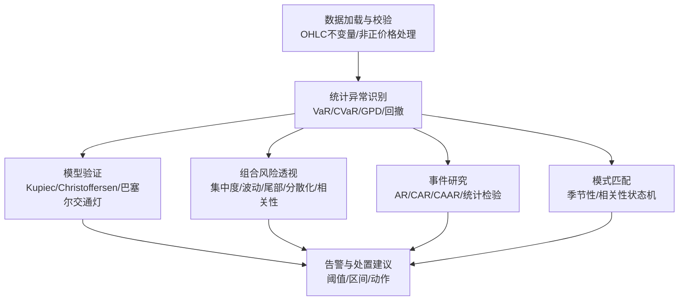
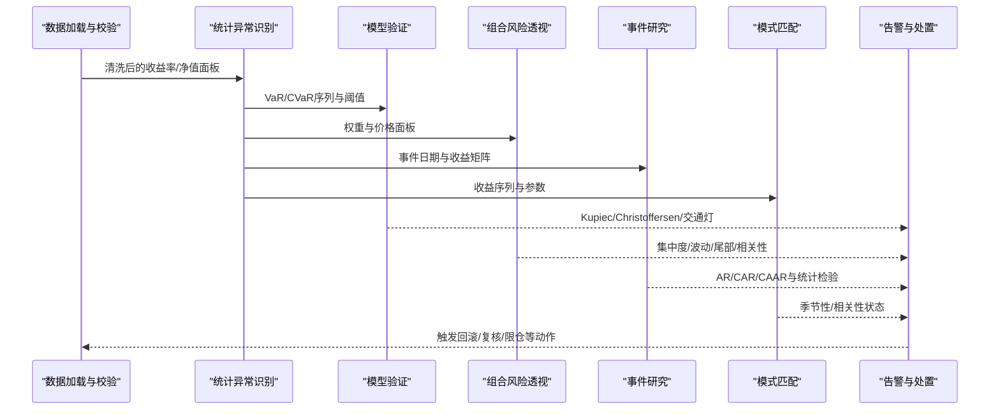
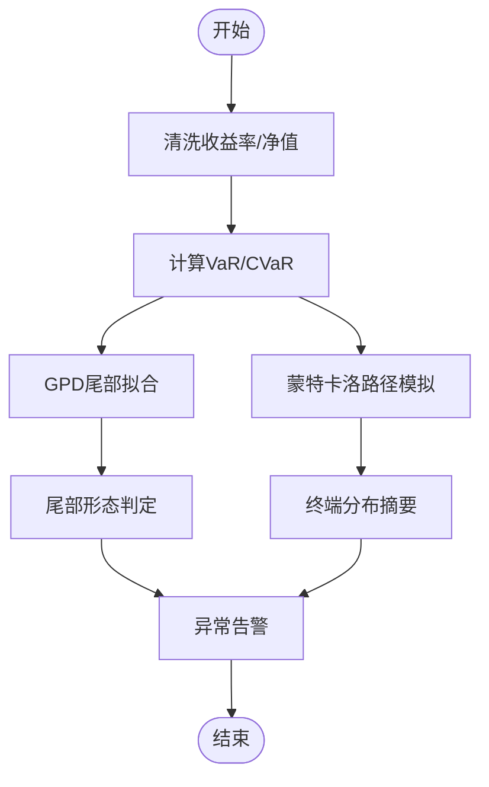
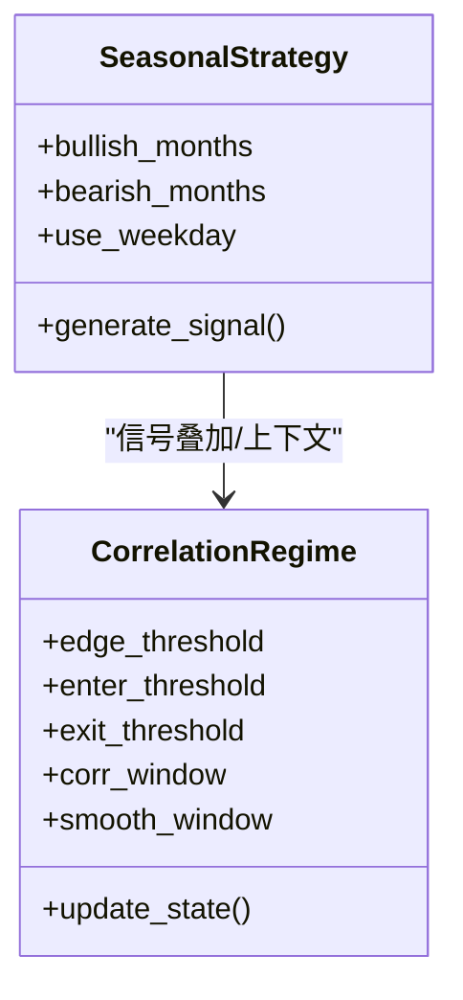
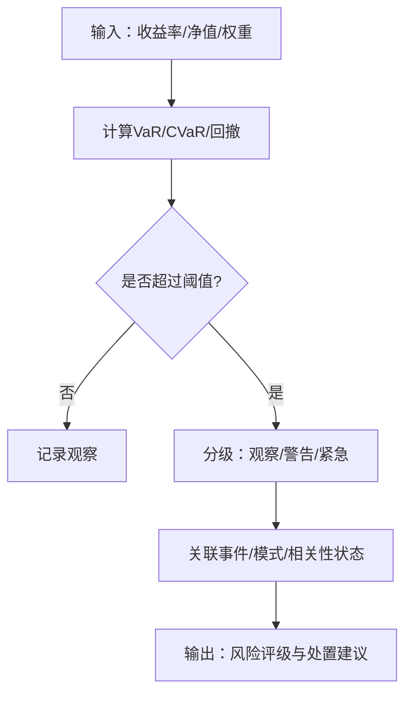
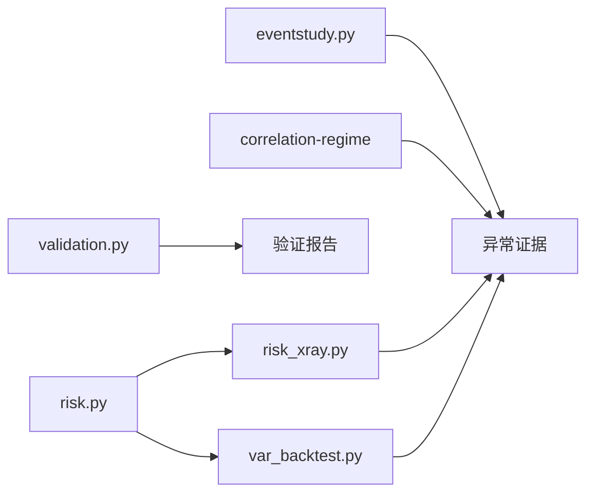

# 异常检测机制

<cite>
**本文引用的文件**
- [risk.py](file://agent/src/quantlib/risk.py)
- [var_backtest.py](file://agent/src/quantlib/var_backtest.py)
- [validation.py](file://agent/backtest/validation.py)
- [risk_xray.py](file://agent/backtest/risk_xray.py)
- [eventstudy.py](file://agent/src/quantlib/eventstudy.py)
- [SKILL.md（季节性）](file://agent/src/skills/seasonal/SKILL.md)
- [SKILL.md（相关性状态）](file://agent/src/skills/correlation-regime/SKILL.md)
- [base.py（OHLC校验）](file://agent/backtest/loaders/base.py)
</cite>

## 目录
1. [简介](#简介)
2. [项目结构](#项目结构)
3. [核心组件](#核心组件)
4. [架构总览](#架构总览)
5. [详细组件分析](#详细组件分析)
6. [依赖关系分析](#依赖关系分析)
7. [性能与稳定性考量](#性能与稳定性考量)
8. [故障排查指南](#故障排查指南)
9. [结论](#结论)
10. [附录：算法实现与调优要点](#附录算法实现与调优要点)

## 简介
本技术文档围绕“异常检测机制”展开，聚焦金融数据中的统计异常识别、模式匹配、机器学习方法、金融特定异常、严重程度评估与处置策略，并结合仓库中已实现的量化风险与回测验证模块给出可落地的工程实践。内容面向数据科学家与风控专家，强调可解释性、稳健性与可审计性。

## 项目结构
本项目在异常检测方面形成了“数据质量—统计度量—模型验证—组合透视—事件研究—模式识别”的闭环：
- 数据质量与输入校验：统一清洗与不变量检查，避免脏数据污染下游指标。
- 统计异常识别：基于历史分布的VaR/CVaR、极值理论（GPD）、最大回撤等。
- 模型验证：对VaR模型的覆盖率、独立性、联合覆盖进行检验，并给出巴塞尔交通灯分区。
- 组合风险透视：集中度、波动率、尾部风险、分散化与相关性。
- 事件研究：以正常收益模型估计异常收益，衡量事件冲击。
- 模式匹配：季节性效应与相关性状态机，用于周期性/结构性异常识别。

图表来源
- [base.py（OHLC校验）:187-208](file://agent/backtest/loaders/base.py#L187-L208)
- [risk.py:146-251](file://agent/src/quantlib/risk.py#L146-L251)
- [var_backtest.py:303-655](file://agent/src/quantlib/var_backtest.py#L303-L655)
- [risk_xray.py:86-176](file://agent/backtest/risk_xray.py#L86-L176)
- [eventstudy.py:298-499](file://agent/src/quantlib/eventstudy.py#L298-L499)
- [SKILL.md（相关性状态）:145-163](file://agent/src/skills/correlation-regime/SKILL.md#L145-L163)

章节来源
- [base.py（OHLC校验）:187-208](file://agent/backtest/loaders/base.py#L187-L208)
- [risk.py:146-251](file://agent/src/quantlib/risk.py#L146-L251)
- [var_backtest.py:303-655](file://agent/src/quantlib/var_backtest.py#L303-L655)
- [risk_xray.py:86-176](file://agent/backtest/risk_xray.py#L86-L176)
- [eventstudy.py:298-499](file://agent/src/quantlib/eventstudy.py#L298-L499)
- [SKILL.md（相关性状态）:145-163](file://agent/src/skills/correlation-regime/SKILL.md#L145-L163)

## 核心组件
- 统计异常识别
  - 离群点检测：通过历史分位数（VaR）与条件期望（CVaR）定位尾部损失；结合GPD拟合极端尾部形态（厚尾/有界/指数）。
  - 分布异常分析：利用蒙特卡洛模拟与极值理论刻画尾部不确定性，辅助阈值设定与压力测试。
  - 趋势异常识别：事件研究框架下，以正常收益模型估计异常收益序列，识别事件窗口内的显著偏离。
- 模式匹配技术
  - 历史模式比对：季节性策略提供月份/星期效应模板，便于对比实际表现与历史规律。
  - 季节性异常检测：将当前收益与历史季节性基准比较，识别偏离。
  - 周期性异常识别：相关性状态机（融合/发散）捕捉市场相关性的结构性变化，作为周期切换信号。
- 机器学习检测方法（在本仓库中的落地方式）
  - 无监督学习异常检测：GPD极值拟合、Bootstrap置信区间、Monte Carlo置换检验等，不依赖标签即可识别尾部与路径异常。
  - 分类器异常识别：可通过事件研究或规则引擎输出异常标签，再训练分类器做在线预警（需外部建模流程）。
  - 集成学习方法：将VaR/CVaR、GPD、事件研究、相关性状态等多源证据集成，形成更稳健的异常判定。
- 金融数据特定异常
  - 价格跳空：事件研究窗口内异常收益突增；结合成交量与波动率突变共同确认。
  - 成交量异常：通过横截面与时间序列的相对放量/缩量识别资金行为异常。
  - 波动率突变：滚动波动率与相关性状态机突破阈值触发。
- 异常严重程度评估
  - 影响分析：最大回撤、VaR/CVaR、尾部概率、事件CAR/CAAR。
  - 风险评级：基于巴塞尔交通灯分区（绿/黄/红）与置信度区间。
  - 告警级别：按阈值与区间划分观察/警告/紧急等级，并绑定处置动作。
- 异常处理策略
  - 自动修复：数据层去噪与重采样、指标回滚到上一有效快照。
  - 人工审核：高风险告警进入审批流，附带证据链（事件日期、异常收益、尾部指标）。
  - 数据回滚：当发现系统性数据错误时，回退至校验通过的快照并重新计算。

章节来源
- [risk.py:146-251](file://agent/src/quantlib/risk.py#L146-L251)
- [risk.py:621-702](file://agent/src/quantlib/risk.py#L621-L702)
- [eventstudy.py:298-499](file://agent/src/quantlib/eventstudy.py#L298-L499)
- [SKILL.md（季节性）:1-65](file://agent/src/skills/seasonal/SKILL.md#L1-L65)
- [SKILL.md（相关性状态）:145-163](file://agent/src/skills/correlation-regime/SKILL.md#L145-L163)
- [var_backtest.py:303-655](file://agent/src/quantlib/var_backtest.py#L303-L655)

## 架构总览
异常检测流水线由“输入校验—统计度量—模型验证—组合透视—事件研究—模式识别—告警与处置”构成。各阶段均具备严格的输入约束与输出契约，确保结果可序列化、可审计、可复现。

图表来源
- [risk.py:146-251](file://agent/src/quantlib/risk.py#L146-L251)
- [var_backtest.py:303-655](file://agent/src/quantlib/var_backtest.py#L303-L655)
- [risk_xray.py:86-176](file://agent/backtest/risk_xray.py#L86-L176)
- [eventstudy.py:298-499](file://agent/src/quantlib/eventstudy.py#L298-L499)
- [SKILL.md（相关性状态）:145-163](file://agent/src/skills/correlation-regime/SKILL.md#L145-L163)

## 详细组件分析

### 统计异常识别（离群点、分布异常、趋势异常）
- 离群点检测
  - 使用历史分位数（VaR）与条件期望（CVaR）定位尾部损失，支持持有期缩放。
  - 通过GPD拟合极端尾部，判断厚尾/有界/指数形态，辅助阈值设定。
- 分布异常分析
  - 蒙特卡洛几何布朗运动生成路径，汇总终端分布的VaR/CVaR与亏损概率。
  - Bootstrap Sharpe置信区间评估风险调整后收益的稳定性。
- 趋势异常识别
  - 事件研究：估计正常收益模型，计算异常收益（AR）、累计异常收益（CAR）与平均累计异常收益（CAAR），并提供t/Patell/BMP三种统计检验。

图表来源
- [risk.py:146-251](file://agent/src/quantlib/risk.py#L146-L251)
- [risk.py:520-618](file://agent/src/quantlib/risk.py#L520-L618)
- [risk.py:621-702](file://agent/src/quantlib/risk.py#L621-L702)

章节来源
- [risk.py:146-251](file://agent/src/quantlib/risk.py#L146-L251)
- [risk.py:520-618](file://agent/src/quantlib/risk.py#L520-L618)
- [risk.py:621-702](file://agent/src/quantlib/risk.py#L621-L702)

### 模式匹配（历史模式比对、季节性、周期性）
- 历史模式比对
  - 季节性策略提供月份/星期效应模板，便于与实际收益对比，识别偏离。
- 季节性异常检测
  - 将当前收益与历史季节性基准比较，若显著偏离则标记异常。
- 周期性异常识别
  - 相关性状态机（融合/发散）通过边密度与迟滞门限识别市场相关性结构的切换，作为周期性异常信号。

图表来源
- [SKILL.md（季节性）:1-65](file://agent/src/skills/seasonal/SKILL.md#L1-L65)
- [SKILL.md（相关性状态）:145-163](file://agent/src/skills/correlation-regime/SKILL.md#L145-L163)

章节来源
- [SKILL.md（季节性）:1-65](file://agent/src/skills/seasonal/SKILL.md#L1-L65)
- [SKILL.md（相关性状态）:145-163](file://agent/src/skills/correlation-regime/SKILL.md#L145-L163)

### 机器学习检测方法（无监督、分类器、集成）
- 无监督学习异常检测
  - 使用GPD、Bootstrap、Monte Carlo置换检验等方法，无需标签即可识别尾部与路径异常。
- 分类器异常识别
  - 可将事件研究与统计异常结果作为特征，训练分类器进行在线预警（需外部建模流程）。
- 集成学习方法
  - 将VaR/CVaR、GPD、事件研究、相关性状态等多源证据集成，提升鲁棒性。

章节来源
- [risk.py:621-702](file://agent/src/quantlib/risk.py#L621-L702)
- [validation.py:29-113](file://agent/backtest/validation.py#L29-L113)
- [validation.py:142-203](file://agent/backtest/validation.py#L142-L203)

### 金融数据特定异常（价格跳空、成交量异常、波动率突变）
- 价格跳空：事件研究窗口内异常收益突增，配合成交量与波动率突变确认。
- 成交量异常：横截面与时间序列的相对放量/缩量识别资金行为异常。
- 波动率突变：滚动波动率与相关性状态机突破阈值触发。

章节来源
- [eventstudy.py:298-499](file://agent/src/quantlib/eventstudy.py#L298-L499)
- [risk_xray.py:190-287](file://agent/backtest/risk_xray.py#L190-L287)
- [SKILL.md（相关性状态）:145-163](file://agent/src/skills/correlation-regime/SKILL.md#L145-L163)

### 异常严重程度评估（影响分析、风险评级、告警级别）
- 影响分析：最大回撤、VaR/CVaR、尾部概率、事件CAR/CAAR。
- 风险评级：基于巴塞尔交通灯分区（绿/黄/红）与置信度区间。
- 告警级别：按阈值与区间划分观察/警告/紧急等级，并绑定处置动作。

图表来源
- [risk.py:441-517](file://agent/src/quantlib/risk.py#L441-L517)
- [var_backtest.py:527-600](file://agent/src/quantlib/var_backtest.py#L527-L600)
- [risk_xray.py:86-176](file://agent/backtest/risk_xray.py#L86-L176)

章节来源
- [risk.py:441-517](file://agent/src/quantlib/risk.py#L441-L517)
- [var_backtest.py:527-600](file://agent/src/quantlib/var_backtest.py#L527-L600)
- [risk_xray.py:86-176](file://agent/backtest/risk_xray.py#L86-L176)

### 异常处理策略（自动修复、人工审核、数据回滚）
- 自动修复：数据层去噪与重采样、指标回滚到上一有效快照。
- 人工审核：高风险告警进入审批流，附带证据链（事件日期、异常收益、尾部指标）。
- 数据回滚：当发现系统性数据错误时，回退至校验通过的快照并重新计算。

章节来源
- [base.py（OHLC校验）:187-208](file://agent/backtest/loaders/base.py#L187-L208)
- [risk_xray.py:340-387](file://agent/backtest/risk_xray.py#L340-L387)
- [validation.py:453-505](file://agent/backtest/validation.py#L453-L505)

## 依赖关系分析
- 组件耦合与内聚
  - risk.py提供基础风险度量，被var_backtest.py与risk_xray.py复用。
  - validation.py提供回测结果的统计验证，独立于具体策略。
  - eventstudy.py提供事件驱动的异常收益度量，可与风险度量联动。
  - correlation-regime技能提供周期性异常识别，作为上下文增强。
- 直接/间接依赖
  - risk.py依赖numpy/pandas/scipy；var_backtest.py依赖risk.py与scipy统计检验；risk_xray.py依赖pandas/numpy；eventstudy.py依赖scipy统计检验。
- 外部依赖与集成点
  - 数据加载与校验在loader边界集中完成，保证下游指标稳定。
  - 组合风险透视与事件研究可作为上游输入，驱动告警与处置。

图表来源
- [risk.py:146-251](file://agent/src/quantlib/risk.py#L146-L251)
- [var_backtest.py:303-655](file://agent/src/quantlib/var_backtest.py#L303-L655)
- [risk_xray.py:86-176](file://agent/backtest/risk_xray.py#L86-L176)
- [eventstudy.py:298-499](file://agent/src/quantlib/eventstudy.py#L298-L499)
- [SKILL.md（相关性状态）:145-163](file://agent/src/skills/correlation-regime/SKILL.md#L145-L163)

章节来源
- [risk.py:146-251](file://agent/src/quantlib/risk.py#L146-L251)
- [var_backtest.py:303-655](file://agent/src/quantlib/var_backtest.py#L303-L655)
- [risk_xray.py:86-176](file://agent/backtest/risk_xray.py#L86-L176)
- [eventstudy.py:298-499](file://agent/src/quantlib/eventstudy.py#L298-L499)
- [SKILL.md（相关性状态）:145-163](file://agent/src/skills/correlation-regime/SKILL.md#L145-L163)

## 性能与稳定性考量
- 数值稳定性
  - 所有风险度量返回有限浮点数，JSON序列化安全；非有限值转为null。
  - 严格输入校验（置信度范围、持有期、样本量）避免退化情形。
- 计算效率
  - 向量化计算（NumPy/Pandas）减少循环开销；蒙特卡洛路径数与采样步数可调。
  - 滚动窗口与平滑窗口需权衡反应速度与噪声抑制。
- 可复现性
  - 随机种子可控；Bootstrap与Monte Carlo支持固定种子。
  - 事件研究严格隔离估计窗口与事件窗口，避免前视偏差。

章节来源
- [risk.py:520-618](file://agent/src/quantlib/risk.py#L520-L618)
- [risk.py:621-702](file://agent/src/quantlib/risk.py#L621-L702)
- [validation.py:29-113](file://agent/backtest/validation.py#L29-L113)
- [validation.py:142-203](file://agent/backtest/validation.py#L142-L203)
- [eventstudy.py:298-499](file://agent/src/quantlib/eventstudy.py#L298-L499)

## 故障排查指南
- 常见错误与修复
  - 输入为空或非有限：检查数据加载与清洗逻辑，确保至少存在有限观测。
  - 置信度/持有期非法：调整参数至合法范围。
  - 事件窗口越界或估计窗口不足：扩展历史长度或调整窗口大小。
  - 相关性状态机中心平滑导致前视偏差：改用滞后平滑，确保因果性。
- 诊断步骤
  - 先校验输入（收益率/净值/权重/事件日期）。
  - 逐步运行统计度量与模型验证，定位失败环节。
  - 查看巴塞尔交通灯分区与置信区间，评估模型可靠性。
  - 结合事件研究与相关性状态，交叉验证异常来源。

章节来源
- [risk.py:76-143](file://agent/src/quantlib/risk.py#L76-L143)
- [var_backtest.py:236-327](file://agent/src/quantlib/var_backtest.py#L236-L327)
- [eventstudy.py:298-499](file://agent/src/quantlib/eventstudy.py#L298-L499)
- [SKILL.md（相关性状态）:154-163](file://agent/src/skills/correlation-regime/SKILL.md#L154-L163)

## 结论
本异常检测机制以统计度量为核心，结合模型验证、组合透视、事件研究与模式匹配，形成从数据到决策的完整闭环。通过严格的输入校验、稳健的尾部建模与可审计的输出，为数据科学家与风控专家提供了实用且可落地的工具集。建议在实盘中采用多源证据集成与分层告警，确保异常处理的及时性与准确性。

## 附录：算法实现与调优要点
- 离群点检测
  - 使用历史分位数（VaR）与条件期望（CVaR）定位尾部损失；持有期缩放遵循平方根法则。
  - GPD极值拟合用于尾部形态判定，阈值选择需平衡样本量与稳定性。
- 分布异常分析
  - 蒙特卡洛几何布朗运动生成路径，汇总终端分布的VaR/CVaR与亏损概率。
  - Bootstrap Sharpe置信区间评估风险调整后收益的稳定性。
- 趋势异常识别
  - 事件研究：估计正常收益模型，计算异常收益序列与累计异常收益，提供多种统计检验。
- 模式匹配
  - 季节性策略：月份/星期效应模板，便于与实际收益对比。
  - 相关性状态机：边密度与迟滞门限识别市场相关性结构切换。
- 集成与调优
  - 多源证据集成：VaR/CVaR、GPD、事件研究、相关性状态。
  - 阈值与区间：基于历史分布与置信区间设定，避免主观臆断。
  - 前视偏差防护：严格隔离估计窗口与事件窗口，使用滞后平滑。

章节来源
- [risk.py:146-251](file://agent/src/quantlib/risk.py#L146-L251)
- [risk.py:520-618](file://agent/src/quantlib/risk.py#L520-L618)
- [risk.py:621-702](file://agent/src/quantlib/risk.py#L621-L702)
- [eventstudy.py:298-499](file://agent/src/quantlib/eventstudy.py#L298-L499)
- [SKILL.md（季节性）:1-65](file://agent/src/skills/seasonal/SKILL.md#L1-L65)
- [SKILL.md（相关性状态）:145-163](file://agent/src/skills/correlation-regime/SKILL.md#L145-L163)