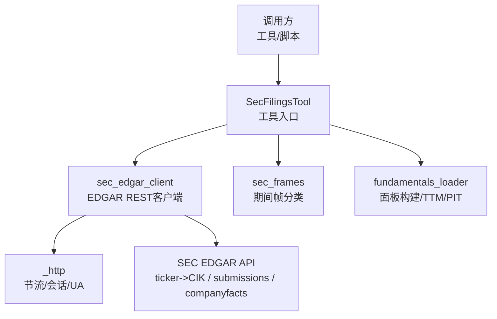
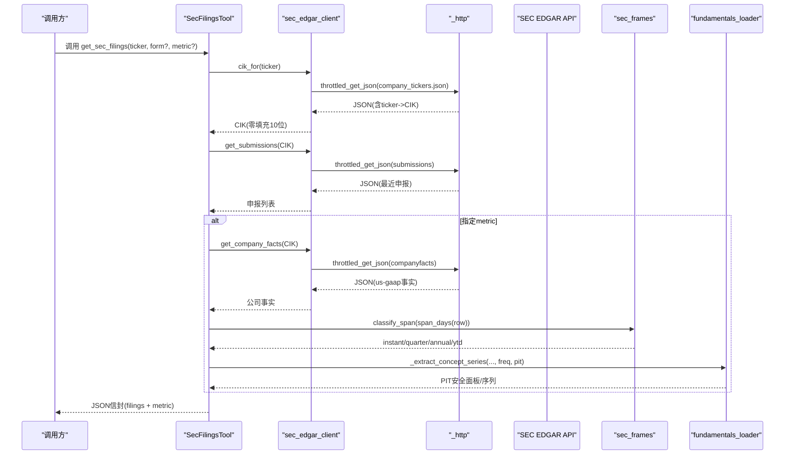
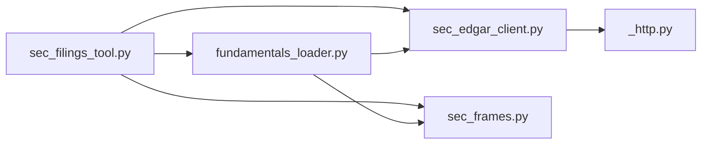

# SEC文件解析验证

<cite>
**本文引用的文件**
- [sec_edgar_client.py](file://agent/backtest/loaders/sec_edgar_client.py)
- [sec_frames.py](file://agent/backtest/loaders/sec_frames.py)
- [sec_filings_tool.py](file://agent/src/tools/sec_filings_tool.py)
- [fundamentals_loader.py](file://agent/backtest/loaders/fundamentals_loader.py)
- [_http.py](file://agent/backtest/loaders/_http.py)
- [endpoints_and_limits.md](file://agent/src/skills/sec-edgar/references/endpoints_and_limits.md)
- [SKILL.md](file://agent/src/skills/sec-edgar/SKILL.md)
- [sec_filings_example.py](file://agent/src/skills/sec-edgar/scripts/sec_filings_example.py)
- [test_sec_period_frames.py](file://agent/tests/test_sec_period_frames.py)
</cite>

## 目录
1. [简介](#简介)
2. [项目结构](#项目结构)
3. [核心组件](#核心组件)
4. [架构总览](#架构总览)
5. [详细组件分析](#详细组件分析)
6. [依赖关系分析](#依赖关系分析)
7. [性能考虑](#性能考虑)
8. [故障排查指南](#故障排查指南)
9. [结论](#结论)
10. [附录](#附录)

## 简介
本技术文档面向金融数据工程师与合规分析师，系统化说明本项目中SEC EDGAR数据的获取、XBRL概念提取、期间匹配、数据标准化、错误处理与性能优化等关键环节。重点覆盖：
- SEC EDGAR API集成：请求构造、响应处理、速率限制与UA策略
- XBRL公司事实（companyfacts）解析：概念搜索、单位选择、期间匹配与去重
- 数据标准化流程：单位/币种对齐、会计期间对齐、TTM近似
- 错误处理策略：缺失概念、格式异常、数据质量标记
- 性能优化：进程内缓存、连接复用、节流与抖动、内存控制
- 实际解析流程与结果示例：从Ticker到CIK、最近申报、指标序列

## 项目结构
围绕SEC EDGAR的数据链路主要由以下模块构成：
- 传输层：HTTP节流、会话复用、UA注入
- 客户端层：Ticker→CIK映射、提交索引（submissions）、公司事实（companyfacts）
- 工具层：统一工具接口，封装 filings 列表与单一 us-gaap 指标序列
- 框架层：期间帧分类、季度/年度/T TM 对齐、PIT安全填充
- 示例与测试：端到端脚本与回归用例

**图表来源**
- [sec_filings_tool.py:102-173](file://agent/src/tools/sec_filings_tool.py#L102-L173)
- [sec_edgar_client.py:78-115](file://agent/backtest/loaders/sec_edgar_client.py#L78-L115)
- [_http.py:141-200](file://agent/backtest/loaders/_http.py#L141-L200)
- [sec_frames.py:42-129](file://agent/backtest/loaders/sec_frames.py#L42-L129)
- [fundamentals_loader.py:48-132](file://agent/backtest/loaders/fundamentals_loader.py#L48-L132)

**章节来源**
- [sec_edgar_client.py:1-235](file://agent/backtest/loaders/sec_edgar_client.py#L1-L235)
- [sec_filings_tool.py:1-401](file://agent/src/tools/sec_filings_tool.py#L1-L401)
- [sec_frames.py:1-129](file://agent/backtest/loaders/sec_frames.py#L1-L129)
- [fundamentals_loader.py:1-501](file://agent/backtest/loaders/fundamentals_loader.py#L1-L501)
- [_http.py:1-201](file://agent/backtest/loaders/_http.py#L1-L201)

## 核心组件
- SEC EDGAR REST客户端：负责Ticker到CIK的映射、最近申报索引拉取、公司事实拉取；内置进程级Ticker表缓存与线程安全访问；所有请求经共享节流器并附带合规User-Agent。
- SEC工具：对外暴露统一的JSON信封，支持按表单过滤的最近申报列表，以及单个us-gaap概念的时序点集；内置分页、限流与错误信封。
- 期间帧选择：基于(start, end)跨度将事实行分类为瞬时、季度、年度或年初至今（YTD），避免同期末不同口径混用。
- 基本面加载器：将稀疏XBRL事实转换为PIT安全的日频面板，支持annual/quarterly/ttm频率，提供TTM滚动近似与季度合成逻辑。
- HTTP基础设施：进程内HostThrottle实现每主机最小间隔+抖动，单进程会话复用，降低TCP/TLS开销。

**章节来源**
- [sec_edgar_client.py:58-115](file://agent/backtest/loaders/sec_edgar_client.py#L58-L115)
- [sec_filings_tool.py:43-173](file://agent/src/tools/sec_filings_tool.py#L43-L173)
- [sec_frames.py:29-129](file://agent/backtest/loaders/sec_frames.py#L29-L129)
- [fundamentals_loader.py:48-132](file://agent/backtest/loaders/fundamentals_loader.py#L48-L132)
- [_http.py:46-107](file://agent/backtest/loaders/_http.py#L46-L107)

## 架构总览
下图展示从工具调用到EDGAR返回、再到数据标准化的完整调用链。

**图表来源**
- [sec_filings_tool.py:102-173](file://agent/src/tools/sec_filings_tool.py#L102-L173)
- [sec_edgar_client.py:166-227](file://agent/backtest/loaders/sec_edgar_client.py#L166-L227)
- [_http.py:176-200](file://agent/backtest/loaders/_http.py#L176-L200)
- [sec_frames.py:42-129](file://agent/backtest/loaders/sec_frames.py#L42-L129)
- [fundamentals_loader.py:48-132](file://agent/backtest/loaders/fundamentals_loader.py#L48-L132)

## 详细组件分析

### SEC EDGAR REST客户端
职责：
- Ticker→CIK映射：一次性拉取并缓存全量ticker表，支持带市场后缀（如.US）与连字符变体
- 提交索引：按CIK拉取最近申报，包含表单类型、 accession、日期与主文档名
- 公司事实：按CIK拉取全部us-gaap概念的事实点集
- 速率限制与UA：通过共享节流器与合规UA，遵守SEC公平访问策略

关键点：
- CIK规范化：内部统一为0填充10位字符串，URL拼接时去除前导零
- 进程级缓存：ticker表使用全局字典+锁，避免重复网络请求
- 环境配置：可通过环境变量覆盖UA与最小请求间隔

**章节来源**
- [sec_edgar_client.py:58-115](file://agent/backtest/loaders/sec_edgar_client.py#L58-L115)
- [sec_edgar_client.py:118-195](file://agent/backtest/loaders/sec_edgar_client.py#L118-L195)
- [sec_edgar_client.py:198-227](file://agent/backtest/loaders/sec_edgar_client.py#L198-L227)
- [endpoints_and_limits.md:21-41](file://agent/src/skills/sec-edgar/references/endpoints_and_limits.md#L21-L41)

### SEC工具（get_sec_filings）
职责：
- 参数校验与限幅：限制limit范围，offset安全转换
- 申报列表解析：从submissions中提取最近申报，支持form过滤，生成主文档URL
- 指标序列解析：当指定metric时，从companyfacts中抽取单一us-gaap概念的时间序列
- 分页与信封：统一JSON信封，包含ok/market/source/paging/data

期间匹配与去重：
- 以(start, end)作为周期唯一键，避免YTD与季度在同一期末冲突
- 同一周期多版本按filed去重，保留最新修订

单位选择：
- 选择拥有最多事实行的单位桶（通常为USD）

**章节来源**
- [sec_filings_tool.py:102-173](file://agent/src/tools/sec_filings_tool.py#L102-L173)
- [sec_filings_tool.py:185-235](file://agent/src/tools/sec_filings_tool.py#L185-L235)
- [sec_filings_tool.py:267-337](file://agent/src/tools/sec_filings_tool.py#L267-L337)
- [sec_filings_tool.py:340-395](file://agent/src/tools/sec_filings_tool.py#L340-L395)

### 期间帧选择（sec_frames）
职责：
- 计算持续期天数：根据start/end计算跨度，无start则为瞬时事实
- 分类：instant/quarter/annual/ytd，阈值宽松以容纳4-4-5日历与52/53周年
- 匹配：按period="annual"/"quarter"筛选对应帧，YTD从不匹配报告期

重要性：
- 解决“同一期末既有季度又有YTD”的冲突问题，确保时间维度正确性
- 为TTM与季度合成提供基础

**章节来源**
- [sec_frames.py:29-129](file://agent/backtest/loaders/sec_frames.py#L29-L129)
- [test_sec_period_frames.py:1-41](file://agent/tests/test_sec_period_frames.py#L1-L41)

### 基本面加载器（PIT安全面板）
职责：
- 稀疏事实转密集面板：按symbol×field构建日频面板
- 频率支持：annual/quarterly/ttm
- 季度合成：若Q4缺失，利用10-K全年与前三季合成
- PIT安全：以filed为锚点向前填充，避免未来信息泄露
- 字段派生：通过schema解析依赖并计算派生字段

数据质量：
- 对缺失概念与空结果记录警告日志，不中断整体面板构建
- 对非美国标的给出明确错误提示

**章节来源**
- [fundamentals_loader.py:1-11](file://agent/backtest/loaders/fundamentals_loader.py#L1-L11)
- [fundamentals_loader.py:48-132](file://agent/backtest/loaders/fundamentals_loader.py#L48-L132)
- [fundamentals_loader.py:135-167](file://agent/backtest/loaders/fundamentals_loader.py#L135-L167)
- [fundamentals_loader.py:170-194](file://agent/backtest/loaders/fundamentals_loader.py#L170-L194)
- [fundamentals_loader.py:196-277](file://agent/backtest/loaders/fundamentals_loader.py#L196-L277)
- [fundamentals_loader.py:448-521](file://agent/backtest/loaders/fundamentals_loader.py#L448-L521)

### HTTP基础设施（节流与会话复用）
职责：
- HostThrottle：按host_key维护最小请求间隔，加入随机抖动避免同步突发
- 会话复用：每个host_key一个requests.Session，减少握手成本
- 统一超时与UA：默认浏览器UA，可被上层覆盖

SEC适配：
- 通过环境变量设置最小间隔，保证不低于0.12秒
- 强制合规UA，避免被SEC临时封禁

**章节来源**
- [_http.py:46-107](file://agent/backtest/loaders/_http.py#L46-L107)
- [_http.py:118-124](file://agent/backtest/loaders/_http.py#L118-L124)
- [_http.py:141-200](file://agent/backtest/loaders/_http.py#L141-L200)
- [endpoints_and_limits.md:27-41](file://agent/src/skills/sec-edgar/references/endpoints_and_limits.md#L27-L41)

## 依赖关系分析

**图表来源**
- [sec_filings_tool.py:25-31](file://agent/src/tools/sec_filings_tool.py#L25-L31)
- [sec_edgar_client.py:31-35](file://agent/backtest/loaders/sec_edgar_client.py#L31-L35)
- [fundamentals_loader.py:22-24](file://agent/backtest/loaders/fundamentals_loader.py#L22-L24)

**章节来源**
- [sec_filings_tool.py:25-31](file://agent/src/tools/sec_filings_tool.py#L25-L31)
- [sec_edgar_client.py:31-35](file://agent/backtest/loaders/sec_edgar_client.py#L31-L35)
- [fundamentals_loader.py:22-24](file://agent/backtest/loaders/fundamentals_loader.py#L22-L24)

## 性能考虑
- 进程级Ticker表缓存：避免重复下载全量ticker映射
- 连接池复用：按host_key复用requests.Session，降低TCP/TLS开销
- 节流与抖动：按host_key最小间隔+随机抖动，避免并发同步突发
- 结果裁剪：工具层限制limit，防止大报文阻塞
- 去重与排序：按(start, end)去重并按end/start排序，减少冗余
- PIT填充：仅对目标索引进行ffill，避免不必要的全量计算

[本节为通用性能建议，不直接引用具体代码]

## 故障排查指南
常见问题与定位：
- Ticker未找到：检查是否为美国股票，确认大小写与后缀（如.US）
- 请求被封禁：确认已发送合规UA且未绕过节流器
- 期间混淆：确认使用(sec_frames)按(start, end)区分季度/YTD/年度
- 概念缺失：检查concept名称是否准确，或该标的是否披露该概念
- 数值异常：检查val是否可转为浮点数，空值将被丢弃

错误处理要点：
- 工具层统一错误信封：{"ok": false, "error": "..."}
- 网络异常：throttled_get_json在非2xx或无法解码时抛出异常，由调用方捕获并包装
- 缺失数据：记录警告日志，继续处理其他字段/标的，不中断整体流程

**章节来源**
- [sec_filings_tool.py:398-401](file://agent/src/tools/sec_filings_tool.py#L398-L401)
- [_http.py:176-200](file://agent/backtest/loaders/_http.py#L176-L200)
- [fundamentals_loader.py:498-521](file://agent/backtest/loaders/fundamentals_loader.py#L498-L521)

## 结论
本项目在SEC EDGAR数据接入方面提供了稳健、可审计且高性能的实现：
- 通过严格期间帧分类与PIT安全填充，确保财务指标在时间与发布维度上的准确性
- 借助进程级缓存、连接复用与节流机制，满足SEC公平访问要求并提升吞吐
- 工具化封装简化了复杂XBRL结构的消费，便于上层研究与应用快速集成

[本节为总结性内容，不直接引用具体代码]

## 附录

### SEC EDGAR API集成示例
- 端到端脚本：演示如何解析Ticker→CIK、列出最近10-K、拉取Revenues序列
- 运行方式：在项目根目录下执行脚本，输出CIK、最近申报与指标点

**章节来源**
- [sec_filings_example.py:1-162](file://agent/src/skills/sec-edgar/scripts/sec_filings_example.py#L1-L162)

### 实际解析流程与验证结果示例
- 流程：工具接收参数→解析Ticker→获取CIK→拉取submissions→可选拉取companyfacts→期间分类→去重排序→返回JSON
- 验证：回归测试覆盖期间帧选择，确保季度/YTD不会误用

**章节来源**
- [sec_filings_tool.py:102-173](file://agent/src/tools/sec_filings_tool.py#L102-L173)
- [test_sec_period_frames.py:1-41](file://agent/tests/test_sec_period_frames.py#L1-L41)

### 数据标准化流程（单位/币种/期间对齐）
- 单位选择：优先选择行数最多的单位桶（通常USD）
- 币种处理：公司事实中的单位即币种；如需跨币种换算，应在上游汇率表中按结算日匹配
- 期间对齐：使用(sec_frames)将事实归类为instant/quarter/annual/ytd，再按freq与pit策略聚合

**章节来源**
- [sec_filings_tool.py:323-337](file://agent/src/tools/sec_filings_tool.py#L323-L337)
- [sec_frames.py:42-129](file://agent/backtest/loaders/sec_frames.py#L42-L129)
- [fundamentals_loader.py:112-132](file://agent/backtest/loaders/fundamentals_loader.py#L112-L132)

### 错误处理策略（缺失概念/格式异常/数据质量标记）
- 缺失概念：记录警告并跳过，保持面板完整性
- 格式异常：值不可转数字则丢弃；日期不可解析则跳过
- 数据质量：输出中包含period_type、period_days、filed等元信息，便于下游质量评估

**章节来源**
- [sec_filings_tool.py:340-395](file://agent/src/tools/sec_filings_tool.py#L340-L395)
- [fundamentals_loader.py:498-521](file://agent/backtest/loaders/fundamentals_loader.py#L498-L521)

### 性能优化技术（并行/缓存/内存管理）
- 缓存：Ticker表进程级缓存；加载器结果缓存（按symbol/timeframe/fields）
- 节流：按host_key最小间隔+抖动，避免突发
- 内存：限制limit、去重、按需ffill目标索引

**章节来源**
- [sec_edgar_client.py:58-60](file://agent/backtest/loaders/sec_edgar_client.py#L58-L60)
- [fundamentals_loader.py:474-485](file://agent/backtest/loaders/fundamentals_loader.py#L474-L485)
- [_http.py:46-107](file://agent/backtest/loaders/_http.py#L46-L107)

### 参考与规范
- EDGAR端点、标识符与速率限制说明
- SEC技能文档：免费、无API Key、IP限速、UA要求、美国市场限定

**章节来源**
- [endpoints_and_limits.md:1-47](file://agent/src/skills/sec-edgar/references/endpoints_and_limits.md#L1-L47)
- [SKILL.md:1-72](file://agent/src/skills/sec-edgar/SKILL.md#L1-L72)