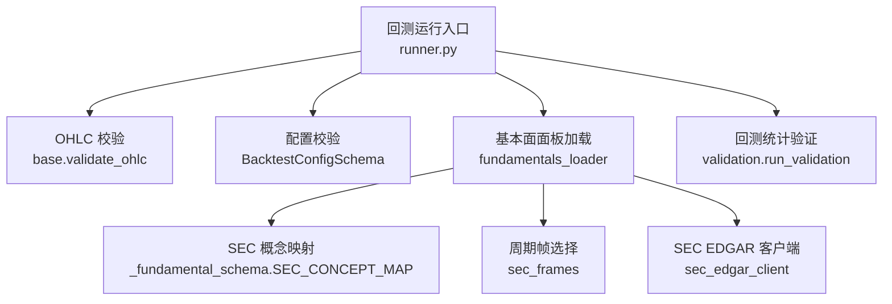
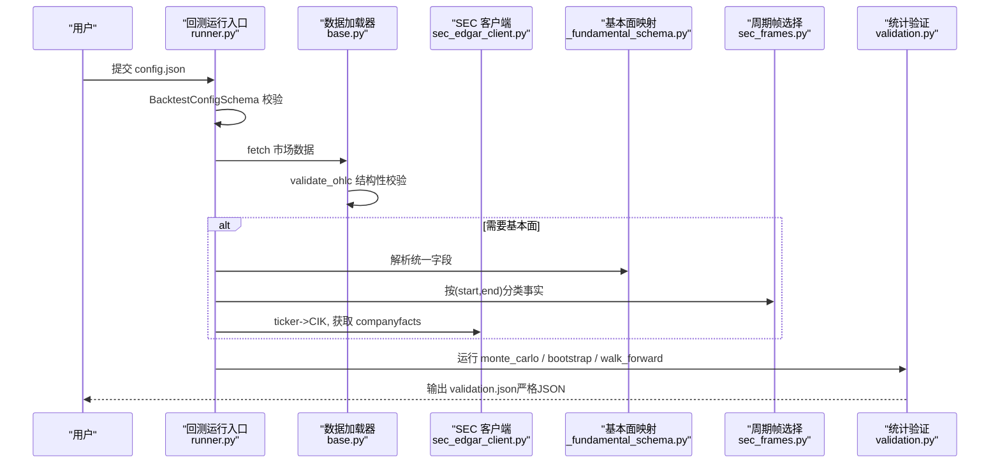
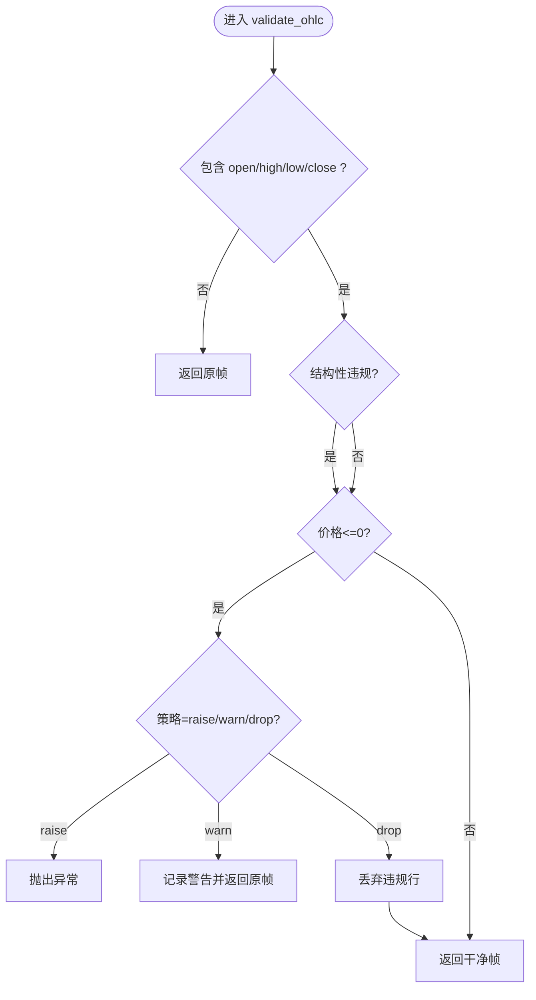
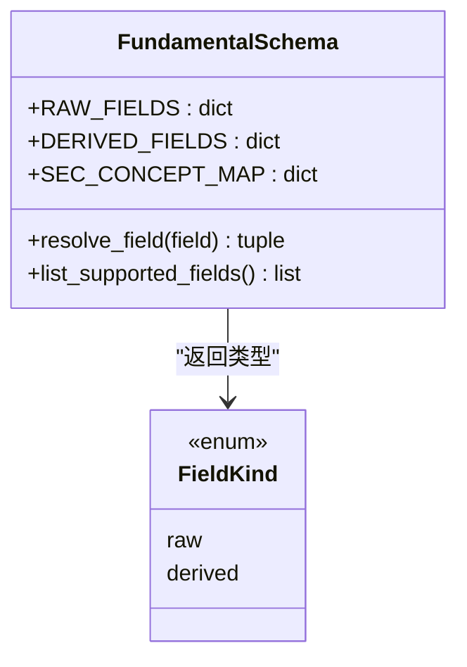
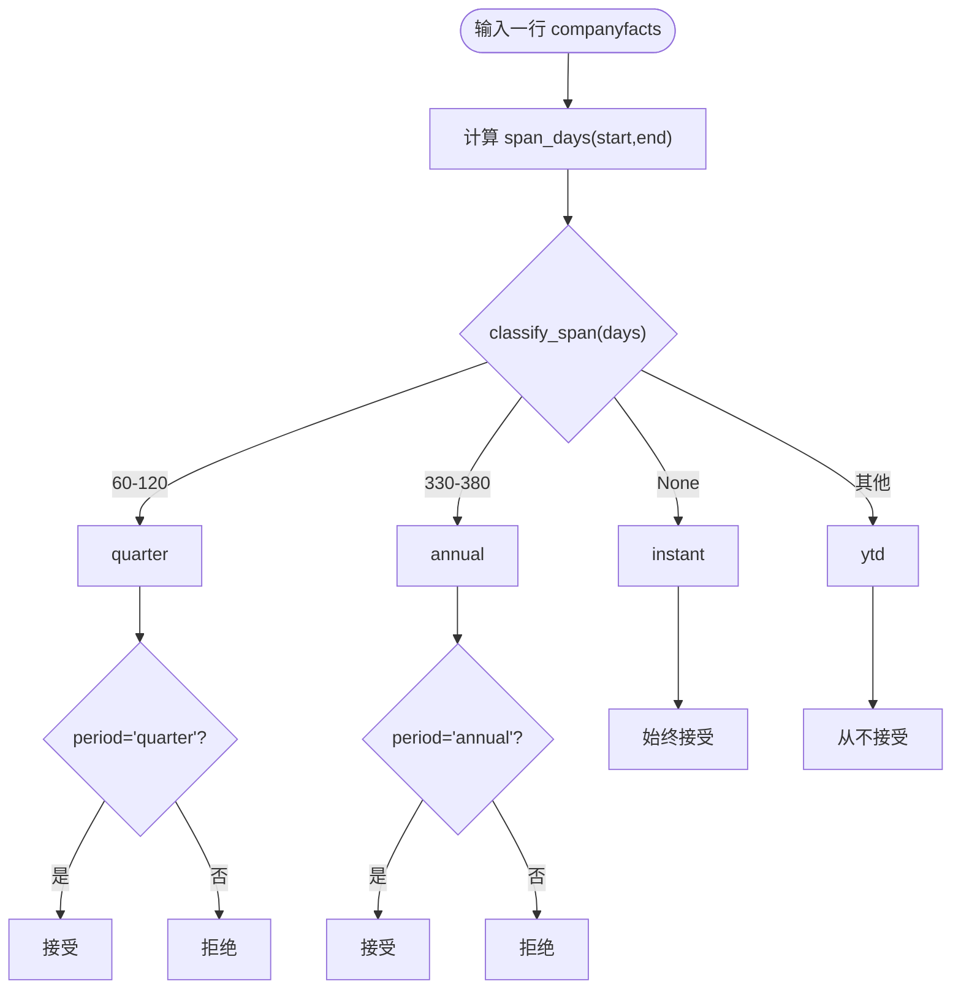
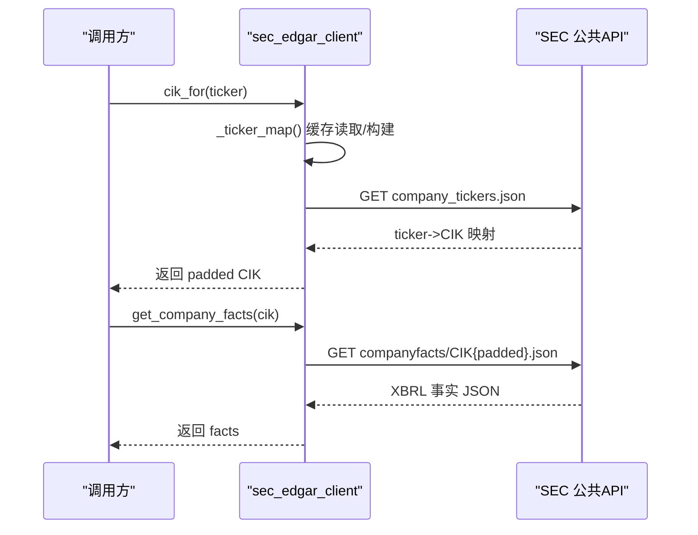
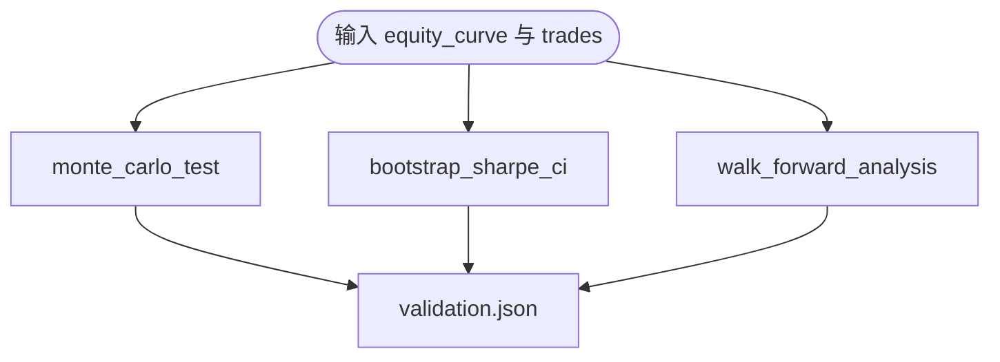
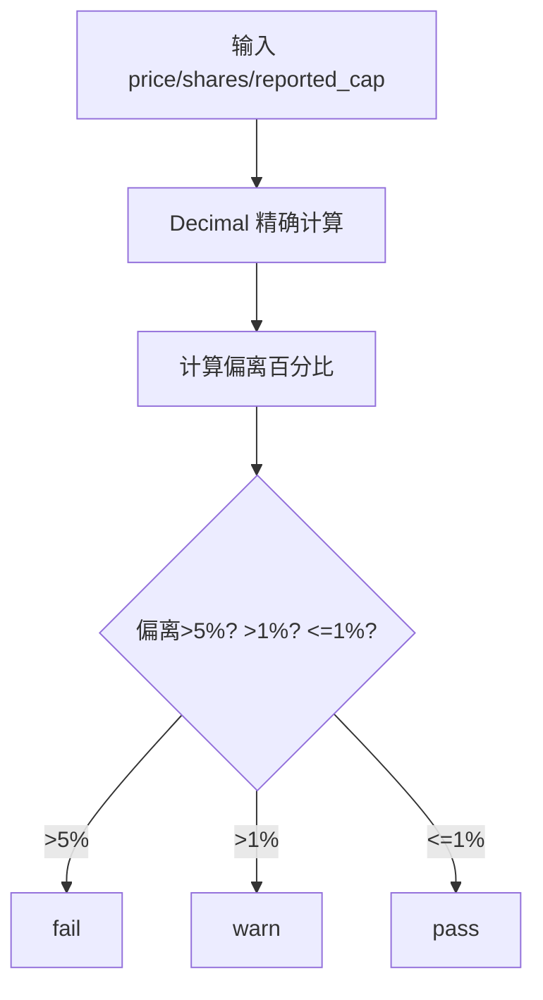
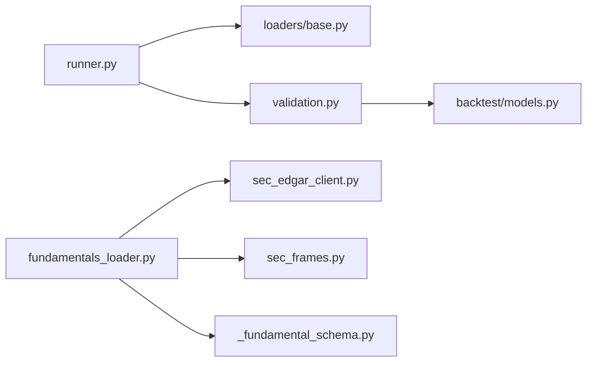

# 数据完整性检查

<cite>
**本文引用的文件**
- [agent/backtest/validation.py](file://agent/backtest/validation.py)
- [agent/backtest/loaders/base.py](file://agent/backtest/loaders/base.py)
- [agent/backtest/loaders/_fundamental_schema.py](file://agent/backtest/loaders/_fundamental_schema.py)
- [agent/backtest/loaders/sec_frames.py](file://agent/backtest/loaders/sec_frames.py)
- [agent/backtest/loaders/sec_edgar_client.py](file://agent/backtest/loaders/sec_edgar_client.py)
- [agent/backtest/loaders/fundamentals_loader.py](file://agent/backtest/loaders/fundamentals_loader.py)
- [agent/backtest/runner.py](file://agent/backtest/runner.py)
- [agent/src/tools/financial_rigor_tool.py](file://agent/src/tools/financial_rigor_tool.py)
- [agent/tests/test_validation.py](file://agent/tests/test_validation.py)
- [agent/tests/test_ohlc_validation.py](file://agent/tests/test_ohlc_validation.py)
- [agent/tests/test_sec_period_frames.py](file://agent/tests/test_sec_period_frames.py)
- [agent/tests/test_financial_statements_tool.py](file://agent/tests/test_financial_statements_tool.py)
</cite>

## 目录
1. [简介](#简介)
2. [项目结构](#项目结构)
3. [核心组件](#核心组件)
4. [架构总览](#架构总览)
5. [详细组件分析](#详细组件分析)
6. [依赖关系分析](#依赖关系分析)
7. [性能考虑](#性能考虑)
8. [故障排查指南](#故障排查指南)
9. [结论](#结论)
10. [附录：数据样本与验证结果示例](#附录数据样本与验证结果示例)

## 简介
本技术文档聚焦于“数据完整性检查”，覆盖以下目标：
- 财务数据模式验证：必填字段、数据类型、数值范围限制。
- SEC 文件解析验证：文件格式检查、字段映射、数据格式标准化。
- 数据质量规则：空值检测、重复记录识别、异常值过滤。
- 数据血缘追踪：来源记录、转换日志、影响分析。
- 自定义验证规则开发：规则定义、执行流程、错误报告。
- 数据清洗与修复建议，并附带实际数据样本与验证结果示例。

该文档面向数据工程师与质量保证人员，提供可操作的实现路径与最佳实践。

## 项目结构
本项目在回测与数据加载层提供了完善的数据校验与质量控制能力，关键位置如下：
- OHLC 数据完整性校验：位于加载器基类中，作为所有数据源的统一边界。
- 基本面数据模式与映射：集中定义统一字段与 SEC XBRL 概念别名。
- SEC 公司事实（companyfacts）周期帧选择：避免季度与年累计混淆。
- SEC EDGAR REST 客户端：ticker->CIK 映射、提交索引与公司事实获取。
- 回测统计验证：蒙特卡洛置换检验、Bootstrap Sharpe 置信区间、滚动窗口一致性。
- 金融严谨性工具：精确十进制算术的估值与一致性校验。
- 回测运行入口：配置校验与数据清洗汇聚点。

**图表来源**
- [agent/backtest/runner.py:68-162](file://agent/backtest/runner.py#L68-L162)
- [agent/backtest/loaders/base.py:168-256](file://agent/backtest/loaders/base.py#L168-L256)
- [agent/backtest/loaders/fundamentals_loader.py:1-36](file://agent/backtest/loaders/fundamentals_loader.py#L1-L36)
- [agent/backtest/loaders/_fundamental_schema.py:45-170](file://agent/backtest/loaders/_fundamental_schema.py#L45-L170)
- [agent/backtest/loaders/sec_frames.py:29-129](file://agent/backtest/loaders/sec_frames.py#L29-L129)
- [agent/backtest/loaders/sec_edgar_client.py:1-235](file://agent/backtest/loaders/sec_edgar_client.py#L1-L235)
- [agent/backtest/validation.py:291-346](file://agent/backtest/validation.py#L291-L346)

**章节来源**
- [agent/backtest/runner.py:68-162](file://agent/backtest/runner.py#L68-L162)
- [agent/backtest/loaders/base.py:168-256](file://agent/backtest/loaders/base.py#L168-L256)
- [agent/backtest/loaders/_fundamental_schema.py:45-170](file://agent/backtest/loaders/_fundamental_schema.py#L45-L170)
- [agent/backtest/loaders/sec_frames.py:29-129](file://agent/backtest/loaders/sec_frames.py#L29-L129)
- [agent/backtest/loaders/sec_edgar_client.py:1-235](file://agent/backtest/loaders/sec_edgar_client.py#L1-L235)
- [agent/backtest/loaders/fundamentals_loader.py:1-36](file://agent/backtest/loaders/fundamentals_loader.py#L1-L36)
- [agent/backtest/validation.py:291-346](file://agent/backtest/validation.py#L291-L346)

## 核心组件
- OHLC 数据完整性校验：对高低价与开收价的结构性约束进行强制检查，支持丢弃、警告或抛出异常策略；可选允许负价格但拒绝零价格。
- 基本面模式与映射：统一字段名到 SEC XBRL 概念的映射，支持原始字段与派生字段计算，保证 PIT（Point-in-Time）安全。
- SEC 周期帧选择：基于起止日期跨度将事实行分类为即时、季度、年度或年累计，避免同一天不同口径混淆。
- SEC EDGAR 客户端：ticker->CIK 映射缓存、提交索引与公司事实 JSON 拉取，遵循速率限制与 UA 合规。
- 回测统计验证：蒙特卡洛置换检验评估显著性，Bootstrap 估计 Sharpe 置信区间，滚动窗口分析一致性。
- 金融严谨性工具：使用 Decimal 精确算术进行市值、估值比率、跨源一致性、Benford 定律等校验。

**章节来源**
- [agent/backtest/loaders/base.py:187-256](file://agent/backtest/loaders/base.py#L187-L256)
- [agent/backtest/loaders/_fundamental_schema.py:45-170](file://agent/backtest/loaders/_fundamental_schema.py#L45-L170)
- [agent/backtest/loaders/sec_frames.py:29-129](file://agent/backtest/loaders/sec_frames.py#L29-L129)
- [agent/backtest/loaders/sec_edgar_client.py:1-235](file://agent/backtest/loaders/sec_edgar_client.py#L1-L235)
- [agent/backtest/validation.py:29-113](file://agent/backtest/validation.py#L29-L113)
- [agent/backtest/validation.py:142-203](file://agent/backtest/validation.py#L142-L203)
- [agent/backtest/validation.py:214-291](file://agent/backtest/validation.py#L214-L291)
- [agent/src/tools/financial_rigor_tool.py:143-200](file://agent/src/tools/financial_rigor_tool.py#L143-L200)

## 架构总览
下图展示从配置到数据加载、校验、再到统计验证的整体流程，体现数据完整性检查的关键节点。

**图表来源**
- [agent/backtest/runner.py:68-162](file://agent/backtest/runner.py#L68-L162)
- [agent/backtest/loaders/base.py:187-256](file://agent/backtest/loaders/base.py#L187-L256)
- [agent/backtest/loaders/sec_edgar_client.py:166-227](file://agent/backtest/loaders/sec_edgar_client.py#L166-L227)
- [agent/backtest/loaders/_fundamental_schema.py:215-236](file://agent/backtest/loaders/_fundamental_schema.py#L215-L236)
- [agent/backtest/loaders/sec_frames.py:42-129](file://agent/backtest/loaders/sec_frames.py#L42-L129)
- [agent/backtest/validation.py:291-346](file://agent/backtest/validation.py#L291-L346)

## 详细组件分析

### OHLC 数据完整性校验
- 校验内容：高低价与开收价的结构约束（high < low、high/low 是否包围 open/close），以及价格非正限制（默认拒绝<=0，可配置允许负价格但拒绝0）。
- 策略：drop（丢弃）、warn（记录警告保留）、raise（抛出异常）。
- 作用：确保任何 loader 输出的无效 K 线不会进入回测，避免下游指标出现 NaN/Inf。

**图表来源**
- [agent/backtest/loaders/base.py:187-256](file://agent/backtest/loaders/base.py#L187-L256)

**章节来源**
- [agent/backtest/loaders/base.py:187-256](file://agent/backtest/loaders/base.py#L187-L256)
- [agent/tests/test_ohlc_validation.py:110-139](file://agent/tests/test_ohlc_validation.py#L110-L139)

### 财务数据模式验证（SEC XBRL 概念映射）
- 统一字段：revenue、cogs、gross_profit、operating_income、net_income、total_assets、total_equity、total_debt、cash、shares_diluted、cfo、capex。
- 派生字段：roe、roa、gross_profitability、asset_growth、accruals、leverage。
- SEC 概念映射：每个统一字段对应多个 XBRL 概念优先级列表，确保在不同公司披露差异下仍能提取到最合适的概念。
- PIT 安全：以 filed date 为准，避免 period_end 导致的未来信息泄露。

**图表来源**
- [agent/backtest/loaders/_fundamental_schema.py:45-170](file://agent/backtest/loaders/_fundamental_schema.py#L45-L170)
- [agent/backtest/loaders/_fundamental_schema.py:215-236](file://agent/backtest/loaders/_fundamental_schema.py#L215-L236)

**章节来源**
- [agent/backtest/loaders/_fundamental_schema.py:45-170](file://agent/backtest/loaders/_fundamental_schema.py#L45-L170)
- [agent/backtest/loaders/_fundamental_schema.py:215-236](file://agent/backtest/loaders/_fundamental_schema.py#L215-L236)

### SEC 文件解析验证（周期帧选择）
- 问题背景：同一 end 日可能同时存在真实季度与年累计（YTD）事实，仅凭 end 会混淆口径。
- 解决方案：通过 start/end 计算跨度天数，分类为 instant、quarter、annual、ytd；frame_key 使用 (start, end) 唯一标识。
- 匹配规则：instant 在任何频率有效；annual 匹配年度；quarter 匹配真实季度；YTD 从不匹配。

**图表来源**
- [agent/backtest/loaders/sec_frames.py:42-129](file://agent/backtest/loaders/sec_frames.py#L42-L129)

**章节来源**
- [agent/backtest/loaders/sec_frames.py:29-129](file://agent/backtest/loaders/sec_frames.py#L29-L129)
- [agent/tests/test_sec_period_frames.py:1-41](file://agent/tests/test_sec_period_frames.py#L1-L41)

### SEC EDGAR 客户端（ticker->CIK 与 facts 获取）
- ticker->CIK：进程级缓存，支持 .US 后缀剥离与 share class 连字符处理。
- 提交索引与公司事实：通过 throttled_get_json 限流访问 SEC 公共 API，UA 含联系信息。
- CIK 规范化：去除前缀并填充至 10 位数字。

**图表来源**
- [agent/backtest/loaders/sec_edgar_client.py:118-195](file://agent/backtest/loaders/sec_edgar_client.py#L118-L195)
- [agent/backtest/loaders/sec_edgar_client.py:198-227](file://agent/backtest/loaders/sec_edgar_client.py#L198-L227)

**章节来源**
- [agent/backtest/loaders/sec_edgar_client.py:1-235](file://agent/backtest/loaders/sec_edgar_client.py#L1-L235)
- [agent/tests/test_financial_statements_tool.py:137-171](file://agent/tests/test_financial_statements_tool.py#L137-L171)

### 回测统计验证（蒙特卡洛、Bootstrap、滚动窗口）
- 蒙特卡洛置换检验：打乱交易 PnL 顺序，评估 Sharpe 与最大回撤显著性。
- Bootstrap Sharpe 置信区间：重采样收益序列估计 Sharpe 分布与概率。
- 滚动窗口分析：将时间序列切分为若干窗口，评估收益与 Sharpe 的一致性。
- 输出：严格 JSON（NaN/Inf 转为 null），便于下游消费。

**图表来源**
- [agent/backtest/validation.py:29-113](file://agent/backtest/validation.py#L29-L113)
- [agent/backtest/validation.py:142-203](file://agent/backtest/validation.py#L142-L203)
- [agent/backtest/validation.py:214-291](file://agent/backtest/validation.py#L214-L291)
- [agent/backtest/validation.py:453-470](file://agent/backtest/validation.py#L453-L470)

**章节来源**
- [agent/backtest/validation.py:29-113](file://agent/backtest/validation.py#L29-L113)
- [agent/backtest/validation.py:142-203](file://agent/backtest/validation.py#L142-L203)
- [agent/backtest/validation.py:214-291](file://agent/backtest/validation.py#L214-L291)
- [agent/backtest/validation.py:453-470](file://agent/backtest/validation.py#L453-L470)
- [agent/tests/test_validation.py:73-123](file://agent/tests/test_validation.py#L73-L123)
- [agent/tests/test_validation.py:146-209](file://agent/tests/test_validation.py#L146-L209)
- [agent/tests/test_validation.py:217-273](file://agent/tests/test_validation.py#L217-L273)
- [agent/tests/test_validation.py:361-421](file://agent/tests/test_validation.py#L361-L421)

### 金融严谨性工具（精确十进制校验）
- 市值校验：price × shares vs reported cap，阈值 1%/5% 判定 pass/warn/fail。
- 估值比率：PE/PB/ROE/P/FCF/FCF yield/dividend yield/PS，基于 per-share 输入。
- 跨源一致性：同一字段多源对比，超过容忍度标记偏差并给出中位数共识。
- Benford 定律：首数字分布检验，需≥50 样本，报告 MAD/卡方/符合度。
- 表达式计算：AST 白名单仅允许数字与四则运算，避免 eval 风险。

**图表来源**
- [agent/src/tools/financial_rigor_tool.py:143-176](file://agent/src/tools/financial_rigor_tool.py#L143-L176)

**章节来源**
- [agent/src/tools/financial_rigor_tool.py:1-200](file://agent/src/tools/financial_rigor_tool.py#L1-200)

## 依赖关系分析
- runner.py 依赖 loaders.base 的 validate_ohlc 与配置校验。
- fundamentals_loader.py 依赖 sec_edgar_client、sec_frames、_fundamental_schema。
- validation.py 依赖 backtest.models.TradeRecord 与 numpy/pandas。
- financial_rigor_tool.py 依赖标准库 decimal 与 ast，无外部 I/O。

**图表来源**
- [agent/backtest/runner.py:30-47](file://agent/backtest/runner.py#L30-L47)
- [agent/backtest/loaders/fundamentals_loader.py:22-24](file://agent/backtest/loaders/fundamentals_loader.py#L22-L24)
- [agent/backtest/validation.py:24-24](file://agent/backtest/validation.py#L24-L24)

**章节来源**
- [agent/backtest/runner.py:30-47](file://agent/backtest/runner.py#L30-L47)
- [agent/backtest/loaders/fundamentals_loader.py:22-24](file://agent/backtest/loaders/fundamentals_loader.py#L22-L24)
- [agent/backtest/validation.py:24-24](file://agent/backtest/validation.py#L24-L24)

## 性能考虑
- SEC 客户端限流：最小请求间隔 0.12s，避免触发 SEC 速率限制。
- 本地缓存：loader_cache_enabled 控制开关，end_date 必须已结算才缓存，减少重复请求。
- 统计验证内存控制：蒙特卡洛路径矩阵仅在 n_simulations*len(pnls) 不超过阈值时生成，避免过大 JSON。
- 严格 JSON 序列化：write_validation_json 将非有限数转为 null，确保下游解析稳定。

[本节为通用指导，不直接分析具体文件]

## 故障排查指南
- OHLC 校验失败：若 strategy="raise"，将抛出 ValueError；若 "warn"，记录警告；若 "drop"，丢弃违规行。可通过测试用例定位问题。
- SEC 周期帧混淆：确认 frame_key 使用 (start, end)，避免仅用 end 导致季度与 YTD 冲突。
- 基本面字段缺失：统一字段未命中任何 SEC 概念时，应记录缺失并返回 NaN，避免伪造值。
- 配置校验失败：BacktestConfigSchema 对 codes、日期、interval、engine、source 等进行强校验，错误信息明确。
- 统计验证参数非法：如 n_simulations、confidence、seed 等类型或范围错误，函数返回 error 而非崩溃。

**章节来源**
- [agent/backtest/loaders/base.py:187-256](file://agent/backtest/loaders/base.py#L187-L256)
- [agent/backtest/loaders/sec_frames.py:93-129](file://agent/backtest/loaders/sec_frames.py#L93-L129)
- [agent/backtest/loaders/_fundamental_schema.py:215-236](file://agent/backtest/loaders/_fundamental_schema.py#L215-L236)
- [agent/backtest/runner.py:68-162](file://agent/backtest/runner.py#L68-L162)
- [agent/backtest/validation.py:54-62](file://agent/backtest/validation.py#L54-L62)
- [agent/backtest/validation.py:162-176](file://agent/backtest/validation.py#L162-L176)
- [agent/backtest/validation.py:233-236](file://agent/backtest/validation.py#L233-L236)

## 结论
本项目在数据完整性检查方面形成了多层次、可组合的校验体系：
- 数据接入层：OHLC 结构性校验与价格非正限制，确保基础数据质量。
- 基本面层：统一字段与 SEC 概念映射，结合周期帧选择保障 PIT 安全。
- 统计层：蒙特卡洛、Bootstrap、滚动窗口评估策略稳健性。
- 工具层：金融严谨性工具提供精确算术与一致性校验。
- 运行层：配置强校验与严格 JSON 输出，提升可追溯性与稳定性。

建议在数据工程中优先启用 OHLC 校验与基本面映射，结合统计验证与金融严谨性工具形成闭环质量控制。

[本节为总结，不直接分析具体文件]

## 附录：数据样本与验证结果示例
以下为基于测试与实现的典型数据样本与验证结果示例（以路径引用代替代码片段）：

- OHLC 清洗示例：
  - 输入包含 high < low 的脏 K 线，经 _sanitize_data_map 后仅保留有效行。
  - 参考：[agent/tests/test_ohlc_validation.py:110-139](file://agent/tests/test_ohlc_validation.py#L110-L139)

- SEC 周期帧冲突修复示例：
  - AAPL 在 FY2020 Q4 同时存在季度与 YTD 事实，修复后 period="annual" 不再返回错误的 YTD 值。
  - 参考：[agent/tests/test_sec_period_frames.py:1-41](file://agent/tests/test_sec_period_frames.py#L1-L41)

- 基本面面板加载示例：
  - 通过 fundamentals_loader.load_fundamental_panel 获取 TTM/年度/季度面板，PIT 安全。
  - 参考：[agent/backtest/loaders/fundamentals_loader.py:197-229](file://agent/backtest/loaders/fundamentals_loader.py#L197-L229)

- SEC 工具调用示例：
  - FinancialStatementsTool 调用 get_company_facts，返回 periods 包含 REPORT_DATE、FORM、Revenues、NetIncomeLoss 及单位。
  - 参考：[agent/tests/test_financial_statements_tool.py:137-171](file://agent/tests/test_financial_statements_tool.py#L137-L171)

- 统计验证输出示例：
  - write_validation_json 将非有限数转为 null，确保 strict JSON。
  - 参考：[agent/tests/test_validation.py:361-421](file://agent/tests/test_validation.py#L361-L421)

- 金融严谨性校验示例：
  - verify_market_cap 计算偏离百分比并给出 pass/warn/fail。
  - 参考：[agent/src/tools/financial_rigor_tool.py:143-176](file://agent/src/tools/financial_rigor_tool.py#L143-L176)

[本节为示例汇总，不直接分析具体文件]