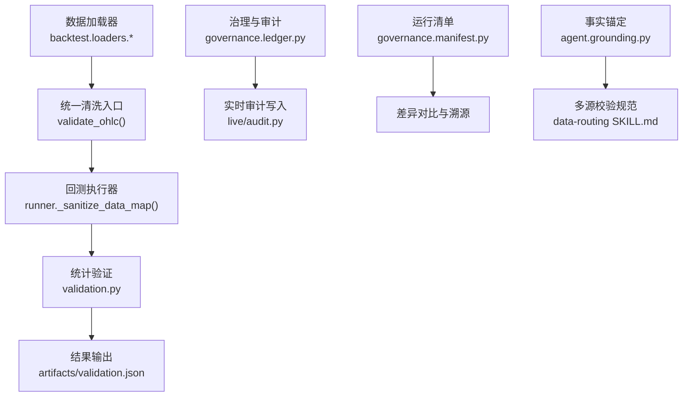
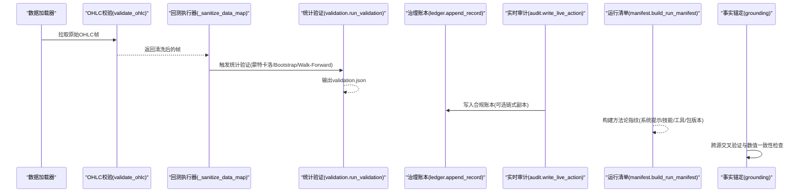
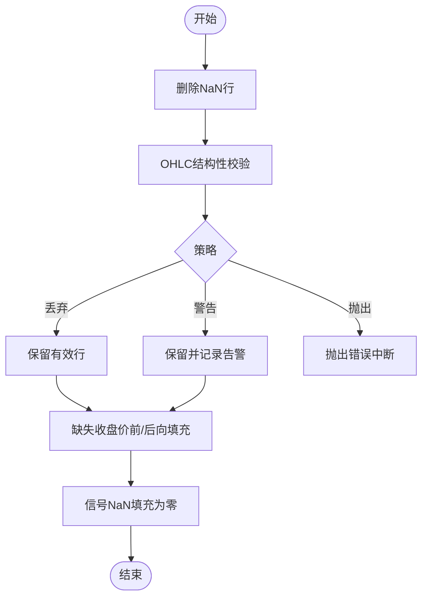
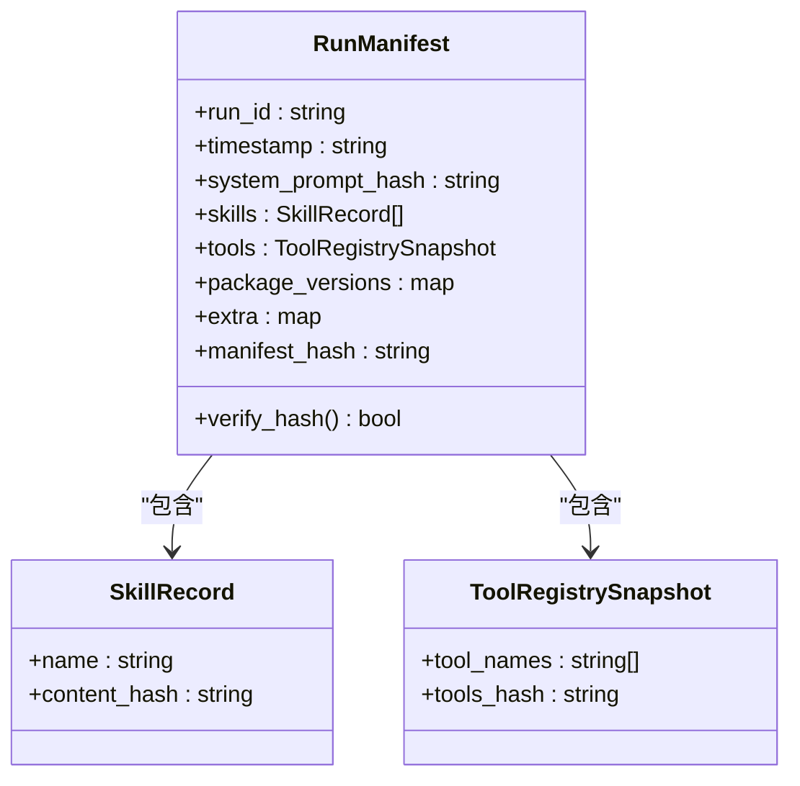
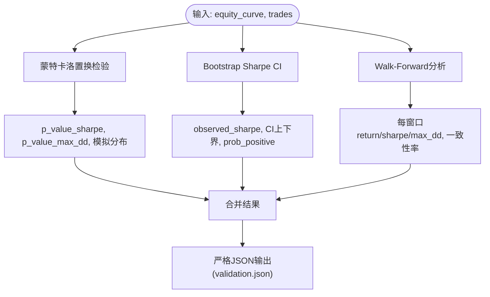
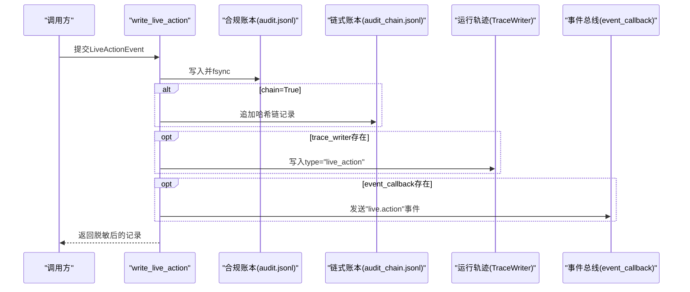
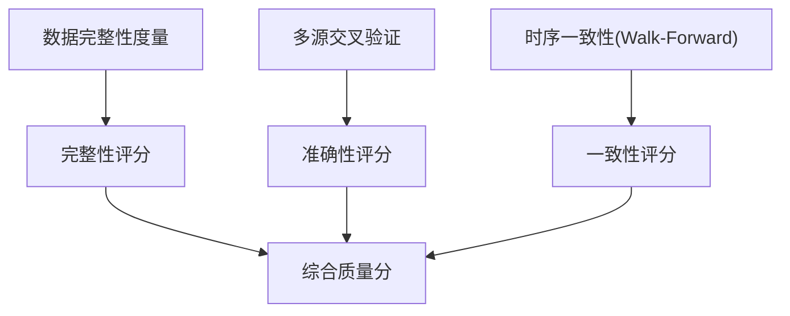
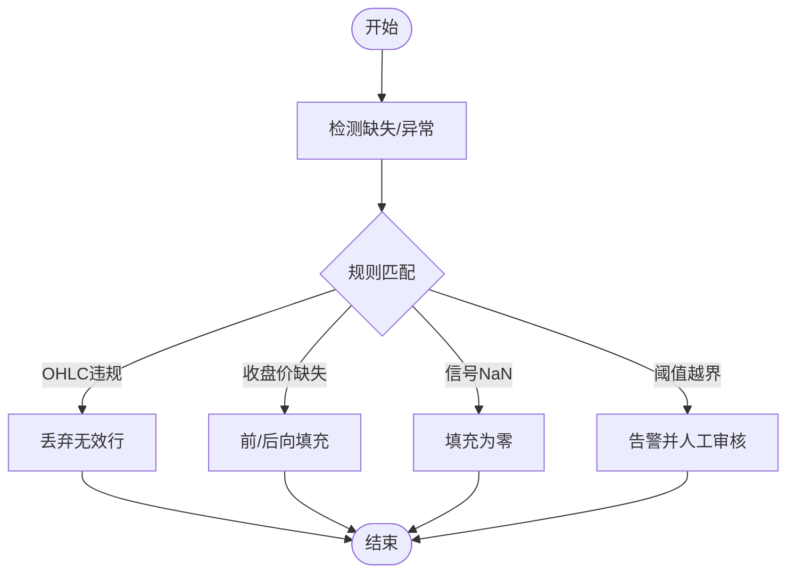
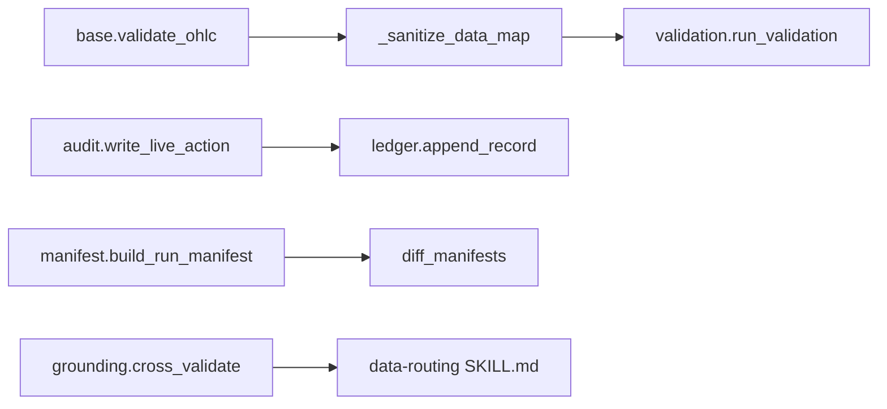

# 数据质量规则

<cite>
**本文引用的文件**
- [agent/backtest/loaders/base.py](file://agent/backtest/loaders/base.py)
- [agent/backtest/runner.py](file://agent/backtest/runner.py)
- [agent/tests/test_ohlc_validation.py](file://agent/tests/test_ohlc_validation.py)
- [agent/backtest/validation.py](file://agent/backtest/validation.py)
- [agent/src/governance/ledger.py](file://agent/src/governance/ledger.py)
- [agent/src/governance/manifest.py](file://agent/src/governance/manifest.py)
- [agent/src/live/audit.py](file://agent/src/live/audit.py)
- [agent/src/agent/grounding.py](file://agent/src/agent/grounding.py)
- [agent/src/skills/data-routing/SKILL.md](file://agent/src/skills/data-routing/SKILL.md)
</cite>

## 目录
1. [简介](#简介)
2. [项目结构](#项目结构)
3. [核心组件](#核心组件)
4. [架构总览](#架构总览)
5. [详细组件分析](#详细组件分析)
6. [依赖关系分析](#依赖关系分析)
7. [性能考虑](#性能考虑)
8. [故障排查指南](#故障排查指南)
9. [结论](#结论)
10. [附录](#附录)

## 简介
本技术文档围绕数据质量规则，系统化说明空值检测、重复记录识别、异常值过滤、数据血缘追踪与质量评分体系，并结合实际代码实现给出清洗与修复建议。重点覆盖：
- 空值检测与缺失值处理策略（默认值填充、前向/后向填充）
- 重复记录识别（主键冲突、时间序列去重、版本控制）
- 异常值过滤（统计异常、业务规则校验、阈值监控）
- 数据血缘追踪（来源记录、转换日志、影响分析）
- 质量评分系统（完整性、准确性、一致性等）
- 清洗与修复方法（插值、外推、人工审核流程）
- 实战示例与最佳实践

## 项目结构
本项目在回测与治理层提供了完善的数据质量能力：
- 数据加载与清洗边界：统一对OHLC数据进行结构性校验，确保进入回测的数据满足价格区间、非负性等约束
- 统计验证：蒙特卡洛置换检验、Bootstrap置信区间、滚动窗口一致性评估
- 治理与审计：可追加、不可篡改的哈希链式账本；运行清单（Manifest）用于方法论溯源
- 事实锚定与多源校验：将最终数字与观测证据对齐，跨源交叉验证并标记不一致

**图示来源**
- [agent/backtest/loaders/base.py:187-208](file://agent/backtest/loaders/base.py#L187-L208)
- [agent/backtest/runner.py:1938-1955](file://agent/backtest/runner.py#L1938-L1955)
- [agent/backtest/validation.py:291-346](file://agent/backtest/validation.py#L291-L346)
- [agent/src/governance/ledger.py:368-469](file://agent/src/governance/ledger.py#L368-L469)
- [agent/src/live/audit.py:248-351](file://agent/src/live/audit.py#L248-L351)
- [agent/src/governance/manifest.py:356-430](file://agent/src/governance/manifest.py#L356-L430)
- [agent/src/agent/grounding.py:2370-2405](file://agent/src/agent/grounding.py#L2370-L2405)
- [agent/src/skills/data-routing/SKILL.md:139-156](file://agent/src/skills/data-routing/SKILL.md#L139-L156)

**章节来源**
- [agent/backtest/loaders/base.py:187-208](file://agent/backtest/loaders/base.py#L187-L208)
- [agent/backtest/runner.py:1938-1955](file://agent/backtest/runner.py#L1938-L1955)
- [agent/backtest/validation.py:291-346](file://agent/backtest/validation.py#L291-L346)
- [agent/src/governance/ledger.py:368-469](file://agent/src/governance/ledger.py#L368-L469)
- [agent/src/live/audit.py:248-351](file://agent/src/live/audit.py#L248-L351)
- [agent/src/governance/manifest.py:356-430](file://agent/src/governance/manifest.py#L356-L430)
- [agent/src/agent/grounding.py:2370-2405](file://agent/src/agent/grounding.py#L2370-L2405)
- [agent/src/skills/data-routing/SKILL.md:139-156](file://agent/src/skills/data-routing/SKILL.md#L139-L156)

## 核心组件
- OHLC结构性校验：统一在加载边界剔除违反OHLC不变量的行（如high<low、价格非正、高低价未包围开盘/收盘），支持“丢弃/警告/抛出”策略，并可配置是否允许非正价格
- 回测数据清洗管道：所有数据源汇聚到单一清洗点，保证任何未来或自动选择的数据源都受同一套规则保护
- 统计验证：蒙特卡洛置换检验、Bootstrap Sharpe置信区间、Walk-Forward一致性分析，输出JSON且严格序列化
- 治理账本：哈希链式追加写，fsync持久化，支持旋转归档与全量验证；实时审计事件三通道分发（合规账本、运行轨迹、前端事件）
- 运行清单：以内容寻址方式记录系统提示、技能、工具集与关键包版本，生成可复现的方法论指纹，支持差异对比
- 事实锚定与多源校验：将最终数值与观测证据对齐，跨源交叉验证并标记偏差

**章节来源**
- [agent/backtest/loaders/base.py:187-208](file://agent/backtest/loaders/base.py#L187-L208)
- [agent/backtest/runner.py:1938-1955](file://agent/backtest/runner.py#L1938-L1955)
- [agent/backtest/validation.py:29-113](file://agent/backtest/validation.py#L29-L113)
- [agent/backtest/validation.py:142-203](file://agent/backtest/validation.py#L142-L203)
- [agent/backtest/validation.py:214-291](file://agent/backtest/validation.py#L214-L291)
- [agent/src/governance/ledger.py:368-469](file://agent/src/governance/ledger.py#L368-L469)
- [agent/src/live/audit.py:248-351](file://agent/src/live/audit.py#L248-L351)
- [agent/src/governance/manifest.py:356-430](file://agent/src/governance/manifest.py#L356-L430)
- [agent/src/agent/grounding.py:2370-2405](file://agent/src/agent/grounding.py#L2370-L2405)
- [agent/src/skills/data-routing/SKILL.md:139-156](file://agent/src/skills/data-routing/SKILL.md#L139-L156)

## 架构总览
下图展示了从数据加载、清洗、验证到治理与审计的整体数据质量流水线，以及事实锚定与多源校验如何贯穿其中。

**图示来源**
- [agent/backtest/loaders/base.py:187-208](file://agent/backtest/loaders/base.py#L187-L208)
- [agent/backtest/runner.py:1938-1955](file://agent/backtest/runner.py#L1938-L1955)
- [agent/backtest/validation.py:291-346](file://agent/backtest/validation.py#L291-L346)
- [agent/src/governance/ledger.py:368-469](file://agent/src/governance/ledger.py#L368-L469)
- [agent/src/live/audit.py:248-351](file://agent/src/live/audit.py#L248-L351)
- [agent/src/governance/manifest.py:356-430](file://agent/src/governance/manifest.py#L356-L430)
- [agent/src/agent/grounding.py:2370-2405](file://agent/src/agent/grounding.py#L2370-L2405)

## 详细组件分析

### 空值检测与缺失值处理
- 缺失值识别：加载器默认删除NaN行；随后通过OHLC校验进一步剔除结构性无效行
- 默认值处理：信号对齐阶段对缺失收盘价进行前向/后向填充；信号中的NaN用零填充，确保后续计算稳定
- 数据完整性评估：统计验证模块对收益曲线长度、交易数量等进行前置校验，避免在样本不足时产生误导指标

**图示来源**
- [agent/backtest/loaders/base.py:187-208](file://agent/backtest/loaders/base.py#L187-L208)
- [agent/tests/test_base_engine.py:622-651](file://agent/tests/test_base_engine.py#L622-L651)

**章节来源**
- [agent/backtest/loaders/base.py:187-208](file://agent/backtest/loaders/base.py#L187-L208)
- [agent/tests/test_base_engine.py:622-651](file://agent/tests/test_base_engine.py#L622-L651)

### 重复记录识别与去重
- 主键冲突检测：治理账本通过seq字段强制顺序递增，若出现跳号则判定为破坏链完整性
- 时间序列去重：回测数据在进入统计验证前需具备唯一交易日索引；测试用例中通过日期范围构造唯一时间轴
- 版本控制：运行清单以内容寻址方式锁定系统提示、技能、工具集与关键包版本，便于比较两次运行的差异

**图示来源**
- [agent/src/governance/manifest.py:128-186](file://agent/src/governance/manifest.py#L128-L186)
- [agent/src/governance/manifest.py:218-269](file://agent/src/governance/manifest.py#L218-L269)
- [agent/src/governance/manifest.py:356-430](file://agent/src/governance/manifest.py#L356-L430)

**章节来源**
- [agent/src/governance/ledger.py:368-469](file://agent/src/governance/ledger.py#L368-L469)
- [agent/src/governance/manifest.py:218-269](file://agent/src/governance/manifest.py#L218-L269)
- [agent/src/governance/manifest.py:356-430](file://agent/src/governance/manifest.py#L356-L430)

### 异常值过滤规则
- 统计异常检测：蒙特卡洛置换检验评估策略显著性；Bootstrap Sharpe置信区间估计风险调整后收益稳定性；Walk-Forward分析评估时序一致性
- 业务规则验证：OHLC结构性校验拒绝违反业务常识的行（如high<low、价格非正、高低价未包围开盘/收盘）
- 阈值监控：统计验证函数对输入参数进行类型与范围校验，防止非法配置导致错误结果

**图示来源**
- [agent/backtest/validation.py:29-113](file://agent/backtest/validation.py#L29-L113)
- [agent/backtest/validation.py:142-203](file://agent/backtest/validation.py#L142-L203)
- [agent/backtest/validation.py:214-291](file://agent/backtest/validation.py#L214-L291)
- [agent/backtest/validation.py:453-470](file://agent/backtest/validation.py#L453-L470)

**章节来源**
- [agent/backtest/validation.py:29-113](file://agent/backtest/validation.py#L29-L113)
- [agent/backtest/validation.py:142-203](file://agent/backtest/validation.py#L142-L203)
- [agent/backtest/validation.py:214-291](file://agent/backtest/validation.py#L214-L291)
- [agent/backtest/validation.py:453-470](file://agent/backtest/validation.py#L453-L470)

### 数据血缘追踪
- 来源记录：实时审计事件包含会话ID、授权引用（mandate_snapshot_ref、consent_record_ref）、服务端与远程工具名、意图归一化描述等
- 转换日志：每个审计事件经脱敏处理后写入合规账本，同时可选择写入运行轨迹与前端事件总线
- 影响分析：哈希链式账本支持端到端验证，任何篡改或缺失均可被检测；运行清单提供方法论层面的变更追踪

**图示来源**
- [agent/src/live/audit.py:248-351](file://agent/src/live/audit.py#L248-L351)
- [agent/src/governance/ledger.py:368-469](file://agent/src/governance/ledger.py#L368-L469)

**章节来源**
- [agent/src/live/audit.py:248-351](file://agent/src/live/audit.py#L248-L351)
- [agent/src/governance/ledger.py:368-469](file://agent/src/governance/ledger.py#L368-L469)

### 质量评分系统
- 完整性评分：基于缺失值比例、OHLC结构性无效行比例、信号NaN比例等维度评估数据完整度
- 准确性评分：通过事实锚定与多源交叉验证，比较不同来源数值偏差，标记不一致项
- 一致性评分：使用Walk-Forward分析评估时序一致性；结合Bootstrap置信区间衡量收益稳定性

[本节为概念性说明，不直接分析具体文件]

### 数据清洗与修复建议
- 插值方法：对缺失收盘价使用前向/后向填充，保持时间序列连续性；对信号NaN填充为零，避免传播NaN
- 外推策略：在短窗缺失场景下谨慎外推，优先采用保守填充；长窗缺失建议标注并人工复核
- 人工审核流程：对高频异常或业务敏感字段（如价格、成交量）设置阈值告警，触发人工复核；结合治理账本记录审核决策

**图示来源**
- [agent/backtest/loaders/base.py:187-208](file://agent/backtest/loaders/base.py#L187-L208)
- [agent/tests/test_base_engine.py:622-651](file://agent/tests/test_base_engine.py#L622-L651)

**章节来源**
- [agent/backtest/loaders/base.py:187-208](file://agent/backtest/loaders/base.py#L187-L208)
- [agent/tests/test_base_engine.py:622-651](file://agent/tests/test_base_engine.py#L622-L651)

### 实际数据质量检查与修复示例
- OHLC结构性校验示例：测试用例构造含high<low、非正价格、close>high等无效行的DataFrame，调用validate_ohlc后仅保留有效行
- 回测数据清洗示例：通过_sanatize_data_map对所有数据源的帧统一应用validate_ohlc，确保任何loader都不会泄漏结构性无效行
- 统计验证示例：对equity曲线与trades执行蒙特卡洛、Bootstrap与Walk-Forward，输出validation.json供下游消费

**章节来源**
- [agent/tests/test_ohlc_validation.py:23-38](file://agent/tests/test_ohlc_validation.py#L23-L38)
- [agent/backtest/runner.py:1938-1955](file://agent/backtest/runner.py#L1938-L1955)
- [agent/backtest/validation.py:473-505](file://agent/backtest/validation.py#L473-L505)

## 依赖关系分析
- 数据加载与清洗：base.validate_ohlc作为统一入口，runner._sanitize_data_map聚合所有数据源
- 统计验证：validation模块依赖numpy/pandas，输出严格JSON，避免非有限值污染
- 治理与审计：ledger提供哈希链式追加写，audit将事件分发至多个目的地
- 运行清单：manifest独立于运行时环境，仅依赖关键包版本信息，确保可复现性
- 事实锚定与多源校验：grounding与SKILL.md共同保障最终数字与观测证据一致

**图示来源**
- [agent/backtest/loaders/base.py:187-208](file://agent/backtest/loaders/base.py#L187-L208)
- [agent/backtest/runner.py:1938-1955](file://agent/backtest/runner.py#L1938-L1955)
- [agent/backtest/validation.py:291-346](file://agent/backtest/validation.py#L291-L346)
- [agent/src/governance/ledger.py:368-469](file://agent/src/governance/ledger.py#L368-L469)
- [agent/src/live/audit.py:248-351](file://agent/src/live/audit.py#L248-L351)
- [agent/src/governance/manifest.py:356-430](file://agent/src/governance/manifest.py#L356-L430)
- [agent/src/agent/grounding.py:2370-2405](file://agent/src/agent/grounding.py#L2370-L2405)
- [agent/src/skills/data-routing/SKILL.md:139-156](file://agent/src/skills/data-routing/SKILL.md#L139-L156)

**章节来源**
- [agent/backtest/loaders/base.py:187-208](file://agent/backtest/loaders/base.py#L187-L208)
- [agent/backtest/runner.py:1938-1955](file://agent/backtest/runner.py#L1938-L1955)
- [agent/backtest/validation.py:291-346](file://agent/backtest/validation.py#L291-L346)
- [agent/src/governance/ledger.py:368-469](file://agent/src/governance/ledger.py#L368-L469)
- [agent/src/live/audit.py:248-351](file://agent/src/live/audit.py#L248-L351)
- [agent/src/governance/manifest.py:356-430](file://agent/src/governance/manifest.py#L356-L430)
- [agent/src/agent/grounding.py:2370-2405](file://agent/src/agent/grounding.py#L2370-L2405)
- [agent/src/skills/data-routing/SKILL.md:139-156](file://agent/src/skills/data-routing/SKILL.md#L139-L156)

## 性能考虑
- 蒙特卡洛模拟路径矩阵大小受限，避免内存膨胀
- 账本追加写采用独占锁与fsync，保证并发安全与持久性；大文件通过旋转归档控制活跃文件大小
- 统计验证对极小样本提前返回错误，减少无效计算
- 运行清单仅存储哈希与关键元数据，体积可控

[本节提供一般性指导，不直接分析具体文件]

## 故障排查指南
- OHLC校验失败：检查是否出现high<low、价格非正、高低价未包围开盘/收盘；根据策略选择丢弃、警告或抛出
- 统计验证报错：确认equity曲线长度与交易数量满足最小要求；检查n_simulations、confidence、seed等参数合法性
- 账本链断裂：verify_chain会报告首个断点原因（malformed_json、seq_gap、prev_hash_mismatch、record_hash_mismatch）；必要时重新生成或隔离损坏段
- 审计写入失败：chain模式下的append_record失败不会阻断订单执行，但会在链式账本留下可检测的空缺；检查文件系统权限与fsync支持

**章节来源**
- [agent/backtest/loaders/base.py:187-208](file://agent/backtest/loaders/base.py#L187-L208)
- [agent/backtest/validation.py:29-113](file://agent/backtest/validation.py#L29-L113)
- [agent/src/governance/ledger.py:309-324](file://agent/src/governance/ledger.py#L309-L324)
- [agent/src/governance/ledger.py:368-469](file://agent/src/governance/ledger.py#L368-L469)
- [agent/src/live/audit.py:320-344](file://agent/src/live/audit.py#L320-L344)

## 结论
本项目在数据质量方面形成了闭环：从加载边界的结构性校验，到回测阶段的统计验证，再到治理层的审计与溯源，辅以事实锚定与多源校验，确保数据可信、可追溯、可复现。建议在实际使用中：
- 统一在加载边界应用OHLC校验，避免脏数据进入下游
- 启用统计验证并合理配置参数，关注时序一致性与收益稳定性
- 开启链式账本与运行清单，强化合规与可复现性
- 对缺失与异常数据采用保守填充与人工复核相结合的策略

[本节总结性内容，不直接分析具体文件]

## 附录
- 多源交叉验证：对关键数值至少使用两个独立来源比对，偏差超过阈值需显式声明并说明采用依据
- 事实锚定：最终数字必须与观测证据一致，禁止擅自更改价格范围或入场价
- 质量评分：建议将完整性、准确性、一致性加权合成综合分数，用于持续监控与告警

[本节为概念性说明，不直接分析具体文件]