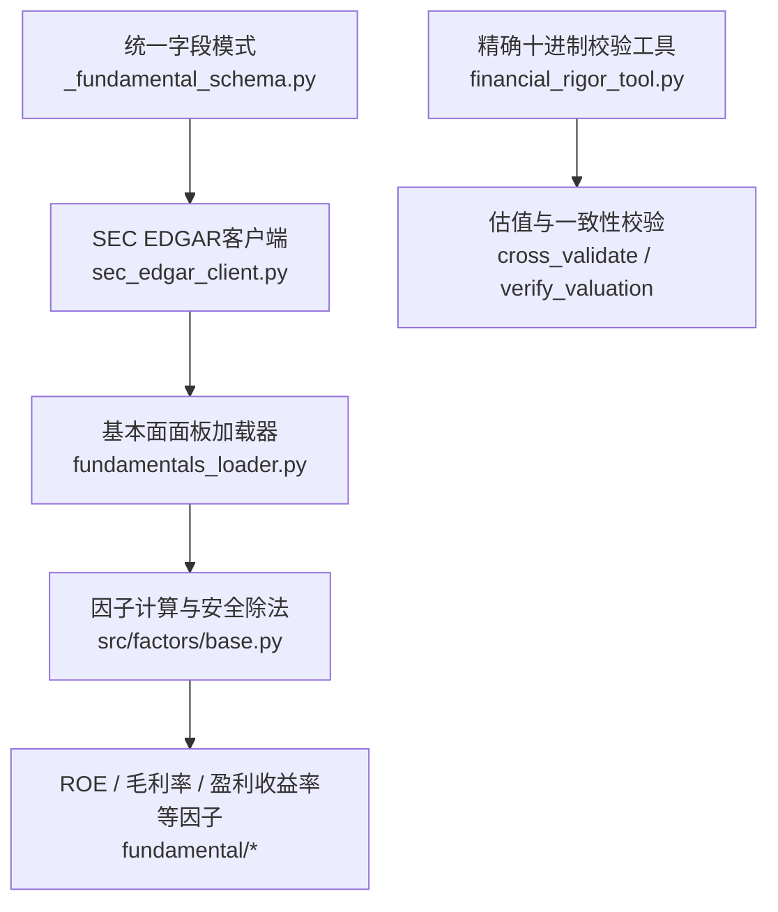
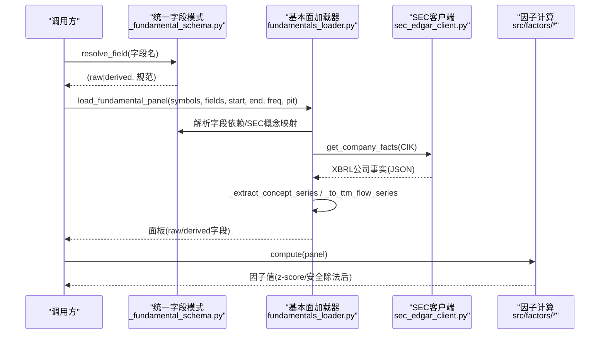
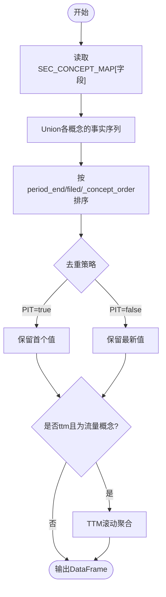
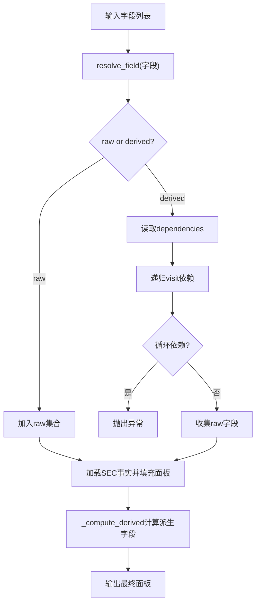
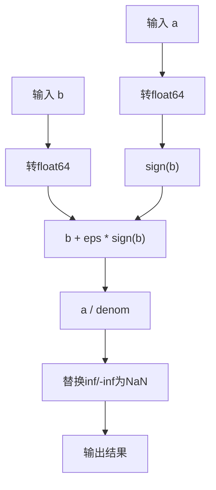
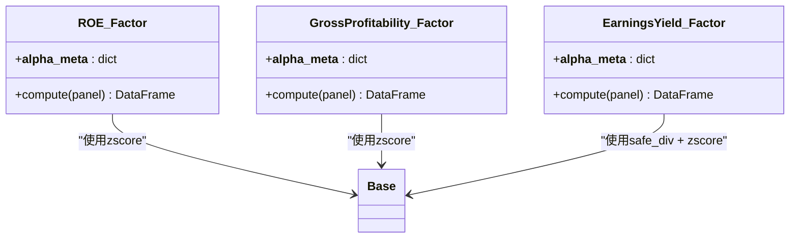
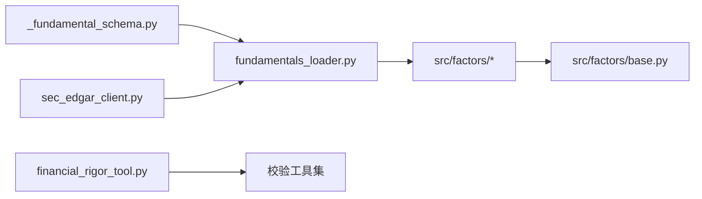

# 财务数据验证

<cite>
**本文引用的文件**
- [agent/backtest/loaders/_fundamental_schema.py](file://agent/backtest/loaders/_fundamental_schema.py)
- [agent/backtest/loaders/fundamentals_loader.py](file://agent/backtest/loaders/fundamentals_loader.py)
- [agent/backtest/loaders/sec_edgar_client.py](file://agent/backtest/loaders/sec_edgar_client.py)
- [agent/src/tools/financial_rigor_tool.py](file://agent/src/tools/financial_rigor_tool.py)
- [agent/src/factors/base.py](file://agent/src/factors/base.py)
- [agent/src/factors/zoo/fundamental/roe.py](file://agent/src/factors/zoo/fundamental/roe.py)
- [agent/src/factors/zoo/fundamental/gross_profitability.py](file://agent/src/factors/zoo/fundamental/gross_profitability.py)
- [agent/src/factors/zoo/fundamental/earnings_yield.py](file://agent/src/factors/zoo/fundamental/earnings_yield.py)
- [agent/tests/test_fundamental_schema.py](file://agent/tests/test_fundamental_schema.py)
- [agent/tests/test_get_fundamentals_tool.py](file://agent/tests/test_get_fundamentals_tool.py)
</cite>

## 目录
1. [简介](#简介)
2. [项目结构](#项目结构)
3. [核心组件](#核心组件)
4. [架构总览](#架构总览)
5. [详细组件分析](#详细组件分析)
6. [依赖关系分析](#依赖关系分析)
7. [性能考量](#性能考量)
8. [故障排查指南](#故障排查指南)
9. [结论](#结论)
10. [附录](#附录)

## 简介
本技术文档面向量化分析师与数据工程师，系统化说明统一财务字段模式、SEC概念映射机制、字段解析流程、安全除法实现以及关键财务指标的计算与验证逻辑。文档覆盖原始字段（RAW_FIELDS）与派生字段（DERIVED_FIELDS）的校验规则，解释多概念别名支持、优先级排序与PIT（Point-in-Time）安全性保证，并提供实际SEC文件解析示例与验证结果展示思路，确保工程落地可操作、可审计、可复现。

## 项目结构
围绕财务数据验证的核心代码分布在以下模块：
- 统一字段模式与SEC概念映射：_fundamental_schema.py
- SEC EDGAR REST客户端：sec_edgar_client.py
- 基本面面板加载与TTM聚合：fundamentals_loader.py
- 因子计算与安全除法：src/factors/base.py 及 fundamental/* 因子
- 精确十进制财务校验工具：financial_rigor_tool.py
- 测试与断言：test_fundamental_schema.py、test_get_fundamentals_tool.py

**图表来源**
- [agent/backtest/loaders/_fundamental_schema.py:1-227](file://agent/backtest/loaders/_fundamental_schema.py#L1-L227)
- [agent/backtest/loaders/sec_edgar_client.py:1-235](file://agent/backtest/loaders/sec_edgar_client.py#L1-L235)
- [agent/backtest/loaders/fundamentals_loader.py:1-200](file://agent/backtest/loaders/fundamentals_loader.py#L1-L200)
- [agent/src/factors/base.py:350-362](file://agent/src/factors/base.py#L350-L362)
- [agent/src/tools/financial_rigor_tool.py:143-230](file://agent/src/tools/financial_rigor_tool.py#L143-L230)

**章节来源**
- [agent/backtest/loaders/_fundamental_schema.py:1-227](file://agent/backtest/loaders/_fundamental_schema.py#L1-L227)
- [agent/backtest/loaders/sec_edgar_client.py:1-235](file://agent/backtest/loaders/sec_edgar_client.py#L1-L235)
- [agent/backtest/loaders/fundamentals_loader.py:1-200](file://agent/backtest/loaders/fundamentals_loader.py#L1-L200)

## 核心组件
- 统一字段模式
  - RAW_FIELDS：定义原始财务字段及其所属报表（IS/BS/CF/cover）、描述与依赖关系。例如 gross_profit 由 revenue 与 cogs 推导。
  - DERIVED_FIELDS：定义派生指标及其依赖与计算公式，如 ROE、ROA、毛利率、资产增长率、应计项、杠杆率等。
  - resolve_field/list_supported_fields：提供字段解析与清单能力。
- SEC概念映射
  - SEC_CONCEPT_MAP：为每个统一字段维护一组us-gaap概念别名列表，按优先级排序；提取时union这些概念并保留每期的首个值以保障PIT安全。
- SEC EDGAR客户端
  - ticker->CIK映射缓存、提交索引与companyfacts获取；受速率限制与UA策略保护。
- 基本面面板加载器
  - 将稀疏XBRL事实转换为PIT安全的日频面板；支持annual/quarterly/ttm频率；对流量类概念进行季度合成与TTM滚动聚合。
- 因子与安全除法
  - safe_div：零分母返回NaN，避免inf污染；用于盈利收益率等混合因子。
  - fundamental/*：基于统一字段的面板计算横截面z-score因子。
- 精确十进制校验工具
  - 使用Decimal进行无漂移计算；提供市值校验、估值比率、多源交叉验证、Benford检验、表达式计算与三情景估值。

**章节来源**
- [agent/backtest/loaders/_fundamental_schema.py:28-189](file://agent/backtest/loaders/_fundamental_schema.py#L28-L189)
- [agent/backtest/loaders/sec_edgar_client.py:45-227](file://agent/backtest/loaders/sec_edgar_client.py#L45-L227)
- [agent/backtest/loaders/fundamentals_loader.py:48-194](file://agent/backtest/loaders/fundamentals_loader.py#L48-L194)
- [agent/src/factors/base.py:350-362](file://agent/src/factors/base.py#L350-L362)
- [agent/src/tools/financial_rigor_tool.py:143-230](file://agent/src/tools/financial_rigor_tool.py#L143-L230)

## 架构总览
下图展示了从SEC XBRL到因子面板的端到端数据流，强调PIT安全与字段依赖解析。

**图表来源**
- [agent/backtest/loaders/_fundamental_schema.py:215-236](file://agent/backtest/loaders/_fundamental_schema.py#L215-L236)
- [agent/backtest/loaders/fundamentals_loader.py:196-265](file://agent/backtest/loaders/fundamentals_loader.py#L196-L265)
- [agent/backtest/loaders/sec_edgar_client.py:166-227](file://agent/backtest/loaders/sec_edgar_client.py#L166-L227)

## 详细组件分析

### 统一字段模式与SEC概念映射
- 原始字段（RAW_FIELDS）
  - 包含收入、成本、毛利、营业利润、净利润、总资产、总权益、总债务、现金、稀释股数、经营现金流、资本支出等。
  - 部分字段声明依赖与compute函数（如gross_profit = revenue - cogs）。
- 派生字段（DERIVED_FIELDS）
  - ROE = net_income / total_equity
  - ROA = net_income / total_assets
  - 毛利率 = gross_profit / total_assets
  - 资产增长率 = total_assets / total_assets.shift(1) - 1（年度语义）
  - 应计项 = (net_income - cfo) / total_assets
  - 杠杆率 = total_debt / total_equity
- SEC概念映射（SEC_CONCEPT_MAP）
  - 每个统一字段对应一组us-gaap概念别名，按优先级排列；提取时union所有概念并按period_end去重，保留首个值以确保PIT安全。
  - 收入优先新准则概念（RevenueFromContractWithCustomer...），兼容旧标准。

**图表来源**
- [agent/backtest/loaders/_fundamental_schema.py:99-170](file://agent/backtest/loaders/_fundamental_schema.py#L99-L170)
- [agent/backtest/loaders/fundamentals_loader.py:48-132](file://agent/backtest/loaders/fundamentals_loader.py#L48-L132)

**章节来源**
- [agent/backtest/loaders/_fundamental_schema.py:28-189](file://agent/backtest/loaders/_fundamental_schema.py#L28-L189)
- [agent/backtest/loaders/fundamentals_loader.py:48-132](file://agent/backtest/loaders/fundamentals_loader.py#L48-L132)
- [agent/tests/test_fundamental_schema.py:34-56](file://agent/tests/test_fundamental_schema.py#L34-L56)

### SEC EDGAR客户端与PIT安全
- ticker->CIK映射：进程级缓存，支持市场后缀剥离与share class处理。
- 请求限速：通过共享节流器控制“sec”主机桶的最小间隔，默认不低于0.12秒。
- UA策略：默认携带联系信息，可通过环境变量覆盖。
- PIT安全：在提取阶段，对于重复period_end，PIT模式下保留最早filing值，避免未来信息泄露。

**章节来源**
- [agent/backtest/loaders/sec_edgar_client.py:45-96](file://agent/backtest/loaders/sec_edgar_client.py#L45-L96)
- [agent/backtest/loaders/sec_edgar_client.py:118-195](file://agent/backtest/loaders/sec_edgar_client.py#L118-L195)
- [agent/backtest/loaders/fundamentals_loader.py:102-132](file://agent/backtest/loaders/fundamentals_loader.py#L102-L132)

### 字段解析流程与依赖计算
- 字段解析：resolve_field将统一字段名解析为raw或derived规范；未知字段抛出错误。
- 依赖收集：_collect_raw_fields递归遍历依赖，检测循环依赖并收集所需原始字段。
- 派生计算：_compute_derived根据spec中的compute函数计算派生字段，缺失依赖会返回NaN。
- 面板组装：将各symbol的原始字段拼接为横截面面板，再按需计算派生字段。

**图表来源**
- [agent/backtest/loaders/_fundamental_schema.py:215-236](file://agent/backtest/loaders/_fundamental_schema.py#L215-L236)
- [agent/backtest/loaders/fundamentals_loader.py:335-375](file://agent/backtest/loaders/fundamentals_loader.py#L335-L375)

**章节来源**
- [agent/backtest/loaders/_fundamental_schema.py:215-236](file://agent/backtest/loaders/_fundamental_schema.py#L215-L236)
- [agent/backtest/loaders/fundamentals_loader.py:335-375](file://agent/backtest/loaders/fundamentals_loader.py#L335-L375)

### 安全除法实现与NaN传播
- safe_div(a, b)：当b为零或NaN时分母置零，结果转为NaN，避免inf污染后续横截面评分。
- 类型转换：内部将输入转为float64，保持数值精度与对齐。
- 应用场景：盈利收益率等需要除以市值的因子，确保零市值或不可用市值不破坏整体评分。

**图表来源**
- [agent/src/factors/base.py:350-362](file://agent/src/factors/base.py#L350-L362)

**章节来源**
- [agent/src/factors/base.py:350-362](file://agent/src/factors/base.py#L350-L362)
- [agent/tests/test_get_fundamentals_tool.py:128-141](file://agent/tests/test_get_fundamentals_tool.py#L128-L141)

### 财务指标计算公式与验证逻辑
- ROE（净资产收益率）
  - 公式：net_income / total_equity
  - 因子实现：横截面z-score，缺失值排除。
- ROA（总资产收益率）
  - 公式：net_income / total_assets
- 毛利率（gross profitability）
  - 公式：gross_profit / total_assets
  - 因子实现：横截面z-score。
- 资产增长率
  - 公式：total_assets / total_assets.shift(1) - 1（年度语义）
- 应计项
  - 公式：(net_income - cfo) / total_assets
- 杠杆率
  - 公式：total_debt / total_equity
- 盈利收益率（earnings yield）
  - 公式：net_income / (close * shares_diluted)，使用safe_div避免零市值问题。

**图表来源**
- [agent/src/factors/zoo/fundamental/roe.py:1-29](file://agent/src/factors/zoo/fundamental/roe.py#L1-L29)
- [agent/src/factors/zoo/fundamental/gross_profitability.py:1-29](file://agent/src/factors/zoo/fundamental/gross_profitability.py#L1-L29)
- [agent/src/factors/zoo/fundamental/earnings_yield.py:1-37](file://agent/src/factors/zoo/fundamental/earnings_yield.py#L1-L37)

**章节来源**
- [agent/backtest/loaders/_fundamental_schema.py:156-189](file://agent/backtest/loaders/_fundamental_schema.py#L156-L189)
- [agent/src/factors/zoo/fundamental/roe.py:1-29](file://agent/src/factors/zoo/fundamental/roe.py#L1-L29)
- [agent/src/factors/zoo/fundamental/gross_profitability.py:1-29](file://agent/src/factors/zoo/fundamental/gross_profitability.py#L1-L29)
- [agent/src/factors/zoo/fundamental/earnings_yield.py:1-37](file://agent/src/factors/zoo/fundamental/earnings_yield.py#L1-L37)
- [agent/tests/test_get_fundamentals_tool.py:97-141](file://agent/tests/test_get_fundamentals_tool.py#L97-L141)

### 实际SEC文件解析示例与验证结果展示
- 示例流程
  - 通过sec_edgar_client获取AAPL的CIK与公司事实JSON。
  - 使用fundamentals_loader提取revenue、cogs、net_income等概念系列，按PIT安全原则合并与去重。
  - 计算派生字段（如gross_profit、ROE、ROA），生成面板。
  - 使用financial_rigor_tool进行精确十进制校验：verify_market_cap、verify_valuation、cross_validate、benford等。
- 验证要点
  - 多概念别名覆盖：revenue优先新准则概念，兼容旧标准。
  - PIT安全：同一period_end仅保留首个filing值，避免未来信息泄露。
  - 零值与NaN：安全除法确保零分母不产生inf，保持横截面评分稳定。
  - 多源一致性：cross_validate比较不同来源的同字段值，超过容忍度标记不一致。

**章节来源**
- [agent/backtest/loaders/sec_edgar_client.py:166-227](file://agent/backtest/loaders/sec_edgar_client.py#L166-L227)
- [agent/backtest/loaders/fundamentals_loader.py:48-194](file://agent/backtest/loaders/fundamentals_loader.py#L48-L194)
- [agent/src/tools/financial_rigor_tool.py:143-230](file://agent/src/tools/financial_rigor_tool.py#L143-L230)
- [agent/tests/test_fundamental_schema.py:34-56](file://agent/tests/test_fundamental_schema.py#L34-L56)

## 依赖关系分析
- 模块耦合
  - _fundamental_schema.py被fundamentals_loader.py引用，用于字段解析与SEC概念映射。
  - fundamentals_loader.py依赖sec_edgar_client.py获取XBRL事实。
  - 因子模块依赖base.py的安全除法与z-score工具。
  - financial_rigor_tool.py独立于加载器，提供纯函数式校验。
- 外部依赖
  - SEC公开API（company_tickers.json、submissions、companyfacts）。
  - 速率限制与UA策略由_http节流器管理。

**图表来源**
- [agent/backtest/loaders/_fundamental_schema.py:215-236](file://agent/backtest/loaders/_fundamental_schema.py#L215-L236)
- [agent/backtest/loaders/fundamentals_loader.py:196-265](file://agent/backtest/loaders/fundamentals_loader.py#L196-L265)
- [agent/backtest/loaders/sec_edgar_client.py:166-227](file://agent/backtest/loaders/sec_edgar_client.py#L166-L227)
- [agent/src/factors/base.py:350-362](file://agent/src/factors/base.py#L350-L362)
- [agent/src/tools/financial_rigor_tool.py:143-230](file://agent/src/tools/financial_rigor_tool.py#L143-L230)

**章节来源**
- [agent/backtest/loaders/_fundamental_schema.py:215-236](file://agent/backtest/loaders/_fundamental_schema.py#L215-L236)
- [agent/backtest/loaders/fundamentals_loader.py:196-265](file://agent/backtest/loaders/fundamentals_loader.py#L196-L265)
- [agent/backtest/loaders/sec_edgar_client.py:166-227](file://agent/backtest/loaders/sec_edgar_client.py#L166-L227)
- [agent/src/factors/base.py:350-362](file://agent/src/factors/base.py#L350-L362)
- [agent/src/tools/financial_rigor_tool.py:143-230](file://agent/src/tools/financial_rigor_tool.py#L143-L230)

## 性能考量
- SEC请求节流：默认最小间隔0.12秒，避免触发SEC限流；可通过环境变量调整。
- 概念提取优化：对流量类概念先按(start,end)去重再聚合，避免重复计数；TTM滚动仅在必要时执行。
- 面板构建：按symbol并行构造原始面板，减少重复I/O；派生字段按需计算。
- 安全除法：避免inf污染，降低后续横截面评分的异常传播风险。

[本节为通用指导，无需特定文件来源]

## 故障排查指南
- 字段未知错误
  - 现象：resolve_field抛出unknown fundamental field。
  - 排查：确认字段是否在RAW_FIELDS或DERIVED_FIELDS中；检查拼写与命名空间。
- 循环依赖
  - 现象：_collect_raw_fields检测到循环依赖并抛出异常。
  - 排查：检查派生字段的dependencies是否存在环；重构依赖图。
- 零分母导致NaN
  - 现象：盈利收益率等因子出现NaN。
  - 排查：确认市值或分母字段是否为零或不可用；检查safe_div行为是否符合预期。
- SEC限流或UA错误
  - 现象：请求被拒绝或延迟过高。
  - 排查：检查User-Agent设置与最小间隔配置；避免绕过节流器直接请求。
- 多源不一致
  - 现象：cross_validate标记某源不一致。
  - 排查：调整tolerance_pct；核查数据来源口径与单位。

**章节来源**
- [agent/backtest/loaders/_fundamental_schema.py:215-236](file://agent/backtest/loaders/_fundamental_schema.py#L215-L236)
- [agent/backtest/loaders/fundamentals_loader.py:335-375](file://agent/backtest/loaders/fundamentals_loader.py#L335-L375)
- [agent/src/factors/base.py:350-362](file://agent/src/factors/base.py#L350-L362)
- [agent/backtest/loaders/sec_edgar_client.py:45-96](file://agent/backtest/loaders/sec_edgar_client.py#L45-L96)
- [agent/src/tools/financial_rigor_tool.py:233-283](file://agent/src/tools/financial_rigor_tool.py#L233-L283)

## 结论
本方案通过统一字段模式与SEC概念映射，结合PIT安全的加载器与安全除法，构建了稳健的财务数据验证与因子计算流水线。精确十进制校验工具进一步保障了数值一致性与可审计性。该体系适用于量化研究与工程落地，能够高效处理多源、多概念、多频率的财务数据，并提供可靠的指标计算与验证能力。

[本节为总结，无需特定文件来源]

## 附录
- 常用字段与公式速查
  - ROE：net_income / total_equity
  - ROA：net_income / total_assets
  - 毛利率：gross_profit / total_assets
  - 资产增长率：total_assets / total_assets.shift(1) - 1
  - 应计项：(net_income - cfo) / total_assets
  - 杠杆率：total_debt / total_equity
  - 盈利收益率：net_income / (close * shares_diluted)
- 校验命令参考
  - verify_market_cap：价格×股数 vs 报告市值
  - verify_valuation：PE/PB/ROE/FCF收益率/股息收益率/PS
  - cross_validate：多源一致性校验
  - benford：首数字分布检验
  - calc：安全表达式计算
  - three_scenario：三情景目标价

[本节为补充信息，无需特定文件来源]