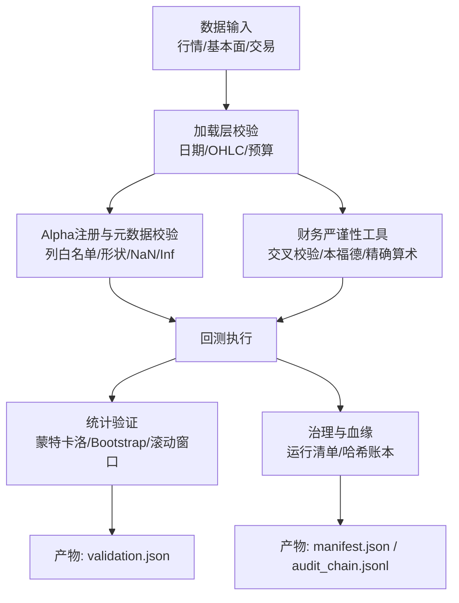
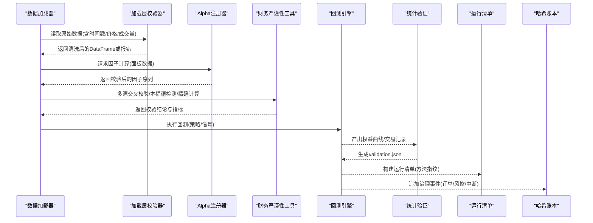
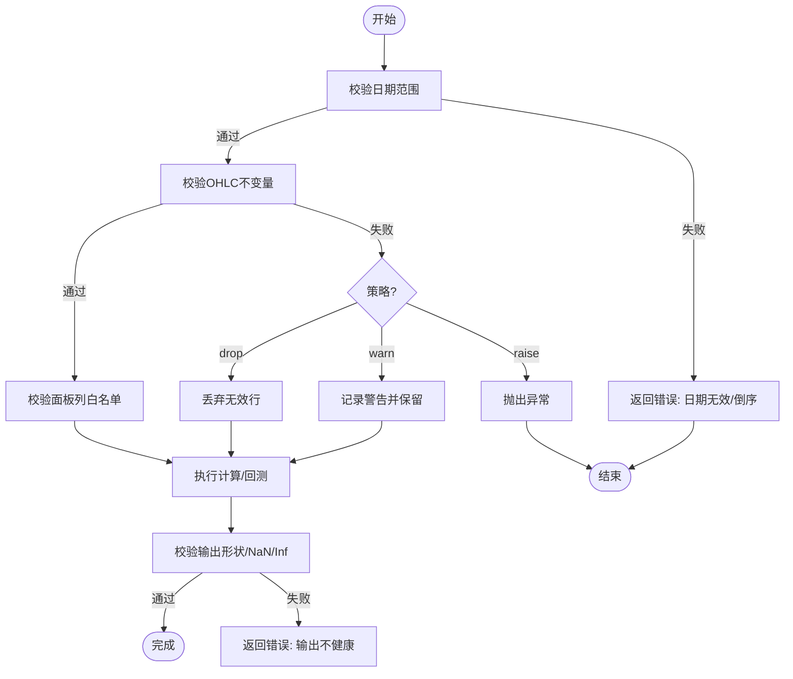
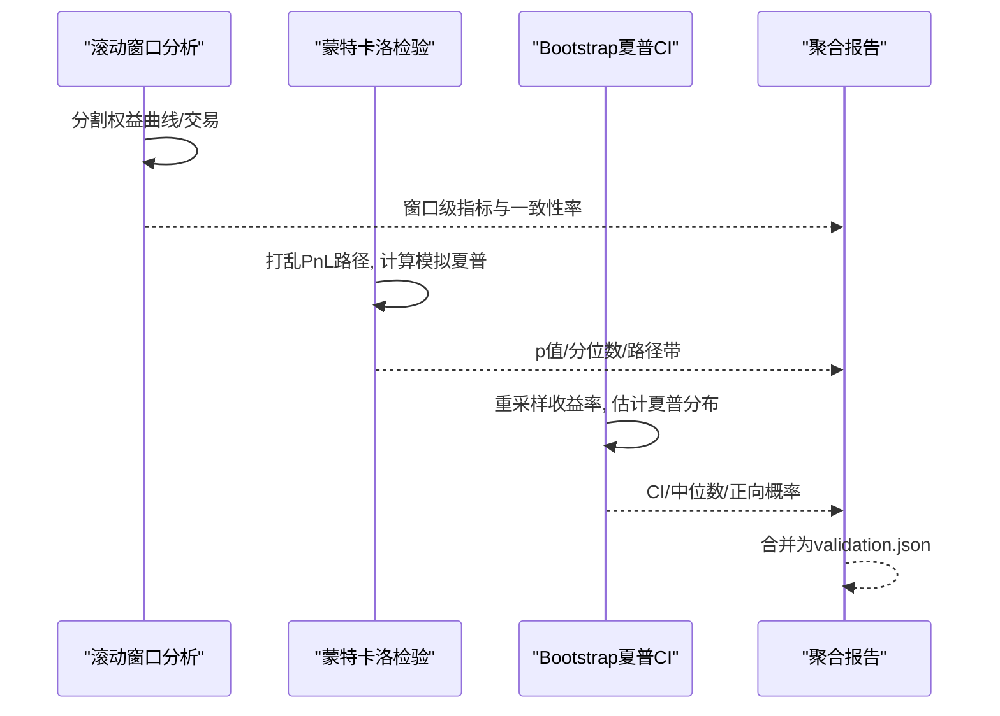
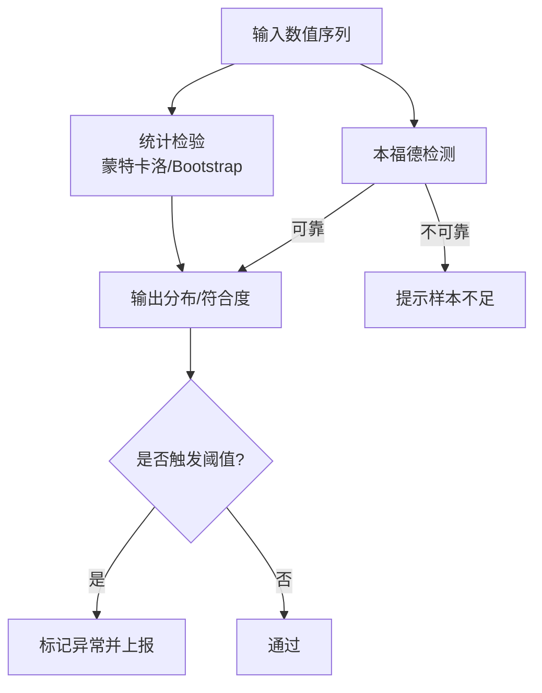
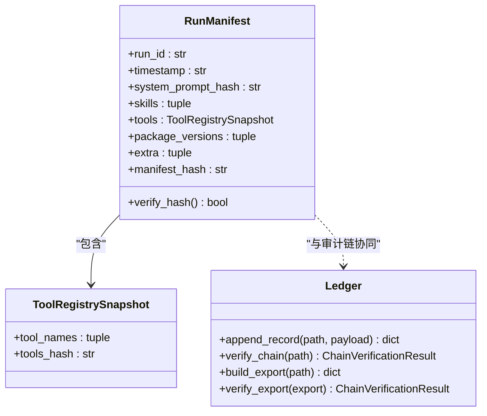
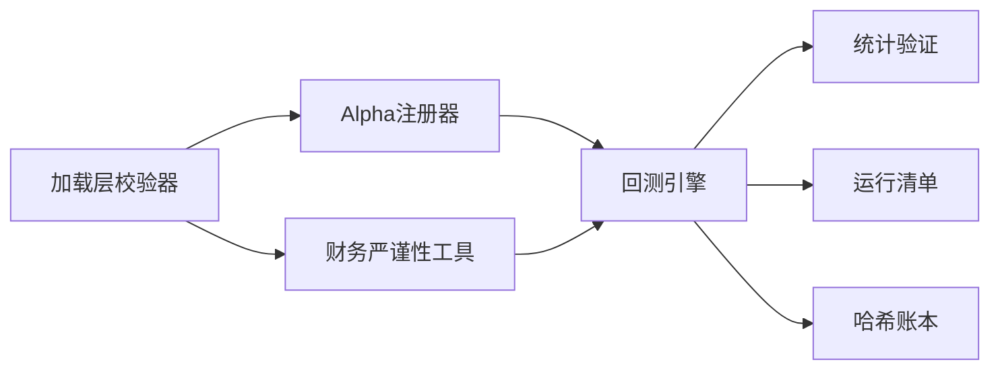

# 数据质量验证

<cite>
**本文引用的文件**
- [agent/backtest/validation.py](file://agent/backtest/validation.py)
- [agent/src/tools/financial_rigor_tool.py](file://agent/src/tools/financial_rigor_tool.py)
- [agent/backtest/loaders/base.py](file://agent/backtest/loaders/base.py)
- [agent/src/factors/registry.py](file://agent/src/factors/registry.py)
- [agent/src/governance/ledger.py](file://agent/src/governance/ledger.py)
- [agent/src/governance/manifest.py](file://agent/src/governance/manifest.py)
</cite>

## 目录
1. [简介](#简介)
2. [项目结构](#项目结构)
3. [核心组件](#核心组件)
4. [架构总览](#架构总览)
5. [详细组件分析](#详细组件分析)
6. [依赖关系分析](#依赖关系分析)
7. [性能考量](#性能考量)
8. [故障排查指南](#故障排查指南)
9. [结论](#结论)
10. [附录](#附录)

## 简介
本技术文档面向数据治理工程师与质量保证人员，系统化阐述本项目中的数据质量验证框架：规则引擎、校验器模式、错误报告；完整性检查（必填字段、数据类型、范围限制）；逻辑一致性（业务规则、关联关系、时序一致）；异常检测（统计异常、模式匹配、机器学习检测思路）；数据血缘追踪（来源记录、转换日志、影响分析）；自定义验证规则开发指南；以及质量监控与告警机制。内容基于仓库中已实现的模块进行提炼与整合，确保可落地、可审计、可复用。

## 项目结构
围绕数据质量验证的相关代码主要分布在以下模块：
- 回测结果统计验证：蒙特卡洛置换检验、Bootstrap夏普置信区间、滚动窗口一致性
- 财务严谨性工具：精确小数算术、多源交叉校验、本福特定律检测、表达式安全计算
- 数据加载边界校验：日期范围、OHLC结构性不变量、预算与时限控制
- Alpha因子注册与输出校验：元数据严格校验、面板列白名单、输出形状与数值健康度
- 治理与血缘：哈希链式不可篡改账本、运行清单（方法指纹）、导出与离线核验

**图表来源**
- [agent/backtest/loaders/base.py:168-256](file://agent/backtest/loaders/base.py#L168-L256)
- [agent/src/factors/registry.py:69-125](file://agent/src/factors/registry.py#L69-L125)
- [agent/src/tools/financial_rigor_tool.py:143-345](file://agent/src/tools/financial_rigor_tool.py#L143-L345)
- [agent/backtest/validation.py:29-346](file://agent/backtest/validation.py#L29-L346)
- [agent/src/governance/manifest.py:356-430](file://agent/src/governance/manifest.py#L356-L430)
- [agent/src/governance/ledger.py:368-469](file://agent/src/governance/ledger.py#L368-L469)

**章节来源**
- [agent/backtest/loaders/base.py:168-256](file://agent/backtest/loaders/base.py#L168-L256)
- [agent/src/factors/registry.py:69-125](file://agent/src/factors/registry.py#L69-L125)
- [agent/src/tools/financial_rigor_tool.py:143-345](file://agent/src/tools/financial_rigor_tool.py#L143-L345)
- [agent/backtest/validation.py:29-346](file://agent/backtest/validation.py#L29-L346)
- [agent/src/governance/manifest.py:356-430](file://agent/src/governance/manifest.py#L356-L430)
- [agent/src/governance/ledger.py:368-469](file://agent/src/governance/ledger.py#L368-L469)

## 核心组件
- 规则引擎与校验器模式
  - 加载层校验器：统一对日期范围、OHLC结构性不变量进行“丢弃/警告/抛出”策略处理，作为数据进入系统的边界门控。
  - Alpha注册器校验器：对因子元数据做严格约束（列白名单、主题/宇宙/频率等），并在compute后对输出做形状、NaN/Inf比例等健康检查。
  - 财务严谨性工具：以子命令形式提供多种校验能力（市值校验、估值比率、多源交叉校验、本福德检测、安全表达式计算、三情景估值）。
- 错误报告
  - 统计验证结果以严格JSON写入artifacts/validation.json，非有限值被安全化，避免非法JSON。
  - 治理账本通过哈希链与fsync保证追加不可篡改，支持导出与离线核验。
- 数据血缘
  - 运行清单将系统提示词、注入技能、工具集、关键包版本组合为内容地址化的指纹，便于复现与差异比对。
  - 哈希链式账本记录每笔关键事件，支持归档、旋转与全链路核验。

**章节来源**
- [agent/backtest/loaders/base.py:168-256](file://agent/backtest/loaders/base.py#L168-L256)
- [agent/src/factors/registry.py:69-125](file://agent/src/factors/registry.py#L69-L125)
- [agent/src/tools/financial_rigor_tool.py:143-345](file://agent/src/tools/financial_rigor_tool.py#L143-L345)
- [agent/backtest/validation.py:453-505](file://agent/backtest/validation.py#L453-L505)
- [agent/src/governance/manifest.py:356-430](file://agent/src/governance/manifest.py#L356-L430)
- [agent/src/governance/ledger.py:368-469](file://agent/src/governance/ledger.py#L368-L469)

## 架构总览
下图展示从数据接入到质量验证与血缘记录的端到端流程，体现“先校验、再计算、后验证、可追溯”的治理闭环。

**图表来源**
- [agent/backtest/loaders/base.py:168-256](file://agent/backtest/loaders/base.py#L168-L256)
- [agent/src/factors/registry.py:321-397](file://agent/src/factors/registry.py#L321-L397)
- [agent/src/tools/financial_rigor_tool.py:518-589](file://agent/src/tools/financial_rigor_tool.py#L518-L589)
- [agent/backtest/validation.py:291-346](file://agent/backtest/validation.py#L291-L346)
- [agent/src/governance/manifest.py:356-430](file://agent/src/governance/manifest.py#L356-L430)
- [agent/src/governance/ledger.py:368-469](file://agent/src/governance/ledger.py#L368-L469)

## 详细组件分析

### 完整性检查：必填字段、数据类型、范围限制
- 日期范围校验：强制start_date ≤ end_date，格式无效时抛出明确错误。
- OHLC结构性不变量：high≥open/close、low≤open/close、禁止非正价格（可配置允许负价但拒绝零价），支持drop/warn/raise三种策略。
- Alpha面板列白名单：仅允许已知价格列或fund:前缀的基本面列，防止未知列污染下游计算。
- Alpha输出健康度：要求输出为DataFrame且与close同形，禁止inf，限制NaN比例（>95%视为失败）。

**图表来源**
- [agent/backtest/loaders/base.py:168-256](file://agent/backtest/loaders/base.py#L168-L256)
- [agent/src/factors/registry.py:69-125](file://agent/src/factors/registry.py#L69-L125)
- [agent/src/factors/registry.py:401-422](file://agent/src/factors/registry.py#L401-L422)

**章节来源**
- [agent/backtest/loaders/base.py:168-256](file://agent/backtest/loaders/base.py#L168-L256)
- [agent/src/factors/registry.py:69-125](file://agent/src/factors/registry.py#L69-L125)
- [agent/src/factors/registry.py:401-422](file://agent/src/factors/registry.py#L401-L422)

### 逻辑一致性：业务规则、关联关系、时序一致
- 多源交叉校验：以中位数为共识基准，逐源计算偏差百分比，超过容忍阈值标记不一致，适合财报/行情多源对齐。
- 时序一致性：滚动窗口分析将回测划分为多个独立窗口，分别评估收益、夏普、最大回撤与胜率，汇总一致性指标，识别过拟合与不稳定。
- 蒙特卡洛置换检验：打乱交易PnL顺序，评估观察到的夏普/最大回撤是否显著优于随机路径，防范路径依赖导致的虚假稳健。
- Bootstrap夏普置信区间：对日收益率重采样估计夏普分布，给出置信区间与正向概率，衡量风险调整后收益稳定性。

**图表来源**
- [agent/backtest/validation.py:29-113](file://agent/backtest/validation.py#L29-L113)
- [agent/backtest/validation.py:142-203](file://agent/backtest/validation.py#L142-L203)
- [agent/backtest/validation.py:214-291](file://agent/backtest/validation.py#L214-L291)
- [agent/backtest/validation.py:453-505](file://agent/backtest/validation.py#L453-L505)

**章节来源**
- [agent/src/tools/financial_rigor_tool.py:233-283](file://agent/src/tools/financial_rigor_tool.py#L233-L283)
- [agent/backtest/validation.py:29-113](file://agent/backtest/validation.py#L29-L113)
- [agent/backtest/validation.py:142-203](file://agent/backtest/validation.py#L142-L203)
- [agent/backtest/validation.py:214-291](file://agent/backtest/validation.py#L214-L291)
- [agent/backtest/validation.py:453-505](file://agent/backtest/validation.py#L453-L505)

### 异常检测：统计异常、模式匹配、机器学习检测
- 统计异常：蒙特卡洛与Bootstrap提供路径稳健性与参数稳定性的量化证据，结合滚动窗口一致性率识别异常波动。
- 模式匹配：本福德第一数字定律用于检测人为操纵或合成数据的分布异常，需≥50样本才具可靠性，输出MAD/卡方/符合度等级。
- 机器学习检测（建议扩展）：可在现有流水线中引入无监督异常检测（如Isolation Forest、AutoEncoder）对因子序列或残差分布建模，结合滚动窗口进行在线评分与告警。

**图表来源**
- [agent/src/tools/financial_rigor_tool.py:286-345](file://agent/src/tools/financial_rigor_tool.py#L286-L345)
- [agent/backtest/validation.py:29-113](file://agent/backtest/validation.py#L29-L113)
- [agent/backtest/validation.py:142-203](file://agent/backtest/validation.py#L142-L203)

**章节来源**
- [agent/src/tools/financial_rigor_tool.py:286-345](file://agent/src/tools/financial_rigor_tool.py#L286-L345)
- [agent/backtest/validation.py:29-113](file://agent/backtest/validation.py#L29-L113)
- [agent/backtest/validation.py:142-203](file://agent/backtest/validation.py#L142-L203)

### 数据血缘追踪：来源记录、转换日志、影响分析
- 来源记录：加载层在缓存键与元数据中记录source/symbol/timeframe/date range/fields，便于溯源与去重。
- 转换日志：Alpha注册器在compute前后记录输入面板与输出形状，失败时隔离异常并记录原因；财务工具返回结构化结论。
- 影响分析：运行清单对系统提示词、注入技能、工具集、关键包版本进行内容地址化哈希，支持两次运行间的差异对比，定位方法变更的影响。
- 不可篡改审计：哈希链式账本对每笔关键事件追加记录，支持归档、旋转与全链路核验，任何编辑或删除均可被检测。

**图表来源**
- [agent/src/governance/manifest.py:128-215](file://agent/src/governance/manifest.py#L128-L215)
- [agent/src/governance/manifest.py:356-430](file://agent/src/governance/manifest.py#L356-L430)
- [agent/src/governance/ledger.py:368-469](file://agent/src/governance/ledger.py#L368-L469)
- [agent/src/governance/ledger.py:496-585](file://agent/src/governance/ledger.py#L496-L585)

**章节来源**
- [agent/backtest/loaders/base.py:506-547](file://agent/backtest/loaders/base.py#L506-L547)
- [agent/src/factors/registry.py:321-397](file://agent/src/factors/registry.py#L321-L397)
- [agent/src/governance/manifest.py:356-430](file://agent/src/governance/manifest.py#L356-L430)
- [agent/src/governance/ledger.py:368-469](file://agent/src/governance/ledger.py#L368-L469)
- [agent/src/governance/ledger.py:496-585](file://agent/src/governance/ledger.py#L496-L585)

### 自定义验证规则开发指南
- 新增加载层校验器
  - 在加载边界实现函数，遵循validate_ohlc风格：定义不变量集合、策略（drop/warn/raise）、返回清洗后帧或抛出异常。
  - 在调用处插入校验步骤，确保所有来源统一经过该门控。
- 新增Alpha元数据校验
  - 在AlphaMeta或相关校验函数中添加新字段约束（如新的列命名空间、阈值范围），保持frozen与forbid额外字段。
  - 在compute后增加输出健康检查（形状、NaN/Inf比例），失败时抛出RegistryError。
- 新增财务严谨性子命令
  - 在工具类中新增command分支，定义参数schema与execute路由，使用Decimal精确算术，返回结构化JSON。
  - 添加单元测试覆盖边界条件与错误路径。
- 新增统计验证项
  - 在validation模块新增函数，接收equity_curve/trades/initial_capital，返回字典指标；在run_validation中按配置启用。
  - 确保write_validation_json能安全序列化结果（非有限值转null）。

**章节来源**
- [agent/backtest/loaders/base.py:168-256](file://agent/backtest/loaders/base.py#L168-L256)
- [agent/src/factors/registry.py:69-125](file://agent/src/factors/registry.py#L69-L125)
- [agent/src/factors/registry.py:401-422](file://agent/src/factors/registry.py#L401-L422)
- [agent/src/tools/financial_rigor_tool.py:518-589](file://agent/src/tools/financial_rigor_tool.py#L518-L589)
- [agent/backtest/validation.py:291-346](file://agent/backtest/validation.py#L291-L346)
- [agent/backtest/validation.py:453-505](file://agent/backtest/validation.py#L453-L505)

### 质量监控与告警机制
- 监控点
  - 加载层：OHLC违规计数、日期范围错误、预算超时。
  - Alpha层：缺失列/板块标签、输出NaN/Inf比例、import/compute异常。
  - 统计验证：p值、置信区间宽度、一致性率、正向概率。
  - 财务工具：交叉校验不一致源数量、本福德不符合度。
  - 治理：账本链断裂、导出哈希不匹配。
- 告警策略
  - 阈值告警：例如NaN比例>5%、一致性率<0.6、p值>0.05、本福德MAD>0.015。
  - 事件告警：账本追加失败、fsync降级、旋转失败。
  - 可视化：validation.json与manifest.json纳入报表，配合看板展示趋势与异常热点。

**章节来源**
- [agent/backtest/loaders/base.py:377-450](file://agent/backtest/loaders/base.py#L377-L450)
- [agent/src/factors/registry.py:321-397](file://agent/src/factors/registry.py#L321-L397)
- [agent/backtest/validation.py:29-113](file://agent/backtest/validation.py#L29-L113)
- [agent/src/tools/financial_rigor_tool.py:286-345](file://agent/src/tools/financial_rigor_tool.py#L286-L345)
- [agent/src/governance/ledger.py:614-662](file://agent/src/governance/ledger.py#L614-L662)

## 依赖关系分析
- 低耦合高内聚
  - 加载层校验器独立于具体数据源，通用性强。
  - Alpha注册器与计算模块解耦，仅通过面板契约交互。
  - 财务工具纯函数化，无I/O，易于测试与复用。
  - 统计验证与回测解耦，可独立运行与集成。
  - 治理模块与业务逻辑解耦，仅通过接口写入/核验。
- 外部依赖
  - numpy/pandas用于数值与时间序列处理。
  - duckdb用于本地缓存读写（可选）。
  - yaml.safe_load用于受限YAML解析（大小上限保护）。

**图表来源**
- [agent/backtest/loaders/base.py:168-256](file://agent/backtest/loaders/base.py#L168-L256)
- [agent/src/factors/registry.py:321-397](file://agent/src/factors/registry.py#L321-L397)
- [agent/src/tools/financial_rigor_tool.py:518-589](file://agent/src/tools/financial_rigor_tool.py#L518-L589)
- [agent/backtest/validation.py:291-346](file://agent/backtest/validation.py#L291-L346)
- [agent/src/governance/manifest.py:356-430](file://agent/src/governance/manifest.py#L356-L430)
- [agent/src/governance/ledger.py:368-469](file://agent/src/governance/ledger.py#L368-L469)

**章节来源**
- [agent/backtest/loaders/base.py:168-256](file://agent/backtest/loaders/base.py#L168-L256)
- [agent/src/factors/registry.py:321-397](file://agent/src/factors/registry.py#L321-L397)
- [agent/src/tools/financial_rigor_tool.py:518-589](file://agent/src/tools/financial_rigor_tool.py#L518-L589)
- [agent/backtest/validation.py:291-346](file://agent/backtest/validation.py#L291-L346)
- [agent/src/governance/manifest.py:356-430](file://agent/src/governance/manifest.py#L356-L430)
- [agent/src/governance/ledger.py:368-469](file://agent/src/governance/ledger.py#L368-L469)

## 性能考量
- 蒙特卡洛路径矩阵内存控制：当n_simulations×len(pnls)过大时跳过存储完整路径，仅保留必要统计与抽样。
- Bootstrap样本规模限制：当n_bootstrap≤20000时附带sharpe_samples，避免过大JSON。
- 滚动窗口划分：按固定window_size切分，避免重叠带来的冗余计算。
- 加载层重试与预算：bounded retry+deadline防止长时间阻塞，保障整体吞吐。
- 本地缓存：可选parquet缓存减少重复拉取，读/写失败均非致命，不影响主流程。

[本节为通用指导，无需引用具体文件]

## 故障排查指南
- 加载层问题
  - 日期格式错误或start>end：检查输入字符串与解析逻辑。
  - OHLC违规：确认数据源是否合法，选择合适策略（drop/warn/raise）。
  - 预算超时：检查网络延迟与分页逻辑，调整budget_s或backoff。
- Alpha计算问题
  - 缺失列/板块：核对__alpha_meta__声明与实际面板。
  - 输出NaN/Inf：检查公式除零、无穷大、极端值处理。
- 统计验证问题
  - 样本不足：确保至少3笔交易/5条收益率观测。
  - 非有限值：write_validation_json会安全化处理，检查上游计算。
- 财务工具问题
  - 参数缺失/类型错误：根据子命令schema补齐必填项。
  - 本福德不可靠：样本数<50时无法得出有效结论。
- 治理问题
  - 账本链断裂：检查prev_record_hash/record_hash一致性，必要时重新生成。
  - 导出哈希不匹配：确认导出包未被篡改。

**章节来源**
- [agent/backtest/loaders/base.py:168-256](file://agent/backtest/loaders/base.py#L168-L256)
- [agent/backtest/loaders/base.py:377-450](file://agent/backtest/loaders/base.py#L377-L450)
- [agent/src/factors/registry.py:321-397](file://agent/src/factors/registry.py#L321-L397)
- [agent/backtest/validation.py:29-113](file://agent/backtest/validation.py#L29-L113)
- [agent/backtest/validation.py:142-203](file://agent/backtest/validation.py#L142-L203)
- [agent/src/tools/financial_rigor_tool.py:518-589](file://agent/src/tools/financial_rigor_tool.py#L518-L589)
- [agent/src/governance/ledger.py:309-324](file://agent/src/governance/ledger.py#L309-L324)
- [agent/src/governance/ledger.py:544-585](file://agent/src/governance/ledger.py#L544-L585)

## 结论
本项目构建了覆盖“数据接入—计算—验证—审计”的全链路数据质量保障体系：以加载层校验器与Alpha注册器为核心门控，以财务严谨性工具与统计验证为质量度量，以运行清单与哈希账本为血缘与合规基础。该体系具备强约束、可审计、可扩展的特点，适合在量化研究与生产环境中持续演进。建议在此基础上补充在线异常检测与可视化告警，进一步提升实时性与可操作性。

[本节为总结性内容，无需引用具体文件]

## 附录
- 常用校验入口参考
  - 加载层：validate_date_range、validate_ohlc
  - Alpha注册：AlphaMeta、Registry.compute/_validate_output
  - 财务工具：FinancialRigorTool.execute与各子命令
  - 统计验证：monte_carlo_test、bootstrap_sharpe_ci、walk_forward_analysis、run_validation
  - 治理：build_run_manifest、append_record、verify_chain、build_export

**章节来源**
- [agent/backtest/loaders/base.py:168-256](file://agent/backtest/loaders/base.py#L168-L256)
- [agent/src/factors/registry.py:321-397](file://agent/src/factors/registry.py#L321-L397)
- [agent/src/tools/financial_rigor_tool.py:518-589](file://agent/src/tools/financial_rigor_tool.py#L518-L589)
- [agent/backtest/validation.py:29-346](file://agent/backtest/validation.py#L29-L346)
- [agent/src/governance/manifest.py:356-430](file://agent/src/governance/manifest.py#L356-L430)
- [agent/src/governance/ledger.py:368-469](file://agent/src/governance/ledger.py#L368-L469)