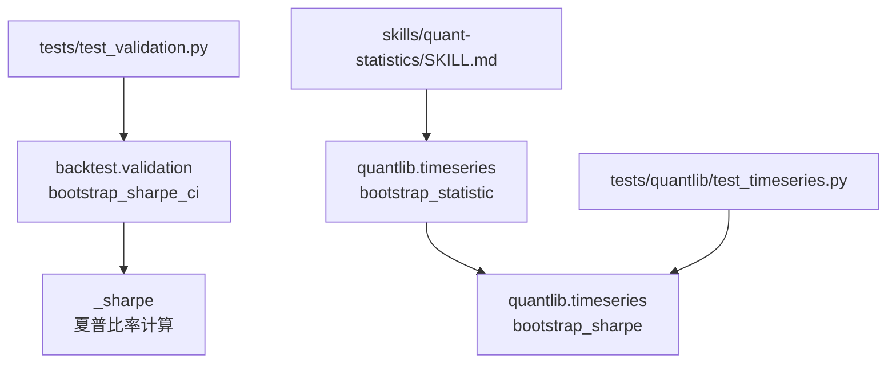
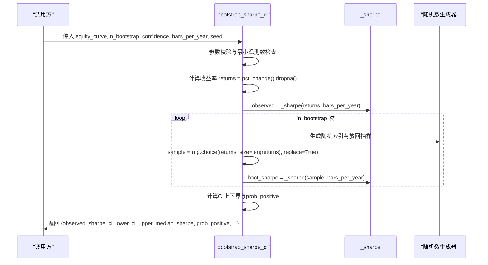
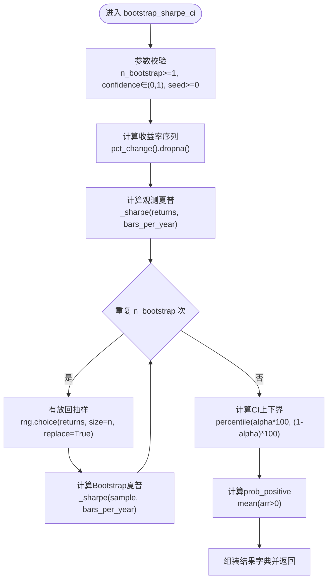
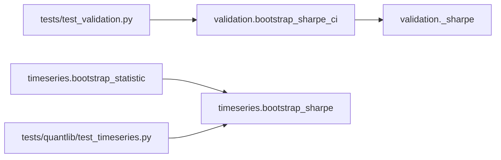

# Bootstrap夏普置信区间

<cite>
**本文引用的文件**
- [agent/backtest/validation.py](file://agent/backtest/validation.py)
- [agent/src/quantlib/timeseries.py](file://agent/src/quantlib/timeseries.py)
- [agent/tests/test_validation.py](file://agent/tests/test_validation.py)
- [agent/tests/quantlib/test_timeseries.py](file://agent/tests/quantlib/test_timeseries.py)
- [agent/skills/quant-statistics/SKILL.md](file://agent/skills/quant-statistics/SKILL.md)
</cite>

## 目录
1. [简介](#简介)
2. [项目结构](#项目结构)
3. [核心组件](#核心组件)
4. [架构总览](#架构总览)
5. [详细组件分析](#详细组件分析)
6. [依赖关系分析](#依赖关系分析)
7. [性能考量](#性能考量)
8. [故障排查指南](#故障排查指南)
9. [结论](#结论)
10. [附录：参数与返回字段说明、使用示例与解读指南](#附录参数与返回字段说明使用示例与解读指南)

## 简介
本技术文档聚焦于“Bootstrap夏普置信区间”的实现与使用，面向量化回测结果的风险调整后收益稳定性评估。文档从统计学原理出发，解释重采样（有放回抽样）、构建Bootstrap分布、估计置信区间的流程；并详细说明夏普比率置信区间的计算过程，包括收益率标准化、年化因子处理、百分位数方法的使用。同时，文档对函数参数与返回字段进行完整文档化，并提供不同置信水平的应用场景与解读指南，帮助读者判断策略风险调整后收益的稳健性。

## 项目结构
与Bootstrap夏普置信区间直接相关的代码主要分布在以下位置：
- 回测验证模块：提供基于权益曲线的Bootstrap夏普置信区间实现与集成入口。
- 时间序列统计模块：提供通用的Bootstrap统计量置信区间与针对夏普比率的专用实现。
- 测试与技能文档：覆盖边界条件、可复现性、不同置信水平的行为以及使用示例。

图表来源
- [agent/backtest/validation.py:142-208](file://agent/backtest/validation.py#L142-L208)
- [agent/src/quantlib/timeseries.py:778-879](file://agent/src/quantlib/timeseries.py#L778-L879)
- [agent/tests/test_validation.py:148-209](file://agent/tests/test_validation.py#L148-L209)
- [agent/tests/quantlib/test_timeseries.py:545-617](file://agent/tests/quantlib/test_timeseries.py#L545-L617)
- [agent/skills/quant-statistics/SKILL.md:249-286](file://agent/skills/quant-statistics/SKILL.md#L249-L286)

章节来源
- [agent/backtest/validation.py:142-208](file://agent/backtest/validation.py#L142-L208)
- [agent/src/quantlib/timeseries.py:778-879](file://agent/src/quantlib/timeseries.py#L778-L879)

## 核心组件
- 权益曲线Bootstrap夏普置信区间：基于权益曲线的一阶差分得到日度收益率序列，采用有放回重采样生成Bootstrap样本，计算每个样本的年化夏普比率，最终通过百分位数法估计置信区间。
- 通用Bootstrap统计量置信区间：对任意统计量（如均值、中位数）进行非参数Bootstrap，适用于金融数据厚尾特性下的稳健推断。
- 夏普比率专用Bootstrap：对收益率序列进行Bootstrap，输出点估计、置信区间及显著性判断（区间是否完全大于零）。

章节来源
- [agent/backtest/validation.py:142-208](file://agent/backtest/validation.py#L142-L208)
- [agent/src/quantlib/timeseries.py:778-879](file://agent/src/quantlib/timeseries.py#L778-L879)

## 架构总览
下图展示了从权益曲线到Bootstrap夏普置信区间的整体流程，包括输入校验、收益率提取、重采样循环、统计量聚合与结果组装。

图表来源
- [agent/backtest/validation.py:142-203](file://agent/backtest/validation.py#L142-L203)
- [agent/backtest/validation.py:206-208](file://agent/backtest/validation.py#L206-L208)

## 详细组件分析

### 组件A：bootstrap_sharpe_ci（权益曲线Bootstrap夏普置信区间）
- 功能：对权益曲线进行一阶差分得到收益率序列，执行有放回重采样，计算每个Bootstrap样本的年化夏普比率，并以百分位数法估计置信区间。
- 关键步骤：
  - 输入校验：确保n_bootstrap为正整数、confidence在(0,1)、seed为非负整数。
  - 收益率提取：pct_change()并清理无穷值与缺失值。
  - 观测夏普：使用内部_sharpe函数计算年化夏普比率。
  - 重采样循环：每次从收益率序列中有放回抽取等长样本，计算Bootstrap夏普。
  - 置信区间：按alpha=(1-confidence)/2取百分位数作为上下界。
  - 概率指标：prob_positive为Bootstrap夏普大于0的比例。
- 返回值字段：
  - observed_sharpe：观测夏普比率（年化）。
  - ci_lower/ci_upper：置信区间上下界。
  - median_sharpe：Bootstrap夏普的中位数。
  - prob_positive：P(Sharpe > 0)。
  - confidence/n_bootstrap：回传配置参数。
  - sharpe_samples：当n_bootstrap不超过阈值时附带全部Bootstrap样本（便于可视化或进一步分析）。

图表来源
- [agent/backtest/validation.py:142-203](file://agent/backtest/validation.py#L142-L203)
- [agent/backtest/validation.py:206-208](file://agent/backtest/validation.py#L206-L208)

章节来源
- [agent/backtest/validation.py:142-208](file://agent/backtest/validation.py#L142-L208)

### 组件B：bootstrap_statistic（通用Bootstrap统计量置信区间）
- 功能：对任意统计量进行非参数Bootstrap，无需假设正态分布，适合金融数据的厚尾特性。
- 关键点：
  - 逐次重采样避免构造大型(n_bootstrap, n)矩阵以节省内存。
  - 支持任意统计函数（如np.mean、np.median）。
  - 返回point_estimate、bootstrap_mean、bootstrap_std、ci_lower、ci_upper、confidence。
- 适用场景：除夏普外，还可用于因子收益、最大回撤等的置信区间估计。

章节来源
- [agent/src/quantlib/timeseries.py:778-824](file://agent/src/quantlib/timeseries.py#L778-L824)

### 组件C：bootstrap_sharpe（收益率序列Bootstrap夏普）
- 功能：对收益率序列进行Bootstrap，输出夏普置信区间与显著性判断（is_significant）。
- 差异说明：
  - 分母标准差默认使用样本标准差（ddof=1），与回测引擎中的_population标准差（ddof=0）略有差异。
  - 年化因子periods_per_year可配置（如252表示日线）。
- 返回值：包含point_estimate、ci_lower、ci_upper、confidence、is_significant等。

章节来源
- [agent/src/quantlib/timeseries.py:827-879](file://agent/src/quantlib/timeseries.py#L827-L879)
- [agent/skills/quant-statistics/SKILL.md:249-286](file://agent/skills/quant-statistics/SKILL.md#L249-L286)

## 依赖关系分析
- backtest.validation.bootstrap_sharpe_ci依赖：
  - numpy/pandas用于数值计算与时间序列处理。
  - 内部_sharpe函数用于夏普比率计算。
- quantlib.timeseries.bootstrap_statistic与bootstrap_sharpe：
  - 纯numpy实现，无外部依赖。
  - 提供通用Bootstrap框架与夏普专用封装。
- 测试用例覆盖：
  - 边界条件（空序列、过少观测、非法参数）。
  - 可复现性（固定seed）。
  - 不同置信水平下区间宽度变化。
  - 显著性判断与误报率控制。

图表来源
- [agent/backtest/validation.py:142-208](file://agent/backtest/validation.py#L142-L208)
- [agent/src/quantlib/timeseries.py:778-879](file://agent/src/quantlib/timeseries.py#L778-L879)
- [agent/tests/test_validation.py:148-209](file://agent/tests/test_validation.py#L148-L209)
- [agent/tests/quantlib/test_timeseries.py:545-617](file://agent/tests/quantlib/test_timeseries.py#L545-L617)

章节来源
- [agent/backtest/validation.py:142-208](file://agent/backtest/validation.py#L142-L208)
- [agent/src/quantlib/timeseries.py:778-879](file://agent/src/quantlib/timeseries.py#L778-L879)
- [agent/tests/test_validation.py:148-209](file://agent/tests/test_validation.py#L148-L209)
- [agent/tests/quantlib/test_timeseries.py:545-617](file://agent/tests/quantlib/test_timeseries.py#L545-L617)

## 性能考量
- 内存优化：通用Bootstrap统计量实现逐次重采样，避免一次性构造(n_bootstrap, n)的大矩阵，降低内存占用。
- 计算复杂度：时间复杂度O(n_bootstrap * n)，其中n为收益率长度。可通过减少n_bootstrap或使用并行化（若需要）来平衡精度与速度。
- 年化因子影响：bars_per_year越大，年化夏普越高，但置信区间宽度也受波动率与样本量影响。需根据数据频率合理设置。
- 小样本问题：当收益率观测数过少时，Bootstrap可能不稳定，函数会返回错误提示以避免误导。

[本节为一般性指导，不直接分析具体文件]

## 故障排查指南
- 常见错误与处理：
  - n_bootstrap无效：必须为正整数且≥1。
  - confidence越界：必须在(0,1)之间且有限。
  - seed非法：必须为非负整数。
  - 观测数不足：收益率序列至少需要一定数量的有效观测（函数内部有最小观测数检查）。
- 异常路径：
  - 权益曲线含零或负值导致收益率无穷：函数会替换无穷值为0并丢弃缺失值，保证后续计算稳定。
  - 极端年化因子可能导致年化回报溢出：相关模块已做防护（例如OverflowError捕获）。
- 调试建议：
  - 固定seed以确保结果可复现。
  - 逐步检查输入数据（日期索引、收益率序列长度、是否存在NaN/Inf）。
  - 使用较小n_bootstrap先验证流程，再逐步增加以提高精度。

章节来源
- [agent/backtest/validation.py:162-176](file://agent/backtest/validation.py#L162-L176)
- [agent/tests/test_validation.py:170-194](file://agent/tests/test_validation.py#L170-L194)

## 结论
Bootstrap夏普置信区间提供了一种稳健的方法来评估策略风险调整后收益的稳定性，尤其适用于金融数据常见的厚尾与非正态分布特征。通过有放回重采样构建Bootstrap分布，并使用百分位数法估计置信区间，可以在不依赖强分布假设的前提下，量化夏普比率的不确定性。结合prob_positive与置信区间上下界，可以更全面地判断策略的正向收益是否显著且稳定。

[本节为总结性内容，不直接分析具体文件]

## 附录：参数与返回字段说明、使用示例与解读指南

### 函数参数说明（bootstrap_sharpe_ci）
- equity_curve：权益曲线（时间序列），用于计算收益率。
- n_bootstrap：重采样次数，越大越稳定但计算成本更高。
- confidence：置信水平，如0.95表示95%置信区间。
- bars_per_year：年化因子，如日线通常设为252。
- seed：随机种子，用于结果可复现。

章节来源
- [agent/backtest/validation.py:142-161](file://agent/backtest/validation.py#L142-L161)

### 返回结果字段说明
- observed_sharpe：观测夏普比率（年化）。
- ci_lower/ci_upper：置信区间上下界。
- median_sharpe：Bootstrap夏普的中位数。
- prob_positive：P(Sharpe > 0)，即Bootstrap夏普大于0的比例。
- confidence/n_bootstrap：回传配置参数。
- sharpe_samples：当n_bootstrap不超过阈值时附带的全部Bootstrap样本。

章节来源
- [agent/backtest/validation.py:192-203](file://agent/backtest/validation.py#L192-L203)

### 实际代码示例（路径引用）
- 基本用法与字段断言：
  - [agent/tests/test_validation.py:148-155](file://agent/tests/test_validation.py#L148-L155)
- 自定义置信水平与区间宽度比较：
  - [agent/tests/test_validation.py:202-209](file://agent/tests/test_validation.py#L202-L209)
- 通用Bootstrap统计量与夏普专用实现：
  - [agent/src/quantlib/timeseries.py:778-879](file://agent/src/quantlib/timeseries.py#L778-L879)
- 技能文档中的使用示例：
  - [agent/skills/quant-statistics/SKILL.md:249-286](file://agent/skills/quant-statistics/SKILL.md#L249-L286)

### 置信区间解读指南
- 区间完全大于0：表明在当前置信水平下，策略的夏普比率显著为正，风险调整后收益具有统计意义。
- 区间包含0：无法拒绝“夏普为零”的原假设，策略的正向收益可能由噪声驱动。
- prob_positive接近1：高概率表明策略在重采样下仍保持正向收益，稳健性较强。
- 不同置信水平：
  - 90%置信区间较窄，适合快速筛选。
  - 95%/99%置信区间更宽，提供更保守的评估。
- 结合其他指标：
  - 与Walk-Forward分析、蒙特卡洛置换检验一起使用，综合评估策略的稳定性和显著性。

[本节为概念性指导，不直接分析具体文件]