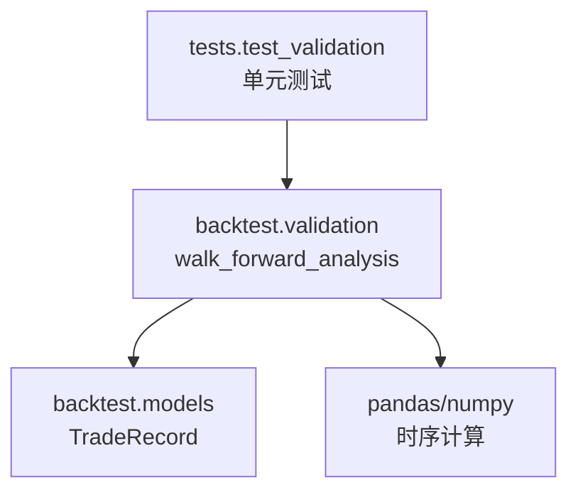
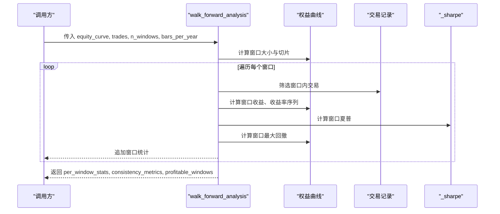
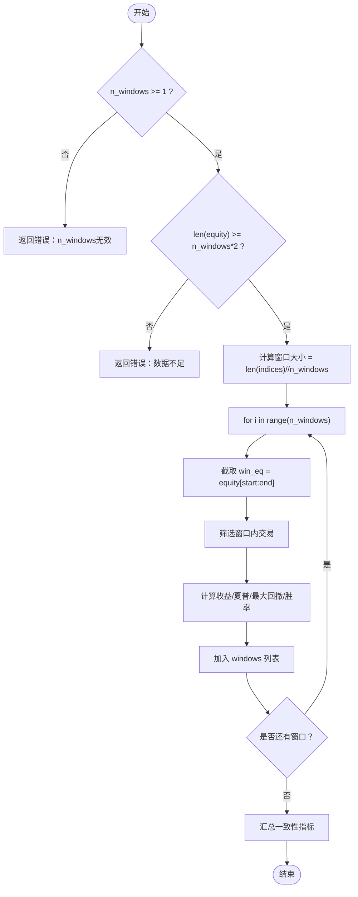
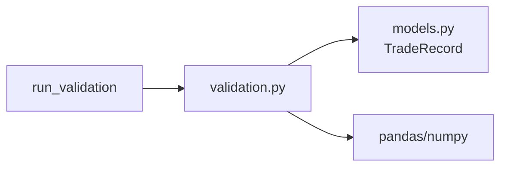

# 前向分析

<cite>
**本文引用的文件**
- [validation.py](file://agent/backtest/validation.py)
- [models.py](file://agent/backtest/models.py)
- [test_validation.py](file://agent/tests/test_validation.py)
</cite>

## 目录
1. [简介](#简介)
2. [项目结构](#项目结构)
3. [核心组件](#核心组件)
4. [架构总览](#架构总览)
5. [详细组件分析](#详细组件分析)
6. [依赖关系分析](#依赖关系分析)
7. [性能与一致性评估](#性能与一致性评估)
8. [滚动评估方法](#滚动评估方法)
9. [参数与返回结果说明](#参数与返回结果说明)
10. [窗口配置建议](#窗口配置建议)
11. [故障排查指南](#故障排查指南)
12. [结论](#结论)

## 简介
本技术文档聚焦于“前向分析（Walk-Forward Analysis）”的实现与使用，解释如何将回测数据划分为非重叠的时间段、对每个窗口独立评估策略表现，并汇总窗口间的一致性指标。文档涵盖：
- 时间窗口分割原理与实现细节
- 每窗口独立评估方法（收益、夏普比率、最大回撤、胜率等）
- 性能一致性检查（收益分布、夏普稳定性、最大回撤变化）
- 滚动评估方法与时间序列交叉验证思路
- 函数参数与返回结果的详细说明
- 窗口配置建议与实际使用示例解读

## 项目结构
前向分析功能位于回测验证模块中，主要代码集中在 validation.py，数据结构定义在 models.py，测试用例在 test_validation.py。该模块提供三种统计验证工具：蒙特卡洛置换检验、Bootstrap 夏普置信区间、以及前向分析（Walk-Forward）。其中前向分析用于评估策略在不同时间段内的稳定性。

图表来源
- [validation.py:214-291](file://agent/backtest/validation.py#L214-L291)
- [models.py:62-99](file://agent/backtest/models.py#L62-L99)

章节来源
- [validation.py:1-10](file://agent/backtest/validation.py#L1-L10)
- [models.py:1-118](file://agent/backtest/models.py#L1-L118)
- [test_validation.py:212-273](file://agent/tests/test_validation.py#L212-L273)

## 核心组件
- walk_forward_analysis：将权益曲线按时间切分为 n_windows 个非重叠窗口，逐窗口计算收益、夏普、最大回撤、交易数与胜率，并汇总一致性指标。
- _sharpe：基于日频收益率计算年化夏普比率（可配置 bars_per_year）。
- run_validation：统一调度器，根据配置决定是否执行前向分析。
- TradeRecord：完成交易的不可变记录，包含入场/出场价格、时间、盈亏、持仓时长等字段，用于窗口内交易筛选与胜率计算。

章节来源
- [validation.py:206-291](file://agent/backtest/validation.py#L206-L291)
- [validation.py:291-346](file://agent/backtest/validation.py#L291-L346)
- [models.py:62-99](file://agent/backtest/models.py#L62-L99)

## 架构总览
前向分析的数据流如下：输入为权益曲线与交易记录；按时间顺序等分窗口；在每个窗口内计算独立指标；最后聚合得到一致性指标。

图表来源
- [validation.py:214-291](file://agent/backtest/validation.py#L214-L291)

## 详细组件分析

### 时间窗口分割原理
- 非重叠划分：将权益曲线的索引长度整除 n_windows，得到固定窗口大小；最后一个窗口覆盖剩余数据，确保覆盖完整时间范围。
- 边界处理：start_idx = i * window_size，end_idx = (i+1)*window_size（最后一个窗口取到末尾），保证首尾衔接且无遗漏。
- 窗口内交易筛选：仅保留 entry_time 落在窗口起止范围内的成交记录，用于计算窗口内胜率与交易数。

图表来源
- [validation.py:233-291](file://agent/backtest/validation.py#L233-L291)

章节来源
- [validation.py:233-291](file://agent/backtest/validation.py#L233-L291)

### 每窗口独立评估方法
- 收益：win_eq.iloc[-1]/win_eq.iloc[0] - 1（若起始值为正），否则为 0。
- 收益率序列：pct_change() 后替换无穷值并去空，用于夏普计算。
- 夏普比率：_sharpe(returns, bars_per_year)，标准差估计年化风险调整收益。
- 最大回撤：以累计峰值为基准，计算相对回撤的最小值。
- 交易与胜率：窗口内交易数量与盈利交易占比。

章节来源
- [validation.py:249-275](file://agent/backtest/validation.py#L249-L275)
- [validation.py:206-208](file://agent/backtest/validation.py#L206-L208)

### 性能一致性检查
- 收益分布：收集各窗口 return，计算均值与标准差，观察跨期波动。
- 夏普稳定性：收集各窗口 sharpe，计算均值与标准差，衡量风险调整后收益的稳定性。
- 最大回撤变化：通过窗口 max_dd 观察不同市场环境下回撤的深度与恢复能力。
- 一致性率：profitable_windows / n_windows，反映策略在多数窗口是否盈利。

章节来源
- [validation.py:277-291](file://agent/backtest/validation.py#L277-L291)

### 滚动评估方法与时间序列交叉验证
当前实现为非重叠窗口的前向分析。滚动评估可通过以下思路扩展：
- 窗口大小选择：根据策略频率与样本量选择合适窗口长度（如年频或季度频），保证每个窗口有足够观测值以稳定估计夏普与回撤。
- 重叠策略：滑动窗口（例如固定长度窗口向前滑动）可增加评估样本，但需考虑相邻窗口相关性。
- 时间序列交叉验证：将历史数据划分为训练/验证块，依次滚动训练并评估，避免未来信息泄露。

注意：上述为概念性指导，当前仓库未直接实现滚动评估逻辑。

[本节为概念性内容，不直接分析具体文件]

## 依赖关系分析
- 模块依赖：validation.py 依赖 pandas/numpy 进行时序与统计计算，依赖 backtest.models.TradeRecord 表示交易记录。
- 耦合度：walk_forward_analysis 与 _sharpe 解耦良好；窗口指标计算与一致性汇总分离清晰。
- 外部集成：run_validation 作为调度器，读取配置并调用 walk_forward_analysis，便于在回测流程中自动启用。

图表来源
- [validation.py:208-346](file://agent/backtest/validation.py#L208-L346)
- [models.py:62-99](file://agent/backtest/models.py#L62-L99)

章节来源
- [validation.py:208-346](file://agent/backtest/validation.py#L208-L346)
- [models.py:62-99](file://agent/backtest/models.py#L62-L99)

## 性能与一致性评估
- 收益分布：通过 returns_list 的均值与标准差判断策略在不同窗口的收益稳定性。
- 夏普稳定性：sharpes_list 的均值与标准差衡量风险调整后收益的跨期一致性。
- 最大回撤变化：max_dd 在各窗口的变化可揭示极端行情下的脆弱点。
- 一致性率：高一致性率表明策略在多数时间段内能保持正向收益。

章节来源
- [validation.py:277-291](file://agent/backtest/validation.py#L277-L291)

## 滚动评估方法
- 窗口大小选择：建议至少保证每个窗口有数十至数百个交易日，以便稳定估计夏普与回撤。
- 重叠策略：可采用滑动窗口提升评估样本量，但需注意窗口间的相关性与过拟合风险。
- 时间序列交叉验证：将数据划分为多个训练/验证块，依次滚动评估，避免使用未来信息。

[本节为概念性内容，不直接分析具体文件]

## 参数与返回结果说明

### 函数参数
- equity_curve：权益曲线（pandas Series），时间序列索引为交易日，值为账户净值或权益。
- trades：已完成交易记录列表（List[TradeRecord]），用于窗口内交易筛选与胜率计算。
- n_windows：非重叠窗口数量，必须为正整数；若小于 1 或类型非法，将返回错误信息。
- bars_per_year：年化因子，默认 252（A股常用），用于夏普比率年化。

章节来源
- [validation.py:214-228](file://agent/backtest/validation.py#L214-L228)
- [validation.py:233-236](file://agent/backtest/validation.py#L233-L236)

### 返回结果
- per_window_stats（windows）：每个窗口的统计字典，包含：
  - window：窗口序号
  - start/end：窗口起止日期
  - return：窗口总收益
  - sharpe：窗口年化夏普
  - max_dd：窗口最大回撤
  - trades：窗口内交易数量
  - win_rate：窗口胜率
- consistency_metrics（consistency_rate, return_mean/std, sharpe_mean/std）：
  - consistency_rate：盈利窗口比例
  - return_mean/std：窗口收益均值与标准差
  - sharpe_mean/std：窗口夏普均值与标准差
- profitable_windows：盈利窗口数量

章节来源
- [validation.py:264-291](file://agent/backtest/validation.py#L264-L291)

## 窗口配置建议
- 窗口数量 n_windows：
  - 数据量充足时（如多年日频数据），可设置 5-10 个窗口，平衡统计稳定性与细粒度。
  - 数据量有限时，减少窗口数量以避免单窗口样本过少导致指标不稳定。
- 窗口长度：
  - 建议每个窗口至少包含数十至数百个交易日，确保夏普与回撤估计可靠。
  - 对于低频策略（周/月频），可适当增加窗口长度。
- 市场环境考量：
  - 若存在明显结构性变化（如政策切换、牛熊转换），可结合业务背景调整窗口边界或采用分段评估。
- 滚动评估：
  - 如需更稳健的评估，可引入滑动窗口与时间序列交叉验证，但需控制复杂度与过拟合风险。

[本节为通用指导，不直接分析具体文件]

## 故障排查指南
- 参数校验失败：
  - n_windows 非正整数或布尔值：返回错误信息，需修正为合法正整数。
  - 数据不足：当 equity_curve 长度小于 n_windows*2 时返回错误，需增加数据或减少窗口数。
- 指标异常：
  - 夏普为 NaN/Inf：可能由于权益曲线触及零或收益率序列异常，需检查数据处理与异常值替换。
  - 最大回撤异常：检查权益曲线是否存在负值或零值，确保峰值计算正确。
- 交易记录缺失：
  - 若 trades.csv 为空或缺失关键字段，可能导致 win_rate 为 0，需核对交易导出格式。

章节来源
- [validation.py:233-236](file://agent/backtest/validation.py#L233-L236)
- [validation.py:253-259](file://agent/backtest/validation.py#L253-L259)
- [test_validation.py:258-273](file://agent/tests/test_validation.py#L258-L273)

## 结论
前向分析通过将回测数据划分为非重叠窗口并独立评估，有效检验策略在不同市场环境下的稳定性。通过收益分布、夏普稳定性与最大回撤变化等一致性指标，量化研究员可以识别策略的脆弱点与优势区间。合理选择窗口数量与长度，并结合滚动评估与时间序列交叉验证，可进一步提升评估的稳健性。实际使用中，应关注参数校验与数据质量，确保指标计算的可靠性。

[本节为总结性内容，不直接分析具体文件]