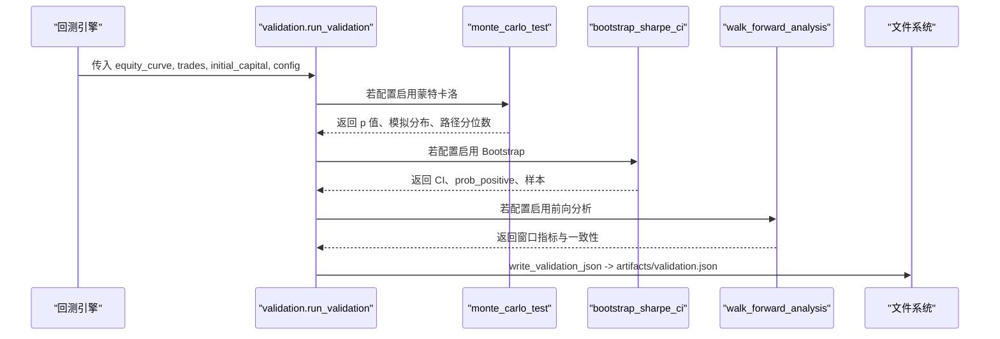
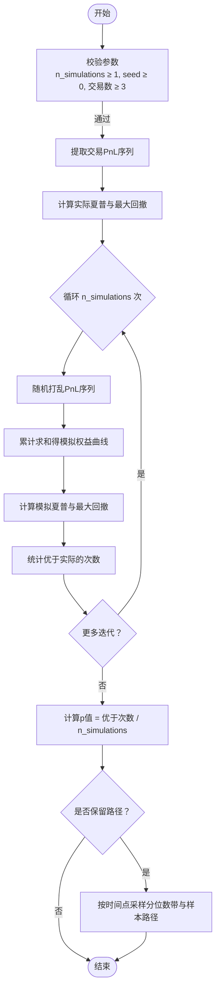
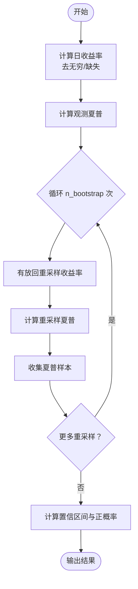
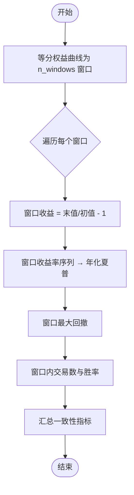
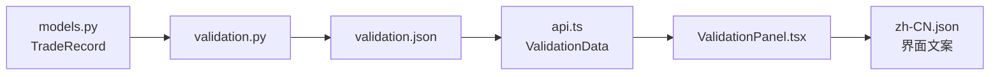

# 统计验证框架

<cite>
**本文引用的文件**
- [agent/backtest/validation.py](file://agent/backtest/validation.py)
- [agent/backtest/models.py](file://agent/backtest/models.py)
- [agent/tests/test_validation.py](file://agent/tests/test_validation.py)
- [frontend/src/lib/api.ts](file://frontend/src/lib/api.ts)
- [frontend/src/components/charts/ValidationPanel.tsx](file://frontend/src/components/charts/ValidationPanel.tsx)
- [frontend/src/i18n/locales/zh-CN.json](file://frontend/src/i18n/locales/zh-CN.json)
</cite>

## 目录
1. [简介](#简介)
2. [项目结构](#项目结构)
3. [核心组件](#核心组件)
4. [架构总览](#架构总览)
5. [详细组件分析](#详细组件分析)
6. [依赖关系分析](#依赖关系分析)
7. [性能考量](#性能考量)
8. [故障排查指南](#故障排查指南)
9. [结论](#结论)
10. [附录：配置与结果解读](#附录配置与结果解读)

## 简介
本技术文档面向量化研究员与策略开发者，系统化说明仓库中的“统计验证框架”。该框架提供三类独立且互补的统计检验工具：
- 蒙特卡洛置换检验：通过随机打乱交易顺序评估路径显著性（夏普比率、最大回撤），并计算 p 值。
- Bootstrap 夏普置信区间：对日收益率进行重采样，估计夏普比率的置信区间与正概率。
- 前向分析（Walk-Forward Analysis）：将回测划分为连续窗口，评估收益一致性与滚动表现。

此外，文档还涵盖路径指标计算（夏普比率、最大回撤、收益曲线）、配置参数说明、结果解读指南以及实际使用场景。

## 项目结构
统计验证的核心实现位于回测模块中，前端负责展示与交互，测试覆盖关键行为与边界条件。

```mermaid
graph TB
A["回测引擎<br/>BaseEngine.run_backtest"] --> B["validation.py<br/>run_validation()"]
B --> C["monte_carlo_test()<br/>蒙特卡洛置换检验"]
B --> D["bootstrap_sharpe_ci()<br/>Bootstrap 夏普 CI"]
B --> E["walk_forward_analysis()<br/>前向分析"]
B --> F["write_validation_json()<br/>严格 JSON 输出"]
G["models.py<br/>TradeRecord/EquitySnapshot"] --> C
G --> E
H["前端 api.ts / ValidationPanel.tsx"] <- --> I["artifacts/validation.json"]
```

图表来源
- [agent/backtest/validation.py:291-346](file://agent/backtest/validation.py#L291-L346)
- [agent/backtest/models.py:62-118](file://agent/backtest/models.py#L62-L118)
- [frontend/src/lib/api.ts:1001-1048](file://frontend/src/lib/api.ts#L1001-L1048)
- [frontend/src/components/charts/ValidationPanel.tsx:147-167](file://frontend/src/components/charts/ValidationPanel.tsx#L147-L167)

章节来源
- [agent/backtest/validation.py:1-498](file://agent/backtest/validation.py#L1-L498)
- [agent/backtest/models.py:1-118](file://agent/backtest/models.py#L1-L118)
- [frontend/src/lib/api.ts:1001-1048](file://frontend/src/lib/api.ts#L1001-L1048)

## 核心组件
- 蒙特卡洛置换检验：输入为已完成交易列表与初始资金；通过多次随机排列交易 PnL 序列，构建零分布，比较实际夏普与最大回撤是否优于随机顺序，得到 p 值。同时可输出模拟资金路径分位数带与样本路径。
- Bootstrap 夏普置信区间：对日收益率进行有放回重采样，计算每次重采样的年化夏普，得到观测夏普的置信区间、中位数夏普与正概率。
- 前向分析：将权益曲线切分为等长非重叠窗口，逐窗口计算收益、夏普、最大回撤、胜率，并汇总一致性指标（盈利窗口比例、均值与标准差）。
- 统一调度器 run_validation：从配置读取各子项开关与参数，调用对应函数并聚合结果。
- 严格 JSON 写入：将包含非有限数值的指标安全转换为 null，确保输出符合 RFC-8259 严格 JSON。

章节来源
- [agent/backtest/validation.py:29-113](file://agent/backtest/validation.py#L29-L113)
- [agent/backtest/validation.py:142-208](file://agent/backtest/validation.py#L142-L208)
- [agent/backtest/validation.py:214-291](file://agent/backtest/validation.py#L214-L291)
- [agent/backtest/validation.py:291-346](file://agent/backtest/validation.py#L291-L346)
- [agent/backtest/validation.py:453-470](file://agent/backtest/validation.py#L453-L470)

## 架构总览
统计验证在回测完成后自动或手动触发，读取权益曲线与交易记录，执行三类检验，并将结果写入 artifacts/validation.json，供前端可视化。



图表来源
- [agent/backtest/validation.py:291-346](file://agent/backtest/validation.py#L291-L346)
- [agent/backtest/validation.py:453-470](file://agent/backtest/validation.py#L453-L470)

## 详细组件分析

### 蒙特卡洛置换检验
- 原理
  - 零假设：观察到的夏普比率与最大回撤并不优于随机交易顺序。
  - 方法：对交易 PnL 序列进行 n_simulations 次随机排列，构造零分布；计算实际指标与零分布的比较，得到 p 值。
  - 路径显著性：通过累计 PnL 生成权益曲线，计算每步的分位数带，用于可视化“模拟资金路径”的分布。
- 关键实现要点
  - 输入校验：n_simulations 必须为正整数，seed 为非负整数，交易数至少为 3。
  - 指标计算：基于权益曲线计算年化夏普与最大回撤。
  - 内存保护：仅在 n_simulations × len(pnls) 不超过阈值时保存完整路径矩阵，避免过大内存占用。
  - 输出字段：actual_sharpe、p_value_sharpe、actual_max_dd、p_value_max_dd、simulated_sharpe_mean/std/p5/p95、n_simulations、n_trades、sharpe_samples、equity_paths（可选）。
- 复杂度
  - 时间：O(n_simulations × N)，N 为交易数。
  - 空间：最多 O(n_simulations × N) 存储路径矩阵（受阈值限制）。



图表来源
- [agent/backtest/validation.py:29-113](file://agent/backtest/validation.py#L29-L113)
- [agent/backtest/validation.py:116-130](file://agent/backtest/validation.py#L116-L130)

章节来源
- [agent/backtest/validation.py:29-113](file://agent/backtest/validation.py#L29-L113)
- [agent/backtest/validation.py:116-130](file://agent/backtest/validation.py#L116-L130)
- [agent/tests/test_validation.py:73-122](file://agent/tests/test_validation.py#L73-L122)

### Bootstrap 夏普置信区间
- 原理
  - 对日收益率进行有放回重采样（Bootstrap），每次重采样计算年化夏普，形成统计量的经验分布。
  - 置信区间：取经验分布的 α/2 与 1-α/2 分位数。
  - 正概率概率：经验分布中夏普大于 0 的比例。
- 关键实现要点
  - 输入校验：n_bootstrap 必须为正整数，confidence 必须在 (0,1) 内且有限，seed 为非负整数。
  - 数据准备：权益曲线差分得到日收益率，剔除无穷大与缺失值。
  - 指标计算：使用统一的夏普函数，考虑 bars_per_year 年化因子。
  - 输出字段：observed_sharpe、ci_lower、ci_upper、median_sharpe、prob_positive、confidence、n_bootstrap、sharpe_samples（当 n_bootstrap ≤ 20000 时附带）。
- 复杂度
  - 时间：O(n_bootstrap × N)。
  - 空间：O(n_bootstrap) 存储夏普样本。



图表来源
- [agent/backtest/validation.py:142-208](file://agent/backtest/validation.py#L142-L208)

章节来源
- [agent/backtest/validation.py:142-208](file://agent/backtest/validation.py#L142-L208)
- [agent/tests/test_validation.py:146-209](file://agent/tests/test_validation.py#L146-L209)

### 前向分析（Walk-Forward Analysis）
- 原理
  - 将回测时间段等分为 n_windows 个非重叠窗口，每个窗口独立评估策略表现。
  - 一致性检查：统计盈利窗口比例、窗口收益与夏普的均值与标准差。
- 关键实现要点
  - 输入校验：n_windows 必须为正整数，权益曲线长度需满足最小要求。
  - 窗口指标：窗口收益、夏普、最大回撤、交易数、胜率。
  - 汇总指标：consistency_rate、return_mean/std、sharpe_mean/std。
- 复杂度
  - 时间：O(N)，N 为权益曲线长度。
  - 空间：O(W)，W 为窗口数量。



图表来源
- [agent/backtest/validation.py:214-291](file://agent/backtest/validation.py#L214-L291)

章节来源
- [agent/backtest/validation.py:214-291](file://agent/backtest/validation.py#L214-L291)
- [agent/tests/test_validation.py:217-273](file://agent/tests/test_validation.py#L217-L273)

### 路径指标计算
- 夏普比率：基于日收益率均值与标准差，乘以 sqrt(bars_per_year) 进行年化。
- 最大回撤：权益曲线相对历史峰值的最大跌幅。
- 收益曲线分析：累计 PnL 生成权益曲线，用于可视化与风险度量。

章节来源
- [agent/backtest/validation.py:116-130](file://agent/backtest/validation.py#L116-L130)
- [agent/backtest/validation.py:206-208](file://agent/backtest/validation.py#L206-L208)

### 统一调度与 CLI
- run_validation：根据配置选择执行的子项，支持只运行单一工具或全部。
- CLI：从 artifacts/equity.csv 与 artifacts/trades.csv 加载数据，默认执行三项验证并写入 artifacts/validation.json。

章节来源
- [agent/backtest/validation.py:291-346](file://agent/backtest/validation.py#L291-L346)
- [agent/backtest/validation.py:366-511](file://agent/backtest/validation.py#L366-L511)

## 依赖关系分析
- 数据模型：TradeRecord、EquitySnapshot 等由 models.py 定义，被 validation.py 引用。
- 前端接口：api.ts 定义了 ValidationData 类型，包含 monte_carlo、bootstrap、walk_forward 的结构化字段。
- 前端展示：ValidationPanel.tsx 渲染前向分析面板，显示一致性、平均收益、平均夏普与窗口数。
- 本地化：zh-CN.json 提供界面文案，如“蒙特卡罗置换检验”、“自举夏普置信区间”、“前推分析”等。



图表来源
- [agent/backtest/models.py:62-118](file://agent/backtest/models.py#L62-L118)
- [agent/backtest/validation.py:291-346](file://agent/backtest/validation.py#L291-L346)
- [frontend/src/lib/api.ts:1001-1048](file://frontend/src/lib/api.ts#L1001-L1048)
- [frontend/src/components/charts/ValidationPanel.tsx:147-167](file://frontend/src/components/charts/ValidationPanel.tsx#L147-L167)
- [frontend/src/i18n/locales/zh-CN.json:1524-1555](file://frontend/src/i18n/locales/zh-CN.json#L1524-L1555)

章节来源
- [agent/backtest/models.py:62-118](file://agent/backtest/models.py#L62-L118)
- [frontend/src/lib/api.ts:1001-1048](file://frontend/src/lib/api.ts#L1001-L1048)
- [frontend/src/components/charts/ValidationPanel.tsx:147-167](file://frontend/src/components/charts/ValidationPanel.tsx#L147-L167)
- [frontend/src/i18n/locales/zh-CN.json:1524-1555](file://frontend/src/i18n/locales/zh-CN.json#L1524-L1555)

## 性能考量
- 蒙特卡洛路径矩阵：为避免内存爆炸，仅在 n_simulations × len(pnls) 不超过阈值时保存完整路径矩阵；否则仅保留统计量。
- Bootstrap 样本大小：当 n_bootstrap ≤ 20000 时附带 sharpe_samples，便于前端可视化；更大规模时省略以控制体积。
- 年化因子：bars_per_year 影响夏普尺度，需与数据频率匹配（例如日线通常 252）。
- 数据清洗：收益率计算中替换无穷大与缺失值，避免数值异常导致崩溃。

[本节为通用指导，不直接分析具体文件]

## 故障排查指南
- 常见错误与处理
  - 蒙特卡洛：n_simulations 非正整数、seed 非法、交易数少于 3 时返回 error 与默认 p 值。
  - Bootstrap：n_bootstrap 非正整数、confidence 不在 (0,1)、seed 非法、收益率观测少于 5 条时返回 error。
  - 前向分析：n_windows 非正整数、权益曲线过短（不足 n_windows×2）时返回 error。
  - JSON 输出：非有限数值会被转换为 null，确保严格 JSON 解析通过。
- 定位建议
  - 检查配置键名与类型（如 n_simulations、n_bootstrap、confidence、n_windows）。
  - 确认权益曲线索引为日期时间戳，交易记录含 entry_time/exit_time。
  - 查看 artifacts/validation.json 的错误字段与消息。

章节来源
- [agent/backtest/validation.py:54-62](file://agent/backtest/validation.py#L54-L62)
- [agent/backtest/validation.py:162-176](file://agent/backtest/validation.py#L162-L176)
- [agent/backtest/validation.py:233-236](file://agent/backtest/validation.py#L233-L236)
- [agent/backtest/validation.py:453-470](file://agent/backtest/validation.py#L453-L470)
- [agent/tests/test_validation.py:98-122](file://agent/tests/test_validation.py#L98-L122)
- [agent/tests/test_validation.py:170-209](file://agent/tests/test_validation.py#L170-L209)
- [agent/tests/test_validation.py:258-273](file://agent/tests/test_validation.py#L258-L273)

## 结论
该统计验证框架提供了稳健的回测后评估能力：
- 蒙特卡洛置换检验帮助判断策略是否显著优于随机顺序，避免过拟合与路径依赖偏差。
- Bootstrap 夏普置信区间量化风险调整后收益的不确定性，并提供正概率估计。
- 前向分析揭示策略在不同时间段的稳定性，辅助识别市场 regime 变化下的脆弱点。
结合严格的 JSON 输出与前端可视化，研究者可快速定位问题并进行策略迭代。

[本节为总结性内容，不直接分析具体文件]

## 附录：配置与结果解读

### 配置参数说明
- 蒙特卡洛
  - n_simulations：随机排列次数，越大越稳定但耗时更长。
  - seed：随机种子，保证结果可复现。
- Bootstrap
  - n_bootstrap：重采样次数，影响置信区间的稳定性。
  - confidence：置信水平，如 0.95。
  - seed：随机种子。
  - bars_per_year：年化因子，应与数据频率匹配。
- 前向分析
  - n_windows：窗口数量，需满足权益曲线长度 ≥ n_windows×2。

章节来源
- [agent/backtest/validation.py:291-346](file://agent/backtest/validation.py#L291-L346)
- [agent/tests/test_validation.py:271-314](file://agent/tests/test_validation.py#L271-L314)

### 结果解读指南
- 蒙特卡洛
  - p_value_sharpe：若接近 0，表明策略夏普显著优于随机顺序；若接近 1，则可能不显著。
  - actual_sharpe / actual_max_dd：实际路径指标。
  - simulated_sharpe_mean/std/p5/p95：零分布的集中趋势与离散程度。
  - equity_paths：分位数带与样本路径，用于可视化“模拟资金路径”。
- Bootstrap
  - observed_sharpe：观测夏普。
  - ci_lower/ci_upper：置信区间；若区间不包含 0，通常认为显著为正。
  - prob_positive：夏普大于 0 的概率；越高越稳健。
  - median_sharpe：重采样夏普的中位数。
- 前向分析
  - consistency_rate：盈利窗口比例；越高说明策略在不同时段更稳定。
  - return_mean/std、sharpe_mean/std：窗口收益与夏普的均值与波动。
  - windows：每个窗口的 start/end、return、sharpe、max_dd、trades、win_rate。

章节来源
- [agent/backtest/validation.py:29-113](file://agent/backtest/validation.py#L29-L113)
- [agent/backtest/validation.py:142-208](file://agent/backtest/validation.py#L142-L208)
- [agent/backtest/validation.py:214-291](file://agent/backtest/validation.py#L214-L291)
- [frontend/src/lib/api.ts:1001-1048](file://frontend/src/lib/api.ts#L1001-L1048)
- [frontend/src/components/charts/ValidationPanel.tsx:147-167](file://frontend/src/components/charts/ValidationPanel.tsx#L147-L167)
- [frontend/src/i18n/locales/zh-CN.json:1524-1555](file://frontend/src/i18n/locales/zh-CN.json#L1524-L1555)

### 实际使用场景与示例
- 在回测结束后自动运行：当配置中存在 validation 键时，BaseEngine.run_backtest 会自动调用 run_validation。
- 单独运行某一项：通过配置仅启用 bootstrap 或 walk_forward，减少计算开销。
- 命令行模式：对已有回测产物（equity.csv、trades.csv、config.json）执行三项验证，输出 artifacts/validation.json。
- 前端展示：ValidationPanel 读取 validation.json 并渲染蒙特卡洛、Bootstrap、前向分析的可视化面板。

章节来源
- [agent/backtest/validation.py:1-10](file://agent/backtest/validation.py#L1-L10)
- [agent/backtest/validation.py:291-346](file://agent/backtest/validation.py#L291-L346)
- [agent/backtest/validation.py:473-511](file://agent/backtest/validation.py#L473-L511)
- [frontend/src/components/charts/ValidationPanel.tsx:147-167](file://frontend/src/components/charts/ValidationPanel.tsx#L147-L167)