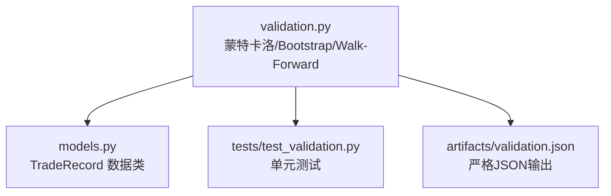
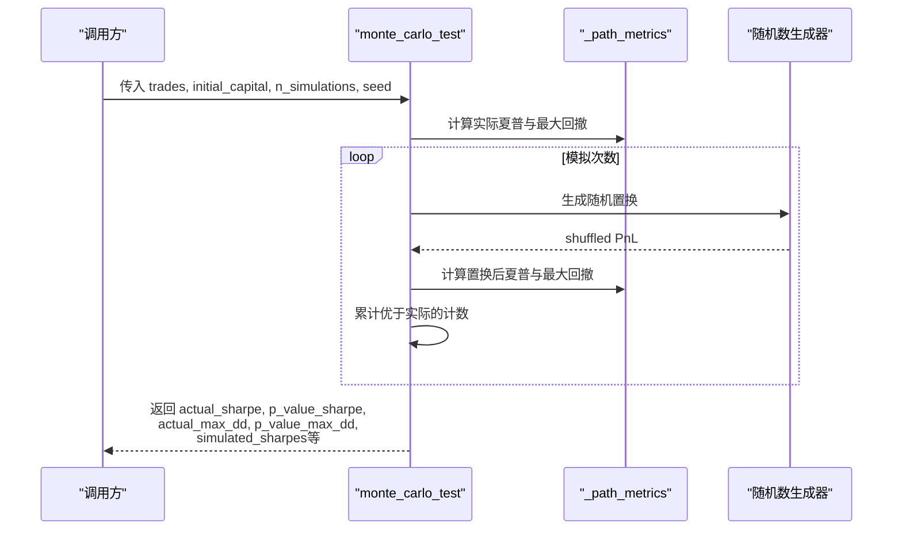
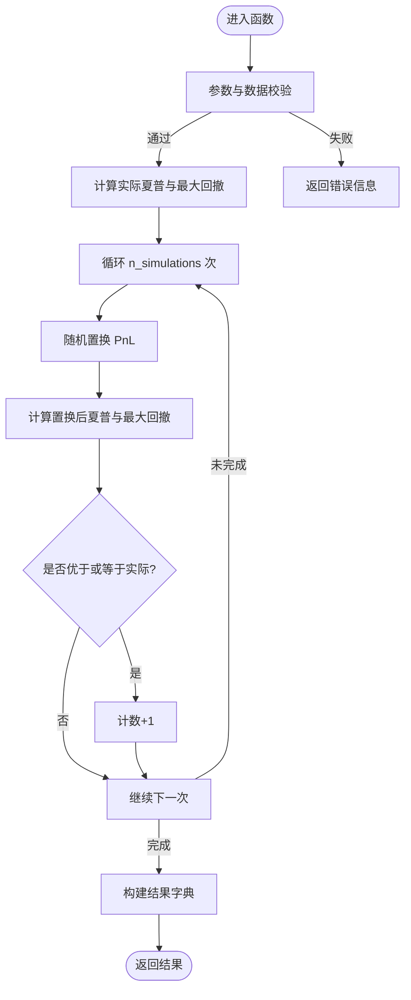
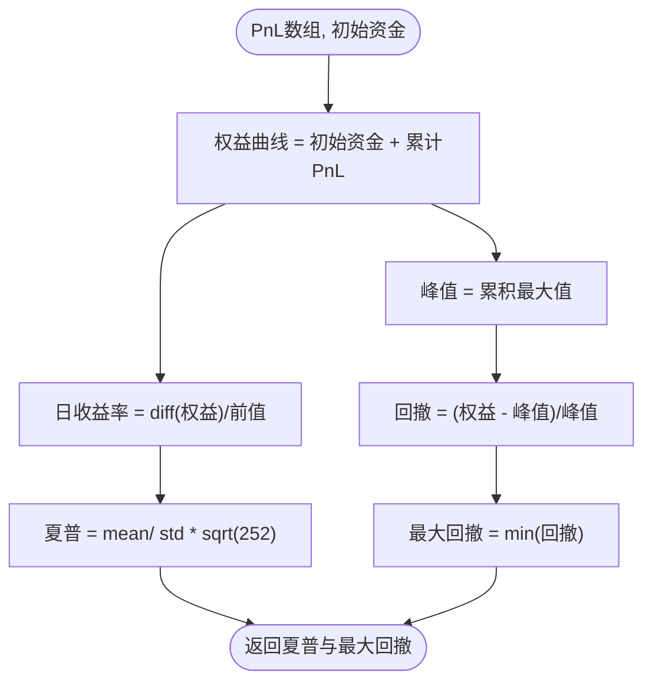
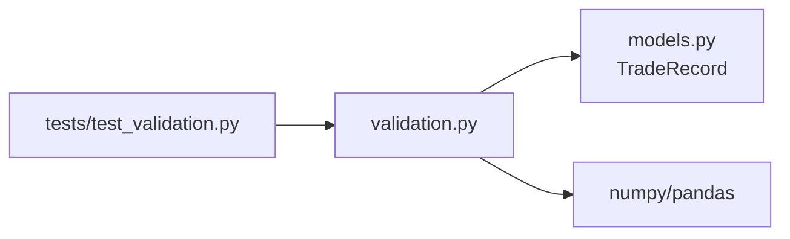

# 蒙特卡洛置换检验

<cite>
**本文引用的文件**
- [agent/backtest/validation.py](file://agent/backtest/validation.py)
- [agent/backtest/models.py](file://agent/backtest/models.py)
- [agent/tests/test_validation.py](file://agent/tests/test_validation.py)
</cite>

## 目录
1. [简介](#简介)
2. [项目结构](#项目结构)
3. [核心组件](#核心组件)
4. [架构总览](#架构总览)
5. [详细组件分析](#详细组件分析)
6. [依赖关系分析](#依赖关系分析)
7. [性能考量](#性能考量)
8. [故障排查指南](#故障排查指南)
9. [结论](#结论)
10. [附录：配置示例与结果解读](#附录：配置示例与结果解读)

## 简介
本技术文档围绕“蒙特卡洛置换检验”展开，解释如何通过对交易顺序进行随机打乱来评估策略收益序列的“路径显著性”。其核心思想是：在零假设下，观察到的夏普比率/最大回撤并不优于对同一组交易按随机顺序重排后的表现。通过大量随机置换，构建统计分布并计算p值，从而判断策略是否具备超越随机排序的统计显著性。

该实现位于回测验证模块中，提供可复现、可扩展且鲁棒的统计检验工具，支持直接调用或随回测自动运行。

## 项目结构
- 统计验证主逻辑集中在 backtest/validation.py，包含：
  - 蒙特卡洛置换检验函数
  - 辅助的路径指标计算（夏普比率、最大回撤）
  - Bootstrap夏普置信区间
  - 前推分析（Walk-Forward）
  - 统一调度器 run_validation
  - CLI入口与JSON写入
- 交易记录数据结构定义在 backtest/models.py 的 TradeRecord
- 单元测试覆盖在 tests/test_validation.py，验证输出结构、边界条件与可重复性

图表来源
- [agent/backtest/validation.py:29-113](file://agent/backtest/validation.py#L29-L113)
- [agent/backtest/models.py:63-98](file://agent/backtest/models.py#L63-L98)
- [agent/tests/test_validation.py:73-123](file://agent/tests/test_validation.py#L73-L123)

章节来源
- [agent/backtest/validation.py:1-113](file://agent/backtest/validation.py#L1-L113)
- [agent/backtest/models.py:63-98](file://agent/backtest/models.py#L63-L98)
- [agent/tests/test_validation.py:73-123](file://agent/tests/test_validation.py#L73-L123)

## 核心组件
- 蒙特卡洛置换检验函数：对交易PnL序列进行随机置换，计算每次置换下的夏普比率和最大回撤，并与实际值比较得到p值；同时可选生成资金路径以可视化随机分布。
- 路径指标计算：从PnL序列构造权益曲线，计算年化夏普比率与最大回撤。
- Bootstrap夏普置信区间：对日收益率重采样估计夏普的置信区间和正概率。
- 前推分析：将回测划分为连续窗口，评估绩效一致性。
- 统一调度器：根据配置选择执行哪些验证项，并汇总结果。
- JSON安全写入：确保非有限数值被转为null，输出严格RFC-8259兼容JSON。

章节来源
- [agent/backtest/validation.py:29-113](file://agent/backtest/validation.py#L29-L113)
- [agent/backtest/validation.py:116-130](file://agent/backtest/validation.py#L116-L130)
- [agent/backtest/validation.py:142-203](file://agent/backtest/validation.py#L142-L203)
- [agent/backtest/validation.py:214-291](file://agent/backtest/validation.py#L214-L291)
- [agent/backtest/validation.py:291-346](file://agent/backtest/validation.py#L291-L346)
- [agent/backtest/validation.py:453-470](file://agent/backtest/validation.py#L453-L470)

## 架构总览
下图展示了蒙特卡洛置换检验在系统中的位置与数据流：输入为交易记录与初始资金，内部循环生成随机置换并计算指标，最终输出包括实际指标、p值、模拟分布及可选资金路径。

图表来源
- [agent/backtest/validation.py:29-113](file://agent/backtest/validation.py#L29-L113)
- [agent/backtest/validation.py:116-130](file://agent/backtest/validation.py#L116-L130)

章节来源
- [agent/backtest/validation.py:29-113](file://agent/backtest/validation.py#L29-L113)

## 详细组件分析

### 蒙特卡洛置换检验函数
- 功能：对交易PnL序列进行随机打乱，评估策略收益序列的顺序是否重要（路径显著性）。
- 零假设：观察到的夏普比率/最大回撤不优于随机排序的表现。
- 关键步骤：
  - 参数校验：确保 n_simulations >= 1、seed >= 0、至少3笔交易。
  - 提取PnL数组，计算实际夏普与最大回撤。
  - 使用固定种子生成随机置换，逐次计算指标并统计优于或等于实际的次数。
  - 计算p值为“优于或等于实际的次数 / 模拟次数”。
  - 可选生成资金路径矩阵，用于可视化随机分布（受内存限制控制）。
- 返回值字段：
  - actual_sharpe：实际夏普比率
  - actual_max_dd：实际最大回撤
  - p_value_sharpe：夏普p值
  - p_value_max_dd：回撤p值
  - simulated_sharpe_mean/std/p5/p95：模拟夏普均值、标准差、分位数
  - n_simulations/n_trades：模拟次数与交易数
  - sharpe_samples：模拟夏普样本列表
  - equity_paths（可选）：资金路径与分位带

图表来源
- [agent/backtest/validation.py:29-113](file://agent/backtest/validation.py#L29-L113)
- [agent/backtest/validation.py:116-130](file://agent/backtest/validation.py#L116-L130)

章节来源
- [agent/backtest/validation.py:29-113](file://agent/backtest/validation.py#L29-L113)
- [agent/backtest/validation.py:116-130](file://agent/backtest/validation.py#L116-L130)

### 路径指标计算
- 输入：PnL数组与初始资金
- 过程：
  - 构造权益曲线：initial_capital + cumsum(PnL)
  - 计算日收益率：diff(equity)/prev_equity（处理零值避免除零）
  - 夏普比率：mean(returns)/std(returns)*sqrt(252)
  - 最大回撤：基于权益曲线的峰值回撤
- 输出：夏普比率与最大回撤

图表来源
- [agent/backtest/validation.py:116-130](file://agent/backtest/validation.py#L116-L130)

章节来源
- [agent/backtest/validation.py:116-130](file://agent/backtest/validation.py#L116-L130)

### Bootstrap夏普置信区间与前推分析
- Bootstrap夏普置信区间：对日收益率重采样估计夏普的置信区间与正概率，用于评估风险调整后收益的稳定性。
- 前推分析：将回测划分为连续窗口，独立评估每段收益、夏普、最大回撤与胜率，计算一致性指标。

章节来源
- [agent/backtest/validation.py:142-203](file://agent/backtest/validation.py#L142-L203)
- [agent/backtest/validation.py:214-291](file://agent/backtest/validation.py#L214-L291)

### 统一调度器与CLI
- run_validation：根据配置选择执行蒙特卡洛、Bootstrap、前推分析，并汇总结果。
- main：读取回测产物（equity.csv、trades.csv、config.json），运行三项验证，输出到 artifacts/validation.json。

章节来源
- [agent/backtest/validation.py:291-346](file://agent/backtest/validation.py#L291-L346)
- [agent/backtest/validation.py:473-505](file://agent/backtest/validation.py#L473-L505)

## 依赖关系分析
- 外部依赖：numpy、pandas
- 内部依赖：backtest.models.TradeRecord
- 测试依赖：pytest，用于断言输出结构与边界行为

图表来源
- [agent/backtest/validation.py:1-23](file://agent/backtest/validation.py#L1-L23)
- [agent/backtest/models.py:63-98](file://agent/backtest/models.py#L63-L98)
- [agent/tests/test_validation.py:1-26](file://agent/tests/test_validation.py#L1-L26)

章节来源
- [agent/backtest/validation.py:1-23](file://agent/backtest/validation.py#L1-L23)
- [agent/backtest/models.py:63-98](file://agent/backtest/models.py#L63-L98)
- [agent/tests/test_validation.py:1-26](file://agent/tests/test_validation.py#L1-L26)

## 性能考量
- 内存保护：当 n_simulations × len(pnls) > 2,000,000 时，跳过完整资金路径矩阵以避免内存膨胀与JSON过大。
- 抽样策略：仅对部分时间点与部分模拟路径进行采样，保证可视化负载可控。
- 数值稳定：夏普计算中对标准差加极小常数防止除零；权益归一化时对零值做保护。
- 可重复性：通过固定随机种子保证结果可复现。

章节来源
- [agent/backtest/validation.py:71-74](file://agent/backtest/validation.py#L71-L74)
- [agent/backtest/validation.py:101-116](file://agent/backtest/validation.py#L101-L116)
- [agent/backtest/validation.py:116-130](file://agent/backtest/validation.py#L116-L130)

## 故障排查指南
- 常见错误与处理：
  - n_simulations 必须为正整数：否则返回错误并设置p值为1.0
  - seed 必须为非负整数：否则返回错误并设置p值为1.0
  - 交易数量不足：少于3笔交易返回错误
  - 数据过短：Bootstrap需要至少5个收益率观测；前推分析需要足够条形数
- 调试建议：
  - 检查 trades 列表是否为空或长度不足
  - 确认 initial_capital 合理，避免权益曲线为零导致指标异常
  - 查看 validation.json 中的 error 字段定位问题
  - 使用固定 seed 复现实验结果

章节来源
- [agent/backtest/validation.py:54-62](file://agent/backtest/validation.py#L54-L62)
- [agent/backtest/validation.py:162-176](file://agent/backtest/validation.py#L162-L176)
- [agent/backtest/validation.py:233-236](file://agent/backtest/validation.py#L233-L236)
- [agent/tests/test_validation.py:98-123](file://agent/tests/test_validation.py#L98-L123)

## 结论
蒙特卡洛置换检验通过对交易顺序的随机打乱，提供了评估策略路径显著性的严谨方法。结合夏普比率与最大回撤的p值，可以判断策略是否显著优于随机排序。配合Bootstrap置信区间与前推分析，能够更全面地评估策略的稳定性和一致性。实现具备良好的鲁棒性与可复现性，适合集成到回测流程中进行自动化验证。

## 附录：配置示例与结果解读

### 函数参数说明
- trades：交易记录列表（类型为 TradeRecord）
- initial_capital：初始资金
- n_simulations：模拟次数（建议≥1000以获得稳定分布）
- seed：随机种子（用于可重复性）

章节来源
- [agent/backtest/validation.py:29-48](file://agent/backtest/validation.py#L29-L48)
- [agent/backtest/models.py:63-98](file://agent/backtest/models.py#L63-L98)

### 返回结果字段说明
- actual_sharpe：实际夏普比率
- p_value_sharpe：夏普p值（越小越显著）
- actual_max_dd：实际最大回撤
- p_value_max_dd：回撤p值（越小越显著）
- simulated_sharpe_mean/std/p5/p95：模拟夏普的均值、标准差、5%与95%分位数
- n_simulations/n_trades：模拟次数与交易数
- sharpe_samples：模拟夏普样本列表
- equity_paths（可选）：资金路径与分位带，用于可视化随机分布

章节来源
- [agent/backtest/validation.py:88-117](file://agent/backtest/validation.py#L88-L117)

### 配置示例
- 在回测配置中添加验证项：
  - monte_carlo: {n_simulations: 1000, seed: 42}
  - bootstrap: {n_bootstrap: 1000, confidence: 0.95, seed: 42}
  - walk_forward: {n_windows: 5}
- 通过 run_validation 或直接调用 monte_carlo_test 执行

章节来源
- [agent/backtest/validation.py:291-346](file://agent/backtest/validation.py#L291-L346)

### 结果解读指南
- p值判断：
  - p_value_sharpe < 0.05：策略夏普显著优于随机排序
  - p_value_max_dd < 0.05：策略最大回撤显著优于随机排序
- 模拟分布：
  - 若实际夏普远高于模拟分布的上分位，表明策略具有稳健优势
  - 若实际指标落在模拟分布中间，可能仅为运气所致
- 资金路径：
  - 观察实际路径是否在随机路径带的上方，进一步佐证策略有效性

章节来源
- [agent/backtest/validation.py:82-99](file://agent/backtest/validation.py#L82-L99)
- [agent/tests/test_validation.py:84-96](file://agent/tests/test_validation.py#L84-L96)

### 实际代码示例与使用场景
- 直接调用：
  - 准备 trades 与 initial_capital
  - 调用 monte_carlo_test(trades, initial_capital, n_simulations=1000, seed=42)
  - 解析返回结果中的p值与模拟分布
- 集成到回测：
  - 在 config.validation 中启用 monte_carlo
  - 回测结束后自动生成 artifacts/validation.json
- 典型场景：
  - 新策略上线前的统计显著性验证
  - 多因子策略的稳健性评估
  - 策略优化过程中的过拟合检测

章节来源
- [agent/backtest/validation.py:29-113](file://agent/backtest/validation.py#L29-L113)
- [agent/tests/test_validation.py:73-123](file://agent/tests/test_validation.py#L73-L123)