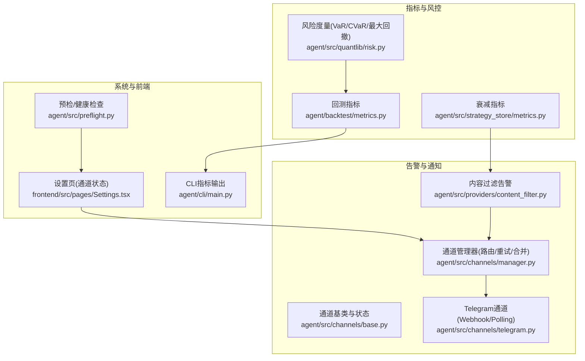
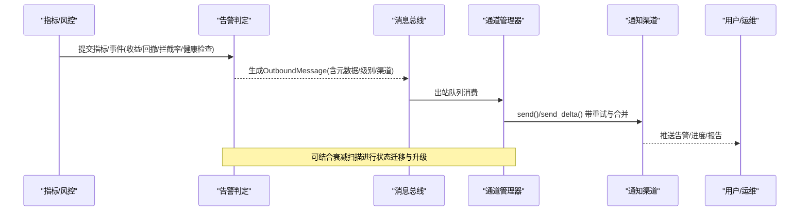
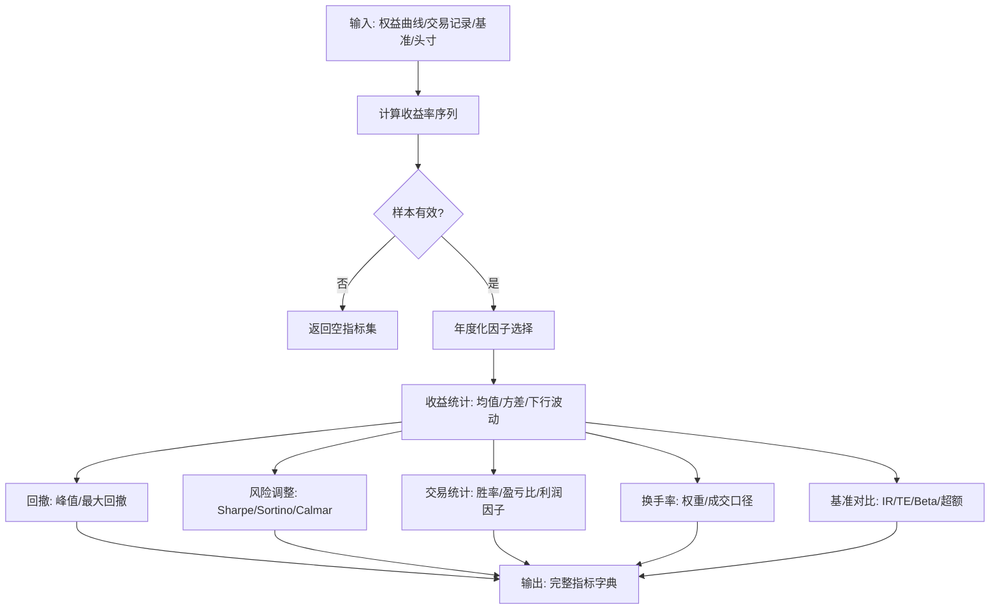
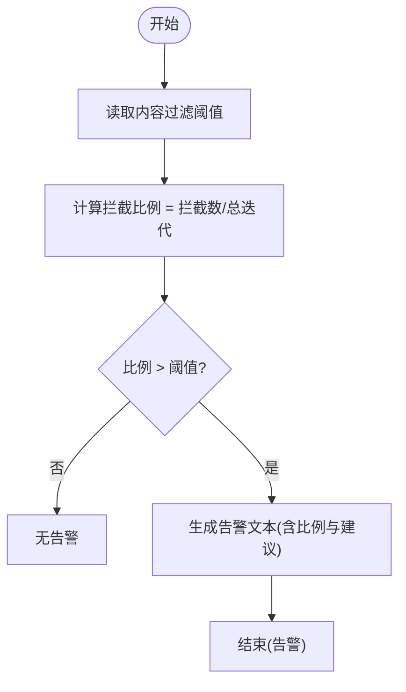
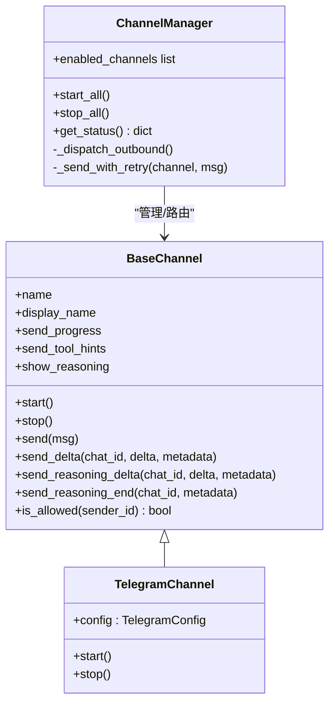
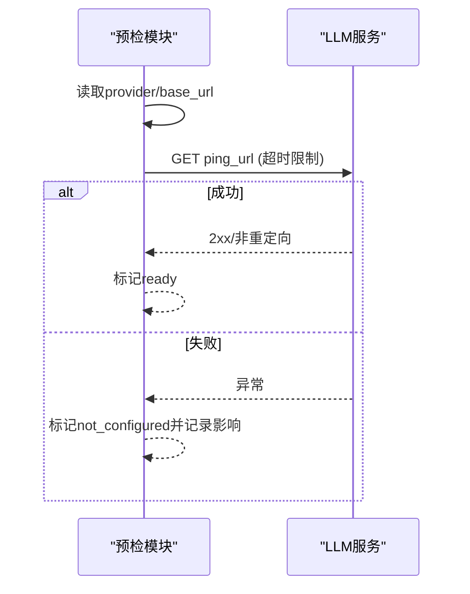
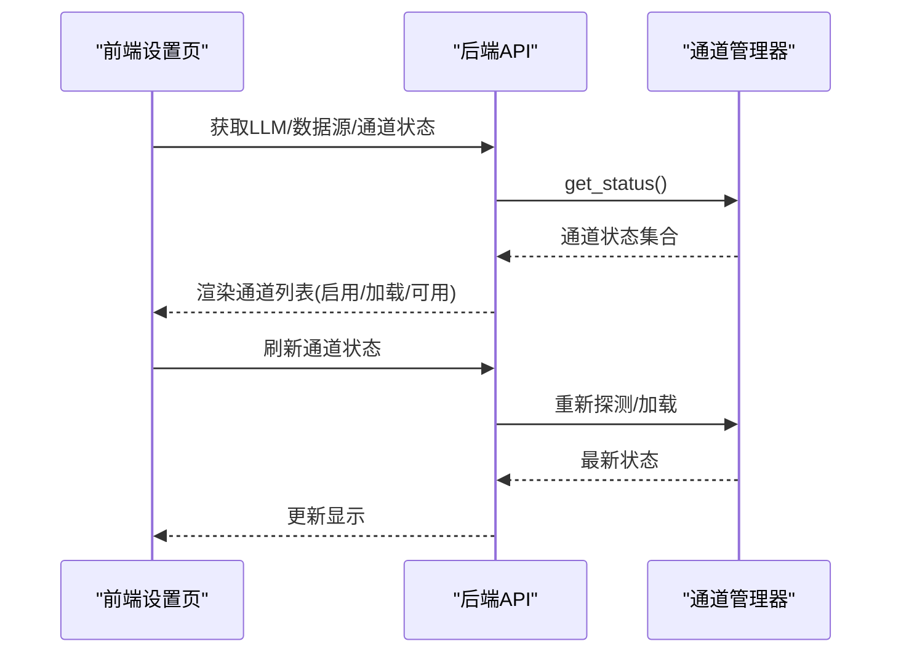
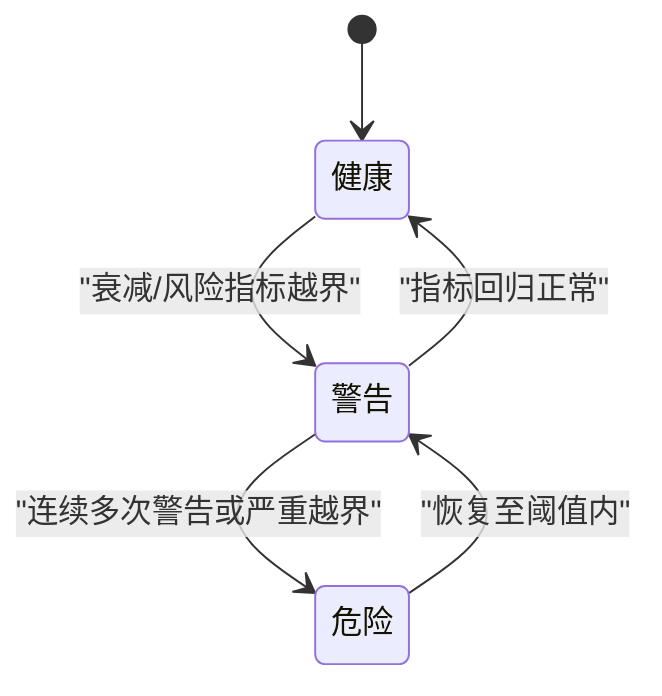
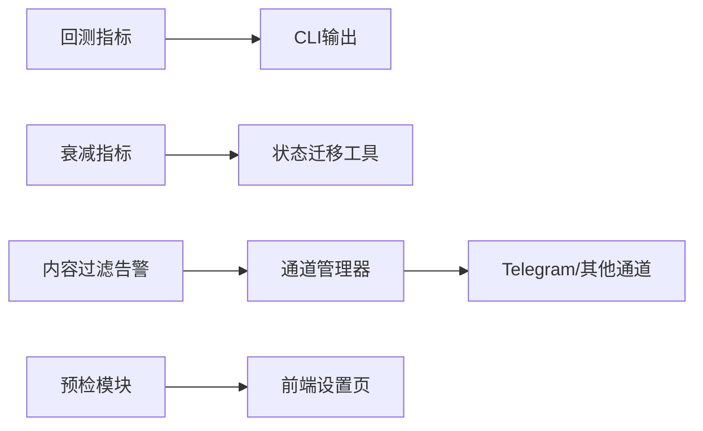

# 质量监控与告警

<cite>
**本文引用的文件**
- [agent/backtest/metrics.py](file://agent/backtest/metrics.py)
- [agent/src/strategy_store/metrics.py](file://agent/src/strategy_store/metrics.py)
- [agent/src/providers/content_filter.py](file://agent/src/providers/content_filter.py)
- [agent/src/channels/base.py](file://agent/src/channels/base.py)
- [agent/src/channels/manager.py](file://agent/src/channels/manager.py)
- [agent/src/channels/telegram.py](file://agent/src/channels/telegram.py)
- [agent/src/preflight.py](file://agent/src/preflight.py)
- [agent/src/quantlib/risk.py](file://agent/src/quantlib/risk.py)
- [agent/src/tools/sdm_decay_scan_tool.py](file://agent/src/tools/sdm_decay_scan_tool.py)
- [frontend/src/pages/Settings.tsx](file://frontend/src/pages/Settings.tsx)
- [agent/cli/main.py](file://agent/cli/main.py)
</cite>

## 目录
1. [简介](#简介)
2. [项目结构](#项目结构)
3. [核心组件](#核心组件)
4. [架构总览](#架构总览)
5. [详细组件分析](#详细组件分析)
6. [依赖关系分析](#依赖关系分析)
7. [性能考量](#性能考量)
8. [故障排除指南](#故障排除指南)
9. [结论](#结论)
10. [附录](#附录)

## 简介
本技术文档面向运维人员与数据治理团队，系统化说明本仓库中的“质量监控与告警”能力：包括指标定义（数据质量KPI、业务指标、系统健康检查）、告警规则配置（阈值、条件判断、通知渠道）、实时监控仪表板（可视化、趋势与对比）、告警分级与升级策略、历史数据分析（趋势跟踪、根因分析、改进评估），以及最佳实践、配置示例与故障排除。

## 项目结构
围绕质量监控与告警，代码主要分布在以下模块：
- 指标计算与衰减检测：回测指标、策略衰减指标、风险度量
- 内容过滤告警：LLM响应被拦截比例告警
- 通道与通知：多渠道消息发送、状态管理、重试与合并
- 预检与健康检查：外部服务连通性探测
- 前端设置页：通道可用性展示与刷新
- CLI输出：运行结果与关键指标打印

**图表来源**
- [agent/backtest/metrics.py:1-641](file://agent/backtest/metrics.py#L1-L641)
- [agent/src/strategy_store/metrics.py:1-90](file://agent/src/strategy_store/metrics.py#L1-L90)
- [agent/src/quantlib/risk.py:24-64](file://agent/src/quantlib/risk.py#L24-L64)
- [agent/src/providers/content_filter.py:66-102](file://agent/src/providers/content_filter.py#L66-L102)
- [agent/src/channels/base.py:22-238](file://agent/src/channels/base.py#L22-L238)
- [agent/src/channels/manager.py:36-479](file://agent/src/channels/manager.py#L36-L479)
- [agent/src/channels/telegram.py:368-631](file://agent/src/channels/telegram.py#L368-L631)
- [agent/src/preflight.py:108-147](file://agent/src/preflight.py#L108-L147)
- [frontend/src/pages/Settings.tsx:83-384](file://frontend/src/pages/Settings.tsx#L83-L384)
- [agent/cli/main.py:799-830](file://agent/cli/main.py#L799-L830)

**章节来源**
- [agent/backtest/metrics.py:1-641](file://agent/backtest/metrics.py#L1-L641)
- [agent/src/strategy_store/metrics.py:1-90](file://agent/src/strategy_store/metrics.py#L1-L90)
- [agent/src/channels/manager.py:36-479](file://agent/src/channels/manager.py#L36-L479)
- [agent/src/channels/base.py:22-238](file://agent/src/channels/base.py#L22-L238)
- [agent/src/channels/telegram.py:368-631](file://agent/src/channels/telegram.py#L368-L631)
- [agent/src/providers/content_filter.py:66-102](file://agent/src/providers/content_filter.py#L66-L102)
- [agent/src/preflight.py:108-147](file://agent/src/preflight.py#L108-L147)
- [frontend/src/pages/Settings.tsx:83-384](file://frontend/src/pages/Settings.tsx#L83-L384)
- [agent/cli/main.py:799-830](file://agent/cli/main.py#L799-L830)

## 核心组件
- 指标体系
  - 回测与业务指标：年化收益、夏普、索提诺、最大回撤、胜率、盈亏比、换手率、基准超额、信息比率、跟踪误差等
  - 衰减指标：IC均值、滚动IR、IC正占比、滚动Sharpe、基准Sharpe等
  - 风险度量：历史VaR/CVaR、最大回撤分析、尾部拟合等
- 内容过滤告警：基于拦截比例与阈值的告警生成
- 通道与通知：统一的消息总线、通道发现与初始化、出站消息去重/合并/重试、多平台推送
- 系统健康检查：外部服务连通性探测（如LLM base URL）
- 前端设置页：通道加载/可用/运行状态展示与刷新
- CLI输出：关键指标打印与仪表盘入口提示

**章节来源**
- [agent/backtest/metrics.py:461-626](file://agent/backtest/metrics.py#L461-L626)
- [agent/src/strategy_store/metrics.py:24-90](file://agent/src/strategy_store/metrics.py#L24-L90)
- [agent/src/quantlib/risk.py:24-64](file://agent/src/quantlib/risk.py#L24-L64)
- [agent/src/providers/content_filter.py:66-102](file://agent/src/providers/content_filter.py#L66-L102)
- [agent/src/channels/manager.py:213-253](file://agent/src/channels/manager.py#L213-L253)
- [agent/src/channels/base.py:22-238](file://agent/src/channels/base.py#L22-L238)
- [agent/src/channels/telegram.py:368-631](file://agent/src/channels/telegram.py#L368-L631)
- [agent/src/preflight.py:108-147](file://agent/src/preflight.py#L108-L147)
- [frontend/src/pages/Settings.tsx:83-384](file://frontend/src/pages/Settings.tsx#L83-L384)
- [agent/cli/main.py:799-830](file://agent/cli/main.py#L799-L830)

## 架构总览
质量监控与告警由“指标计算—告警判定—通知分发—可视化/CLI”构成闭环。指标计算模块产出业务与风险指标；内容过滤模块按阈值生成告警；通道管理器负责将告警与进度通过多种渠道推送；前端与CLI提供可视化与快速查看。

**图表来源**
- [agent/src/channels/manager.py:394-563](file://agent/src/channels/manager.py#L394-L563)
- [agent/src/channels/base.py:72-150](file://agent/src/channels/base.py#L72-L150)
- [agent/src/providers/content_filter.py:66-102](file://agent/src/providers/content_filter.py#L66-L102)
- [agent/src/strategy_store/metrics.py:24-90](file://agent/src/strategy_store/metrics.py#L24-L90)
- [agent/src/tools/sdm_decay_scan_tool.py:148-173](file://agent/src/tools/sdm_decay_scan_tool.py#L148-L173)

## 详细组件分析

### 指标定义与计算
- 回测与业务指标
  - 年化收益、夏普、索提诺、最大回撤、胜率、盈亏比、利润因子、连续亏损次数、平均持仓周期、交易次数
  - 基准对比：基准收益、超额收益、信息比率、跟踪误差、Beta
  - 换手率：权重变化与实际成交两种口径
  - 年度化：按数据源与周期映射的bars_per_year
- 衰减指标
  - 基于历史快照计算基线IC均值、滚动IC均值、IC比率、滚动IR、IC正占比、滚动Sharpe、基准Sharpe
- 风险度量
  - 历史VaR/CVaR、最大回撤分析、蒙特卡洛模拟与尾部拟合

**图表来源**
- [agent/backtest/metrics.py:153-170](file://agent/backtest/metrics.py#L153-L170)
- [agent/backtest/metrics.py:245-302](file://agent/backtest/metrics.py#L245-L302)
- [agent/backtest/metrics.py:266-342](file://agent/backtest/metrics.py#L266-L342)
- [agent/backtest/metrics.py:441-531](file://agent/backtest/metrics.py#L441-L531)
- [agent/backtest/metrics.py:461-626](file://agent/backtest/metrics.py#L461-L626)

**章节来源**
- [agent/backtest/metrics.py:153-170](file://agent/backtest/metrics.py#L153-L170)
- [agent/backtest/metrics.py:245-302](file://agent/backtest/metrics.py#L245-L302)
- [agent/backtest/metrics.py:266-342](file://agent/backtest/metrics.py#L266-L342)
- [agent/backtest/metrics.py:441-531](file://agent/backtest/metrics.py#L441-L531)
- [agent/backtest/metrics.py:461-626](file://agent/backtest/metrics.py#L461-L626)
- [agent/src/strategy_store/metrics.py:24-90](file://agent/src/strategy_store/metrics.py#L24-L90)
- [agent/src/quantlib/risk.py:24-64](file://agent/src/quantlib/risk.py#L24-L64)

### 告警规则与阈值
- 内容过滤告警
  - 读取配置的警告阈值（默认5%），计算拦截比例，超过阈值即生成告警文本
- 衰减扫描与状态迁移
  - 对历史快照计算衰减指标，若触发降级信号，则更新制品状态并记录迁移原因
- 阈值建议
  - 内容过滤：根据业务容忍度调优（如事件驱动场景可降低阈值）
  - 衰减指标：以滚动窗口稳定性与IR下降为触发点
  - 风险指标：VaR/CVaR与最大回撤结合历史分布设定阈值

**图表来源**
- [agent/src/providers/content_filter.py:66-102](file://agent/src/providers/content_filter.py#L66-L102)
- [agent/src/tools/sdm_decay_scan_tool.py:148-173](file://agent/src/tools/sdm_decay_scan_tool.py#L148-L173)

**章节来源**
- [agent/src/providers/content_filter.py:66-102](file://agent/src/providers/content_filter.py#L66-L102)
- [agent/src/tools/sdm_decay_scan_tool.py:148-173](file://agent/src/tools/sdm_decay_scan_tool.py#L148-L173)

### 通知渠道与实时推送
- 通道基类与能力
  - 抽象start/stop/send、流式增量、推理片段、文件编辑事件等接口
  - 支持streaming开关与权限校验
- 通道管理器
  - 发现与初始化启用通道、启动/停止、出站消息分发、去重、流式合并、指数退避重试
- Telegram通道
  - 支持polling与webhook模式，包含路径、端口、密钥、连接数等配置校验

**图表来源**
- [agent/src/channels/base.py:22-238](file://agent/src/channels/base.py#L22-L238)
- [agent/src/channels/manager.py:36-479](file://agent/src/channels/manager.py#L36-L479)
- [agent/src/channels/telegram.py:368-631](file://agent/src/channels/telegram.py#L368-L631)

**章节来源**
- [agent/src/channels/base.py:22-238](file://agent/src/channels/base.py#L22-L238)
- [agent/src/channels/manager.py:213-453](file://agent/src/channels/manager.py#L213-L453)
- [agent/src/channels/telegram.py:368-631](file://agent/src/channels/telegram.py#L368-L631)

### 系统健康检查
- LLM服务连通性探测
  - 解析base_url，去除/v1后缀后发起HTTP请求验证TCP+SSL连通性
  - 未配置或异常时返回not_configured/ready状态，便于前端展示与告警

**图表来源**
- [agent/src/preflight.py:108-147](file://agent/src/preflight.py#L108-L147)

**章节来源**
- [agent/src/preflight.py:108-147](file://agent/src/preflight.py#L108-L147)

### 实时监控仪表板
- 前端设置页
  - 并行加载LLM设置、数据源设置、通道状态
  - 展示通道启用/加载/可用数量，支持刷新通道状态
- CLI输出
  - 打印关键指标（年化收益、夏普、最大回撤、胜率、交易次数）
  - 提示通过serve启动后端后访问运行详情仪表盘

**图表来源**
- [frontend/src/pages/Settings.tsx:83-384](file://frontend/src/pages/Settings.tsx#L83-L384)
- [agent/src/channels/manager.py:571-584](file://agent/src/channels/manager.py#L571-L584)
- [agent/cli/main.py:799-830](file://agent/cli/main.py#L799-L830)

**章节来源**
- [frontend/src/pages/Settings.tsx:83-384](file://frontend/src/pages/Settings.tsx#L83-L384)
- [agent/cli/main.py:799-830](file://agent/cli/main.py#L799-L830)

### 告警分级管理与升级策略
- 级别划分
  - 健康/警告/危险：基于衰减指标与风险指标综合评分
  - 内容过滤告警：按拦截比例是否超阈值区分
- 升级策略
  - 连续多次非健康信号触发状态迁移（从healthy到warning/danger）
  - 结合风险阈值（VaR/CVaR、最大回撤）进行升级
- 处理流程
  - 指标计算→告警判定→通道推送→人工/自动化处置→状态回写

**图表来源**
- [agent/src/tools/sdm_decay_scan_tool.py:148-173](file://agent/src/tools/sdm_decay_scan_tool.py#L148-L173)
- [agent/src/strategy_store/metrics.py:24-90](file://agent/src/strategy_store/metrics.py#L24-L90)
- [agent/src/quantlib/risk.py:24-64](file://agent/src/quantlib/risk.py#L24-L64)

**章节来源**
- [agent/src/tools/sdm_decay_scan_tool.py:148-173](file://agent/src/tools/sdm_decay_scan_tool.py#L148-L173)
- [agent/src/strategy_store/metrics.py:24-90](file://agent/src/strategy_store/metrics.py#L24-L90)
- [agent/src/quantlib/risk.py:24-64](file://agent/src/quantlib/risk.py#L24-L64)

### 历史数据分析
- 质量趋势跟踪
  - 使用滚动IC均值、滚动IR、滚动Sharpe观察策略/因子衰减
- 问题根因分析
  - 结合回撤、换手率、基准对比定位异常来源
  - 利用风险度量（VaR/CVaR）识别尾部风险
- 改进效果评估
  - 比较干预前后指标变化（如阈值调整后拦截率下降、IR回升）

**章节来源**
- [agent/src/strategy_store/metrics.py:24-90](file://agent/src/strategy_store/metrics.py#L24-L90)
- [agent/backtest/metrics.py:461-626](file://agent/backtest/metrics.py#L461-L626)
- [agent/src/quantlib/risk.py:24-64](file://agent/src/quantlib/risk.py#L24-L64)

## 依赖关系分析
- 指标模块依赖numpy/pandas进行时间序列与统计计算
- 通道管理器依赖消息总线与具体通道实现
- 内容过滤告警依赖配置读取与阈值逻辑
- 前端设置页依赖后端API暴露的状态接口

**图表来源**
- [agent/backtest/metrics.py:461-626](file://agent/backtest/metrics.py#L461-L626)
- [agent/src/strategy_store/metrics.py:24-90](file://agent/src/strategy_store/metrics.py#L24-L90)
- [agent/src/providers/content_filter.py:66-102](file://agent/src/providers/content_filter.py#L66-L102)
- [agent/src/channels/manager.py:213-453](file://agent/src/channels/manager.py#L213-L453)
- [agent/src/channels/telegram.py:368-631](file://agent/src/channels/telegram.py#L368-L631)
- [agent/src/preflight.py:108-147](file://agent/src/preflight.py#L108-L147)
- [frontend/src/pages/Settings.tsx:83-384](file://frontend/src/pages/Settings.tsx#L83-L384)

**章节来源**
- [agent/backtest/metrics.py:461-626](file://agent/backtest/metrics.py#L461-L626)
- [agent/src/strategy_store/metrics.py:24-90](file://agent/src/strategy_store/metrics.py#L24-L90)
- [agent/src/providers/content_filter.py:66-102](file://agent/src/providers/content_filter.py#L66-L102)
- [agent/src/channels/manager.py:213-453](file://agent/src/channels/manager.py#L213-L453)
- [agent/src/channels/telegram.py:368-631](file://agent/src/channels/telegram.py#L368-L631)
- [agent/src/preflight.py:108-147](file://agent/src/preflight.py#L108-L147)
- [frontend/src/pages/Settings.tsx:83-384](file://frontend/src/pages/Settings.tsx#L83-L384)

## 性能考量
- 指标计算
  - 避免在极小样本下计算风险比率（单观测保护）
  - 对溢出/无穷值做防御性处理（如负增长年化、极端收益路径）
- 通知通道
  - 出站消息合并减少API调用
  - 指数退避重试降低瞬时抖动影响
- 前端
  - 并行加载设置项提升首屏体验

[本节为通用指导，不直接分析具体文件]

## 故障排除指南
- 通道无法启动/不可用
  - 检查通道配置（如Telegram webhook URL、密钥、路径）
  - 查看通道管理器日志与状态接口
- 告警未送达
  - 确认通道已启用且available=true
  - 检查出站消息是否被去重/过滤（progress/tool_hint）
  - 关注重试次数与错误日志
- 内容过滤告警频繁
  - 调整拦截阈值或更换提供商
- 健康检查失败
  - 核对LLM base_url与网络可达性

**章节来源**
- [agent/src/channels/manager.py:213-253](file://agent/src/channels/manager.py#L213-L253)
- [agent/src/channels/manager.py:532-563](file://agent/src/channels/manager.py#L532-L563)
- [agent/src/channels/telegram.py:368-420](file://agent/src/channels/telegram.py#L368-L420)
- [agent/src/providers/content_filter.py:66-102](file://agent/src/providers/content_filter.py#L66-L102)
- [agent/src/preflight.py:108-147](file://agent/src/preflight.py#L108-L147)

## 结论
本仓库提供了覆盖“指标—告警—通知—可视化”的完整质量监控与告警链路。通过标准化的指标计算、灵活的阈值与条件判断、可靠的多通道通知与健壮的重试机制，以及前端与CLI的可视化支持，能够有效支撑运维与数据治理团队的日常监控与问题处置。建议结合业务场景持续优化阈值与告警策略，形成闭环改进。

## 附录

### 监控最佳实践
- 指标选择
  - 业务侧：年化收益、夏普、最大回撤、胜率、换手率、基准对比
  - 数据质量：拦截比例、缺失/异常比例（可扩展）
  - 系统健康：外部服务连通性、通道可用性
- 阈值优化
  - 基于历史分布与滚动窗口动态校准
  - 结合衰减指标与风险度量进行联动
- 误报处理
  - 引入连续信号计数与状态迁移，避免瞬时抖动
  - 对低置信度信号采用观察级而非立即行动

### 监控配置示例
- 内容过滤阈值：通过环境变量/配置项设置（默认5%）
- 通道配置：启用目标通道、设置认证与回调地址（如Telegram webhook）
- 预检配置：配置LLM provider与base_url

**章节来源**
- [agent/src/providers/content_filter.py:66-72](file://agent/src/providers/content_filter.py#L66-L72)
- [agent/src/channels/telegram.py:368-420](file://agent/src/channels/telegram.py#L368-L420)
- [agent/src/preflight.py:108-147](file://agent/src/preflight.py#L108-L147)