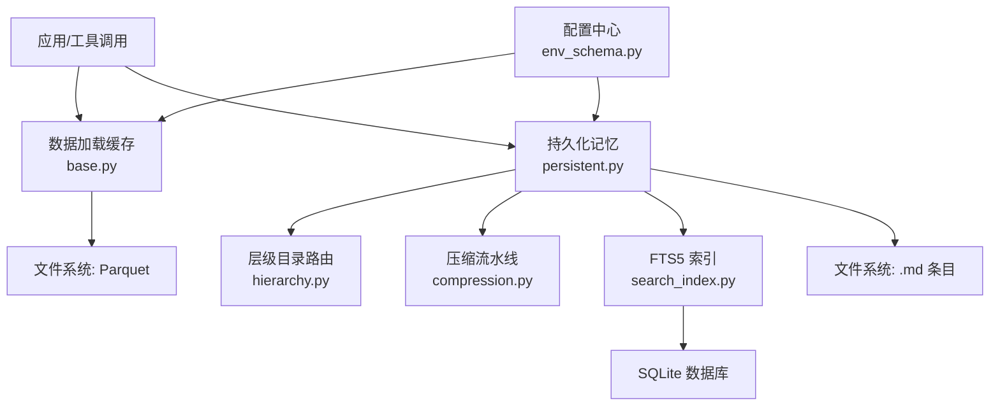
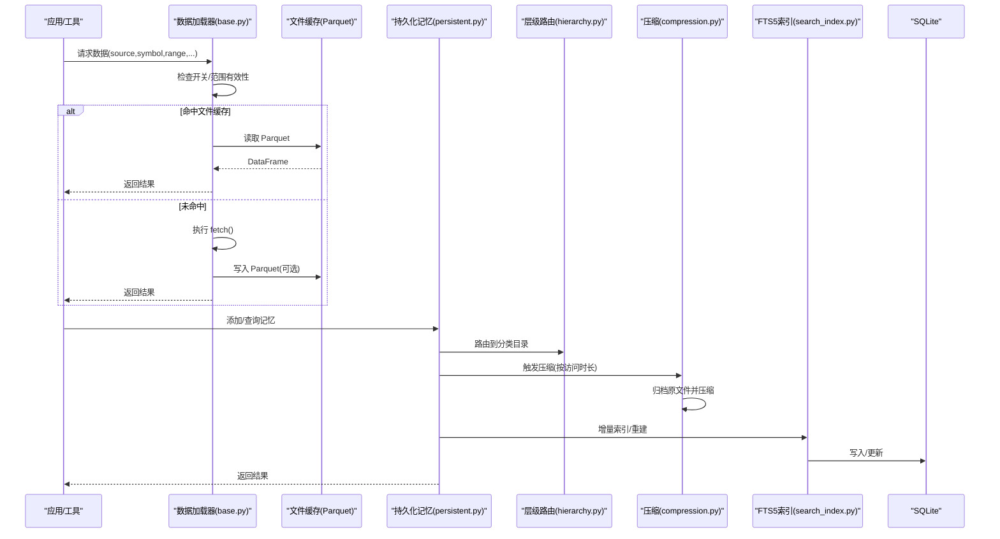
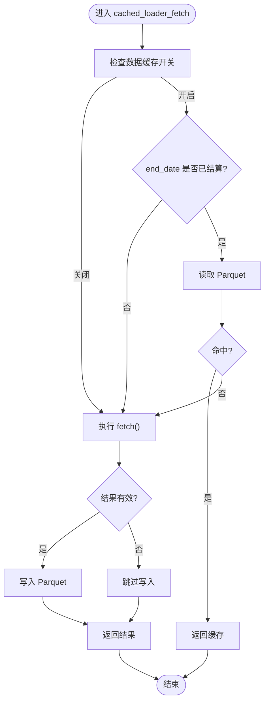
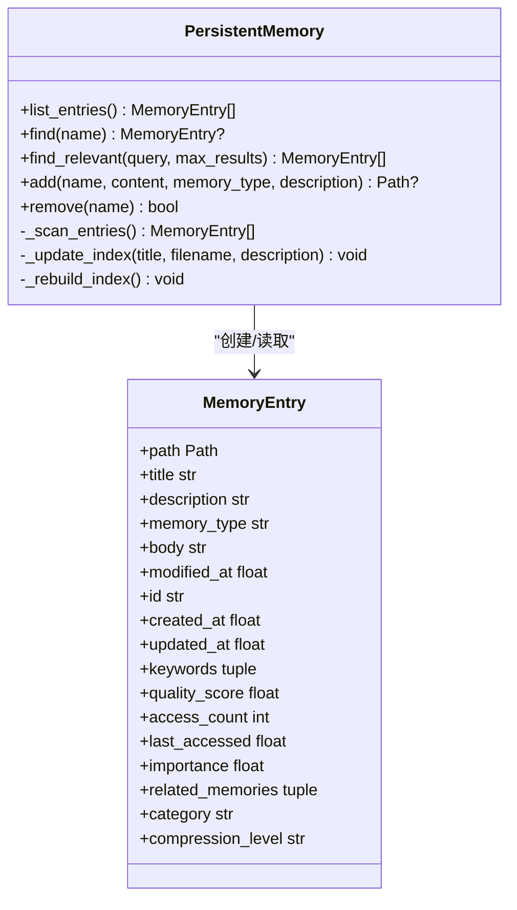
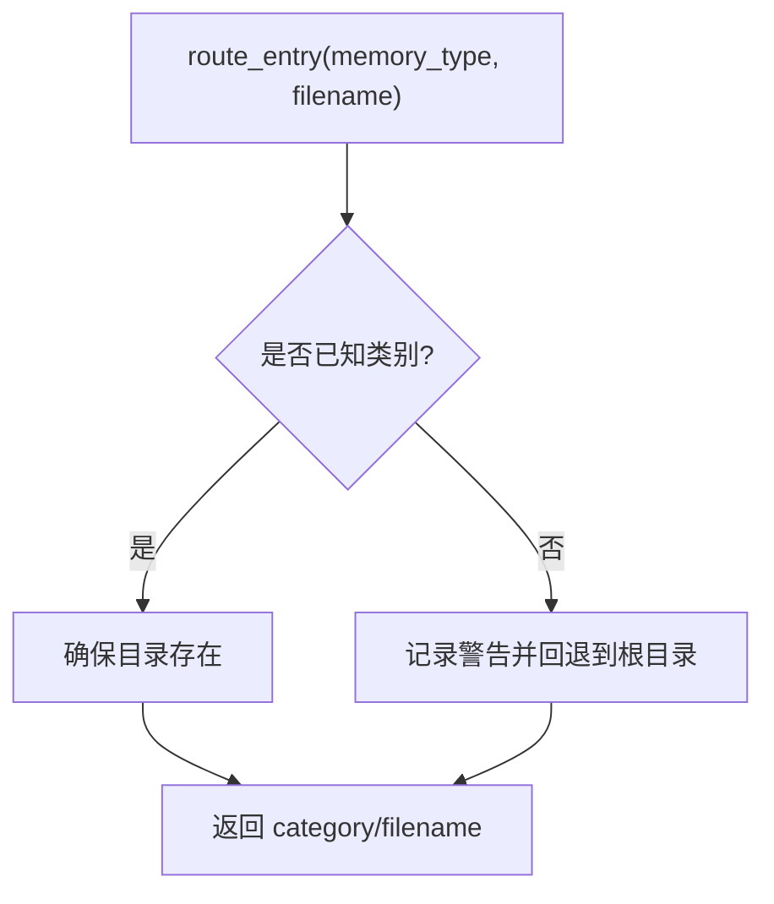
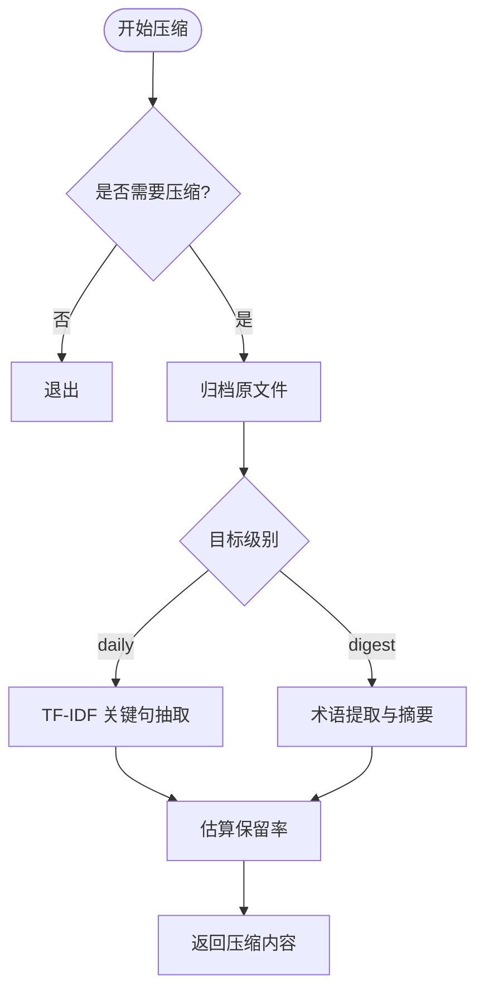
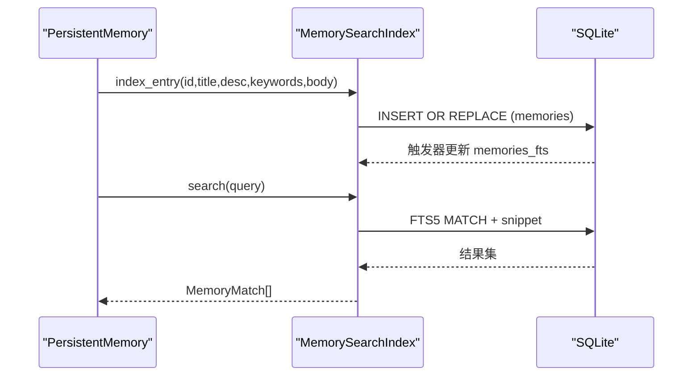
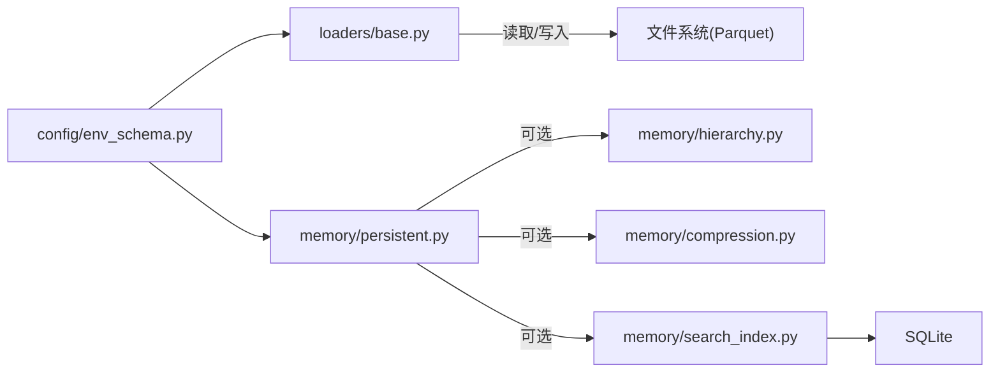

# 缓存机制

<cite>
**本文引用的文件**
- [agent/backtest/loaders/base.py](file://agent/backtest/loaders/base.py)
- [agent/src/memory/persistent.py](file://agent/src/memory/persistent.py)
- [agent/src/memory/hierarchy.py](file://agent/src/memory/hierarchy.py)
- [agent/src/memory/compression.py](file://agent/src/memory/compression.py)
- [agent/src/memory/search_index.py](file://agent/src/memory/search_index.py)
- [agent/src/config/env_schema.py](file://agent/src/config/env_schema.py)
</cite>

## 目录
1. [简介](#简介)
2. [项目结构](#项目结构)
3. [核心组件](#核心组件)
4. [架构总览](#架构总览)
5. [详细组件分析](#详细组件分析)
6. [依赖关系分析](#依赖关系分析)
7. [性能考量](#性能考量)
8. [故障排查指南](#故障排查指南)
9. [结论](#结论)
10. [附录](#附录)

## 简介
本技术文档围绕本仓库中的“多级缓存”与“持久化记忆/检索”能力展开，覆盖以下主题：
- 多级缓存架构：内存级（进程内）缓存、文件级缓存（Parquet）、数据库级（SQLite FTS5）的层次设计。
- 缓存策略：键生成（内容寻址哈希）、TTL/过期策略、容量控制、压缩归档。
- 失效机制：主动失效、被动过期、版本控制（通过版本号与内容哈希）。
- 并发安全：文件锁、读写分离、一致性保证。
- 性能调优：命中率优化、内存管理、监控指标。
- 故障恢复与数据同步：索引重建、降级回退、归档恢复。

该实现主要服务于两个场景：
- 回测数据加载缓存：将市场数据按参数内容生成稳定键并落盘为 Parquet，避免重复网络请求。
- 持久化记忆系统：以文件为主存储，结合 SQLite FTS5 全文检索索引，提供跨会话的记忆存取、压缩与检索加速。

## 项目结构
与缓存相关的关键模块分布如下：
- 数据加载缓存：位于 backtest/loaders/base.py，提供开关、根路径、键生成、读写封装。
- 持久化记忆：位于 src/memory/persistent.py，负责条目增删查改、重要性衰减、去重、索引更新。
- 层级目录路由：位于 src/memory/hierarchy.py，按类型分目录组织，提升扫描效率。
- 压缩流水线：位于 src/memory/compression.py，三级压缩（原始→每日→摘要），含归档与保留率估算。
- 全文检索索引：位于 src/memory/search_index.py，基于 SQLite FTS5，支持增量索引与批量重建。
- 配置中心：位于 src/config/env_schema.py，集中定义缓存与记忆系统的功能开关与环境变量。

图表来源
- [agent/backtest/loaders/base.py:250-441](file://agent/backtest/loaders/base.py#L250-L441)
- [agent/src/memory/persistent.py:200-654](file://agent/src/memory/persistent.py#L200-L654)
- [agent/src/memory/hierarchy.py:34-176](file://agent/src/memory/hierarchy.py#L34-L176)
- [agent/src/memory/compression.py:163-356](file://agent/src/memory/compression.py#L163-L356)
- [agent/src/memory/search_index.py:113-481](file://agent/src/memory/search_index.py#L113-L481)
- [agent/src/config/env_schema.py:166-214](file://agent/src/config/env_schema.py#L166-L214)
- [agent/src/config/env_schema.py:601-677](file://agent/src/config/env_schema.py#L601-L677)

章节来源
- [agent/backtest/loaders/base.py:250-441](file://agent/backtest/loaders/base.py#L250-L441)
- [agent/src/memory/persistent.py:200-654](file://agent/src/memory/persistent.py#L200-L654)
- [agent/src/memory/hierarchy.py:34-176](file://agent/src/memory/hierarchy.py#L34-L176)
- [agent/src/memory/compression.py:163-356](file://agent/src/memory/compression.py#L163-L356)
- [agent/src/memory/search_index.py:113-481](file://agent/src/memory/search_index.py#L113-L481)
- [agent/src/config/env_schema.py:166-214](file://agent/src/config/env_schema.py#L166-L214)
- [agent/src/config/env_schema.py:601-677](file://agent/src/config/env_schema.py#L601-L677)

## 核心组件
- 数据加载缓存（文件级）
  - 功能：根据 source/symbol/timeframe/date range/fields 生成稳定键，读取/写入 Parquet；仅对已结算日期范围生效。
  - 关键函数：loader_cache_enabled、loader_cache_root、make_loader_cache_key、loader_cache_path、loader_cache_get、loader_cache_put、cached_loader_fetch。
- 持久化记忆（文件级主存 + 索引）
  - 功能：条目创建、删除、查找、相关性搜索；重要性衰减、去重、层级目录路由、压缩归档、FTS5 索引。
  - 关键类/函数：PersistentMemory、memory_lock、compute_importance、find_relevant、add/remove、_update_index/_rebuild_index。
- 层级目录路由
  - 功能：按 memory_type 分类到子目录，支持 O(类别规模) 扫描与关键词索引重建。
  - 关键类：MemoryHierarchy（route_entry、scan_all、prune_search_scope、rebuild_index）。
- 压缩流水线
  - 功能：三级压缩（raw → daily → digest），自动归档原文件，计算信息保留率。
  - 关键类：CompressionPipeline（should_compress、compress_to_daily、compress_to_digest、archive_original、apply_compression）。
- 全文检索索引（数据库级）
  - 功能：SQLite FTS5 索引，支持增量索引、批量重建、查询清洗与 CJK 处理。
  - 关键类：MemorySearchIndex（index_entry、remove_entry、search、rebuild_all、_prepare_cjk/_clean_cjk/_sanitize_fts_query）。
- 配置中心
  - 功能：统一的环境变量与开关，如数据缓存开关、记忆系统各特性开关等。
  - 关键模型：DataConfig（vibe_trading_data_cache、vibe_trading_data_cache_root）、MemoryConfig（quality/gc/decay/hierarchy/links/compression/fts 开关）。

章节来源
- [agent/backtest/loaders/base.py:250-441](file://agent/backtest/loaders/base.py#L250-L441)
- [agent/src/memory/persistent.py:200-654](file://agent/src/memory/persistent.py#L200-L654)
- [agent/src/memory/hierarchy.py:34-176](file://agent/src/memory/hierarchy.py#L34-L176)
- [agent/src/memory/compression.py:163-356](file://agent/src/memory/compression.py#L163-L356)
- [agent/src/memory/search_index.py:113-481](file://agent/src/memory/search_index.py#L113-L481)
- [agent/src/config/env_schema.py:166-214](file://agent/src/config/env_schema.py#L166-L214)
- [agent/src/config/env_schema.py:601-677](file://agent/src/config/env_schema.py#L601-L677)

## 架构总览
下图展示从应用调用到各级缓存/存储的完整流程，包括回测数据加载缓存与持久化记忆的并行路径。

图表来源
- [agent/backtest/loaders/base.py:250-441](file://agent/backtest/loaders/base.py#L250-L441)
- [agent/src/memory/persistent.py:200-654](file://agent/src/memory/persistent.py#L200-L654)
- [agent/src/memory/hierarchy.py:34-176](file://agent/src/memory/hierarchy.py#L34-L176)
- [agent/src/memory/compression.py:163-356](file://agent/src/memory/compression.py#L163-L356)
- [agent/src/memory/search_index.py:113-481](file://agent/src/memory/search_index.py#L113-L481)

## 详细组件分析

### 数据加载缓存（文件级）
- 键生成策略
  - 使用 JSON 序列化参数（source/symbol/timeframe/start_date/end_date/fields）并按 key 排序后 SHA-256 生成稳定键，确保相同参数产生相同文件名。
  - 路径由 loader_cache_root() 决定，默认在用户家目录下 ~/.vibe-trading/cache/loaders。
- TTL/过期策略
  - 仅当 end_date 严格早于今天（已结算）才允许缓存，避免缓存正在形成的最新 K 线导致数据不一致。
- 容量控制
  - 未显式实现 LRU 或大小限制；可通过外部清理策略或限定 root 目录空间进行约束。
- 并发安全
  - 读写失败被吞掉以保证 fetch 不失败；未加文件锁，适合单进程或外部协调。
- 性能特征
  - 命中时直接读 Parquet，避免网络开销；写路径仅在非空 DataFrame 且可写时执行。

图表来源
- [agent/backtest/loaders/base.py:250-441](file://agent/backtest/loaders/base.py#L250-L441)

章节来源
- [agent/backtest/loaders/base.py:250-441](file://agent/backtest/loaders/base.py#L250-L441)

### 持久化记忆（文件级主存 + 索引）
- 数据结构
  - MemoryEntry：包含标题、描述、类型、正文、时间戳、ID、质量分、访问计数、重要性、关联记忆、分类、压缩级别等。
- 去重与滑动窗口
  - 使用 content_hash(name, description, content) 生成短哈希，维护最近 N 秒内的哈希集合，防止快速重试导致的重复写入。
- 重要性衰减
  - compute_importance 基于质量分、访问次数与最后访问时间，采用指数衰减公式，受配置开关控制。
- 并发安全
  - 使用 memory_lock 获取文件级独占锁（非 Windows 平台使用 fcntl），超时则记录警告并继续尽力而为。
- 索引更新
  - 新增/删除条目后更新 MEMORY.md 索引；若启用 FTS5，则同步到 SQLite 索引。
- 搜索
  - 优先走 FTS5 全文检索，失败或禁用时回退到 token 扫描加权评分；支持语义链接扩展结果集。

图表来源
- [agent/src/memory/persistent.py:126-147](file://agent/src/memory/persistent.py#L126-L147)
- [agent/src/memory/persistent.py:200-654](file://agent/src/memory/persistent.py#L200-L654)

章节来源
- [agent/src/memory/persistent.py:200-654](file://agent/src/memory/persistent.py#L200-L654)

### 层级目录路由
- 功能要点
  - 将条目按 memory_type 路由到 category 子目录（user/feedback/project/reference），未知类型回退到根目录。
  - 支持 scan_all、scan_category、prune_search_scope（基于关键词重叠度排序类别）与 index 重建。
- 性能收益
  - 将 O(n) 全量扫描降为 O(category_size) 局部扫描，提高检索与列表操作效率。

图表来源
- [agent/src/memory/hierarchy.py:70-90](file://agent/src/memory/hierarchy.py#L70-L90)

章节来源
- [agent/src/memory/hierarchy.py:34-176](file://agent/src/memory/hierarchy.py#L34-L176)

### 压缩流水线
- 三级压缩
  - raw → daily：基于 TF-IDF 句子打分，保留首尾句与 top-k 重要句，附加关键词上下文。
  - daily → digest：提取高频高权重术语，生成要点摘要。
- 归档与原子性
  - 压缩前将原文件原子复制到 archive/ 目录，失败时中止以避免数据丢失。
- 保留率估计
  - 使用 Jaccard 相似度估算压缩前后 token 集合的重叠程度。

图表来源
- [agent/src/memory/compression.py:163-356](file://agent/src/memory/compression.py#L163-L356)

章节来源
- [agent/src/memory/compression.py:163-356](file://agent/src/memory/compression.py#L163-L356)

### 全文检索索引（SQLite FTS5）
- 索引结构
  - 主表 memories 与虚拟表 memories_fts 联动，通过触发器保持同步。
- 中文处理
  - 插入时对 CJK 字符进行一元/二元切分以提升匹配；查询时清洗并构造安全的 MATCH 表达式。
- 并发与健壮性
  - 使用线程锁保护写操作；WAL 模式提升并发读性能；FTS5 不可用时优雅降级。
- 批量重建
  - rebuild_all 清空并重载所有条目，用于与主存储对齐。

图表来源
- [agent/src/memory/search_index.py:113-481](file://agent/src/memory/search_index.py#L113-L481)
- [agent/src/memory/persistent.py:613-626](file://agent/src/memory/persistent.py#L613-L626)

章节来源
- [agent/src/memory/search_index.py:113-481](file://agent/src/memory/search_index.py#L113-L481)
- [agent/src/memory/persistent.py:613-626](file://agent/src/memory/persistent.py#L613-L626)

### 配置与开关
- 数据缓存开关
  - VIBE_TRADING_DATA_CACHE：启用/禁用数据加载缓存。
  - VIBE_TRADING_DATA_CACHE_ROOT：自定义缓存根目录。
- 记忆系统开关
  - VT_MEMORY=off|on|full 预设，配合 VT_MEMORY_QUALITY/GC/DECAY/HIERARCHY/LINKS/COMPRESSION/FTS_INDEX 细粒度控制。
- 影响范围
  - 数据加载缓存：控制 base.py 的缓存读写。
  - 记忆系统：控制 persistent/hierarchy/compression/search_index 的行为。

章节来源
- [agent/src/config/env_schema.py:166-214](file://agent/src/config/env_schema.py#L166-L214)
- [agent/src/config/env_schema.py:601-677](file://agent/src/config/env_schema.py#L601-L677)
- [agent/backtest/loaders/base.py:250-283](file://agent/backtest/loaders/base.py#L250-L283)

## 依赖关系分析
- 模块耦合
  - persistent.py 依赖 hierarchy.py（可选）、compression.py（可选）、search_index.py（可选），通过配置开关动态导入，降低启动成本。
  - search_index.py 独立维护 SQLite 连接与事务，对外暴露线程安全接口。
  - base.py 的数据加载缓存与记忆系统无直接耦合，均通过配置中心解耦。
- 外部依赖
  - SQLite FTS5：若不可用则降级为 token 扫描。
  - fcntl（非 Windows）：用于文件锁。
- 潜在循环依赖
  - 通过延迟 import 避免循环；各模块职责清晰，未见循环引用。

图表来源
- [agent/backtest/loaders/base.py:250-441](file://agent/backtest/loaders/base.py#L250-L441)
- [agent/src/memory/persistent.py:200-654](file://agent/src/memory/persistent.py#L200-L654)
- [agent/src/memory/search_index.py:113-481](file://agent/src/memory/search_index.py#L113-L481)
- [agent/src/config/env_schema.py:601-677](file://agent/src/config/env_schema.py#L601-L677)

章节来源
- [agent/backtest/loaders/base.py:250-441](file://agent/backtest/loaders/base.py#L250-L441)
- [agent/src/memory/persistent.py:200-654](file://agent/src/memory/persistent.py#L200-L654)
- [agent/src/memory/search_index.py:113-481](file://agent/src/memory/search_index.py#L113-L481)
- [agent/src/config/env_schema.py:601-677](file://agent/src/config/env_schema.py#L601-L677)

## 性能考量
- 命中率优化
  - 数据加载缓存：合理划分 timeframe 与 date range，避免过宽范围导致缓存碎片；确保 end_date 已结算以获得更高命中率。
  - 记忆检索：启用 FTS5 可将 O(n) 扫描转为 O(log n) 检索；结合层级路由减少扫描范围。
- 内存管理
  - 去重窗口：_recent_hashes 定期清理，避免无限增长。
  - 索引体积：FTS5 主表 body 截断至固定长度，避免过大索引。
- 监控指标建议
  - 数据加载缓存：命中率、读写耗时、缓存文件大小分布。
  - 记忆系统：条目数量、压缩比例、FTS5 查询耗时、去重拦截次数、重要性衰减曲线。
- 并发与锁
  - 文件锁超时设置需与业务容忍度匹配；在高并发写入场景下考虑队列化或批处理。

[本节为通用指导，不直接分析具体文件]

## 故障排查指南
- 数据加载缓存
  - 现象：始终未命中或无法写入。
  - 排查：确认 VIBE_TRADING_DATA_CACHE 为真；检查 end_date 是否已结算；查看 loader_cache_root 路径权限。
  - 参考：[loader_cache_enabled/loader_cache_range_is_final/loader_cache_put:250-401](file://agent/backtest/loaders/base.py#L250-L401)
- 记忆系统
  - 现象：重复写入或搜索不到新条目。
  - 排查：检查去重窗口是否误拦截；确认 FTS5 是否可用；必要时执行 rebuild_all 重建索引。
  - 参考：[is_duplicate/add/find_relevant:457-595](file://agent/src/memory/persistent.py#L457-L595)、[search_index.rebuild_all:304-355](file://agent/src/memory/search_index.py#L304-L355)
- 压缩与归档
  - 现象：压缩失败或原文件丢失。
  - 排查：确认 archive 目录可写；查看 apply_compression 日志；失败时会中止以避免数据损坏。
  - 参考：[compression.apply_compression:295-337](file://agent/src/memory/compression.py#L295-L337)
- 并发锁
  - 现象：写入阻塞或超时。
  - 排查：检查是否存在长时间持有锁的进程；调整 _LOCK_TIMEOUT_S 或减少并发写入。
  - 参考：[memory_lock:41-73](file://agent/src/memory/persistent.py#L41-L73)

章节来源
- [agent/backtest/loaders/base.py:250-401](file://agent/backtest/loaders/base.py#L250-L401)
- [agent/src/memory/persistent.py:41-73](file://agent/src/memory/persistent.py#L41-L73)
- [agent/src/memory/persistent.py:457-595](file://agent/src/memory/persistent.py#L457-L595)
- [agent/src/memory/compression.py:295-337](file://agent/src/memory/compression.py#L295-L337)
- [agent/src/memory/search_index.py:304-355](file://agent/src/memory/search_index.py#L304-L355)

## 结论
本仓库实现了面向交易回测与记忆管理的多级缓存体系：
- 数据加载缓存以内容寻址哈希为核心，结合范围有效性判断，提供高效稳定的文件级缓存。
- 持久化记忆系统以文件为主存，辅以层级路由、压缩归档与 SQLite FTS5 索引，兼顾可扩展性与检索性能。
- 通过配置中心统一管理功能开关，便于在不同部署环境下灵活启用/禁用特性。
- 并发安全通过文件锁与线程锁保障，异常路径具备降级与容错能力。

对于架构师与性能工程师，建议：
- 在生产环境开启 FTS5 与层级路由，显著提升检索性能。
- 针对热点数据，合理划分缓存粒度（timeframe/date range），提升命中率。
- 建立监控指标看板，持续跟踪命中率、压缩比、索引大小与查询延迟。
- 定期审计缓存与索引健康状态，必要时执行重建与清理。

[本节为总结性内容，不直接分析具体文件]

## 附录
- 环境变量速查
  - 数据缓存：VIBE_TRADING_DATA_CACHE、VIBE_TRADING_DATA_CACHE_ROOT
  - 记忆系统：VT_MEMORY、VT_MEMORY_QUALITY、VT_MEMORY_GC、VT_MEMORY_DECAY、VT_MEMORY_HIERARCHY、VT_MEMORY_LINKS、VT_MEMORY_COMPRESSION、VT_MEMORY_FTS_INDEX
- 关键路径
  - 数据缓存根目录：~/.vibe-trading/cache/loaders（默认）
  - 记忆主目录：~/.vibe-trading/memory
  - 索引数据库：~/.vibe-trading/memory_index.db

章节来源
- [agent/src/config/env_schema.py:166-214](file://agent/src/config/env_schema.py#L166-L214)
- [agent/src/config/env_schema.py:601-677](file://agent/src/config/env_schema.py#L601-L677)
- [agent/backtest/loaders/base.py:486-503](file://agent/backtest/loaders/base.py#L486-L503)
- [agent/src/memory/search_index.py:23-26](file://agent/src/memory/search_index.py#L23-L26)